# Actividad 08: optimización y redes neuronales

### Sebastián Hernández Mantilla

## Optimización y redes neuronales

Se desarrolla el tutorial de reconocimiento de dígitos con el conjunto de datos MNIST de la Guia inicial de TensorFlow 2.0


```python
import matplotlib.pyplot as plt
import tensorflow as tf
import numpy as np
import pandas as pd

mnist = tf.keras.datasets.mnist

(x_train, y_train), (x_test, y_test) = mnist.load_data()
x_train, x_test = x_train / 255.0, x_test / 255.0

model = tf.keras.models.Sequential([
  tf.keras.layers.Flatten(input_shape=(28, 28)),
  tf.keras.layers.Dense(128, activation='relu'),
  tf.keras.layers.Dropout(0.2),
  tf.keras.layers.Dense(10, activation='softmax')
])

model.compile(optimizer='adam',
              loss='sparse_categorical_crossentropy',
              metrics=['accuracy'])

model.fit(x_train, y_train, epochs=5)
model.evaluate(x_test,  y_test, verbose=2)
```

    Epoch 1/5
    1875/1875 [==============================] - 2s 869us/step - loss: 0.2970 - accuracy: 0.9136
    Epoch 2/5
    1875/1875 [==============================] - 2s 993us/step - loss: 0.1465 - accuracy: 0.9562
    Epoch 3/5
    1875/1875 [==============================] - 2s 805us/step - loss: 0.1105 - accuracy: 0.9667
    Epoch 4/5
    1875/1875 [==============================] - 2s 851us/step - loss: 0.0915 - accuracy: 0.9713
    Epoch 5/5
    1875/1875 [==============================] - 2s 993us/step - loss: 0.0762 - accuracy: 0.9768
    313/313 - 0s - loss: 0.0791 - accuracy: 0.9742
    


    [0.07908767461776733, 0.9742000102996826]


#### Función de pérdida

La función de pérdida utilizada en el tutorial es Categorical crossentropy:


Donde:

- N es el número de observaciones
- C es el número de categorias 
- Pmodel[yi ∈ C] es la probabilidad predecida por el modelo para que la observación i pertenezca a la categoría c


## Metodo de optimización
 Se analisa el desempeño de la red con diferentes optimizadores y variando la tasa de aprendizaje


Se encontró que 200 épocas son suficientes para hacer una comparación entre los tipos de optimizadores

#### SGD - 0.001


```python
optimizer= tf.keras.optimizers.SGD(learning_rate=0.001)
model.compile(optimizer=optimizer,
              loss='sparse_categorical_crossentropy',
              metrics=['accuracy'])

history = model.fit(x_train, y_train, epochs=200)
model.evaluate(x_test,  y_test, verbose=2)
```


```python
fig, (ax1, ax2) = plt.subplots(1, 2, figsize=(10, 3))

#ax1.subplot(1, 2, 1)
ax1.plot(history.history['accuracy'])
#plt.plot(history.history['val_accuracy'])
ax1.set_title('model accuracy')
ax1.set_ylabel('accuracy')
ax1.set_xlabel('epoch')
#ax1.show()

#ax2.subplot(1, 2, 2)
ax2.plot(history.history['loss'])
#plt.plot(history.history['val_loss'])
ax2.set_title('model loss')
ax2.set_ylabel('loss')
ax2.set_xlabel('epoch')
```

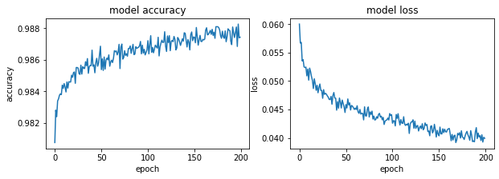

#### SGD - 0.1


```python
optimizer= tf.keras.optimizers.SGD(learning_rate=0.1)
model.compile(optimizer=optimizer,
              loss='sparse_categorical_crossentropy',
              metrics=['accuracy'])

history = model.fit(x_train, y_train, epochs=200)
model.evaluate(x_test,  y_test, verbose=2)
```


```python
fig, (ax1, ax2) = plt.subplots(1, 2, figsize=(10, 3))

#ax1.subplot(1, 2, 1)
ax1.plot(history.history['accuracy'])
#plt.plot(history.history['val_accuracy'])
ax1.set_title('model accuracy')
ax1.set_ylabel('accuracy')
ax1.set_xlabel('epoch')
#ax1.show()

#ax2.subplot(1, 2, 2)
ax2.plot(history.history['loss'])
#plt.plot(history.history['val_loss'])
ax2.set_title('model loss')
ax2.set_ylabel('loss')
ax2.set_xlabel('epoch')
```

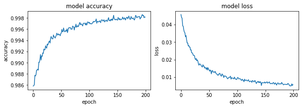

#### SGD - 0.5


```python
optimizer= tf.keras.optimizers.SGD(learning_rate=0.5)
model.compile(optimizer=optimizer,
              loss='sparse_categorical_crossentropy',
              metrics=['accuracy'])

history = model.fit(x_train, y_train, epochs=200)
model.evaluate(x_test,  y_test, verbose=2)
```


```python
fig, (ax1, ax2) = plt.subplots(1, 2, figsize=(10, 3))

#ax1.subplot(1, 2, 1)
ax1.plot(history.history['accuracy'])
#plt.plot(history.history['val_accuracy'])
ax1.set_title('model accuracy')
ax1.set_ylabel('accuracy')
ax1.set_xlabel('epoch')
#ax1.show()

#ax2.subplot(1, 2, 2)
ax2.plot(history.history['loss'])
#plt.plot(history.history['val_loss'])
ax2.set_title('model loss')
ax2.set_ylabel('loss')
ax2.set_xlabel('epoch')
```


#### SGD - 0.9


```python
optimizer= tf.keras.optimizers.SGD(learning_rate=0.9)
model.compile(optimizer=optimizer,
              loss='sparse_categorical_crossentropy',
              metrics=['accuracy'])

history = model.fit(x_train, y_train, epochs=200)
model.evaluate(x_test,  y_test, verbose=2)
```


```python
fig, (ax1, ax2) = plt.subplots(1, 2, figsize=(10, 3))

#ax1.subplot(1, 2, 1)
ax1.plot(history.history['accuracy'])
#plt.plot(history.history['val_accuracy'])
ax1.set_title('model accuracy')
ax1.set_ylabel('accuracy')
ax1.set_xlabel('epoch')
#ax1.show()

#ax2.subplot(1, 2, 2)
ax2.plot(history.history['loss'])
#plt.plot(history.history['val_loss'])
ax2.set_title('model loss')
ax2.set_ylabel('loss')
ax2.set_xlabel('epoch')
```


#### SGD - 1.5


```python
optimizer= tf.keras.optimizers.SGD(learning_rate=1.5)
model.compile(optimizer=optimizer,
              loss='sparse_categorical_crossentropy',
              metrics=['accuracy'])

history = model.fit(x_train, y_train, epochs=200)
model.evaluate(x_test,  y_test, verbose=2)
```


```python
fig, (ax1, ax2) = plt.subplots(1, 2, figsize=(10, 3))

#ax1.subplot(1, 2, 1)
ax1.plot(history.history['accuracy'])
#plt.plot(history.history['val_accuracy'])
ax1.set_title('model accuracy')
ax1.set_ylabel('accuracy')
ax1.set_xlabel('epoch')
#ax1.show()

#ax2.subplot(1, 2, 2)
ax2.plot(history.history['loss'])
#plt.plot(history.history['val_loss'])
ax2.set_title('model loss')
ax2.set_ylabel('loss')
ax2.set_xlabel('epoch')
```


#### RSMprop - 0.001


```python
optimizer= tf.keras.optimizers.RMSprop(learning_rate=0.001)
model.compile(optimizer=optimizer,
              loss='sparse_categorical_crossentropy',
              metrics=['accuracy'])

history = model.fit(x_train, y_train, epochs=200)
model.evaluate(x_test,  y_test, verbose=2)
```


```python
fig, (ax1, ax2) = plt.subplots(1, 2, figsize=(10, 3))

#ax1.subplot(1, 2, 1)
ax1.plot(history.history['accuracy'])
#plt.plot(history.history['val_accuracy'])
ax1.set_title('model accuracy')
ax1.set_ylabel('accuracy')
ax1.set_xlabel('epoch')
#ax1.show()

#ax2.subplot(1, 2, 2)
ax2.plot(history.history['loss'])
#plt.plot(history.history['val_loss'])
ax2.set_title('model loss')
ax2.set_ylabel('loss')
ax2.set_xlabel('epoch')
```


#### RSMprop - 0.1


```python
optimizer= tf.keras.optimizers.RMSprop(learning_rate=0.1)
model.compile(optimizer=optimizer,
              loss='sparse_categorical_crossentropy',
              metrics=['accuracy'])

history = model.fit(x_train, y_train, epochs=200)
model.evaluate(x_test,  y_test, verbose=2)
```


```python
fig, (ax1, ax2) = plt.subplots(1, 2, figsize=(10, 3))

#ax1.subplot(1, 2, 1)
ax1.plot(history.history['accuracy'])
#plt.plot(history.history['val_accuracy'])
ax1.set_title('model accuracy')
ax1.set_ylabel('accuracy')
ax1.set_xlabel('epoch')
#ax1.show()

#ax2.subplot(1, 2, 2)
ax2.plot(history.history['loss'])
#plt.plot(history.history['val_loss'])
ax2.set_title('model loss')
ax2.set_ylabel('loss')
ax2.set_xlabel('epoch')
```


#### RSMprop - 0.5


```python
optimizer= tf.keras.optimizers.RMSprop(learning_rate=0.5)
model.compile(optimizer=optimizer,
              loss='sparse_categorical_crossentropy',
              metrics=['accuracy'])

history = model.fit(x_train, y_train, epochs=200)
model.evaluate(x_test,  y_test, verbose=2)
```


```python
fig, (ax1, ax2) = plt.subplots(1, 2, figsize=(10, 3))

#ax1.subplot(1, 2, 1)
ax1.plot(history.history['accuracy'])
#plt.plot(history.history['val_accuracy'])
ax1.set_title('model accuracy')
ax1.set_ylabel('accuracy')
ax1.set_xlabel('epoch')
#ax1.show()

#ax2.subplot(1, 2, 2)
ax2.plot(history.history['loss'])
#plt.plot(history.history['val_loss'])
ax2.set_title('model loss')
ax2.set_ylabel('loss')
ax2.set_xlabel('epoch')
```


#### RSMprop - 0.9


```python
optimizer= tf.keras.optimizers.RMSprop(learning_rate=0.9)
model.compile(optimizer=optimizer,
              loss='sparse_categorical_crossentropy',
              metrics=['accuracy'])

history = model.fit(x_train, y_train, epochs=200)
model.evaluate(x_test,  y_test, verbose=2)
```

    Epoch 1/200
    1875/1875 [==============================] - 2s 1ms/step - loss: 1.3797 - accuracy: 0.7897
    Epoch 2/200
    1875/1875 [==============================] - 2s 1ms/step - loss: 1.4620 - accuracy: 0.7704
    Epoch 3/200
    1875/1875 [==============================] - 2s 1ms/step - loss: 1.9441 - accuracy: 0.7691
    Epoch 4/200
    1875/1875 [==============================] - 2s 1ms/step - loss: 1.9845 - accuracy: 0.7473
    Epoch 5/200
    1875/1875 [==============================] - 3s 1ms/step - loss: 2.0554 - accuracy: 0.7536
    Epoch 6/200
    1875/1875 [==============================] - 2s 1ms/step - loss: 1.9489 - accuracy: 0.7321
    Epoch 7/200
    1875/1875 [==============================] - 2s 1ms/step - loss: 1.3544 - accuracy: 0.7269
    Epoch 8/200
    1875/1875 [==============================] - 2s 1ms/step - loss: 2.2296 - accuracy: 0.7175
    Epoch 9/200
    1875/1875 [==============================] - 2s 1ms/step - loss: 1.9907 - accuracy: 0.7244
    Epoch 10/200
    1875/1875 [==============================] - 2s 1ms/step - loss: 2.2879 - accuracy: 0.7261
    Epoch 11/200
    1875/1875 [==============================] - 2s 1ms/step - loss: 2.0791 - accuracy: 0.7197
    Epoch 12/200
    1875/1875 [==============================] - 2s 1ms/step - loss: 2.1849 - accuracy: 0.7171
    Epoch 13/200
    1875/1875 [==============================] - 2s 1ms/step - loss: 1.5610 - accuracy: 0.7154
    Epoch 14/200
    1875/1875 [==============================] - 3s 1ms/step - loss: 1.8966 - accuracy: 0.7177
    Epoch 15/200
    1875/1875 [==============================] - 2s 1ms/step - loss: 2.0215 - accuracy: 0.7153
    Epoch 16/200
    1875/1875 [==============================] - 2s 1ms/step - loss: 2.2150 - accuracy: 0.7082
    Epoch 17/200
    1875/1875 [==============================] - 2s 1ms/step - loss: 1.5897 - accuracy: 0.6958
    Epoch 18/200
    1875/1875 [==============================] - 2s 1ms/step - loss: 1.7334 - accuracy: 0.7067
    Epoch 19/200
    1875/1875 [==============================] - 2s 1ms/step - loss: 1.3261 - accuracy: 0.7070
    Epoch 20/200
    1875/1875 [==============================] - 2s 1ms/step - loss: 1.5175 - accuracy: 0.7143
    Epoch 21/200
    1875/1875 [==============================] - 2s 1ms/step - loss: 1.8672 - accuracy: 0.7253
    Epoch 22/200
    1875/1875 [==============================] - 2s 1ms/step - loss: 2.0225 - accuracy: 0.7265
    Epoch 23/200
    1875/1875 [==============================] - 3s 1ms/step - loss: 1.7347 - accuracy: 0.7194
    Epoch 24/200
    1875/1875 [==============================] - 3s 1ms/step - loss: 1.7096 - accuracy: 0.7104
    Epoch 25/200
    1875/1875 [==============================] - 2s 1ms/step - loss: 1.6758 - accuracy: 0.7006
    Epoch 26/200
    1875/1875 [==============================] - 2s 1ms/step - loss: 1.7159 - accuracy: 0.7036
    Epoch 27/200
    1875/1875 [==============================] - 2s 1ms/step - loss: 1.6806 - accuracy: 0.7189
    Epoch 28/200
    1875/1875 [==============================] - 3s 1ms/step - loss: 1.8530 - accuracy: 0.7159
    Epoch 29/200
    1875/1875 [==============================] - 2s 1ms/step - loss: 1.7362 - accuracy: 0.7094
    Epoch 30/200
    1875/1875 [==============================] - 2s 1ms/step - loss: 2.0376 - accuracy: 0.6993
    Epoch 31/200
    1875/1875 [==============================] - 2s 1ms/step - loss: 2.0559 - accuracy: 0.7138
    Epoch 32/200
    1875/1875 [==============================] - 2s 1ms/step - loss: 1.9267 - accuracy: 0.7145
    Epoch 33/200
    1875/1875 [==============================] - 2s 1ms/step - loss: 1.9214 - accuracy: 0.7125
    Epoch 34/200
    1875/1875 [==============================] - 2s 1ms/step - loss: 1.9345 - accuracy: 0.7181
    Epoch 35/200
    1875/1875 [==============================] - 2s 1ms/step - loss: 1.6629 - accuracy: 0.7218
    Epoch 36/200
    1875/1875 [==============================] - 2s 1ms/step - loss: 1.6178 - accuracy: 0.7142
    Epoch 37/200
    1875/1875 [==============================] - 2s 1ms/step - loss: 1.6115 - accuracy: 0.7131
    Epoch 38/200
    1875/1875 [==============================] - 2s 1ms/step - loss: 1.7772 - accuracy: 0.7186
    Epoch 39/200
    1875/1875 [==============================] - 2s 1ms/step - loss: 2.1335 - accuracy: 0.7210
    Epoch 40/200
    1875/1875 [==============================] - 2s 1ms/step - loss: 1.6833 - accuracy: 0.7247
    Epoch 41/200
    1875/1875 [==============================] - 2s 1ms/step - loss: 1.5027 - accuracy: 0.7205
    Epoch 42/200
    1875/1875 [==============================] - 2s 1ms/step - loss: 1.8214 - accuracy: 0.7262
    Epoch 43/200
    1875/1875 [==============================] - 2s 1ms/step - loss: 1.8856 - accuracy: 0.7281
    Epoch 44/200
    1875/1875 [==============================] - 2s 1ms/step - loss: 1.6700 - accuracy: 0.7275
    Epoch 45/200
    1875/1875 [==============================] - 2s 1ms/step - loss: 1.2634 - accuracy: 0.7280
    Epoch 46/200
    1875/1875 [==============================] - 3s 1ms/step - loss: 1.6489 - accuracy: 0.7334
    Epoch 47/200
    1875/1875 [==============================] - 2s 1ms/step - loss: 1.5987 - accuracy: 0.7374
    Epoch 48/200
    1875/1875 [==============================] - 2s 1ms/step - loss: 1.6874 - accuracy: 0.7334
    Epoch 49/200
    1875/1875 [==============================] - 2s 1ms/step - loss: 1.5700 - accuracy: 0.7369
    Epoch 50/200
    1875/1875 [==============================] - 2s 1ms/step - loss: 1.8751 - accuracy: 0.7375
    Epoch 51/200
    1875/1875 [==============================] - 2s 1ms/step - loss: 1.4655 - accuracy: 0.7302
    Epoch 52/200
    1875/1875 [==============================] - 2s 1ms/step - loss: 1.7420 - accuracy: 0.7361
    Epoch 53/200
    1875/1875 [==============================] - 2s 1ms/step - loss: 1.5751 - accuracy: 0.7347
    Epoch 54/200
    1875/1875 [==============================] - 2s 1ms/step - loss: 1.9819 - accuracy: 0.7289
    Epoch 55/200
    1875/1875 [==============================] - 3s 1ms/step - loss: 1.9025 - accuracy: 0.7173
    Epoch 56/200
    1875/1875 [==============================] - 2s 1ms/step - loss: 1.5549 - accuracy: 0.7324
    Epoch 57/200
    1875/1875 [==============================] - 2s 1ms/step - loss: 1.3834 - accuracy: 0.7358
    Epoch 58/200
    1875/1875 [==============================] - 2s 1ms/step - loss: 1.3977 - accuracy: 0.7382
    Epoch 59/200
    1875/1875 [==============================] - 2s 1ms/step - loss: 1.6205 - accuracy: 0.7388
    Epoch 60/200
    1875/1875 [==============================] - 2s 1ms/step - loss: 1.4552 - accuracy: 0.7369
    Epoch 61/200
    1875/1875 [==============================] - 2s 1ms/step - loss: 1.8435 - accuracy: 0.7381
    Epoch 62/200
    1875/1875 [==============================] - 2s 1ms/step - loss: 1.8537 - accuracy: 0.7361
    Epoch 63/200
    1875/1875 [==============================] - 2s 1ms/step - loss: 1.4171 - accuracy: 0.7304
    Epoch 64/200
    1875/1875 [==============================] - 2s 1ms/step - loss: 1.6380 - accuracy: 0.7252
    Epoch 65/200
    1875/1875 [==============================] - 2s 1ms/step - loss: 1.5724 - accuracy: 0.7280
    Epoch 66/200
    1875/1875 [==============================] - 2s 1ms/step - loss: 1.9487 - accuracy: 0.7225
    Epoch 67/200
    1875/1875 [==============================] - 2s 1ms/step - loss: 2.1925 - accuracy: 0.7293
    Epoch 68/200
    1875/1875 [==============================] - 2s 1ms/step - loss: 2.0898 - accuracy: 0.7266
    Epoch 69/200
    1875/1875 [==============================] - 2s 1ms/step - loss: 1.9402 - accuracy: 0.7289
    Epoch 70/200
    1875/1875 [==============================] - 2s 1ms/step - loss: 2.4458 - accuracy: 0.7265
    Epoch 71/200
    1875/1875 [==============================] - 2s 1ms/step - loss: 1.3018 - accuracy: 0.7200
    Epoch 72/200
    1875/1875 [==============================] - 2s 1ms/step - loss: 1.7125 - accuracy: 0.7336
    Epoch 73/200
    1875/1875 [==============================] - 2s 1ms/step - loss: 1.3892 - accuracy: 0.7249
    Epoch 74/200
    1875/1875 [==============================] - 2s 1ms/step - loss: 1.2866 - accuracy: 0.7281
    Epoch 75/200
    1875/1875 [==============================] - 2s 1ms/step - loss: 1.5933 - accuracy: 0.7371
    Epoch 76/200
    1875/1875 [==============================] - 2s 1ms/step - loss: 1.7798 - accuracy: 0.7397
    Epoch 77/200
    1875/1875 [==============================] - 2s 1ms/step - loss: 1.4742 - accuracy: 0.7306
    Epoch 78/200
    1875/1875 [==============================] - 2s 1ms/step - loss: 1.4132 - accuracy: 0.7317
    Epoch 79/200
    1875/1875 [==============================] - 3s 1ms/step - loss: 1.3912 - accuracy: 0.7273
    Epoch 80/200
    1875/1875 [==============================] - 2s 1ms/step - loss: 1.6382 - accuracy: 0.7227
    Epoch 81/200
    1875/1875 [==============================] - 2s 1ms/step - loss: 1.4104 - accuracy: 0.7229
    Epoch 82/200
    1875/1875 [==============================] - 2s 1ms/step - loss: 1.7381 - accuracy: 0.7228
    Epoch 83/200
    1875/1875 [==============================] - 3s 1ms/step - loss: 1.6877 - accuracy: 0.7318
    Epoch 84/200
    1875/1875 [==============================] - 2s 1ms/step - loss: 1.2728 - accuracy: 0.7245
    Epoch 85/200
    1875/1875 [==============================] - 2s 1ms/step - loss: 1.6330 - accuracy: 0.7292
    Epoch 86/200
    1875/1875 [==============================] - 2s 1ms/step - loss: 1.7778 - accuracy: 0.7305
    Epoch 87/200
    1875/1875 [==============================] - 2s 1ms/step - loss: 1.5275 - accuracy: 0.7273
    Epoch 88/200
    1875/1875 [==============================] - 3s 1ms/step - loss: 1.5448 - accuracy: 0.7222
    Epoch 89/200
    1875/1875 [==============================] - 2s 1ms/step - loss: 1.3837 - accuracy: 0.7138
    Epoch 90/200
    1875/1875 [==============================] - 2s 1ms/step - loss: 1.1716 - accuracy: 0.7213
    Epoch 91/200
    1875/1875 [==============================] - 2s 1ms/step - loss: 1.2599 - accuracy: 0.7256
    Epoch 92/200
    1875/1875 [==============================] - 2s 1ms/step - loss: 1.8016 - accuracy: 0.7392
    Epoch 93/200
    1875/1875 [==============================] - 2s 1ms/step - loss: 1.4725 - accuracy: 0.7421
    Epoch 94/200
    1875/1875 [==============================] - 2s 1ms/step - loss: 1.8027 - accuracy: 0.7368
    Epoch 95/200
    1875/1875 [==============================] - 2s 1ms/step - loss: 1.3183 - accuracy: 0.7257
    Epoch 96/200
    1875/1875 [==============================] - 2s 1ms/step - loss: 1.6648 - accuracy: 0.7342
    Epoch 97/200
    1875/1875 [==============================] - 3s 1ms/step - loss: 1.3735 - accuracy: 0.7372
    Epoch 98/200
    1875/1875 [==============================] - 2s 1ms/step - loss: 1.3453 - accuracy: 0.7351
    Epoch 99/200
    1875/1875 [==============================] - 2s 1ms/step - loss: 1.6614 - accuracy: 0.7349
    Epoch 100/200
    1875/1875 [==============================] - 2s 1ms/step - loss: 1.1467 - accuracy: 0.7293
    Epoch 101/200
    1875/1875 [==============================] - 2s 1ms/step - loss: 1.4037 - accuracy: 0.7290
    Epoch 102/200
    1875/1875 [==============================] - 3s 1ms/step - loss: 1.2329 - accuracy: 0.7347
    Epoch 103/200
    1875/1875 [==============================] - 2s 1ms/step - loss: 1.2211 - accuracy: 0.7323
    Epoch 104/200
    1875/1875 [==============================] - 2s 1ms/step - loss: 1.3056 - accuracy: 0.7359
    Epoch 105/200
    1875/1875 [==============================] - 2s 1ms/step - loss: 1.1885 - accuracy: 0.7232
    Epoch 106/200
    1875/1875 [==============================] - 2s 1ms/step - loss: 1.3430 - accuracy: 0.7352
    Epoch 107/200
    1875/1875 [==============================] - 2s 1ms/step - loss: 1.5092 - accuracy: 0.7356
    Epoch 108/200
    1875/1875 [==============================] - 2s 1ms/step - loss: 1.2452 - accuracy: 0.7339
    Epoch 109/200
    1875/1875 [==============================] - 2s 1ms/step - loss: 1.3310 - accuracy: 0.7243
    Epoch 110/200
    1875/1875 [==============================] - 2s 1ms/step - loss: 1.1953 - accuracy: 0.7258
    Epoch 111/200
    1875/1875 [==============================] - 2s 1ms/step - loss: 1.4930 - accuracy: 0.7304
    Epoch 112/200
    1875/1875 [==============================] - 2s 1ms/step - loss: 1.1941 - accuracy: 0.7330
    Epoch 113/200
    1875/1875 [==============================] - 2s 1ms/step - loss: 1.3586 - accuracy: 0.7409
    Epoch 114/200
    1875/1875 [==============================] - 2s 1ms/step - loss: 1.2327 - accuracy: 0.7419
    Epoch 115/200
    1875/1875 [==============================] - 2s 1ms/step - loss: 1.4959 - accuracy: 0.7402
    Epoch 116/200
    1875/1875 [==============================] - 2s 1ms/step - loss: 1.4859 - accuracy: 0.7374
    Epoch 117/200
    1875/1875 [==============================] - 2s 1ms/step - loss: 1.5729 - accuracy: 0.7397
    Epoch 118/200
    1875/1875 [==============================] - 2s 1ms/step - loss: 1.3524 - accuracy: 0.7354
    Epoch 119/200
    1875/1875 [==============================] - 2s 1ms/step - loss: 1.4378 - accuracy: 0.7348
    Epoch 120/200
    1875/1875 [==============================] - 3s 1ms/step - loss: 1.4837 - accuracy: 0.7367
    Epoch 121/200
    1875/1875 [==============================] - 2s 1ms/step - loss: 1.1815 - accuracy: 0.7321
    Epoch 122/200
    1875/1875 [==============================] - 2s 1ms/step - loss: 1.2692 - accuracy: 0.7382
    Epoch 123/200
    1875/1875 [==============================] - 2s 1ms/step - loss: 1.3534 - accuracy: 0.7304
    Epoch 124/200
    1875/1875 [==============================] - 2s 1ms/step - loss: 1.4661 - accuracy: 0.7303
    Epoch 125/200
    1875/1875 [==============================] - 2s 1ms/step - loss: 1.4864 - accuracy: 0.7299
    Epoch 126/200
    1875/1875 [==============================] - 2s 1ms/step - loss: 1.4065 - accuracy: 0.7276
    Epoch 127/200
    1875/1875 [==============================] - 2s 1ms/step - loss: 1.2957 - accuracy: 0.7276
    Epoch 128/200
    1875/1875 [==============================] - 2s 1ms/step - loss: 1.2953 - accuracy: 0.7316
    Epoch 129/200
    1875/1875 [==============================] - 2s 1ms/step - loss: 1.2352 - accuracy: 0.7431
    Epoch 130/200
    1875/1875 [==============================] - 2s 1ms/step - loss: 1.1000 - accuracy: 0.7357
    Epoch 131/200
    1875/1875 [==============================] - 2s 1ms/step - loss: 1.3736 - accuracy: 0.7391
    Epoch 132/200
    1875/1875 [==============================] - 2s 1ms/step - loss: 1.2278 - accuracy: 0.7357
    Epoch 133/200
    1875/1875 [==============================] - 2s 1ms/step - loss: 1.3588 - accuracy: 0.7397
    Epoch 134/200
    1875/1875 [==============================] - 2s 1ms/step - loss: 1.2805 - accuracy: 0.7387
    Epoch 135/200
    1875/1875 [==============================] - 2s 1ms/step - loss: 1.3318 - accuracy: 0.7440
    Epoch 136/200
    1875/1875 [==============================] - 2s 1ms/step - loss: 1.3219 - accuracy: 0.7478
    Epoch 137/200
    1875/1875 [==============================] - 2s 1ms/step - loss: 1.4950 - accuracy: 0.7412
    Epoch 138/200
    1875/1875 [==============================] - 3s 1ms/step - loss: 1.2237 - accuracy: 0.7395
    Epoch 139/200
    1875/1875 [==============================] - 2s 1ms/step - loss: 1.3297 - accuracy: 0.7414
    Epoch 140/200
    1875/1875 [==============================] - 2s 1ms/step - loss: 1.1826 - accuracy: 0.7396
    Epoch 141/200
    1875/1875 [==============================] - 2s 1ms/step - loss: 1.3419 - accuracy: 0.7443
    Epoch 142/200
    1875/1875 [==============================] - 2s 1ms/step - loss: 1.5399 - accuracy: 0.7473
    Epoch 143/200
    1875/1875 [==============================] - 2s 1ms/step - loss: 1.3761 - accuracy: 0.7477
    Epoch 144/200
    1875/1875 [==============================] - 2s 1ms/step - loss: 1.6452 - accuracy: 0.7468
    Epoch 145/200
    1875/1875 [==============================] - 2s 1ms/step - loss: 1.3819 - accuracy: 0.7491
    Epoch 146/200
    1875/1875 [==============================] - 2s 1ms/step - loss: 1.3907 - accuracy: 0.7498
    Epoch 147/200
    1875/1875 [==============================] - 2s 1ms/step - loss: 1.9263 - accuracy: 0.7456
    Epoch 148/200
    1875/1875 [==============================] - 2s 1ms/step - loss: 1.3046 - accuracy: 0.7427
    Epoch 149/200
    1875/1875 [==============================] - 2s 1ms/step - loss: 1.2399 - accuracy: 0.7390
    Epoch 150/200
    1875/1875 [==============================] - 2s 1ms/step - loss: 1.2767 - accuracy: 0.7411
    Epoch 151/200
    1875/1875 [==============================] - 2s 1ms/step - loss: 1.3651 - accuracy: 0.7468
    Epoch 152/200
    1875/1875 [==============================] - 2s 1ms/step - loss: 1.5736 - accuracy: 0.7519
    Epoch 153/200
    1875/1875 [==============================] - 2s 1ms/step - loss: 1.4019 - accuracy: 0.7563
    Epoch 154/200
    1875/1875 [==============================] - 2s 1ms/step - loss: 1.2835 - accuracy: 0.7496
    Epoch 155/200
    1875/1875 [==============================] - 2s 1ms/step - loss: 1.1795 - accuracy: 0.7498
    Epoch 156/200
    1875/1875 [==============================] - 2s 1ms/step - loss: 1.0662 - accuracy: 0.7446
    Epoch 157/200
    1875/1875 [==============================] - 3s 1ms/step - loss: 1.1385 - accuracy: 0.7408
    Epoch 158/200
    1875/1875 [==============================] - 2s 1ms/step - loss: 1.0170 - accuracy: 0.7423
    Epoch 159/200
    1875/1875 [==============================] - 2s 1ms/step - loss: 0.9866 - accuracy: 0.7419
    Epoch 160/200
    1875/1875 [==============================] - 2s 1ms/step - loss: 1.0467 - accuracy: 0.7416
    Epoch 161/200
    1875/1875 [==============================] - 3s 1ms/step - loss: 1.3893 - accuracy: 0.7498: 0s
    Epoch 162/200
    1875/1875 [==============================] - 2s 1ms/step - loss: 1.5140 - accuracy: 0.7438
    Epoch 163/200
    1875/1875 [==============================] - 2s 1ms/step - loss: 1.1800 - accuracy: 0.7399
    Epoch 164/200
    1875/1875 [==============================] - 2s 1ms/step - loss: 0.9174 - accuracy: 0.7429
    Epoch 165/200
    1875/1875 [==============================] - 2s 1ms/step - loss: 1.4443 - accuracy: 0.7517
    Epoch 166/200
    1875/1875 [==============================] - 2s 1ms/step - loss: 1.1746 - accuracy: 0.7453
    Epoch 167/200
    1875/1875 [==============================] - 2s 1ms/step - loss: 1.0478 - accuracy: 0.7462
    Epoch 168/200
    1875/1875 [==============================] - 2s 1ms/step - loss: 1.1016 - accuracy: 0.7469
    Epoch 169/200
    1875/1875 [==============================] - 2s 1ms/step - loss: 1.0515 - accuracy: 0.7501
    Epoch 170/200
    1875/1875 [==============================] - 2s 1ms/step - loss: 0.9947 - accuracy: 0.7485
    Epoch 171/200
    1875/1875 [==============================] - 2s 1ms/step - loss: 1.0650 - accuracy: 0.7493
    Epoch 172/200
    1875/1875 [==============================] - 2s 1ms/step - loss: 1.1990 - accuracy: 0.7472
    Epoch 173/200
    1875/1875 [==============================] - 2s 1ms/step - loss: 1.1353 - accuracy: 0.7506
    Epoch 174/200
    1875/1875 [==============================] - 2s 1ms/step - loss: 1.1331 - accuracy: 0.7465
    Epoch 175/200
    1875/1875 [==============================] - 2s 1ms/step - loss: 1.2678 - accuracy: 0.7466
    Epoch 176/200
    1875/1875 [==============================] - 2s 1ms/step - loss: 1.1694 - accuracy: 0.7441
    Epoch 177/200
    1875/1875 [==============================] - 2s 1ms/step - loss: 1.2474 - accuracy: 0.7545
    Epoch 178/200
    1875/1875 [==============================] - 2s 1ms/step - loss: 1.1374 - accuracy: 0.7522
    Epoch 179/200
    1875/1875 [==============================] - 3s 1ms/step - loss: 1.2451 - accuracy: 0.7537
    Epoch 180/200
    1875/1875 [==============================] - 2s 1ms/step - loss: 1.1241 - accuracy: 0.7491
    Epoch 181/200
    1875/1875 [==============================] - 2s 1ms/step - loss: 1.0049 - accuracy: 0.7478
    Epoch 182/200
    1875/1875 [==============================] - 2s 1ms/step - loss: 1.1154 - accuracy: 0.7515
    Epoch 183/200
    1875/1875 [==============================] - 2s 1ms/step - loss: 1.2127 - accuracy: 0.7532
    Epoch 184/200
    1875/1875 [==============================] - 3s 1ms/step - loss: 1.2135 - accuracy: 0.7502
    Epoch 185/200
    1875/1875 [==============================] - 2s 1ms/step - loss: 1.4864 - accuracy: 0.7505
    Epoch 186/200
    1875/1875 [==============================] - 2s 1ms/step - loss: 1.2227 - accuracy: 0.7490
    Epoch 187/200
    1875/1875 [==============================] - 2s 1ms/step - loss: 0.9563 - accuracy: 0.7492
    Epoch 188/200
    1875/1875 [==============================] - 2s 1ms/step - loss: 1.2192 - accuracy: 0.7463
    Epoch 189/200
    1875/1875 [==============================] - 2s 1ms/step - loss: 1.1268 - accuracy: 0.7452
    Epoch 190/200
    1875/1875 [==============================] - 2s 1ms/step - loss: 1.3682 - accuracy: 0.7458
    Epoch 191/200
    1875/1875 [==============================] - 2s 1ms/step - loss: 1.4488 - accuracy: 0.7425
    Epoch 192/200
    1875/1875 [==============================] - 2s 1ms/step - loss: 1.2527 - accuracy: 0.7443
    Epoch 193/200
    1875/1875 [==============================] - 3s 1ms/step - loss: 0.9995 - accuracy: 0.7414
    Epoch 194/200
    1875/1875 [==============================] - 2s 1ms/step - loss: 1.0140 - accuracy: 0.7446
    Epoch 195/200
    1875/1875 [==============================] - 2s 1ms/step - loss: 1.0598 - accuracy: 0.7453
    Epoch 196/200
    1875/1875 [==============================] - 2s 1ms/step - loss: 0.8197 - accuracy: 0.7464
    Epoch 197/200
    1875/1875 [==============================] - 3s 1ms/step - loss: 0.9809 - accuracy: 0.7485
    Epoch 198/200
    1875/1875 [==============================] - 2s 1ms/step - loss: 1.0963 - accuracy: 0.7454
    Epoch 199/200
    1875/1875 [==============================] - 2s 1ms/step - loss: 0.9183 - accuracy: 0.7529
    Epoch 200/200
    1875/1875 [==============================] - 2s 1ms/step - loss: 1.1293 - accuracy: 0.7528
    313/313 - 0s - loss: 15.1154 - accuracy: 0.7865
    


    [15.115407943725586, 0.7864999771118164]


```python
fig, (ax1, ax2) = plt.subplots(1, 2, figsize=(10, 3))

#ax1.subplot(1, 2, 1)
ax1.plot(history.history['accuracy'])
#plt.plot(history.history['val_accuracy'])
ax1.set_title('model accuracy')
ax1.set_ylabel('accuracy')
ax1.set_xlabel('epoch')
#ax1.show()

#ax2.subplot(1, 2, 2)
ax2.plot(history.history['loss'])
#plt.plot(history.history['val_loss'])
ax2.set_title('model loss')
ax2.set_ylabel('loss')
ax2.set_xlabel('epoch')
```


#### RSMprop - 1.5


```python
optimizer= tf.keras.optimizers.RMSprop(learning_rate=1.5)
model.compile(optimizer=optimizer,
              loss='sparse_categorical_crossentropy',
              metrics=['accuracy'])
#history = model.fit(X, Y, validation_split=0.33, epochs=150, batch_size=10, verbose=0)
history = model.fit(x_train, y_train, epochs=200)
model.evaluate(x_test,  y_test, verbose=2)
```


```python
fig, (ax1, ax2) = plt.subplots(1, 2, figsize=(10, 3))

#ax1.subplot(1, 2, 1)
ax1.plot(history.history['accuracy'])
#plt.plot(history.history['val_accuracy'])
ax1.set_title('model accuracy')
ax1.set_ylabel('accuracy')
ax1.set_xlabel('epoch')
#ax1.show()

#ax2.subplot(1, 2, 2)
ax2.plot(history.history['loss'])
#plt.plot(history.history['val_loss'])
ax2.set_title('model loss')
ax2.set_ylabel('loss')
ax2.set_xlabel('epoch')
```


#### Adagram - 0.001


```python
optimizer= tf.keras.optimizers.Adagrad(learning_rate=0.001)
model.compile(optimizer=optimizer,
              loss='sparse_categorical_crossentropy',
              metrics=['accuracy'])
#history = model.fit(X, Y, validation_split=0.33, epochs=150, batch_size=10, verbose=0)
history = model.fit(x_train, y_train, epochs=200)
model.evaluate(x_test,  y_test, verbose=2)
```


```python
fig, (ax1, ax2) = plt.subplots(1, 2, figsize=(10, 3))

#ax1.subplot(1, 2, 1)
ax1.plot(history.history['accuracy'])
#plt.plot(history.history['val_accuracy'])
ax1.set_title('model accuracy')
ax1.set_ylabel('accuracy')
ax1.set_xlabel('epoch')
#ax1.show()

#ax2.subplot(1, 2, 2)
ax2.plot(history.history['loss'])
#plt.plot(history.history['val_loss'])
ax2.set_title('model loss')
ax2.set_ylabel('loss')
ax2.set_xlabel('epoch')
```


#### Adagram - 0.1


```python
optimizer= tf.keras.optimizers.Adagrad(learning_rate=0.1)
model.compile(optimizer=optimizer,
              loss='sparse_categorical_crossentropy',
              metrics=['accuracy'])
#history = model.fit(X, Y, validation_split=0.33, epochs=150, batch_size=10, verbose=0)
history = model.fit(x_train, y_train, epochs=200)
model.evaluate(x_test,  y_test, verbose=2)
```


```python
fig, (ax1, ax2) = plt.subplots(1, 2, figsize=(10, 3))

#ax1.subplot(1, 2, 1)
ax1.plot(history.history['accuracy'])
#plt.plot(history.history['val_accuracy'])
ax1.set_title('model accuracy')
ax1.set_ylabel('accuracy')
ax1.set_xlabel('epoch')
#ax1.show()

#ax2.subplot(1, 2, 2)
ax2.plot(history.history['loss'])
#plt.plot(history.history['val_loss'])
ax2.set_title('model loss')
ax2.set_ylabel('loss')
ax2.set_xlabel('epoch')
```


#### Adagram - 0.5


```python
optimizer= tf.keras.optimizers.Adagrad(learning_rate=0.5)
model.compile(optimizer=optimizer,
              loss='sparse_categorical_crossentropy',
              metrics=['accuracy'])
#history = model.fit(X, Y, validation_split=0.33, epochs=150, batch_size=10, verbose=0)
history = model.fit(x_train, y_train, epochs=200)
model.evaluate(x_test,  y_test, verbose=2)
```


```python
fig, (ax1, ax2) = plt.subplots(1, 2, figsize=(10, 3))

#ax1.subplot(1, 2, 1)
ax1.plot(history.history['accuracy'])
#plt.plot(history.history['val_accuracy'])
ax1.set_title('model accuracy')
ax1.set_ylabel('accuracy')
ax1.set_xlabel('epoch')
#ax1.show()

#ax2.subplot(1, 2, 2)
ax2.plot(history.history['loss'])
#plt.plot(history.history['val_loss'])
ax2.set_title('model loss')
ax2.set_ylabel('loss')
ax2.set_xlabel('epoch')
```

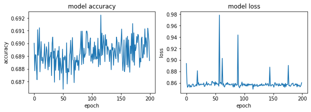

#### Adagram - 0.9


```python
optimizer= tf.keras.optimizers.Adagrad(learning_rate=0.9)
model.compile(optimizer=optimizer,
              loss='sparse_categorical_crossentropy',
              metrics=['accuracy'])
#history = model.fit(X, Y, validation_split=0.33, epochs=150, batch_size=10, verbose=0)
history = model.fit(x_train, y_train, epochs=200)
model.evaluate(x_test,  y_test, verbose=2)
```


```python
fig, (ax1, ax2) = plt.subplots(1, 2, figsize=(10, 3))

#ax1.subplot(1, 2, 1)
ax1.plot(history.history['accuracy'])
#plt.plot(history.history['val_accuracy'])
ax1.set_title('model accuracy')
ax1.set_ylabel('accuracy')
ax1.set_xlabel('epoch')
#ax1.show()

#ax2.subplot(1, 2, 2)
ax2.plot(history.history['loss'])
#plt.plot(history.history['val_loss'])
ax2.set_title('model loss')
ax2.set_ylabel('loss')
ax2.set_xlabel('epoch')
```


#### Adagram - 1.5


```python
optimizer= tf.keras.optimizers.Adagrad(learning_rate=1.5)
model.compile(optimizer=optimizer,
              loss='sparse_categorical_crossentropy',
              metrics=['accuracy'])
#history = model.fit(X, Y, validation_split=0.33, epochs=150, batch_size=10, verbose=0)
history = model.fit(x_train, y_train, epochs=200)
model.evaluate(x_test,  y_test, verbose=2)
```


```python
fig, (ax1, ax2) = plt.subplots(1, 2, figsize=(10, 3))

#ax1.subplot(1, 2, 1)
ax1.plot(history.history['accuracy'])
#plt.plot(history.history['val_accuracy'])
ax1.set_title('model accuracy')
ax1.set_ylabel('accuracy')
ax1.set_xlabel('epoch')
#ax1.show()

#ax2.subplot(1, 2, 2)
ax2.plot(history.history['loss'])
#plt.plot(history.history['val_loss'])
ax2.set_title('model loss')
ax2.set_ylabel('loss')
ax2.set_xlabel('epoch')
```

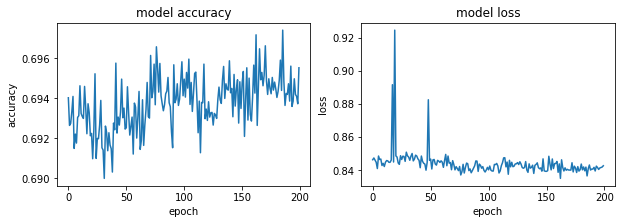

#### AdDelta - 0.001


```python
optimizer= tf.keras.optimizers.Adadelta(learning_rate=0.001)
model.compile(optimizer=optimizer,
              loss='sparse_categorical_crossentropy',
              metrics=['accuracy'])
#history = model.fit(X, Y, validation_split=0.33, epochs=150, batch_size=10, verbose=0)
history = model.fit(x_train, y_train, epochs=200)
model.evaluate(x_test,  y_test, verbose=2)
```


```python
fig, (ax1, ax2) = plt.subplots(1, 2, figsize=(10, 3))

#ax1.subplot(1, 2, 1)
ax1.plot(history.history['accuracy'])
#plt.plot(history.history['val_accuracy'])
ax1.set_title('model accuracy')
ax1.set_ylabel('accuracy')
ax1.set_xlabel('epoch')
#ax1.show()

#ax2.subplot(1, 2, 2)
ax2.plot(history.history['loss'])
#plt.plot(history.history['val_loss'])
ax2.set_title('model loss')
ax2.set_ylabel('loss')
ax2.set_xlabel('epoch')
```

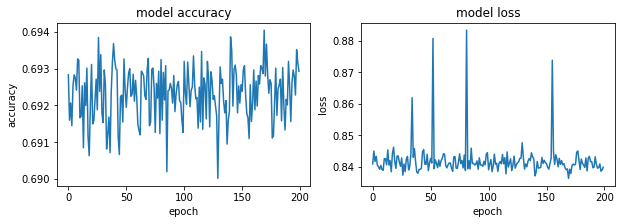

#### AdDelta - 0.1


```python
optimizer= tf.keras.optimizers.Adadelta(learning_rate=0.1)
model.compile(optimizer=optimizer,
              loss='sparse_categorical_crossentropy',
              metrics=['accuracy'])
#history = model.fit(X, Y, validation_split=0.33, epochs=150, batch_size=10, verbose=0)
history = model.fit(x_train, y_train, epochs=200)
model.evaluate(x_test,  y_test, verbose=2)
```


```python
fig, (ax1, ax2) = plt.subplots(1, 2, figsize=(10, 3))

#ax1.subplot(1, 2, 1)
ax1.plot(history.history['accuracy'])
#plt.plot(history.history['val_accuracy'])
ax1.set_title('model accuracy')
ax1.set_ylabel('accuracy')
ax1.set_xlabel('epoch')
#ax1.show()

#ax2.subplot(1, 2, 2)
ax2.plot(history.history['loss'])
#plt.plot(history.history['val_loss'])
ax2.set_title('model loss')
ax2.set_ylabel('loss')
ax2.set_xlabel('epoch')
```


#### AdDelta - 0.5


```python
optimizer= tf.keras.optimizers.Adadelta(learning_rate=0.5)
model.compile(optimizer=optimizer,
              loss='sparse_categorical_crossentropy',
              metrics=['accuracy'])
#history = model.fit(X, Y, validation_split=0.33, epochs=150, batch_size=10, verbose=0)
history = model.fit(x_train, y_train, epochs=200)
model.evaluate(x_test,  y_test, verbose=2)
```


```python
fig, (ax1, ax2) = plt.subplots(1, 2, figsize=(10, 3))

#ax1.subplot(1, 2, 1)
ax1.plot(history.history['accuracy'])
#plt.plot(history.history['val_accuracy'])
ax1.set_title('model accuracy')
ax1.set_ylabel('accuracy')
ax1.set_xlabel('epoch')
#ax1.show()

#ax2.subplot(1, 2, 2)
ax2.plot(history.history['loss'])
#plt.plot(history.history['val_loss'])
ax2.set_title('model loss')
ax2.set_ylabel('loss')
ax2.set_xlabel('epoch')
```


#### AdDelta - 0.9


```python
optimizer= tf.keras.optimizers.Adadelta(learning_rate=0.9)
model.compile(optimizer=optimizer,
              loss='sparse_categorical_crossentropy',
              metrics=['accuracy'])
#history = model.fit(X, Y, validation_split=0.33, epochs=150, batch_size=10, verbose=0)
history = model.fit(x_train, y_train, epochs=200)
model.evaluate(x_test,  y_test, verbose=2)
```


```python
fig, (ax1, ax2) = plt.subplots(1, 2, figsize=(10, 3))

#ax1.subplot(1, 2, 1)
ax1.plot(history.history['accuracy'])
#plt.plot(history.history['val_accuracy'])
ax1.set_title('model accuracy')
ax1.set_ylabel('accuracy')
ax1.set_xlabel('epoch')
#ax1.show()

#ax2.subplot(1, 2, 2)
ax2.plot(history.history['loss'])
#plt.plot(history.history['val_loss'])
ax2.set_title('model loss')
ax2.set_ylabel('loss')
ax2.set_xlabel('epoch')
```


#### AdDelta - 1.5


```python
optimizer= tf.keras.optimizers.Adadelta(learning_rate=1.5)
model.compile(optimizer=optimizer,
              loss='sparse_categorical_crossentropy',
              metrics=['accuracy'])
#history = model.fit(X, Y, validation_split=0.33, epochs=150, batch_size=10, verbose=0)
history = model.fit(x_train, y_train, epochs=200)
model.evaluate(x_test,  y_test, verbose=2)
```


```python
fig, (ax1, ax2) = plt.subplots(1, 2, figsize=(10, 3))

#ax1.subplot(1, 2, 1)
ax1.plot(history.history['accuracy'])
#plt.plot(history.history['val_accuracy'])
ax1.set_title('model accuracy')
ax1.set_ylabel('accuracy')
ax1.set_xlabel('epoch')
#ax1.show()

#ax2.subplot(1, 2, 2)
ax2.plot(history.history['loss'])
#plt.plot(history.history['val_loss'])
ax2.set_title('model loss')
ax2.set_ylabel('loss')
ax2.set_xlabel('epoch')
```


## Sobreentrenamiento
Se  reduce la cantidad de datos de entrenamiento y se reevalua el desempeño de los optimizadores. Se usó 600 datos para entrenamiento y 100 para testeo

#### SGD - 0.001


```python
optimizer= tf.keras.optimizers.SGD(learning_rate=0.001)
model.compile(optimizer=optimizer,
              loss='sparse_categorical_crossentropy',
              metrics=['accuracy'])

history = model.fit(x_train_, y_train_, epochs=100)
model.evaluate(x_test_,  y_test_, verbose=2)
```


```python
fig, (ax1, ax2) = plt.subplots(1, 2, figsize=(10, 3))

#ax1.subplot(1, 2, 1)
ax1.plot(history.history['accuracy'])
#plt.plot(history.history['val_accuracy'])
ax1.set_title('model accuracy')
ax1.set_ylabel('accuracy')
ax1.set_xlabel('epoch')
#ax1.show()

#ax2.subplot(1, 2, 2)
ax2.plot(history.history['loss'])
#plt.plot(history.history['val_loss'])
ax2.set_title('model loss')
ax2.set_ylabel('loss')
ax2.set_xlabel('epoch')
```


#### SGD - 0.1


```python
optimizer= tf.keras.optimizers.SGD(learning_rate=0.1)
model.compile(optimizer=optimizer,
              loss='sparse_categorical_crossentropy',
              metrics=['accuracy'])

history = model.fit(x_train_, y_train_, epochs=100)
model.evaluate(x_test_,  y_test_, verbose=2)
```


```python
fig, (ax1, ax2) = plt.subplots(1, 2, figsize=(10, 3))

#ax1.subplot(1, 2, 1)
ax1.plot(history.history['accuracy'])
#plt.plot(history.history['val_accuracy'])
ax1.set_title('model accuracy')
ax1.set_ylabel('accuracy')
ax1.set_xlabel('epoch')
#ax1.show()

#ax2.subplot(1, 2, 2)
ax2.plot(history.history['loss'])
#plt.plot(history.history['val_loss'])
ax2.set_title('model loss')
ax2.set_ylabel('loss')
ax2.set_xlabel('epoch')
```


#### SGD - 0.5


```python
optimizer= tf.keras.optimizers.SGD(learning_rate=0.5)
model.compile(optimizer=optimizer,
              loss='sparse_categorical_crossentropy',
              metrics=['accuracy'])

history = model.fit(x_train_, y_train_, epochs=100)
model.evaluate(x_test_,  y_test_, verbose=2)
```


```python
fig, (ax1, ax2) = plt.subplots(1, 2, figsize=(10, 3))

#ax1.subplot(1, 2, 1)
ax1.plot(history.history['accuracy'])
#plt.plot(history.history['val_accuracy'])
ax1.set_title('model accuracy')
ax1.set_ylabel('accuracy')
ax1.set_xlabel('epoch')
#ax1.show()

#ax2.subplot(1, 2, 2)
ax2.plot(history.history['loss'])
#plt.plot(history.history['val_loss'])
ax2.set_title('model loss')
ax2.set_ylabel('loss')
ax2.set_xlabel('epoch')
```

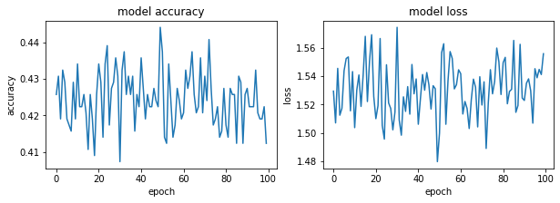

#### SGD - 0.9


```python
optimizer= tf.keras.optimizers.SGD(learning_rate=0.9)
model.compile(optimizer=optimizer,
              loss='sparse_categorical_crossentropy',
              metrics=['accuracy'])

history = model.fit(x_train_, y_train_, epochs=100)
model.evaluate(x_test_,  y_test_, verbose=2)
```


```python
fig, (ax1, ax2) = plt.subplots(1, 2, figsize=(10, 3))

#ax1.subplot(1, 2, 1)
ax1.plot(history.history['accuracy'])
#plt.plot(history.history['val_accuracy'])
ax1.set_title('model accuracy')
ax1.set_ylabel('accuracy')
ax1.set_xlabel('epoch')
#ax1.show()

#ax2.subplot(1, 2, 2)
ax2.plot(history.history['loss'])
#plt.plot(history.history['val_loss'])
ax2.set_title('model loss')
ax2.set_ylabel('loss')
ax2.set_xlabel('epoch')
```


#### SGD - 1.5


```python
optimizer= tf.keras.optimizers.SGD(learning_rate=1.5)
model.compile(optimizer=optimizer,
              loss='sparse_categorical_crossentropy',
              metrics=['accuracy'])

history = model.fit(x_train_, y_train_, epochs=100)
model.evaluate(x_test_,  y_test_, verbose=2)
```


```python
fig, (ax1, ax2) = plt.subplots(1, 2, figsize=(10, 3))

#ax1.subplot(1, 2, 1)
ax1.plot(history.history['accuracy'])
#plt.plot(history.history['val_accuracy'])
ax1.set_title('model accuracy')
ax1.set_ylabel('accuracy')
ax1.set_xlabel('epoch')
#ax1.show()

#ax2.subplot(1, 2, 2)
ax2.plot(history.history['loss'])
#plt.plot(history.history['val_loss'])
ax2.set_title('model loss')
ax2.set_ylabel('loss')
ax2.set_xlabel('epoch')
```

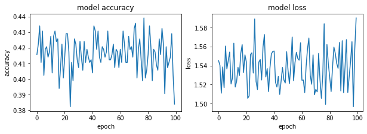

#### RMSprop - 0.001


```python
optimizer= tf.keras.optimizers.RMSprop(learning_rate=0.001)
model.compile(optimizer=optimizer,
              loss='sparse_categorical_crossentropy',
              metrics=['accuracy'])

history = model.fit(x_train, y_train, epochs=100)
model.evaluate(x_test,  y_test, verbose=2)
```


```python
fig, (ax1, ax2) = plt.subplots(1, 2, figsize=(10, 3))

#ax1.subplot(1, 2, 1)
ax1.plot(history.history['accuracy'])
#plt.plot(history.history['val_accuracy'])
ax1.set_title('model accuracy')
ax1.set_ylabel('accuracy')
ax1.set_xlabel('epoch')
#ax1.show()

#ax2.subplot(1, 2, 2)
ax2.plot(history.history['loss'])
#plt.plot(history.history['val_loss'])
ax2.set_title('model loss')
ax2.set_ylabel('loss')
ax2.set_xlabel('epoch')
```

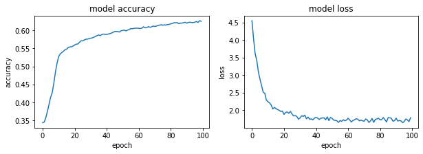

#### RMSprop - 0.1


```python
optimizer= tf.keras.optimizers.RMSprop(learning_rate=0.1)
model.compile(optimizer=optimizer,
              loss='sparse_categorical_crossentropy',
              metrics=['accuracy'])

history = model.fit(x_train_, y_train_, epochs=100)
model.evaluate(x_test_,  y_test_, verbose=2)
```


```python
fig, (ax1, ax2) = plt.subplots(1, 2, figsize=(10, 3))

#ax1.subplot(1, 2, 1)
ax1.plot(history.history['accuracy'])
#plt.plot(history.history['val_accuracy'])
ax1.set_title('model accuracy')
ax1.set_ylabel('accuracy')
ax1.set_xlabel('epoch')
#ax1.show()

#ax2.subplot(1, 2, 2)
ax2.plot(history.history['loss'])
#plt.plot(history.history['val_loss'])
ax2.set_title('model loss')
ax2.set_ylabel('loss')
ax2.set_xlabel('epoch')
```


#### RMSprop - 0.5


```python
optimizer= tf.keras.optimizers.RMSprop(learning_rate=0.5)
model.compile(optimizer=optimizer,
              loss='sparse_categorical_crossentropy',
              metrics=['accuracy'])

history = model.fit(x_train_, y_train_, epochs=100)
model.evaluate(x_test_,  y_test_, verbose=2)
```


```python
fig, (ax1, ax2) = plt.subplots(1, 2, figsize=(10, 3))

#ax1.subplot(1, 2, 1)
ax1.plot(history.history['accuracy'])
#plt.plot(history.history['val_accuracy'])
ax1.set_title('model accuracy')
ax1.set_ylabel('accuracy')
ax1.set_xlabel('epoch')
#ax1.show()

#ax2.subplot(1, 2, 2)
ax2.plot(history.history['loss'])
#plt.plot(history.history['val_loss'])
ax2.set_title('model loss')
ax2.set_ylabel('loss')
ax2.set_xlabel('epoch')
```


#### RMSprop - 0.9


```python
optimizer= tf.keras.optimizers.RMSprop(learning_rate=0.9)
model.compile(optimizer=optimizer,
              loss='sparse_categorical_crossentropy',
              metrics=['accuracy'])

history = model.fit(x_train_, y_train_, epochs=100)
model.evaluate(x_test_,  y_test_, verbose=2)
```


```python
fig, (ax1, ax2) = plt.subplots(1, 2, figsize=(10, 3))

#ax1.subplot(1, 2, 1)
ax1.plot(history.history['accuracy'])
#plt.plot(history.history['val_accuracy'])
ax1.set_title('model accuracy')
ax1.set_ylabel('accuracy')
ax1.set_xlabel('epoch')
#ax1.show()

#ax2.subplot(1, 2, 2)
ax2.plot(history.history['loss'])
#plt.plot(history.history['val_loss'])
ax2.set_title('model loss')
ax2.set_ylabel('loss')
ax2.set_xlabel('epoch')
```


#### RMSprop - 1.5


```python
optimizer= tf.keras.optimizers.RMSprop(learning_rate=1.5)
model.compile(optimizer=optimizer,
              loss='sparse_categorical_crossentropy',
              metrics=['accuracy'])

history = model.fit(x_train_, y_train_, epochs=100)
model.evaluate(x_test_,  y_test_, verbose=2)
```


```python
fig, (ax1, ax2) = plt.subplots(1, 2, figsize=(10, 3))

#ax1.subplot(1, 2, 1)
ax1.plot(history.history['accuracy'])
#plt.plot(history.history['val_accuracy'])
ax1.set_title('model accuracy')
ax1.set_ylabel('accuracy')
ax1.set_xlabel('epoch')
#ax1.show()

#ax2.subplot(1, 2, 2)
ax2.plot(history.history['loss'])
#plt.plot(history.history['val_loss'])
ax2.set_title('model loss')
ax2.set_ylabel('loss')
ax2.set_xlabel('epoch')
```


#### Adagram - 0.001


```python
optimizer= tf.keras.optimizers.Adagrad(learning_rate=0.001)
model.compile(optimizer=optimizer,
              loss='sparse_categorical_crossentropy',
              metrics=['accuracy'])
#history = model.fit(X, Y, validation_split=0.33, epochs=150, batch_size=10, verbose=0)
history = model.fit(x_train_, y_train_, epochs=100)
model.evaluate(x_test_,  y_test_, verbose=2)
```


```python
fig, (ax1, ax2) = plt.subplots(1, 2, figsize=(10, 3))

#ax1.subplot(1, 2, 1)
ax1.plot(history.history['accuracy'])
#plt.plot(history.history['val_accuracy'])
ax1.set_title('model accuracy')
ax1.set_ylabel('accuracy')
ax1.set_xlabel('epoch')
#ax1.show()

#ax2.subplot(1, 2, 2)
ax2.plot(history.history['loss'])
#plt.plot(history.history['val_loss'])
ax2.set_title('model loss')
ax2.set_ylabel('loss')
ax2.set_xlabel('epoch')
```

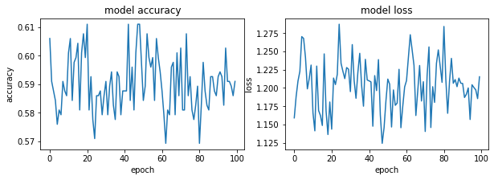

#### Adagram - 0.1


```python
optimizer= tf.keras.optimizers.Adagrad(learning_rate=0.1)
model.compile(optimizer=optimizer,
              loss='sparse_categorical_crossentropy',
              metrics=['accuracy'])
#history = model.fit(X, Y, validation_split=0.33, epochs=150, batch_size=10, verbose=0)
history = model.fit(x_train_, y_train_, epochs=100)
model.evaluate(x_test_,  y_test_, verbose=2)
```


```python
fig, (ax1, ax2) = plt.subplots(1, 2, figsize=(10, 3))

#ax1.subplot(1, 2, 1)
ax1.plot(history.history['accuracy'])
#plt.plot(history.history['val_accuracy'])
ax1.set_title('model accuracy')
ax1.set_ylabel('accuracy')
ax1.set_xlabel('epoch')
#ax1.show()

#ax2.subplot(1, 2, 2)
ax2.plot(history.history['loss'])
#plt.plot(history.history['val_loss'])
ax2.set_title('model loss')
ax2.set_ylabel('loss')
ax2.set_xlabel('epoch')
```


#### Adagram - 0.5


```python
optimizer= tf.keras.optimizers.Adagrad(learning_rate=0.5)
model.compile(optimizer=optimizer,
              loss='sparse_categorical_crossentropy',
              metrics=['accuracy'])
#history = model.fit(X, Y, validation_split=0.33, epochs=150, batch_size=10, verbose=0)
history = model.fit(x_train_, y_train_, epochs=100)
model.evaluate(x_test_,  y_test_, verbose=2)
```


```python
fig, (ax1, ax2) = plt.subplots(1, 2, figsize=(10, 3))

#ax1.subplot(1, 2, 1)
ax1.plot(history.history['accuracy'])
#plt.plot(history.history['val_accuracy'])
ax1.set_title('model accuracy')
ax1.set_ylabel('accuracy')
ax1.set_xlabel('epoch')
#ax1.show()

#ax2.subplot(1, 2, 2)
ax2.plot(history.history['loss'])
#plt.plot(history.history['val_loss'])
ax2.set_title('model loss')
ax2.set_ylabel('loss')
ax2.set_xlabel('epoch')
```


#### Adagram - 0.9


```python
optimizer= tf.keras.optimizers.Adagrad(learning_rate=0.9)
model.compile(optimizer=optimizer,
              loss='sparse_categorical_crossentropy',
              metrics=['accuracy'])
#history = model.fit(X, Y, validation_split=0.33, epochs=150, batch_size=10, verbose=0)
history = model.fit(x_train_, y_train_, epochs=100)
model.evaluate(x_test_,  y_test_, verbose=2)
```


```python
fig, (ax1, ax2) = plt.subplots(1, 2, figsize=(10, 3))

#ax1.subplot(1, 2, 1)
ax1.plot(history.history['accuracy'])
#plt.plot(history.history['val_accuracy'])
ax1.set_title('model accuracy')
ax1.set_ylabel('accuracy')
ax1.set_xlabel('epoch')
#ax1.show()

#ax2.subplot(1, 2, 2)
ax2.plot(history.history['loss'])
#plt.plot(history.history['val_loss'])
ax2.set_title('model loss')
ax2.set_ylabel('loss')
ax2.set_xlabel('epoch')
```


#### Adagram - 1.5


```python
optimizer= tf.keras.optimizers.Adagrad(learning_rate=1.5)
model.compile(optimizer=optimizer,
              loss='sparse_categorical_crossentropy',
              metrics=['accuracy'])
#history = model.fit(X, Y, validation_split=0.33, epochs=150, batch_size=10, verbose=0)
history = model.fit(x_train_, y_train_, epochs=100)
model.evaluate(x_test_,  y_test_, verbose=2)
```


```python
fig, (ax1, ax2) = plt.subplots(1, 2, figsize=(10, 3))

#ax1.subplot(1, 2, 1)
ax1.plot(history.history['accuracy'])
#plt.plot(history.history['val_accuracy'])
ax1.set_title('model accuracy')
ax1.set_ylabel('accuracy')
ax1.set_xlabel('epoch')
#ax1.show()

#ax2.subplot(1, 2, 2)
ax2.plot(history.history['loss'])
#plt.plot(history.history['val_loss'])
ax2.set_title('model loss')
ax2.set_ylabel('loss')
ax2.set_xlabel('epoch')
```


#### AdDelta - 0.001


```python
optimizer= tf.keras.optimizers.Adadelta(learning_rate=0.001)
model.compile(optimizer=optimizer,
              loss='sparse_categorical_crossentropy',
              metrics=['accuracy'])
#history = model.fit(X, Y, validation_split=0.33, epochs=150, batch_size=10, verbose=0)
history = model.fit(x_train_, y_train_, epochs=100)
model.evaluate(x_test_,  y_test_, verbose=2)
```


```python
fig, (ax1, ax2) = plt.subplots(1, 2, figsize=(10, 3))

#ax1.subplot(1, 2, 1)
ax1.plot(history.history['accuracy'])
#plt.plot(history.history['val_accuracy'])
ax1.set_title('model accuracy')
ax1.set_ylabel('accuracy')
ax1.set_xlabel('epoch')
#ax1.show()

#ax2.subplot(1, 2, 2)
ax2.plot(history.history['loss'])
#plt.plot(history.history['val_loss'])
ax2.set_title('model loss')
ax2.set_ylabel('loss')
ax2.set_xlabel('epoch')
```


#### AdDelta - 0.1


```python
optimizer= tf.keras.optimizers.Adadelta(learning_rate=0.1)
model.compile(optimizer=optimizer,
              loss='sparse_categorical_crossentropy',
              metrics=['accuracy'])
#history = model.fit(X, Y, validation_split=0.33, epochs=150, batch_size=10, verbose=0)
history = model.fit(x_train_, y_train_, epochs=100)
model.evaluate(x_test_,  y_test_, verbose=2)
```


```python
fig, (ax1, ax2) = plt.subplots(1, 2, figsize=(10, 3))

#ax1.subplot(1, 2, 1)
ax1.plot(history.history['accuracy'])
#plt.plot(history.history['val_accuracy'])
ax1.set_title('model accuracy')
ax1.set_ylabel('accuracy')
ax1.set_xlabel('epoch')
#ax1.show()

#ax2.subplot(1, 2, 2)
ax2.plot(history.history['loss'])
#plt.plot(history.history['val_loss'])
ax2.set_title('model loss')
ax2.set_ylabel('loss')
ax2.set_xlabel('epoch')
```


#### AdDelta - 0.5


```python
optimizer= tf.keras.optimizers.Adadelta(learning_rate=0.5)
model.compile(optimizer=optimizer,
              loss='sparse_categorical_crossentropy',
              metrics=['accuracy'])
#history = model.fit(X, Y, validation_split=0.33, epochs=150, batch_size=10, verbose=0)
history = model.fit(x_train_, y_train_, epochs=100)
model.evaluate(x_test_,  y_test_, verbose=2)
```


```python
fig, (ax1, ax2) = plt.subplots(1, 2, figsize=(10, 3))

#ax1.subplot(1, 2, 1)
ax1.plot(history.history['accuracy'])
#plt.plot(history.history['val_accuracy'])
ax1.set_title('model accuracy')
ax1.set_ylabel('accuracy')
ax1.set_xlabel('epoch')
#ax1.show()

#ax2.subplot(1, 2, 2)
ax2.plot(history.history['loss'])
#plt.plot(history.history['val_loss'])
ax2.set_title('model loss')
ax2.set_ylabel('loss')
ax2.set_xlabel('epoch')
```


#### AdDelta - 0.9


```python
optimizer= tf.keras.optimizers.Adadelta(learning_rate=0.9)
model.compile(optimizer=optimizer,
              loss='sparse_categorical_crossentropy',
              metrics=['accuracy'])
#history = model.fit(X, Y, validation_split=0.33, epochs=150, batch_size=10, verbose=0)
history = model.fit(x_train_, y_train_, epochs=100)
model.evaluate(x_test_,  y_test_, verbose=2)
```


```python
fig, (ax1, ax2) = plt.subplots(1, 2, figsize=(10, 3))

#ax1.subplot(1, 2, 1)
ax1.plot(history.history['accuracy'])
#plt.plot(history.history['val_accuracy'])
ax1.set_title('model accuracy')
ax1.set_ylabel('accuracy')
ax1.set_xlabel('epoch')
#ax1.show()

#ax2.subplot(1, 2, 2)
ax2.plot(history.history['loss'])
#plt.plot(history.history['val_loss'])
ax2.set_title('model loss')
ax2.set_ylabel('loss')
ax2.set_xlabel('epoch')
```

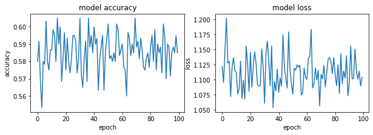

#### AdDelta - 1.5


```python
optimizer= tf.keras.optimizers.Adadelta(learning_rate=1.5)
model.compile(optimizer=optimizer,
              loss='sparse_categorical_crossentropy',
              metrics=['accuracy'])
#history = model.fit(X, Y, validation_split=0.33, epochs=150, batch_size=10, verbose=0)
history = model.fit(x_train_, y_train_, epochs=100)
model.evaluate(x_test_,  y_test_, verbose=2)
```


```python
fig, (ax1, ax2) = plt.subplots(1, 2, figsize=(10, 3))

#ax1.subplot(1, 2, 1)
ax1.plot(history.history['accuracy'])
#plt.plot(history.history['val_accuracy'])
ax1.set_title('model accuracy')
ax1.set_ylabel('accuracy')
ax1.set_xlabel('epoch')
#ax1.show()

#ax2.subplot(1, 2, 2)
ax2.plot(history.history['loss'])
#plt.plot(history.history['val_loss'])
ax2.set_title('model loss')
ax2.set_ylabel('loss')
ax2.set_xlabel('epoch')
```

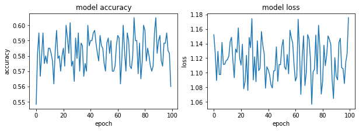

### Análisis

- ¿Cuál fue el método de optimización menos afectado por la reducción del conjunto de datos?
    
- ¿Cuál fue la tasa de aprendizaje menos afectada por la reducción del conjunto de datos?
    
- ¿Cuál fue el método que más rápido convergió?


```python
df_sgd = pd.read_excel('comparacion.xlsx',sheet_name='Hoja2',index_col='Tasa aprendizaje')
df_rsm = pd.read_excel('comparacion.xlsx',sheet_name='Hoja3',index_col='Tasa aprendizaje')
df_adagram = pd.read_excel('comparacion.xlsx',sheet_name='Hoja4',index_col='Tasa aprendizaje')
df_adelta = pd.read_excel('comparacion.xlsx',sheet_name='Hoja5',index_col='Tasa aprendizaje')

df = pd.read_excel('comparacion.xlsx',sheet_name='Hoja6')
```

#### SGD


```python
df_sgd
```


<div>
<style scoped>
    .dataframe tbody tr th:only-of-type {
        vertical-align: middle;
    }

    .dataframe tbody tr th {
        vertical-align: top;
    }

    .dataframe thead th {
        text-align: right;
    }
</style>
<table border="1" class="dataframe">
  <thead>
    <tr style="text-align: right;">
      <th></th>
      <th>accuraccy 1</th>
      <th>accuraccy 2</th>
    </tr>
    <tr>
      <th>Tasa aprendizaje</th>
      <th></th>
      <th></th>
    </tr>
  </thead>
  <tbody>
    <tr>
      <th>0.001</th>
      <td>0.981</td>
      <td>0.370</td>
    </tr>
    <tr>
      <th>0.100</th>
      <td>0.981</td>
      <td>0.370</td>
    </tr>
    <tr>
      <th>0.500</th>
      <td>0.975</td>
      <td>0.370</td>
    </tr>
    <tr>
      <th>0.900</th>
      <td>0.968</td>
      <td>0.370</td>
    </tr>
    <tr>
      <th>1.500</th>
      <td>0.959</td>
      <td>0.368</td>
    </tr>
  </tbody>
</table>
</div>


#### RSMprop


```python
df_rsm
```


<div>
<style scoped>
    .dataframe tbody tr th:only-of-type {
        vertical-align: middle;
    }

    .dataframe tbody tr th {
        vertical-align: top;
    }

    .dataframe thead th {
        text-align: right;
    }
</style>
<table border="1" class="dataframe">
  <thead>
    <tr style="text-align: right;">
      <th></th>
      <th>accuraccy 1</th>
      <th>accuraccy 2</th>
    </tr>
    <tr>
      <th>Tasa aprendizaje</th>
      <th></th>
      <th></th>
    </tr>
  </thead>
  <tbody>
    <tr>
      <th>0.001</th>
      <td>0.967</td>
      <td>0.710</td>
    </tr>
    <tr>
      <th>0.100</th>
      <td>0.947</td>
      <td>0.627</td>
    </tr>
    <tr>
      <th>0.500</th>
      <td>0.809</td>
      <td>0.544</td>
    </tr>
    <tr>
      <th>0.900</th>
      <td>0.786</td>
      <td>0.505</td>
    </tr>
    <tr>
      <th>1.500</th>
      <td>0.725</td>
      <td>0.542</td>
    </tr>
  </tbody>
</table>
</div>


#### Adagram


```python
df_adagram
```


<div>
<style scoped>
    .dataframe tbody tr th:only-of-type {
        vertical-align: middle;
    }

    .dataframe tbody tr th {
        vertical-align: top;
    }

    .dataframe thead th {
        text-align: right;
    }
</style>
<table border="1" class="dataframe">
  <thead>
    <tr style="text-align: right;">
      <th></th>
      <th>accuraccy 1</th>
      <th>accuraccy 2</th>
    </tr>
    <tr>
      <th>Tasa aprendizaje</th>
      <th></th>
      <th></th>
    </tr>
  </thead>
  <tbody>
    <tr>
      <th>0.001</th>
      <td>0.724</td>
      <td>0.542</td>
    </tr>
    <tr>
      <th>0.100</th>
      <td>0.719</td>
      <td>0.542</td>
    </tr>
    <tr>
      <th>0.500</th>
      <td>0.724</td>
      <td>0.542</td>
    </tr>
    <tr>
      <th>0.900</th>
      <td>0.728</td>
      <td>0.542</td>
    </tr>
    <tr>
      <th>1.500</th>
      <td>0.725</td>
      <td>0.586</td>
    </tr>
  </tbody>
</table>
</div>


#### AdDelta


```python
df_adelta
```


<div>
<style scoped>
    .dataframe tbody tr th:only-of-type {
        vertical-align: middle;
    }

    .dataframe tbody tr th {
        vertical-align: top;
    }

    .dataframe thead th {
        text-align: right;
    }
</style>
<table border="1" class="dataframe">
  <thead>
    <tr style="text-align: right;">
      <th></th>
      <th>accuraccy 1</th>
      <th>accuraccy 2</th>
    </tr>
    <tr>
      <th>Tasa aprendizaje</th>
      <th></th>
      <th></th>
    </tr>
  </thead>
  <tbody>
    <tr>
      <th>0.001</th>
      <td>0.725</td>
      <td>0.588</td>
    </tr>
    <tr>
      <th>0.100</th>
      <td>0.725</td>
      <td>0.593</td>
    </tr>
    <tr>
      <th>0.500</th>
      <td>0.730</td>
      <td>0.598</td>
    </tr>
    <tr>
      <th>0.900</th>
      <td>0.730</td>
      <td>0.585</td>
    </tr>
    <tr>
      <th>1.500</th>
      <td>0.730</td>
      <td>0.560</td>
    </tr>
  </tbody>
</table>
</div>


Se promedió la perdida de precisión de cada método de optimización por las diferentes tasas de parendizaje y el optimizador que más precisión perdió con respecto al primer caso fue SGD pasando de un promedio de 0.97 a 0.36 
Para las tasas de aprendizaje se promedio el cambió de precisión para cada optimizador y se encontró que la que más se vio afectada por la reducción de datos fue la tasa de 0.1
El optimizador que más rápido converge, como se muestra en este análisis, es el RSMprop

## Bibliografía

- https://stats.stackexchange.com/questions/326065/cross-entropy-vs-sparse-cross-entropy-when-to-use-one-over-the-other
- https://github.com/keras-team/keras/issues/6444
- https://keras.io/api/optimizers/rmsprop/
- https://stats.stackexchange.com/questions/326065/cross-entropy-vs-sparse-cross-entropy-when-to-use-one-over-the-other
- https://keras.io/api/losses/
- https://machinelearningmastery.com/display-deep-learning-model-training-history-in-keras/
- https://towardsdatascience.com/neural-network-optimization-algorithms-1a44c282f61d
