# Actividad 08: optimización y redes neuronales

### Sebastián Hernández Mantilla

## Optimización y redes neuronales

Se desarrolla el tutorial de reconocimiento de dígitos con el conjunto de datos MNIST de la Guia inicial de TensorFlow 2.0


```python
import matplotlib.pyplot as plt
import tensorflow as tf
import numpy as np
import pandas as pd

mnist = tf.keras.datasets.mnist

(x_train, y_train), (x_test, y_test) = mnist.load_data()
x_train, x_test = x_train / 255.0, x_test / 255.0

model = tf.keras.models.Sequential([
  tf.keras.layers.Flatten(input_shape=(28, 28)),
  tf.keras.layers.Dense(128, activation='relu'),
  tf.keras.layers.Dropout(0.2),
  tf.keras.layers.Dense(10, activation='softmax')
])

model.compile(optimizer='adam',
              loss='sparse_categorical_crossentropy',
              metrics=['accuracy'])

model.fit(x_train, y_train, epochs=5)
model.evaluate(x_test,  y_test, verbose=2)
```

    Epoch 1/5
    1875/1875 [==============================] - 2s 869us/step - loss: 0.2970 - accuracy: 0.9136
    Epoch 2/5
    1875/1875 [==============================] - 2s 993us/step - loss: 0.1465 - accuracy: 0.9562
    Epoch 3/5
    1875/1875 [==============================] - 2s 805us/step - loss: 0.1105 - accuracy: 0.9667
    Epoch 4/5
    1875/1875 [==============================] - 2s 851us/step - loss: 0.0915 - accuracy: 0.9713
    Epoch 5/5
    1875/1875 [==============================] - 2s 993us/step - loss: 0.0762 - accuracy: 0.9768
    313/313 - 0s - loss: 0.0791 - accuracy: 0.9742
    


    [0.07908767461776733, 0.9742000102996826]


#### Función de pérdida

La función de pérdida utilizada en el tutorial es Categorical crossentropy:

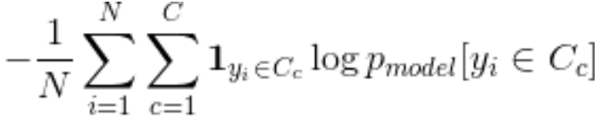

Donde:

- N es el número de observaciones
- C es el número de categorias 
- Pmodel[yi ∈ C] es la probabilidad predecida por el modelo para que la observación i pertenezca a la categoría c


## Metodo de optimización
 Se analisa el desempeño de la red con diferentes optimizadores y variando la tasa de aprendizaje


Se encontró que 200 épocas son suficientes para hacer una comparación entre los tipos de optimizadores

#### SGD - 0.001


```python
optimizer= tf.keras.optimizers.SGD(learning_rate=0.001)
model.compile(optimizer=optimizer,
              loss='sparse_categorical_crossentropy',
              metrics=['accuracy'])

history = model.fit(x_train, y_train, epochs=200)
model.evaluate(x_test,  y_test, verbose=2)
```

    Epoch 1/200
    1875/1875 [==============================] - 2s 901us/step - loss: 0.0600 - accuracy: 0.9808
    Epoch 2/200
    1875/1875 [==============================] - 2s 810us/step - loss: 0.0567 - accuracy: 0.9828
    Epoch 3/200
    1875/1875 [==============================] - 2s 939us/step - loss: 0.0568 - accuracy: 0.9824
    Epoch 4/200
    1875/1875 [==============================] - 2s 828us/step - loss: 0.0535 - accuracy: 0.9834
    Epoch 5/200
    1875/1875 [==============================] - 2s 819us/step - loss: 0.0538 - accuracy: 0.9835
    Epoch 6/200
    1875/1875 [==============================] - 1s 796us/step - loss: 0.0525 - accuracy: 0.9838
    Epoch 7/200
    1875/1875 [==============================] - 2s 847us/step - loss: 0.0524 - accuracy: 0.9839
    Epoch 8/200
    1875/1875 [==============================] - 2s 803us/step - loss: 0.0524 - accuracy: 0.9838
    Epoch 9/200
    1875/1875 [==============================] - 2s 951us/step - loss: 0.0509 - accuracy: 0.9844
    Epoch 10/200
    1875/1875 [==============================] - 2s 1ms/step - loss: 0.0521 - accuracy: 0.9842
    Epoch 11/200
    1875/1875 [==============================] - 2s 1ms/step - loss: 0.0502 - accuracy: 0.9845
    Epoch 12/200
    1875/1875 [==============================] - 2s 984us/step - loss: 0.0523 - accuracy: 0.9843
    Epoch 13/200
    1875/1875 [==============================] - 1s 785us/step - loss: 0.0517 - accuracy: 0.9840
    Epoch 14/200
    1875/1875 [==============================] - 1s 779us/step - loss: 0.0508 - accuracy: 0.9846
    Epoch 15/200
    1875/1875 [==============================] - 2s 1ms/step - loss: 0.0501 - accuracy: 0.9842
    Epoch 16/200
    1875/1875 [==============================] - 2s 995us/step - loss: 0.0487 - accuracy: 0.9846
    Epoch 17/200
    1875/1875 [==============================] - 2s 906us/step - loss: 0.0504 - accuracy: 0.9846
    Epoch 18/200
    1875/1875 [==============================] - 2s 879us/step - loss: 0.0495 - accuracy: 0.9846
    Epoch 19/200
    1875/1875 [==============================] - 2s 904us/step - loss: 0.0484 - accuracy: 0.9850
    Epoch 20/200
    1875/1875 [==============================] - 2s 899us/step - loss: 0.0492 - accuracy: 0.9849
    Epoch 21/200
    1875/1875 [==============================] - 2s 1ms/step - loss: 0.0479 - accuracy: 0.9852
    Epoch 22/200
    1875/1875 [==============================] - 2s 819us/step - loss: 0.0489 - accuracy: 0.9852
    Epoch 23/200
    1875/1875 [==============================] - 1s 764us/step - loss: 0.0495 - accuracy: 0.9845
    Epoch 24/200
    1875/1875 [==============================] - 1s 768us/step - loss: 0.0484 - accuracy: 0.9855
    Epoch 25/200
    1875/1875 [==============================] - 1s 784us/step - loss: 0.0484 - accuracy: 0.9855
    Epoch 26/200
    1875/1875 [==============================] - 2s 843us/step - loss: 0.0470 - accuracy: 0.9855
    Epoch 27/200
    1875/1875 [==============================] - 2s 979us/step - loss: 0.0485 - accuracy: 0.9851
    Epoch 28/200
    1875/1875 [==============================] - 1s 789us/step - loss: 0.0477 - accuracy: 0.9851
    Epoch 29/200
    1875/1875 [==============================] - 2s 828us/step - loss: 0.0478 - accuracy: 0.9857
    Epoch 30/200
    1875/1875 [==============================] - 1s 772us/step - loss: 0.0477 - accuracy: 0.9851
    Epoch 31/200
    1875/1875 [==============================] - 2s 846us/step - loss: 0.0474 - accuracy: 0.9856
    Epoch 32/200
    1875/1875 [==============================] - 2s 802us/step - loss: 0.0472 - accuracy: 0.9855
    Epoch 33/200
    1875/1875 [==============================] - 1s 749us/step - loss: 0.0468 - accuracy: 0.9855
    Epoch 34/200
    1875/1875 [==============================] - 2s 924us/step - loss: 0.0468 - accuracy: 0.9859
    Epoch 35/200
    1875/1875 [==============================] - 1s 751us/step - loss: 0.0473 - accuracy: 0.9856
    Epoch 36/200
    1875/1875 [==============================] - 1s 751us/step - loss: 0.0459 - accuracy: 0.9861
    Epoch 37/200
    1875/1875 [==============================] - 1s 745us/step - loss: 0.0474 - accuracy: 0.9851
    Epoch 38/200
    1875/1875 [==============================] - 1s 754us/step - loss: 0.0480 - accuracy: 0.9856
    Epoch 39/200
    1875/1875 [==============================] - 1s 745us/step - loss: 0.0470 - accuracy: 0.9857
    Epoch 40/200
    1875/1875 [==============================] - 1s 739us/step - loss: 0.0470 - accuracy: 0.9856
    Epoch 41/200
    1875/1875 [==============================] - 2s 904us/step - loss: 0.0449 - accuracy: 0.9866
    Epoch 42/200
    1875/1875 [==============================] - 1s 753us/step - loss: 0.0464 - accuracy: 0.9856
    Epoch 43/200
    1875/1875 [==============================] - 1s 763us/step - loss: 0.0452 - accuracy: 0.9857
    Epoch 44/200
    1875/1875 [==============================] - 1s 770us/step - loss: 0.0470 - accuracy: 0.9852
    Epoch 45/200
    1875/1875 [==============================] - 1s 759us/step - loss: 0.0463 - accuracy: 0.9858
    Epoch 46/200
    1875/1875 [==============================] - 1s 760us/step - loss: 0.0453 - accuracy: 0.9861
    Epoch 47/200
    1875/1875 [==============================] - 1s 769us/step - loss: 0.0467 - accuracy: 0.9856
    Epoch 48/200
    1875/1875 [==============================] - 2s 926us/step - loss: 0.0460 - accuracy: 0.9858
    Epoch 49/200
    1875/1875 [==============================] - 1s 735us/step - loss: 0.0455 - accuracy: 0.9863
    Epoch 50/200
    1875/1875 [==============================] - 1s 753us/step - loss: 0.0445 - accuracy: 0.9869
    Epoch 51/200
    1875/1875 [==============================] - 1s 740us/step - loss: 0.0459 - accuracy: 0.9854
    Epoch 52/200
    1875/1875 [==============================] - 1s 748us/step - loss: 0.0453 - accuracy: 0.9861
    Epoch 53/200
    1875/1875 [==============================] - 1s 760us/step - loss: 0.0469 - accuracy: 0.9853
    Epoch 54/200
    1875/1875 [==============================] - 1s 749us/step - loss: 0.0458 - accuracy: 0.9862
    Epoch 55/200
    1875/1875 [==============================] - 2s 817us/step - loss: 0.0462 - accuracy: 0.9854
    Epoch 56/200
    1875/1875 [==============================] - 1s 760us/step - loss: 0.0449 - accuracy: 0.9860
    Epoch 57/200
    1875/1875 [==============================] - 1s 744us/step - loss: 0.0457 - accuracy: 0.9861
    Epoch 58/200
    1875/1875 [==============================] - 1s 736us/step - loss: 0.0456 - accuracy: 0.9860
    Epoch 59/200
    1875/1875 [==============================] - 1s 746us/step - loss: 0.0453 - accuracy: 0.9863
    Epoch 60/200
    1875/1875 [==============================] - 1s 747us/step - loss: 0.0450 - accuracy: 0.9856
    Epoch 61/200
    1875/1875 [==============================] - 1s 767us/step - loss: 0.0453 - accuracy: 0.9859
    Epoch 62/200
    1875/1875 [==============================] - 2s 928us/step - loss: 0.0450 - accuracy: 0.9860
    Epoch 63/200
    1875/1875 [==============================] - 1s 750us/step - loss: 0.0457 - accuracy: 0.9858
    Epoch 64/200
    1875/1875 [==============================] - 1s 738us/step - loss: 0.0446 - accuracy: 0.9861
    Epoch 65/200
    1875/1875 [==============================] - 1s 739us/step - loss: 0.0443 - accuracy: 0.9866
    Epoch 66/200
    1875/1875 [==============================] - 1s 767us/step - loss: 0.0450 - accuracy: 0.9865
    Epoch 67/200
    1875/1875 [==============================] - 1s 754us/step - loss: 0.0442 - accuracy: 0.9866
    Epoch 68/200
    1875/1875 [==============================] - 1s 743us/step - loss: 0.0443 - accuracy: 0.9863
    Epoch 69/200
    1875/1875 [==============================] - 2s 907us/step - loss: 0.0443 - accuracy: 0.9865
    Epoch 70/200
    1875/1875 [==============================] - 1s 741us/step - loss: 0.0432 - accuracy: 0.9870
    Epoch 71/200
    1875/1875 [==============================] - 1s 741us/step - loss: 0.0455 - accuracy: 0.9855
    Epoch 72/200
    1875/1875 [==============================] - 1s 744us/step - loss: 0.0439 - accuracy: 0.9868
    Epoch 73/200
    1875/1875 [==============================] - 1s 734us/step - loss: 0.0438 - accuracy: 0.9870
    Epoch 74/200
    1875/1875 [==============================] - 1s 756us/step - loss: 0.0451 - accuracy: 0.9861
    Epoch 75/200
    1875/1875 [==============================] - 1s 749us/step - loss: 0.0454 - accuracy: 0.9862
    Epoch 76/200
    1875/1875 [==============================] - 1s 786us/step - loss: 0.0437 - accuracy: 0.9866
    Epoch 77/200
    1875/1875 [==============================] - 1s 754us/step - loss: 0.0446 - accuracy: 0.9863
    Epoch 78/200
    1875/1875 [==============================] - 1s 748us/step - loss: 0.0441 - accuracy: 0.9864
    Epoch 79/200
    1875/1875 [==============================] - 1s 750us/step - loss: 0.0447 - accuracy: 0.9862
    Epoch 80/200
    1875/1875 [==============================] - 1s 749us/step - loss: 0.0433 - accuracy: 0.9867
    Epoch 81/200
    1875/1875 [==============================] - 1s 736us/step - loss: 0.0438 - accuracy: 0.9867
    Epoch 82/200
    1875/1875 [==============================] - 1s 728us/step - loss: 0.0431 - accuracy: 0.9869
    Epoch 83/200
    1875/1875 [==============================] - 1s 795us/step - loss: 0.0432 - accuracy: 0.9864
    Epoch 84/200
    1875/1875 [==============================] - 2s 822us/step - loss: 0.0437 - accuracy: 0.9867
    Epoch 85/200
    1875/1875 [==============================] - 1s 762us/step - loss: 0.0435 - accuracy: 0.9870
    Epoch 86/200
    1875/1875 [==============================] - 1s 750us/step - loss: 0.0441 - accuracy: 0.9863
    Epoch 87/200
    1875/1875 [==============================] - 1s 753us/step - loss: 0.0443 - accuracy: 0.9864
    Epoch 88/200
    1875/1875 [==============================] - 1s 753us/step - loss: 0.0437 - accuracy: 0.9868
    Epoch 89/200
    1875/1875 [==============================] - 1s 749us/step - loss: 0.0438 - accuracy: 0.9867
    Epoch 90/200
    1875/1875 [==============================] - 1s 752us/step - loss: 0.0432 - accuracy: 0.9868
    Epoch 91/200
    1875/1875 [==============================] - 2s 823us/step - loss: 0.0436 - accuracy: 0.9868
    Epoch 92/200
    1875/1875 [==============================] - 1s 750us/step - loss: 0.0424 - accuracy: 0.9869
    Epoch 93/200
    1875/1875 [==============================] - 1s 758us/step - loss: 0.0429 - accuracy: 0.9872
    Epoch 94/200
    1875/1875 [==============================] - 1s 748us/step - loss: 0.0431 - accuracy: 0.9864
    Epoch 95/200
    1875/1875 [==============================] - 1s 751us/step - loss: 0.0432 - accuracy: 0.9869
    Epoch 96/200
    1875/1875 [==============================] - 1s 750us/step - loss: 0.0435 - accuracy: 0.9864
    Epoch 97/200
    1875/1875 [==============================] - 1s 753us/step - loss: 0.0432 - accuracy: 0.9867
    Epoch 98/200
    1875/1875 [==============================] - 2s 941us/step - loss: 0.0443 - accuracy: 0.9863
    Epoch 99/200
    1875/1875 [==============================] - 1s 737us/step - loss: 0.0439 - accuracy: 0.9865
    Epoch 100/200
    1875/1875 [==============================] - 1s 745us/step - loss: 0.0441 - accuracy: 0.9866
    Epoch 101/200
    1875/1875 [==============================] - 1s 745us/step - loss: 0.0426 - accuracy: 0.9872
    Epoch 102/200
    1875/1875 [==============================] - 1s 750us/step - loss: 0.0430 - accuracy: 0.9864
    Epoch 103/200
    1875/1875 [==============================] - 1s 760us/step - loss: 0.0430 - accuracy: 0.9870
    Epoch 104/200
    1875/1875 [==============================] - 1s 751us/step - loss: 0.0421 - accuracy: 0.9875
    Epoch 105/200
    1875/1875 [==============================] - 2s 897us/step - loss: 0.0441 - accuracy: 0.9865
    Epoch 106/200
    1875/1875 [==============================] - 1s 746us/step - loss: 0.0434 - accuracy: 0.9868
    Epoch 107/200
    1875/1875 [==============================] - 1s 737us/step - loss: 0.0443 - accuracy: 0.9865
    Epoch 108/200
    1875/1875 [==============================] - 1s 741us/step - loss: 0.0431 - accuracy: 0.9867
    Epoch 109/200
    1875/1875 [==============================] - 1s 740us/step - loss: 0.0423 - accuracy: 0.9869
    Epoch 110/200
    1875/1875 [==============================] - 1s 738us/step - loss: 0.0432 - accuracy: 0.9868
    Epoch 111/200
    1875/1875 [==============================] - 1s 742us/step - loss: 0.0426 - accuracy: 0.9868
    Epoch 112/200
    1875/1875 [==============================] - 2s 885us/step - loss: 0.0425 - accuracy: 0.9874
    Epoch 113/200
    1875/1875 [==============================] - 1s 740us/step - loss: 0.0437 - accuracy: 0.9862
    Epoch 114/200
    1875/1875 [==============================] - 1s 740us/step - loss: 0.0424 - accuracy: 0.9868
    Epoch 115/200
    1875/1875 [==============================] - 1s 740us/step - loss: 0.0422 - accuracy: 0.9871
    Epoch 116/200
    1875/1875 [==============================] - 1s 748us/step - loss: 0.0424 - accuracy: 0.9872
    Epoch 117/200
    1875/1875 [==============================] - 1s 750us/step - loss: 0.0423 - accuracy: 0.9871
    Epoch 118/200
    1875/1875 [==============================] - 1s 755us/step - loss: 0.0426 - accuracy: 0.9871
    Epoch 119/200
    1875/1875 [==============================] - 2s 846us/step - loss: 0.0408 - accuracy: 0.9878
    Epoch 120/200
    1875/1875 [==============================] - 1s 749us/step - loss: 0.0424 - accuracy: 0.9869
    Epoch 121/200
    1875/1875 [==============================] - 1s 765us/step - loss: 0.0428 - accuracy: 0.9865
    Epoch 122/200
    1875/1875 [==============================] - 1s 760us/step - loss: 0.0428 - accuracy: 0.9875
    Epoch 123/200
    1875/1875 [==============================] - 1s 760us/step - loss: 0.0432 - accuracy: 0.9871
    Epoch 124/200
    1875/1875 [==============================] - 1s 737us/step - loss: 0.0417 - accuracy: 0.9875
    Epoch 125/200
    1875/1875 [==============================] - 1s 749us/step - loss: 0.0430 - accuracy: 0.9866
    Epoch 126/200
    1875/1875 [==============================] - 2s 889us/step - loss: 0.0417 - accuracy: 0.9872
    Epoch 127/200
    1875/1875 [==============================] - 1s 750us/step - loss: 0.0421 - accuracy: 0.9872
    Epoch 128/200
    1875/1875 [==============================] - 1s 770us/step - loss: 0.0422 - accuracy: 0.9872
    Epoch 129/200
    1875/1875 [==============================] - 1s 747us/step - loss: 0.0412 - accuracy: 0.9875
    Epoch 130/200
    1875/1875 [==============================] - 1s 755us/step - loss: 0.0418 - accuracy: 0.9873
    Epoch 131/200
    1875/1875 [==============================] - 1s 751us/step - loss: 0.0421 - accuracy: 0.9866
    Epoch 132/200
    1875/1875 [==============================] - 1s 750us/step - loss: 0.0416 - accuracy: 0.9868
    Epoch 133/200
    1875/1875 [==============================] - 2s 898us/step - loss: 0.0425 - accuracy: 0.9874
    Epoch 134/200
    1875/1875 [==============================] - 1s 749us/step - loss: 0.0414 - accuracy: 0.9873
    Epoch 135/200
    1875/1875 [==============================] - 1s 751us/step - loss: 0.0417 - accuracy: 0.9871
    Epoch 136/200
    1875/1875 [==============================] - 1s 778us/step - loss: 0.0426 - accuracy: 0.9869
    Epoch 137/200
    1875/1875 [==============================] - 1s 744us/step - loss: 0.0422 - accuracy: 0.9871
    Epoch 138/200
    1875/1875 [==============================] - 1s 737us/step - loss: 0.0424 - accuracy: 0.9873
    Epoch 139/200
    1875/1875 [==============================] - 1s 755us/step - loss: 0.0411 - accuracy: 0.9872
    Epoch 140/200
    1875/1875 [==============================] - 2s 842us/step - loss: 0.0412 - accuracy: 0.9877
    Epoch 141/200
    1875/1875 [==============================] - 1s 737us/step - loss: 0.0404 - accuracy: 0.9877
    Epoch 142/200
    1875/1875 [==============================] - 1s 751us/step - loss: 0.0421 - accuracy: 0.9873
    Epoch 143/200
    1875/1875 [==============================] - 1s 745us/step - loss: 0.0421 - accuracy: 0.9868
    Epoch 144/200
    1875/1875 [==============================] - 1s 733us/step - loss: 0.0409 - accuracy: 0.9873
    Epoch 145/200
    1875/1875 [==============================] - 1s 755us/step - loss: 0.0412 - accuracy: 0.9871
    Epoch 146/200
    1875/1875 [==============================] - 1s 752us/step - loss: 0.0424 - accuracy: 0.9866
    Epoch 147/200
    1875/1875 [==============================] - 2s 900us/step - loss: 0.0415 - accuracy: 0.9876
    Epoch 148/200
    1875/1875 [==============================] - 1s 752us/step - loss: 0.0402 - accuracy: 0.9878
    Epoch 149/200
    1875/1875 [==============================] - 1s 748us/step - loss: 0.0413 - accuracy: 0.9872
    Epoch 150/200
    1875/1875 [==============================] - 1s 746us/step - loss: 0.0407 - accuracy: 0.9875
    Epoch 151/200
    1875/1875 [==============================] - 1s 757us/step - loss: 0.0404 - accuracy: 0.9874
    Epoch 152/200
    1875/1875 [==============================] - 1s 747us/step - loss: 0.0419 - accuracy: 0.9871
    Epoch 153/200
    1875/1875 [==============================] - 1s 752us/step - loss: 0.0407 - accuracy: 0.9880
    Epoch 154/200
    1875/1875 [==============================] - 2s 873us/step - loss: 0.0407 - accuracy: 0.9874
    Epoch 155/200
    1875/1875 [==============================] - 1s 778us/step - loss: 0.0416 - accuracy: 0.9869
    Epoch 156/200
    1875/1875 [==============================] - 1s 748us/step - loss: 0.0409 - accuracy: 0.9873
    Epoch 157/200
    1875/1875 [==============================] - 1s 740us/step - loss: 0.0415 - accuracy: 0.9876
    Epoch 158/200
    1875/1875 [==============================] - 1s 724us/step - loss: 0.0411 - accuracy: 0.9872
    Epoch 159/200
    1875/1875 [==============================] - 1s 749us/step - loss: 0.0410 - accuracy: 0.9872
    Epoch 160/200
    1875/1875 [==============================] - 1s 757us/step - loss: 0.0415 - accuracy: 0.9873
    Epoch 161/200
    1875/1875 [==============================] - 1s 755us/step - loss: 0.0416 - accuracy: 0.9873
    Epoch 162/200
    1875/1875 [==============================] - 2s 941us/step - loss: 0.0417 - accuracy: 0.9873
    Epoch 163/200
    1875/1875 [==============================] - 1s 748us/step - loss: 0.0407 - accuracy: 0.9879
    Epoch 164/200
    1875/1875 [==============================] - 1s 731us/step - loss: 0.0395 - accuracy: 0.9880
    Epoch 165/200
    1875/1875 [==============================] - 1s 739us/step - loss: 0.0406 - accuracy: 0.9876
    Epoch 166/200
    1875/1875 [==============================] - 2s 823us/step - loss: 0.0396 - accuracy: 0.9876
    Epoch 167/200
    1875/1875 [==============================] - 1s 750us/step - loss: 0.0404 - accuracy: 0.9877
    Epoch 168/200
    1875/1875 [==============================] - 2s 832us/step - loss: 0.0405 - accuracy: 0.9879
    Epoch 169/200
    1875/1875 [==============================] - 2s 846us/step - loss: 0.0392 - accuracy: 0.9876
    Epoch 170/200
    1875/1875 [==============================] - 1s 731us/step - loss: 0.0397 - accuracy: 0.9879
    Epoch 171/200
    1875/1875 [==============================] - 1s 743us/step - loss: 0.0408 - accuracy: 0.9876
    Epoch 172/200
    1875/1875 [==============================] - 1s 758us/step - loss: 0.0405 - accuracy: 0.9877
    Epoch 173/200
    1875/1875 [==============================] - 1s 743us/step - loss: 0.0409 - accuracy: 0.9874
    Epoch 174/200
    1875/1875 [==============================] - 1s 762us/step - loss: 0.0400 - accuracy: 0.9881
    Epoch 175/200
    1875/1875 [==============================] - 1s 800us/step - loss: 0.0413 - accuracy: 0.9881
    Epoch 176/200
    1875/1875 [==============================] - 2s 849us/step - loss: 0.0402 - accuracy: 0.9881
    Epoch 177/200
    1875/1875 [==============================] - 1s 740us/step - loss: 0.0400 - accuracy: 0.9880
    Epoch 178/200
    1875/1875 [==============================] - 1s 755us/step - loss: 0.0397 - accuracy: 0.9879
    Epoch 179/200
    1875/1875 [==============================] - 1s 750us/step - loss: 0.0404 - accuracy: 0.9875
    Epoch 180/200
    1875/1875 [==============================] - 1s 739us/step - loss: 0.0408 - accuracy: 0.9874
    Epoch 181/200
    1875/1875 [==============================] - 1s 751us/step - loss: 0.0412 - accuracy: 0.9878
    Epoch 182/200
    1875/1875 [==============================] - 1s 758us/step - loss: 0.0405 - accuracy: 0.9875
    Epoch 183/200
    1875/1875 [==============================] - 2s 888us/step - loss: 0.0402 - accuracy: 0.9874
    Epoch 184/200
    1875/1875 [==============================] - 1s 730us/step - loss: 0.0396 - accuracy: 0.9878
    Epoch 185/200
    1875/1875 [==============================] - 1s 733us/step - loss: 0.0413 - accuracy: 0.9872
    Epoch 186/200
    1875/1875 [==============================] - 1s 743us/step - loss: 0.0405 - accuracy: 0.9875
    Epoch 187/200
    1875/1875 [==============================] - 1s 735us/step - loss: 0.0394 - accuracy: 0.9880
    Epoch 188/200
    1875/1875 [==============================] - 1s 749us/step - loss: 0.0395 - accuracy: 0.9879
    Epoch 189/200
    1875/1875 [==============================] - 1s 752us/step - loss: 0.0393 - accuracy: 0.9879
    Epoch 190/200
    1875/1875 [==============================] - 2s 878us/step - loss: 0.0411 - accuracy: 0.9872
    Epoch 191/200
    1875/1875 [==============================] - 1s 736us/step - loss: 0.0418 - accuracy: 0.9870
    Epoch 192/200
    1875/1875 [==============================] - 1s 742us/step - loss: 0.0399 - accuracy: 0.9881
    Epoch 193/200
    1875/1875 [==============================] - 1s 740us/step - loss: 0.0409 - accuracy: 0.9877
    Epoch 194/200
    1875/1875 [==============================] - 1s 735us/step - loss: 0.0402 - accuracy: 0.9874
    Epoch 195/200
    1875/1875 [==============================] - 1s 738us/step - loss: 0.0404 - accuracy: 0.9877
    Epoch 196/200
    1875/1875 [==============================] - 1s 733us/step - loss: 0.0395 - accuracy: 0.9881
    Epoch 197/200
    1875/1875 [==============================] - 2s 842us/step - loss: 0.0405 - accuracy: 0.9869
    Epoch 198/200
    1875/1875 [==============================] - 1s 738us/step - loss: 0.0393 - accuracy: 0.9883
    Epoch 199/200
    1875/1875 [==============================] - 1s 739us/step - loss: 0.0401 - accuracy: 0.9874
    Epoch 200/200
    1875/1875 [==============================] - 1s 739us/step - loss: 0.0399 - accuracy: 0.9874
    313/313 - 0s - loss: 0.0616 - accuracy: 0.9810
    


    [0.06162133812904358, 0.9810000061988831]


```python
fig, (ax1, ax2) = plt.subplots(1, 2, figsize=(10, 3))

#ax1.subplot(1, 2, 1)
ax1.plot(history.history['accuracy'])
#plt.plot(history.history['val_accuracy'])
ax1.set_title('model accuracy')
ax1.set_ylabel('accuracy')
ax1.set_xlabel('epoch')
#ax1.show()

#ax2.subplot(1, 2, 2)
ax2.plot(history.history['loss'])
#plt.plot(history.history['val_loss'])
ax2.set_title('model loss')
ax2.set_ylabel('loss')
ax2.set_xlabel('epoch')
```


#### SGD - 0.1


```python
optimizer= tf.keras.optimizers.SGD(learning_rate=0.1)
model.compile(optimizer=optimizer,
              loss='sparse_categorical_crossentropy',
              metrics=['accuracy'])

history = model.fit(x_train, y_train, epochs=200)
model.evaluate(x_test,  y_test, verbose=2)
```

    Epoch 1/200
    1875/1875 [==============================] - 2s 821us/step - loss: 0.0457 - accuracy: 0.9858
    Epoch 2/200
    1875/1875 [==============================] - 2s 809us/step - loss: 0.0441 - accuracy: 0.9859
    Epoch 3/200
    1875/1875 [==============================] - 2s 914us/step - loss: 0.0436 - accuracy: 0.9861
    Epoch 4/200
    1875/1875 [==============================] - 1s 794us/step - loss: 0.0393 - accuracy: 0.9877
    Epoch 5/200
    1875/1875 [==============================] - 1s 776us/step - loss: 0.0390 - accuracy: 0.9876
    Epoch 6/200
    1875/1875 [==============================] - 1s 776us/step - loss: 0.0369 - accuracy: 0.9879
    Epoch 7/200
    1875/1875 [==============================] - 1s 788us/step - loss: 0.0357 - accuracy: 0.9887
    Epoch 8/200
    1875/1875 [==============================] - 2s 802us/step - loss: 0.0353 - accuracy: 0.9887
    Epoch 9/200
    1875/1875 [==============================] - 1s 782us/step - loss: 0.0330 - accuracy: 0.9888
    Epoch 10/200
    1875/1875 [==============================] - 2s 1ms/step - loss: 0.0337 - accuracy: 0.9887
    Epoch 11/200
    1875/1875 [==============================] - 2s 829us/step - loss: 0.0313 - accuracy: 0.9901
    Epoch 12/200
    1875/1875 [==============================] - 2s 864us/step - loss: 0.0294 - accuracy: 0.9901
    Epoch 13/200
    1875/1875 [==============================] - 1s 762us/step - loss: 0.0295 - accuracy: 0.9906
    Epoch 14/200
    1875/1875 [==============================] - 2s 805us/step - loss: 0.0277 - accuracy: 0.9915
    Epoch 15/200
    1875/1875 [==============================] - 1s 762us/step - loss: 0.0280 - accuracy: 0.9905
    Epoch 16/200
    1875/1875 [==============================] - 2s 1ms/step - loss: 0.0271 - accuracy: 0.9912
    Epoch 17/200
    1875/1875 [==============================] - 2s 823us/step - loss: 0.0271 - accuracy: 0.9911
    Epoch 18/200
    1875/1875 [==============================] - 2s 802us/step - loss: 0.0254 - accuracy: 0.9918
    Epoch 19/200
    1875/1875 [==============================] - 2s 808us/step - loss: 0.0256 - accuracy: 0.9917
    Epoch 20/200
    1875/1875 [==============================] - 2s 863us/step - loss: 0.0239 - accuracy: 0.9924
    Epoch 21/200
    1875/1875 [==============================] - 2s 819us/step - loss: 0.0239 - accuracy: 0.9923
    Epoch 22/200
    1875/1875 [==============================] - 1s 763us/step - loss: 0.0233 - accuracy: 0.9923
    Epoch 23/200
    1875/1875 [==============================] - 2s 871us/step - loss: 0.0224 - accuracy: 0.9930
    Epoch 24/200
    1875/1875 [==============================] - 1s 773us/step - loss: 0.0225 - accuracy: 0.9927
    Epoch 25/200
    1875/1875 [==============================] - 1s 770us/step - loss: 0.0223 - accuracy: 0.9926
    Epoch 26/200
    1875/1875 [==============================] - 1s 780us/step - loss: 0.0205 - accuracy: 0.9933
    Epoch 27/200
    1875/1875 [==============================] - 1s 775us/step - loss: 0.0200 - accuracy: 0.9932
    Epoch 28/200
    1875/1875 [==============================] - 1s 781us/step - loss: 0.0207 - accuracy: 0.9935
    Epoch 29/200
    1875/1875 [==============================] - 2s 850us/step - loss: 0.0193 - accuracy: 0.9938
    Epoch 30/200
    1875/1875 [==============================] - 2s 1ms/step - loss: 0.0199 - accuracy: 0.9939
    Epoch 31/200
    1875/1875 [==============================] - 1s 775us/step - loss: 0.0192 - accuracy: 0.9935
    Epoch 32/200
    1875/1875 [==============================] - 1s 766us/step - loss: 0.0177 - accuracy: 0.9944
    Epoch 33/200
    1875/1875 [==============================] - 1s 762us/step - loss: 0.0168 - accuracy: 0.9947
    Epoch 34/200
    1875/1875 [==============================] - 2s 839us/step - loss: 0.0176 - accuracy: 0.9944
    Epoch 35/200
    1875/1875 [==============================] - 1s 761us/step - loss: 0.0174 - accuracy: 0.9943
    Epoch 36/200
    1875/1875 [==============================] - 2s 885us/step - loss: 0.0172 - accuracy: 0.9943
    Epoch 37/200
    1875/1875 [==============================] - 1s 760us/step - loss: 0.0165 - accuracy: 0.9950
    Epoch 38/200
    1875/1875 [==============================] - 2s 810us/step - loss: 0.0161 - accuracy: 0.9947
    Epoch 39/200
    1875/1875 [==============================] - 1s 782us/step - loss: 0.0157 - accuracy: 0.9946
    Epoch 40/200
    1875/1875 [==============================] - 1s 780us/step - loss: 0.0171 - accuracy: 0.9944
    Epoch 41/200
    1875/1875 [==============================] - 1s 787us/step - loss: 0.0162 - accuracy: 0.9947
    Epoch 42/200
    1875/1875 [==============================] - 2s 804us/step - loss: 0.0163 - accuracy: 0.9948
    Epoch 43/200
    1875/1875 [==============================] - 2s 911us/step - loss: 0.0151 - accuracy: 0.9953
    Epoch 44/200
    1875/1875 [==============================] - 1s 751us/step - loss: 0.0156 - accuracy: 0.9951
    Epoch 45/200
    1875/1875 [==============================] - 1s 766us/step - loss: 0.0152 - accuracy: 0.9949
    Epoch 46/200
    1875/1875 [==============================] - 2s 860us/step - loss: 0.0144 - accuracy: 0.9952
    Epoch 47/200
    1875/1875 [==============================] - 1s 787us/step - loss: 0.0154 - accuracy: 0.9950
    Epoch 48/200
    1875/1875 [==============================] - 2s 859us/step - loss: 0.0140 - accuracy: 0.9950
    Epoch 49/200
    1875/1875 [==============================] - 2s 810us/step - loss: 0.0154 - accuracy: 0.9948
    Epoch 50/200
    1875/1875 [==============================] - 2s 969us/step - loss: 0.0145 - accuracy: 0.9952
    Epoch 51/200
    1875/1875 [==============================] - 2s 804us/step - loss: 0.0141 - accuracy: 0.9953
    Epoch 52/200
    1875/1875 [==============================] - 1s 763us/step - loss: 0.0133 - accuracy: 0.9960
    Epoch 53/200
    1875/1875 [==============================] - 1s 787us/step - loss: 0.0141 - accuracy: 0.9955
    Epoch 54/200
    1875/1875 [==============================] - 2s 815us/step - loss: 0.0138 - accuracy: 0.9955
    Epoch 55/200
    1875/1875 [==============================] - 2s 803us/step - loss: 0.0119 - accuracy: 0.9962
    Epoch 56/200
    1875/1875 [==============================] - 2s 966us/step - loss: 0.0134 - accuracy: 0.9957
    Epoch 57/200
    1875/1875 [==============================] - 1s 781us/step - loss: 0.0138 - accuracy: 0.9955
    Epoch 58/200
    1875/1875 [==============================] - 1s 778us/step - loss: 0.0129 - accuracy: 0.9956
    Epoch 59/200
    1875/1875 [==============================] - 1s 778us/step - loss: 0.0128 - accuracy: 0.9958
    Epoch 60/200
    1875/1875 [==============================] - 1s 768us/step - loss: 0.0130 - accuracy: 0.9956
    Epoch 61/200
    1875/1875 [==============================] - 1s 779us/step - loss: 0.0127 - accuracy: 0.9961
    Epoch 62/200
    1875/1875 [==============================] - 2s 802us/step - loss: 0.0132 - accuracy: 0.9954
    Epoch 63/200
    1875/1875 [==============================] - 2s 811us/step - loss: 0.0123 - accuracy: 0.9959
    Epoch 64/200
    1875/1875 [==============================] - 2s 1ms/step - loss: 0.0118 - accuracy: 0.9962
    Epoch 65/200
    1875/1875 [==============================] - 2s 808us/step - loss: 0.0117 - accuracy: 0.9962
    Epoch 66/200
    1875/1875 [==============================] - 2s 820us/step - loss: 0.0113 - accuracy: 0.9963
    Epoch 67/200
    1875/1875 [==============================] - 1s 796us/step - loss: 0.0110 - accuracy: 0.9963
    Epoch 68/200
    1875/1875 [==============================] - 1s 761us/step - loss: 0.0118 - accuracy: 0.9960
    Epoch 69/200
    1875/1875 [==============================] - 2s 820us/step - loss: 0.0117 - accuracy: 0.9961
    Epoch 70/200
    1875/1875 [==============================] - 2s 928us/step - loss: 0.0122 - accuracy: 0.9960
    Epoch 71/200
    1875/1875 [==============================] - 2s 824us/step - loss: 0.0115 - accuracy: 0.9966
    Epoch 72/200
    1875/1875 [==============================] - 1s 778us/step - loss: 0.0108 - accuracy: 0.9965
    Epoch 73/200
    1875/1875 [==============================] - 1s 771us/step - loss: 0.0105 - accuracy: 0.9964
    Epoch 74/200
    1875/1875 [==============================] - 1s 769us/step - loss: 0.0119 - accuracy: 0.9959
    Epoch 75/200
    1875/1875 [==============================] - 1s 796us/step - loss: 0.0112 - accuracy: 0.9964
    Epoch 76/200
    1875/1875 [==============================] - 2s 963us/step - loss: 0.0112 - accuracy: 0.9964
    Epoch 77/200
    1875/1875 [==============================] - 2s 817us/step - loss: 0.0098 - accuracy: 0.9969
    Epoch 78/200
    1875/1875 [==============================] - 1s 790us/step - loss: 0.0106 - accuracy: 0.9963
    Epoch 79/200
    1875/1875 [==============================] - 2s 819us/step - loss: 0.0108 - accuracy: 0.9965
    Epoch 80/200
    1875/1875 [==============================] - 1s 797us/step - loss: 0.0104 - accuracy: 0.9966
    Epoch 81/200
    1875/1875 [==============================] - 1s 776us/step - loss: 0.0105 - accuracy: 0.9964
    Epoch 82/200
    1875/1875 [==============================] - 1s 788us/step - loss: 0.0102 - accuracy: 0.9966
    Epoch 83/200
    1875/1875 [==============================] - 2s 892us/step - loss: 0.0094 - accuracy: 0.9970
    Epoch 84/200
    1875/1875 [==============================] - 2s 804us/step - loss: 0.0090 - accuracy: 0.9972
    Epoch 85/200
    1875/1875 [==============================] - 1s 761us/step - loss: 0.0093 - accuracy: 0.9968
    Epoch 86/200
    1875/1875 [==============================] - 1s 783us/step - loss: 0.0099 - accuracy: 0.9970
    Epoch 87/200
    1875/1875 [==============================] - 1s 771us/step - loss: 0.0098 - accuracy: 0.9969
    Epoch 88/200
    1875/1875 [==============================] - 1s 786us/step - loss: 0.0100 - accuracy: 0.9968
    Epoch 89/200
    1875/1875 [==============================] - 1s 768us/step - loss: 0.0105 - accuracy: 0.9966
    Epoch 90/200
    1875/1875 [==============================] - 2s 868us/step - loss: 0.0089 - accuracy: 0.9970
    Epoch 91/200
    1875/1875 [==============================] - 1s 771us/step - loss: 0.0097 - accuracy: 0.9970
    Epoch 92/200
    1875/1875 [==============================] - 1s 772us/step - loss: 0.0094 - accuracy: 0.9971
    Epoch 93/200
    1875/1875 [==============================] - 1s 785us/step - loss: 0.0094 - accuracy: 0.9970
    Epoch 94/200
    1875/1875 [==============================] - 1s 754us/step - loss: 0.0093 - accuracy: 0.9967
    Epoch 95/200
    1875/1875 [==============================] - 1s 770us/step - loss: 0.0090 - accuracy: 0.9971
    Epoch 96/200
    1875/1875 [==============================] - 2s 848us/step - loss: 0.0100 - accuracy: 0.9967
    Epoch 97/200
    1875/1875 [==============================] - 2s 917us/step - loss: 0.0093 - accuracy: 0.9969
    Epoch 98/200
    1875/1875 [==============================] - 1s 783us/step - loss: 0.0088 - accuracy: 0.9973
    Epoch 99/200
    1875/1875 [==============================] - 2s 830us/step - loss: 0.0089 - accuracy: 0.9972
    Epoch 100/200
    1875/1875 [==============================] - 1s 781us/step - loss: 0.0086 - accuracy: 0.9971
    Epoch 101/200
    1875/1875 [==============================] - 2s 803us/step - loss: 0.0093 - accuracy: 0.9972
    Epoch 102/200
    1875/1875 [==============================] - 1s 794us/step - loss: 0.0099 - accuracy: 0.9969
    Epoch 103/200
    1875/1875 [==============================] - 2s 962us/step - loss: 0.0094 - accuracy: 0.9970
    Epoch 104/200
    1875/1875 [==============================] - 2s 804us/step - loss: 0.0089 - accuracy: 0.9969
    Epoch 105/200
    1875/1875 [==============================] - 1s 769us/step - loss: 0.0091 - accuracy: 0.9969
    Epoch 106/200
    1875/1875 [==============================] - 2s 836us/step - loss: 0.0091 - accuracy: 0.9971
    Epoch 107/200
    1875/1875 [==============================] - 1s 771us/step - loss: 0.0089 - accuracy: 0.9971
    Epoch 108/200
    1875/1875 [==============================] - 1s 773us/step - loss: 0.0082 - accuracy: 0.9974
    Epoch 109/200
    1875/1875 [==============================] - 2s 817us/step - loss: 0.0082 - accuracy: 0.9973
    Epoch 110/200
    1875/1875 [==============================] - 2s 932us/step - loss: 0.0088 - accuracy: 0.9974
    Epoch 111/200
    1875/1875 [==============================] - 1s 766us/step - loss: 0.0082 - accuracy: 0.9974
    Epoch 112/200
    1875/1875 [==============================] - 1s 777us/step - loss: 0.0082 - accuracy: 0.9975
    Epoch 113/200
    1875/1875 [==============================] - 1s 775us/step - loss: 0.0074 - accuracy: 0.9978
    Epoch 114/200
    1875/1875 [==============================] - 1s 765us/step - loss: 0.0089 - accuracy: 0.9970
    Epoch 115/200
    1875/1875 [==============================] - 1s 759us/step - loss: 0.0081 - accuracy: 0.9974
    Epoch 116/200
    1875/1875 [==============================] - 2s 884us/step - loss: 0.0081 - accuracy: 0.9973
    Epoch 117/200
    1875/1875 [==============================] - 2s 832us/step - loss: 0.0084 - accuracy: 0.9973
    Epoch 118/200
    1875/1875 [==============================] - 1s 756us/step - loss: 0.0081 - accuracy: 0.9973
    Epoch 119/200
    1875/1875 [==============================] - 1s 755us/step - loss: 0.0078 - accuracy: 0.9975
    Epoch 120/200
    1875/1875 [==============================] - 1s 755us/step - loss: 0.0081 - accuracy: 0.9973
    Epoch 121/200
    1875/1875 [==============================] - 1s 773us/step - loss: 0.0085 - accuracy: 0.9972
    Epoch 122/200
    1875/1875 [==============================] - 1s 748us/step - loss: 0.0077 - accuracy: 0.9977
    Epoch 123/200
    1875/1875 [==============================] - 1s 754us/step - loss: 0.0073 - accuracy: 0.9976
    Epoch 124/200
    1875/1875 [==============================] - 2s 937us/step - loss: 0.0076 - accuracy: 0.9977
    Epoch 125/200
    1875/1875 [==============================] - 1s 760us/step - loss: 0.0078 - accuracy: 0.9974
    Epoch 126/200
    1875/1875 [==============================] - 1s 748us/step - loss: 0.0076 - accuracy: 0.9976
    Epoch 127/200
    1875/1875 [==============================] - 1s 770us/step - loss: 0.0070 - accuracy: 0.9977
    Epoch 128/200
    1875/1875 [==============================] - 1s 793us/step - loss: 0.0081 - accuracy: 0.9973
    Epoch 129/200
    1875/1875 [==============================] - 1s 757us/step - loss: 0.0078 - accuracy: 0.9975
    Epoch 130/200
    1875/1875 [==============================] - 1s 767us/step - loss: 0.0076 - accuracy: 0.9975
    Epoch 131/200
    1875/1875 [==============================] - 2s 880us/step - loss: 0.0072 - accuracy: 0.9976
    Epoch 132/200
    1875/1875 [==============================] - 1s 757us/step - loss: 0.0080 - accuracy: 0.9974
    Epoch 133/200
    1875/1875 [==============================] - 1s 750us/step - loss: 0.0079 - accuracy: 0.9974
    Epoch 134/200
    1875/1875 [==============================] - 1s 759us/step - loss: 0.0070 - accuracy: 0.9978
    Epoch 135/200
    1875/1875 [==============================] - 1s 758us/step - loss: 0.0063 - accuracy: 0.9981
    Epoch 136/200
    1875/1875 [==============================] - 1s 765us/step - loss: 0.0071 - accuracy: 0.9975
    Epoch 137/200
    1875/1875 [==============================] - 1s 754us/step - loss: 0.0072 - accuracy: 0.9976
    Epoch 138/200
    1875/1875 [==============================] - 2s 834us/step - loss: 0.0076 - accuracy: 0.9975
    Epoch 139/200
    1875/1875 [==============================] - 1s 755us/step - loss: 0.0069 - accuracy: 0.9978
    Epoch 140/200
    1875/1875 [==============================] - 1s 743us/step - loss: 0.0074 - accuracy: 0.9976
    Epoch 141/200
    1875/1875 [==============================] - 1s 755us/step - loss: 0.0068 - accuracy: 0.9978
    Epoch 142/200
    1875/1875 [==============================] - 1s 740us/step - loss: 0.0074 - accuracy: 0.9976
    Epoch 143/200
    1875/1875 [==============================] - 1s 743us/step - loss: 0.0070 - accuracy: 0.9980
    Epoch 144/200
    1875/1875 [==============================] - 1s 743us/step - loss: 0.0052 - accuracy: 0.9985
    Epoch 145/200
    1875/1875 [==============================] - 2s 877us/step - loss: 0.0068 - accuracy: 0.9978
    Epoch 146/200
    1875/1875 [==============================] - 1s 748us/step - loss: 0.0069 - accuracy: 0.9978
    Epoch 147/200
    1875/1875 [==============================] - 1s 766us/step - loss: 0.0068 - accuracy: 0.9977
    Epoch 148/200
    1875/1875 [==============================] - 1s 757us/step - loss: 0.0068 - accuracy: 0.9978
    Epoch 149/200
    1875/1875 [==============================] - 1s 755us/step - loss: 0.0067 - accuracy: 0.9978
    Epoch 150/200
    1875/1875 [==============================] - 1s 758us/step - loss: 0.0073 - accuracy: 0.9977
    Epoch 151/200
    1875/1875 [==============================] - 1s 754us/step - loss: 0.0066 - accuracy: 0.9976
    Epoch 152/200
    1875/1875 [==============================] - 2s 834us/step - loss: 0.0068 - accuracy: 0.9981
    Epoch 153/200
    1875/1875 [==============================] - 1s 759us/step - loss: 0.0070 - accuracy: 0.9979
    Epoch 154/200
    1875/1875 [==============================] - 1s 758us/step - loss: 0.0074 - accuracy: 0.9977
    Epoch 155/200
    1875/1875 [==============================] - 1s 758us/step - loss: 0.0066 - accuracy: 0.9979
    Epoch 156/200
    1875/1875 [==============================] - 1s 765us/step - loss: 0.0068 - accuracy: 0.9977
    Epoch 157/200
    1875/1875 [==============================] - 1s 752us/step - loss: 0.0069 - accuracy: 0.9977
    Epoch 158/200
    1875/1875 [==============================] - 1s 754us/step - loss: 0.0073 - accuracy: 0.9977
    Epoch 159/200
    1875/1875 [==============================] - 2s 952us/step - loss: 0.0066 - accuracy: 0.9979
    Epoch 160/200
    1875/1875 [==============================] - 2s 818us/step - loss: 0.0062 - accuracy: 0.9982
    Epoch 161/200
    1875/1875 [==============================] - 1s 751us/step - loss: 0.0064 - accuracy: 0.9979
    Epoch 162/200
    1875/1875 [==============================] - 1s 777us/step - loss: 0.0065 - accuracy: 0.9978
    Epoch 163/200
    1875/1875 [==============================] - 1s 761us/step - loss: 0.0062 - accuracy: 0.9980
    Epoch 164/200
    1875/1875 [==============================] - 1s 754us/step - loss: 0.0064 - accuracy: 0.9980
    Epoch 165/200
    1875/1875 [==============================] - 1s 763us/step - loss: 0.0069 - accuracy: 0.9976
    Epoch 166/200
    1875/1875 [==============================] - 2s 924us/step - loss: 0.0068 - accuracy: 0.9979
    Epoch 167/200
    1875/1875 [==============================] - 1s 747us/step - loss: 0.0060 - accuracy: 0.9981
    Epoch 168/200
    1875/1875 [==============================] - 1s 753us/step - loss: 0.0063 - accuracy: 0.9981
    Epoch 169/200
    1875/1875 [==============================] - 1s 765us/step - loss: 0.0067 - accuracy: 0.9979
    Epoch 170/200
    1875/1875 [==============================] - 1s 766us/step - loss: 0.0060 - accuracy: 0.9981
    Epoch 171/200
    1875/1875 [==============================] - 1s 752us/step - loss: 0.0055 - accuracy: 0.9984
    Epoch 172/200
    1875/1875 [==============================] - 1s 758us/step - loss: 0.0063 - accuracy: 0.9980
    Epoch 173/200
    1875/1875 [==============================] - 2s 846us/step - loss: 0.0067 - accuracy: 0.9978
    Epoch 174/200
    1875/1875 [==============================] - 1s 751us/step - loss: 0.0066 - accuracy: 0.9978
    Epoch 175/200
    1875/1875 [==============================] - 1s 762us/step - loss: 0.0059 - accuracy: 0.9983
    Epoch 176/200
    1875/1875 [==============================] - 1s 777us/step - loss: 0.0062 - accuracy: 0.9980
    Epoch 177/200
    1875/1875 [==============================] - 1s 781us/step - loss: 0.0063 - accuracy: 0.9979
    Epoch 178/200
    1875/1875 [==============================] - 1s 753us/step - loss: 0.0061 - accuracy: 0.9979
    Epoch 179/200
    1875/1875 [==============================] - 1s 753us/step - loss: 0.0061 - accuracy: 0.9980
    Epoch 180/200
    1875/1875 [==============================] - 2s 864us/step - loss: 0.0070 - accuracy: 0.9977
    Epoch 181/200
    1875/1875 [==============================] - 1s 740us/step - loss: 0.0063 - accuracy: 0.9976
    Epoch 182/200
    1875/1875 [==============================] - 1s 753us/step - loss: 0.0062 - accuracy: 0.9980
    Epoch 183/200
    1875/1875 [==============================] - 1s 772us/step - loss: 0.0056 - accuracy: 0.9985
    Epoch 184/200
    1875/1875 [==============================] - 1s 754us/step - loss: 0.0058 - accuracy: 0.9984
    Epoch 185/200
    1875/1875 [==============================] - 1s 756us/step - loss: 0.0060 - accuracy: 0.9980
    Epoch 186/200
    1875/1875 [==============================] - 1s 761us/step - loss: 0.0060 - accuracy: 0.9981
    Epoch 187/200
    1875/1875 [==============================] - 2s 881us/step - loss: 0.0058 - accuracy: 0.9982
    Epoch 188/200
    1875/1875 [==============================] - 1s 756us/step - loss: 0.0058 - accuracy: 0.9982
    Epoch 189/200
    1875/1875 [==============================] - 1s 761us/step - loss: 0.0059 - accuracy: 0.9982
    Epoch 190/200
    1875/1875 [==============================] - 1s 763us/step - loss: 0.0057 - accuracy: 0.9983
    Epoch 191/200
    1875/1875 [==============================] - 1s 769us/step - loss: 0.0064 - accuracy: 0.9978
    Epoch 192/200
    1875/1875 [==============================] - 1s 760us/step - loss: 0.0062 - accuracy: 0.9980
    Epoch 193/200
    1875/1875 [==============================] - 1s 752us/step - loss: 0.0058 - accuracy: 0.9981
    Epoch 194/200
    1875/1875 [==============================] - 2s 931us/step - loss: 0.0051 - accuracy: 0.9984
    Epoch 195/200
    1875/1875 [==============================] - 1s 758us/step - loss: 0.0051 - accuracy: 0.9986
    Epoch 196/200
    1875/1875 [==============================] - 1s 760us/step - loss: 0.0049 - accuracy: 0.9984
    Epoch 197/200
    1875/1875 [==============================] - 1s 758us/step - loss: 0.0051 - accuracy: 0.9985
    Epoch 198/200
    1875/1875 [==============================] - 1s 752us/step - loss: 0.0062 - accuracy: 0.9980
    Epoch 199/200
    1875/1875 [==============================] - 1s 757us/step - loss: 0.0052 - accuracy: 0.9982
    Epoch 200/200
    1875/1875 [==============================] - 1s 772us/step - loss: 0.0058 - accuracy: 0.9981
    313/313 - 0s - loss: 0.0993 - accuracy: 0.9818
    


    [0.0993315726518631, 0.9818000197410583]


```python
fig, (ax1, ax2) = plt.subplots(1, 2, figsize=(10, 3))

#ax1.subplot(1, 2, 1)
ax1.plot(history.history['accuracy'])
#plt.plot(history.history['val_accuracy'])
ax1.set_title('model accuracy')
ax1.set_ylabel('accuracy')
ax1.set_xlabel('epoch')
#ax1.show()

#ax2.subplot(1, 2, 2)
ax2.plot(history.history['loss'])
#plt.plot(history.history['val_loss'])
ax2.set_title('model loss')
ax2.set_ylabel('loss')
ax2.set_xlabel('epoch')
```


#### SGD - 0.5


```python
optimizer= tf.keras.optimizers.SGD(learning_rate=0.5)
model.compile(optimizer=optimizer,
              loss='sparse_categorical_crossentropy',
              metrics=['accuracy'])

history = model.fit(x_train, y_train, epochs=200)
model.evaluate(x_test,  y_test, verbose=2)
```

    Epoch 1/200
    1875/1875 [==============================] - 2s 899us/step - loss: 0.1544 - accuracy: 0.9596
    Epoch 2/200
    1875/1875 [==============================] - 2s 832us/step - loss: 0.1346 - accuracy: 0.9651
    Epoch 3/200
    1875/1875 [==============================] - 1s 776us/step - loss: 0.1149 - accuracy: 0.9692
    Epoch 4/200
    1875/1875 [==============================] - 1s 774us/step - loss: 0.1076 - accuracy: 0.9711
    Epoch 5/200
    1875/1875 [==============================] - 1s 780us/step - loss: 0.0957 - accuracy: 0.9732
    Epoch 6/200
    1875/1875 [==============================] - 1s 776us/step - loss: 0.0926 - accuracy: 0.9747
    Epoch 7/200
    1875/1875 [==============================] - 2s 883us/step - loss: 0.0873 - accuracy: 0.9766
    Epoch 8/200
    1875/1875 [==============================] - 1s 766us/step - loss: 0.0876 - accuracy: 0.9762
    Epoch 9/200
    1875/1875 [==============================] - 1s 773us/step - loss: 0.0758 - accuracy: 0.9787
    Epoch 10/200
    1875/1875 [==============================] - 1s 778us/step - loss: 0.0776 - accuracy: 0.9790
    Epoch 11/200
    1875/1875 [==============================] - 1s 775us/step - loss: 0.0753 - accuracy: 0.9793
    Epoch 12/200
    1875/1875 [==============================] - 1s 771us/step - loss: 0.0767 - accuracy: 0.9790
    Epoch 13/200
    1875/1875 [==============================] - 2s 875us/step - loss: 0.0738 - accuracy: 0.9807
    Epoch 14/200
    1875/1875 [==============================] - 2s 856us/step - loss: 0.0708 - accuracy: 0.9813
    Epoch 15/200
    1875/1875 [==============================] - 1s 780us/step - loss: 0.0759 - accuracy: 0.9803
    Epoch 16/200
    1875/1875 [==============================] - 1s 778us/step - loss: 0.0704 - accuracy: 0.9819
    Epoch 17/200
    1875/1875 [==============================] - 1s 778us/step - loss: 0.0684 - accuracy: 0.9817
    Epoch 18/200
    1875/1875 [==============================] - 1s 767us/step - loss: 0.0678 - accuracy: 0.9820
    Epoch 19/200
    1875/1875 [==============================] - 1s 786us/step - loss: 0.0647 - accuracy: 0.9834
    Epoch 20/200
    1875/1875 [==============================] - 2s 890us/step - loss: 0.0626 - accuracy: 0.9839
    Epoch 21/200
    1875/1875 [==============================] - 1s 774us/step - loss: 0.0643 - accuracy: 0.9842
    Epoch 22/200
    1875/1875 [==============================] - 1s 780us/step - loss: 0.0600 - accuracy: 0.9850
    Epoch 23/200
    1875/1875 [==============================] - 1s 775us/step - loss: 0.0599 - accuracy: 0.9846
    Epoch 24/200
    1875/1875 [==============================] - 1s 770us/step - loss: 0.0649 - accuracy: 0.9838
    Epoch 25/200
    1875/1875 [==============================] - 1s 777us/step - loss: 0.0648 - accuracy: 0.9831
    Epoch 26/200
    1875/1875 [==============================] - 1s 773us/step - loss: 0.0627 - accuracy: 0.9848
    Epoch 27/200
    1875/1875 [==============================] - 2s 920us/step - loss: 0.0635 - accuracy: 0.9841
    Epoch 28/200
    1875/1875 [==============================] - 1s 769us/step - loss: 0.0609 - accuracy: 0.9849
    Epoch 29/200
    1875/1875 [==============================] - 1s 760us/step - loss: 0.0589 - accuracy: 0.9857
    Epoch 30/200
    1875/1875 [==============================] - 1s 788us/step - loss: 0.0547 - accuracy: 0.9855
    Epoch 31/200
    1875/1875 [==============================] - 1s 771us/step - loss: 0.0578 - accuracy: 0.9861
    Epoch 32/200
    1875/1875 [==============================] - 1s 775us/step - loss: 0.0535 - accuracy: 0.9871
    Epoch 33/200
    1875/1875 [==============================] - 1s 772us/step - loss: 0.0533 - accuracy: 0.9870
    Epoch 34/200
    1875/1875 [==============================] - 2s 995us/step - loss: 0.0565 - accuracy: 0.9858
    Epoch 35/200
    1875/1875 [==============================] - 2s 810us/step - loss: 0.0580 - accuracy: 0.9858
    Epoch 36/200
    1875/1875 [==============================] - 2s 810us/step - loss: 0.0591 - accuracy: 0.9862
    Epoch 37/200
    1875/1875 [==============================] - 1s 764us/step - loss: 0.0558 - accuracy: 0.9867
    Epoch 38/200
    1875/1875 [==============================] - 1s 763us/step - loss: 0.0546 - accuracy: 0.9865
    Epoch 39/200
    1875/1875 [==============================] - 1s 773us/step - loss: 0.0591 - accuracy: 0.9857
    Epoch 40/200
    1875/1875 [==============================] - 1s 749us/step - loss: 0.0577 - accuracy: 0.9861
    Epoch 41/200
    1875/1875 [==============================] - 2s 867us/step - loss: 0.0570 - accuracy: 0.9862
    Epoch 42/200
    1875/1875 [==============================] - 1s 725us/step - loss: 0.0572 - accuracy: 0.9866
    Epoch 43/200
    1875/1875 [==============================] - 1s 725us/step - loss: 0.0594 - accuracy: 0.9862
    Epoch 44/200
    1875/1875 [==============================] - 1s 713us/step - loss: 0.0585 - accuracy: 0.9871
    Epoch 45/200
    1875/1875 [==============================] - 1s 722us/step - loss: 0.0501 - accuracy: 0.9876
    Epoch 46/200
    1875/1875 [==============================] - 1s 723us/step - loss: 0.0546 - accuracy: 0.9881
    Epoch 47/200
    1875/1875 [==============================] - 1s 718us/step - loss: 0.0542 - accuracy: 0.9870
    Epoch 48/200
    1875/1875 [==============================] - 2s 933us/step - loss: 0.0557 - accuracy: 0.9870
    Epoch 49/200
    1875/1875 [==============================] - 1s 718us/step - loss: 0.0563 - accuracy: 0.9874
    Epoch 50/200
    1875/1875 [==============================] - 1s 711us/step - loss: 0.0516 - accuracy: 0.9883
    Epoch 51/200
    1875/1875 [==============================] - 1s 724us/step - loss: 0.0535 - accuracy: 0.9882
    Epoch 52/200
    1875/1875 [==============================] - 1s 725us/step - loss: 0.0566 - accuracy: 0.9869
    Epoch 53/200
    1875/1875 [==============================] - 1s 717us/step - loss: 0.0603 - accuracy: 0.9864
    Epoch 54/200
    1875/1875 [==============================] - 1s 728us/step - loss: 0.0586 - accuracy: 0.9873
    Epoch 55/200
    1875/1875 [==============================] - 2s 865us/step - loss: 0.0524 - accuracy: 0.9876
    Epoch 56/200
    1875/1875 [==============================] - 1s 717us/step - loss: 0.0525 - accuracy: 0.9880
    Epoch 57/200
    1875/1875 [==============================] - 1s 720us/step - loss: 0.0573 - accuracy: 0.9883
    Epoch 58/200
    1875/1875 [==============================] - 1s 712us/step - loss: 0.0551 - accuracy: 0.9882
    Epoch 59/200
    1875/1875 [==============================] - 1s 712us/step - loss: 0.0592 - accuracy: 0.9876
    Epoch 60/200
    1875/1875 [==============================] - 1s 715us/step - loss: 0.0472 - accuracy: 0.9891
    Epoch 61/200
    1875/1875 [==============================] - 1s 730us/step - loss: 0.0564 - accuracy: 0.9882
    Epoch 62/200
    1875/1875 [==============================] - 1s 708us/step - loss: 0.0471 - accuracy: 0.9893
    Epoch 63/200
    1875/1875 [==============================] - 2s 835us/step - loss: 0.0486 - accuracy: 0.9894
    Epoch 64/200
    1875/1875 [==============================] - 1s 712us/step - loss: 0.0519 - accuracy: 0.9890
    Epoch 65/200
    1875/1875 [==============================] - 1s 713us/step - loss: 0.0475 - accuracy: 0.9892
    Epoch 66/200
    1875/1875 [==============================] - 1s 722us/step - loss: 0.0417 - accuracy: 0.9900
    Epoch 67/200
    1875/1875 [==============================] - 1s 724us/step - loss: 0.0463 - accuracy: 0.9900
    Epoch 68/200
    1875/1875 [==============================] - 1s 718us/step - loss: 0.0557 - accuracy: 0.9886
    Epoch 69/200
    1875/1875 [==============================] - 1s 711us/step - loss: 0.0485 - accuracy: 0.9892
    Epoch 70/200
    1875/1875 [==============================] - 2s 818us/step - loss: 0.0561 - accuracy: 0.9883
    Epoch 71/200
    1875/1875 [==============================] - 1s 740us/step - loss: 0.0509 - accuracy: 0.9892
    Epoch 72/200
    1875/1875 [==============================] - 1s 752us/step - loss: 0.0524 - accuracy: 0.9887
    Epoch 73/200
    1875/1875 [==============================] - 1s 721us/step - loss: 0.0500 - accuracy: 0.9895
    Epoch 74/200
    1875/1875 [==============================] - 1s 707us/step - loss: 0.0585 - accuracy: 0.9890
    Epoch 75/200
    1875/1875 [==============================] - 1s 710us/step - loss: 0.0533 - accuracy: 0.9895
    Epoch 76/200
    1875/1875 [==============================] - 1s 720us/step - loss: 0.0606 - accuracy: 0.9888
    Epoch 77/200
    1875/1875 [==============================] - 1s 776us/step - loss: 0.0539 - accuracy: 0.9887
    Epoch 78/200
    1875/1875 [==============================] - 1s 762us/step - loss: 0.0557 - accuracy: 0.9891
    Epoch 79/200
    1875/1875 [==============================] - 1s 718us/step - loss: 0.0587 - accuracy: 0.9890
    Epoch 80/200
    1875/1875 [==============================] - 1s 706us/step - loss: 0.0536 - accuracy: 0.9893
    Epoch 81/200
    1875/1875 [==============================] - 1s 719us/step - loss: 0.0579 - accuracy: 0.9888
    Epoch 82/200
    1875/1875 [==============================] - 1s 711us/step - loss: 0.0551 - accuracy: 0.9894
    Epoch 83/200
    1875/1875 [==============================] - 1s 705us/step - loss: 0.0550 - accuracy: 0.9889
    Epoch 84/200
    1875/1875 [==============================] - 1s 706us/step - loss: 0.0498 - accuracy: 0.9896
    Epoch 85/200
    1875/1875 [==============================] - 1s 782us/step - loss: 0.0574 - accuracy: 0.9890
    Epoch 86/200
    1875/1875 [==============================] - 1s 716us/step - loss: 0.0556 - accuracy: 0.9892
    Epoch 87/200
    1875/1875 [==============================] - 1s 705us/step - loss: 0.0571 - accuracy: 0.9885
    Epoch 88/200
    1875/1875 [==============================] - 1s 714us/step - loss: 0.0539 - accuracy: 0.9894
    Epoch 89/200
    1875/1875 [==============================] - 1s 712us/step - loss: 0.0552 - accuracy: 0.9893
    Epoch 90/200
    1875/1875 [==============================] - 1s 721us/step - loss: 0.0544 - accuracy: 0.9899
    Epoch 91/200
    1875/1875 [==============================] - 1s 714us/step - loss: 0.0499 - accuracy: 0.9902
    Epoch 92/200
    1875/1875 [==============================] - 1s 784us/step - loss: 0.0563 - accuracy: 0.9896
    Epoch 93/200
    1875/1875 [==============================] - 1s 749us/step - loss: 0.0567 - accuracy: 0.9897
    Epoch 94/200
    1875/1875 [==============================] - 1s 712us/step - loss: 0.0545 - accuracy: 0.9893
    Epoch 95/200
    1875/1875 [==============================] - 1s 718us/step - loss: 0.0437 - accuracy: 0.9909
    Epoch 96/200
    1875/1875 [==============================] - 1s 703us/step - loss: 0.0546 - accuracy: 0.9894
    Epoch 97/200
    1875/1875 [==============================] - 1s 702us/step - loss: 0.0481 - accuracy: 0.9902
    Epoch 98/200
    1875/1875 [==============================] - 1s 713us/step - loss: 0.0510 - accuracy: 0.9901
    Epoch 99/200
    1875/1875 [==============================] - 1s 702us/step - loss: 0.0454 - accuracy: 0.9911
    Epoch 100/200
    1875/1875 [==============================] - 2s 815us/step - loss: 0.0506 - accuracy: 0.9899
    Epoch 101/200
    1875/1875 [==============================] - 1s 710us/step - loss: 0.0556 - accuracy: 0.9901
    Epoch 102/200
    1875/1875 [==============================] - 1s 701us/step - loss: 0.0542 - accuracy: 0.9897
    Epoch 103/200
    1875/1875 [==============================] - 1s 715us/step - loss: 0.0537 - accuracy: 0.9904
    Epoch 104/200
    1875/1875 [==============================] - 1s 721us/step - loss: 0.0559 - accuracy: 0.9899
    Epoch 105/200
    1875/1875 [==============================] - 1s 711us/step - loss: 0.0531 - accuracy: 0.9911
    Epoch 106/200
    1875/1875 [==============================] - 1s 715us/step - loss: 0.0589 - accuracy: 0.9897
    Epoch 107/200
    1875/1875 [==============================] - 1s 795us/step - loss: 0.0626 - accuracy: 0.9890
    Epoch 108/200
    1875/1875 [==============================] - 1s 775us/step - loss: 0.0531 - accuracy: 0.9903
    Epoch 109/200
    1875/1875 [==============================] - 1s 707us/step - loss: 0.0669 - accuracy: 0.9894
    Epoch 110/200
    1875/1875 [==============================] - 1s 724us/step - loss: 0.0569 - accuracy: 0.9896
    Epoch 111/200
    1875/1875 [==============================] - 1s 742us/step - loss: 0.0576 - accuracy: 0.9902
    Epoch 112/200
    1875/1875 [==============================] - 1s 704us/step - loss: 0.0603 - accuracy: 0.9895
    Epoch 113/200
    1875/1875 [==============================] - 1s 727us/step - loss: 0.0653 - accuracy: 0.9889
    Epoch 114/200
    1875/1875 [==============================] - 1s 709us/step - loss: 0.0644 - accuracy: 0.9893
    Epoch 115/200
    1875/1875 [==============================] - 1s 776us/step - loss: 0.0572 - accuracy: 0.9897
    Epoch 116/200
    1875/1875 [==============================] - 1s 706us/step - loss: 0.0541 - accuracy: 0.9906
    Epoch 117/200
    1875/1875 [==============================] - 1s 719us/step - loss: 0.0552 - accuracy: 0.9903
    Epoch 118/200
    1875/1875 [==============================] - 1s 707us/step - loss: 0.0568 - accuracy: 0.9909
    Epoch 119/200
    1875/1875 [==============================] - 1s 704us/step - loss: 0.0588 - accuracy: 0.9897
    Epoch 120/200
    1875/1875 [==============================] - 1s 717us/step - loss: 0.0551 - accuracy: 0.9902
    Epoch 121/200
    1875/1875 [==============================] - 1s 704us/step - loss: 0.0549 - accuracy: 0.9903
    Epoch 122/200
    1875/1875 [==============================] - 2s 827us/step - loss: 0.0492 - accuracy: 0.9912
    Epoch 123/200
    1875/1875 [==============================] - 1s 727us/step - loss: 0.0639 - accuracy: 0.9897
    Epoch 124/200
    1875/1875 [==============================] - 1s 715us/step - loss: 0.0600 - accuracy: 0.9896
    Epoch 125/200
    1875/1875 [==============================] - 1s 709us/step - loss: 0.0565 - accuracy: 0.9904
    Epoch 126/200
    1875/1875 [==============================] - 1s 716us/step - loss: 0.0539 - accuracy: 0.9913
    Epoch 127/200
    1875/1875 [==============================] - 1s 705us/step - loss: 0.0576 - accuracy: 0.9906
    Epoch 128/200
    1875/1875 [==============================] - 1s 710us/step - loss: 0.0585 - accuracy: 0.9901
    Epoch 129/200
    1875/1875 [==============================] - 1s 719us/step - loss: 0.0530 - accuracy: 0.9901
    Epoch 130/200
    1875/1875 [==============================] - 2s 801us/step - loss: 0.0529 - accuracy: 0.9911
    Epoch 131/200
    1875/1875 [==============================] - 1s 713us/step - loss: 0.0552 - accuracy: 0.9901
    Epoch 132/200
    1875/1875 [==============================] - 1s 722us/step - loss: 0.0530 - accuracy: 0.9913
    Epoch 133/200
    1875/1875 [==============================] - 1s 710us/step - loss: 0.0524 - accuracy: 0.9913
    Epoch 134/200
    1875/1875 [==============================] - 1s 712us/step - loss: 0.0584 - accuracy: 0.9906
    Epoch 135/200
    1875/1875 [==============================] - 1s 731us/step - loss: 0.0570 - accuracy: 0.9901
    Epoch 136/200
    1875/1875 [==============================] - 1s 718us/step - loss: 0.0515 - accuracy: 0.9915
    Epoch 137/200
    1875/1875 [==============================] - 2s 864us/step - loss: 0.0530 - accuracy: 0.9909
    Epoch 138/200
    1875/1875 [==============================] - 1s 727us/step - loss: 0.0624 - accuracy: 0.9906
    Epoch 139/200
    1875/1875 [==============================] - 1s 709us/step - loss: 0.0499 - accuracy: 0.9916
    Epoch 140/200
    1875/1875 [==============================] - 1s 705us/step - loss: 0.0573 - accuracy: 0.9908
    Epoch 141/200
    1875/1875 [==============================] - 1s 712us/step - loss: 0.0553 - accuracy: 0.9911
    Epoch 142/200
    1875/1875 [==============================] - 1s 722us/step - loss: 0.0584 - accuracy: 0.9907
    Epoch 143/200
    1875/1875 [==============================] - 1s 711us/step - loss: 0.0606 - accuracy: 0.9905
    Epoch 144/200
    1875/1875 [==============================] - 1s 718us/step - loss: 0.0585 - accuracy: 0.9904
    Epoch 145/200
    1875/1875 [==============================] - 2s 810us/step - loss: 0.0591 - accuracy: 0.9911
    Epoch 146/200
    1875/1875 [==============================] - 1s 720us/step - loss: 0.0535 - accuracy: 0.9908
    Epoch 147/200
    1875/1875 [==============================] - 1s 705us/step - loss: 0.0511 - accuracy: 0.9916
    Epoch 148/200
    1875/1875 [==============================] - 1s 726us/step - loss: 0.0589 - accuracy: 0.9916
    Epoch 149/200
    1875/1875 [==============================] - 1s 713us/step - loss: 0.0508 - accuracy: 0.9916
    Epoch 150/200
    1875/1875 [==============================] - 1s 711us/step - loss: 0.0660 - accuracy: 0.9908
    Epoch 151/200
    1875/1875 [==============================] - 1s 719us/step - loss: 0.0631 - accuracy: 0.9908
    Epoch 152/200
    1875/1875 [==============================] - 2s 816us/step - loss: 0.0550 - accuracy: 0.9916
    Epoch 153/200
    1875/1875 [==============================] - 1s 704us/step - loss: 0.0523 - accuracy: 0.9919
    Epoch 154/200
    1875/1875 [==============================] - 1s 723us/step - loss: 0.0538 - accuracy: 0.9916
    Epoch 155/200
    1875/1875 [==============================] - 1s 704us/step - loss: 0.0587 - accuracy: 0.9913
    Epoch 156/200
    1875/1875 [==============================] - 1s 703us/step - loss: 0.0602 - accuracy: 0.9908
    Epoch 157/200
    1875/1875 [==============================] - 1s 712us/step - loss: 0.0596 - accuracy: 0.9907
    Epoch 158/200
    1875/1875 [==============================] - 1s 707us/step - loss: 0.0549 - accuracy: 0.9914
    Epoch 159/200
    1875/1875 [==============================] - 1s 775us/step - loss: 0.0499 - accuracy: 0.9918
    Epoch 160/200
    1875/1875 [==============================] - 2s 806us/step - loss: 0.0609 - accuracy: 0.9912
    Epoch 161/200
    1875/1875 [==============================] - 1s 717us/step - loss: 0.0686 - accuracy: 0.9908
    Epoch 162/200
    1875/1875 [==============================] - 1s 705us/step - loss: 0.0531 - accuracy: 0.9918
    Epoch 163/200
    1875/1875 [==============================] - 1s 712us/step - loss: 0.0503 - accuracy: 0.9919
    Epoch 164/200
    1875/1875 [==============================] - 1s 714us/step - loss: 0.0610 - accuracy: 0.9916
    Epoch 165/200
    1875/1875 [==============================] - 1s 704us/step - loss: 0.0680 - accuracy: 0.9900
    Epoch 166/200
    1875/1875 [==============================] - 1s 719us/step - loss: 0.0591 - accuracy: 0.9914
    Epoch 167/200
    1875/1875 [==============================] - 2s 889us/step - loss: 0.0687 - accuracy: 0.9905
    Epoch 168/200
    1875/1875 [==============================] - 1s 761us/step - loss: 0.0640 - accuracy: 0.9904
    Epoch 169/200
    1875/1875 [==============================] - 1s 714us/step - loss: 0.0492 - accuracy: 0.9920
    Epoch 170/200
    1875/1875 [==============================] - 1s 722us/step - loss: 0.0549 - accuracy: 0.9915
    Epoch 171/200
    1875/1875 [==============================] - 1s 735us/step - loss: 0.0560 - accuracy: 0.9916
    Epoch 172/200
    1875/1875 [==============================] - 1s 705us/step - loss: 0.0601 - accuracy: 0.9912
    Epoch 173/200
    1875/1875 [==============================] - 1s 725us/step - loss: 0.0626 - accuracy: 0.9912
    Epoch 174/200
    1875/1875 [==============================] - 2s 841us/step - loss: 0.0552 - accuracy: 0.9915
    Epoch 175/200
    1875/1875 [==============================] - 1s 778us/step - loss: 0.0489 - accuracy: 0.9924
    Epoch 176/200
    1875/1875 [==============================] - ETA: 0s - loss: 0.0599 - accuracy: 0.99 - 1s 717us/step - loss: 0.0596 - accuracy: 0.9913
    Epoch 177/200
    1875/1875 [==============================] - 1s 722us/step - loss: 0.0647 - accuracy: 0.9908
    Epoch 178/200
    1875/1875 [==============================] - 1s 722us/step - loss: 0.0708 - accuracy: 0.9910
    Epoch 179/200
    1875/1875 [==============================] - 1s 746us/step - loss: 0.0652 - accuracy: 0.9912
    Epoch 180/200
    1875/1875 [==============================] - 1s 733us/step - loss: 0.0714 - accuracy: 0.9908
    Epoch 181/200
    1875/1875 [==============================] - 1s 712us/step - loss: 0.0712 - accuracy: 0.9909
    Epoch 182/200
    1875/1875 [==============================] - 2s 854us/step - loss: 0.0619 - accuracy: 0.9919
    Epoch 183/200
    1875/1875 [==============================] - 1s 727us/step - loss: 0.0740 - accuracy: 0.9910
    Epoch 184/200
    1875/1875 [==============================] - 1s 715us/step - loss: 0.0701 - accuracy: 0.9906
    Epoch 185/200
    1875/1875 [==============================] - 1s 779us/step - loss: 0.0701 - accuracy: 0.9908
    Epoch 186/200
    1875/1875 [==============================] - 1s 709us/step - loss: 0.0653 - accuracy: 0.9908
    Epoch 187/200
    1875/1875 [==============================] - 1s 707us/step - loss: 0.0592 - accuracy: 0.9914
    Epoch 188/200
    1875/1875 [==============================] - 1s 714us/step - loss: 0.0640 - accuracy: 0.9918
    Epoch 189/200
    1875/1875 [==============================] - 1s 793us/step - loss: 0.0620 - accuracy: 0.9919
    Epoch 190/200
    1875/1875 [==============================] - 1s 716us/step - loss: 0.0617 - accuracy: 0.9914
    Epoch 191/200
    1875/1875 [==============================] - 1s 742us/step - loss: 0.0671 - accuracy: 0.9915
    Epoch 192/200
    1875/1875 [==============================] - 1s 730us/step - loss: 0.0569 - accuracy: 0.9923
    Epoch 193/200
    1875/1875 [==============================] - 1s 706us/step - loss: 0.0553 - accuracy: 0.9924
    Epoch 194/200
    1875/1875 [==============================] - 1s 718us/step - loss: 0.0651 - accuracy: 0.9917
    Epoch 195/200
    1875/1875 [==============================] - 1s 707us/step - loss: 0.0576 - accuracy: 0.9922
    Epoch 196/200
    1875/1875 [==============================] - 2s 820us/step - loss: 0.0652 - accuracy: 0.9915
    Epoch 197/200
    1875/1875 [==============================] - 1s 740us/step - loss: 0.0698 - accuracy: 0.9914
    Epoch 198/200
    1875/1875 [==============================] - 1s 713us/step - loss: 0.0727 - accuracy: 0.9910
    Epoch 199/200
    1875/1875 [==============================] - 1s 715us/step - loss: 0.0705 - accuracy: 0.9915
    Epoch 200/200
    1875/1875 [==============================] - 1s 713us/step - loss: 0.0575 - accuracy: 0.9921
    313/313 - 0s - loss: 0.5263 - accuracy: 0.9754
    


    [0.5262879133224487, 0.9753999710083008]


```python
fig, (ax1, ax2) = plt.subplots(1, 2, figsize=(10, 3))

#ax1.subplot(1, 2, 1)
ax1.plot(history.history['accuracy'])
#plt.plot(history.history['val_accuracy'])
ax1.set_title('model accuracy')
ax1.set_ylabel('accuracy')
ax1.set_xlabel('epoch')
#ax1.show()

#ax2.subplot(1, 2, 2)
ax2.plot(history.history['loss'])
#plt.plot(history.history['val_loss'])
ax2.set_title('model loss')
ax2.set_ylabel('loss')
ax2.set_xlabel('epoch')
```

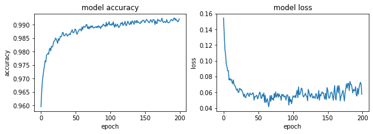

#### SGD - 0.9


```python
optimizer= tf.keras.optimizers.SGD(learning_rate=0.9)
model.compile(optimizer=optimizer,
              loss='sparse_categorical_crossentropy',
              metrics=['accuracy'])

history = model.fit(x_train, y_train, epochs=200)
model.evaluate(x_test,  y_test, verbose=2)
```

    Epoch 1/200
    1875/1875 [==============================] - 1s 791us/step - loss: 0.6512 - accuracy: 0.9589
    Epoch 2/200
    1875/1875 [==============================] - 1s 748us/step - loss: 0.8564 - accuracy: 0.9450
    Epoch 3/200
    1875/1875 [==============================] - 2s 869us/step - loss: 0.8392 - accuracy: 0.9445
    Epoch 4/200
    1875/1875 [==============================] - 1s 697us/step - loss: 0.6498 - accuracy: 0.9489
    Epoch 5/200
    1875/1875 [==============================] - 1s 711us/step - loss: 0.6066 - accuracy: 0.9504
    Epoch 6/200
    1875/1875 [==============================] - 1s 699us/step - loss: 0.5482 - accuracy: 0.9510
    Epoch 7/200
    1875/1875 [==============================] - 1s 695us/step - loss: 0.5109 - accuracy: 0.9549
    Epoch 8/200
    1875/1875 [==============================] - 1s 693us/step - loss: 0.4924 - accuracy: 0.9545
    Epoch 9/200
    1875/1875 [==============================] - 1s 699us/step - loss: 0.4742 - accuracy: 0.9551
    Epoch 10/200
    1875/1875 [==============================] - 1s 783us/step - loss: 0.4093 - accuracy: 0.9555
    Epoch 11/200
    1875/1875 [==============================] - 1s 744us/step - loss: 0.3472 - accuracy: 0.9577
    Epoch 12/200
    1875/1875 [==============================] - 1s 703us/step - loss: 0.3646 - accuracy: 0.9593
    Epoch 13/200
    1875/1875 [==============================] - 1s 699us/step - loss: 0.3713 - accuracy: 0.9573
    Epoch 14/200
    1875/1875 [==============================] - 1s 698us/step - loss: 0.3475 - accuracy: 0.9581
    Epoch 15/200
    1875/1875 [==============================] - 1s 709us/step - loss: 0.2982 - accuracy: 0.9617
    Epoch 16/200
    1875/1875 [==============================] - 1s 710us/step - loss: 0.2989 - accuracy: 0.9620
    Epoch 17/200
    1875/1875 [==============================] - 1s 700us/step - loss: 0.2839 - accuracy: 0.9624
    Epoch 18/200
    1875/1875 [==============================] - 2s 805us/step - loss: 0.3009 - accuracy: 0.9623
    Epoch 19/200
    1875/1875 [==============================] - 1s 691us/step - loss: 0.2978 - accuracy: 0.9626
    Epoch 20/200
    1875/1875 [==============================] - 1s 690us/step - loss: 0.2788 - accuracy: 0.9633
    Epoch 21/200
    1875/1875 [==============================] - 1s 709us/step - loss: 0.2889 - accuracy: 0.9648
    Epoch 22/200
    1875/1875 [==============================] - 1s 708us/step - loss: 0.2934 - accuracy: 0.9630
    Epoch 23/200
    1875/1875 [==============================] - 1s 692us/step - loss: 0.2521 - accuracy: 0.9658
    Epoch 24/200
    1875/1875 [==============================] - 1s 685us/step - loss: 0.2810 - accuracy: 0.9643
    Epoch 25/200
    1875/1875 [==============================] - 2s 852us/step - loss: 0.2896 - accuracy: 0.9645
    Epoch 26/200
    1875/1875 [==============================] - 1s 698us/step - loss: 0.2435 - accuracy: 0.9656
    Epoch 27/200
    1875/1875 [==============================] - 1s 691us/step - loss: 0.2467 - accuracy: 0.9667
    Epoch 28/200
    1875/1875 [==============================] - 1s 712us/step - loss: 0.2817 - accuracy: 0.9675
    Epoch 29/200
    1875/1875 [==============================] - 1s 693us/step - loss: 0.2303 - accuracy: 0.9705
    Epoch 30/200
    1875/1875 [==============================] - 1s 694us/step - loss: 0.2532 - accuracy: 0.9686
    Epoch 31/200
    1875/1875 [==============================] - 1s 704us/step - loss: 0.2269 - accuracy: 0.9687
    Epoch 32/200
    1875/1875 [==============================] - 1s 695us/step - loss: 0.2534 - accuracy: 0.9676
    Epoch 33/200
    1875/1875 [==============================] - 2s 841us/step - loss: 0.2165 - accuracy: 0.9701
    Epoch 34/200
    1875/1875 [==============================] - 1s 721us/step - loss: 0.2279 - accuracy: 0.9704
    Epoch 35/200
    1875/1875 [==============================] - 1s 716us/step - loss: 0.2246 - accuracy: 0.9702
    Epoch 36/200
    1875/1875 [==============================] - 1s 697us/step - loss: 0.2195 - accuracy: 0.9709
    Epoch 37/200
    1875/1875 [==============================] - 1s 718us/step - loss: 0.2339 - accuracy: 0.9713
    Epoch 38/200
    1875/1875 [==============================] - 1s 703us/step - loss: 0.2315 - accuracy: 0.9710
    Epoch 39/200
    1875/1875 [==============================] - 1s 707us/step - loss: 0.2244 - accuracy: 0.9713
    Epoch 40/200
    1875/1875 [==============================] - 2s 828us/step - loss: 0.1858 - accuracy: 0.9740
    Epoch 41/200
    1875/1875 [==============================] - 1s 704us/step - loss: 0.2144 - accuracy: 0.9722
    Epoch 42/200
    1875/1875 [==============================] - 1s 693us/step - loss: 0.2058 - accuracy: 0.9726
    Epoch 43/200
    1875/1875 [==============================] - 1s 700us/step - loss: 0.2094 - accuracy: 0.9728
    Epoch 44/200
    1875/1875 [==============================] - 1s 696us/step - loss: 0.2243 - accuracy: 0.9720
    Epoch 45/200
    1875/1875 [==============================] - 1s 751us/step - loss: 0.1846 - accuracy: 0.9741
    Epoch 46/200
    1875/1875 [==============================] - 1s 744us/step - loss: 0.1770 - accuracy: 0.9739
    Epoch 47/200
    1875/1875 [==============================] - 1s 710us/step - loss: 0.1733 - accuracy: 0.9750
    Epoch 48/200
    1875/1875 [==============================] - 2s 832us/step - loss: 0.1949 - accuracy: 0.9741
    Epoch 49/200
    1875/1875 [==============================] - 1s 701us/step - loss: 0.1959 - accuracy: 0.9762
    Epoch 50/200
    1875/1875 [==============================] - 1s 716us/step - loss: 0.1804 - accuracy: 0.9755
    Epoch 51/200
    1875/1875 [==============================] - 1s 695us/step - loss: 0.2205 - accuracy: 0.9738
    Epoch 52/200
    1875/1875 [==============================] - 1s 696us/step - loss: 0.1860 - accuracy: 0.9753
    Epoch 53/200
    1875/1875 [==============================] - 1s 715us/step - loss: 0.1874 - accuracy: 0.9752
    Epoch 54/200
    1875/1875 [==============================] - 1s 705us/step - loss: 0.1984 - accuracy: 0.9740
    Epoch 55/200
    1875/1875 [==============================] - 2s 831us/step - loss: 0.1743 - accuracy: 0.9752
    Epoch 56/200
    1875/1875 [==============================] - 1s 721us/step - loss: 0.1659 - accuracy: 0.9755
    Epoch 57/200
    1875/1875 [==============================] - 1s 687us/step - loss: 0.1908 - accuracy: 0.9756
    Epoch 58/200
    1875/1875 [==============================] - 1s 685us/step - loss: 0.1812 - accuracy: 0.9755
    Epoch 59/200
    1875/1875 [==============================] - 1s 697us/step - loss: 0.1730 - accuracy: 0.9755
    Epoch 60/200
    1875/1875 [==============================] - 1s 694us/step - loss: 0.1837 - accuracy: 0.9753
    Epoch 61/200
    1875/1875 [==============================] - 1s 689us/step - loss: 0.1667 - accuracy: 0.9751
    Epoch 62/200
    1875/1875 [==============================] - 1s 701us/step - loss: 0.1800 - accuracy: 0.9751
    Epoch 63/200
    1875/1875 [==============================] - 2s 872us/step - loss: 0.1765 - accuracy: 0.9766
    Epoch 64/200
    1875/1875 [==============================] - 1s 688us/step - loss: 0.1799 - accuracy: 0.9757
    Epoch 65/200
    1875/1875 [==============================] - 1s 705us/step - loss: 0.1685 - accuracy: 0.9769
    Epoch 66/200
    1875/1875 [==============================] - 1s 691us/step - loss: 0.1740 - accuracy: 0.9765
    Epoch 67/200
    1875/1875 [==============================] - ETA: 0s - loss: 0.1777 - accuracy: 0.97 - 1s 685us/step - loss: 0.1758 - accuracy: 0.9767
    Epoch 68/200
    1875/1875 [==============================] - 1s 686us/step - loss: 0.1727 - accuracy: 0.9782
    Epoch 69/200
    1875/1875 [==============================] - 1s 696us/step - loss: 0.1770 - accuracy: 0.9765
    Epoch 70/200
    1875/1875 [==============================] - 1s 689us/step - loss: 0.1555 - accuracy: 0.9785
    Epoch 71/200
    1875/1875 [==============================] - 2s 874us/step - loss: 0.1623 - accuracy: 0.9779
    Epoch 72/200
    1875/1875 [==============================] - 1s 703us/step - loss: 0.1696 - accuracy: 0.9776
    Epoch 73/200
    1875/1875 [==============================] - 1s 690us/step - loss: 0.1770 - accuracy: 0.9773
    Epoch 74/200
    1875/1875 [==============================] - 1s 695us/step - loss: 0.1563 - accuracy: 0.9778
    Epoch 75/200
    1875/1875 [==============================] - 1s 707us/step - loss: 0.1768 - accuracy: 0.9767
    Epoch 76/200
    1875/1875 [==============================] - 1s 688us/step - loss: 0.1570 - accuracy: 0.9779
    Epoch 77/200
    1875/1875 [==============================] - 1s 685us/step - loss: 0.1540 - accuracy: 0.9792
    Epoch 78/200
    1875/1875 [==============================] - 1s 762us/step - loss: 0.1508 - accuracy: 0.9788
    Epoch 79/200
    1875/1875 [==============================] - 1s 694us/step - loss: 0.1484 - accuracy: 0.9790
    Epoch 80/200
    1875/1875 [==============================] - 1s 700us/step - loss: 0.1989 - accuracy: 0.9762
    Epoch 81/200
    1875/1875 [==============================] - 1s 690us/step - loss: 0.1619 - accuracy: 0.9788
    Epoch 82/200
    1875/1875 [==============================] - 1s 697us/step - loss: 0.1586 - accuracy: 0.9783
    Epoch 83/200
    1875/1875 [==============================] - 1s 695us/step - loss: 0.1703 - accuracy: 0.9761
    Epoch 84/200
    1875/1875 [==============================] - 1s 699us/step - loss: 0.1633 - accuracy: 0.9772
    Epoch 85/200
    1875/1875 [==============================] - 1s 705us/step - loss: 0.1637 - accuracy: 0.9765
    Epoch 86/200
    1875/1875 [==============================] - 2s 849us/step - loss: 0.1601 - accuracy: 0.9783
    Epoch 87/200
    1875/1875 [==============================] - 1s 693us/step - loss: 0.1485 - accuracy: 0.9785
    Epoch 88/200
    1875/1875 [==============================] - 1s 697us/step - loss: 0.1490 - accuracy: 0.9776
    Epoch 89/200
    1875/1875 [==============================] - 1s 702us/step - loss: 0.1459 - accuracy: 0.9787
    Epoch 90/200
    1875/1875 [==============================] - 1s 691us/step - loss: 0.1517 - accuracy: 0.9791
    Epoch 91/200
    1875/1875 [==============================] - 1s 700us/step - loss: 0.1718 - accuracy: 0.9797
    Epoch 92/200
    1875/1875 [==============================] - 1s 699us/step - loss: 0.1488 - accuracy: 0.9790
    Epoch 93/200
    1875/1875 [==============================] - 1s 788us/step - loss: 0.1471 - accuracy: 0.9793
    Epoch 94/200
    1875/1875 [==============================] - 1s 734us/step - loss: 0.1533 - accuracy: 0.9785
    Epoch 95/200
    1875/1875 [==============================] - 1s 698us/step - loss: 0.1688 - accuracy: 0.9787
    Epoch 96/200
    1875/1875 [==============================] - 1s 685us/step - loss: 0.1298 - accuracy: 0.9805
    Epoch 97/200
    1875/1875 [==============================] - 1s 705us/step - loss: 0.1569 - accuracy: 0.9790
    Epoch 98/200
    1875/1875 [==============================] - 1s 697us/step - loss: 0.1641 - accuracy: 0.9792
    Epoch 99/200
    1875/1875 [==============================] - 1s 700us/step - loss: 0.1563 - accuracy: 0.9793
    Epoch 100/200
    1875/1875 [==============================] - 1s 697us/step - loss: 0.1620 - accuracy: 0.9796
    Epoch 101/200
    1875/1875 [==============================] - 1s 755us/step - loss: 0.1550 - accuracy: 0.9803
    Epoch 102/200
    1875/1875 [==============================] - 1s 692us/step - loss: 0.1616 - accuracy: 0.9795
    Epoch 103/200
    1875/1875 [==============================] - 1s 693us/step - loss: 0.1513 - accuracy: 0.9803
    Epoch 104/200
    1875/1875 [==============================] - 1s 699us/step - loss: 0.1647 - accuracy: 0.9782
    Epoch 105/200
    1875/1875 [==============================] - 1s 707us/step - loss: 0.1508 - accuracy: 0.9807
    Epoch 106/200
    1875/1875 [==============================] - 1s 697us/step - loss: 0.1674 - accuracy: 0.9793
    Epoch 107/200
    1875/1875 [==============================] - 1s 699us/step - loss: 0.1598 - accuracy: 0.9801
    Epoch 108/200
    1875/1875 [==============================] - 1s 704us/step - loss: 0.1666 - accuracy: 0.9797
    Epoch 109/200
    1875/1875 [==============================] - 1s 789us/step - loss: 0.1539 - accuracy: 0.9800
    Epoch 110/200
    1875/1875 [==============================] - 1s 714us/step - loss: 0.1581 - accuracy: 0.9805
    Epoch 111/200
    1875/1875 [==============================] - 1s 687us/step - loss: 0.1372 - accuracy: 0.9802
    Epoch 112/200
    1875/1875 [==============================] - 1s 696us/step - loss: 0.1432 - accuracy: 0.9806
    Epoch 113/200
    1875/1875 [==============================] - 1s 699us/step - loss: 0.1364 - accuracy: 0.9803
    Epoch 114/200
    1875/1875 [==============================] - 1s 701us/step - loss: 0.1458 - accuracy: 0.9802
    Epoch 115/200
    1875/1875 [==============================] - 1s 704us/step - loss: 0.1362 - accuracy: 0.9809
    Epoch 116/200
    1875/1875 [==============================] - 1s 743us/step - loss: 0.1430 - accuracy: 0.9799
    Epoch 117/200
    1875/1875 [==============================] - 1s 724us/step - loss: 0.1278 - accuracy: 0.9815
    Epoch 118/200
    1875/1875 [==============================] - 1s 698us/step - loss: 0.1289 - accuracy: 0.9822
    Epoch 119/200
    1875/1875 [==============================] - 1s 697us/step - loss: 0.1332 - accuracy: 0.9820
    Epoch 120/200
    1875/1875 [==============================] - 1s 703us/step - loss: 0.1444 - accuracy: 0.9812
    Epoch 121/200
    1875/1875 [==============================] - 1s 699us/step - loss: 0.1323 - accuracy: 0.9813
    Epoch 122/200
    1875/1875 [==============================] - 1s 698us/step - loss: 0.1313 - accuracy: 0.9808
    Epoch 123/200
    1875/1875 [==============================] - 1s 714us/step - loss: 0.1433 - accuracy: 0.9806
    Epoch 124/200
    1875/1875 [==============================] - 2s 921us/step - loss: 0.1404 - accuracy: 0.9803
    Epoch 125/200
    1875/1875 [==============================] - 1s 711us/step - loss: 0.1152 - accuracy: 0.9824
    Epoch 126/200
    1875/1875 [==============================] - 1s 701us/step - loss: 0.1220 - accuracy: 0.9837
    Epoch 127/200
    1875/1875 [==============================] - 1s 694us/step - loss: 0.1426 - accuracy: 0.9825
    Epoch 128/200
    1875/1875 [==============================] - 1s 692us/step - loss: 0.1362 - accuracy: 0.9822
    Epoch 129/200
    1875/1875 [==============================] - 1s 696us/step - loss: 0.1458 - accuracy: 0.9811
    Epoch 130/200
    1875/1875 [==============================] - 1s 689us/step - loss: 0.1196 - accuracy: 0.9830
    Epoch 131/200
    1875/1875 [==============================] - 1s 699us/step - loss: 0.1382 - accuracy: 0.9827
    Epoch 132/200
    1875/1875 [==============================] - 2s 807us/step - loss: 0.1301 - accuracy: 0.9814
    Epoch 133/200
    1875/1875 [==============================] - 1s 700us/step - loss: 0.1321 - accuracy: 0.9822
    Epoch 134/200
    1875/1875 [==============================] - 1s 739us/step - loss: 0.1426 - accuracy: 0.9812
    Epoch 135/200
    1875/1875 [==============================] - 1s 722us/step - loss: 0.1485 - accuracy: 0.9798
    Epoch 136/200
    1875/1875 [==============================] - 1s 697us/step - loss: 0.1471 - accuracy: 0.9822
    Epoch 137/200
    1875/1875 [==============================] - 1s 686us/step - loss: 0.1515 - accuracy: 0.9827
    Epoch 138/200
    1875/1875 [==============================] - 1s 695us/step - loss: 0.1518 - accuracy: 0.9808
    Epoch 139/200
    1875/1875 [==============================] - 2s 843us/step - loss: 0.1421 - accuracy: 0.9819
    Epoch 140/200
    1875/1875 [==============================] - 1s 705us/step - loss: 0.1402 - accuracy: 0.9829
    Epoch 141/200
    1875/1875 [==============================] - 1s 697us/step - loss: 0.1608 - accuracy: 0.9809
    Epoch 142/200
    1875/1875 [==============================] - 1s 713us/step - loss: 0.1358 - accuracy: 0.9823
    Epoch 143/200
    1875/1875 [==============================] - 1s 691us/step - loss: 0.1270 - accuracy: 0.9820
    Epoch 144/200
    1875/1875 [==============================] - 1s 686us/step - loss: 0.1291 - accuracy: 0.9823
    Epoch 145/200
    1875/1875 [==============================] - 1s 706us/step - loss: 0.1449 - accuracy: 0.9816
    Epoch 146/200
    1875/1875 [==============================] - 1s 693us/step - loss: 0.1426 - accuracy: 0.9816
    Epoch 147/200
    1875/1875 [==============================] - 1s 799us/step - loss: 0.1364 - accuracy: 0.9821
    Epoch 148/200
    1875/1875 [==============================] - 1s 696us/step - loss: 0.1216 - accuracy: 0.9826
    Epoch 149/200
    1875/1875 [==============================] - 1s 704us/step - loss: 0.1421 - accuracy: 0.9816
    Epoch 150/200
    1875/1875 [==============================] - 1s 694us/step - loss: 0.1324 - accuracy: 0.9826
    Epoch 151/200
    1875/1875 [==============================] - 1s 700us/step - loss: 0.1430 - accuracy: 0.9819
    Epoch 152/200
    1875/1875 [==============================] - 1s 712us/step - loss: 0.1395 - accuracy: 0.9821
    Epoch 153/200
    1875/1875 [==============================] - 1s 689us/step - loss: 0.1438 - accuracy: 0.9808
    Epoch 154/200
    1875/1875 [==============================] - 2s 836us/step - loss: 0.1498 - accuracy: 0.9808
    Epoch 155/200
    1875/1875 [==============================] - 1s 709us/step - loss: 0.1267 - accuracy: 0.9829
    Epoch 156/200
    1875/1875 [==============================] - 1s 691us/step - loss: 0.1169 - accuracy: 0.9834
    Epoch 157/200
    1875/1875 [==============================] - 1s 688us/step - loss: 0.1064 - accuracy: 0.9852
    Epoch 158/200
    1875/1875 [==============================] - 1s 702us/step - loss: 0.1276 - accuracy: 0.9826
    Epoch 159/200
    1875/1875 [==============================] - 1s 687us/step - loss: 0.1207 - accuracy: 0.9834
    Epoch 160/200
    1875/1875 [==============================] - 1s 706us/step - loss: 0.1248 - accuracy: 0.9826
    Epoch 161/200
    1875/1875 [==============================] - 1s 693us/step - loss: 0.1485 - accuracy: 0.9805
    Epoch 162/200
    1875/1875 [==============================] - 1s 789us/step - loss: 0.1409 - accuracy: 0.9820
    Epoch 163/200
    1875/1875 [==============================] - 1s 689us/step - loss: 0.1533 - accuracy: 0.9816
    Epoch 164/200
    1875/1875 [==============================] - 1s 692us/step - loss: 0.1404 - accuracy: 0.9830
    Epoch 165/200
    1875/1875 [==============================] - 1s 698us/step - loss: 0.1429 - accuracy: 0.9816
    Epoch 166/200
    1875/1875 [==============================] - 1s 692us/step - loss: 0.1485 - accuracy: 0.9808
    Epoch 167/200
    1875/1875 [==============================] - 1s 695us/step - loss: 0.1375 - accuracy: 0.9815
    Epoch 168/200
    1875/1875 [==============================] - 1s 707us/step - loss: 0.1210 - accuracy: 0.9826
    Epoch 169/200
    1875/1875 [==============================] - 1s 704us/step - loss: 0.1387 - accuracy: 0.9830
    Epoch 170/200
    1875/1875 [==============================] - 1s 776us/step - loss: 0.1210 - accuracy: 0.9833
    Epoch 171/200
    1875/1875 [==============================] - 1s 699us/step - loss: 0.1311 - accuracy: 0.9823
    Epoch 172/200
    1875/1875 [==============================] - 1s 687us/step - loss: 0.1339 - accuracy: 0.9830
    Epoch 173/200
    1875/1875 [==============================] - 1s 686us/step - loss: 0.1231 - accuracy: 0.9843
    Epoch 174/200
    1875/1875 [==============================] - 1s 694us/step - loss: 0.1328 - accuracy: 0.9840
    Epoch 175/200
    1875/1875 [==============================] - 1s 710us/step - loss: 0.1232 - accuracy: 0.9826
    Epoch 176/200
    1875/1875 [==============================] - 1s 687us/step - loss: 0.1342 - accuracy: 0.9829
    Epoch 177/200
    1875/1875 [==============================] - 2s 831us/step - loss: 0.1334 - accuracy: 0.9833
    Epoch 178/200
    1875/1875 [==============================] - 1s 688us/step - loss: 0.1349 - accuracy: 0.9833
    Epoch 179/200
    1875/1875 [==============================] - 1s 692us/step - loss: 0.1321 - accuracy: 0.9835
    Epoch 180/200
    1875/1875 [==============================] - 1s 685us/step - loss: 0.1390 - accuracy: 0.9824
    Epoch 181/200
    1875/1875 [==============================] - 1s 699us/step - loss: 0.1389 - accuracy: 0.9830
    Epoch 182/200
    1875/1875 [==============================] - 1s 710us/step - loss: 0.1287 - accuracy: 0.9834
    Epoch 183/200
    1875/1875 [==============================] - 1s 686us/step - loss: 0.1249 - accuracy: 0.9835
    Epoch 184/200
    1875/1875 [==============================] - 1s 719us/step - loss: 0.1343 - accuracy: 0.9829
    Epoch 185/200
    1875/1875 [==============================] - 2s 856us/step - loss: 0.1290 - accuracy: 0.9844
    Epoch 186/200
    1875/1875 [==============================] - 1s 704us/step - loss: 0.1329 - accuracy: 0.9824
    Epoch 187/200
    1875/1875 [==============================] - 1s 701us/step - loss: 0.1343 - accuracy: 0.9842
    Epoch 188/200
    1875/1875 [==============================] - 1s 696us/step - loss: 0.1255 - accuracy: 0.9845
    Epoch 189/200
    1875/1875 [==============================] - 1s 710us/step - loss: 0.1477 - accuracy: 0.9826
    Epoch 190/200
    1875/1875 [==============================] - 1s 699us/step - loss: 0.1377 - accuracy: 0.9832
    Epoch 191/200
    1875/1875 [==============================] - 1s 688us/step - loss: 0.1303 - accuracy: 0.9831
    Epoch 192/200
    1875/1875 [==============================] - 2s 822us/step - loss: 0.1425 - accuracy: 0.9821
    Epoch 193/200
    1875/1875 [==============================] - 1s 779us/step - loss: 0.1231 - accuracy: 0.9837
    Epoch 194/200
    1875/1875 [==============================] - 1s 701us/step - loss: 0.1136 - accuracy: 0.9840
    Epoch 195/200
    1875/1875 [==============================] - 1s 692us/step - loss: 0.1293 - accuracy: 0.9831
    Epoch 196/200
    1875/1875 [==============================] - 1s 696us/step - loss: 0.1263 - accuracy: 0.9840
    Epoch 197/200
    1875/1875 [==============================] - 1s 711us/step - loss: 0.1226 - accuracy: 0.9836
    Epoch 198/200
    1875/1875 [==============================] - 1s 699us/step - loss: 0.1469 - accuracy: 0.9827
    Epoch 199/200
    1875/1875 [==============================] - 1s 700us/step - loss: 0.1294 - accuracy: 0.9834
    Epoch 200/200
    1875/1875 [==============================] - 2s 838us/step - loss: 0.1274 - accuracy: 0.9832
    313/313 - 0s - loss: 1.1582 - accuracy: 0.9686
    


    [1.1582387685775757, 0.9685999751091003]


```python
fig, (ax1, ax2) = plt.subplots(1, 2, figsize=(10, 3))

#ax1.subplot(1, 2, 1)
ax1.plot(history.history['accuracy'])
#plt.plot(history.history['val_accuracy'])
ax1.set_title('model accuracy')
ax1.set_ylabel('accuracy')
ax1.set_xlabel('epoch')
#ax1.show()

#ax2.subplot(1, 2, 2)
ax2.plot(history.history['loss'])
#plt.plot(history.history['val_loss'])
ax2.set_title('model loss')
ax2.set_ylabel('loss')
ax2.set_xlabel('epoch')
```

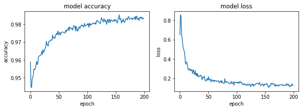

#### SGD - 1.5


```python
optimizer= tf.keras.optimizers.SGD(learning_rate=1.5)
model.compile(optimizer=optimizer,
              loss='sparse_categorical_crossentropy',
              metrics=['accuracy'])

history = model.fit(x_train, y_train, epochs=200)
model.evaluate(x_test,  y_test, verbose=2)
```

    Epoch 1/200
    1875/1875 [==============================] - 2s 821us/step - loss: 0.6443 - accuracy: 0.9547
    Epoch 2/200
    1875/1875 [==============================] - 1s 715us/step - loss: 0.7155 - accuracy: 0.9232
    Epoch 3/200
    1875/1875 [==============================] - 1s 725us/step - loss: 0.5862 - accuracy: 0.9193
    Epoch 4/200
    1875/1875 [==============================] - 1s 714us/step - loss: 0.6251 - accuracy: 0.9190
    Epoch 5/200
    1875/1875 [==============================] - 1s 697us/step - loss: 0.5203 - accuracy: 0.9170
    Epoch 6/200
    1875/1875 [==============================] - 2s 820us/step - loss: 0.5135 - accuracy: 0.9199
    Epoch 7/200
    1875/1875 [==============================] - 1s 715us/step - loss: 0.4816 - accuracy: 0.9157
    Epoch 8/200
    1875/1875 [==============================] - 1s 699us/step - loss: 0.4658 - accuracy: 0.9222
    Epoch 9/200
    1875/1875 [==============================] - 1s 725us/step - loss: 0.4159 - accuracy: 0.9228
    Epoch 10/200
    1875/1875 [==============================] - 1s 712us/step - loss: 0.4456 - accuracy: 0.9244
    Epoch 11/200
    1875/1875 [==============================] - 1s 717us/step - loss: 0.4120 - accuracy: 0.9283
    Epoch 12/200
    1875/1875 [==============================] - 1s 718us/step - loss: 0.4189 - accuracy: 0.9312
    Epoch 13/200
    1875/1875 [==============================] - 2s 804us/step - loss: 0.4380 - accuracy: 0.9251
    Epoch 14/200
    1875/1875 [==============================] - 1s 722us/step - loss: 0.4205 - accuracy: 0.9251
    Epoch 15/200
    1875/1875 [==============================] - 1s 707us/step - loss: 0.3577 - accuracy: 0.9298
    Epoch 16/200
    1875/1875 [==============================] - 1s 705us/step - loss: 0.3591 - accuracy: 0.9278
    Epoch 17/200
    1875/1875 [==============================] - 1s 718us/step - loss: 0.3386 - accuracy: 0.9261
    Epoch 18/200
    1875/1875 [==============================] - 1s 711us/step - loss: 0.3111 - accuracy: 0.9367
    Epoch 19/200
    1875/1875 [==============================] - 1s 710us/step - loss: 0.3154 - accuracy: 0.9402
    Epoch 20/200
    1875/1875 [==============================] - 1s 712us/step - loss: 0.3256 - accuracy: 0.9381
    Epoch 21/200
    1875/1875 [==============================] - 2s 851us/step - loss: 0.3070 - accuracy: 0.9388
    Epoch 22/200
    1875/1875 [==============================] - 1s 725us/step - loss: 0.3490 - accuracy: 0.9390
    Epoch 23/200
    1875/1875 [==============================] - 1s 708us/step - loss: 0.2730 - accuracy: 0.9419
    Epoch 24/200
    1875/1875 [==============================] - 1s 713us/step - loss: 0.2836 - accuracy: 0.9428
    Epoch 25/200
    1875/1875 [==============================] - 1s 715us/step - loss: 0.2788 - accuracy: 0.9410
    Epoch 26/200
    1875/1875 [==============================] - 1s 716us/step - loss: 0.2841 - accuracy: 0.9392
    Epoch 27/200
    1875/1875 [==============================] - 1s 709us/step - loss: 0.2870 - accuracy: 0.9409
    Epoch 28/200
    1875/1875 [==============================] - 1s 791us/step - loss: 0.2791 - accuracy: 0.9443
    Epoch 29/200
    1875/1875 [==============================] - 1s 709us/step - loss: 0.2716 - accuracy: 0.9465
    Epoch 30/200
    1875/1875 [==============================] - 1s 710us/step - loss: 0.2634 - accuracy: 0.9466
    Epoch 31/200
    1875/1875 [==============================] - 1s 717us/step - loss: 0.2593 - accuracy: 0.9449
    Epoch 32/200
    1875/1875 [==============================] - 1s 711us/step - loss: 0.3004 - accuracy: 0.9429
    Epoch 33/200
    1875/1875 [==============================] - 1s 715us/step - loss: 0.2864 - accuracy: 0.9360
    Epoch 34/200
    1875/1875 [==============================] - 1s 714us/step - loss: 0.2926 - accuracy: 0.9390
    Epoch 35/200
    1875/1875 [==============================] - 1s 708us/step - loss: 0.2704 - accuracy: 0.9423
    Epoch 36/200
    1875/1875 [==============================] - 2s 850us/step - loss: 0.2709 - accuracy: 0.9418
    Epoch 37/200
    1875/1875 [==============================] - 1s 710us/step - loss: 0.2847 - accuracy: 0.9449
    Epoch 38/200
    1875/1875 [==============================] - 1s 710us/step - loss: 0.2738 - accuracy: 0.9452
    Epoch 39/200
    1875/1875 [==============================] - 1s 714us/step - loss: 0.2753 - accuracy: 0.9453
    Epoch 40/200
    1875/1875 [==============================] - 1s 705us/step - loss: 0.2500 - accuracy: 0.9467
    Epoch 41/200
    1875/1875 [==============================] - 1s 710us/step - loss: 0.2715 - accuracy: 0.9459
    Epoch 42/200
    1875/1875 [==============================] - 1s 730us/step - loss: 0.2727 - accuracy: 0.9473
    Epoch 43/200
    1875/1875 [==============================] - 2s 848us/step - loss: 0.2619 - accuracy: 0.9467
    Epoch 44/200
    1875/1875 [==============================] - 1s 712us/step - loss: 0.2457 - accuracy: 0.9446
    Epoch 45/200
    1875/1875 [==============================] - 1s 793us/step - loss: 0.2524 - accuracy: 0.9433
    Epoch 46/200
    1875/1875 [==============================] - 1s 720us/step - loss: 0.2757 - accuracy: 0.9424
    Epoch 47/200
    1875/1875 [==============================] - 1s 715us/step - loss: 0.2568 - accuracy: 0.9426
    Epoch 48/200
    1875/1875 [==============================] - 1s 709us/step - loss: 0.2743 - accuracy: 0.9474
    Epoch 49/200
    1875/1875 [==============================] - 1s 703us/step - loss: 0.2787 - accuracy: 0.9419
    Epoch 50/200
    1875/1875 [==============================] - 2s 815us/step - loss: 0.2641 - accuracy: 0.9430
    Epoch 51/200
    1875/1875 [==============================] - 1s 793us/step - loss: 0.2627 - accuracy: 0.9434
    Epoch 52/200
    1875/1875 [==============================] - 1s 707us/step - loss: 0.2493 - accuracy: 0.9477
    Epoch 53/200
    1875/1875 [==============================] - 1s 699us/step - loss: 0.2221 - accuracy: 0.9524
    Epoch 54/200
    1875/1875 [==============================] - 1s 726us/step - loss: 0.2321 - accuracy: 0.9534
    Epoch 55/200
    1875/1875 [==============================] - 1s 710us/step - loss: 0.2492 - accuracy: 0.9506
    Epoch 56/200
    1875/1875 [==============================] - 1s 720us/step - loss: 0.2535 - accuracy: 0.9471
    Epoch 57/200
    1875/1875 [==============================] - 1s 706us/step - loss: 0.2311 - accuracy: 0.9483
    Epoch 58/200
    1875/1875 [==============================] - 2s 821us/step - loss: 0.2442 - accuracy: 0.9481
    Epoch 59/200
    1875/1875 [==============================] - 1s 697us/step - loss: 0.2155 - accuracy: 0.9543
    Epoch 60/200
    1875/1875 [==============================] - 1s 715us/step - loss: 0.2190 - accuracy: 0.9509
    Epoch 61/200
    1875/1875 [==============================] - 1s 702us/step - loss: 0.2091 - accuracy: 0.9522
    Epoch 62/200
    1875/1875 [==============================] - 1s 710us/step - loss: 0.2201 - accuracy: 0.9522
    Epoch 63/200
    1875/1875 [==============================] - 1s 702us/step - loss: 0.2117 - accuracy: 0.9552
    Epoch 64/200
    1875/1875 [==============================] - 1s 709us/step - loss: 0.2070 - accuracy: 0.9554
    Epoch 65/200
    1875/1875 [==============================] - 2s 877us/step - loss: 0.2150 - accuracy: 0.9530
    Epoch 66/200
    1875/1875 [==============================] - 1s 711us/step - loss: 0.2268 - accuracy: 0.9519
    Epoch 67/200
    1875/1875 [==============================] - 1s 705us/step - loss: 0.2247 - accuracy: 0.9526
    Epoch 68/200
    1875/1875 [==============================] - 1s 705us/step - loss: 0.2203 - accuracy: 0.9531
    Epoch 69/200
    1875/1875 [==============================] - 1s 704us/step - loss: 0.2118 - accuracy: 0.9536
    Epoch 70/200
    1875/1875 [==============================] - 1s 724us/step - loss: 0.2259 - accuracy: 0.9520
    Epoch 71/200
    1875/1875 [==============================] - 1s 702us/step - loss: 0.2151 - accuracy: 0.9535
    Epoch 72/200
    1875/1875 [==============================] - 1s 703us/step - loss: 0.2292 - accuracy: 0.9535
    Epoch 73/200
    1875/1875 [==============================] - 2s 835us/step - loss: 0.2002 - accuracy: 0.9561
    Epoch 74/200
    1875/1875 [==============================] - 1s 709us/step - loss: 0.2095 - accuracy: 0.9521
    Epoch 75/200
    1875/1875 [==============================] - 1s 703us/step - loss: 0.2207 - accuracy: 0.9540
    Epoch 76/200
    1875/1875 [==============================] - 1s 726us/step - loss: 0.2281 - accuracy: 0.9512
    Epoch 77/200
    1875/1875 [==============================] - 1s 704us/step - loss: 0.2034 - accuracy: 0.9578
    Epoch 78/200
    1875/1875 [==============================] - 1s 708us/step - loss: 0.2034 - accuracy: 0.9567
    Epoch 79/200
    1875/1875 [==============================] - 1s 711us/step - loss: 0.1952 - accuracy: 0.9568
    Epoch 80/200
    1875/1875 [==============================] - 2s 837us/step - loss: 0.2027 - accuracy: 0.9592
    Epoch 81/200
    1875/1875 [==============================] - 1s 697us/step - loss: 0.2014 - accuracy: 0.9572
    Epoch 82/200
    1875/1875 [==============================] - 1s 710us/step - loss: 0.2013 - accuracy: 0.9596
    Epoch 83/200
    1875/1875 [==============================] - 1s 702us/step - loss: 0.2001 - accuracy: 0.9582
    Epoch 84/200
    1875/1875 [==============================] - 1s 705us/step - loss: 0.2058 - accuracy: 0.9589
    Epoch 85/200
    1875/1875 [==============================] - 1s 721us/step - loss: 0.1955 - accuracy: 0.9587
    Epoch 86/200
    1875/1875 [==============================] - 1s 700us/step - loss: 0.1862 - accuracy: 0.9589
    Epoch 87/200
    1875/1875 [==============================] - 1s 698us/step - loss: 0.2111 - accuracy: 0.9585
    Epoch 88/200
    1875/1875 [==============================] - 2s 825us/step - loss: 0.2100 - accuracy: 0.9583
    Epoch 89/200
    1875/1875 [==============================] - 1s 707us/step - loss: 0.2048 - accuracy: 0.9572
    Epoch 90/200
    1875/1875 [==============================] - 1s 724us/step - loss: 0.2123 - accuracy: 0.9548
    Epoch 91/200
    1875/1875 [==============================] - 1s 713us/step - loss: 0.1920 - accuracy: 0.9598
    Epoch 92/200
    1875/1875 [==============================] - 1s 754us/step - loss: 0.1890 - accuracy: 0.9595
    Epoch 93/200
    1875/1875 [==============================] - 1s 775us/step - loss: 0.2043 - accuracy: 0.9571
    Epoch 94/200
    1875/1875 [==============================] - 1s 785us/step - loss: 0.1714 - accuracy: 0.9595
    Epoch 95/200
    1875/1875 [==============================] - 2s 939us/step - loss: 0.2039 - accuracy: 0.9598
    Epoch 96/200
    1875/1875 [==============================] - 1s 754us/step - loss: 0.1846 - accuracy: 0.9607
    Epoch 97/200
    1875/1875 [==============================] - 1s 755us/step - loss: 0.1913 - accuracy: 0.9613
    Epoch 98/200
    1875/1875 [==============================] - 1s 725us/step - loss: 0.1873 - accuracy: 0.9618
    Epoch 99/200
    1875/1875 [==============================] - 1s 722us/step - loss: 0.1788 - accuracy: 0.9594
    Epoch 100/200
    1875/1875 [==============================] - 1s 717us/step - loss: 0.1850 - accuracy: 0.9614
    Epoch 101/200
    1875/1875 [==============================] - 1s 698us/step - loss: 0.1696 - accuracy: 0.9617
    Epoch 102/200
    1875/1875 [==============================] - 1s 715us/step - loss: 0.1828 - accuracy: 0.9615
    Epoch 103/200
    1875/1875 [==============================] - 2s 826us/step - loss: 0.1893 - accuracy: 0.9621
    Epoch 104/200
    1875/1875 [==============================] - 1s 738us/step - loss: 0.1872 - accuracy: 0.9584
    Epoch 105/200
    1875/1875 [==============================] - 1s 796us/step - loss: 0.1844 - accuracy: 0.9602
    Epoch 106/200
    1875/1875 [==============================] - 1s 720us/step - loss: 0.1849 - accuracy: 0.9605
    Epoch 107/200
    1875/1875 [==============================] - 889s 474ms/step - loss: 0.1734 - accuracy: 0.9639
    Epoch 108/200
    1875/1875 [==============================] - 2s 844us/step - loss: 0.1668 - accuracy: 0.9629
    Epoch 109/200
    1875/1875 [==============================] - 2s 940us/step - loss: 0.1794 - accuracy: 0.9613
    Epoch 110/200
    1875/1875 [==============================] - 2s 828us/step - loss: 0.1756 - accuracy: 0.9598
    Epoch 111/200
    1875/1875 [==============================] - 2s 834us/step - loss: 0.1739 - accuracy: 0.9617
    Epoch 112/200
    1875/1875 [==============================] - 2s 916us/step - loss: 0.1870 - accuracy: 0.9609
    Epoch 113/200
    1875/1875 [==============================] - 2s 889us/step - loss: 0.1854 - accuracy: 0.9627
    Epoch 114/200
    1875/1875 [==============================] - 2s 852us/step - loss: 0.1808 - accuracy: 0.9606
    Epoch 115/200
    1875/1875 [==============================] - 2s 953us/step - loss: 0.1847 - accuracy: 0.9610
    Epoch 116/200
    1875/1875 [==============================] - 2s 1ms/step - loss: 0.1747 - accuracy: 0.9604
    Epoch 117/200
    1875/1875 [==============================] - 1s 781us/step - loss: 0.1780 - accuracy: 0.9622
    Epoch 118/200
    1875/1875 [==============================] - 1s 754us/step - loss: 0.1874 - accuracy: 0.9602
    Epoch 119/200
    1875/1875 [==============================] - 1s 730us/step - loss: 0.1894 - accuracy: 0.9594
    Epoch 120/200
    1875/1875 [==============================] - 1s 753us/step - loss: 0.1800 - accuracy: 0.9628
    Epoch 121/200
    1875/1875 [==============================] - 2s 1ms/step - loss: 0.1949 - accuracy: 0.9585
    Epoch 122/200
    1875/1875 [==============================] - 3s 1ms/step - loss: 0.1626 - accuracy: 0.9621
    Epoch 123/200
    1875/1875 [==============================] - 2s 1ms/step - loss: 0.1885 - accuracy: 0.9607
    Epoch 124/200
    1875/1875 [==============================] - 3s 2ms/step - loss: 0.1722 - accuracy: 0.9630
    Epoch 125/200
    1875/1875 [==============================] - 3s 2ms/step - loss: 0.1997 - accuracy: 0.9589
    Epoch 126/200
    1875/1875 [==============================] - 3s 2ms/step - loss: 0.1775 - accuracy: 0.9595
    Epoch 127/200
    1875/1875 [==============================] - 2s 1ms/step - loss: 0.1772 - accuracy: 0.9601
    Epoch 128/200
    1875/1875 [==============================] - 2s 1ms/step - loss: 0.1759 - accuracy: 0.9629
    Epoch 129/200
    1875/1875 [==============================] - 2s 925us/step - loss: 0.1713 - accuracy: 0.9645
    Epoch 130/200
    1875/1875 [==============================] - 2s 1ms/step - loss: 0.1896 - accuracy: 0.9599
    Epoch 131/200
    1875/1875 [==============================] - 2s 900us/step - loss: 0.1796 - accuracy: 0.9603
    Epoch 132/200
    1875/1875 [==============================] - 2s 818us/step - loss: 0.1548 - accuracy: 0.9639
    Epoch 133/200
    1875/1875 [==============================] - 2s 823us/step - loss: 0.1473 - accuracy: 0.9650
    Epoch 134/200
    1875/1875 [==============================] - 2s 855us/step - loss: 0.1708 - accuracy: 0.9646
    Epoch 135/200
    1875/1875 [==============================] - 2s 819us/step - loss: 0.1628 - accuracy: 0.9665
    Epoch 136/200
    1875/1875 [==============================] - 2s 878us/step - loss: 0.1716 - accuracy: 0.9634
    Epoch 137/200
    1875/1875 [==============================] - 2s 833us/step - loss: 0.1680 - accuracy: 0.9637
    Epoch 138/200
    1875/1875 [==============================] - 2s 844us/step - loss: 0.1726 - accuracy: 0.9651
    Epoch 139/200
    1875/1875 [==============================] - 2s 975us/step - loss: 0.1749 - accuracy: 0.9595
    Epoch 140/200
    1875/1875 [==============================] - 2s 834us/step - loss: 0.2080 - accuracy: 0.9542
    Epoch 141/200
    1875/1875 [==============================] - 2s 866us/step - loss: 0.1982 - accuracy: 0.9578
    Epoch 142/200
    1875/1875 [==============================] - 2s 1ms/step - loss: 0.1755 - accuracy: 0.9576
    Epoch 143/200
    1875/1875 [==============================] - 2s 879us/step - loss: 0.1649 - accuracy: 0.9632
    Epoch 144/200
    1875/1875 [==============================] - 2s 816us/step - loss: 0.1582 - accuracy: 0.9644
    Epoch 145/200
    1875/1875 [==============================] - 2s 829us/step - loss: 0.1696 - accuracy: 0.9639
    Epoch 146/200
    1875/1875 [==============================] - 1s 795us/step - loss: 0.1583 - accuracy: 0.9661
    Epoch 147/200
    1875/1875 [==============================] - 2s 863us/step - loss: 0.1613 - accuracy: 0.9660
    Epoch 148/200
    1875/1875 [==============================] - 2s 893us/step - loss: 0.1774 - accuracy: 0.9614
    Epoch 149/200
    1875/1875 [==============================] - 2s 829us/step - loss: 0.1667 - accuracy: 0.9629
    Epoch 150/200
    1875/1875 [==============================] - 1s 769us/step - loss: 0.1732 - accuracy: 0.9632
    Epoch 151/200
    1875/1875 [==============================] - 1s 741us/step - loss: 0.1650 - accuracy: 0.9648
    Epoch 152/200
    1875/1875 [==============================] - 1s 754us/step - loss: 0.1575 - accuracy: 0.9670
    Epoch 153/200
    1875/1875 [==============================] - 1s 756us/step - loss: 0.1588 - accuracy: 0.9649
    Epoch 154/200
    1875/1875 [==============================] - 2s 817us/step - loss: 0.1574 - accuracy: 0.9657
    Epoch 155/200
    1875/1875 [==============================] - 2s 978us/step - loss: 0.1610 - accuracy: 0.9669
    Epoch 156/200
    1875/1875 [==============================] - 2s 990us/step - loss: 0.1687 - accuracy: 0.9649
    Epoch 157/200
    1875/1875 [==============================] - 1s 791us/step - loss: 0.1624 - accuracy: 0.9650
    Epoch 158/200
    1875/1875 [==============================] - 1s 790us/step - loss: 0.1741 - accuracy: 0.9639
    Epoch 159/200
    1875/1875 [==============================] - 1s 773us/step - loss: 0.1653 - accuracy: 0.9643
    Epoch 160/200
    1875/1875 [==============================] - 1s 777us/step - loss: 0.1614 - accuracy: 0.9645
    Epoch 161/200
    1875/1875 [==============================] - 1s 767us/step - loss: 0.1689 - accuracy: 0.9640
    Epoch 162/200
    1875/1875 [==============================] - 1s 787us/step - loss: 0.1589 - accuracy: 0.9648
    Epoch 163/200
    1875/1875 [==============================] - 2s 837us/step - loss: 0.1471 - accuracy: 0.9674
    Epoch 164/200
    1875/1875 [==============================] - 1s 782us/step - loss: 0.1374 - accuracy: 0.9698
    Epoch 165/200
    1875/1875 [==============================] - 1s 738us/step - loss: 0.1548 - accuracy: 0.9666
    Epoch 166/200
    1875/1875 [==============================] - 2s 863us/step - loss: 0.1538 - accuracy: 0.9649
    Epoch 167/200
    1875/1875 [==============================] - 2s 846us/step - loss: 0.1609 - accuracy: 0.9619
    Epoch 168/200
    1875/1875 [==============================] - 1s 758us/step - loss: 0.1765 - accuracy: 0.9650
    Epoch 169/200
    1875/1875 [==============================] - 1s 770us/step - loss: 0.1771 - accuracy: 0.9652
    Epoch 170/200
    1875/1875 [==============================] - 1s 750us/step - loss: 0.1657 - accuracy: 0.9647
    Epoch 171/200
    1875/1875 [==============================] - 1s 756us/step - loss: 0.1543 - accuracy: 0.9663
    Epoch 172/200
    1875/1875 [==============================] - 1s 764us/step - loss: 0.1704 - accuracy: 0.9661
    Epoch 173/200
    1875/1875 [==============================] - 1s 746us/step - loss: 0.1728 - accuracy: 0.9630
    Epoch 174/200
    1875/1875 [==============================] - 2s 823us/step - loss: 0.1556 - accuracy: 0.9660
    Epoch 175/200
    1875/1875 [==============================] - 1s 776us/step - loss: 0.1424 - accuracy: 0.9694
    Epoch 176/200
    1875/1875 [==============================] - 2s 884us/step - loss: 0.1487 - accuracy: 0.9679
    Epoch 177/200
    1875/1875 [==============================] - 2s 860us/step - loss: 0.1416 - accuracy: 0.9687
    Epoch 178/200
    1875/1875 [==============================] - 2s 967us/step - loss: 0.1392 - accuracy: 0.9689
    Epoch 179/200
    1875/1875 [==============================] - 2s 833us/step - loss: 0.1343 - accuracy: 0.9681
    Epoch 180/200
    1875/1875 [==============================] - 2s 821us/step - loss: 0.1578 - accuracy: 0.9683
    Epoch 181/200
    1875/1875 [==============================] - 2s 916us/step - loss: 0.1422 - accuracy: 0.9685
    Epoch 182/200
    1875/1875 [==============================] - 2s 841us/step - loss: 0.1364 - accuracy: 0.9682
    Epoch 183/200
    1875/1875 [==============================] - 1s 788us/step - loss: 0.1551 - accuracy: 0.9667
    Epoch 184/200
    1875/1875 [==============================] - 2s 802us/step - loss: 0.1513 - accuracy: 0.9681
    Epoch 185/200
    1875/1875 [==============================] - 2s 808us/step - loss: 0.1607 - accuracy: 0.9678
    Epoch 186/200
    1875/1875 [==============================] - 1s 779us/step - loss: 0.1448 - accuracy: 0.9671
    Epoch 187/200
    1875/1875 [==============================] - 2s 875us/step - loss: 0.1370 - accuracy: 0.9677
    Epoch 188/200
    1875/1875 [==============================] - 2s 1ms/step - loss: 0.1457 - accuracy: 0.9688
    Epoch 189/200
    1875/1875 [==============================] - 4s 2ms/step - loss: 0.1588 - accuracy: 0.9696
    Epoch 190/200
    1875/1875 [==============================] - 4s 2ms/step - loss: 0.1593 - accuracy: 0.9655
    Epoch 191/200
    1875/1875 [==============================] - 4s 2ms/step - loss: 0.1622 - accuracy: 0.9676
    Epoch 192/200
    1875/1875 [==============================] - 4s 2ms/step - loss: 0.1687 - accuracy: 0.9645
    Epoch 193/200
    1875/1875 [==============================] - 4s 2ms/step - loss: 0.1642 - accuracy: 0.9655
    Epoch 194/200
    1875/1875 [==============================] - 5s 3ms/step - loss: 0.1531 - accuracy: 0.9682
    Epoch 195/200
    1875/1875 [==============================] - 5s 2ms/step - loss: 0.1543 - accuracy: 0.9670
    Epoch 196/200
    1875/1875 [==============================] - 5s 3ms/step - loss: 0.1557 - accuracy: 0.9657
    Epoch 197/200
    1875/1875 [==============================] - 4s 2ms/step - loss: 0.1604 - accuracy: 0.9651
    Epoch 198/200
    1875/1875 [==============================] - 3s 2ms/step - loss: 0.1418 - accuracy: 0.9661
    Epoch 199/200
    1875/1875 [==============================] - 4s 2ms/step - loss: 0.1761 - accuracy: 0.9618
    Epoch 200/200
    1875/1875 [==============================] - 4s 2ms/step - loss: 0.1448 - accuracy: 0.9668
    313/313 - 1s - loss: 1.2198 - accuracy: 0.9594
    


    [1.2197980880737305, 0.9593999981880188]


```python
fig, (ax1, ax2) = plt.subplots(1, 2, figsize=(10, 3))

#ax1.subplot(1, 2, 1)
ax1.plot(history.history['accuracy'])
#plt.plot(history.history['val_accuracy'])
ax1.set_title('model accuracy')
ax1.set_ylabel('accuracy')
ax1.set_xlabel('epoch')
#ax1.show()

#ax2.subplot(1, 2, 2)
ax2.plot(history.history['loss'])
#plt.plot(history.history['val_loss'])
ax2.set_title('model loss')
ax2.set_ylabel('loss')
ax2.set_xlabel('epoch')
```


#### RSMprop - 0.001


```python
optimizer= tf.keras.optimizers.RMSprop(learning_rate=0.001)
model.compile(optimizer=optimizer,
              loss='sparse_categorical_crossentropy',
              metrics=['accuracy'])

history = model.fit(x_train, y_train, epochs=200)
model.evaluate(x_test,  y_test, verbose=2)
```

    Epoch 1/200
    1875/1875 [==============================] - 6s 3ms/step - loss: 0.1319 - accuracy: 0.9705
    Epoch 2/200
    1875/1875 [==============================] - 6s 3ms/step - loss: 0.1285 - accuracy: 0.9725
    Epoch 3/200
    1875/1875 [==============================] - 6s 3ms/step - loss: 0.1330 - accuracy: 0.9741
    Epoch 4/200
    1875/1875 [==============================] - 5s 3ms/step - loss: 0.1425 - accuracy: 0.9753
    Epoch 5/200
    1875/1875 [==============================] - 6s 3ms/step - loss: 0.1243 - accuracy: 0.9757
    Epoch 6/200
    1875/1875 [==============================] - 3s 2ms/step - loss: 0.1200 - accuracy: 0.9764
    Epoch 7/200
    1875/1875 [==============================] - 2s 1ms/step - loss: 0.1307 - accuracy: 0.9759
    Epoch 8/200
    1875/1875 [==============================] - 2s 1ms/step - loss: 0.1232 - accuracy: 0.9771
    Epoch 9/200
    1875/1875 [==============================] - 2s 1ms/step - loss: 0.1126 - accuracy: 0.9779
    Epoch 10/200
    1875/1875 [==============================] - 3s 1ms/step - loss: 0.1215 - accuracy: 0.9782
    Epoch 11/200
    1875/1875 [==============================] - 3s 2ms/step - loss: 0.1175 - accuracy: 0.9780
    Epoch 12/200
    1875/1875 [==============================] - 3s 1ms/step - loss: 0.1360 - accuracy: 0.9776
    Epoch 13/200
    1875/1875 [==============================] - 2s 1ms/step - loss: 0.1271 - accuracy: 0.9782
    Epoch 14/200
    1875/1875 [==============================] - 2s 1ms/step - loss: 0.1159 - accuracy: 0.9788
    Epoch 15/200
    1875/1875 [==============================] - 2s 1ms/step - loss: 0.1101 - accuracy: 0.9790
    Epoch 16/200
    1875/1875 [==============================] - 2s 1ms/step - loss: 0.1172 - accuracy: 0.9789
    Epoch 17/200
    1875/1875 [==============================] - 2s 1ms/step - loss: 0.1218 - accuracy: 0.9790
    Epoch 18/200
    1875/1875 [==============================] - 3s 1ms/step - loss: 0.1394 - accuracy: 0.9786
    Epoch 19/200
    1875/1875 [==============================] - 2s 1ms/step - loss: 0.1140 - accuracy: 0.9795
    Epoch 20/200
    1875/1875 [==============================] - 2s 1ms/step - loss: 0.1155 - accuracy: 0.9789
    Epoch 21/200
    1875/1875 [==============================] - 2s 1ms/step - loss: 0.1253 - accuracy: 0.9793
    Epoch 22/200
    1875/1875 [==============================] - 2s 1ms/step - loss: 0.1212 - accuracy: 0.9794
    Epoch 23/200
    1875/1875 [==============================] - 3s 2ms/step - loss: 0.1298 - accuracy: 0.9799
    Epoch 24/200
    1875/1875 [==============================] - 3s 2ms/step - loss: 0.1308 - accuracy: 0.9793
    Epoch 25/200
    1875/1875 [==============================] - 2s 1ms/step - loss: 0.1181 - accuracy: 0.9800
    Epoch 26/200
    1875/1875 [==============================] - 3s 1ms/step - loss: 0.1122 - accuracy: 0.9800
    Epoch 27/200
    1875/1875 [==============================] - 2s 1ms/step - loss: 0.1134 - accuracy: 0.9802
    Epoch 28/200
    1875/1875 [==============================] - 2s 1ms/step - loss: 0.1086 - accuracy: 0.9803
    Epoch 29/200
    1875/1875 [==============================] - 2s 1ms/step - loss: 0.1094 - accuracy: 0.9796
    Epoch 30/200
    1875/1875 [==============================] - 3s 1ms/step - loss: 0.1200 - accuracy: 0.9797
    Epoch 31/200
    1875/1875 [==============================] - 2s 1ms/step - loss: 0.1108 - accuracy: 0.9802
    Epoch 32/200
    1875/1875 [==============================] - 2s 1ms/step - loss: 0.1146 - accuracy: 0.9804
    Epoch 33/200
    1875/1875 [==============================] - 2s 1ms/step - loss: 0.1271 - accuracy: 0.9797
    Epoch 34/200
    1875/1875 [==============================] - 2s 1ms/step - loss: 0.1107 - accuracy: 0.9801
    Epoch 35/200
    1875/1875 [==============================] - 3s 2ms/step - loss: 0.1090 - accuracy: 0.9803
    Epoch 36/200
    1875/1875 [==============================] - 3s 2ms/step - loss: 0.1095 - accuracy: 0.9806
    Epoch 37/200
    1875/1875 [==============================] - 2s 1ms/step - loss: 0.1152 - accuracy: 0.9803
    Epoch 38/200
    1875/1875 [==============================] - 3s 1ms/step - loss: 0.1026 - accuracy: 0.9803
    Epoch 39/200
    1875/1875 [==============================] - 2s 1ms/step - loss: 0.1111 - accuracy: 0.9809
    Epoch 40/200
    1875/1875 [==============================] - 2s 1ms/step - loss: 0.1099 - accuracy: 0.9806
    Epoch 41/200
    1875/1875 [==============================] - 2s 1ms/step - loss: 0.1227 - accuracy: 0.9804
    Epoch 42/200
    1875/1875 [==============================] - 2s 1ms/step - loss: 0.1262 - accuracy: 0.9801
    Epoch 43/200
    1875/1875 [==============================] - 3s 1ms/step - loss: 0.1132 - accuracy: 0.9801
    Epoch 44/200
    1875/1875 [==============================] - 2s 1ms/step - loss: 0.0993 - accuracy: 0.9807
    Epoch 45/200
    1875/1875 [==============================] - 2s 1ms/step - loss: 0.1061 - accuracy: 0.9810
    Epoch 46/200
    1875/1875 [==============================] - 2s 1ms/step - loss: 0.1177 - accuracy: 0.9808
    Epoch 47/200
    1875/1875 [==============================] - 3s 2ms/step - loss: 0.1235 - accuracy: 0.9804
    Epoch 48/200
    1875/1875 [==============================] - 3s 2ms/step - loss: 0.1188 - accuracy: 0.9808
    Epoch 49/200
    1875/1875 [==============================] - 2s 1ms/step - loss: 0.1181 - accuracy: 0.9807
    Epoch 50/200
    1875/1875 [==============================] - 2s 1ms/step - loss: 0.1227 - accuracy: 0.9801
    Epoch 51/200
    1875/1875 [==============================] - 2s 1ms/step - loss: 0.1062 - accuracy: 0.9808
    Epoch 52/200
    1875/1875 [==============================] - 2s 1ms/step - loss: 0.1053 - accuracy: 0.9813
    Epoch 53/200
    1875/1875 [==============================] - 3s 1ms/step - loss: 0.1127 - accuracy: 0.9810
    Epoch 54/200
    1875/1875 [==============================] - 2s 1ms/step - loss: 0.1016 - accuracy: 0.9808
    Epoch 55/200
    1875/1875 [==============================] - 2s 1ms/step - loss: 0.1172 - accuracy: 0.9801
    Epoch 56/200
    1875/1875 [==============================] - 2s 1ms/step - loss: 0.1113 - accuracy: 0.9807
    Epoch 57/200
    1875/1875 [==============================] - 2s 1ms/step - loss: 0.1197 - accuracy: 0.9812
    Epoch 58/200
    1875/1875 [==============================] - 2s 1ms/step - loss: 0.1144 - accuracy: 0.9809
    Epoch 59/200
    1875/1875 [==============================] - 3s 1ms/step - loss: 0.1122 - accuracy: 0.9803
    Epoch 60/200
    1875/1875 [==============================] - 4s 2ms/step - loss: 0.1116 - accuracy: 0.9814
    Epoch 61/200
    1875/1875 [==============================] - 2s 1ms/step - loss: 0.1185 - accuracy: 0.9808
    Epoch 62/200
    1875/1875 [==============================] - 2s 1ms/step - loss: 0.1080 - accuracy: 0.9811
    Epoch 63/200
    1875/1875 [==============================] - 2s 1ms/step - loss: 0.1120 - accuracy: 0.9815
    Epoch 64/200
    1875/1875 [==============================] - 3s 1ms/step - loss: 0.1360 - accuracy: 0.9799
    Epoch 65/200
    1875/1875 [==============================] - 2s 1ms/step - loss: 0.1146 - accuracy: 0.9803
    Epoch 66/200
    1875/1875 [==============================] - 3s 1ms/step - loss: 0.1114 - accuracy: 0.9808
    Epoch 67/200
    1875/1875 [==============================] - 3s 2ms/step - loss: 0.1228 - accuracy: 0.9801
    Epoch 68/200
    1875/1875 [==============================] - 3s 2ms/step - loss: 0.1199 - accuracy: 0.9805
    Epoch 69/200
    1875/1875 [==============================] - 2s 1ms/step - loss: 0.1264 - accuracy: 0.9804
    Epoch 70/200
    1875/1875 [==============================] - 3s 1ms/step - loss: 0.1203 - accuracy: 0.9807
    Epoch 71/200
    1875/1875 [==============================] - 3s 2ms/step - loss: 0.1254 - accuracy: 0.9807
    Epoch 72/200
    1875/1875 [==============================] - 2s 1ms/step - loss: 0.1056 - accuracy: 0.9816
    Epoch 73/200
    1875/1875 [==============================] - 2s 1ms/step - loss: 0.1110 - accuracy: 0.9809
    Epoch 74/200
    1875/1875 [==============================] - 2s 1ms/step - loss: 0.1178 - accuracy: 0.9810
    Epoch 75/200
    1875/1875 [==============================] - 2s 1ms/step - loss: 0.1122 - accuracy: 0.9806
    Epoch 76/200
    1875/1875 [==============================] - 3s 2ms/step - loss: 0.1120 - accuracy: 0.9808
    Epoch 77/200
    1875/1875 [==============================] - 3s 1ms/step - loss: 0.1139 - accuracy: 0.9810
    Epoch 78/200
    1875/1875 [==============================] - 2s 1ms/step - loss: 0.0955 - accuracy: 0.9812
    Epoch 79/200
    1875/1875 [==============================] - 2s 993us/step - loss: 0.1228 - accuracy: 0.9808
    Epoch 80/200
    1875/1875 [==============================] - 2s 1ms/step - loss: 0.1112 - accuracy: 0.9816
    Epoch 81/200
    1875/1875 [==============================] - 2s 1ms/step - loss: 0.1228 - accuracy: 0.9808
    Epoch 82/200
    1875/1875 [==============================] - 2s 1ms/step - loss: 0.1183 - accuracy: 0.9813
    Epoch 83/200
    1875/1875 [==============================] - 2s 955us/step - loss: 0.1201 - accuracy: 0.9815
    Epoch 84/200
    1875/1875 [==============================] - 2s 962us/step - loss: 0.1222 - accuracy: 0.9807
    Epoch 85/200
    1875/1875 [==============================] - 2s 1ms/step - loss: 0.1107 - accuracy: 0.9813
    Epoch 86/200
    1875/1875 [==============================] - 2s 1ms/step - loss: 0.1107 - accuracy: 0.9812
    Epoch 87/200
    1875/1875 [==============================] - 2s 947us/step - loss: 0.0984 - accuracy: 0.9816
    Epoch 88/200
    1875/1875 [==============================] - 2s 980us/step - loss: 0.1132 - accuracy: 0.9810
    Epoch 89/200
    1875/1875 [==============================] - 2s 1ms/step - loss: 0.1021 - accuracy: 0.9807
    Epoch 90/200
    1875/1875 [==============================] - ETA: 0s - loss: 0.1127 - accuracy: 0.98 - 3s 1ms/step - loss: 0.1125 - accuracy: 0.9809
    Epoch 91/200
    1875/1875 [==============================] - 2s 1ms/step - loss: 0.1117 - accuracy: 0.9804
    Epoch 92/200
    1875/1875 [==============================] - 2s 1ms/step - loss: 0.1160 - accuracy: 0.9802
    Epoch 93/200
    1875/1875 [==============================] - 2s 1ms/step - loss: 0.1185 - accuracy: 0.9803
    Epoch 94/200
    1875/1875 [==============================] - 3s 1ms/step - loss: 0.1127 - accuracy: 0.9812
    Epoch 95/200
    1875/1875 [==============================] - 3s 2ms/step - loss: 0.1065 - accuracy: 0.9810
    Epoch 96/200
    1875/1875 [==============================] - 2s 977us/step - loss: 0.1172 - accuracy: 0.9808
    Epoch 97/200
    1875/1875 [==============================] - 3s 1ms/step - loss: 0.1090 - accuracy: 0.9806
    Epoch 98/200
    1875/1875 [==============================] - 2s 1ms/step - loss: 0.1088 - accuracy: 0.9813
    Epoch 99/200
    1875/1875 [==============================] - 4s 2ms/step - loss: 0.1007 - accuracy: 0.9814
    Epoch 100/200
    1875/1875 [==============================] - 4s 2ms/step - loss: 0.1215 - accuracy: 0.9810
    Epoch 101/200
    1875/1875 [==============================] - 3s 2ms/step - loss: 0.1095 - accuracy: 0.9809
    Epoch 102/200
    1875/1875 [==============================] - 2s 1ms/step - loss: 0.1117 - accuracy: 0.9805
    Epoch 103/200
    1875/1875 [==============================] - 2s 1ms/step - loss: 0.1006 - accuracy: 0.9813
    Epoch 104/200
    1875/1875 [==============================] - 2s 965us/step - loss: 0.1093 - accuracy: 0.9811
    Epoch 105/200
    1875/1875 [==============================] - 2s 1ms/step - loss: 0.1125 - accuracy: 0.9815
    Epoch 106/200
    1875/1875 [==============================] - 2s 1ms/step - loss: 0.1029 - accuracy: 0.9817
    Epoch 107/200
    1875/1875 [==============================] - 3s 1ms/step - loss: 0.1196 - accuracy: 0.9812
    Epoch 108/200
    1875/1875 [==============================] - 3s 1ms/step - loss: 0.1009 - accuracy: 0.9811
    Epoch 109/200
    1875/1875 [==============================] - 3s 1ms/step - loss: 0.1182 - accuracy: 0.9811
    Epoch 110/200
    1875/1875 [==============================] - 2s 1ms/step - loss: 0.1091 - accuracy: 0.9811
    Epoch 111/200
    1875/1875 [==============================] - 2s 1ms/step - loss: 0.1001 - accuracy: 0.9811
    Epoch 112/200
    1875/1875 [==============================] - 2s 1ms/step - loss: 0.1140 - accuracy: 0.9806
    Epoch 113/200
    1875/1875 [==============================] - 2s 1ms/step - loss: 0.1110 - accuracy: 0.9813
    Epoch 114/200
    1875/1875 [==============================] - 2s 1ms/step - loss: 0.1081 - accuracy: 0.9814
    Epoch 115/200
    1875/1875 [==============================] - 2s 1ms/step - loss: 0.1004 - accuracy: 0.9820
    Epoch 116/200
    1875/1875 [==============================] - 2s 1ms/step - loss: 0.1111 - accuracy: 0.9816
    Epoch 117/200
    1875/1875 [==============================] - 2s 1ms/step - loss: 0.1060 - accuracy: 0.9817
    Epoch 118/200
    1875/1875 [==============================] - 2s 955us/step - loss: 0.1063 - accuracy: 0.9812
    Epoch 119/200
    1875/1875 [==============================] - 2s 953us/step - loss: 0.1129 - accuracy: 0.9817
    Epoch 120/200
    1875/1875 [==============================] - 2s 942us/step - loss: 0.1092 - accuracy: 0.9817
    Epoch 121/200
    1875/1875 [==============================] - 2s 1ms/step - loss: 0.1046 - accuracy: 0.9818
    Epoch 122/200
    1875/1875 [==============================] - 2s 952us/step - loss: 0.1082 - accuracy: 0.9816
    Epoch 123/200
    1875/1875 [==============================] - 2s 1ms/step - loss: 0.1038 - accuracy: 0.9811
    Epoch 124/200
    1875/1875 [==============================] - 2s 1ms/step - loss: 0.1118 - accuracy: 0.9813
    Epoch 125/200
    1875/1875 [==============================] - 2s 1ms/step - loss: 0.1103 - accuracy: 0.9807
    Epoch 126/200
    1875/1875 [==============================] - 2s 973us/step - loss: 0.1073 - accuracy: 0.9812
    Epoch 127/200
    1875/1875 [==============================] - 2s 1ms/step - loss: 0.0980 - accuracy: 0.9819
    Epoch 128/200
    1875/1875 [==============================] - 2s 958us/step - loss: 0.1016 - accuracy: 0.9812
    Epoch 129/200
    1875/1875 [==============================] - 2s 953us/step - loss: 0.1078 - accuracy: 0.9814
    Epoch 130/200
    1875/1875 [==============================] - 2s 955us/step - loss: 0.0976 - accuracy: 0.9813
    Epoch 131/200
    1875/1875 [==============================] - 2s 944us/step - loss: 0.0969 - accuracy: 0.9819
    Epoch 132/200
    1875/1875 [==============================] - 2s 1ms/step - loss: 0.1183 - accuracy: 0.9809
    Epoch 133/200
    1875/1875 [==============================] - 2s 1ms/step - loss: 0.1161 - accuracy: 0.9812
    Epoch 134/200
    1875/1875 [==============================] - 2s 1ms/step - loss: 0.1005 - accuracy: 0.9815
    Epoch 135/200
    1875/1875 [==============================] - 2s 947us/step - loss: 0.1049 - accuracy: 0.9817
    Epoch 136/200
    1875/1875 [==============================] - 2s 1ms/step - loss: 0.1169 - accuracy: 0.9811
    Epoch 137/200
    1875/1875 [==============================] - 2s 1ms/step - loss: 0.1025 - accuracy: 0.9817
    Epoch 138/200
    1875/1875 [==============================] - 2s 1ms/step - loss: 0.1099 - accuracy: 0.9816
    Epoch 139/200
    1875/1875 [==============================] - 2s 1ms/step - loss: 0.1080 - accuracy: 0.9817
    Epoch 140/200
    1875/1875 [==============================] - 2s 1ms/step - loss: 0.1162 - accuracy: 0.9815
    Epoch 141/200
    1875/1875 [==============================] - 3s 1ms/step - loss: 0.1091 - accuracy: 0.9814
    Epoch 142/200
    1875/1875 [==============================] - 2s 1ms/step - loss: 0.1105 - accuracy: 0.9816
    Epoch 143/200
    1875/1875 [==============================] - 2s 971us/step - loss: 0.1085 - accuracy: 0.9812
    Epoch 144/200
    1875/1875 [==============================] - 2s 1ms/step - loss: 0.1018 - accuracy: 0.9818
    Epoch 145/200
    1875/1875 [==============================] - 2s 1ms/step - loss: 0.0985 - accuracy: 0.9819
    Epoch 146/200
    1875/1875 [==============================] - 2s 1ms/step - loss: 0.1159 - accuracy: 0.9816
    Epoch 147/200
    1875/1875 [==============================] - 3s 1ms/step - loss: 0.1150 - accuracy: 0.9820
    Epoch 148/200
    1875/1875 [==============================] - 2s 1ms/step - loss: 0.1005 - accuracy: 0.9821
    Epoch 149/200
    1875/1875 [==============================] - 2s 1ms/step - loss: 0.1019 - accuracy: 0.9821
    Epoch 150/200
    1875/1875 [==============================] - 2s 1ms/step - loss: 0.1115 - accuracy: 0.9812
    Epoch 151/200
    1875/1875 [==============================] - 3s 1ms/step - loss: 0.0989 - accuracy: 0.9818
    Epoch 152/200
    1875/1875 [==============================] - 2s 1ms/step - loss: 0.1028 - accuracy: 0.9820
    Epoch 153/200
    1875/1875 [==============================] - 2s 1ms/step - loss: 0.1025 - accuracy: 0.9812
    Epoch 154/200
    1875/1875 [==============================] - 2s 1ms/step - loss: 0.1092 - accuracy: 0.9819
    Epoch 155/200
    1875/1875 [==============================] - 2s 1ms/step - loss: 0.0999 - accuracy: 0.9816
    Epoch 156/200
    1875/1875 [==============================] - 3s 1ms/step - loss: 0.1029 - accuracy: 0.9818
    Epoch 157/200
    1875/1875 [==============================] - 2s 1ms/step - loss: 0.1083 - accuracy: 0.9817
    Epoch 158/200
    1875/1875 [==============================] - 2s 1ms/step - loss: 0.1053 - accuracy: 0.9822
    Epoch 159/200
    1875/1875 [==============================] - 2s 1ms/step - loss: 0.1110 - accuracy: 0.9810
    Epoch 160/200
    1875/1875 [==============================] - 3s 2ms/step - loss: 0.1063 - accuracy: 0.9817
    Epoch 161/200
    1875/1875 [==============================] - 3s 1ms/step - loss: 0.1274 - accuracy: 0.9817
    Epoch 162/200
    1875/1875 [==============================] - 2s 1ms/step - loss: 0.0946 - accuracy: 0.9819
    Epoch 163/200
    1875/1875 [==============================] - 2s 1ms/step - loss: 0.1075 - accuracy: 0.9816
    Epoch 164/200
    1875/1875 [==============================] - 2s 1ms/step - loss: 0.1147 - accuracy: 0.9814
    Epoch 165/200
    1875/1875 [==============================] - 3s 1ms/step - loss: 0.1146 - accuracy: 0.9812
    Epoch 166/200
    1875/1875 [==============================] - 2s 1ms/step - loss: 0.1001 - accuracy: 0.9823
    Epoch 167/200
    1875/1875 [==============================] - 2s 1ms/step - loss: 0.0998 - accuracy: 0.9818
    Epoch 168/200
    1875/1875 [==============================] - 2s 1ms/step - loss: 0.1125 - accuracy: 0.9815
    Epoch 169/200
    1875/1875 [==============================] - 2s 1ms/step - loss: 0.1173 - accuracy: 0.9821
    Epoch 170/200
    1875/1875 [==============================] - 2s 1ms/step - loss: 0.1059 - accuracy: 0.9822
    Epoch 171/200
    1875/1875 [==============================] - 2s 1ms/step - loss: 0.0976 - accuracy: 0.9819
    Epoch 172/200
    1875/1875 [==============================] - 2s 1ms/step - loss: 0.1002 - accuracy: 0.9823
    Epoch 173/200
    1875/1875 [==============================] - 3s 1ms/step - loss: 0.1053 - accuracy: 0.9815
    Epoch 174/200
    1875/1875 [==============================] - 2s 1ms/step - loss: 0.1045 - accuracy: 0.9819
    Epoch 175/200
    1875/1875 [==============================] - 2s 1ms/step - loss: 0.1034 - accuracy: 0.9818
    Epoch 176/200
    1875/1875 [==============================] - 2s 1ms/step - loss: 0.1017 - accuracy: 0.9818
    Epoch 177/200
    1875/1875 [==============================] - 3s 1ms/step - loss: 0.1138 - accuracy: 0.9815
    Epoch 178/200
    1875/1875 [==============================] - 4s 2ms/step - loss: 0.1160 - accuracy: 0.9818
    Epoch 179/200
    1875/1875 [==============================] - 3s 2ms/step - loss: 0.1062 - accuracy: 0.9818
    Epoch 180/200
    1875/1875 [==============================] - 2s 1ms/step - loss: 0.1030 - accuracy: 0.9819
    Epoch 181/200
    1875/1875 [==============================] - 3s 2ms/step - loss: 0.1061 - accuracy: 0.9817
    Epoch 182/200
    1875/1875 [==============================] - 3s 2ms/step - loss: 0.1090 - accuracy: 0.9818
    Epoch 183/200
    1875/1875 [==============================] - 3s 1ms/step - loss: 0.1076 - accuracy: 0.9819
    Epoch 184/200
    1875/1875 [==============================] - 3s 2ms/step - loss: 0.0988 - accuracy: 0.9823
    Epoch 185/200
    1875/1875 [==============================] - 2s 1ms/step - loss: 0.0934 - accuracy: 0.9827
    Epoch 186/200
    1875/1875 [==============================] - 2s 1ms/step - loss: 0.0964 - accuracy: 0.9820
    Epoch 187/200
    1875/1875 [==============================] - 3s 1ms/step - loss: 0.1053 - accuracy: 0.9816
    Epoch 188/200
    1875/1875 [==============================] - 2s 1ms/step - loss: 0.0987 - accuracy: 0.9819
    Epoch 189/200
    1875/1875 [==============================] - 3s 2ms/step - loss: 0.1052 - accuracy: 0.9819
    Epoch 190/200
    1875/1875 [==============================] - 2s 1ms/step - loss: 0.0958 - accuracy: 0.9820
    Epoch 191/200
    1875/1875 [==============================] - 2s 1ms/step - loss: 0.1140 - accuracy: 0.9819
    Epoch 192/200
    1875/1875 [==============================] - 3s 2ms/step - loss: 0.1071 - accuracy: 0.9823
    Epoch 193/200
    1875/1875 [==============================] - 3s 2ms/step - loss: 0.1168 - accuracy: 0.9820
    Epoch 194/200
    1875/1875 [==============================] - 2s 1ms/step - loss: 0.0922 - accuracy: 0.9823
    Epoch 195/200
    1875/1875 [==============================] - 3s 1ms/step - loss: 0.0943 - accuracy: 0.9822
    Epoch 196/200
    1875/1875 [==============================] - 3s 2ms/step - loss: 0.1007 - accuracy: 0.9817
    Epoch 197/200
    1875/1875 [==============================] - 2s 1ms/step - loss: 0.1013 - accuracy: 0.9818
    Epoch 198/200
    1875/1875 [==============================] - 3s 2ms/step - loss: 0.1104 - accuracy: 0.9818
    Epoch 199/200
    1875/1875 [==============================] - 2s 1ms/step - loss: 0.1002 - accuracy: 0.9821
    Epoch 200/200
    1875/1875 [==============================] - 3s 2ms/step - loss: 0.1075 - accuracy: 0.9812
    313/313 - 0s - loss: 2.2726 - accuracy: 0.9674
    


    [2.2726457118988037, 0.9674000144004822]


```python
fig, (ax1, ax2) = plt.subplots(1, 2, figsize=(10, 3))

#ax1.subplot(1, 2, 1)
ax1.plot(history.history['accuracy'])
#plt.plot(history.history['val_accuracy'])
ax1.set_title('model accuracy')
ax1.set_ylabel('accuracy')
ax1.set_xlabel('epoch')
#ax1.show()

#ax2.subplot(1, 2, 2)
ax2.plot(history.history['loss'])
#plt.plot(history.history['val_loss'])
ax2.set_title('model loss')
ax2.set_ylabel('loss')
ax2.set_xlabel('epoch')
```

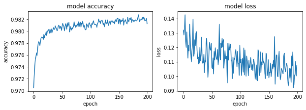

#### RSMprop - 0.1


```python
optimizer= tf.keras.optimizers.RMSprop(learning_rate=0.1)
model.compile(optimizer=optimizer,
              loss='sparse_categorical_crossentropy',
              metrics=['accuracy'])

history = model.fit(x_train, y_train, epochs=200)
model.evaluate(x_test,  y_test, verbose=2)
```

    Epoch 1/200
    1875/1875 [==============================] - 2s 1ms/step - loss: 0.8790 - accuracy: 0.9495
    Epoch 2/200
    1875/1875 [==============================] - 2s 1ms/step - loss: 0.9921 - accuracy: 0.9312
    Epoch 3/200
    1875/1875 [==============================] - 3s 1ms/step - loss: 1.0346 - accuracy: 0.9316
    Epoch 4/200
    1875/1875 [==============================] - 2s 1ms/step - loss: 0.9743 - accuracy: 0.9226
    Epoch 5/200
    1875/1875 [==============================] - 2s 1ms/step - loss: 0.8963 - accuracy: 0.9295
    Epoch 6/200
    1875/1875 [==============================] - 2s 1ms/step - loss: 1.0392 - accuracy: 0.9160
    Epoch 7/200
    1875/1875 [==============================] - 3s 2ms/step - loss: 1.0377 - accuracy: 0.9167
    Epoch 8/200
    1875/1875 [==============================] - 2s 1ms/step - loss: 0.9631 - accuracy: 0.9154
    Epoch 9/200
    1875/1875 [==============================] - 2s 1ms/step - loss: 1.0247 - accuracy: 0.9225
    Epoch 10/200
    1875/1875 [==============================] - 2s 1ms/step - loss: 1.0690 - accuracy: 0.9178
    Epoch 11/200
    1875/1875 [==============================] - 2s 1ms/step - loss: 1.0333 - accuracy: 0.9151
    Epoch 12/200
    1875/1875 [==============================] - 2s 1ms/step - loss: 0.9855 - accuracy: 0.9135
    Epoch 13/200
    1875/1875 [==============================] - 2s 1ms/step - loss: 1.0540 - accuracy: 0.9187
    Epoch 14/200
    1875/1875 [==============================] - 2s 1ms/step - loss: 1.0153 - accuracy: 0.9195
    Epoch 15/200
    1875/1875 [==============================] - 2s 1ms/step - loss: 0.9762 - accuracy: 0.9200
    Epoch 16/200
    1875/1875 [==============================] - 3s 1ms/step - loss: 0.8772 - accuracy: 0.9203
    Epoch 17/200
    1875/1875 [==============================] - 2s 1ms/step - loss: 0.9502 - accuracy: 0.9218
    Epoch 18/200
    1875/1875 [==============================] - 2s 1ms/step - loss: 0.9826 - accuracy: 0.9203
    Epoch 19/200
    1875/1875 [==============================] - 2s 1ms/step - loss: 0.9335 - accuracy: 0.9144
    Epoch 20/200
    1875/1875 [==============================] - 3s 1ms/step - loss: 0.8659 - accuracy: 0.9213
    Epoch 21/200
    1875/1875 [==============================] - 2s 1ms/step - loss: 0.9198 - accuracy: 0.9207
    Epoch 22/200
    1875/1875 [==============================] - 2s 1ms/step - loss: 0.9019 - accuracy: 0.9221
    Epoch 23/200
    1875/1875 [==============================] - 2s 1ms/step - loss: 0.8977 - accuracy: 0.9244
    Epoch 24/200
    1875/1875 [==============================] - 2s 1ms/step - loss: 0.8862 - accuracy: 0.9237
    Epoch 25/200
    1875/1875 [==============================] - 3s 1ms/step - loss: 0.9385 - accuracy: 0.9272
    Epoch 26/200
    1875/1875 [==============================] - 2s 1ms/step - loss: 0.9025 - accuracy: 0.9271
    Epoch 27/200
    1875/1875 [==============================] - 2s 1ms/step - loss: 0.9209 - accuracy: 0.9248
    Epoch 28/200
    1875/1875 [==============================] - 2s 1ms/step - loss: 0.9237 - accuracy: 0.9251
    Epoch 29/200
    1875/1875 [==============================] - 3s 1ms/step - loss: 0.9097 - accuracy: 0.9208
    Epoch 30/200
    1875/1875 [==============================] - 2s 1ms/step - loss: 0.8784 - accuracy: 0.9255
    Epoch 31/200
    1875/1875 [==============================] - 2s 1ms/step - loss: 0.8567 - accuracy: 0.9245
    Epoch 32/200
    1875/1875 [==============================] - 2s 1ms/step - loss: 0.9177 - accuracy: 0.9214
    Epoch 33/200
    1875/1875 [==============================] - 2s 1ms/step - loss: 0.8861 - accuracy: 0.9249
    Epoch 34/200
    1875/1875 [==============================] - 2s 1ms/step - loss: 0.8562 - accuracy: 0.9204
    Epoch 35/200
    1875/1875 [==============================] - 2s 1ms/step - loss: 0.8468 - accuracy: 0.9231
    Epoch 36/200
    1875/1875 [==============================] - 2s 1ms/step - loss: 0.8731 - accuracy: 0.9299
    Epoch 37/200
    1875/1875 [==============================] - 2s 1ms/step - loss: 0.8964 - accuracy: 0.9237
    Epoch 38/200
    1875/1875 [==============================] - 2s 1ms/step - loss: 0.8045 - accuracy: 0.9208
    Epoch 39/200
    1875/1875 [==============================] - 2s 1ms/step - loss: 0.8419 - accuracy: 0.9237
    Epoch 40/200
    1875/1875 [==============================] - 2s 1ms/step - loss: 0.8060 - accuracy: 0.9274
    Epoch 41/200
    1875/1875 [==============================] - 2s 1ms/step - loss: 0.7784 - accuracy: 0.9314
    Epoch 42/200
    1875/1875 [==============================] - 2s 1ms/step - loss: 0.9037 - accuracy: 0.9235
    Epoch 43/200
    1875/1875 [==============================] - 3s 1ms/step - loss: 0.8063 - accuracy: 0.9286
    Epoch 44/200
    1875/1875 [==============================] - 2s 1ms/step - loss: 0.7851 - accuracy: 0.9268
    Epoch 45/200
    1875/1875 [==============================] - 2s 1ms/step - loss: 0.7803 - accuracy: 0.9232
    Epoch 46/200
    1875/1875 [==============================] - 2s 1ms/step - loss: 0.7766 - accuracy: 0.9245
    Epoch 47/200
    1875/1875 [==============================] - 2s 1ms/step - loss: 0.7625 - accuracy: 0.9312
    Epoch 48/200
    1875/1875 [==============================] - 3s 1ms/step - loss: 0.7726 - accuracy: 0.9274
    Epoch 49/200
    1875/1875 [==============================] - 2s 1ms/step - loss: 0.8035 - accuracy: 0.9262
    Epoch 50/200
    1875/1875 [==============================] - 2s 1ms/step - loss: 0.8784 - accuracy: 0.9262
    Epoch 51/200
    1875/1875 [==============================] - 2s 1ms/step - loss: 0.8000 - accuracy: 0.9302
    Epoch 52/200
    1875/1875 [==============================] - 2s 1ms/step - loss: 0.8385 - accuracy: 0.9277
    Epoch 53/200
    1875/1875 [==============================] - 2s 1ms/step - loss: 0.8477 - accuracy: 0.9308
    Epoch 54/200
    1875/1875 [==============================] - 2s 1ms/step - loss: 0.7125 - accuracy: 0.9306
    Epoch 55/200
    1875/1875 [==============================] - 2s 1ms/step - loss: 0.7597 - accuracy: 0.9338
    Epoch 56/200
    1875/1875 [==============================] - 2s 1ms/step - loss: 0.8094 - accuracy: 0.9322
    Epoch 57/200
    1875/1875 [==============================] - 2s 1ms/step - loss: 0.7688 - accuracy: 0.9302
    Epoch 58/200
    1875/1875 [==============================] - 2s 1ms/step - loss: 0.7824 - accuracy: 0.9315
    Epoch 59/200
    1875/1875 [==============================] - 2s 1ms/step - loss: 0.8051 - accuracy: 0.9308
    Epoch 60/200
    1875/1875 [==============================] - 2s 1ms/step - loss: 0.7600 - accuracy: 0.9294
    Epoch 61/200
    1875/1875 [==============================] - 2s 1ms/step - loss: 0.7561 - accuracy: 0.9298
    Epoch 62/200
    1875/1875 [==============================] - 3s 1ms/step - loss: 0.7751 - accuracy: 0.9274
    Epoch 63/200
    1875/1875 [==============================] - 2s 1ms/step - loss: 0.7764 - accuracy: 0.9286
    Epoch 64/200
    1875/1875 [==============================] - 2s 1ms/step - loss: 0.7527 - accuracy: 0.9332
    Epoch 65/200
    1875/1875 [==============================] - 2s 1ms/step - loss: 0.7879 - accuracy: 0.9345
    Epoch 66/200
    1875/1875 [==============================] - 2s 1ms/step - loss: 0.8194 - accuracy: 0.9313
    Epoch 67/200
    1875/1875 [==============================] - 2s 1ms/step - loss: 0.5771 - accuracy: 0.9354
    Epoch 68/200
    1875/1875 [==============================] - 2s 1ms/step - loss: 0.7287 - accuracy: 0.9344
    Epoch 69/200
    1875/1875 [==============================] - 2s 1ms/step - loss: 0.6622 - accuracy: 0.9320
    Epoch 70/200
    1875/1875 [==============================] - 2s 1ms/step - loss: 0.7507 - accuracy: 0.9314
    Epoch 71/200
    1875/1875 [==============================] - 3s 1ms/step - loss: 0.6879 - accuracy: 0.9340
    Epoch 72/200
    1875/1875 [==============================] - 2s 1ms/step - loss: 0.6369 - accuracy: 0.9337
    Epoch 73/200
    1875/1875 [==============================] - 2s 1ms/step - loss: 0.6535 - accuracy: 0.9318
    Epoch 74/200
    1875/1875 [==============================] - 2s 1ms/step - loss: 0.7201 - accuracy: 0.9334
    Epoch 75/200
    1875/1875 [==============================] - 2s 1ms/step - loss: 0.6920 - accuracy: 0.9332
    Epoch 76/200
    1875/1875 [==============================] - 2s 1ms/step - loss: 0.7171 - accuracy: 0.9327
    Epoch 77/200
    1875/1875 [==============================] - 2s 1ms/step - loss: 0.6304 - accuracy: 0.9320
    Epoch 78/200
    1875/1875 [==============================] - 2s 1ms/step - loss: 0.6607 - accuracy: 0.9316
    Epoch 79/200
    1875/1875 [==============================] - 2s 1ms/step - loss: 0.7545 - accuracy: 0.9317
    Epoch 80/200
    1875/1875 [==============================] - 2s 1ms/step - loss: 0.7193 - accuracy: 0.9326
    Epoch 81/200
    1875/1875 [==============================] - 2s 1ms/step - loss: 0.6887 - accuracy: 0.9337
    Epoch 82/200
    1875/1875 [==============================] - 2s 1ms/step - loss: 0.6760 - accuracy: 0.9300
    Epoch 83/200
    1875/1875 [==============================] - 2s 1ms/step - loss: 0.7125 - accuracy: 0.9348
    Epoch 84/200
    1875/1875 [==============================] - 2s 1ms/step - loss: 0.7888 - accuracy: 0.9325
    Epoch 85/200
    1875/1875 [==============================] - 3s 1ms/step - loss: 0.6982 - accuracy: 0.9323
    Epoch 86/200
    1875/1875 [==============================] - 2s 1ms/step - loss: 0.6347 - accuracy: 0.9331
    Epoch 87/200
    1875/1875 [==============================] - 2s 1ms/step - loss: 0.7125 - accuracy: 0.9351
    Epoch 88/200
    1875/1875 [==============================] - 2s 1ms/step - loss: 0.7542 - accuracy: 0.9362
    Epoch 89/200
    1875/1875 [==============================] - 2s 1ms/step - loss: 0.6353 - accuracy: 0.9311
    Epoch 90/200
    1875/1875 [==============================] - 2s 1ms/step - loss: 0.7860 - accuracy: 0.9352
    Epoch 91/200
    1875/1875 [==============================] - 2s 1ms/step - loss: 0.6952 - accuracy: 0.9370
    Epoch 92/200
    1875/1875 [==============================] - 2s 1ms/step - loss: 0.7193 - accuracy: 0.9384
    Epoch 93/200
    1875/1875 [==============================] - 2s 1ms/step - loss: 0.6267 - accuracy: 0.9341
    Epoch 94/200
    1875/1875 [==============================] - 2s 1ms/step - loss: 0.6689 - accuracy: 0.9352
    Epoch 95/200
    1875/1875 [==============================] - 2s 1ms/step - loss: 0.5983 - accuracy: 0.9376
    Epoch 96/200
    1875/1875 [==============================] - 2s 1ms/step - loss: 0.6141 - accuracy: 0.9332
    Epoch 97/200
    1875/1875 [==============================] - 2s 1ms/step - loss: 0.6242 - accuracy: 0.9333
    Epoch 98/200
    1875/1875 [==============================] - 2s 1ms/step - loss: 0.6352 - accuracy: 0.9305
    Epoch 99/200
    1875/1875 [==============================] - 2s 1ms/step - loss: 0.6655 - accuracy: 0.9377
    Epoch 100/200
    1875/1875 [==============================] - 2s 1ms/step - loss: 0.5831 - accuracy: 0.9376
    Epoch 101/200
    1875/1875 [==============================] - 2s 1ms/step - loss: 0.6130 - accuracy: 0.9371
    Epoch 102/200
    1875/1875 [==============================] - 2s 1ms/step - loss: 0.6398 - accuracy: 0.9371
    Epoch 103/200
    1875/1875 [==============================] - 2s 1ms/step - loss: 0.6925 - accuracy: 0.9311
    Epoch 104/200
    1875/1875 [==============================] - 2s 1ms/step - loss: 0.6533 - accuracy: 0.9347
    Epoch 105/200
    1875/1875 [==============================] - 2s 1ms/step - loss: 0.7039 - accuracy: 0.9348
    Epoch 106/200
    1875/1875 [==============================] - 2s 1ms/step - loss: 0.6670 - accuracy: 0.9325
    Epoch 107/200
    1875/1875 [==============================] - 2s 1ms/step - loss: 0.6831 - accuracy: 0.9363
    Epoch 108/200
    1875/1875 [==============================] - 2s 1ms/step - loss: 0.6818 - accuracy: 0.9358
    Epoch 109/200
    1875/1875 [==============================] - 2s 1ms/step - loss: 0.6506 - accuracy: 0.9385
    Epoch 110/200
    1875/1875 [==============================] - 2s 1ms/step - loss: 0.6653 - accuracy: 0.9368
    Epoch 111/200
    1875/1875 [==============================] - 2s 1ms/step - loss: 0.6935 - accuracy: 0.9370
    Epoch 112/200
    1875/1875 [==============================] - 2s 1ms/step - loss: 0.6508 - accuracy: 0.9351
    Epoch 113/200
    1875/1875 [==============================] - 3s 1ms/step - loss: 0.5939 - accuracy: 0.9389
    Epoch 114/200
    1875/1875 [==============================] - 2s 1ms/step - loss: 0.6250 - accuracy: 0.9358
    Epoch 115/200
    1875/1875 [==============================] - 2s 1ms/step - loss: 0.6421 - accuracy: 0.9382
    Epoch 116/200
    1875/1875 [==============================] - 2s 1ms/step - loss: 0.7228 - accuracy: 0.9385
    Epoch 117/200
    1875/1875 [==============================] - 2s 1ms/step - loss: 0.6692 - accuracy: 0.9380
    Epoch 118/200
    1875/1875 [==============================] - 2s 1ms/step - loss: 0.6905 - accuracy: 0.9402
    Epoch 119/200
    1875/1875 [==============================] - 2s 1ms/step - loss: 0.6289 - accuracy: 0.9370
    Epoch 120/200
    1875/1875 [==============================] - 2s 1ms/step - loss: 0.6136 - accuracy: 0.9347
    Epoch 121/200
    1875/1875 [==============================] - 2s 1ms/step - loss: 0.5655 - accuracy: 0.9319
    Epoch 122/200
    1875/1875 [==============================] - 3s 1ms/step - loss: 0.5922 - accuracy: 0.9390
    Epoch 123/200
    1875/1875 [==============================] - 2s 1ms/step - loss: 0.7130 - accuracy: 0.9375
    Epoch 124/200
    1875/1875 [==============================] - 2s 1ms/step - loss: 0.5815 - accuracy: 0.9405
    Epoch 125/200
    1875/1875 [==============================] - 2s 1ms/step - loss: 0.6667 - accuracy: 0.9373
    Epoch 126/200
    1875/1875 [==============================] - 2s 1ms/step - loss: 0.6346 - accuracy: 0.9371
    Epoch 127/200
    1875/1875 [==============================] - 2s 1ms/step - loss: 0.6522 - accuracy: 0.9411
    Epoch 128/200
    1875/1875 [==============================] - 2s 1ms/step - loss: 0.5573 - accuracy: 0.9362
    Epoch 129/200
    1875/1875 [==============================] - 2s 1ms/step - loss: 0.6858 - accuracy: 0.9409
    Epoch 130/200
    1875/1875 [==============================] - 2s 1ms/step - loss: 0.6907 - accuracy: 0.9390
    Epoch 131/200
    1875/1875 [==============================] - 2s 1ms/step - loss: 0.7203 - accuracy: 0.9374
    Epoch 132/200
    1875/1875 [==============================] - 2s 1ms/step - loss: 0.5384 - accuracy: 0.9389
    Epoch 133/200
    1875/1875 [==============================] - 2s 1ms/step - loss: 0.7536 - accuracy: 0.9370
    Epoch 134/200
    1875/1875 [==============================] - 2s 1ms/step - loss: 0.6587 - accuracy: 0.9410
    Epoch 135/200
    1875/1875 [==============================] - 2s 1ms/step - loss: 0.6742 - accuracy: 0.9390
    Epoch 136/200
    1875/1875 [==============================] - 3s 2ms/step - loss: 0.6388 - accuracy: 0.9388
    Epoch 137/200
    1875/1875 [==============================] - 2s 1ms/step - loss: 0.5701 - accuracy: 0.9351
    Epoch 138/200
    1875/1875 [==============================] - 2s 1ms/step - loss: 0.6607 - accuracy: 0.9391
    Epoch 139/200
    1875/1875 [==============================] - 2s 1ms/step - loss: 0.6201 - accuracy: 0.9404
    Epoch 140/200
    1875/1875 [==============================] - 3s 1ms/step - loss: 0.7332 - accuracy: 0.9411
    Epoch 141/200
    1875/1875 [==============================] - 2s 1ms/step - loss: 0.6076 - accuracy: 0.9417
    Epoch 142/200
    1875/1875 [==============================] - 2s 1ms/step - loss: 0.5396 - accuracy: 0.9401
    Epoch 143/200
    1875/1875 [==============================] - 2s 1ms/step - loss: 0.5534 - accuracy: 0.9417
    Epoch 144/200
    1875/1875 [==============================] - 2s 1ms/step - loss: 0.6559 - accuracy: 0.9417
    Epoch 145/200
    1875/1875 [==============================] - 2s 1ms/step - loss: 0.5820 - accuracy: 0.9409
    Epoch 146/200
    1875/1875 [==============================] - 2s 1ms/step - loss: 0.5592 - accuracy: 0.9372
    Epoch 147/200
    1875/1875 [==============================] - 2s 1ms/step - loss: 0.5615 - accuracy: 0.9405
    Epoch 148/200
    1875/1875 [==============================] - 2s 1ms/step - loss: 0.5728 - accuracy: 0.9394
    Epoch 149/200
    1875/1875 [==============================] - 2s 1ms/step - loss: 0.6550 - accuracy: 0.9413
    Epoch 150/200
    1875/1875 [==============================] - 2s 1ms/step - loss: 0.5508 - accuracy: 0.9408
    Epoch 151/200
    1875/1875 [==============================] - 2s 1ms/step - loss: 0.6518 - accuracy: 0.9397
    Epoch 152/200
    1875/1875 [==============================] - 2s 1ms/step - loss: 0.5572 - accuracy: 0.9402
    Epoch 153/200
    1875/1875 [==============================] - 2s 1ms/step - loss: 0.5921 - accuracy: 0.9417
    Epoch 154/200
    1875/1875 [==============================] - 2s 1ms/step - loss: 0.6081 - accuracy: 0.9398
    Epoch 155/200
    1875/1875 [==============================] - 2s 1ms/step - loss: 0.5636 - accuracy: 0.9438
    Epoch 156/200
    1875/1875 [==============================] - 2s 1ms/step - loss: 0.5250 - accuracy: 0.9408
    Epoch 157/200
    1875/1875 [==============================] - 2s 1ms/step - loss: 0.5627 - accuracy: 0.9408
    Epoch 158/200
    1875/1875 [==============================] - 2s 1ms/step - loss: 0.5109 - accuracy: 0.9419
    Epoch 159/200
    1875/1875 [==============================] - 3s 1ms/step - loss: 0.5394 - accuracy: 0.9393
    Epoch 160/200
    1875/1875 [==============================] - 2s 1ms/step - loss: 0.6780 - accuracy: 0.9422
    Epoch 161/200
    1875/1875 [==============================] - 2s 1ms/step - loss: 0.6132 - accuracy: 0.9368
    Epoch 162/200
    1875/1875 [==============================] - 2s 1ms/step - loss: 0.5520 - accuracy: 0.9388
    Epoch 163/200
    1875/1875 [==============================] - 3s 2ms/step - loss: 0.6483 - accuracy: 0.9414
    Epoch 164/200
    1875/1875 [==============================] - 2s 1ms/step - loss: 0.5981 - accuracy: 0.9389
    Epoch 165/200
    1875/1875 [==============================] - 2s 1ms/step - loss: 0.6464 - accuracy: 0.9409
    Epoch 166/200
    1875/1875 [==============================] - 2s 1ms/step - loss: 0.5843 - accuracy: 0.9378
    Epoch 167/200
    1875/1875 [==============================] - 2s 1ms/step - loss: 0.5938 - accuracy: 0.9435
    Epoch 168/200
    1875/1875 [==============================] - 2s 1ms/step - loss: 0.5583 - accuracy: 0.9405
    Epoch 169/200
    1875/1875 [==============================] - 2s 1ms/step - loss: 0.5793 - accuracy: 0.9394
    Epoch 170/200
    1875/1875 [==============================] - 2s 1ms/step - loss: 0.6064 - accuracy: 0.9414
    Epoch 171/200
    1875/1875 [==============================] - 2s 1ms/step - loss: 0.5153 - accuracy: 0.9435
    Epoch 172/200
    1875/1875 [==============================] - 3s 1ms/step - loss: 0.5200 - accuracy: 0.9422: 0s - loss: 0.5
    Epoch 173/200
    1875/1875 [==============================] - 2s 1ms/step - loss: 0.6343 - accuracy: 0.9405
    Epoch 174/200
    1875/1875 [==============================] - 2s 1ms/step - loss: 0.6610 - accuracy: 0.9408
    Epoch 175/200
    1875/1875 [==============================] - 2s 1ms/step - loss: 0.5675 - accuracy: 0.9370
    Epoch 176/200
    1875/1875 [==============================] - 2s 1ms/step - loss: 0.6196 - accuracy: 0.9378
    Epoch 177/200
    1875/1875 [==============================] - 2s 1ms/step - loss: 0.4584 - accuracy: 0.9390
    Epoch 178/200
    1875/1875 [==============================] - 2s 1ms/step - loss: 0.5711 - accuracy: 0.9416
    Epoch 179/200
    1875/1875 [==============================] - 2s 1ms/step - loss: 0.5057 - accuracy: 0.9408
    Epoch 180/200
    1875/1875 [==============================] - 2s 1ms/step - loss: 0.6175 - accuracy: 0.9406
    Epoch 181/200
    1875/1875 [==============================] - 2s 1ms/step - loss: 0.5480 - accuracy: 0.9384
    Epoch 182/200
    1875/1875 [==============================] - 2s 1ms/step - loss: 0.6262 - accuracy: 0.9372
    Epoch 183/200
    1875/1875 [==============================] - 2s 1ms/step - loss: 0.6274 - accuracy: 0.9435
    Epoch 184/200
    1875/1875 [==============================] - 2s 1ms/step - loss: 0.5349 - accuracy: 0.9428
    Epoch 185/200
    1875/1875 [==============================] - 2s 1ms/step - loss: 0.5446 - accuracy: 0.9437
    Epoch 186/200
    1875/1875 [==============================] - 2s 1ms/step - loss: 0.7056 - accuracy: 0.9423
    Epoch 187/200
    1875/1875 [==============================] - 2s 1ms/step - loss: 0.5773 - accuracy: 0.9384
    Epoch 188/200
    1875/1875 [==============================] - 2s 1ms/step - loss: 0.6523 - accuracy: 0.9447
    Epoch 189/200
    1875/1875 [==============================] - 2s 1ms/step - loss: 0.5630 - accuracy: 0.9408
    Epoch 190/200
    1875/1875 [==============================] - 2s 1ms/step - loss: 0.6012 - accuracy: 0.9443
    Epoch 191/200
    1875/1875 [==============================] - 2s 1ms/step - loss: 0.5912 - accuracy: 0.9424
    Epoch 192/200
    1875/1875 [==============================] - 2s 1ms/step - loss: 0.5607 - accuracy: 0.9446
    Epoch 193/200
    1875/1875 [==============================] - 2s 1ms/step - loss: 0.5829 - accuracy: 0.9407
    Epoch 194/200
    1875/1875 [==============================] - 2s 1ms/step - loss: 0.5582 - accuracy: 0.9422
    Epoch 195/200
    1875/1875 [==============================] - 2s 1ms/step - loss: 0.5839 - accuracy: 0.9407
    Epoch 196/200
    1875/1875 [==============================] - 3s 1ms/step - loss: 0.5095 - accuracy: 0.9415
    Epoch 197/200
    1875/1875 [==============================] - 2s 1ms/step - loss: 0.4999 - accuracy: 0.9420
    Epoch 198/200
    1875/1875 [==============================] - 2s 1ms/step - loss: 0.5675 - accuracy: 0.9417
    Epoch 199/200
    1875/1875 [==============================] - 2s 1ms/step - loss: 0.4633 - accuracy: 0.9428
    Epoch 200/200
    1875/1875 [==============================] - 2s 1ms/step - loss: 0.5092 - accuracy: 0.9406
    313/313 - 0s - loss: 8.7360 - accuracy: 0.9476
    


    [8.735950469970703, 0.9476000070571899]


```python
fig, (ax1, ax2) = plt.subplots(1, 2, figsize=(10, 3))

#ax1.subplot(1, 2, 1)
ax1.plot(history.history['accuracy'])
#plt.plot(history.history['val_accuracy'])
ax1.set_title('model accuracy')
ax1.set_ylabel('accuracy')
ax1.set_xlabel('epoch')
#ax1.show()

#ax2.subplot(1, 2, 2)
ax2.plot(history.history['loss'])
#plt.plot(history.history['val_loss'])
ax2.set_title('model loss')
ax2.set_ylabel('loss')
ax2.set_xlabel('epoch')
```


#### RSMprop - 0.5


```python
optimizer= tf.keras.optimizers.RMSprop(learning_rate=0.5)
model.compile(optimizer=optimizer,
              loss='sparse_categorical_crossentropy',
              metrics=['accuracy'])

history = model.fit(x_train, y_train, epochs=200)
model.evaluate(x_test,  y_test, verbose=2)
```

    Epoch 1/200
    1875/1875 [==============================] - 2s 1ms/step - loss: 6.8094 - accuracy: 0.7385
    Epoch 2/200
    1875/1875 [==============================] - 2s 1ms/step - loss: 3.5971 - accuracy: 0.6333
    Epoch 3/200
    1875/1875 [==============================] - 2s 1ms/step - loss: 3.6632 - accuracy: 0.6393
    Epoch 4/200
    1875/1875 [==============================] - 2s 1ms/step - loss: 3.1665 - accuracy: 0.6176
    Epoch 5/200
    1875/1875 [==============================] - 2s 1ms/step - loss: 3.2972 - accuracy: 0.6621
    Epoch 6/200
    1875/1875 [==============================] - 2s 1ms/step - loss: 3.0579 - accuracy: 0.6413
    Epoch 7/200
    1875/1875 [==============================] - 3s 1ms/step - loss: 3.0244 - accuracy: 0.6468
    Epoch 8/200
    1875/1875 [==============================] - 3s 1ms/step - loss: 3.2011 - accuracy: 0.6737
    Epoch 9/200
    1875/1875 [==============================] - 3s 1ms/step - loss: 2.6702 - accuracy: 0.6732
    Epoch 10/200
    1875/1875 [==============================] - 2s 1ms/step - loss: 2.8914 - accuracy: 0.6705
    Epoch 11/200
    1875/1875 [==============================] - 2s 1ms/step - loss: 2.6751 - accuracy: 0.6828
    Epoch 12/200
    1875/1875 [==============================] - 2s 1ms/step - loss: 2.5799 - accuracy: 0.6977
    Epoch 13/200
    1875/1875 [==============================] - 2s 1ms/step - loss: 2.4741 - accuracy: 0.6876
    Epoch 14/200
    1875/1875 [==============================] - 2s 1ms/step - loss: 2.4345 - accuracy: 0.7064
    Epoch 15/200
    1875/1875 [==============================] - 2s 1ms/step - loss: 2.3001 - accuracy: 0.7057
    Epoch 16/200
    1875/1875 [==============================] - 2s 1ms/step - loss: 2.6463 - accuracy: 0.7068
    Epoch 17/200
    1875/1875 [==============================] - 2s 1ms/step - loss: 2.5934 - accuracy: 0.6991
    Epoch 18/200
    1875/1875 [==============================] - 3s 1ms/step - loss: 2.1563 - accuracy: 0.7120
    Epoch 19/200
    1875/1875 [==============================] - 2s 1ms/step - loss: 2.1382 - accuracy: 0.7043
    Epoch 20/200
    1875/1875 [==============================] - 2s 1ms/step - loss: 2.1893 - accuracy: 0.7107
    Epoch 21/200
    1875/1875 [==============================] - 2s 1ms/step - loss: 2.3421 - accuracy: 0.7145
    Epoch 22/200
    1875/1875 [==============================] - 3s 1ms/step - loss: 2.0008 - accuracy: 0.7033
    Epoch 23/200
    1875/1875 [==============================] - 2s 1ms/step - loss: 1.9489 - accuracy: 0.7181
    Epoch 24/200
    1875/1875 [==============================] - 2s 1ms/step - loss: 2.2456 - accuracy: 0.7151
    Epoch 25/200
    1875/1875 [==============================] - 2s 1ms/step - loss: 1.9740 - accuracy: 0.7203
    Epoch 26/200
    1875/1875 [==============================] - 2s 1ms/step - loss: 2.4321 - accuracy: 0.7348
    Epoch 27/200
    1875/1875 [==============================] - 2s 1ms/step - loss: 1.8429 - accuracy: 0.7351
    Epoch 28/200
    1875/1875 [==============================] - 2s 1ms/step - loss: 2.1675 - accuracy: 0.7280
    Epoch 29/200
    1875/1875 [==============================] - 2s 1ms/step - loss: 2.0141 - accuracy: 0.7249
    Epoch 30/200
    1875/1875 [==============================] - 2s 1ms/step - loss: 1.8490 - accuracy: 0.7314
    Epoch 31/200
    1875/1875 [==============================] - 2s 1ms/step - loss: 1.9560 - accuracy: 0.7397
    Epoch 32/200
    1875/1875 [==============================] - 3s 2ms/step - loss: 1.8908 - accuracy: 0.7436
    Epoch 33/200
    1875/1875 [==============================] - 3s 1ms/step - loss: 1.7422 - accuracy: 0.7458
    Epoch 34/200
    1875/1875 [==============================] - 2s 1ms/step - loss: 2.0489 - accuracy: 0.7351
    Epoch 35/200
    1875/1875 [==============================] - 3s 1ms/step - loss: 1.8214 - accuracy: 0.7410
    Epoch 36/200
    1875/1875 [==============================] - 3s 2ms/step - loss: 1.6954 - accuracy: 0.7423
    Epoch 37/200
    1875/1875 [==============================] - 3s 1ms/step - loss: 1.9113 - accuracy: 0.7534
    Epoch 38/200
    1875/1875 [==============================] - 3s 1ms/step - loss: 2.0256 - accuracy: 0.7567
    Epoch 39/200
    1875/1875 [==============================] - 2s 1ms/step - loss: 1.6189 - accuracy: 0.7464
    Epoch 40/200
    1875/1875 [==============================] - 2s 1ms/step - loss: 1.7858 - accuracy: 0.7523
    Epoch 41/200
    1875/1875 [==============================] - 3s 1ms/step - loss: 1.7335 - accuracy: 0.7564
    Epoch 42/200
    1875/1875 [==============================] - 3s 1ms/step - loss: 1.6482 - accuracy: 0.7509: 0s - loss: 1.5237 - 
    Epoch 43/200
    1875/1875 [==============================] - 3s 1ms/step - loss: 1.7713 - accuracy: 0.7632
    Epoch 44/200
    1875/1875 [==============================] - 2s 1ms/step - loss: 1.3325 - accuracy: 0.7558
    Epoch 45/200
    1875/1875 [==============================] - 2s 1ms/step - loss: 1.8882 - accuracy: 0.7605
    Epoch 46/200
    1875/1875 [==============================] - 2s 1ms/step - loss: 1.6962 - accuracy: 0.7660
    Epoch 47/200
    1875/1875 [==============================] - 2s 1ms/step - loss: 1.6863 - accuracy: 0.7668
    Epoch 48/200
    1875/1875 [==============================] - 2s 1ms/step - loss: 2.0149 - accuracy: 0.7693
    Epoch 49/200
    1875/1875 [==============================] - 2s 1ms/step - loss: 1.6235 - accuracy: 0.7726
    Epoch 50/200
    1875/1875 [==============================] - 2s 1ms/step - loss: 1.6154 - accuracy: 0.7575
    Epoch 51/200
    1875/1875 [==============================] - 2s 1ms/step - loss: 1.7748 - accuracy: 0.7638
    Epoch 52/200
    1875/1875 [==============================] - 3s 1ms/step - loss: 1.6727 - accuracy: 0.7692
    Epoch 53/200
    1875/1875 [==============================] - 2s 1ms/step - loss: 1.7119 - accuracy: 0.7719
    Epoch 54/200
    1875/1875 [==============================] - 2s 1ms/step - loss: 1.8762 - accuracy: 0.7762
    Epoch 55/200
    1875/1875 [==============================] - 2s 1ms/step - loss: 1.7249 - accuracy: 0.7760
    Epoch 56/200
    1875/1875 [==============================] - 2s 1ms/step - loss: 1.7645 - accuracy: 0.7756
    Epoch 57/200
    1875/1875 [==============================] - 2s 1ms/step - loss: 1.6360 - accuracy: 0.7753
    Epoch 58/200
    1875/1875 [==============================] - 2s 1ms/step - loss: 1.6367 - accuracy: 0.7700
    Epoch 59/200
    1875/1875 [==============================] - 2s 1ms/step - loss: 1.6928 - accuracy: 0.7728
    Epoch 60/200
    1875/1875 [==============================] - 2s 1ms/step - loss: 1.4266 - accuracy: 0.7690
    Epoch 61/200
    1875/1875 [==============================] - 2s 1ms/step - loss: 1.4414 - accuracy: 0.7642
    Epoch 62/200
    1875/1875 [==============================] - 2s 1ms/step - loss: 1.6241 - accuracy: 0.7699
    Epoch 63/200
    1875/1875 [==============================] - 2s 1ms/step - loss: 1.4971 - accuracy: 0.7686
    Epoch 64/200
    1875/1875 [==============================] - 2s 1ms/step - loss: 1.7001 - accuracy: 0.7788
    Epoch 65/200
    1875/1875 [==============================] - 2s 1ms/step - loss: 1.4683 - accuracy: 0.7716
    Epoch 66/200
    1875/1875 [==============================] - 2s 1ms/step - loss: 1.8266 - accuracy: 0.7782
    Epoch 67/200
    1875/1875 [==============================] - 2s 1ms/step - loss: 1.2141 - accuracy: 0.7807
    Epoch 68/200
    1875/1875 [==============================] - 2s 1ms/step - loss: 1.4961 - accuracy: 0.7753
    Epoch 69/200
    1875/1875 [==============================] - 2s 1ms/step - loss: 1.4689 - accuracy: 0.7783
    Epoch 70/200
    1875/1875 [==============================] - 2s 1ms/step - loss: 1.3900 - accuracy: 0.7722
    Epoch 71/200
    1875/1875 [==============================] - 3s 1ms/step - loss: 1.4453 - accuracy: 0.7769
    Epoch 72/200
    1875/1875 [==============================] - 2s 1ms/step - loss: 1.2007 - accuracy: 0.7675
    Epoch 73/200
    1875/1875 [==============================] - 2s 1ms/step - loss: 1.3478 - accuracy: 0.7733
    Epoch 74/200
    1875/1875 [==============================] - 2s 1ms/step - loss: 1.3834 - accuracy: 0.7678
    Epoch 75/200
    1875/1875 [==============================] - 2s 1ms/step - loss: 1.5740 - accuracy: 0.7677
    Epoch 76/200
    1875/1875 [==============================] - 2s 1ms/step - loss: 1.4531 - accuracy: 0.7667
    Epoch 77/200
    1875/1875 [==============================] - 2s 1ms/step - loss: 1.1521 - accuracy: 0.7758
    Epoch 78/200
    1875/1875 [==============================] - 2s 1ms/step - loss: 1.4124 - accuracy: 0.7741
    Epoch 79/200
    1875/1875 [==============================] - 2s 1ms/step - loss: 1.3376 - accuracy: 0.7760
    Epoch 80/200
    1875/1875 [==============================] - 2s 1ms/step - loss: 1.5875 - accuracy: 0.7826
    Epoch 81/200
    1875/1875 [==============================] - 2s 1ms/step - loss: 1.2947 - accuracy: 0.7802
    Epoch 82/200
    1875/1875 [==============================] - 2s 1ms/step - loss: 1.4697 - accuracy: 0.7801
    Epoch 83/200
    1875/1875 [==============================] - 2s 1ms/step - loss: 1.4857 - accuracy: 0.7795
    Epoch 84/200
    1875/1875 [==============================] - 2s 1ms/step - loss: 1.3668 - accuracy: 0.7834
    Epoch 85/200
    1875/1875 [==============================] - 2s 1ms/step - loss: 1.4031 - accuracy: 0.7832
    Epoch 86/200
    1875/1875 [==============================] - 2s 1ms/step - loss: 1.2343 - accuracy: 0.7806
    Epoch 87/200
    1875/1875 [==============================] - 2s 1ms/step - loss: 1.4874 - accuracy: 0.7863
    Epoch 88/200
    1875/1875 [==============================] - 2s 1ms/step - loss: 1.4874 - accuracy: 0.7879
    Epoch 89/200
    1875/1875 [==============================] - 2s 1ms/step - loss: 1.5676 - accuracy: 0.7821
    Epoch 90/200
    1875/1875 [==============================] - 3s 1ms/step - loss: 1.1855 - accuracy: 0.7865
    Epoch 91/200
    1875/1875 [==============================] - 2s 1ms/step - loss: 1.5163 - accuracy: 0.7897
    Epoch 92/200
    1875/1875 [==============================] - 2s 1ms/step - loss: 1.3738 - accuracy: 0.7914
    Epoch 93/200
    1875/1875 [==============================] - 2s 1ms/step - loss: 1.1522 - accuracy: 0.7958
    Epoch 94/200
    1875/1875 [==============================] - 2s 1ms/step - loss: 1.1926 - accuracy: 0.7933
    Epoch 95/200
    1875/1875 [==============================] - 2s 1ms/step - loss: 1.3294 - accuracy: 0.7929
    Epoch 96/200
    1875/1875 [==============================] - 2s 1ms/step - loss: 1.2697 - accuracy: 0.7926
    Epoch 97/200
    1875/1875 [==============================] - 2s 1ms/step - loss: 1.1674 - accuracy: 0.7952
    Epoch 98/200
    1875/1875 [==============================] - 2s 1ms/step - loss: 1.1434 - accuracy: 0.7954
    Epoch 99/200
    1875/1875 [==============================] - 3s 1ms/step - loss: 1.2389 - accuracy: 0.7942
    Epoch 100/200
    1875/1875 [==============================] - 2s 1ms/step - loss: 1.2833 - accuracy: 0.7910
    Epoch 101/200
    1875/1875 [==============================] - 2s 1ms/step - loss: 1.4295 - accuracy: 0.7891
    Epoch 102/200
    1875/1875 [==============================] - 2s 1ms/step - loss: 1.2896 - accuracy: 0.7926
    Epoch 103/200
    1875/1875 [==============================] - 2s 1ms/step - loss: 1.4321 - accuracy: 0.7908
    Epoch 104/200
    1875/1875 [==============================] - 2s 1ms/step - loss: 1.0732 - accuracy: 0.7947
    Epoch 105/200
    1875/1875 [==============================] - 2s 1ms/step - loss: 1.2588 - accuracy: 0.7897
    Epoch 106/200
    1875/1875 [==============================] - 2s 1ms/step - loss: 1.3196 - accuracy: 0.7878
    Epoch 107/200
    1875/1875 [==============================] - 2s 1ms/step - loss: 1.2122 - accuracy: 0.7893
    Epoch 108/200
    1875/1875 [==============================] - 3s 1ms/step - loss: 1.3238 - accuracy: 0.7871
    Epoch 109/200
    1875/1875 [==============================] - 2s 1ms/step - loss: 1.1610 - accuracy: 0.7894
    Epoch 110/200
    1875/1875 [==============================] - 2s 1ms/step - loss: 1.4324 - accuracy: 0.7930
    Epoch 111/200
    1875/1875 [==============================] - 2s 1ms/step - loss: 1.2334 - accuracy: 0.7889
    Epoch 112/200
    1875/1875 [==============================] - 2s 1ms/step - loss: 1.3117 - accuracy: 0.7907
    Epoch 113/200
    1875/1875 [==============================] - 2s 1ms/step - loss: 1.3492 - accuracy: 0.7932
    Epoch 114/200
    1875/1875 [==============================] - 2s 1ms/step - loss: 1.4149 - accuracy: 0.7945
    Epoch 115/200
    1875/1875 [==============================] - 2s 1ms/step - loss: 1.0684 - accuracy: 0.7954
    Epoch 116/200
    1875/1875 [==============================] - 2s 1ms/step - loss: 1.4278 - accuracy: 0.7952
    Epoch 117/200
    1875/1875 [==============================] - 2s 1ms/step - loss: 0.9640 - accuracy: 0.7933
    Epoch 118/200
    1875/1875 [==============================] - 2s 1ms/step - loss: 1.3288 - accuracy: 0.7980
    Epoch 119/200
    1875/1875 [==============================] - 2s 1ms/step - loss: 1.4005 - accuracy: 0.7922
    Epoch 120/200
    1875/1875 [==============================] - 2s 1ms/step - loss: 1.0629 - accuracy: 0.7970
    Epoch 121/200
    1875/1875 [==============================] - 2s 1ms/step - loss: 0.9949 - accuracy: 0.7922
    Epoch 122/200
    1875/1875 [==============================] - 2s 1ms/step - loss: 1.2189 - accuracy: 0.7894
    Epoch 123/200
    1875/1875 [==============================] - 2s 1ms/step - loss: 1.2166 - accuracy: 0.7857
    Epoch 124/200
    1875/1875 [==============================] - 2s 1ms/step - loss: 1.5075 - accuracy: 0.7944
    Epoch 125/200
    1875/1875 [==============================] - 2s 1ms/step - loss: 1.2130 - accuracy: 0.7913
    Epoch 126/200
    1875/1875 [==============================] - 2s 1ms/step - loss: 1.3640 - accuracy: 0.7937
    Epoch 127/200
    1875/1875 [==============================] - 3s 1ms/step - loss: 1.2334 - accuracy: 0.7993
    Epoch 128/200
    1875/1875 [==============================] - 2s 1ms/step - loss: 1.2954 - accuracy: 0.7943
    Epoch 129/200
    1875/1875 [==============================] - 2s 1ms/step - loss: 1.0635 - accuracy: 0.7921
    Epoch 130/200
    1875/1875 [==============================] - 2s 1ms/step - loss: 1.0087 - accuracy: 0.7963
    Epoch 131/200
    1875/1875 [==============================] - 2s 1ms/step - loss: 1.1966 - accuracy: 0.7915
    Epoch 132/200
    1875/1875 [==============================] - 2s 1ms/step - loss: 0.9745 - accuracy: 0.7878
    Epoch 133/200
    1875/1875 [==============================] - 2s 1ms/step - loss: 1.2117 - accuracy: 0.7953
    Epoch 134/200
    1875/1875 [==============================] - 2s 1ms/step - loss: 1.2832 - accuracy: 0.7998
    Epoch 135/200
    1875/1875 [==============================] - 2s 1ms/step - loss: 1.1005 - accuracy: 0.7982
    Epoch 136/200
    1875/1875 [==============================] - 2s 1ms/step - loss: 1.0379 - accuracy: 0.7982
    Epoch 137/200
    1875/1875 [==============================] - 2s 1ms/step - loss: 1.2268 - accuracy: 0.8044
    Epoch 138/200
    1875/1875 [==============================] - 2s 1ms/step - loss: 1.1512 - accuracy: 0.7964
    Epoch 139/200
    1875/1875 [==============================] - 2s 1ms/step - loss: 1.1144 - accuracy: 0.7994
    Epoch 140/200
    1875/1875 [==============================] - 2s 1ms/step - loss: 1.4484 - accuracy: 0.8026
    Epoch 141/200
    1875/1875 [==============================] - 3s 1ms/step - loss: 1.1352 - accuracy: 0.8016
    Epoch 142/200
    1875/1875 [==============================] - 2s 1ms/step - loss: 1.0410 - accuracy: 0.7955
    Epoch 143/200
    1875/1875 [==============================] - 2s 1ms/step - loss: 1.1768 - accuracy: 0.7968
    Epoch 144/200
    1875/1875 [==============================] - 2s 1ms/step - loss: 1.2077 - accuracy: 0.8038
    Epoch 145/200
    1875/1875 [==============================] - 2s 1ms/step - loss: 1.1155 - accuracy: 0.8029
    Epoch 146/200
    1875/1875 [==============================] - 2s 1ms/step - loss: 1.0950 - accuracy: 0.8080
    Epoch 147/200
    1875/1875 [==============================] - 2s 1ms/step - loss: 1.2550 - accuracy: 0.8015
    Epoch 148/200
    1875/1875 [==============================] - 2s 1ms/step - loss: 1.1227 - accuracy: 0.8047
    Epoch 149/200
    1875/1875 [==============================] - 2s 1ms/step - loss: 1.1294 - accuracy: 0.8015
    Epoch 150/200
    1875/1875 [==============================] - 3s 1ms/step - loss: 1.1063 - accuracy: 0.8019
    Epoch 151/200
    1875/1875 [==============================] - 2s 1ms/step - loss: 1.1071 - accuracy: 0.8003
    Epoch 152/200
    1875/1875 [==============================] - 2s 1ms/step - loss: 1.1932 - accuracy: 0.8051
    Epoch 153/200
    1875/1875 [==============================] - 2s 1ms/step - loss: 0.9712 - accuracy: 0.8031
    Epoch 154/200
    1875/1875 [==============================] - 2s 1ms/step - loss: 0.9517 - accuracy: 0.8068
    Epoch 155/200
    1875/1875 [==============================] - 3s 1ms/step - loss: 1.1361 - accuracy: 0.8090
    Epoch 156/200
    1875/1875 [==============================] - 2s 1ms/step - loss: 1.0274 - accuracy: 0.8097
    Epoch 157/200
    1875/1875 [==============================] - 2s 1ms/step - loss: 1.2352 - accuracy: 0.8045
    Epoch 158/200
    1875/1875 [==============================] - 2s 1ms/step - loss: 0.9058 - accuracy: 0.8050
    Epoch 159/200
    1875/1875 [==============================] - 2s 1ms/step - loss: 1.0364 - accuracy: 0.8045
    Epoch 160/200
    1875/1875 [==============================] - 2s 1ms/step - loss: 1.1449 - accuracy: 0.8096
    Epoch 161/200
    1875/1875 [==============================] - 2s 1ms/step - loss: 0.9068 - accuracy: 0.8093
    Epoch 162/200
    1875/1875 [==============================] - 2s 1ms/step - loss: 1.2536 - accuracy: 0.8049
    Epoch 163/200
    1875/1875 [==============================] - 2s 1ms/step - loss: 1.0670 - accuracy: 0.8085
    Epoch 164/200
    1875/1875 [==============================] - 3s 1ms/step - loss: 1.1130 - accuracy: 0.8060
    Epoch 165/200
    1875/1875 [==============================] - 2s 1ms/step - loss: 1.1760 - accuracy: 0.8066
    Epoch 166/200
    1875/1875 [==============================] - 2s 1ms/step - loss: 1.1486 - accuracy: 0.7990
    Epoch 167/200
    1875/1875 [==============================] - 2s 1ms/step - loss: 1.0394 - accuracy: 0.8003
    Epoch 168/200
    1875/1875 [==============================] - 2s 1ms/step - loss: 1.0740 - accuracy: 0.8018
    Epoch 169/200
    1875/1875 [==============================] - 2s 1ms/step - loss: 1.0879 - accuracy: 0.8021
    Epoch 170/200
    1875/1875 [==============================] - 2s 1ms/step - loss: 1.2128 - accuracy: 0.8054
    Epoch 171/200
    1875/1875 [==============================] - 2s 1ms/step - loss: 0.9812 - accuracy: 0.8104
    Epoch 172/200
    1875/1875 [==============================] - 2s 1ms/step - loss: 1.1710 - accuracy: 0.8106
    Epoch 173/200
    1875/1875 [==============================] - 2s 1ms/step - loss: 1.2077 - accuracy: 0.8062
    Epoch 174/200
    1875/1875 [==============================] - 2s 1ms/step - loss: 1.0491 - accuracy: 0.8062
    Epoch 175/200
    1875/1875 [==============================] - 2s 1ms/step - loss: 1.2244 - accuracy: 0.8070
    Epoch 176/200
    1875/1875 [==============================] - 2s 1ms/step - loss: 1.2176 - accuracy: 0.8099
    Epoch 177/200
    1875/1875 [==============================] - 2s 1ms/step - loss: 1.4848 - accuracy: 0.8085
    Epoch 178/200
    1875/1875 [==============================] - 2s 1ms/step - loss: 1.1379 - accuracy: 0.8105
    Epoch 179/200
    1875/1875 [==============================] - 2s 1ms/step - loss: 1.0402 - accuracy: 0.8014
    Epoch 180/200
    1875/1875 [==============================] - 2s 1ms/step - loss: 0.8598 - accuracy: 0.7972
    Epoch 181/200
    1875/1875 [==============================] - 2s 1ms/step - loss: 0.8901 - accuracy: 0.8076
    Epoch 182/200
    1875/1875 [==============================] - 2s 1ms/step - loss: 1.1624 - accuracy: 0.8099
    Epoch 183/200
    1875/1875 [==============================] - 2s 1ms/step - loss: 1.1379 - accuracy: 0.8116
    Epoch 184/200
    1875/1875 [==============================] - 2s 1ms/step - loss: 1.1946 - accuracy: 0.8147
    Epoch 185/200
    1875/1875 [==============================] - 2s 1ms/step - loss: 1.1107 - accuracy: 0.8227
    Epoch 186/200
    1875/1875 [==============================] - 2s 1ms/step - loss: 1.4065 - accuracy: 0.8125
    Epoch 187/200
    1875/1875 [==============================] - 3s 1ms/step - loss: 0.9361 - accuracy: 0.8104
    Epoch 188/200
    1875/1875 [==============================] - 2s 1ms/step - loss: 0.8475 - accuracy: 0.8123
    Epoch 189/200
    1875/1875 [==============================] - 2s 1ms/step - loss: 1.0401 - accuracy: 0.8148
    Epoch 190/200
    1875/1875 [==============================] - 2s 1ms/step - loss: 1.1446 - accuracy: 0.8098
    Epoch 191/200
    1875/1875 [==============================] - 2s 1ms/step - loss: 1.0830 - accuracy: 0.8112
    Epoch 192/200
    1875/1875 [==============================] - 2s 1ms/step - loss: 1.2535 - accuracy: 0.8066
    Epoch 193/200
    1875/1875 [==============================] - 2s 1ms/step - loss: 1.1247 - accuracy: 0.8013
    Epoch 194/200
    1875/1875 [==============================] - 2s 1ms/step - loss: 0.9593 - accuracy: 0.8059
    Epoch 195/200
    1875/1875 [==============================] - 2s 1ms/step - loss: 1.2277 - accuracy: 0.8079
    Epoch 196/200
    1875/1875 [==============================] - 2s 1ms/step - loss: 1.0640 - accuracy: 0.8072
    Epoch 197/200
    1875/1875 [==============================] - 2s 1ms/step - loss: 0.9814 - accuracy: 0.8063
    Epoch 198/200
    1875/1875 [==============================] - 2s 1ms/step - loss: 0.9883 - accuracy: 0.8060
    Epoch 199/200
    1875/1875 [==============================] - 2s 1ms/step - loss: 0.9880 - accuracy: 0.8094
    Epoch 200/200
    1875/1875 [==============================] - 2s 1ms/step - loss: 0.9161 - accuracy: 0.8085
    313/313 - 0s - loss: 14.9513 - accuracy: 0.8098
    


    [14.951250076293945, 0.8098000288009644]


```python
fig, (ax1, ax2) = plt.subplots(1, 2, figsize=(10, 3))

#ax1.subplot(1, 2, 1)
ax1.plot(history.history['accuracy'])
#plt.plot(history.history['val_accuracy'])
ax1.set_title('model accuracy')
ax1.set_ylabel('accuracy')
ax1.set_xlabel('epoch')
#ax1.show()

#ax2.subplot(1, 2, 2)
ax2.plot(history.history['loss'])
#plt.plot(history.history['val_loss'])
ax2.set_title('model loss')
ax2.set_ylabel('loss')
ax2.set_xlabel('epoch')
```


#### RSMprop - 0.9


```python
optimizer= tf.keras.optimizers.RMSprop(learning_rate=0.9)
model.compile(optimizer=optimizer,
              loss='sparse_categorical_crossentropy',
              metrics=['accuracy'])

history = model.fit(x_train, y_train, epochs=200)
model.evaluate(x_test,  y_test, verbose=2)
```

    Epoch 1/200
    1875/1875 [==============================] - 2s 1ms/step - loss: 1.3797 - accuracy: 0.7897
    Epoch 2/200
    1875/1875 [==============================] - 2s 1ms/step - loss: 1.4620 - accuracy: 0.7704
    Epoch 3/200
    1875/1875 [==============================] - 2s 1ms/step - loss: 1.9441 - accuracy: 0.7691
    Epoch 4/200
    1875/1875 [==============================] - 2s 1ms/step - loss: 1.9845 - accuracy: 0.7473
    Epoch 5/200
    1875/1875 [==============================] - 3s 1ms/step - loss: 2.0554 - accuracy: 0.7536
    Epoch 6/200
    1875/1875 [==============================] - 2s 1ms/step - loss: 1.9489 - accuracy: 0.7321
    Epoch 7/200
    1875/1875 [==============================] - 2s 1ms/step - loss: 1.3544 - accuracy: 0.7269
    Epoch 8/200
    1875/1875 [==============================] - 2s 1ms/step - loss: 2.2296 - accuracy: 0.7175
    Epoch 9/200
    1875/1875 [==============================] - 2s 1ms/step - loss: 1.9907 - accuracy: 0.7244
    Epoch 10/200
    1875/1875 [==============================] - 2s 1ms/step - loss: 2.2879 - accuracy: 0.7261
    Epoch 11/200
    1875/1875 [==============================] - 2s 1ms/step - loss: 2.0791 - accuracy: 0.7197
    Epoch 12/200
    1875/1875 [==============================] - 2s 1ms/step - loss: 2.1849 - accuracy: 0.7171
    Epoch 13/200
    1875/1875 [==============================] - 2s 1ms/step - loss: 1.5610 - accuracy: 0.7154
    Epoch 14/200
    1875/1875 [==============================] - 3s 1ms/step - loss: 1.8966 - accuracy: 0.7177
    Epoch 15/200
    1875/1875 [==============================] - 2s 1ms/step - loss: 2.0215 - accuracy: 0.7153
    Epoch 16/200
    1875/1875 [==============================] - 2s 1ms/step - loss: 2.2150 - accuracy: 0.7082
    Epoch 17/200
    1875/1875 [==============================] - 2s 1ms/step - loss: 1.5897 - accuracy: 0.6958
    Epoch 18/200
    1875/1875 [==============================] - 2s 1ms/step - loss: 1.7334 - accuracy: 0.7067
    Epoch 19/200
    1875/1875 [==============================] - 2s 1ms/step - loss: 1.3261 - accuracy: 0.7070
    Epoch 20/200
    1875/1875 [==============================] - 2s 1ms/step - loss: 1.5175 - accuracy: 0.7143
    Epoch 21/200
    1875/1875 [==============================] - 2s 1ms/step - loss: 1.8672 - accuracy: 0.7253
    Epoch 22/200
    1875/1875 [==============================] - 2s 1ms/step - loss: 2.0225 - accuracy: 0.7265
    Epoch 23/200
    1875/1875 [==============================] - 3s 1ms/step - loss: 1.7347 - accuracy: 0.7194
    Epoch 24/200
    1875/1875 [==============================] - 3s 1ms/step - loss: 1.7096 - accuracy: 0.7104
    Epoch 25/200
    1875/1875 [==============================] - 2s 1ms/step - loss: 1.6758 - accuracy: 0.7006
    Epoch 26/200
    1875/1875 [==============================] - 2s 1ms/step - loss: 1.7159 - accuracy: 0.7036
    Epoch 27/200
    1875/1875 [==============================] - 2s 1ms/step - loss: 1.6806 - accuracy: 0.7189
    Epoch 28/200
    1875/1875 [==============================] - 3s 1ms/step - loss: 1.8530 - accuracy: 0.7159
    Epoch 29/200
    1875/1875 [==============================] - 2s 1ms/step - loss: 1.7362 - accuracy: 0.7094
    Epoch 30/200
    1875/1875 [==============================] - 2s 1ms/step - loss: 2.0376 - accuracy: 0.6993
    Epoch 31/200
    1875/1875 [==============================] - 2s 1ms/step - loss: 2.0559 - accuracy: 0.7138
    Epoch 32/200
    1875/1875 [==============================] - 2s 1ms/step - loss: 1.9267 - accuracy: 0.7145
    Epoch 33/200
    1875/1875 [==============================] - 2s 1ms/step - loss: 1.9214 - accuracy: 0.7125
    Epoch 34/200
    1875/1875 [==============================] - 2s 1ms/step - loss: 1.9345 - accuracy: 0.7181
    Epoch 35/200
    1875/1875 [==============================] - 2s 1ms/step - loss: 1.6629 - accuracy: 0.7218
    Epoch 36/200
    1875/1875 [==============================] - 2s 1ms/step - loss: 1.6178 - accuracy: 0.7142
    Epoch 37/200
    1875/1875 [==============================] - 2s 1ms/step - loss: 1.6115 - accuracy: 0.7131
    Epoch 38/200
    1875/1875 [==============================] - 2s 1ms/step - loss: 1.7772 - accuracy: 0.7186
    Epoch 39/200
    1875/1875 [==============================] - 2s 1ms/step - loss: 2.1335 - accuracy: 0.7210
    Epoch 40/200
    1875/1875 [==============================] - 2s 1ms/step - loss: 1.6833 - accuracy: 0.7247
    Epoch 41/200
    1875/1875 [==============================] - 2s 1ms/step - loss: 1.5027 - accuracy: 0.7205
    Epoch 42/200
    1875/1875 [==============================] - 2s 1ms/step - loss: 1.8214 - accuracy: 0.7262
    Epoch 43/200
    1875/1875 [==============================] - 2s 1ms/step - loss: 1.8856 - accuracy: 0.7281
    Epoch 44/200
    1875/1875 [==============================] - 2s 1ms/step - loss: 1.6700 - accuracy: 0.7275
    Epoch 45/200
    1875/1875 [==============================] - 2s 1ms/step - loss: 1.2634 - accuracy: 0.7280
    Epoch 46/200
    1875/1875 [==============================] - 3s 1ms/step - loss: 1.6489 - accuracy: 0.7334
    Epoch 47/200
    1875/1875 [==============================] - 2s 1ms/step - loss: 1.5987 - accuracy: 0.7374
    Epoch 48/200
    1875/1875 [==============================] - 2s 1ms/step - loss: 1.6874 - accuracy: 0.7334
    Epoch 49/200
    1875/1875 [==============================] - 2s 1ms/step - loss: 1.5700 - accuracy: 0.7369
    Epoch 50/200
    1875/1875 [==============================] - 2s 1ms/step - loss: 1.8751 - accuracy: 0.7375
    Epoch 51/200
    1875/1875 [==============================] - 2s 1ms/step - loss: 1.4655 - accuracy: 0.7302
    Epoch 52/200
    1875/1875 [==============================] - 2s 1ms/step - loss: 1.7420 - accuracy: 0.7361
    Epoch 53/200
    1875/1875 [==============================] - 2s 1ms/step - loss: 1.5751 - accuracy: 0.7347
    Epoch 54/200
    1875/1875 [==============================] - 2s 1ms/step - loss: 1.9819 - accuracy: 0.7289
    Epoch 55/200
    1875/1875 [==============================] - 3s 1ms/step - loss: 1.9025 - accuracy: 0.7173
    Epoch 56/200
    1875/1875 [==============================] - 2s 1ms/step - loss: 1.5549 - accuracy: 0.7324
    Epoch 57/200
    1875/1875 [==============================] - 2s 1ms/step - loss: 1.3834 - accuracy: 0.7358
    Epoch 58/200
    1875/1875 [==============================] - 2s 1ms/step - loss: 1.3977 - accuracy: 0.7382
    Epoch 59/200
    1875/1875 [==============================] - 2s 1ms/step - loss: 1.6205 - accuracy: 0.7388
    Epoch 60/200
    1875/1875 [==============================] - 2s 1ms/step - loss: 1.4552 - accuracy: 0.7369
    Epoch 61/200
    1875/1875 [==============================] - 2s 1ms/step - loss: 1.8435 - accuracy: 0.7381
    Epoch 62/200
    1875/1875 [==============================] - 2s 1ms/step - loss: 1.8537 - accuracy: 0.7361
    Epoch 63/200
    1875/1875 [==============================] - 2s 1ms/step - loss: 1.4171 - accuracy: 0.7304
    Epoch 64/200
    1875/1875 [==============================] - 2s 1ms/step - loss: 1.6380 - accuracy: 0.7252
    Epoch 65/200
    1875/1875 [==============================] - 2s 1ms/step - loss: 1.5724 - accuracy: 0.7280
    Epoch 66/200
    1875/1875 [==============================] - 2s 1ms/step - loss: 1.9487 - accuracy: 0.7225
    Epoch 67/200
    1875/1875 [==============================] - 2s 1ms/step - loss: 2.1925 - accuracy: 0.7293
    Epoch 68/200
    1875/1875 [==============================] - 2s 1ms/step - loss: 2.0898 - accuracy: 0.7266
    Epoch 69/200
    1875/1875 [==============================] - 2s 1ms/step - loss: 1.9402 - accuracy: 0.7289
    Epoch 70/200
    1875/1875 [==============================] - 2s 1ms/step - loss: 2.4458 - accuracy: 0.7265
    Epoch 71/200
    1875/1875 [==============================] - 2s 1ms/step - loss: 1.3018 - accuracy: 0.7200
    Epoch 72/200
    1875/1875 [==============================] - 2s 1ms/step - loss: 1.7125 - accuracy: 0.7336
    Epoch 73/200
    1875/1875 [==============================] - 2s 1ms/step - loss: 1.3892 - accuracy: 0.7249
    Epoch 74/200
    1875/1875 [==============================] - 2s 1ms/step - loss: 1.2866 - accuracy: 0.7281
    Epoch 75/200
    1875/1875 [==============================] - 2s 1ms/step - loss: 1.5933 - accuracy: 0.7371
    Epoch 76/200
    1875/1875 [==============================] - 2s 1ms/step - loss: 1.7798 - accuracy: 0.7397
    Epoch 77/200
    1875/1875 [==============================] - 2s 1ms/step - loss: 1.4742 - accuracy: 0.7306
    Epoch 78/200
    1875/1875 [==============================] - 2s 1ms/step - loss: 1.4132 - accuracy: 0.7317
    Epoch 79/200
    1875/1875 [==============================] - 3s 1ms/step - loss: 1.3912 - accuracy: 0.7273
    Epoch 80/200
    1875/1875 [==============================] - 2s 1ms/step - loss: 1.6382 - accuracy: 0.7227
    Epoch 81/200
    1875/1875 [==============================] - 2s 1ms/step - loss: 1.4104 - accuracy: 0.7229
    Epoch 82/200
    1875/1875 [==============================] - 2s 1ms/step - loss: 1.7381 - accuracy: 0.7228
    Epoch 83/200
    1875/1875 [==============================] - 3s 1ms/step - loss: 1.6877 - accuracy: 0.7318
    Epoch 84/200
    1875/1875 [==============================] - 2s 1ms/step - loss: 1.2728 - accuracy: 0.7245
    Epoch 85/200
    1875/1875 [==============================] - 2s 1ms/step - loss: 1.6330 - accuracy: 0.7292
    Epoch 86/200
    1875/1875 [==============================] - 2s 1ms/step - loss: 1.7778 - accuracy: 0.7305
    Epoch 87/200
    1875/1875 [==============================] - 2s 1ms/step - loss: 1.5275 - accuracy: 0.7273
    Epoch 88/200
    1875/1875 [==============================] - 3s 1ms/step - loss: 1.5448 - accuracy: 0.7222
    Epoch 89/200
    1875/1875 [==============================] - 2s 1ms/step - loss: 1.3837 - accuracy: 0.7138
    Epoch 90/200
    1875/1875 [==============================] - 2s 1ms/step - loss: 1.1716 - accuracy: 0.7213
    Epoch 91/200
    1875/1875 [==============================] - 2s 1ms/step - loss: 1.2599 - accuracy: 0.7256
    Epoch 92/200
    1875/1875 [==============================] - 2s 1ms/step - loss: 1.8016 - accuracy: 0.7392
    Epoch 93/200
    1875/1875 [==============================] - 2s 1ms/step - loss: 1.4725 - accuracy: 0.7421
    Epoch 94/200
    1875/1875 [==============================] - 2s 1ms/step - loss: 1.8027 - accuracy: 0.7368
    Epoch 95/200
    1875/1875 [==============================] - 2s 1ms/step - loss: 1.3183 - accuracy: 0.7257
    Epoch 96/200
    1875/1875 [==============================] - 2s 1ms/step - loss: 1.6648 - accuracy: 0.7342
    Epoch 97/200
    1875/1875 [==============================] - 3s 1ms/step - loss: 1.3735 - accuracy: 0.7372
    Epoch 98/200
    1875/1875 [==============================] - 2s 1ms/step - loss: 1.3453 - accuracy: 0.7351
    Epoch 99/200
    1875/1875 [==============================] - 2s 1ms/step - loss: 1.6614 - accuracy: 0.7349
    Epoch 100/200
    1875/1875 [==============================] - 2s 1ms/step - loss: 1.1467 - accuracy: 0.7293
    Epoch 101/200
    1875/1875 [==============================] - 2s 1ms/step - loss: 1.4037 - accuracy: 0.7290
    Epoch 102/200
    1875/1875 [==============================] - 3s 1ms/step - loss: 1.2329 - accuracy: 0.7347
    Epoch 103/200
    1875/1875 [==============================] - 2s 1ms/step - loss: 1.2211 - accuracy: 0.7323
    Epoch 104/200
    1875/1875 [==============================] - 2s 1ms/step - loss: 1.3056 - accuracy: 0.7359
    Epoch 105/200
    1875/1875 [==============================] - 2s 1ms/step - loss: 1.1885 - accuracy: 0.7232
    Epoch 106/200
    1875/1875 [==============================] - 2s 1ms/step - loss: 1.3430 - accuracy: 0.7352
    Epoch 107/200
    1875/1875 [==============================] - 2s 1ms/step - loss: 1.5092 - accuracy: 0.7356
    Epoch 108/200
    1875/1875 [==============================] - 2s 1ms/step - loss: 1.2452 - accuracy: 0.7339
    Epoch 109/200
    1875/1875 [==============================] - 2s 1ms/step - loss: 1.3310 - accuracy: 0.7243
    Epoch 110/200
    1875/1875 [==============================] - 2s 1ms/step - loss: 1.1953 - accuracy: 0.7258
    Epoch 111/200
    1875/1875 [==============================] - 2s 1ms/step - loss: 1.4930 - accuracy: 0.7304
    Epoch 112/200
    1875/1875 [==============================] - 2s 1ms/step - loss: 1.1941 - accuracy: 0.7330
    Epoch 113/200
    1875/1875 [==============================] - 2s 1ms/step - loss: 1.3586 - accuracy: 0.7409
    Epoch 114/200
    1875/1875 [==============================] - 2s 1ms/step - loss: 1.2327 - accuracy: 0.7419
    Epoch 115/200
    1875/1875 [==============================] - 2s 1ms/step - loss: 1.4959 - accuracy: 0.7402
    Epoch 116/200
    1875/1875 [==============================] - 2s 1ms/step - loss: 1.4859 - accuracy: 0.7374
    Epoch 117/200
    1875/1875 [==============================] - 2s 1ms/step - loss: 1.5729 - accuracy: 0.7397
    Epoch 118/200
    1875/1875 [==============================] - 2s 1ms/step - loss: 1.3524 - accuracy: 0.7354
    Epoch 119/200
    1875/1875 [==============================] - 2s 1ms/step - loss: 1.4378 - accuracy: 0.7348
    Epoch 120/200
    1875/1875 [==============================] - 3s 1ms/step - loss: 1.4837 - accuracy: 0.7367
    Epoch 121/200
    1875/1875 [==============================] - 2s 1ms/step - loss: 1.1815 - accuracy: 0.7321
    Epoch 122/200
    1875/1875 [==============================] - 2s 1ms/step - loss: 1.2692 - accuracy: 0.7382
    Epoch 123/200
    1875/1875 [==============================] - 2s 1ms/step - loss: 1.3534 - accuracy: 0.7304
    Epoch 124/200
    1875/1875 [==============================] - 2s 1ms/step - loss: 1.4661 - accuracy: 0.7303
    Epoch 125/200
    1875/1875 [==============================] - 2s 1ms/step - loss: 1.4864 - accuracy: 0.7299
    Epoch 126/200
    1875/1875 [==============================] - 2s 1ms/step - loss: 1.4065 - accuracy: 0.7276
    Epoch 127/200
    1875/1875 [==============================] - 2s 1ms/step - loss: 1.2957 - accuracy: 0.7276
    Epoch 128/200
    1875/1875 [==============================] - 2s 1ms/step - loss: 1.2953 - accuracy: 0.7316
    Epoch 129/200
    1875/1875 [==============================] - 2s 1ms/step - loss: 1.2352 - accuracy: 0.7431
    Epoch 130/200
    1875/1875 [==============================] - 2s 1ms/step - loss: 1.1000 - accuracy: 0.7357
    Epoch 131/200
    1875/1875 [==============================] - 2s 1ms/step - loss: 1.3736 - accuracy: 0.7391
    Epoch 132/200
    1875/1875 [==============================] - 2s 1ms/step - loss: 1.2278 - accuracy: 0.7357
    Epoch 133/200
    1875/1875 [==============================] - 2s 1ms/step - loss: 1.3588 - accuracy: 0.7397
    Epoch 134/200
    1875/1875 [==============================] - 2s 1ms/step - loss: 1.2805 - accuracy: 0.7387
    Epoch 135/200
    1875/1875 [==============================] - 2s 1ms/step - loss: 1.3318 - accuracy: 0.7440
    Epoch 136/200
    1875/1875 [==============================] - 2s 1ms/step - loss: 1.3219 - accuracy: 0.7478
    Epoch 137/200
    1875/1875 [==============================] - 2s 1ms/step - loss: 1.4950 - accuracy: 0.7412
    Epoch 138/200
    1875/1875 [==============================] - 3s 1ms/step - loss: 1.2237 - accuracy: 0.7395
    Epoch 139/200
    1875/1875 [==============================] - 2s 1ms/step - loss: 1.3297 - accuracy: 0.7414
    Epoch 140/200
    1875/1875 [==============================] - 2s 1ms/step - loss: 1.1826 - accuracy: 0.7396
    Epoch 141/200
    1875/1875 [==============================] - 2s 1ms/step - loss: 1.3419 - accuracy: 0.7443
    Epoch 142/200
    1875/1875 [==============================] - 2s 1ms/step - loss: 1.5399 - accuracy: 0.7473
    Epoch 143/200
    1875/1875 [==============================] - 2s 1ms/step - loss: 1.3761 - accuracy: 0.7477
    Epoch 144/200
    1875/1875 [==============================] - 2s 1ms/step - loss: 1.6452 - accuracy: 0.7468
    Epoch 145/200
    1875/1875 [==============================] - 2s 1ms/step - loss: 1.3819 - accuracy: 0.7491
    Epoch 146/200
    1875/1875 [==============================] - 2s 1ms/step - loss: 1.3907 - accuracy: 0.7498
    Epoch 147/200
    1875/1875 [==============================] - 2s 1ms/step - loss: 1.9263 - accuracy: 0.7456
    Epoch 148/200
    1875/1875 [==============================] - 2s 1ms/step - loss: 1.3046 - accuracy: 0.7427
    Epoch 149/200
    1875/1875 [==============================] - 2s 1ms/step - loss: 1.2399 - accuracy: 0.7390
    Epoch 150/200
    1875/1875 [==============================] - 2s 1ms/step - loss: 1.2767 - accuracy: 0.7411
    Epoch 151/200
    1875/1875 [==============================] - 2s 1ms/step - loss: 1.3651 - accuracy: 0.7468
    Epoch 152/200
    1875/1875 [==============================] - 2s 1ms/step - loss: 1.5736 - accuracy: 0.7519
    Epoch 153/200
    1875/1875 [==============================] - 2s 1ms/step - loss: 1.4019 - accuracy: 0.7563
    Epoch 154/200
    1875/1875 [==============================] - 2s 1ms/step - loss: 1.2835 - accuracy: 0.7496
    Epoch 155/200
    1875/1875 [==============================] - 2s 1ms/step - loss: 1.1795 - accuracy: 0.7498
    Epoch 156/200
    1875/1875 [==============================] - 2s 1ms/step - loss: 1.0662 - accuracy: 0.7446
    Epoch 157/200
    1875/1875 [==============================] - 3s 1ms/step - loss: 1.1385 - accuracy: 0.7408
    Epoch 158/200
    1875/1875 [==============================] - 2s 1ms/step - loss: 1.0170 - accuracy: 0.7423
    Epoch 159/200
    1875/1875 [==============================] - 2s 1ms/step - loss: 0.9866 - accuracy: 0.7419
    Epoch 160/200
    1875/1875 [==============================] - 2s 1ms/step - loss: 1.0467 - accuracy: 0.7416
    Epoch 161/200
    1875/1875 [==============================] - 3s 1ms/step - loss: 1.3893 - accuracy: 0.7498: 0s
    Epoch 162/200
    1875/1875 [==============================] - 2s 1ms/step - loss: 1.5140 - accuracy: 0.7438
    Epoch 163/200
    1875/1875 [==============================] - 2s 1ms/step - loss: 1.1800 - accuracy: 0.7399
    Epoch 164/200
    1875/1875 [==============================] - 2s 1ms/step - loss: 0.9174 - accuracy: 0.7429
    Epoch 165/200
    1875/1875 [==============================] - 2s 1ms/step - loss: 1.4443 - accuracy: 0.7517
    Epoch 166/200
    1875/1875 [==============================] - 2s 1ms/step - loss: 1.1746 - accuracy: 0.7453
    Epoch 167/200
    1875/1875 [==============================] - 2s 1ms/step - loss: 1.0478 - accuracy: 0.7462
    Epoch 168/200
    1875/1875 [==============================] - 2s 1ms/step - loss: 1.1016 - accuracy: 0.7469
    Epoch 169/200
    1875/1875 [==============================] - 2s 1ms/step - loss: 1.0515 - accuracy: 0.7501
    Epoch 170/200
    1875/1875 [==============================] - 2s 1ms/step - loss: 0.9947 - accuracy: 0.7485
    Epoch 171/200
    1875/1875 [==============================] - 2s 1ms/step - loss: 1.0650 - accuracy: 0.7493
    Epoch 172/200
    1875/1875 [==============================] - 2s 1ms/step - loss: 1.1990 - accuracy: 0.7472
    Epoch 173/200
    1875/1875 [==============================] - 2s 1ms/step - loss: 1.1353 - accuracy: 0.7506
    Epoch 174/200
    1875/1875 [==============================] - 2s 1ms/step - loss: 1.1331 - accuracy: 0.7465
    Epoch 175/200
    1875/1875 [==============================] - 2s 1ms/step - loss: 1.2678 - accuracy: 0.7466
    Epoch 176/200
    1875/1875 [==============================] - 2s 1ms/step - loss: 1.1694 - accuracy: 0.7441
    Epoch 177/200
    1875/1875 [==============================] - 2s 1ms/step - loss: 1.2474 - accuracy: 0.7545
    Epoch 178/200
    1875/1875 [==============================] - 2s 1ms/step - loss: 1.1374 - accuracy: 0.7522
    Epoch 179/200
    1875/1875 [==============================] - 3s 1ms/step - loss: 1.2451 - accuracy: 0.7537
    Epoch 180/200
    1875/1875 [==============================] - 2s 1ms/step - loss: 1.1241 - accuracy: 0.7491
    Epoch 181/200
    1875/1875 [==============================] - 2s 1ms/step - loss: 1.0049 - accuracy: 0.7478
    Epoch 182/200
    1875/1875 [==============================] - 2s 1ms/step - loss: 1.1154 - accuracy: 0.7515
    Epoch 183/200
    1875/1875 [==============================] - 2s 1ms/step - loss: 1.2127 - accuracy: 0.7532
    Epoch 184/200
    1875/1875 [==============================] - 3s 1ms/step - loss: 1.2135 - accuracy: 0.7502
    Epoch 185/200
    1875/1875 [==============================] - 2s 1ms/step - loss: 1.4864 - accuracy: 0.7505
    Epoch 186/200
    1875/1875 [==============================] - 2s 1ms/step - loss: 1.2227 - accuracy: 0.7490
    Epoch 187/200
    1875/1875 [==============================] - 2s 1ms/step - loss: 0.9563 - accuracy: 0.7492
    Epoch 188/200
    1875/1875 [==============================] - 2s 1ms/step - loss: 1.2192 - accuracy: 0.7463
    Epoch 189/200
    1875/1875 [==============================] - 2s 1ms/step - loss: 1.1268 - accuracy: 0.7452
    Epoch 190/200
    1875/1875 [==============================] - 2s 1ms/step - loss: 1.3682 - accuracy: 0.7458
    Epoch 191/200
    1875/1875 [==============================] - 2s 1ms/step - loss: 1.4488 - accuracy: 0.7425
    Epoch 192/200
    1875/1875 [==============================] - 2s 1ms/step - loss: 1.2527 - accuracy: 0.7443
    Epoch 193/200
    1875/1875 [==============================] - 3s 1ms/step - loss: 0.9995 - accuracy: 0.7414
    Epoch 194/200
    1875/1875 [==============================] - 2s 1ms/step - loss: 1.0140 - accuracy: 0.7446
    Epoch 195/200
    1875/1875 [==============================] - 2s 1ms/step - loss: 1.0598 - accuracy: 0.7453
    Epoch 196/200
    1875/1875 [==============================] - 2s 1ms/step - loss: 0.8197 - accuracy: 0.7464
    Epoch 197/200
    1875/1875 [==============================] - 3s 1ms/step - loss: 0.9809 - accuracy: 0.7485
    Epoch 198/200
    1875/1875 [==============================] - 2s 1ms/step - loss: 1.0963 - accuracy: 0.7454
    Epoch 199/200
    1875/1875 [==============================] - 2s 1ms/step - loss: 0.9183 - accuracy: 0.7529
    Epoch 200/200
    1875/1875 [==============================] - 2s 1ms/step - loss: 1.1293 - accuracy: 0.7528
    313/313 - 0s - loss: 15.1154 - accuracy: 0.7865
    


    [15.115407943725586, 0.7864999771118164]


```python
fig, (ax1, ax2) = plt.subplots(1, 2, figsize=(10, 3))

#ax1.subplot(1, 2, 1)
ax1.plot(history.history['accuracy'])
#plt.plot(history.history['val_accuracy'])
ax1.set_title('model accuracy')
ax1.set_ylabel('accuracy')
ax1.set_xlabel('epoch')
#ax1.show()

#ax2.subplot(1, 2, 2)
ax2.plot(history.history['loss'])
#plt.plot(history.history['val_loss'])
ax2.set_title('model loss')
ax2.set_ylabel('loss')
ax2.set_xlabel('epoch')
```


#### RSMprop - 1.5


```python
optimizer= tf.keras.optimizers.RMSprop(learning_rate=1.5)
model.compile(optimizer=optimizer,
              loss='sparse_categorical_crossentropy',
              metrics=['accuracy'])
#history = model.fit(X, Y, validation_split=0.33, epochs=150, batch_size=10, verbose=0)
history = model.fit(x_train, y_train, epochs=200)
model.evaluate(x_test,  y_test, verbose=2)
```

    Epoch 1/200
    1875/1875 [==============================] - 3s 1ms/step - loss: 1.9944 - accuracy: 0.7375
    Epoch 2/200
    1875/1875 [==============================] - 2s 1ms/step - loss: 2.0980 - accuracy: 0.7225
    Epoch 3/200
    1875/1875 [==============================] - 2s 1ms/step - loss: 2.3247 - accuracy: 0.7146
    Epoch 4/200
    1875/1875 [==============================] - 3s 1ms/step - loss: 2.0492 - accuracy: 0.7078
    Epoch 5/200
    1875/1875 [==============================] - 2s 1ms/step - loss: 2.4635 - accuracy: 0.7016
    Epoch 6/200
    1875/1875 [==============================] - 3s 1ms/step - loss: 1.9045 - accuracy: 0.6990
    Epoch 7/200
    1875/1875 [==============================] - 2s 1ms/step - loss: 1.9077 - accuracy: 0.6981
    Epoch 8/200
    1875/1875 [==============================] - 2s 1ms/step - loss: 2.5562 - accuracy: 0.6989
    Epoch 9/200
    1875/1875 [==============================] - 2s 1ms/step - loss: 2.2792 - accuracy: 0.6906
    Epoch 10/200
    1875/1875 [==============================] - 3s 1ms/step - loss: 2.2076 - accuracy: 0.6853
    Epoch 11/200
    1875/1875 [==============================] - 2s 1ms/step - loss: 2.1162 - accuracy: 0.6687
    Epoch 12/200
    1875/1875 [==============================] - 2s 1ms/step - loss: 2.1609 - accuracy: 0.6726
    Epoch 13/200
    1875/1875 [==============================] - 2s 1ms/step - loss: 2.7831 - accuracy: 0.6737
    Epoch 14/200
    1875/1875 [==============================] - 3s 1ms/step - loss: 2.2949 - accuracy: 0.6694
    Epoch 15/200
    1875/1875 [==============================] - 2s 1ms/step - loss: 2.0610 - accuracy: 0.6681
    Epoch 16/200
    1875/1875 [==============================] - 3s 1ms/step - loss: 2.1238 - accuracy: 0.6688
    Epoch 17/200
    1875/1875 [==============================] - 2s 1ms/step - loss: 1.8567 - accuracy: 0.6734
    Epoch 18/200
    1875/1875 [==============================] - 3s 1ms/step - loss: 1.7045 - accuracy: 0.6588
    Epoch 19/200
    1875/1875 [==============================] - 2s 1ms/step - loss: 1.8662 - accuracy: 0.6522
    Epoch 20/200
    1875/1875 [==============================] - 2s 1ms/step - loss: 1.7035 - accuracy: 0.6476
    Epoch 21/200
    1875/1875 [==============================] - 2s 1ms/step - loss: 2.2577 - accuracy: 0.6603
    Epoch 22/200
    1875/1875 [==============================] - 3s 1ms/step - loss: 2.2348 - accuracy: 0.6433
    Epoch 23/200
    1875/1875 [==============================] - 2s 1ms/step - loss: 2.0575 - accuracy: 0.6414
    Epoch 24/200
    1875/1875 [==============================] - 2s 1ms/step - loss: 1.9804 - accuracy: 0.6336
    Epoch 25/200
    1875/1875 [==============================] - 2s 1ms/step - loss: 1.7898 - accuracy: 0.6436
    Epoch 26/200
    1875/1875 [==============================] - 3s 2ms/step - loss: 1.4614 - accuracy: 0.6471
    Epoch 27/200
    1875/1875 [==============================] - 2s 1ms/step - loss: 1.6867 - accuracy: 0.6510
    Epoch 28/200
    1875/1875 [==============================] - 2s 1ms/step - loss: 1.9352 - accuracy: 0.6510
    Epoch 29/200
    1875/1875 [==============================] - 2s 1ms/step - loss: 1.7428 - accuracy: 0.6564
    Epoch 30/200
    1875/1875 [==============================] - 3s 1ms/step - loss: 1.8041 - accuracy: 0.6553
    Epoch 31/200
    1875/1875 [==============================] - 2s 1ms/step - loss: 1.7551 - accuracy: 0.6410
    Epoch 32/200
    1875/1875 [==============================] - 2s 1ms/step - loss: 1.6770 - accuracy: 0.6366
    Epoch 33/200
    1875/1875 [==============================] - 3s 1ms/step - loss: 2.1120 - accuracy: 0.6493
    Epoch 34/200
    1875/1875 [==============================] - 3s 1ms/step - loss: 1.6640 - accuracy: 0.6471
    Epoch 35/200
    1875/1875 [==============================] - 2s 1ms/step - loss: 1.8930 - accuracy: 0.6443
    Epoch 36/200
    1875/1875 [==============================] - 2s 1ms/step - loss: 1.6181 - accuracy: 0.6436
    Epoch 37/200
    1875/1875 [==============================] - 2s 1ms/step - loss: 2.2125 - accuracy: 0.6458
    Epoch 38/200
    1875/1875 [==============================] - 3s 1ms/step - loss: 1.4601 - accuracy: 0.6363
    Epoch 39/200
    1875/1875 [==============================] - 2s 1ms/step - loss: 1.5762 - accuracy: 0.6416
    Epoch 40/200
    1875/1875 [==============================] - 2s 1ms/step - loss: 1.6721 - accuracy: 0.6384
    Epoch 41/200
    1875/1875 [==============================] - 2s 1ms/step - loss: 1.9334 - accuracy: 0.6368
    Epoch 42/200
    1875/1875 [==============================] - 2s 1ms/step - loss: 2.3817 - accuracy: 0.6317
    Epoch 43/200
    1875/1875 [==============================] - 3s 1ms/step - loss: 1.7016 - accuracy: 0.6394
    Epoch 44/200
    1875/1875 [==============================] - 2s 1ms/step - loss: 1.6661 - accuracy: 0.6413
    Epoch 45/200
    1875/1875 [==============================] - 2s 1ms/step - loss: 1.6045 - accuracy: 0.6371
    Epoch 46/200
    1875/1875 [==============================] - 2s 1ms/step - loss: 1.7921 - accuracy: 0.6425
    Epoch 47/200
    1875/1875 [==============================] - 3s 1ms/step - loss: 2.1092 - accuracy: 0.6448
    Epoch 48/200
    1875/1875 [==============================] - 2s 1ms/step - loss: 2.0308 - accuracy: 0.6349
    Epoch 49/200
    1875/1875 [==============================] - 2s 1ms/step - loss: 1.6433 - accuracy: 0.6330
    Epoch 50/200
    1875/1875 [==============================] - 2s 1ms/step - loss: 1.6790 - accuracy: 0.6368
    Epoch 51/200
    1875/1875 [==============================] - 3s 1ms/step - loss: 1.6980 - accuracy: 0.6388
    Epoch 52/200
    1875/1875 [==============================] - 2s 1ms/step - loss: 1.5146 - accuracy: 0.6391
    Epoch 53/200
    1875/1875 [==============================] - 2s 1ms/step - loss: 1.3907 - accuracy: 0.6331
    Epoch 54/200
    1875/1875 [==============================] - 2s 1ms/step - loss: 1.9191 - accuracy: 0.6347
    Epoch 55/200
    1875/1875 [==============================] - 3s 1ms/step - loss: 1.7943 - accuracy: 0.6353
    Epoch 56/200
    1875/1875 [==============================] - 2s 1ms/step - loss: 1.4234 - accuracy: 0.6395
    Epoch 57/200
    1875/1875 [==============================] - 2s 1ms/step - loss: 1.8244 - accuracy: 0.6396
    Epoch 58/200
    1875/1875 [==============================] - 2s 1ms/step - loss: 1.8041 - accuracy: 0.6403
    Epoch 59/200
    1875/1875 [==============================] - 3s 1ms/step - loss: 1.7250 - accuracy: 0.6363
    Epoch 60/200
    1875/1875 [==============================] - 2s 1ms/step - loss: 1.6617 - accuracy: 0.6531
    Epoch 61/200
    1875/1875 [==============================] - 2s 1ms/step - loss: 1.6522 - accuracy: 0.6401
    Epoch 62/200
    1875/1875 [==============================] - 2s 1ms/step - loss: 1.6937 - accuracy: 0.6553
    Epoch 63/200
    1875/1875 [==============================] - 3s 1ms/step - loss: 1.6928 - accuracy: 0.6510
    Epoch 64/200
    1875/1875 [==============================] - 3s 1ms/step - loss: 1.6976 - accuracy: 0.6375
    Epoch 65/200
    1875/1875 [==============================] - 2s 1ms/step - loss: 1.7288 - accuracy: 0.6457
    Epoch 66/200
    1875/1875 [==============================] - 3s 1ms/step - loss: 1.7807 - accuracy: 0.6425
    Epoch 67/200
    1875/1875 [==============================] - 3s 2ms/step - loss: 1.5676 - accuracy: 0.6413
    Epoch 68/200
    1875/1875 [==============================] - 2s 1ms/step - loss: 1.6749 - accuracy: 0.6476
    Epoch 69/200
    1875/1875 [==============================] - 2s 1ms/step - loss: 1.4655 - accuracy: 0.6410
    Epoch 70/200
    1875/1875 [==============================] - 2s 1ms/step - loss: 1.3801 - accuracy: 0.6415
    Epoch 71/200
    1875/1875 [==============================] - 3s 1ms/step - loss: 1.4772 - accuracy: 0.6361
    Epoch 72/200
    1875/1875 [==============================] - 2s 1ms/step - loss: 1.3384 - accuracy: 0.6385
    Epoch 73/200
    1875/1875 [==============================] - 3s 1ms/step - loss: 1.8452 - accuracy: 0.6435
    Epoch 74/200
    1875/1875 [==============================] - 2s 1ms/step - loss: 1.3667 - accuracy: 0.6405
    Epoch 75/200
    1875/1875 [==============================] - 3s 1ms/step - loss: 1.6025 - accuracy: 0.6502
    Epoch 76/200
    1875/1875 [==============================] - 2s 1ms/step - loss: 1.2955 - accuracy: 0.6470
    Epoch 77/200
    1875/1875 [==============================] - 2s 1ms/step - loss: 1.3856 - accuracy: 0.6541
    Epoch 78/200
    1875/1875 [==============================] - 2s 1ms/step - loss: 1.7703 - accuracy: 0.6542
    Epoch 79/200
    1875/1875 [==============================] - 2s 1ms/step - loss: 1.6713 - accuracy: 0.6553
    Epoch 80/200
    1875/1875 [==============================] - 3s 1ms/step - loss: 1.6937 - accuracy: 0.6591
    Epoch 81/200
    1875/1875 [==============================] - 2s 1ms/step - loss: 1.7645 - accuracy: 0.6648
    Epoch 82/200
    1875/1875 [==============================] - 2s 1ms/step - loss: 1.1521 - accuracy: 0.6599
    Epoch 83/200
    1875/1875 [==============================] - 2s 1ms/step - loss: 1.5757 - accuracy: 0.6599
    Epoch 84/200
    1875/1875 [==============================] - 3s 1ms/step - loss: 1.7409 - accuracy: 0.6591
    Epoch 85/200
    1875/1875 [==============================] - 2s 1ms/step - loss: 1.5675 - accuracy: 0.6701
    Epoch 86/200
    1875/1875 [==============================] - 3s 1ms/step - loss: 1.2781 - accuracy: 0.6620
    Epoch 87/200
    1875/1875 [==============================] - 2s 1ms/step - loss: 1.5169 - accuracy: 0.6719
    Epoch 88/200
    1875/1875 [==============================] - 3s 1ms/step - loss: 1.3112 - accuracy: 0.6709
    Epoch 89/200
    1875/1875 [==============================] - 2s 1ms/step - loss: 1.3172 - accuracy: 0.6724
    Epoch 90/200
    1875/1875 [==============================] - 2s 1ms/step - loss: 1.7175 - accuracy: 0.6701
    Epoch 91/200
    1875/1875 [==============================] - 2s 1ms/step - loss: 1.2420 - accuracy: 0.6585
    Epoch 92/200
    1875/1875 [==============================] - 2s 1ms/step - loss: 1.3907 - accuracy: 0.6611
    Epoch 93/200
    1875/1875 [==============================] - 2s 1ms/step - loss: 1.3468 - accuracy: 0.6630
    Epoch 94/200
    1875/1875 [==============================] - 2s 1ms/step - loss: 1.1982 - accuracy: 0.6634
    Epoch 95/200
    1875/1875 [==============================] - 2s 1ms/step - loss: 1.2706 - accuracy: 0.6643
    Epoch 96/200
    1875/1875 [==============================] - 3s 2ms/step - loss: 1.1802 - accuracy: 0.6623
    Epoch 97/200
    1875/1875 [==============================] - 2s 1ms/step - loss: 1.3011 - accuracy: 0.6633
    Epoch 98/200
    1875/1875 [==============================] - 2s 1ms/step - loss: 1.4143 - accuracy: 0.6691
    Epoch 99/200
    1875/1875 [==============================] - 2s 1ms/step - loss: 1.1102 - accuracy: 0.6662
    Epoch 100/200
    1875/1875 [==============================] - 2s 1ms/step - loss: 1.1732 - accuracy: 0.6606
    Epoch 101/200
    1875/1875 [==============================] - 2s 1ms/step - loss: 1.7934 - accuracy: 0.6676
    Epoch 102/200
    1875/1875 [==============================] - 2s 1ms/step - loss: 1.3592 - accuracy: 0.6583
    Epoch 103/200
    1875/1875 [==============================] - 2s 1ms/step - loss: 1.6513 - accuracy: 0.6580
    Epoch 104/200
    1875/1875 [==============================] - 2s 1ms/step - loss: 1.1556 - accuracy: 0.6458
    Epoch 105/200
    1875/1875 [==============================] - 3s 1ms/step - loss: 1.5336 - accuracy: 0.6472
    Epoch 106/200
    1875/1875 [==============================] - 2s 1ms/step - loss: 1.4017 - accuracy: 0.6579
    Epoch 107/200
    1875/1875 [==============================] - 2s 1ms/step - loss: 1.4631 - accuracy: 0.6554
    Epoch 108/200
    1875/1875 [==============================] - 2s 1ms/step - loss: 1.2929 - accuracy: 0.6508
    Epoch 109/200
    1875/1875 [==============================] - 3s 1ms/step - loss: 1.3589 - accuracy: 0.6453
    Epoch 110/200
    1875/1875 [==============================] - 2s 1ms/step - loss: 1.3556 - accuracy: 0.6469
    Epoch 111/200
    1875/1875 [==============================] - 2s 1ms/step - loss: 1.2846 - accuracy: 0.6459
    Epoch 112/200
    1875/1875 [==============================] - 2s 1ms/step - loss: 1.2100 - accuracy: 0.6452
    Epoch 113/200
    1875/1875 [==============================] - 3s 1ms/step - loss: 1.2163 - accuracy: 0.6449
    Epoch 114/200
    1875/1875 [==============================] - 2s 1ms/step - loss: 1.3500 - accuracy: 0.6482
    Epoch 115/200
    1875/1875 [==============================] - 3s 1ms/step - loss: 1.3467 - accuracy: 0.6494
    Epoch 116/200
    1875/1875 [==============================] - 2s 1ms/step - loss: 1.4356 - accuracy: 0.6517
    Epoch 117/200
    1875/1875 [==============================] - 3s 2ms/step - loss: 1.3421 - accuracy: 0.6469
    Epoch 118/200
    1875/1875 [==============================] - 2s 1ms/step - loss: 1.3269 - accuracy: 0.6456
    Epoch 119/200
    1875/1875 [==============================] - 3s 1ms/step - loss: 1.4240 - accuracy: 0.6458
    Epoch 120/200
    1875/1875 [==============================] - 2s 1ms/step - loss: 1.4645 - accuracy: 0.6415
    Epoch 121/200
    1875/1875 [==============================] - 3s 1ms/step - loss: 1.3382 - accuracy: 0.6384
    Epoch 122/200
    1875/1875 [==============================] - 2s 1ms/step - loss: 1.1733 - accuracy: 0.6419
    Epoch 123/200
    1875/1875 [==============================] - 2s 1ms/step - loss: 1.4725 - accuracy: 0.6438
    Epoch 124/200
    1875/1875 [==============================] - 2s 1ms/step - loss: 1.2515 - accuracy: 0.6470
    Epoch 125/200
    1875/1875 [==============================] - 3s 2ms/step - loss: 1.2419 - accuracy: 0.6457
    Epoch 126/200
    1875/1875 [==============================] - 2s 1ms/step - loss: 1.2517 - accuracy: 0.6487
    Epoch 127/200
    1875/1875 [==============================] - 2s 1ms/step - loss: 1.2277 - accuracy: 0.6413
    Epoch 128/200
    1875/1875 [==============================] - 2s 1ms/step - loss: 1.2681 - accuracy: 0.6457
    Epoch 129/200
    1875/1875 [==============================] - 3s 1ms/step - loss: 1.2645 - accuracy: 0.6508
    Epoch 130/200
    1875/1875 [==============================] - 2s 1ms/step - loss: 1.2589 - accuracy: 0.6492
    Epoch 131/200
    1875/1875 [==============================] - 2s 1ms/step - loss: 1.5548 - accuracy: 0.6602
    Epoch 132/200
    1875/1875 [==============================] - 2s 1ms/step - loss: 1.4935 - accuracy: 0.6555
    Epoch 133/200
    1875/1875 [==============================] - 3s 1ms/step - loss: 1.2878 - accuracy: 0.6514
    Epoch 134/200
    1875/1875 [==============================] - 2s 1ms/step - loss: 1.3701 - accuracy: 0.6510
    Epoch 135/200
    1875/1875 [==============================] - 2s 1ms/step - loss: 1.4887 - accuracy: 0.6482
    Epoch 136/200
    1875/1875 [==============================] - 2s 1ms/step - loss: 1.4215 - accuracy: 0.6462
    Epoch 137/200
    1875/1875 [==============================] - 2s 1ms/step - loss: 1.8350 - accuracy: 0.6465
    Epoch 138/200
    1875/1875 [==============================] - 3s 1ms/step - loss: 1.4482 - accuracy: 0.6508
    Epoch 139/200
    1875/1875 [==============================] - 2s 1ms/step - loss: 1.4673 - accuracy: 0.6488
    Epoch 140/200
    1875/1875 [==============================] - 2s 1ms/step - loss: 1.7022 - accuracy: 0.6464
    Epoch 141/200
    1875/1875 [==============================] - 3s 1ms/step - loss: 1.2426 - accuracy: 0.6490
    Epoch 142/200
    1875/1875 [==============================] - 3s 1ms/step - loss: 1.8417 - accuracy: 0.6596
    Epoch 143/200
    1875/1875 [==============================] - 3s 1ms/step - loss: 1.5747 - accuracy: 0.6518
    Epoch 144/200
    1875/1875 [==============================] - 3s 1ms/step - loss: 1.5589 - accuracy: 0.6535
    Epoch 145/200
    1875/1875 [==============================] - 2s 1ms/step - loss: 1.4711 - accuracy: 0.6519
    Epoch 146/200
    1875/1875 [==============================] - 3s 1ms/step - loss: 1.2654 - accuracy: 0.6598
    Epoch 147/200
    1875/1875 [==============================] - 2s 1ms/step - loss: 1.4296 - accuracy: 0.6589
    Epoch 148/200
    1875/1875 [==============================] - 2s 1ms/step - loss: 1.1869 - accuracy: 0.6571
    Epoch 149/200
    1875/1875 [==============================] - 2s 1ms/step - loss: 1.1125 - accuracy: 0.6609
    Epoch 150/200
    1875/1875 [==============================] - 3s 2ms/step - loss: 1.6078 - accuracy: 0.6637
    Epoch 151/200
    1875/1875 [==============================] - 2s 1ms/step - loss: 1.4045 - accuracy: 0.6554
    Epoch 152/200
    1875/1875 [==============================] - 2s 1ms/step - loss: 1.1452 - accuracy: 0.6514
    Epoch 153/200
    1875/1875 [==============================] - 2s 1ms/step - loss: 1.1648 - accuracy: 0.6492
    Epoch 154/200
    1875/1875 [==============================] - 3s 1ms/step - loss: 1.2543 - accuracy: 0.6462
    Epoch 155/200
    1875/1875 [==============================] - 2s 1ms/step - loss: 1.2638 - accuracy: 0.6586
    Epoch 156/200
    1875/1875 [==============================] - 2s 1ms/step - loss: 1.4271 - accuracy: 0.6623
    Epoch 157/200
    1875/1875 [==============================] - 3s 1ms/step - loss: 1.3404 - accuracy: 0.6669
    Epoch 158/200
    1875/1875 [==============================] - 3s 1ms/step - loss: 1.2372 - accuracy: 0.6618
    Epoch 159/200
    1875/1875 [==============================] - 2s 1ms/step - loss: 1.1459 - accuracy: 0.6636
    Epoch 160/200
    1875/1875 [==============================] - 2s 1ms/step - loss: 1.3160 - accuracy: 0.6641
    Epoch 161/200
    1875/1875 [==============================] - 3s 1ms/step - loss: 1.0806 - accuracy: 0.6677
    Epoch 162/200
    1875/1875 [==============================] - 3s 2ms/step - loss: 1.6806 - accuracy: 0.6719
    Epoch 163/200
    1875/1875 [==============================] - 2s 1ms/step - loss: 1.3839 - accuracy: 0.6700
    Epoch 164/200
    1875/1875 [==============================] - 2s 1ms/step - loss: 1.4340 - accuracy: 0.6621
    Epoch 165/200
    1875/1875 [==============================] - 2s 1ms/step - loss: 1.3218 - accuracy: 0.6613
    Epoch 166/200
    1875/1875 [==============================] - 3s 1ms/step - loss: 1.6715 - accuracy: 0.6534
    Epoch 167/200
    1875/1875 [==============================] - 2s 1ms/step - loss: 1.2456 - accuracy: 0.6597
    Epoch 168/200
    1875/1875 [==============================] - 2s 1ms/step - loss: 1.6860 - accuracy: 0.6493
    Epoch 169/200
    1875/1875 [==============================] - 2s 1ms/step - loss: 1.4055 - accuracy: 0.6496
    Epoch 170/200
    1875/1875 [==============================] - 3s 1ms/step - loss: 1.5077 - accuracy: 0.6569
    Epoch 171/200
    1875/1875 [==============================] - 2s 1ms/step - loss: 1.5275 - accuracy: 0.6683
    Epoch 172/200
    1875/1875 [==============================] - 2s 1ms/step - loss: 1.4968 - accuracy: 0.6712
    Epoch 173/200
    1875/1875 [==============================] - 2s 1ms/step - loss: 1.1946 - accuracy: 0.6671
    Epoch 174/200
    1875/1875 [==============================] - 3s 1ms/step - loss: 1.1004 - accuracy: 0.6644
    Epoch 175/200
    1875/1875 [==============================] - 2s 1ms/step - loss: 1.2914 - accuracy: 0.6640
    Epoch 176/200
    1875/1875 [==============================] - 2s 1ms/step - loss: 1.4313 - accuracy: 0.6590
    Epoch 177/200
    1875/1875 [==============================] - 2s 1ms/step - loss: 1.2024 - accuracy: 0.6629
    Epoch 178/200
    1875/1875 [==============================] - 3s 1ms/step - loss: 1.5942 - accuracy: 0.6605
    Epoch 179/200
    1875/1875 [==============================] - 2s 1ms/step - loss: 1.7247 - accuracy: 0.6626
    Epoch 180/200
    1875/1875 [==============================] - 2s 1ms/step - loss: 1.3880 - accuracy: 0.6575
    Epoch 181/200
    1875/1875 [==============================] - 3s 1ms/step - loss: 1.2259 - accuracy: 0.6550
    Epoch 182/200
    1875/1875 [==============================] - 2s 1ms/step - loss: 2.4652 - accuracy: 0.6597
    Epoch 183/200
    1875/1875 [==============================] - 3s 2ms/step - loss: 1.8019 - accuracy: 0.6543
    Epoch 184/200
    1875/1875 [==============================] - 2s 1ms/step - loss: 1.5554 - accuracy: 0.6633
    Epoch 185/200
    1875/1875 [==============================] - 2s 1ms/step - loss: 1.2249 - accuracy: 0.6674
    Epoch 186/200
    1875/1875 [==============================] - 2s 1ms/step - loss: 1.1831 - accuracy: 0.6620
    Epoch 187/200
    1875/1875 [==============================] - 3s 2ms/step - loss: 1.4306 - accuracy: 0.6627
    Epoch 188/200
    1875/1875 [==============================] - 2s 1ms/step - loss: 1.4876 - accuracy: 0.6550
    Epoch 189/200
    1875/1875 [==============================] - 2s 1ms/step - loss: 1.1744 - accuracy: 0.6574
    Epoch 190/200
    1875/1875 [==============================] - 2s 1ms/step - loss: 1.3428 - accuracy: 0.6671
    Epoch 191/200
    1875/1875 [==============================] - 3s 1ms/step - loss: 1.1607 - accuracy: 0.6692
    Epoch 192/200
    1875/1875 [==============================] - 3s 1ms/step - loss: 1.4292 - accuracy: 0.6675
    Epoch 193/200
    1875/1875 [==============================] - 3s 1ms/step - loss: 1.3497 - accuracy: 0.6646
    Epoch 194/200
    1875/1875 [==============================] - 2s 1ms/step - loss: 1.4231 - accuracy: 0.6662
    Epoch 195/200
    1875/1875 [==============================] - 3s 1ms/step - loss: 1.7682 - accuracy: 0.6665
    Epoch 196/200
    1875/1875 [==============================] - 2s 1ms/step - loss: 1.2960 - accuracy: 0.6606
    Epoch 197/200
    1875/1875 [==============================] - 2s 1ms/step - loss: 1.3787 - accuracy: 0.6636
    Epoch 198/200
    1875/1875 [==============================] - 2s 1ms/step - loss: 1.2389 - accuracy: 0.6633
    Epoch 199/200
    1875/1875 [==============================] - 3s 1ms/step - loss: 1.4268 - accuracy: 0.6701
    Epoch 200/200
    1875/1875 [==============================] - 2s 1ms/step - loss: 1.3289 - accuracy: 0.6720
    313/313 - 0s - loss: 19.1055 - accuracy: 0.7250
    


    [19.105451583862305, 0.7250000238418579]


```python
fig, (ax1, ax2) = plt.subplots(1, 2, figsize=(10, 3))

#ax1.subplot(1, 2, 1)
ax1.plot(history.history['accuracy'])
#plt.plot(history.history['val_accuracy'])
ax1.set_title('model accuracy')
ax1.set_ylabel('accuracy')
ax1.set_xlabel('epoch')
#ax1.show()

#ax2.subplot(1, 2, 2)
ax2.plot(history.history['loss'])
#plt.plot(history.history['val_loss'])
ax2.set_title('model loss')
ax2.set_ylabel('loss')
ax2.set_xlabel('epoch')
```

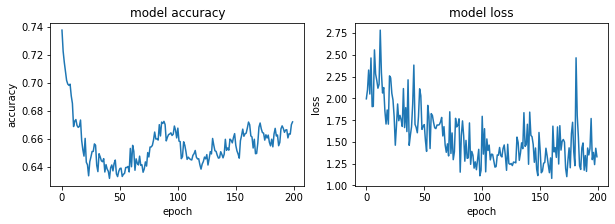

#### Adagram - 0.001


```python
optimizer= tf.keras.optimizers.Adagrad(learning_rate=0.001)
model.compile(optimizer=optimizer,
              loss='sparse_categorical_crossentropy',
              metrics=['accuracy'])
#history = model.fit(X, Y, validation_split=0.33, epochs=150, batch_size=10, verbose=0)
history = model.fit(x_train, y_train, epochs=200)
model.evaluate(x_test,  y_test, verbose=2)
```

    Epoch 1/200
    1875/1875 [==============================] - 2s 982us/step - loss: 0.9990 - accuracy: 0.6886
    Epoch 2/200
    1875/1875 [==============================] - 2s 929us/step - loss: 0.9966 - accuracy: 0.6893
    Epoch 3/200
    1875/1875 [==============================] - 2s 1ms/step - loss: 0.9926 - accuracy: 0.6905
    Epoch 4/200
    1875/1875 [==============================] - 2s 972us/step - loss: 0.9954 - accuracy: 0.6893
    Epoch 5/200
    1875/1875 [==============================] - 2s 949us/step - loss: 0.9931 - accuracy: 0.6901
    Epoch 6/200
    1875/1875 [==============================] - 2s 1ms/step - loss: 1.0160 - accuracy: 0.6897
    Epoch 7/200
    1875/1875 [==============================] - 2s 939us/step - loss: 0.9958 - accuracy: 0.6892
    Epoch 8/200
    1875/1875 [==============================] - 2s 1ms/step - loss: 0.9906 - accuracy: 0.6907
    Epoch 9/200
    1875/1875 [==============================] - 2s 1ms/step - loss: 0.9940 - accuracy: 0.6902
    Epoch 10/200
    1875/1875 [==============================] - 2s 1ms/step - loss: 1.0245 - accuracy: 0.6897
    Epoch 11/200
    1875/1875 [==============================] - 2s 943us/step - loss: 1.0109 - accuracy: 0.6890
    Epoch 12/200
    1875/1875 [==============================] - 2s 1ms/step - loss: 0.9945 - accuracy: 0.6897
    Epoch 13/200
    1875/1875 [==============================] - 2s 948us/step - loss: 0.9931 - accuracy: 0.6901
    Epoch 14/200
    1875/1875 [==============================] - 2s 1ms/step - loss: 0.9914 - accuracy: 0.6909
    Epoch 15/200
    1875/1875 [==============================] - 2s 922us/step - loss: 1.0253 - accuracy: 0.6892
    Epoch 16/200
    1875/1875 [==============================] - 2s 990us/step - loss: 1.1086 - accuracy: 0.6897
    Epoch 17/200
    1875/1875 [==============================] - 2s 971us/step - loss: 0.9942 - accuracy: 0.6893
    Epoch 18/200
    1875/1875 [==============================] - 2s 921us/step - loss: 0.9591 - accuracy: 0.6897
    Epoch 19/200
    1875/1875 [==============================] - 2s 993us/step - loss: 0.9962 - accuracy: 0.6889
    Epoch 20/200
    1875/1875 [==============================] - 2s 1ms/step - loss: 0.9253 - accuracy: 0.6901
    Epoch 21/200
    1875/1875 [==============================] - 2s 991us/step - loss: 0.9998 - accuracy: 0.6902
    Epoch 22/200
    1875/1875 [==============================] - 2s 933us/step - loss: 0.9935 - accuracy: 0.6898
    Epoch 23/200
    1875/1875 [==============================] - 2s 972us/step - loss: 1.0559 - accuracy: 0.6881
    Epoch 24/200
    1875/1875 [==============================] - 2s 921us/step - loss: 1.0516 - accuracy: 0.6888
    Epoch 25/200
    1875/1875 [==============================] - 2s 1ms/step - loss: 1.0047 - accuracy: 0.6907
    Epoch 26/200
    1875/1875 [==============================] - 2s 925us/step - loss: 1.0357 - accuracy: 0.6904
    Epoch 27/200
    1875/1875 [==============================] - 2s 959us/step - loss: 0.9280 - accuracy: 0.6892
    Epoch 28/200
    1875/1875 [==============================] - 2s 968us/step - loss: 0.9940 - accuracy: 0.6895
    Epoch 29/200
    1875/1875 [==============================] - 2s 1ms/step - loss: 0.9930 - accuracy: 0.6897
    Epoch 30/200
    1875/1875 [==============================] - 2s 964us/step - loss: 1.0004 - accuracy: 0.6876
    Epoch 31/200
    1875/1875 [==============================] - 2s 1ms/step - loss: 0.9943 - accuracy: 0.6891
    Epoch 32/200
    1875/1875 [==============================] - 2s 936us/step - loss: 0.9930 - accuracy: 0.6897
    Epoch 33/200
    1875/1875 [==============================] - 2s 988us/step - loss: 0.9911 - accuracy: 0.6907
    Epoch 34/200
    1875/1875 [==============================] - 2s 979us/step - loss: 0.9971 - accuracy: 0.6883
    Epoch 35/200
    1875/1875 [==============================] - 2s 961us/step - loss: 1.0085 - accuracy: 0.6897
    Epoch 36/200
    1875/1875 [==============================] - 2s 1ms/step - loss: 0.9947 - accuracy: 0.6895
    Epoch 37/200
    1875/1875 [==============================] - 2s 954us/step - loss: 0.9276 - accuracy: 0.6895
    Epoch 38/200
    1875/1875 [==============================] - 2s 1ms/step - loss: 0.9909 - accuracy: 0.6907
    Epoch 39/200
    1875/1875 [==============================] - 2s 945us/step - loss: 0.9947 - accuracy: 0.6890
    Epoch 40/200
    1875/1875 [==============================] - 2s 974us/step - loss: 0.9922 - accuracy: 0.6899
    Epoch 41/200
    1875/1875 [==============================] - 2s 1ms/step - loss: 1.0032 - accuracy: 0.6886
    Epoch 42/200
    1875/1875 [==============================] - 2s 1ms/step - loss: 0.9975 - accuracy: 0.6882
    Epoch 43/200
    1875/1875 [==============================] - 2s 946us/step - loss: 1.0015 - accuracy: 0.6896
    Epoch 44/200
    1875/1875 [==============================] - 2s 995us/step - loss: 0.9912 - accuracy: 0.6902
    Epoch 45/200
    1875/1875 [==============================] - 2s 957us/step - loss: 0.9300 - accuracy: 0.6885
    Epoch 46/200
    1875/1875 [==============================] - 2s 980us/step - loss: 0.9242 - accuracy: 0.6907
    Epoch 47/200
    1875/1875 [==============================] - 2s 1ms/step - loss: 0.9966 - accuracy: 0.6886
    Epoch 48/200
    1875/1875 [==============================] - 2s 980us/step - loss: 0.9971 - accuracy: 0.6889
    Epoch 49/200
    1875/1875 [==============================] - 2s 948us/step - loss: 0.9993 - accuracy: 0.6905
    Epoch 50/200
    1875/1875 [==============================] - 2s 982us/step - loss: 1.0463 - accuracy: 0.6875
    Epoch 51/200
    1875/1875 [==============================] - 2s 961us/step - loss: 0.9916 - accuracy: 0.6904
    Epoch 52/200
    1875/1875 [==============================] - 2s 1ms/step - loss: 1.0115 - accuracy: 0.6907
    Epoch 53/200
    1875/1875 [==============================] - 2s 1ms/step - loss: 0.9906 - accuracy: 0.6902
    Epoch 54/200
    1875/1875 [==============================] - 2s 907us/step - loss: 1.0076 - accuracy: 0.6894
    Epoch 55/200
    1875/1875 [==============================] - 2s 939us/step - loss: 0.9967 - accuracy: 0.6879
    Epoch 56/200
    1875/1875 [==============================] - 2s 906us/step - loss: 0.9906 - accuracy: 0.6908
    Epoch 57/200
    1875/1875 [==============================] - 2s 928us/step - loss: 1.0088 - accuracy: 0.6892
    Epoch 58/200
    1875/1875 [==============================] - 2s 1ms/step - loss: 0.9927 - accuracy: 0.6901
    Epoch 59/200
    1875/1875 [==============================] - 2s 931us/step - loss: 0.9937 - accuracy: 0.6896
    Epoch 60/200
    1875/1875 [==============================] - 2s 924us/step - loss: 0.9965 - accuracy: 0.6888
    Epoch 61/200
    1875/1875 [==============================] - 2s 907us/step - loss: 1.0233 - accuracy: 0.6899
    Epoch 62/200
    1875/1875 [==============================] - 2s 959us/step - loss: 0.9918 - accuracy: 0.6899
    Epoch 63/200
    1875/1875 [==============================] - 2s 931us/step - loss: 0.9975 - accuracy: 0.6883
    Epoch 64/200
    1875/1875 [==============================] - 2s 1ms/step - loss: 1.0096 - accuracy: 0.6892
    Epoch 65/200
    1875/1875 [==============================] - 2s 923us/step - loss: 0.9945 - accuracy: 0.6895
    Epoch 66/200
    1875/1875 [==============================] - 2s 937us/step - loss: 0.9915 - accuracy: 0.6903
    Epoch 67/200
    1875/1875 [==============================] - 2s 907us/step - loss: 0.9891 - accuracy: 0.6907
    Epoch 68/200
    1875/1875 [==============================] - 2s 955us/step - loss: 0.9376 - accuracy: 0.6901
    Epoch 69/200
    1875/1875 [==============================] - 2s 907us/step - loss: 0.9932 - accuracy: 0.6893
    Epoch 70/200
    1875/1875 [==============================] - 2s 1ms/step - loss: 0.9920 - accuracy: 0.6899
    Epoch 71/200
    1875/1875 [==============================] - 2s 927us/step - loss: 0.9980 - accuracy: 0.6904
    Epoch 72/200
    1875/1875 [==============================] - 2s 927us/step - loss: 0.9966 - accuracy: 0.6884
    Epoch 73/200
    1875/1875 [==============================] - 2s 975us/step - loss: 0.9294 - accuracy: 0.6891
    Epoch 74/200
    1875/1875 [==============================] - 2s 906us/step - loss: 0.9270 - accuracy: 0.6895
    Epoch 75/200
    1875/1875 [==============================] - 2s 1ms/step - loss: 0.9268 - accuracy: 0.6896
    Epoch 76/200
    1875/1875 [==============================] - 2s 929us/step - loss: 1.0059 - accuracy: 0.6898
    Epoch 77/200
    1875/1875 [==============================] - 2s 974us/step - loss: 0.9943 - accuracy: 0.6893
    Epoch 78/200
    1875/1875 [==============================] - 2s 936us/step - loss: 0.9929 - accuracy: 0.6899
    Epoch 79/200
    1875/1875 [==============================] - 2s 969us/step - loss: 0.9234 - accuracy: 0.6911
    Epoch 80/200
    1875/1875 [==============================] - 2s 945us/step - loss: 1.0190 - accuracy: 0.6894
    Epoch 81/200
    1875/1875 [==============================] - 2s 1ms/step - loss: 0.9936 - accuracy: 0.6893
    Epoch 82/200
    1875/1875 [==============================] - 2s 937us/step - loss: 0.9278 - accuracy: 0.6896
    Epoch 83/200
    1875/1875 [==============================] - 2s 902us/step - loss: 0.9945 - accuracy: 0.6898
    Epoch 84/200
    1875/1875 [==============================] - 2s 958us/step - loss: 1.0111 - accuracy: 0.6896
    Epoch 85/200
    1875/1875 [==============================] - 2s 901us/step - loss: 0.9902 - accuracy: 0.6905
    Epoch 86/200
    1875/1875 [==============================] - 2s 988us/step - loss: 1.0088 - accuracy: 0.6892
    Epoch 87/200
    1875/1875 [==============================] - 2s 1ms/step - loss: 0.9913 - accuracy: 0.6903
    Epoch 88/200
    1875/1875 [==============================] - 2s 953us/step - loss: 0.9943 - accuracy: 0.6891
    Epoch 89/200
    1875/1875 [==============================] - 2s 921us/step - loss: 0.9616 - accuracy: 0.6891
    Epoch 90/200
    1875/1875 [==============================] - 2s 957us/step - loss: 0.9880 - accuracy: 0.6916
    Epoch 91/200
    1875/1875 [==============================] - 2s 929us/step - loss: 0.9917 - accuracy: 0.6901
    Epoch 92/200
    1875/1875 [==============================] - 2s 1ms/step - loss: 0.9914 - accuracy: 0.6905
    Epoch 93/200
    1875/1875 [==============================] - 2s 933us/step - loss: 0.9917 - accuracy: 0.6897
    Epoch 94/200
    1875/1875 [==============================] - 2s 903us/step - loss: 1.0089 - accuracy: 0.6889
    Epoch 95/200
    1875/1875 [==============================] - 2s 955us/step - loss: 0.9267 - accuracy: 0.6899
    Epoch 96/200
    1875/1875 [==============================] - 2s 913us/step - loss: 0.9920 - accuracy: 0.6895
    Epoch 97/200
    1875/1875 [==============================] - 2s 967us/step - loss: 0.9344 - accuracy: 0.6899
    Epoch 98/200
    1875/1875 [==============================] - 2s 1ms/step - loss: 1.0004 - accuracy: 0.6894
    Epoch 99/200
    1875/1875 [==============================] - 2s 956us/step - loss: 0.9950 - accuracy: 0.6890
    Epoch 100/200
    1875/1875 [==============================] - 2s 906us/step - loss: 1.0255 - accuracy: 0.6890
    Epoch 101/200
    1875/1875 [==============================] - 2s 931us/step - loss: 0.9958 - accuracy: 0.6882
    Epoch 102/200
    1875/1875 [==============================] - 2s 911us/step - loss: 0.9226 - accuracy: 0.6913
    Epoch 103/200
    1875/1875 [==============================] - 2s 907us/step - loss: 0.9934 - accuracy: 0.6890
    Epoch 104/200
    1875/1875 [==============================] - 2s 1ms/step - loss: 0.9898 - accuracy: 0.6901
    Epoch 105/200
    1875/1875 [==============================] - 2s 911us/step - loss: 0.9259 - accuracy: 0.6898
    Epoch 106/200
    1875/1875 [==============================] - 2s 954us/step - loss: 1.0090 - accuracy: 0.6887
    Epoch 107/200
    1875/1875 [==============================] - 2s 900us/step - loss: 1.0078 - accuracy: 0.6895
    Epoch 108/200
    1875/1875 [==============================] - 2s 951us/step - loss: 0.9993 - accuracy: 0.6898
    Epoch 109/200
    1875/1875 [==============================] - 2s 1ms/step - loss: 0.9945 - accuracy: 0.6889
    Epoch 110/200
    1875/1875 [==============================] - 2s 937us/step - loss: 0.9275 - accuracy: 0.6894
    Epoch 111/200
    1875/1875 [==============================] - 2s 904us/step - loss: 0.9924 - accuracy: 0.6900
    Epoch 112/200
    1875/1875 [==============================] - 2s 901us/step - loss: 1.0117 - accuracy: 0.6898
    Epoch 113/200
    1875/1875 [==============================] - 2s 961us/step - loss: 0.9877 - accuracy: 0.6915
    Epoch 114/200
    1875/1875 [==============================] - 2s 988us/step - loss: 0.9272 - accuracy: 0.6900
    Epoch 115/200
    1875/1875 [==============================] - 2s 1ms/step - loss: 1.0036 - accuracy: 0.6901
    Epoch 116/200
    1875/1875 [==============================] - 2s 926us/step - loss: 0.9887 - accuracy: 0.6909
    Epoch 117/200
    1875/1875 [==============================] - 2s 969us/step - loss: 1.0807 - accuracy: 0.6896
    Epoch 118/200
    1875/1875 [==============================] - 2s 900us/step - loss: 0.9925 - accuracy: 0.6896
    Epoch 119/200
    1875/1875 [==============================] - 2s 978us/step - loss: 0.9289 - accuracy: 0.6894
    Epoch 120/200
    1875/1875 [==============================] - 2s 1ms/step - loss: 1.0059 - accuracy: 0.6898
    Epoch 121/200
    1875/1875 [==============================] - 2s 972us/step - loss: 1.0033 - accuracy: 0.6895
    Epoch 122/200
    1875/1875 [==============================] - 2s 939us/step - loss: 1.1268 - accuracy: 0.6892
    Epoch 123/200
    1875/1875 [==============================] - 2s 988us/step - loss: 1.0792 - accuracy: 0.6890
    Epoch 124/200
    1875/1875 [==============================] - 2s 924us/step - loss: 0.9261 - accuracy: 0.6901
    Epoch 125/200
    1875/1875 [==============================] - 2s 927us/step - loss: 0.9880 - accuracy: 0.6912
    Epoch 126/200
    1875/1875 [==============================] - 2s 1ms/step - loss: 0.9211 - accuracy: 0.6916
    Epoch 127/200
    1875/1875 [==============================] - 2s 926us/step - loss: 0.9568 - accuracy: 0.6896
    Epoch 128/200
    1875/1875 [==============================] - 2s 995us/step - loss: 1.0212 - accuracy: 0.6900
    Epoch 129/200
    1875/1875 [==============================] - 2s 913us/step - loss: 0.9916 - accuracy: 0.6900
    Epoch 130/200
    1875/1875 [==============================] - 2s 985us/step - loss: 0.9937 - accuracy: 0.6891
    Epoch 131/200
    1875/1875 [==============================] - 2s 932us/step - loss: 1.0244 - accuracy: 0.6889
    Epoch 132/200
    1875/1875 [==============================] - 2s 1ms/step - loss: 0.9936 - accuracy: 0.6888
    Epoch 133/200
    1875/1875 [==============================] - 2s 903us/step - loss: 0.9941 - accuracy: 0.6891
    Epoch 134/200
    1875/1875 [==============================] - 2s 954us/step - loss: 0.9940 - accuracy: 0.6887
    Epoch 135/200
    1875/1875 [==============================] - 2s 903us/step - loss: 0.9894 - accuracy: 0.6903
    Epoch 136/200
    1875/1875 [==============================] - 2s 923us/step - loss: 1.0198 - accuracy: 0.6912
    Epoch 137/200
    1875/1875 [==============================] - 2s 1ms/step - loss: 0.9279 - accuracy: 0.6895
    Epoch 138/200
    1875/1875 [==============================] - 2s 1ms/step - loss: 0.9378 - accuracy: 0.6890
    Epoch 139/200
    1875/1875 [==============================] - 2s 968us/step - loss: 0.9888 - accuracy: 0.6908
    Epoch 140/200
    1875/1875 [==============================] - 2s 930us/step - loss: 0.9939 - accuracy: 0.6892
    Epoch 141/200
    1875/1875 [==============================] - 2s 963us/step - loss: 0.9906 - accuracy: 0.6903
    Epoch 142/200
    1875/1875 [==============================] - 2s 917us/step - loss: 0.9932 - accuracy: 0.6891
    Epoch 143/200
    1875/1875 [==============================] - 2s 1ms/step - loss: 0.9897 - accuracy: 0.6901
    Epoch 144/200
    1875/1875 [==============================] - 2s 915us/step - loss: 1.0057 - accuracy: 0.6898
    Epoch 145/200
    1875/1875 [==============================] - 2s 966us/step - loss: 0.9913 - accuracy: 0.6901
    Epoch 146/200
    1875/1875 [==============================] - 2s 925us/step - loss: 0.9935 - accuracy: 0.6888
    Epoch 147/200
    1875/1875 [==============================] - 2s 950us/step - loss: 0.9905 - accuracy: 0.6903
    Epoch 148/200
    1875/1875 [==============================] - 2s 1ms/step - loss: 0.9957 - accuracy: 0.6885
    Epoch 149/200
    1875/1875 [==============================] - 2s 995us/step - loss: 0.9904 - accuracy: 0.6903
    Epoch 150/200
    1875/1875 [==============================] - 2s 985us/step - loss: 0.9904 - accuracy: 0.6906
    Epoch 151/200
    1875/1875 [==============================] - 2s 952us/step - loss: 0.9900 - accuracy: 0.6903
    Epoch 152/200
    1875/1875 [==============================] - 2s 1ms/step - loss: 1.0042 - accuracy: 0.6904
    Epoch 153/200
    1875/1875 [==============================] - 2s 931us/step - loss: 0.9915 - accuracy: 0.6892
    Epoch 154/200
    1875/1875 [==============================] - 2s 1ms/step - loss: 0.9913 - accuracy: 0.6897
    Epoch 155/200
    1875/1875 [==============================] - 2s 916us/step - loss: 0.9265 - accuracy: 0.6898
    Epoch 156/200
    1875/1875 [==============================] - 2s 971us/step - loss: 1.0199 - accuracy: 0.6914
    Epoch 157/200
    1875/1875 [==============================] - 2s 913us/step - loss: 0.9338 - accuracy: 0.6873
    Epoch 158/200
    1875/1875 [==============================] - 2s 939us/step - loss: 0.9902 - accuracy: 0.6897
    Epoch 159/200
    1875/1875 [==============================] - 2s 945us/step - loss: 0.9257 - accuracy: 0.6906
    Epoch 160/200
    1875/1875 [==============================] - 2s 1ms/step - loss: 0.9894 - accuracy: 0.6899
    Epoch 161/200
    1875/1875 [==============================] - 2s 977us/step - loss: 0.9937 - accuracy: 0.6889
    Epoch 162/200
    1875/1875 [==============================] - 2s 1ms/step - loss: 0.9906 - accuracy: 0.6901
    Epoch 163/200
    1875/1875 [==============================] - 2s 898us/step - loss: 0.9901 - accuracy: 0.6900
    Epoch 164/200
    1875/1875 [==============================] - 2s 918us/step - loss: 0.9949 - accuracy: 0.6890
    Epoch 165/200
    1875/1875 [==============================] - 2s 1ms/step - loss: 0.9302 - accuracy: 0.6888
    Epoch 166/200
    1875/1875 [==============================] - 2s 955us/step - loss: 0.9880 - accuracy: 0.6910
    Epoch 167/200
    1875/1875 [==============================] - 2s 964us/step - loss: 1.0904 - accuracy: 0.6887
    Epoch 168/200
    1875/1875 [==============================] - 2s 904us/step - loss: 0.9889 - accuracy: 0.6907
    Epoch 169/200
    1875/1875 [==============================] - 2s 962us/step - loss: 0.9918 - accuracy: 0.6897
    Epoch 170/200
    1875/1875 [==============================] - 2s 925us/step - loss: 1.0058 - accuracy: 0.6896
    Epoch 171/200
    1875/1875 [==============================] - 2s 1ms/step - loss: 0.9298 - accuracy: 0.6899
    Epoch 172/200
    1875/1875 [==============================] - 2s 901us/step - loss: 0.9904 - accuracy: 0.6898
    Epoch 173/200
    1875/1875 [==============================] - 2s 931us/step - loss: 0.9281 - accuracy: 0.6894
    Epoch 174/200
    1875/1875 [==============================] - 2s 929us/step - loss: 0.9306 - accuracy: 0.6885
    Epoch 175/200
    1875/1875 [==============================] - 2s 898us/step - loss: 0.9451 - accuracy: 0.6909
    Epoch 176/200
    1875/1875 [==============================] - 2s 958us/step - loss: 1.0201 - accuracy: 0.6903
    Epoch 177/200
    1875/1875 [==============================] - 2s 997us/step - loss: 1.0061 - accuracy: 0.6895
    Epoch 178/200
    1875/1875 [==============================] - 2s 984us/step - loss: 0.9913 - accuracy: 0.6900
    Epoch 179/200
    1875/1875 [==============================] - 2s 921us/step - loss: 0.9913 - accuracy: 0.6900
    Epoch 180/200
    1875/1875 [==============================] - 2s 952us/step - loss: 1.0504 - accuracy: 0.6890
    Epoch 181/200
    1875/1875 [==============================] - 2s 922us/step - loss: 1.0062 - accuracy: 0.6891
    Epoch 182/200
    1875/1875 [==============================] - 2s 1ms/step - loss: 0.9272 - accuracy: 0.6899
    Epoch 183/200
    1875/1875 [==============================] - 2s 918us/step - loss: 0.9807 - accuracy: 0.6906
    Epoch 184/200
    1875/1875 [==============================] - 2s 917us/step - loss: 0.9253 - accuracy: 0.6908
    Epoch 185/200
    1875/1875 [==============================] - 2s 987us/step - loss: 0.9390 - accuracy: 0.6898
    Epoch 186/200
    1875/1875 [==============================] - 2s 920us/step - loss: 0.9231 - accuracy: 0.6908
    Epoch 187/200
    1875/1875 [==============================] - 2s 966us/step - loss: 0.9249 - accuracy: 0.6909
    Epoch 188/200
    1875/1875 [==============================] - 2s 1ms/step - loss: 0.9889 - accuracy: 0.6906
    Epoch 189/200
    1875/1875 [==============================] - 2s 940us/step - loss: 0.9911 - accuracy: 0.6900
    Epoch 190/200
    1875/1875 [==============================] - 2s 906us/step - loss: 0.9881 - accuracy: 0.6904
    Epoch 191/200
    1875/1875 [==============================] - 2s 934us/step - loss: 0.9901 - accuracy: 0.6904
    Epoch 192/200
    1875/1875 [==============================] - 2s 907us/step - loss: 0.9899 - accuracy: 0.6904
    Epoch 193/200
    1875/1875 [==============================] - 2s 935us/step - loss: 0.9912 - accuracy: 0.6899
    Epoch 194/200
    1875/1875 [==============================] - 2s 1ms/step - loss: 0.9421 - accuracy: 0.6895
    Epoch 195/200
    1875/1875 [==============================] - 2s 931us/step - loss: 1.0331 - accuracy: 0.6908
    Epoch 196/200
    1875/1875 [==============================] - 2s 1ms/step - loss: 1.0076 - accuracy: 0.6896
    Epoch 197/200
    1875/1875 [==============================] - 2s 913us/step - loss: 1.0052 - accuracy: 0.6897
    Epoch 198/200
    1875/1875 [==============================] - 2s 943us/step - loss: 1.0038 - accuracy: 0.6898
    Epoch 199/200
    1875/1875 [==============================] - 2s 1ms/step - loss: 0.9908 - accuracy: 0.6897
    Epoch 200/200
    1875/1875 [==============================] - 2s 954us/step - loss: 1.0080 - accuracy: 0.6888
    313/313 - 0s - loss: 19.1063 - accuracy: 0.7249
    


    [19.1063289642334, 0.7249000072479248]


```python
fig, (ax1, ax2) = plt.subplots(1, 2, figsize=(10, 3))

#ax1.subplot(1, 2, 1)
ax1.plot(history.history['accuracy'])
#plt.plot(history.history['val_accuracy'])
ax1.set_title('model accuracy')
ax1.set_ylabel('accuracy')
ax1.set_xlabel('epoch')
#ax1.show()

#ax2.subplot(1, 2, 2)
ax2.plot(history.history['loss'])
#plt.plot(history.history['val_loss'])
ax2.set_title('model loss')
ax2.set_ylabel('loss')
ax2.set_xlabel('epoch')
```


#### Adagram - 0.1


```python
optimizer= tf.keras.optimizers.Adagrad(learning_rate=0.1)
model.compile(optimizer=optimizer,
              loss='sparse_categorical_crossentropy',
              metrics=['accuracy'])
#history = model.fit(X, Y, validation_split=0.33, epochs=150, batch_size=10, verbose=0)
history = model.fit(x_train, y_train, epochs=200)
model.evaluate(x_test,  y_test, verbose=2)
```

    Epoch 1/200
    1875/1875 [==============================] - 2s 947us/step - loss: 0.9234 - accuracy: 0.6885
    Epoch 2/200
    1875/1875 [==============================] - 2s 990us/step - loss: 0.8594 - accuracy: 0.6879
    Epoch 3/200
    1875/1875 [==============================] - 2s 945us/step - loss: 0.9061 - accuracy: 0.6884
    Epoch 4/200
    1875/1875 [==============================] - 2s 1ms/step - loss: 0.8922 - accuracy: 0.6871
    Epoch 5/200
    1875/1875 [==============================] - 2s 941us/step - loss: 0.9095 - accuracy: 0.6905
    Epoch 6/200
    1875/1875 [==============================] - 2s 959us/step - loss: 0.8978 - accuracy: 0.6903
    Epoch 7/200
    1875/1875 [==============================] - 2s 921us/step - loss: 0.8953 - accuracy: 0.6900
    Epoch 8/200
    1875/1875 [==============================] - 2s 963us/step - loss: 0.8611 - accuracy: 0.6885
    Epoch 9/200
    1875/1875 [==============================] - 2s 952us/step - loss: 0.9889 - accuracy: 0.6903
    Epoch 10/200
    1875/1875 [==============================] - 2s 1ms/step - loss: 0.8563 - accuracy: 0.6885
    Epoch 11/200
    1875/1875 [==============================] - 2s 922us/step - loss: 0.9515 - accuracy: 0.6898
    Epoch 12/200
    1875/1875 [==============================] - 2s 1ms/step - loss: 0.8865 - accuracy: 0.6900
    Epoch 13/200
    1875/1875 [==============================] - 2s 938us/step - loss: 0.8539 - accuracy: 0.6908
    Epoch 14/200
    1875/1875 [==============================] - 2s 933us/step - loss: 0.8561 - accuracy: 0.6902
    Epoch 15/200
    1875/1875 [==============================] - 2s 1ms/step - loss: 0.8560 - accuracy: 0.6903
    Epoch 16/200
    1875/1875 [==============================] - 2s 937us/step - loss: 0.8590 - accuracy: 0.6892
    Epoch 17/200
    1875/1875 [==============================] - 2s 984us/step - loss: 0.8608 - accuracy: 0.6889
    Epoch 18/200
    1875/1875 [==============================] - 2s 934us/step - loss: 0.8566 - accuracy: 0.6904
    Epoch 19/200
    1875/1875 [==============================] - 2s 1ms/step - loss: 0.9358 - accuracy: 0.6891
    Epoch 20/200
    1875/1875 [==============================] - 2s 965us/step - loss: 0.8582 - accuracy: 0.6893
    Epoch 21/200
    1875/1875 [==============================] - 2s 1ms/step - loss: 0.8601 - accuracy: 0.6887
    Epoch 22/200
    1875/1875 [==============================] - 2s 954us/step - loss: 0.8992 - accuracy: 0.6901
    Epoch 23/200
    1875/1875 [==============================] - 2s 979us/step - loss: 0.8564 - accuracy: 0.6884
    Epoch 24/200
    1875/1875 [==============================] - 2s 951us/step - loss: 0.8788 - accuracy: 0.6881
    Epoch 25/200
    1875/1875 [==============================] - 2s 958us/step - loss: 0.8590 - accuracy: 0.6865
    Epoch 26/200
    1875/1875 [==============================] - 2s 1ms/step - loss: 0.8584 - accuracy: 0.6880
    Epoch 27/200
    1875/1875 [==============================] - 2s 949us/step - loss: 0.8761 - accuracy: 0.6879
    Epoch 28/200
    1875/1875 [==============================] - 2s 929us/step - loss: 0.8624 - accuracy: 0.6902
    Epoch 29/200
    1875/1875 [==============================] - 2s 926us/step - loss: 0.8550 - accuracy: 0.6902
    Epoch 30/200
    1875/1875 [==============================] - 2s 951us/step - loss: 0.8554 - accuracy: 0.6901
    Epoch 31/200
    1875/1875 [==============================] - 2s 941us/step - loss: 0.8575 - accuracy: 0.6892
    Epoch 32/200
    1875/1875 [==============================] - 2s 1ms/step - loss: 0.8715 - accuracy: 0.6895
    Epoch 33/200
    1875/1875 [==============================] - 2s 922us/step - loss: 0.8595 - accuracy: 0.6882
    Epoch 34/200
    1875/1875 [==============================] - 2s 935us/step - loss: 0.8563 - accuracy: 0.6876
    Epoch 35/200
    1875/1875 [==============================] - 2s 965us/step - loss: 0.8726 - accuracy: 0.6896
    Epoch 36/200
    1875/1875 [==============================] - 2s 971us/step - loss: 0.8655 - accuracy: 0.6883
    Epoch 37/200
    1875/1875 [==============================] - 2s 1ms/step - loss: 0.8578 - accuracy: 0.6875
    Epoch 38/200
    1875/1875 [==============================] - 2s 978us/step - loss: 0.8583 - accuracy: 0.6870
    Epoch 39/200
    1875/1875 [==============================] - 2s 951us/step - loss: 0.8581 - accuracy: 0.6883
    Epoch 40/200
    1875/1875 [==============================] - 2s 940us/step - loss: 0.8540 - accuracy: 0.6895
    Epoch 41/200
    1875/1875 [==============================] - 2s 969us/step - loss: 0.8830 - accuracy: 0.6872
    Epoch 42/200
    1875/1875 [==============================] - 2s 943us/step - loss: 0.8568 - accuracy: 0.6876
    Epoch 43/200
    1875/1875 [==============================] - 2s 1ms/step - loss: 0.8854 - accuracy: 0.6885
    Epoch 44/200
    1875/1875 [==============================] - 2s 932us/step - loss: 0.8572 - accuracy: 0.6881
    Epoch 45/200
    1875/1875 [==============================] - 2s 978us/step - loss: 0.8567 - accuracy: 0.6899
    Epoch 46/200
    1875/1875 [==============================] - 2s 936us/step - loss: 0.8535 - accuracy: 0.6913
    Epoch 47/200
    1875/1875 [==============================] - 2s 956us/step - loss: 0.8569 - accuracy: 0.6899
    Epoch 48/200
    1875/1875 [==============================] - 2s 1ms/step - loss: 0.8581 - accuracy: 0.6898
    Epoch 49/200
    1875/1875 [==============================] - 2s 1ms/step - loss: 0.8679 - accuracy: 0.6886
    Epoch 50/200
    1875/1875 [==============================] - 2s 941us/step - loss: 0.8589 - accuracy: 0.6866
    Epoch 51/200
    1875/1875 [==============================] - 2s 976us/step - loss: 0.8557 - accuracy: 0.6890
    Epoch 52/200
    1875/1875 [==============================] - 2s 923us/step - loss: 0.8566 - accuracy: 0.6874
    Epoch 53/200
    1875/1875 [==============================] - 2s 911us/step - loss: 0.8583 - accuracy: 0.6868
    Epoch 54/200
    1875/1875 [==============================] - 2s 1ms/step - loss: 0.8551 - accuracy: 0.6880
    Epoch 55/200
    1875/1875 [==============================] - 2s 893us/step - loss: 0.8575 - accuracy: 0.6870
    Epoch 56/200
    1875/1875 [==============================] - 2s 942us/step - loss: 0.8570 - accuracy: 0.6874
    Epoch 57/200
    1875/1875 [==============================] - 2s 920us/step - loss: 0.8601 - accuracy: 0.6890
    Epoch 58/200
    1875/1875 [==============================] - 2s 939us/step - loss: 0.8696 - accuracy: 0.6891
    Epoch 59/200
    1875/1875 [==============================] - 2s 933us/step - loss: 0.8573 - accuracy: 0.6899
    Epoch 60/200
    1875/1875 [==============================] - 2s 1ms/step - loss: 0.8582 - accuracy: 0.6901
    Epoch 61/200
    1875/1875 [==============================] - 2s 943us/step - loss: 0.8616 - accuracy: 0.6853
    Epoch 62/200
    1875/1875 [==============================] - 2s 927us/step - loss: 0.8604 - accuracy: 0.6869
    Epoch 63/200
    1875/1875 [==============================] - 2s 914us/step - loss: 0.8596 - accuracy: 0.6870
    Epoch 64/200
    1875/1875 [==============================] - 2s 918us/step - loss: 0.8660 - accuracy: 0.6867
    Epoch 65/200
    1875/1875 [==============================] - 2s 946us/step - loss: 0.8559 - accuracy: 0.6884
    Epoch 66/200
    1875/1875 [==============================] - 2s 1ms/step - loss: 0.8577 - accuracy: 0.6880
    Epoch 67/200
    1875/1875 [==============================] - 2s 924us/step - loss: 0.8580 - accuracy: 0.6878
    Epoch 68/200
    1875/1875 [==============================] - 2s 947us/step - loss: 0.8579 - accuracy: 0.6901
    Epoch 69/200
    1875/1875 [==============================] - 2s 967us/step - loss: 0.8582 - accuracy: 0.6901
    Epoch 70/200
    1875/1875 [==============================] - 2s 913us/step - loss: 0.8664 - accuracy: 0.6900
    Epoch 71/200
    1875/1875 [==============================] - 2s 1ms/step - loss: 0.8603 - accuracy: 0.6893
    Epoch 72/200
    1875/1875 [==============================] - 2s 947us/step - loss: 0.8575 - accuracy: 0.6906
    Epoch 73/200
    1875/1875 [==============================] - 2s 941us/step - loss: 0.8596 - accuracy: 0.6896
    Epoch 74/200
    1875/1875 [==============================] - 2s 942us/step - loss: 0.8609 - accuracy: 0.6906
    Epoch 75/200
    1875/1875 [==============================] - 2s 901us/step - loss: 0.8603 - accuracy: 0.6894
    Epoch 76/200
    1875/1875 [==============================] - 2s 946us/step - loss: 0.8764 - accuracy: 0.6913
    Epoch 77/200
    1875/1875 [==============================] - 2s 1ms/step - loss: 0.8604 - accuracy: 0.6893
    Epoch 78/200
    1875/1875 [==============================] - 2s 952us/step - loss: 0.8646 - accuracy: 0.6904
    Epoch 79/200
    1875/1875 [==============================] - 2s 924us/step - loss: 0.8655 - accuracy: 0.6888
    Epoch 80/200
    1875/1875 [==============================] - 2s 952us/step - loss: 0.8599 - accuracy: 0.6896
    Epoch 81/200
    1875/1875 [==============================] - 2s 920us/step - loss: 0.8925 - accuracy: 0.6884
    Epoch 82/200
    1875/1875 [==============================] - 2s 929us/step - loss: 0.8589 - accuracy: 0.6901
    Epoch 83/200
    1875/1875 [==============================] - 2s 1ms/step - loss: 0.8594 - accuracy: 0.6901
    Epoch 84/200
    1875/1875 [==============================] - 2s 921us/step - loss: 0.8589 - accuracy: 0.6903
    Epoch 85/200
    1875/1875 [==============================] - 2s 956us/step - loss: 0.8601 - accuracy: 0.6895
    Epoch 86/200
    1875/1875 [==============================] - 2s 916us/step - loss: 0.8636 - accuracy: 0.6882
    Epoch 87/200
    1875/1875 [==============================] - 2s 962us/step - loss: 0.8630 - accuracy: 0.6886
    Epoch 88/200
    1875/1875 [==============================] - 2s 1ms/step - loss: 0.8860 - accuracy: 0.6897
    Epoch 89/200
    1875/1875 [==============================] - 2s 954us/step - loss: 0.8604 - accuracy: 0.6896
    Epoch 90/200
    1875/1875 [==============================] - 2s 928us/step - loss: 0.8594 - accuracy: 0.6900
    Epoch 91/200
    1875/1875 [==============================] - 2s 937us/step - loss: 0.8593 - accuracy: 0.6901
    Epoch 92/200
    1875/1875 [==============================] - 2s 980us/step - loss: 0.8591 - accuracy: 0.6902
    Epoch 93/200
    1875/1875 [==============================] - 2s 967us/step - loss: 0.8619 - accuracy: 0.6890
    Epoch 94/200
    1875/1875 [==============================] - 2s 1ms/step - loss: 0.8612 - accuracy: 0.6893
    Epoch 95/200
    1875/1875 [==============================] - 2s 932us/step - loss: 0.8611 - accuracy: 0.6893
    Epoch 96/200
    1875/1875 [==============================] - 2s 954us/step - loss: 0.8647 - accuracy: 0.6871
    Epoch 97/200
    1875/1875 [==============================] - 2s 924us/step - loss: 0.8554 - accuracy: 0.6891
    Epoch 98/200
    1875/1875 [==============================] - 2s 951us/step - loss: 0.8867 - accuracy: 0.6870
    Epoch 99/200
    1875/1875 [==============================] - 2s 979us/step - loss: 0.8741 - accuracy: 0.6878
    Epoch 100/200
    1875/1875 [==============================] - 2s 1ms/step - loss: 0.8601 - accuracy: 0.6873
    Epoch 101/200
    1875/1875 [==============================] - 2s 1ms/step - loss: 0.8615 - accuracy: 0.6868
    Epoch 102/200
    1875/1875 [==============================] - 2s 968us/step - loss: 0.8688 - accuracy: 0.6877
    Epoch 103/200
    1875/1875 [==============================] - 2s 935us/step - loss: 0.8595 - accuracy: 0.6874
    Epoch 104/200
    1875/1875 [==============================] - 2s 983us/step - loss: 0.8631 - accuracy: 0.6861
    Epoch 105/200
    1875/1875 [==============================] - 2s 1ms/step - loss: 0.8610 - accuracy: 0.6870
    Epoch 106/200
    1875/1875 [==============================] - 2s 978us/step - loss: 0.8618 - accuracy: 0.6865
    Epoch 107/200
    1875/1875 [==============================] - 2s 929us/step - loss: 0.8620 - accuracy: 0.6869
    Epoch 108/200
    1875/1875 [==============================] - 2s 942us/step - loss: 0.8617 - accuracy: 0.6867
    Epoch 109/200
    1875/1875 [==============================] - 2s 975us/step - loss: 0.8626 - accuracy: 0.6865
    Epoch 110/200
    1875/1875 [==============================] - 2s 1ms/step - loss: 0.8636 - accuracy: 0.6862
    Epoch 111/200
    1875/1875 [==============================] - 2s 990us/step - loss: 0.8606 - accuracy: 0.6872
    Epoch 112/200
    1875/1875 [==============================] - 2s 931us/step - loss: 0.8622 - accuracy: 0.6867
    Epoch 113/200
    1875/1875 [==============================] - 2s 999us/step - loss: 0.8597 - accuracy: 0.6876
    Epoch 114/200
    1875/1875 [==============================] - 2s 936us/step - loss: 0.8741 - accuracy: 0.6881
    Epoch 115/200
    1875/1875 [==============================] - 2s 999us/step - loss: 0.8585 - accuracy: 0.6882
    Epoch 116/200
    1875/1875 [==============================] - 2s 1ms/step - loss: 0.8626 - accuracy: 0.6866
    Epoch 117/200
    1875/1875 [==============================] - 2s 955us/step - loss: 0.8584 - accuracy: 0.6881
    Epoch 118/200
    1875/1875 [==============================] - 2s 918us/step - loss: 0.8652 - accuracy: 0.6858
    Epoch 119/200
    1875/1875 [==============================] - 2s 958us/step - loss: 0.8648 - accuracy: 0.6868
    Epoch 120/200
    1875/1875 [==============================] - 2s 959us/step - loss: 0.8610 - accuracy: 0.6873
    Epoch 121/200
    1875/1875 [==============================] - 2s 936us/step - loss: 0.8614 - accuracy: 0.6870
    Epoch 122/200
    1875/1875 [==============================] - 2s 1ms/step - loss: 0.8625 - accuracy: 0.6867
    Epoch 123/200
    1875/1875 [==============================] - 2s 927us/step - loss: 0.8611 - accuracy: 0.6871
    Epoch 124/200
    1875/1875 [==============================] - 2s 970us/step - loss: 0.8619 - accuracy: 0.6868
    Epoch 125/200
    1875/1875 [==============================] - 2s 921us/step - loss: 0.8638 - accuracy: 0.6864
    Epoch 126/200
    1875/1875 [==============================] - 2s 988us/step - loss: 0.8590 - accuracy: 0.6879
    Epoch 127/200
    1875/1875 [==============================] - 2s 1ms/step - loss: 0.8918 - accuracy: 0.6866
    Epoch 128/200
    1875/1875 [==============================] - 2s 956us/step - loss: 0.8647 - accuracy: 0.6859
    Epoch 129/200
    1875/1875 [==============================] - 2s 914us/step - loss: 0.8614 - accuracy: 0.6870
    Epoch 130/200
    1875/1875 [==============================] - 2s 932us/step - loss: 0.8586 - accuracy: 0.6882
    Epoch 131/200
    1875/1875 [==============================] - 2s 930us/step - loss: 0.8611 - accuracy: 0.6870
    Epoch 132/200
    1875/1875 [==============================] - 2s 922us/step - loss: 0.8633 - accuracy: 0.6865
    Epoch 133/200
    1875/1875 [==============================] - 2s 1ms/step - loss: 0.8677 - accuracy: 0.6847
    Epoch 134/200
    1875/1875 [==============================] - 2s 966us/step - loss: 0.8624 - accuracy: 0.6868
    Epoch 135/200
    1875/1875 [==============================] - 2s 930us/step - loss: 0.8644 - accuracy: 0.6858
    Epoch 136/200
    1875/1875 [==============================] - 2s 902us/step - loss: 0.8650 - accuracy: 0.6870
    Epoch 137/200
    1875/1875 [==============================] - 2s 947us/step - loss: 0.8856 - accuracy: 0.6868
    Epoch 138/200
    1875/1875 [==============================] - 2s 998us/step - loss: 0.8592 - accuracy: 0.6880
    Epoch 139/200
    1875/1875 [==============================] - 2s 986us/step - loss: 0.8589 - accuracy: 0.6882
    Epoch 140/200
    1875/1875 [==============================] - 2s 925us/step - loss: 0.8661 - accuracy: 0.6867
    Epoch 141/200
    1875/1875 [==============================] - 2s 925us/step - loss: 0.8636 - accuracy: 0.6862
    Epoch 142/200
    1875/1875 [==============================] - 2s 929us/step - loss: 0.8635 - accuracy: 0.6864
    Epoch 143/200
    1875/1875 [==============================] - 2s 909us/step - loss: 0.8850 - accuracy: 0.6873
    Epoch 144/200
    1875/1875 [==============================] - 2s 1ms/step - loss: 0.8824 - accuracy: 0.6876
    Epoch 145/200
    1875/1875 [==============================] - 2s 923us/step - loss: 0.8619 - accuracy: 0.6871
    Epoch 146/200
    1875/1875 [==============================] - 2s 983us/step - loss: 0.8624 - accuracy: 0.6869
    Epoch 147/200
    1875/1875 [==============================] - 2s 924us/step - loss: 0.8628 - accuracy: 0.6864
    Epoch 148/200
    1875/1875 [==============================] - 2s 974us/step - loss: 0.8570 - accuracy: 0.6889
    Epoch 149/200
    1875/1875 [==============================] - 2s 917us/step - loss: 0.8634 - accuracy: 0.6862
    Epoch 150/200
    1875/1875 [==============================] - 2s 1ms/step - loss: 0.8602 - accuracy: 0.6877
    Epoch 151/200
    1875/1875 [==============================] - 2s 933us/step - loss: 0.8579 - accuracy: 0.6886
    Epoch 152/200
    1875/1875 [==============================] - 2s 989us/step - loss: 0.8584 - accuracy: 0.6884
    Epoch 153/200
    1875/1875 [==============================] - 2s 932us/step - loss: 0.8645 - accuracy: 0.6861
    Epoch 154/200
    1875/1875 [==============================] - 2s 921us/step - loss: 0.8606 - accuracy: 0.6875
    Epoch 155/200
    1875/1875 [==============================] - 2s 1ms/step - loss: 0.8574 - accuracy: 0.6889
    Epoch 156/200
    1875/1875 [==============================] - 2s 924us/step - loss: 0.8607 - accuracy: 0.6874
    Epoch 157/200
    1875/1875 [==============================] - 2s 966us/step - loss: 0.8607 - accuracy: 0.6875
    Epoch 158/200
    1875/1875 [==============================] - 2s 921us/step - loss: 0.8605 - accuracy: 0.6876
    Epoch 159/200
    1875/1875 [==============================] - 2s 966us/step - loss: 0.8620 - accuracy: 0.6870
    Epoch 160/200
    1875/1875 [==============================] - 2s 933us/step - loss: 0.8636 - accuracy: 0.6862
    Epoch 161/200
    1875/1875 [==============================] - 2s 1ms/step - loss: 0.8597 - accuracy: 0.6881
    Epoch 162/200
    1875/1875 [==============================] - 2s 939us/step - loss: 0.8616 - accuracy: 0.6871
    Epoch 163/200
    1875/1875 [==============================] - 2s 937us/step - loss: 0.8644 - accuracy: 0.6860
    Epoch 164/200
    1875/1875 [==============================] - 2s 930us/step - loss: 0.8590 - accuracy: 0.6881
    Epoch 165/200
    1875/1875 [==============================] - 2s 947us/step - loss: 0.8785 - accuracy: 0.6884
    Epoch 166/200
    1875/1875 [==============================] - 2s 1ms/step - loss: 0.8630 - accuracy: 0.6868
    Epoch 167/200
    1875/1875 [==============================] - 2s 1ms/step - loss: 0.8608 - accuracy: 0.6873
    Epoch 168/200
    1875/1875 [==============================] - 2s 942us/step - loss: 0.8713 - accuracy: 0.6877
    Epoch 169/200
    1875/1875 [==============================] - 2s 924us/step - loss: 0.8629 - accuracy: 0.6866
    Epoch 170/200
    1875/1875 [==============================] - 2s 951us/step - loss: 0.8574 - accuracy: 0.6889
    Epoch 171/200
    1875/1875 [==============================] - 2s 894us/step - loss: 0.8648 - accuracy: 0.6857
    Epoch 172/200
    1875/1875 [==============================] - 2s 1ms/step - loss: 0.8623 - accuracy: 0.6872
    Epoch 173/200
    1875/1875 [==============================] - 2s 901us/step - loss: 0.8808 - accuracy: 0.6869
    Epoch 174/200
    1875/1875 [==============================] - 2s 947us/step - loss: 0.8864 - accuracy: 0.6866
    Epoch 175/200
    1875/1875 [==============================] - 2s 903us/step - loss: 0.8635 - accuracy: 0.6864
    Epoch 176/200
    1875/1875 [==============================] - 2s 938us/step - loss: 0.8647 - accuracy: 0.6860
    Epoch 177/200
    1875/1875 [==============================] - 2s 952us/step - loss: 0.8602 - accuracy: 0.6878
    Epoch 178/200
    1875/1875 [==============================] - 2s 1ms/step - loss: 0.8608 - accuracy: 0.6876
    Epoch 179/200
    1875/1875 [==============================] - 2s 956us/step - loss: 0.8605 - accuracy: 0.6874
    Epoch 180/200
    1875/1875 [==============================] - 2s 924us/step - loss: 0.8625 - accuracy: 0.6868
    Epoch 181/200
    1875/1875 [==============================] - 2s 977us/step - loss: 0.8641 - accuracy: 0.6861
    Epoch 182/200
    1875/1875 [==============================] - 2s 929us/step - loss: 0.8639 - accuracy: 0.6862
    Epoch 183/200
    1875/1875 [==============================] - 2s 1ms/step - loss: 0.8600 - accuracy: 0.6878
    Epoch 184/200
    1875/1875 [==============================] - 2s 916us/step - loss: 0.9113 - accuracy: 0.6867
    Epoch 185/200
    1875/1875 [==============================] - 2s 962us/step - loss: 0.8615 - accuracy: 0.6874
    Epoch 186/200
    1875/1875 [==============================] - 2s 943us/step - loss: 0.8618 - accuracy: 0.6872
    Epoch 187/200
    1875/1875 [==============================] - 2s 927us/step - loss: 0.8604 - accuracy: 0.6879
    Epoch 188/200
    1875/1875 [==============================] - 2s 972us/step - loss: 0.8603 - accuracy: 0.6877
    Epoch 189/200
    1875/1875 [==============================] - 2s 1ms/step - loss: 0.8638 - accuracy: 0.6864
    Epoch 190/200
    1875/1875 [==============================] - 2s 951us/step - loss: 0.8663 - accuracy: 0.6853
    Epoch 191/200
    1875/1875 [==============================] - 2s 928us/step - loss: 0.8640 - accuracy: 0.6866
    Epoch 192/200
    1875/1875 [==============================] - 2s 995us/step - loss: 0.8637 - accuracy: 0.6865
    Epoch 193/200
    1875/1875 [==============================] - 2s 934us/step - loss: 0.8614 - accuracy: 0.6874
    Epoch 194/200
    1875/1875 [==============================] - 2s 953us/step - loss: 0.8621 - accuracy: 0.6871
    Epoch 195/200
    1875/1875 [==============================] - 2s 1ms/step - loss: 0.8668 - accuracy: 0.6850
    Epoch 196/200
    1875/1875 [==============================] - 2s 950us/step - loss: 0.8627 - accuracy: 0.6868
    Epoch 197/200
    1875/1875 [==============================] - 2s 910us/step - loss: 0.8580 - accuracy: 0.6884
    Epoch 198/200
    1875/1875 [==============================] - 2s 948us/step - loss: 0.8601 - accuracy: 0.6877
    Epoch 199/200
    1875/1875 [==============================] - 2s 952us/step - loss: 0.8620 - accuracy: 0.6870
    Epoch 200/200
    1875/1875 [==============================] - 2s 986us/step - loss: 0.8617 - accuracy: 0.6872
    313/313 - 0s - loss: 19.0953 - accuracy: 0.7198
    


    [19.095327377319336, 0.7197999954223633]


```python
fig, (ax1, ax2) = plt.subplots(1, 2, figsize=(10, 3))

#ax1.subplot(1, 2, 1)
ax1.plot(history.history['accuracy'])
#plt.plot(history.history['val_accuracy'])
ax1.set_title('model accuracy')
ax1.set_ylabel('accuracy')
ax1.set_xlabel('epoch')
#ax1.show()

#ax2.subplot(1, 2, 2)
ax2.plot(history.history['loss'])
#plt.plot(history.history['val_loss'])
ax2.set_title('model loss')
ax2.set_ylabel('loss')
ax2.set_xlabel('epoch')
```


#### Adagram - 0.5


```python
optimizer= tf.keras.optimizers.Adagrad(learning_rate=0.5)
model.compile(optimizer=optimizer,
              loss='sparse_categorical_crossentropy',
              metrics=['accuracy'])
#history = model.fit(X, Y, validation_split=0.33, epochs=150, batch_size=10, verbose=0)
history = model.fit(x_train, y_train, epochs=200)
model.evaluate(x_test,  y_test, verbose=2)
```

    Epoch 1/200
    1875/1875 [==============================] - 2s 969us/step - loss: 0.8938 - accuracy: 0.6900
    Epoch 2/200
    1875/1875 [==============================] - 2s 985us/step - loss: 0.8602 - accuracy: 0.6878
    Epoch 3/200
    1875/1875 [==============================] - 2s 913us/step - loss: 0.8522 - accuracy: 0.6891
    Epoch 4/200
    1875/1875 [==============================] - 2s 934us/step - loss: 0.8537 - accuracy: 0.6891
    Epoch 5/200
    1875/1875 [==============================] - 2s 1ms/step - loss: 0.8566 - accuracy: 0.6880
    Epoch 6/200
    1875/1875 [==============================] - 2s 915us/step - loss: 0.8570 - accuracy: 0.6872
    Epoch 7/200
    1875/1875 [==============================] - 2s 969us/step - loss: 0.8523 - accuracy: 0.6911
    Epoch 8/200
    1875/1875 [==============================] - 2s 917us/step - loss: 0.8554 - accuracy: 0.6891
    Epoch 9/200
    1875/1875 [==============================] - 2s 961us/step - loss: 0.8528 - accuracy: 0.6896
    Epoch 10/200
    1875/1875 [==============================] - 2s 930us/step - loss: 0.8531 - accuracy: 0.6912
    Epoch 11/200
    1875/1875 [==============================] - 2s 1ms/step - loss: 0.8568 - accuracy: 0.6878
    Epoch 12/200
    1875/1875 [==============================] - 2s 921us/step - loss: 0.8578 - accuracy: 0.6890
    Epoch 13/200
    1875/1875 [==============================] - 2s 968us/step - loss: 0.8572 - accuracy: 0.6902
    Epoch 14/200
    1875/1875 [==============================] - 2s 930us/step - loss: 0.8533 - accuracy: 0.6887
    Epoch 15/200
    1875/1875 [==============================] - 2s 929us/step - loss: 0.8543 - accuracy: 0.6889
    Epoch 16/200
    1875/1875 [==============================] - 2s 977us/step - loss: 0.8543 - accuracy: 0.6884
    Epoch 17/200
    1875/1875 [==============================] - 2s 1ms/step - loss: 0.8549 - accuracy: 0.6887
    Epoch 18/200
    1875/1875 [==============================] - 2s 959us/step - loss: 0.8574 - accuracy: 0.6891
    Epoch 19/200
    1875/1875 [==============================] - 2s 933us/step - loss: 0.8546 - accuracy: 0.6900
    Epoch 20/200
    1875/1875 [==============================] - 2s 953us/step - loss: 0.8812 - accuracy: 0.6880
    Epoch 21/200
    1875/1875 [==============================] - 2s 916us/step - loss: 0.8573 - accuracy: 0.6887
    Epoch 22/200
    1875/1875 [==============================] - 2s 1ms/step - loss: 0.8603 - accuracy: 0.6898
    Epoch 23/200
    1875/1875 [==============================] - 2s 905us/step - loss: 0.8554 - accuracy: 0.6895
    Epoch 24/200
    1875/1875 [==============================] - 2s 940us/step - loss: 0.8568 - accuracy: 0.6887
    Epoch 25/200
    1875/1875 [==============================] - 2s 925us/step - loss: 0.8580 - accuracy: 0.6879
    Epoch 26/200
    1875/1875 [==============================] - 2s 937us/step - loss: 0.8563 - accuracy: 0.6901
    Epoch 27/200
    1875/1875 [==============================] - 2s 922us/step - loss: 0.8577 - accuracy: 0.6882
    Epoch 28/200
    1875/1875 [==============================] - 2s 1ms/step - loss: 0.8574 - accuracy: 0.6889
    Epoch 29/200
    1875/1875 [==============================] - 2s 940us/step - loss: 0.8573 - accuracy: 0.6890
    Epoch 30/200
    1875/1875 [==============================] - 2s 914us/step - loss: 0.8570 - accuracy: 0.6893
    Epoch 31/200
    1875/1875 [==============================] - 2s 955us/step - loss: 0.8597 - accuracy: 0.6875
    Epoch 32/200
    1875/1875 [==============================] - 2s 929us/step - loss: 0.8535 - accuracy: 0.6900
    Epoch 33/200
    1875/1875 [==============================] - 2s 921us/step - loss: 0.8541 - accuracy: 0.6905
    Epoch 34/200
    1875/1875 [==============================] - 2s 1ms/step - loss: 0.8572 - accuracy: 0.6888
    Epoch 35/200
    1875/1875 [==============================] - 2s 958us/step - loss: 0.8571 - accuracy: 0.6894
    Epoch 36/200
    1875/1875 [==============================] - 2s 995us/step - loss: 0.8619 - accuracy: 0.6870
    Epoch 37/200
    1875/1875 [==============================] - 2s 950us/step - loss: 0.8557 - accuracy: 0.6896
    Epoch 38/200
    1875/1875 [==============================] - 2s 982us/step - loss: 0.8574 - accuracy: 0.6879
    Epoch 39/200
    1875/1875 [==============================] - 2s 1ms/step - loss: 0.8589 - accuracy: 0.6887
    Epoch 40/200
    1875/1875 [==============================] - 2s 943us/step - loss: 0.8573 - accuracy: 0.6889
    Epoch 41/200
    1875/1875 [==============================] - 2s 912us/step - loss: 0.8562 - accuracy: 0.6890
    Epoch 42/200
    1875/1875 [==============================] - 2s 957us/step - loss: 0.8565 - accuracy: 0.6894
    Epoch 43/200
    1875/1875 [==============================] - 2s 919us/step - loss: 0.8568 - accuracy: 0.6879
    Epoch 44/200
    1875/1875 [==============================] - 2s 959us/step - loss: 0.8559 - accuracy: 0.6898
    Epoch 45/200
    1875/1875 [==============================] - 2s 1ms/step - loss: 0.8622 - accuracy: 0.6871
    Epoch 46/200
    1875/1875 [==============================] - 2s 982us/step - loss: 0.8626 - accuracy: 0.6888
    Epoch 47/200
    1875/1875 [==============================] - 2s 906us/step - loss: 0.8593 - accuracy: 0.6883
    Epoch 48/200
    1875/1875 [==============================] - 2s 946us/step - loss: 0.8598 - accuracy: 0.6877
    Epoch 49/200
    1875/1875 [==============================] - 2s 962us/step - loss: 0.8605 - accuracy: 0.6881
    Epoch 50/200
    1875/1875 [==============================] - 2s 914us/step - loss: 0.8551 - accuracy: 0.6895
    Epoch 51/200
    1875/1875 [==============================] - 2s 1ms/step - loss: 0.8620 - accuracy: 0.6864
    Epoch 52/200
    1875/1875 [==============================] - 2s 901us/step - loss: 0.8573 - accuracy: 0.6889
    Epoch 53/200
    1875/1875 [==============================] - 2s 953us/step - loss: 0.8601 - accuracy: 0.6887
    Epoch 54/200
    1875/1875 [==============================] - 2s 898us/step - loss: 0.8581 - accuracy: 0.6890
    Epoch 55/200
    1875/1875 [==============================] - 2s 957us/step - loss: 0.8574 - accuracy: 0.6889
    Epoch 56/200
    1875/1875 [==============================] - 2s 1ms/step - loss: 0.8582 - accuracy: 0.6877
    Epoch 57/200
    1875/1875 [==============================] - 2s 968us/step - loss: 0.8542 - accuracy: 0.6901
    Epoch 58/200
    1875/1875 [==============================] - 2s 935us/step - loss: 0.9786 - accuracy: 0.6868
    Epoch 59/200
    1875/1875 [==============================] - 2s 917us/step - loss: 0.8587 - accuracy: 0.6880
    Epoch 60/200
    1875/1875 [==============================] - 2s 940us/step - loss: 0.8608 - accuracy: 0.6878
    Epoch 61/200
    1875/1875 [==============================] - 2s 920us/step - loss: 0.8597 - accuracy: 0.6877
    Epoch 62/200
    1875/1875 [==============================] - 2s 1ms/step - loss: 0.8574 - accuracy: 0.6891
    Epoch 63/200
    1875/1875 [==============================] - 2s 908us/step - loss: 0.9029 - accuracy: 0.6893
    Epoch 64/200
    1875/1875 [==============================] - 2s 939us/step - loss: 0.8558 - accuracy: 0.6902
    Epoch 65/200
    1875/1875 [==============================] - 2s 930us/step - loss: 0.8587 - accuracy: 0.6876
    Epoch 66/200
    1875/1875 [==============================] - 2s 980us/step - loss: 0.8536 - accuracy: 0.6894
    Epoch 67/200
    1875/1875 [==============================] - 2s 926us/step - loss: 0.8526 - accuracy: 0.6905
    Epoch 68/200
    1875/1875 [==============================] - 2s 1ms/step - loss: 0.8563 - accuracy: 0.6887
    Epoch 69/200
    1875/1875 [==============================] - 2s 927us/step - loss: 0.8572 - accuracy: 0.6886
    Epoch 70/200
    1875/1875 [==============================] - 2s 980us/step - loss: 0.8594 - accuracy: 0.6869
    Epoch 71/200
    1875/1875 [==============================] - 2s 1ms/step - loss: 0.8568 - accuracy: 0.6889
    Epoch 72/200
    1875/1875 [==============================] - 2s 1ms/step - loss: 0.8606 - accuracy: 0.6879
    Epoch 73/200
    1875/1875 [==============================] - 2s 1ms/step - loss: 0.8577 - accuracy: 0.6887
    Epoch 74/200
    1875/1875 [==============================] - 2s 964us/step - loss: 0.8582 - accuracy: 0.6885
    Epoch 75/200
    1875/1875 [==============================] - 2s 965us/step - loss: 0.8562 - accuracy: 0.6891
    Epoch 76/200
    1875/1875 [==============================] - 2s 941us/step - loss: 0.8578 - accuracy: 0.6883
    Epoch 77/200
    1875/1875 [==============================] - 2s 944us/step - loss: 0.8564 - accuracy: 0.6887
    Epoch 78/200
    1875/1875 [==============================] - 2s 1ms/step - loss: 0.8563 - accuracy: 0.6879
    Epoch 79/200
    1875/1875 [==============================] - 2s 982us/step - loss: 0.8571 - accuracy: 0.6891
    Epoch 80/200
    1875/1875 [==============================] - 2s 926us/step - loss: 0.8585 - accuracy: 0.6892
    Epoch 81/200
    1875/1875 [==============================] - 2s 960us/step - loss: 0.8556 - accuracy: 0.6898
    Epoch 82/200
    1875/1875 [==============================] - 2s 935us/step - loss: 0.8526 - accuracy: 0.6910
    Epoch 83/200
    1875/1875 [==============================] - 2s 937us/step - loss: 0.8589 - accuracy: 0.6883
    Epoch 84/200
    1875/1875 [==============================] - 2s 1ms/step - loss: 0.8529 - accuracy: 0.6910
    Epoch 85/200
    1875/1875 [==============================] - 2s 912us/step - loss: 0.8569 - accuracy: 0.6892
    Epoch 86/200
    1875/1875 [==============================] - 2s 939us/step - loss: 0.8591 - accuracy: 0.6884
    Epoch 87/200
    1875/1875 [==============================] - 2s 914us/step - loss: 0.8555 - accuracy: 0.6896
    Epoch 88/200
    1875/1875 [==============================] - 2s 955us/step - loss: 0.8567 - accuracy: 0.6889
    Epoch 89/200
    1875/1875 [==============================] - 2s 892us/step - loss: 0.8564 - accuracy: 0.6891
    Epoch 90/200
    1875/1875 [==============================] - 2s 1ms/step - loss: 0.9438 - accuracy: 0.6892
    Epoch 91/200
    1875/1875 [==============================] - 2s 901us/step - loss: 0.8548 - accuracy: 0.6910
    Epoch 92/200
    1875/1875 [==============================] - 2s 921us/step - loss: 0.8529 - accuracy: 0.6910
    Epoch 93/200
    1875/1875 [==============================] - 2s 897us/step - loss: 0.8512 - accuracy: 0.6907
    Epoch 94/200
    1875/1875 [==============================] - 2s 897us/step - loss: 0.8555 - accuracy: 0.6896
    Epoch 95/200
    1875/1875 [==============================] - 2s 944us/step - loss: 0.8545 - accuracy: 0.6901
    Epoch 96/200
    1875/1875 [==============================] - 2s 1ms/step - loss: 0.8573 - accuracy: 0.6891
    Epoch 97/200
    1875/1875 [==============================] - 2s 946us/step - loss: 0.8614 - accuracy: 0.6900
    Epoch 98/200
    1875/1875 [==============================] - 2s 954us/step - loss: 0.8544 - accuracy: 0.6904
    Epoch 99/200
    1875/1875 [==============================] - 2s 974us/step - loss: 0.8583 - accuracy: 0.6886
    Epoch 100/200
    1875/1875 [==============================] - 2s 925us/step - loss: 0.8580 - accuracy: 0.6890
    Epoch 101/200
    1875/1875 [==============================] - 2s 1ms/step - loss: 0.8555 - accuracy: 0.6892
    Epoch 102/200
    1875/1875 [==============================] - 2s 921us/step - loss: 0.8582 - accuracy: 0.6884
    Epoch 103/200
    1875/1875 [==============================] - 2s 959us/step - loss: 0.8546 - accuracy: 0.6897
    Epoch 104/200
    1875/1875 [==============================] - 2s 892us/step - loss: 0.8564 - accuracy: 0.6887
    Epoch 105/200
    1875/1875 [==============================] - 2s 902us/step - loss: 0.8542 - accuracy: 0.6901
    Epoch 106/200
    1875/1875 [==============================] - 2s 936us/step - loss: 0.8582 - accuracy: 0.68880s - loss: 0.8
    Epoch 107/200
    1875/1875 [==============================] - 2s 1ms/step - loss: 0.8544 - accuracy: 0.6898
    Epoch 108/200
    1875/1875 [==============================] - 2s 965us/step - loss: 0.8583 - accuracy: 0.6888
    Epoch 109/200
    1875/1875 [==============================] - 2s 919us/step - loss: 0.8559 - accuracy: 0.6890
    Epoch 110/200
    1875/1875 [==============================] - 2s 977us/step - loss: 0.8576 - accuracy: 0.6888
    Epoch 111/200
    1875/1875 [==============================] - 2s 916us/step - loss: 0.8561 - accuracy: 0.6904
    Epoch 112/200
    1875/1875 [==============================] - 2s 1000us/step - loss: 0.8573 - accuracy: 0.6882
    Epoch 113/200
    1875/1875 [==============================] - 2s 1ms/step - loss: 0.8562 - accuracy: 0.6895
    Epoch 114/200
    1875/1875 [==============================] - 2s 966us/step - loss: 0.8575 - accuracy: 0.6891
    Epoch 115/200
    1875/1875 [==============================] - 2s 923us/step - loss: 0.8580 - accuracy: 0.6883
    Epoch 116/200
    1875/1875 [==============================] - 2s 895us/step - loss: 0.8488 - accuracy: 0.6922
    Epoch 117/200
    1875/1875 [==============================] - 2s 940us/step - loss: 0.8568 - accuracy: 0.6890
    Epoch 118/200
    1875/1875 [==============================] - 2s 1ms/step - loss: 0.8535 - accuracy: 0.6908
    Epoch 119/200
    1875/1875 [==============================] - 2s 940us/step - loss: 0.8577 - accuracy: 0.6891
    Epoch 120/200
    1875/1875 [==============================] - 2s 894us/step - loss: 0.8557 - accuracy: 0.6898
    Epoch 121/200
    1875/1875 [==============================] - 2s 913us/step - loss: 0.8542 - accuracy: 0.6906
    Epoch 122/200
    1875/1875 [==============================] - 2s 901us/step - loss: 0.8556 - accuracy: 0.6899
    Epoch 123/200
    1875/1875 [==============================] - 2s 939us/step - loss: 0.8575 - accuracy: 0.6886
    Epoch 124/200
    1875/1875 [==============================] - 2s 1ms/step - loss: 0.8533 - accuracy: 0.6907
    Epoch 125/200
    1875/1875 [==============================] - 2s 929us/step - loss: 0.8549 - accuracy: 0.6898
    Epoch 126/200
    1875/1875 [==============================] - 2s 946us/step - loss: 0.8543 - accuracy: 0.6903
    Epoch 127/200
    1875/1875 [==============================] - 2s 926us/step - loss: 0.8565 - accuracy: 0.6891
    Epoch 128/200
    1875/1875 [==============================] - 2s 935us/step - loss: 0.8549 - accuracy: 0.6898
    Epoch 129/200
    1875/1875 [==============================] - 2s 908us/step - loss: 0.8571 - accuracy: 0.6896
    Epoch 130/200
    1875/1875 [==============================] - 2s 1ms/step - loss: 0.8553 - accuracy: 0.6894
    Epoch 131/200
    1875/1875 [==============================] - 2s 950us/step - loss: 0.8585 - accuracy: 0.6886
    Epoch 132/200
    1875/1875 [==============================] - 2s 951us/step - loss: 0.8557 - accuracy: 0.6895
    Epoch 133/200
    1875/1875 [==============================] - 2s 918us/step - loss: 0.8548 - accuracy: 0.6895
    Epoch 134/200
    1875/1875 [==============================] - 2s 949us/step - loss: 0.8570 - accuracy: 0.6879
    Epoch 135/200
    1875/1875 [==============================] - 2s 1ms/step - loss: 0.8555 - accuracy: 0.6900
    Epoch 136/200
    1875/1875 [==============================] - 2s 909us/step - loss: 0.8561 - accuracy: 0.6895
    Epoch 137/200
    1875/1875 [==============================] - 2s 946us/step - loss: 0.8561 - accuracy: 0.6897
    Epoch 138/200
    1875/1875 [==============================] - 2s 1ms/step - loss: 0.8595 - accuracy: 0.6883
    Epoch 139/200
    1875/1875 [==============================] - 2s 949us/step - loss: 0.8563 - accuracy: 0.6893
    Epoch 140/200
    1875/1875 [==============================] - 2s 933us/step - loss: 0.8559 - accuracy: 0.6896
    Epoch 141/200
    1875/1875 [==============================] - 2s 1ms/step - loss: 0.8583 - accuracy: 0.6890
    Epoch 142/200
    1875/1875 [==============================] - 2s 916us/step - loss: 0.8584 - accuracy: 0.6888
    Epoch 143/200
    1875/1875 [==============================] - 2s 949us/step - loss: 0.8545 - accuracy: 0.6905
    Epoch 144/200
    1875/1875 [==============================] - 2s 916us/step - loss: 0.8548 - accuracy: 0.6902
    Epoch 145/200
    1875/1875 [==============================] - 2s 948us/step - loss: 0.8875 - accuracy: 0.6891
    Epoch 146/200
    1875/1875 [==============================] - 2s 1ms/step - loss: 0.8561 - accuracy: 0.6885
    Epoch 147/200
    1875/1875 [==============================] - 2s 923us/step - loss: 0.8542 - accuracy: 0.6901
    Epoch 148/200
    1875/1875 [==============================] - 2s 934us/step - loss: 0.8563 - accuracy: 0.6896
    Epoch 149/200
    1875/1875 [==============================] - 2s 929us/step - loss: 0.8562 - accuracy: 0.6892
    Epoch 150/200
    1875/1875 [==============================] - 2s 921us/step - loss: 0.8572 - accuracy: 0.6896
    Epoch 151/200
    1875/1875 [==============================] - 2s 963us/step - loss: 0.8555 - accuracy: 0.6901
    Epoch 152/200
    1875/1875 [==============================] - 2s 1ms/step - loss: 0.8524 - accuracy: 0.6911
    Epoch 153/200
    1875/1875 [==============================] - 2s 926us/step - loss: 0.8571 - accuracy: 0.6891
    Epoch 154/200
    1875/1875 [==============================] - 2s 960us/step - loss: 0.8605 - accuracy: 0.6879
    Epoch 155/200
    1875/1875 [==============================] - 2s 912us/step - loss: 0.8578 - accuracy: 0.6886
    Epoch 156/200
    1875/1875 [==============================] - 2s 937us/step - loss: 0.8551 - accuracy: 0.6903
    Epoch 157/200
    1875/1875 [==============================] - 2s 932us/step - loss: 0.8581 - accuracy: 0.6878
    Epoch 158/200
    1875/1875 [==============================] - 2s 1ms/step - loss: 0.8580 - accuracy: 0.6883
    Epoch 159/200
    1875/1875 [==============================] - 2s 951us/step - loss: 0.8560 - accuracy: 0.6898
    Epoch 160/200
    1875/1875 [==============================] - 2s 939us/step - loss: 0.8542 - accuracy: 0.6905
    Epoch 161/200
    1875/1875 [==============================] - 2s 953us/step - loss: 0.8588 - accuracy: 0.6883
    Epoch 162/200
    1875/1875 [==============================] - 2s 926us/step - loss: 0.8550 - accuracy: 0.6906
    Epoch 163/200
    1875/1875 [==============================] - 2s 1ms/step - loss: 0.8564 - accuracy: 0.6881
    Epoch 164/200
    1875/1875 [==============================] - 2s 930us/step - loss: 0.8549 - accuracy: 0.6903
    Epoch 165/200
    1875/1875 [==============================] - 2s 924us/step - loss: 0.8565 - accuracy: 0.6887
    Epoch 166/200
    1875/1875 [==============================] - 2s 926us/step - loss: 0.8593 - accuracy: 0.6877
    Epoch 167/200
    1875/1875 [==============================] - 2s 926us/step - loss: 0.8559 - accuracy: 0.6898
    Epoch 168/200
    1875/1875 [==============================] - 2s 956us/step - loss: 0.8581 - accuracy: 0.6892
    Epoch 169/200
    1875/1875 [==============================] - 2s 1ms/step - loss: 0.8531 - accuracy: 0.6908
    Epoch 170/200
    1875/1875 [==============================] - 2s 960us/step - loss: 0.8575 - accuracy: 0.6887
    Epoch 171/200
    1875/1875 [==============================] - 2s 915us/step - loss: 0.8521 - accuracy: 0.6916
    Epoch 172/200
    1875/1875 [==============================] - 2s 983us/step - loss: 0.8590 - accuracy: 0.6885
    Epoch 173/200
    1875/1875 [==============================] - 2s 913us/step - loss: 0.8535 - accuracy: 0.6908
    Epoch 174/200
    1875/1875 [==============================] - 2s 935us/step - loss: 0.8574 - accuracy: 0.6883
    Epoch 175/200
    1875/1875 [==============================] - 2s 1ms/step - loss: 0.8566 - accuracy: 0.6899
    Epoch 176/200
    1875/1875 [==============================] - 2s 940us/step - loss: 0.8575 - accuracy: 0.6894
    Epoch 177/200
    1875/1875 [==============================] - 2s 932us/step - loss: 0.8905 - accuracy: 0.6897
    Epoch 178/200
    1875/1875 [==============================] - 2s 915us/step - loss: 0.8549 - accuracy: 0.6906
    Epoch 179/200
    1875/1875 [==============================] - 2s 942us/step - loss: 0.8557 - accuracy: 0.6901
    Epoch 180/200
    1875/1875 [==============================] - 2s 896us/step - loss: 0.8539 - accuracy: 0.6907
    Epoch 181/200
    1875/1875 [==============================] - 2s 1ms/step - loss: 0.8542 - accuracy: 0.6906
    Epoch 182/200
    1875/1875 [==============================] - 2s 926us/step - loss: 0.8567 - accuracy: 0.6897
    Epoch 183/200
    1875/1875 [==============================] - 2s 966us/step - loss: 0.8584 - accuracy: 0.6881
    Epoch 184/200
    1875/1875 [==============================] - 2s 908us/step - loss: 0.8580 - accuracy: 0.6888
    Epoch 185/200
    1875/1875 [==============================] - 2s 919us/step - loss: 0.8595 - accuracy: 0.6885
    Epoch 186/200
    1875/1875 [==============================] - 2s 1ms/step - loss: 0.8549 - accuracy: 0.6904
    Epoch 187/200
    1875/1875 [==============================] - 2s 929us/step - loss: 0.8549 - accuracy: 0.6905
    Epoch 188/200
    1875/1875 [==============================] - 2s 961us/step - loss: 0.8558 - accuracy: 0.6888
    Epoch 189/200
    1875/1875 [==============================] - 2s 930us/step - loss: 0.8582 - accuracy: 0.6889
    Epoch 190/200
    1875/1875 [==============================] - 2s 959us/step - loss: 0.8564 - accuracy: 0.6899
    Epoch 191/200
    1875/1875 [==============================] - 2s 916us/step - loss: 0.8582 - accuracy: 0.6891
    Epoch 192/200
    1875/1875 [==============================] - 2s 1ms/step - loss: 0.8529 - accuracy: 0.6912
    Epoch 193/200
    1875/1875 [==============================] - 2s 1ms/step - loss: 0.8576 - accuracy: 0.6897
    Epoch 194/200
    1875/1875 [==============================] - 2s 1ms/step - loss: 0.8543 - accuracy: 0.6905
    Epoch 195/200
    1875/1875 [==============================] - 2s 1ms/step - loss: 0.8551 - accuracy: 0.6900
    Epoch 196/200
    1875/1875 [==============================] - 2s 1ms/step - loss: 0.8560 - accuracy: 0.6889
    Epoch 197/200
    1875/1875 [==============================] - 2s 1ms/step - loss: 0.8529 - accuracy: 0.6912
    Epoch 198/200
    1875/1875 [==============================] - 2s 955us/step - loss: 0.8539 - accuracy: 0.6908
    Epoch 199/200
    1875/1875 [==============================] - 2s 923us/step - loss: 0.8561 - accuracy: 0.6902
    Epoch 200/200
    1875/1875 [==============================] - 2s 943us/step - loss: 0.8602 - accuracy: 0.6887
    313/313 - 0s - loss: 19.2452 - accuracy: 0.7243
    


    [19.24517250061035, 0.7243000268936157]


```python
fig, (ax1, ax2) = plt.subplots(1, 2, figsize=(10, 3))

#ax1.subplot(1, 2, 1)
ax1.plot(history.history['accuracy'])
#plt.plot(history.history['val_accuracy'])
ax1.set_title('model accuracy')
ax1.set_ylabel('accuracy')
ax1.set_xlabel('epoch')
#ax1.show()

#ax2.subplot(1, 2, 2)
ax2.plot(history.history['loss'])
#plt.plot(history.history['val_loss'])
ax2.set_title('model loss')
ax2.set_ylabel('loss')
ax2.set_xlabel('epoch')
```


#### Adagram - 0.9


```python
optimizer= tf.keras.optimizers.Adagrad(learning_rate=0.9)
model.compile(optimizer=optimizer,
              loss='sparse_categorical_crossentropy',
              metrics=['accuracy'])
#history = model.fit(X, Y, validation_split=0.33, epochs=150, batch_size=10, verbose=0)
history = model.fit(x_train, y_train, epochs=200)
model.evaluate(x_test,  y_test, verbose=2)
```

    Epoch 1/200
    1875/1875 [==============================] - 2s 950us/step - loss: 0.8571 - accuracy: 0.6880
    Epoch 2/200
    1875/1875 [==============================] - 2s 1ms/step - loss: 0.8552 - accuracy: 0.6883
    Epoch 3/200
    1875/1875 [==============================] - 2s 947us/step - loss: 0.8585 - accuracy: 0.6878
    Epoch 4/200
    1875/1875 [==============================] - 2s 1ms/step - loss: 0.8540 - accuracy: 0.6895
    Epoch 5/200
    1875/1875 [==============================] - 2s 911us/step - loss: 0.8541 - accuracy: 0.6900
    Epoch 6/200
    1875/1875 [==============================] - 2s 941us/step - loss: 0.8522 - accuracy: 0.6893
    Epoch 7/200
    1875/1875 [==============================] - 2s 1ms/step - loss: 0.8758 - accuracy: 0.6886
    Epoch 8/200
    1875/1875 [==============================] - 2s 1ms/step - loss: 0.8565 - accuracy: 0.6881
    Epoch 9/200
    1875/1875 [==============================] - 2s 912us/step - loss: 0.8568 - accuracy: 0.6882
    Epoch 10/200
    1875/1875 [==============================] - 2s 909us/step - loss: 0.8545 - accuracy: 0.6887
    Epoch 11/200
    1875/1875 [==============================] - 2s 955us/step - loss: 0.8584 - accuracy: 0.6873
    Epoch 12/200
    1875/1875 [==============================] - 2s 922us/step - loss: 0.8575 - accuracy: 0.6890
    Epoch 13/200
    1875/1875 [==============================] - 2s 1ms/step - loss: 0.8524 - accuracy: 0.6909
    Epoch 14/200
    1875/1875 [==============================] - 2s 908us/step - loss: 0.8570 - accuracy: 0.6888
    Epoch 15/200
    1875/1875 [==============================] - 2s 971us/step - loss: 0.8582 - accuracy: 0.6875
    Epoch 16/200
    1875/1875 [==============================] - 2s 941us/step - loss: 0.8553 - accuracy: 0.6889
    Epoch 17/200
    1875/1875 [==============================] - 2s 987us/step - loss: 0.8549 - accuracy: 0.6898
    Epoch 18/200
    1875/1875 [==============================] - 2s 965us/step - loss: 0.8583 - accuracy: 0.6875
    Epoch 19/200
    1875/1875 [==============================] - 2s 1ms/step - loss: 0.8523 - accuracy: 0.6913
    Epoch 20/200
    1875/1875 [==============================] - 2s 1ms/step - loss: 0.8558 - accuracy: 0.6891
    Epoch 21/200
    1875/1875 [==============================] - 2s 920us/step - loss: 0.8573 - accuracy: 0.6895
    Epoch 22/200
    1875/1875 [==============================] - 2s 915us/step - loss: 0.8563 - accuracy: 0.6891
    Epoch 23/200
    1875/1875 [==============================] - 2s 915us/step - loss: 0.8544 - accuracy: 0.6896
    Epoch 24/200
    1875/1875 [==============================] - 2s 1ms/step - loss: 0.8543 - accuracy: 0.6899
    Epoch 25/200
    1875/1875 [==============================] - 2s 950us/step - loss: 0.8566 - accuracy: 0.6887
    Epoch 26/200
    1875/1875 [==============================] - 2s 942us/step - loss: 0.8553 - accuracy: 0.6899
    Epoch 27/200
    1875/1875 [==============================] - 2s 912us/step - loss: 0.8559 - accuracy: 0.6894
    Epoch 28/200
    1875/1875 [==============================] - 2s 965us/step - loss: 0.8570 - accuracy: 0.6894
    Epoch 29/200
    1875/1875 [==============================] - 2s 954us/step - loss: 0.8546 - accuracy: 0.6904
    Epoch 30/200
    1875/1875 [==============================] - 2s 1ms/step - loss: 0.8537 - accuracy: 0.6903
    Epoch 31/200
    1875/1875 [==============================] - 2s 1ms/step - loss: 0.8535 - accuracy: 0.6905
    Epoch 32/200
    1875/1875 [==============================] - 2s 966us/step - loss: 0.9325 - accuracy: 0.6876
    Epoch 33/200
    1875/1875 [==============================] - 2s 951us/step - loss: 0.8713 - accuracy: 0.6912
    Epoch 34/200
    1875/1875 [==============================] - 2s 976us/step - loss: 0.8517 - accuracy: 0.6896
    Epoch 35/200
    1875/1875 [==============================] - 2s 1ms/step - loss: 0.8532 - accuracy: 0.6903
    Epoch 36/200
    1875/1875 [==============================] - 2s 1ms/step - loss: 0.8537 - accuracy: 0.6902
    Epoch 37/200
    1875/1875 [==============================] - 2s 940us/step - loss: 0.8570 - accuracy: 0.6894
    Epoch 38/200
    1875/1875 [==============================] - 2s 951us/step - loss: 0.8548 - accuracy: 0.6896
    Epoch 39/200
    1875/1875 [==============================] - 2s 963us/step - loss: 0.8533 - accuracy: 0.6901
    Epoch 40/200
    1875/1875 [==============================] - 2s 947us/step - loss: 0.8537 - accuracy: 0.6896
    Epoch 41/200
    1875/1875 [==============================] - 2s 1ms/step - loss: 0.8564 - accuracy: 0.6884
    Epoch 42/200
    1875/1875 [==============================] - 2s 945us/step - loss: 0.8556 - accuracy: 0.6884
    Epoch 43/200
    1875/1875 [==============================] - 2s 985us/step - loss: 0.8526 - accuracy: 0.6917
    Epoch 44/200
    1875/1875 [==============================] - 2s 949us/step - loss: 0.8539 - accuracy: 0.6899
    Epoch 45/200
    1875/1875 [==============================] - 2s 987us/step - loss: 0.8545 - accuracy: 0.6909
    Epoch 46/200
    1875/1875 [==============================] - 2s 1ms/step - loss: 0.8533 - accuracy: 0.6905
    Epoch 47/200
    1875/1875 [==============================] - 2s 986us/step - loss: 0.8551 - accuracy: 0.6885
    Epoch 48/200
    1875/1875 [==============================] - 2s 930us/step - loss: 0.8520 - accuracy: 0.6900
    Epoch 49/200
    1875/1875 [==============================] - 2s 966us/step - loss: 0.8549 - accuracy: 0.69020s - loss: 0.8558 - accuracy: 0.68
    Epoch 50/200
    1875/1875 [==============================] - 2s 913us/step - loss: 0.8562 - accuracy: 0.6900
    Epoch 51/200
    1875/1875 [==============================] - 2s 918us/step - loss: 0.8529 - accuracy: 0.6892
    Epoch 52/200
    1875/1875 [==============================] - 2s 1ms/step - loss: 0.8548 - accuracy: 0.6897
    Epoch 53/200
    1875/1875 [==============================] - 2s 956us/step - loss: 0.8588 - accuracy: 0.6878
    Epoch 54/200
    1875/1875 [==============================] - 2s 998us/step - loss: 0.8521 - accuracy: 0.6910
    Epoch 55/200
    1875/1875 [==============================] - 2s 922us/step - loss: 0.8518 - accuracy: 0.6902
    Epoch 56/200
    1875/1875 [==============================] - 2s 963us/step - loss: 0.8502 - accuracy: 0.6910
    Epoch 57/200
    1875/1875 [==============================] - 2s 918us/step - loss: 0.8508 - accuracy: 0.6902
    Epoch 58/200
    1875/1875 [==============================] - 2s 1ms/step - loss: 0.8502 - accuracy: 0.6904
    Epoch 59/200
    1875/1875 [==============================] - 2s 930us/step - loss: 0.8526 - accuracy: 0.6901
    Epoch 60/200
    1875/1875 [==============================] - 2s 959us/step - loss: 0.8511 - accuracy: 0.6904
    Epoch 61/200
    1875/1875 [==============================] - 2s 950us/step - loss: 0.8523 - accuracy: 0.6898
    Epoch 62/200
    1875/1875 [==============================] - 2s 920us/step - loss: 0.8510 - accuracy: 0.6913
    Epoch 63/200
    1875/1875 [==============================] - 2s 1ms/step - loss: 0.8508 - accuracy: 0.6914
    Epoch 64/200
    1875/1875 [==============================] - 2s 928us/step - loss: 0.8558 - accuracy: 0.6896
    Epoch 65/200
    1875/1875 [==============================] - 2s 966us/step - loss: 0.8549 - accuracy: 0.6884
    Epoch 66/200
    1875/1875 [==============================] - 2s 957us/step - loss: 0.8511 - accuracy: 0.6911
    Epoch 67/200
    1875/1875 [==============================] - 2s 963us/step - loss: 0.8524 - accuracy: 0.6909
    Epoch 68/200
    1875/1875 [==============================] - 2s 927us/step - loss: 0.8622 - accuracy: 0.6904
    Epoch 69/200
    1875/1875 [==============================] - 2s 1ms/step - loss: 0.8512 - accuracy: 0.6908
    Epoch 70/200
    1875/1875 [==============================] - 2s 902us/step - loss: 0.8544 - accuracy: 0.6898
    Epoch 71/200
    1875/1875 [==============================] - 2s 955us/step - loss: 0.8537 - accuracy: 0.6894
    Epoch 72/200
    1875/1875 [==============================] - 2s 934us/step - loss: 0.8494 - accuracy: 0.6917
    Epoch 73/200
    1875/1875 [==============================] - 2s 934us/step - loss: 0.8506 - accuracy: 0.6911
    Epoch 74/200
    1875/1875 [==============================] - 2s 977us/step - loss: 0.8495 - accuracy: 0.6918
    Epoch 75/200
    1875/1875 [==============================] - 2s 1ms/step - loss: 0.8521 - accuracy: 0.6909
    Epoch 76/200
    1875/1875 [==============================] - 2s 941us/step - loss: 0.8517 - accuracy: 0.6908
    Epoch 77/200
    1875/1875 [==============================] - 2s 909us/step - loss: 0.8554 - accuracy: 0.6896
    Epoch 78/200
    1875/1875 [==============================] - 2s 1ms/step - loss: 0.8505 - accuracy: 0.6920
    Epoch 79/200
    1875/1875 [==============================] - 2s 925us/step - loss: 0.8507 - accuracy: 0.6915
    Epoch 80/200
    1875/1875 [==============================] - 2s 1ms/step - loss: 0.8539 - accuracy: 0.6898
    Epoch 81/200
    1875/1875 [==============================] - 2s 900us/step - loss: 0.8547 - accuracy: 0.6886
    Epoch 82/200
    1875/1875 [==============================] - 2s 964us/step - loss: 0.8520 - accuracy: 0.6918
    Epoch 83/200
    1875/1875 [==============================] - 2s 921us/step - loss: 0.8516 - accuracy: 0.6901
    Epoch 84/200
    1875/1875 [==============================] - 2s 929us/step - loss: 0.8517 - accuracy: 0.6907
    Epoch 85/200
    1875/1875 [==============================] - 2s 964us/step - loss: 0.8534 - accuracy: 0.6901
    Epoch 86/200
    1875/1875 [==============================] - 2s 1ms/step - loss: 0.8516 - accuracy: 0.6905
    Epoch 87/200
    1875/1875 [==============================] - 2s 961us/step - loss: 0.8530 - accuracy: 0.6895
    Epoch 88/200
    1875/1875 [==============================] - 2s 908us/step - loss: 0.8490 - accuracy: 0.6915
    Epoch 89/200
    1875/1875 [==============================] - 2s 939us/step - loss: 0.8500 - accuracy: 0.6913
    Epoch 90/200
    1875/1875 [==============================] - 2s 934us/step - loss: 0.8553 - accuracy: 0.6889
    Epoch 91/200
    1875/1875 [==============================] - 2s 1ms/step - loss: 0.8521 - accuracy: 0.6909
    Epoch 92/200
    1875/1875 [==============================] - 2s 926us/step - loss: 0.8516 - accuracy: 0.6915
    Epoch 93/200
    1875/1875 [==============================] - 2s 939us/step - loss: 0.8534 - accuracy: 0.6909
    Epoch 94/200
    1875/1875 [==============================] - 2s 919us/step - loss: 0.8492 - accuracy: 0.6914
    Epoch 95/200
    1875/1875 [==============================] - 2s 911us/step - loss: 0.8501 - accuracy: 0.6899
    Epoch 96/200
    1875/1875 [==============================] - 2s 934us/step - loss: 0.8534 - accuracy: 0.6900
    Epoch 97/200
    1875/1875 [==============================] - 2s 1ms/step - loss: 0.8520 - accuracy: 0.6909
    Epoch 98/200
    1875/1875 [==============================] - 2s 924us/step - loss: 0.8508 - accuracy: 0.6915
    Epoch 99/200
    1875/1875 [==============================] - 2s 908us/step - loss: 0.8574 - accuracy: 0.6917
    Epoch 100/200
    1875/1875 [==============================] - 2s 962us/step - loss: 0.8531 - accuracy: 0.6905
    Epoch 101/200
    1875/1875 [==============================] - 2s 931us/step - loss: 0.8525 - accuracy: 0.6913
    Epoch 102/200
    1875/1875 [==============================] - 2s 955us/step - loss: 0.8536 - accuracy: 0.6902
    Epoch 103/200
    1875/1875 [==============================] - 2s 1ms/step - loss: 0.8483 - accuracy: 0.6929
    Epoch 104/200
    1875/1875 [==============================] - 2s 938us/step - loss: 0.8513 - accuracy: 0.6908
    Epoch 105/200
    1875/1875 [==============================] - 2s 910us/step - loss: 0.8514 - accuracy: 0.6907
    Epoch 106/200
    1875/1875 [==============================] - 2s 930us/step - loss: 0.8513 - accuracy: 0.6914
    Epoch 107/200
    1875/1875 [==============================] - 2s 929us/step - loss: 0.8543 - accuracy: 0.6898
    Epoch 108/200
    1875/1875 [==============================] - 2s 1ms/step - loss: 0.8505 - accuracy: 0.6905
    Epoch 109/200
    1875/1875 [==============================] - 2s 1ms/step - loss: 0.8488 - accuracy: 0.6920
    Epoch 110/200
    1875/1875 [==============================] - 2s 903us/step - loss: 0.8524 - accuracy: 0.6921
    Epoch 111/200
    1875/1875 [==============================] - 2s 958us/step - loss: 0.8503 - accuracy: 0.6910
    Epoch 112/200
    1875/1875 [==============================] - 2s 908us/step - loss: 0.8506 - accuracy: 0.6912
    Epoch 113/200
    1875/1875 [==============================] - 2s 955us/step - loss: 0.8506 - accuracy: 0.6918
    Epoch 114/200
    1875/1875 [==============================] - 2s 1ms/step - loss: 0.8536 - accuracy: 0.6898
    Epoch 115/200
    1875/1875 [==============================] - 2s 926us/step - loss: 0.8519 - accuracy: 0.6914
    Epoch 116/200
    1875/1875 [==============================] - 2s 923us/step - loss: 0.8497 - accuracy: 0.6914
    Epoch 117/200
    1875/1875 [==============================] - 2s 910us/step - loss: 0.8524 - accuracy: 0.6897
    Epoch 118/200
    1875/1875 [==============================] - 2s 949us/step - loss: 0.8505 - accuracy: 0.6917
    Epoch 119/200
    1875/1875 [==============================] - 2s 955us/step - loss: 0.8516 - accuracy: 0.6912
    Epoch 120/200
    1875/1875 [==============================] - 2s 1ms/step - loss: 0.8520 - accuracy: 0.6915
    Epoch 121/200
    1875/1875 [==============================] - 2s 898us/step - loss: 0.8490 - accuracy: 0.6925
    Epoch 122/200
    1875/1875 [==============================] - 2s 931us/step - loss: 0.8505 - accuracy: 0.6913
    Epoch 123/200
    1875/1875 [==============================] - 2s 916us/step - loss: 0.8526 - accuracy: 0.6916
    Epoch 124/200
    1875/1875 [==============================] - 2s 925us/step - loss: 0.8511 - accuracy: 0.6918
    Epoch 125/200
    1875/1875 [==============================] - 2s 941us/step - loss: 0.8532 - accuracy: 0.6916
    Epoch 126/200
    1875/1875 [==============================] - 2s 1ms/step - loss: 0.8543 - accuracy: 0.6896
    Epoch 127/200
    1875/1875 [==============================] - 2s 963us/step - loss: 0.8525 - accuracy: 0.6913
    Epoch 128/200
    1875/1875 [==============================] - 2s 969us/step - loss: 0.8487 - accuracy: 0.6927
    Epoch 129/200
    1875/1875 [==============================] - 2s 963us/step - loss: 0.8487 - accuracy: 0.6921
    Epoch 130/200
    1875/1875 [==============================] - 2s 933us/step - loss: 0.8594 - accuracy: 0.6921
    Epoch 131/200
    1875/1875 [==============================] - 2s 1ms/step - loss: 0.8493 - accuracy: 0.6927
    Epoch 132/200
    1875/1875 [==============================] - 2s 938us/step - loss: 0.8485 - accuracy: 0.6928
    Epoch 133/200
    1875/1875 [==============================] - 2s 937us/step - loss: 0.8478 - accuracy: 0.6936
    Epoch 134/200
    1875/1875 [==============================] - 2s 941us/step - loss: 0.8519 - accuracy: 0.6922
    Epoch 135/200
    1875/1875 [==============================] - 2s 917us/step - loss: 0.8493 - accuracy: 0.6926
    Epoch 136/200
    1875/1875 [==============================] - 2s 932us/step - loss: 0.8504 - accuracy: 0.6922
    Epoch 137/200
    1875/1875 [==============================] - 2s 1ms/step - loss: 0.8483 - accuracy: 0.6928
    Epoch 138/200
    1875/1875 [==============================] - 2s 915us/step - loss: 0.8507 - accuracy: 0.6920
    Epoch 139/200
    1875/1875 [==============================] - 2s 906us/step - loss: 0.8479 - accuracy: 0.6928
    Epoch 140/200
    1875/1875 [==============================] - 2s 910us/step - loss: 0.8503 - accuracy: 0.6930
    Epoch 141/200
    1875/1875 [==============================] - 2s 890us/step - loss: 0.8470 - accuracy: 0.6926
    Epoch 142/200
    1875/1875 [==============================] - 2s 929us/step - loss: 0.8467 - accuracy: 0.6937
    Epoch 143/200
    1875/1875 [==============================] - 2s 1ms/step - loss: 0.8507 - accuracy: 0.6920
    Epoch 144/200
    1875/1875 [==============================] - 2s 905us/step - loss: 0.8468 - accuracy: 0.6935
    Epoch 145/200
    1875/1875 [==============================] - 2s 943us/step - loss: 0.8500 - accuracy: 0.6920
    Epoch 146/200
    1875/1875 [==============================] - 2s 898us/step - loss: 0.8487 - accuracy: 0.6925
    Epoch 147/200
    1875/1875 [==============================] - 2s 935us/step - loss: 0.8489 - accuracy: 0.6929
    Epoch 148/200
    1875/1875 [==============================] - 2s 909us/step - loss: 0.8490 - accuracy: 0.6924
    Epoch 149/200
    1875/1875 [==============================] - 2s 1ms/step - loss: 0.8469 - accuracy: 0.6938
    Epoch 150/200
    1875/1875 [==============================] - 2s 915us/step - loss: 0.8465 - accuracy: 0.6941
    Epoch 151/200
    1875/1875 [==============================] - 2s 953us/step - loss: 0.8502 - accuracy: 0.6918
    Epoch 152/200
    1875/1875 [==============================] - 2s 901us/step - loss: 0.8473 - accuracy: 0.6935
    Epoch 153/200
    1875/1875 [==============================] - 2s 927us/step - loss: 0.8509 - accuracy: 0.6921
    Epoch 154/200
    1875/1875 [==============================] - 2s 1ms/step - loss: 0.8498 - accuracy: 0.6923
    Epoch 155/200
    1875/1875 [==============================] - 2s 900us/step - loss: 0.8493 - accuracy: 0.6930
    Epoch 156/200
    1875/1875 [==============================] - 2s 953us/step - loss: 0.8500 - accuracy: 0.6923
    Epoch 157/200
    1875/1875 [==============================] - 2s 913us/step - loss: 0.8455 - accuracy: 0.6940
    Epoch 158/200
    1875/1875 [==============================] - 2s 953us/step - loss: 0.8511 - accuracy: 0.6918
    Epoch 159/200
    1875/1875 [==============================] - 2s 936us/step - loss: 0.8482 - accuracy: 0.6929
    Epoch 160/200
    1875/1875 [==============================] - 2s 1ms/step - loss: 0.8491 - accuracy: 0.6932
    Epoch 161/200
    1875/1875 [==============================] - 2s 935us/step - loss: 0.8479 - accuracy: 0.6935
    Epoch 162/200
    1875/1875 [==============================] - 2s 976us/step - loss: 0.8491 - accuracy: 0.6921
    Epoch 163/200
    1875/1875 [==============================] - 2s 925us/step - loss: 0.8506 - accuracy: 0.6921
    Epoch 164/200
    1875/1875 [==============================] - 2s 913us/step - loss: 0.8499 - accuracy: 0.6918
    Epoch 165/200
    1875/1875 [==============================] - 2s 965us/step - loss: 0.8466 - accuracy: 0.6939
    Epoch 166/200
    1875/1875 [==============================] - 2s 1ms/step - loss: 0.8517 - accuracy: 0.6913
    Epoch 167/200
    1875/1875 [==============================] - 2s 961us/step - loss: 0.8489 - accuracy: 0.6916
    Epoch 168/200
    1875/1875 [==============================] - 2s 947us/step - loss: 0.8475 - accuracy: 0.6932
    Epoch 169/200
    1875/1875 [==============================] - 2s 1ms/step - loss: 0.8510 - accuracy: 0.6921
    Epoch 170/200
    1875/1875 [==============================] - 2s 930us/step - loss: 0.8460 - accuracy: 0.6943
    Epoch 171/200
    1875/1875 [==============================] - 2s 1ms/step - loss: 0.8405 - accuracy: 0.6945
    Epoch 172/200
    1875/1875 [==============================] - 2s 898us/step - loss: 0.8458 - accuracy: 0.6934
    Epoch 173/200
    1875/1875 [==============================] - 2s 933us/step - loss: 0.8381 - accuracy: 0.6963
    Epoch 174/200
    1875/1875 [==============================] - 2s 911us/step - loss: 0.8431 - accuracy: 0.6945
    Epoch 175/200
    1875/1875 [==============================] - 2s 917us/step - loss: 0.8443 - accuracy: 0.6938
    Epoch 176/200
    1875/1875 [==============================] - 2s 935us/step - loss: 0.8451 - accuracy: 0.6941
    Epoch 177/200
    1875/1875 [==============================] - 2s 1ms/step - loss: 0.8425 - accuracy: 0.6938
    Epoch 178/200
    1875/1875 [==============================] - 2s 958us/step - loss: 0.8564 - accuracy: 0.6947
    Epoch 179/200
    1875/1875 [==============================] - 2s 934us/step - loss: 0.8404 - accuracy: 0.6960
    Epoch 180/200
    1875/1875 [==============================] - 2s 945us/step - loss: 0.8472 - accuracy: 0.6932
    Epoch 181/200
    1875/1875 [==============================] - 2s 915us/step - loss: 0.8480 - accuracy: 0.6933
    Epoch 182/200
    1875/1875 [==============================] - 2s 953us/step - loss: 0.8440 - accuracy: 0.6938
    Epoch 183/200
    1875/1875 [==============================] - 2s 1ms/step - loss: 0.8432 - accuracy: 0.6950
    Epoch 184/200
    1875/1875 [==============================] - 2s 943us/step - loss: 0.8430 - accuracy: 0.6946
    Epoch 185/200
    1875/1875 [==============================] - 2s 978us/step - loss: 0.8436 - accuracy: 0.6951
    Epoch 186/200
    1875/1875 [==============================] - 2s 952us/step - loss: 0.8429 - accuracy: 0.6938
    Epoch 187/200
    1875/1875 [==============================] - 2s 975us/step - loss: 0.8438 - accuracy: 0.6946
    Epoch 188/200
    1875/1875 [==============================] - 2s 1ms/step - loss: 0.8413 - accuracy: 0.6953
    Epoch 189/200
    1875/1875 [==============================] - 2s 973us/step - loss: 0.8420 - accuracy: 0.6953
    Epoch 190/200
    1875/1875 [==============================] - 2s 909us/step - loss: 0.8430 - accuracy: 0.6945
    Epoch 191/200
    1875/1875 [==============================] - 2s 968us/step - loss: 0.8460 - accuracy: 0.6934
    Epoch 192/200
    1875/1875 [==============================] - 2s 925us/step - loss: 0.8448 - accuracy: 0.6945
    Epoch 193/200
    1875/1875 [==============================] - 2s 958us/step - loss: 0.8424 - accuracy: 0.6948
    Epoch 194/200
    1875/1875 [==============================] - 2s 1ms/step - loss: 0.8415 - accuracy: 0.6950
    Epoch 195/200
    1875/1875 [==============================] - 2s 1ms/step - loss: 0.8448 - accuracy: 0.6946
    Epoch 196/200
    1875/1875 [==============================] - 2s 932us/step - loss: 0.8460 - accuracy: 0.6923
    Epoch 197/200
    1875/1875 [==============================] - 2s 941us/step - loss: 0.8444 - accuracy: 0.6940
    Epoch 198/200
    1875/1875 [==============================] - 2s 954us/step - loss: 0.8465 - accuracy: 0.6937
    Epoch 199/200
    1875/1875 [==============================] - 2s 1ms/step - loss: 0.8450 - accuracy: 0.6934
    Epoch 200/200
    1875/1875 [==============================] - 2s 997us/step - loss: 0.8401 - accuracy: 0.6954
    313/313 - 0s - loss: 19.0642 - accuracy: 0.7286
    


    [19.064233779907227, 0.728600025177002]


```python
fig, (ax1, ax2) = plt.subplots(1, 2, figsize=(10, 3))

#ax1.subplot(1, 2, 1)
ax1.plot(history.history['accuracy'])
#plt.plot(history.history['val_accuracy'])
ax1.set_title('model accuracy')
ax1.set_ylabel('accuracy')
ax1.set_xlabel('epoch')
#ax1.show()

#ax2.subplot(1, 2, 2)
ax2.plot(history.history['loss'])
#plt.plot(history.history['val_loss'])
ax2.set_title('model loss')
ax2.set_ylabel('loss')
ax2.set_xlabel('epoch')
```

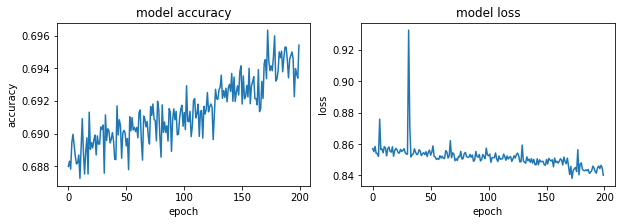

#### Adagram - 1.5


```python
optimizer= tf.keras.optimizers.Adagrad(learning_rate=1.5)
model.compile(optimizer=optimizer,
              loss='sparse_categorical_crossentropy',
              metrics=['accuracy'])
#history = model.fit(X, Y, validation_split=0.33, epochs=150, batch_size=10, verbose=0)
history = model.fit(x_train, y_train, epochs=200)
model.evaluate(x_test,  y_test, verbose=2)
```

    Epoch 1/200
    1875/1875 [==============================] - 2s 1ms/step - loss: 0.8462 - accuracy: 0.6940
    Epoch 2/200
    1875/1875 [==============================] - 2s 958us/step - loss: 0.8473 - accuracy: 0.6926
    Epoch 3/200
    1875/1875 [==============================] - 2s 996us/step - loss: 0.8460 - accuracy: 0.6927
    Epoch 4/200
    1875/1875 [==============================] - 2s 1ms/step - loss: 0.8447 - accuracy: 0.6933
    Epoch 5/200
    1875/1875 [==============================] - 2s 982us/step - loss: 0.8409 - accuracy: 0.6941
    Epoch 6/200
    1875/1875 [==============================] - 2s 937us/step - loss: 0.8485 - accuracy: 0.6915
    Epoch 7/200
    1875/1875 [==============================] - 2s 1ms/step - loss: 0.8464 - accuracy: 0.6922
    Epoch 8/200
    1875/1875 [==============================] - 2s 947us/step - loss: 0.8467 - accuracy: 0.6917
    Epoch 9/200
    1875/1875 [==============================] - 2s 908us/step - loss: 0.8427 - accuracy: 0.6930
    Epoch 10/200
    1875/1875 [==============================] - 2s 1ms/step - loss: 0.8441 - accuracy: 0.6931
    Epoch 11/200
    1875/1875 [==============================] - 2s 925us/step - loss: 0.8421 - accuracy: 0.6946
    Epoch 12/200
    1875/1875 [==============================] - 2s 963us/step - loss: 0.8447 - accuracy: 0.6932
    Epoch 13/200
    1875/1875 [==============================] - 2s 909us/step - loss: 0.8457 - accuracy: 0.6931
    Epoch 14/200
    1875/1875 [==============================] - 2s 986us/step - loss: 0.8456 - accuracy: 0.6930
    Epoch 15/200
    1875/1875 [==============================] - 2s 1ms/step - loss: 0.8447 - accuracy: 0.6946
    Epoch 16/200
    1875/1875 [==============================] - 2s 964us/step - loss: 0.8447 - accuracy: 0.6935
    Epoch 17/200
    1875/1875 [==============================] - 2s 906us/step - loss: 0.8460 - accuracy: 0.6922
    Epoch 18/200
    1875/1875 [==============================] - 2s 906us/step - loss: 0.8917 - accuracy: 0.6937
    Epoch 19/200
    1875/1875 [==============================] - 2s 948us/step - loss: 0.8449 - accuracy: 0.6933
    Epoch 20/200
    1875/1875 [==============================] - 2s 920us/step - loss: 0.9247 - accuracy: 0.6921
    Epoch 21/200
    1875/1875 [==============================] - 2s 1ms/step - loss: 0.8486 - accuracy: 0.6922
    Epoch 22/200
    1875/1875 [==============================] - 2s 901us/step - loss: 0.8479 - accuracy: 0.6910
    Epoch 23/200
    1875/1875 [==============================] - 2s 954us/step - loss: 0.8443 - accuracy: 0.6924
    Epoch 24/200
    1875/1875 [==============================] - 2s 929us/step - loss: 0.8435 - accuracy: 0.6952
    Epoch 25/200
    1875/1875 [==============================] - 2s 966us/step - loss: 0.8487 - accuracy: 0.6910
    Epoch 26/200
    1875/1875 [==============================] - 2s 991us/step - loss: 0.8464 - accuracy: 0.6920
    Epoch 27/200
    1875/1875 [==============================] - 2s 1ms/step - loss: 0.8484 - accuracy: 0.6920
    Epoch 28/200
    1875/1875 [==============================] - 2s 921us/step - loss: 0.8482 - accuracy: 0.6927
    Epoch 29/200
    1875/1875 [==============================] - 2s 908us/step - loss: 0.8453 - accuracy: 0.6939
    Epoch 30/200
    1875/1875 [==============================] - 2s 969us/step - loss: 0.8508 - accuracy: 0.6915
    Epoch 31/200
    1875/1875 [==============================] - 2s 922us/step - loss: 0.8486 - accuracy: 0.6914
    Epoch 32/200
    1875/1875 [==============================] - 2s 1ms/step - loss: 0.8479 - accuracy: 0.6900
    Epoch 33/200
    1875/1875 [==============================] - 2s 959us/step - loss: 0.8459 - accuracy: 0.6926
    Epoch 34/200
    1875/1875 [==============================] - 2s 989us/step - loss: 0.8484 - accuracy: 0.6923
    Epoch 35/200
    1875/1875 [==============================] - 2s 935us/step - loss: 0.8500 - accuracy: 0.6914
    Epoch 36/200
    1875/1875 [==============================] - 2s 969us/step - loss: 0.8455 - accuracy: 0.6923
    Epoch 37/200
    1875/1875 [==============================] - 2s 927us/step - loss: 0.8466 - accuracy: 0.6916
    Epoch 38/200
    1875/1875 [==============================] - 2s 1ms/step - loss: 0.8490 - accuracy: 0.6915
    Epoch 39/200
    1875/1875 [==============================] - 2s 928us/step - loss: 0.8485 - accuracy: 0.6903
    Epoch 40/200
    1875/1875 [==============================] - 2s 979us/step - loss: 0.8468 - accuracy: 0.6927
    Epoch 41/200
    1875/1875 [==============================] - 2s 962us/step - loss: 0.8459 - accuracy: 0.6924
    Epoch 42/200
    1875/1875 [==============================] - 2s 942us/step - loss: 0.8414 - accuracy: 0.6957
    Epoch 43/200
    1875/1875 [==============================] - 2s 1ms/step - loss: 0.8485 - accuracy: 0.6923
    Epoch 44/200
    1875/1875 [==============================] - 2s 942us/step - loss: 0.8453 - accuracy: 0.6931
    Epoch 45/200
    1875/1875 [==============================] - 2s 969us/step - loss: 0.8441 - accuracy: 0.6927
    Epoch 46/200
    1875/1875 [==============================] - 2s 925us/step - loss: 0.8436 - accuracy: 0.6933
    Epoch 47/200
    1875/1875 [==============================] - 2s 961us/step - loss: 0.8399 - accuracy: 0.6949
    Epoch 48/200
    1875/1875 [==============================] - 2s 921us/step - loss: 0.8447 - accuracy: 0.6930
    Epoch 49/200
    1875/1875 [==============================] - 2s 1ms/step - loss: 0.8825 - accuracy: 0.6935
    Epoch 50/200
    1875/1875 [==============================] - 2s 940us/step - loss: 0.8458 - accuracy: 0.6924
    Epoch 51/200
    1875/1875 [==============================] - 2s 1ms/step - loss: 0.8466 - accuracy: 0.6925
    Epoch 52/200
    1875/1875 [==============================] - 2s 937us/step - loss: 0.8406 - accuracy: 0.6946
    Epoch 53/200
    1875/1875 [==============================] - 2s 914us/step - loss: 0.8462 - accuracy: 0.6933
    Epoch 54/200
    1875/1875 [==============================] - 2s 930us/step - loss: 0.8464 - accuracy: 0.6921
    Epoch 55/200
    1875/1875 [==============================] - 2s 1ms/step - loss: 0.8436 - accuracy: 0.6926
    Epoch 56/200
    1875/1875 [==============================] - 2s 931us/step - loss: 0.8430 - accuracy: 0.6931
    Epoch 57/200
    1875/1875 [==============================] - 2s 891us/step - loss: 0.8459 - accuracy: 0.6912
    Epoch 58/200
    1875/1875 [==============================] - 2s 941us/step - loss: 0.8454 - accuracy: 0.6938
    Epoch 59/200
    1875/1875 [==============================] - 2s 901us/step - loss: 0.8446 - accuracy: 0.69350s - loss: 0.8448 - ac
    Epoch 60/200
    1875/1875 [==============================] - 2s 1ms/step - loss: 0.8456 - accuracy: 0.6920
    Epoch 61/200
    1875/1875 [==============================] - 2s 961us/step - loss: 0.8448 - accuracy: 0.6931
    Epoch 62/200
    1875/1875 [==============================] - 2s 913us/step - loss: 0.8416 - accuracy: 0.6943
    Epoch 63/200
    1875/1875 [==============================] - 2s 954us/step - loss: 0.8458 - accuracy: 0.6914
    Epoch 64/200
    1875/1875 [==============================] - 2s 915us/step - loss: 0.8495 - accuracy: 0.6919
    Epoch 65/200
    1875/1875 [==============================] - 2s 943us/step - loss: 0.8426 - accuracy: 0.6939
    Epoch 66/200
    1875/1875 [==============================] - 2s 1ms/step - loss: 0.8485 - accuracy: 0.6916
    Epoch 67/200
    1875/1875 [==============================] - 2s 929us/step - loss: 0.8441 - accuracy: 0.6927
    Epoch 68/200
    1875/1875 [==============================] - 2s 896us/step - loss: 0.8446 - accuracy: 0.6934
    Epoch 69/200
    1875/1875 [==============================] - 2s 957us/step - loss: 0.8402 - accuracy: 0.6948
    Epoch 70/200
    1875/1875 [==============================] - 2s 914us/step - loss: 0.8457 - accuracy: 0.6931
    Epoch 71/200
    1875/1875 [==============================] - 2s 911us/step - loss: 0.8433 - accuracy: 0.6930
    Epoch 72/200
    1875/1875 [==============================] - 2s 1ms/step - loss: 0.8401 - accuracy: 0.6961
    Epoch 73/200
    1875/1875 [==============================] - 2s 930us/step - loss: 0.8420 - accuracy: 0.6940
    Epoch 74/200
    1875/1875 [==============================] - 2s 965us/step - loss: 0.8409 - accuracy: 0.6943
    Epoch 75/200
    1875/1875 [==============================] - 2s 934us/step - loss: 0.8397 - accuracy: 0.6957
    Epoch 76/200
    1875/1875 [==============================] - 2s 1ms/step - loss: 0.8422 - accuracy: 0.6937
    Epoch 77/200
    1875/1875 [==============================] - 2s 980us/step - loss: 0.8370 - accuracy: 0.6966
    Epoch 78/200
    1875/1875 [==============================] - 2s 1ms/step - loss: 0.8390 - accuracy: 0.6955
    Epoch 79/200
    1875/1875 [==============================] - 2s 916us/step - loss: 0.8435 - accuracy: 0.6943
    Epoch 80/200
    1875/1875 [==============================] - 2s 992us/step - loss: 0.8382 - accuracy: 0.6957
    Epoch 81/200
    1875/1875 [==============================] - 2s 913us/step - loss: 0.8416 - accuracy: 0.6941
    Epoch 82/200
    1875/1875 [==============================] - 2s 940us/step - loss: 0.8442 - accuracy: 0.6937
    Epoch 83/200
    1875/1875 [==============================] - 2s 1ms/step - loss: 0.8438 - accuracy: 0.6934
    Epoch 84/200
    1875/1875 [==============================] - 2s 902us/step - loss: 0.8397 - accuracy: 0.6937
    Epoch 85/200
    1875/1875 [==============================] - 2s 980us/step - loss: 0.8407 - accuracy: 0.6942
    Epoch 86/200
    1875/1875 [==============================] - 2s 909us/step - loss: 0.8384 - accuracy: 0.6944
    Epoch 87/200
    1875/1875 [==============================] - 2s 972us/step - loss: 0.8397 - accuracy: 0.6950
    Epoch 88/200
    1875/1875 [==============================] - 2s 903us/step - loss: 0.8412 - accuracy: 0.6938
    Epoch 89/200
    1875/1875 [==============================] - 2s 1ms/step - loss: 0.8426 - accuracy: 0.6936
    Epoch 90/200
    1875/1875 [==============================] - 2s 927us/step - loss: 0.8455 - accuracy: 0.6923
    Epoch 91/200
    1875/1875 [==============================] - 2s 996us/step - loss: 0.8454 - accuracy: 0.6915
    Epoch 92/200
    1875/1875 [==============================] - 2s 927us/step - loss: 0.8392 - accuracy: 0.6957
    Epoch 93/200
    1875/1875 [==============================] - 2s 954us/step - loss: 0.8436 - accuracy: 0.6938
    Epoch 94/200
    1875/1875 [==============================] - 2s 982us/step - loss: 0.8428 - accuracy: 0.6939
    Epoch 95/200
    1875/1875 [==============================] - 2s 906us/step - loss: 0.8411 - accuracy: 0.6947
    Epoch 96/200
    1875/1875 [==============================] - 2s 954us/step - loss: 0.8421 - accuracy: 0.6936
    Epoch 97/200
    1875/1875 [==============================] - 2s 917us/step - loss: 0.8398 - accuracy: 0.6939
    Epoch 98/200
    1875/1875 [==============================] - 2s 959us/step - loss: 0.8388 - accuracy: 0.6949
    Epoch 99/200
    1875/1875 [==============================] - 2s 926us/step - loss: 0.8400 - accuracy: 0.6958
    Epoch 100/200
    1875/1875 [==============================] - 2s 1ms/step - loss: 0.8416 - accuracy: 0.6941
    Epoch 101/200
    1875/1875 [==============================] - 2s 930us/step - loss: 0.8401 - accuracy: 0.6949
    Epoch 102/200
    1875/1875 [==============================] - 2s 980us/step - loss: 0.8424 - accuracy: 0.6941
    Epoch 103/200
    1875/1875 [==============================] - 2s 932us/step - loss: 0.8400 - accuracy: 0.6953
    Epoch 104/200
    1875/1875 [==============================] - 2s 928us/step - loss: 0.8394 - accuracy: 0.6945
    Epoch 105/200
    1875/1875 [==============================] - 2s 948us/step - loss: 0.8394 - accuracy: 0.6959
    Epoch 106/200
    1875/1875 [==============================] - 2s 1ms/step - loss: 0.8434 - accuracy: 0.6937
    Epoch 107/200
    1875/1875 [==============================] - 2s 951us/step - loss: 0.8433 - accuracy: 0.6948
    Epoch 108/200
    1875/1875 [==============================] - 2s 930us/step - loss: 0.8440 - accuracy: 0.6933
    Epoch 109/200
    1875/1875 [==============================] - 2s 930us/step - loss: 0.8424 - accuracy: 0.6942
    Epoch 110/200
    1875/1875 [==============================] - 2s 891us/step - loss: 0.8382 - accuracy: 0.6952
    Epoch 111/200
    1875/1875 [==============================] - 2s 1ms/step - loss: 0.8395 - accuracy: 0.6953
    Epoch 112/200
    1875/1875 [==============================] - 2s 1ms/step - loss: 0.8426 - accuracy: 0.6939
    Epoch 113/200
    1875/1875 [==============================] - 2s 951us/step - loss: 0.8444 - accuracy: 0.6923
    Epoch 114/200
    1875/1875 [==============================] - 2s 898us/step - loss: 0.8474 - accuracy: 0.6938
    Epoch 115/200
    1875/1875 [==============================] - 2s 903us/step - loss: 0.8475 - accuracy: 0.6913
    Epoch 116/200
    1875/1875 [==============================] - 2s 947us/step - loss: 0.8419 - accuracy: 0.6938
    Epoch 117/200
    1875/1875 [==============================] - 2s 1ms/step - loss: 0.8449 - accuracy: 0.6938
    Epoch 118/200
    1875/1875 [==============================] - 2s 969us/step - loss: 0.8374 - accuracy: 0.6957
    Epoch 119/200
    1875/1875 [==============================] - 2s 909us/step - loss: 0.8459 - accuracy: 0.6930
    Epoch 120/200
    1875/1875 [==============================] - 2s 953us/step - loss: 0.8420 - accuracy: 0.6934
    Epoch 121/200
    1875/1875 [==============================] - 2s 887us/step - loss: 0.8447 - accuracy: 0.6929
    Epoch 122/200
    1875/1875 [==============================] - 2s 960us/step - loss: 0.8420 - accuracy: 0.6938
    Epoch 123/200
    1875/1875 [==============================] - 2s 1ms/step - loss: 0.8424 - accuracy: 0.6931
    Epoch 124/200
    1875/1875 [==============================] - 2s 937us/step - loss: 0.8437 - accuracy: 0.6933
    Epoch 125/200
    1875/1875 [==============================] - 2s 953us/step - loss: 0.8438 - accuracy: 0.6933
    Epoch 126/200
    1875/1875 [==============================] - 2s 910us/step - loss: 0.8445 - accuracy: 0.6927
    Epoch 127/200
    1875/1875 [==============================] - 2s 949us/step - loss: 0.8433 - accuracy: 0.6932
    Epoch 128/200
    1875/1875 [==============================] - 2s 985us/step - loss: 0.8450 - accuracy: 0.6931
    Epoch 129/200
    1875/1875 [==============================] - 2s 1ms/step - loss: 0.8436 - accuracy: 0.6930
    Epoch 130/200
    1875/1875 [==============================] - 2s 914us/step - loss: 0.8416 - accuracy: 0.6939
    Epoch 131/200
    1875/1875 [==============================] - 2s 954us/step - loss: 0.8411 - accuracy: 0.6945
    Epoch 132/200
    1875/1875 [==============================] - 2s 926us/step - loss: 0.8415 - accuracy: 0.6939
    Epoch 133/200
    1875/1875 [==============================] - 2s 954us/step - loss: 0.8451 - accuracy: 0.6937
    Epoch 134/200
    1875/1875 [==============================] - 2s 1ms/step - loss: 0.8400 - accuracy: 0.6949
    Epoch 135/200
    1875/1875 [==============================] - 2s 911us/step - loss: 0.8386 - accuracy: 0.6956
    Epoch 136/200
    1875/1875 [==============================] - 2s 920us/step - loss: 0.8438 - accuracy: 0.6940
    Epoch 137/200
    1875/1875 [==============================] - 2s 922us/step - loss: 0.8411 - accuracy: 0.6947
    Epoch 138/200
    1875/1875 [==============================] - 2s 948us/step - loss: 0.8416 - accuracy: 0.6945
    Epoch 139/200
    1875/1875 [==============================] - 2s 930us/step - loss: 0.8429 - accuracy: 0.6944
    Epoch 140/200
    1875/1875 [==============================] - 2s 1ms/step - loss: 0.8380 - accuracy: 0.6959
    Epoch 141/200
    1875/1875 [==============================] - 2s 902us/step - loss: 0.8429 - accuracy: 0.6943
    Epoch 142/200
    1875/1875 [==============================] - 2s 963us/step - loss: 0.8434 - accuracy: 0.6945
    Epoch 143/200
    1875/1875 [==============================] - 2s 910us/step - loss: 0.8444 - accuracy: 0.6931
    Epoch 144/200
    1875/1875 [==============================] - 2s 920us/step - loss: 0.8415 - accuracy: 0.6952
    Epoch 145/200
    1875/1875 [==============================] - 2s 929us/step - loss: 0.8408 - accuracy: 0.6936
    Epoch 146/200
    1875/1875 [==============================] - 2s 1ms/step - loss: 0.8413 - accuracy: 0.6944
    Epoch 147/200
    1875/1875 [==============================] - 2s 953us/step - loss: 0.8393 - accuracy: 0.6949
    Epoch 148/200
    1875/1875 [==============================] - 2s 914us/step - loss: 0.8468 - accuracy: 0.6927
    Epoch 149/200
    1875/1875 [==============================] - 2s 946us/step - loss: 0.8395 - accuracy: 0.6948
    Epoch 150/200
    1875/1875 [==============================] - 2s 919us/step - loss: 0.8393 - accuracy: 0.6935
    Epoch 151/200
    1875/1875 [==============================] - 2s 1ms/step - loss: 0.8392 - accuracy: 0.6948
    Epoch 152/200
    1875/1875 [==============================] - 2s 911us/step - loss: 0.8396 - accuracy: 0.6953
    Epoch 153/200
    1875/1875 [==============================] - 2s 905us/step - loss: 0.8483 - accuracy: 0.6921
    Epoch 154/200
    1875/1875 [==============================] - 2s 930us/step - loss: 0.8435 - accuracy: 0.6939
    Epoch 155/200
    1875/1875 [==============================] - 2s 893us/step - loss: 0.8401 - accuracy: 0.6955
    Epoch 156/200
    1875/1875 [==============================] - 2s 921us/step - loss: 0.8467 - accuracy: 0.6929
    Epoch 157/200
    1875/1875 [==============================] - 2s 1ms/step - loss: 0.8409 - accuracy: 0.6950
    Epoch 158/200
    1875/1875 [==============================] - 2s 1ms/step - loss: 0.8439 - accuracy: 0.6932
    Epoch 159/200
    1875/1875 [==============================] - 2s 921us/step - loss: 0.8440 - accuracy: 0.6928
    Epoch 160/200
    1875/1875 [==============================] - 2s 968us/step - loss: 0.8452 - accuracy: 0.6940
    Epoch 161/200
    1875/1875 [==============================] - 2s 931us/step - loss: 0.8386 - accuracy: 0.6956
    Epoch 162/200
    1875/1875 [==============================] - 2s 961us/step - loss: 0.8437 - accuracy: 0.6942
    Epoch 163/200
    1875/1875 [==============================] - 2s 1ms/step - loss: 0.8350 - accuracy: 0.6972
    Epoch 164/200
    1875/1875 [==============================] - 2s 957us/step - loss: 0.8462 - accuracy: 0.6926
    Epoch 165/200
    1875/1875 [==============================] - 2s 937us/step - loss: 0.8416 - accuracy: 0.6946
    Epoch 166/200
    1875/1875 [==============================] - 2s 911us/step - loss: 0.8394 - accuracy: 0.6965
    Epoch 167/200
    1875/1875 [==============================] - 2s 966us/step - loss: 0.8413 - accuracy: 0.6949
    Epoch 168/200
    1875/1875 [==============================] - 2s 1ms/step - loss: 0.8399 - accuracy: 0.6953
    Epoch 169/200
    1875/1875 [==============================] - 2s 951us/step - loss: 0.8404 - accuracy: 0.6946
    Epoch 170/200
    1875/1875 [==============================] - 2s 927us/step - loss: 0.8400 - accuracy: 0.6952
    Epoch 171/200
    1875/1875 [==============================] - 2s 1ms/step - loss: 0.8400 - accuracy: 0.6966
    Epoch 172/200
    1875/1875 [==============================] - 2s 929us/step - loss: 0.8400 - accuracy: 0.6949
    Epoch 173/200
    1875/1875 [==============================] - 2s 934us/step - loss: 0.8444 - accuracy: 0.6942
    Epoch 174/200
    1875/1875 [==============================] - 2s 1ms/step - loss: 0.8389 - accuracy: 0.6950
    Epoch 175/200
    1875/1875 [==============================] - 2s 930us/step - loss: 0.8423 - accuracy: 0.6945
    Epoch 176/200
    1875/1875 [==============================] - 2s 899us/step - loss: 0.8413 - accuracy: 0.6942
    Epoch 177/200
    1875/1875 [==============================] - 2s 917us/step - loss: 0.8385 - accuracy: 0.6950
    Epoch 178/200
    1875/1875 [==============================] - 2s 949us/step - loss: 0.8421 - accuracy: 0.6944
    Epoch 179/200
    1875/1875 [==============================] - 2s 900us/step - loss: 0.8394 - accuracy: 0.6948
    Epoch 180/200
    1875/1875 [==============================] - 2s 1ms/step - loss: 0.8402 - accuracy: 0.6945
    Epoch 181/200
    1875/1875 [==============================] - 2s 901us/step - loss: 0.8436 - accuracy: 0.6940
    Epoch 182/200
    1875/1875 [==============================] - 2s 952us/step - loss: 0.8401 - accuracy: 0.6943
    Epoch 183/200
    1875/1875 [==============================] - 2s 959us/step - loss: 0.8419 - accuracy: 0.6949
    Epoch 184/200
    1875/1875 [==============================] - 2s 966us/step - loss: 0.8395 - accuracy: 0.6959
    Epoch 185/200
    1875/1875 [==============================] - 2s 1ms/step - loss: 0.8418 - accuracy: 0.6944
    Epoch 186/200
    1875/1875 [==============================] - 2s 922us/step - loss: 0.8364 - accuracy: 0.6974
    Epoch 187/200
    1875/1875 [==============================] - 2s 934us/step - loss: 0.8408 - accuracy: 0.6949
    Epoch 188/200
    1875/1875 [==============================] - 2s 942us/step - loss: 0.8431 - accuracy: 0.6936
    Epoch 189/200
    1875/1875 [==============================] - 2s 963us/step - loss: 0.8400 - accuracy: 0.6942
    Epoch 190/200
    1875/1875 [==============================] - 2s 919us/step - loss: 0.8406 - accuracy: 0.6942
    Epoch 191/200
    1875/1875 [==============================] - 2s 1ms/step - loss: 0.8406 - accuracy: 0.6947
    Epoch 192/200
    1875/1875 [==============================] - 2s 932us/step - loss: 0.8416 - accuracy: 0.6938
    Epoch 193/200
    1875/1875 [==============================] - 2s 966us/step - loss: 0.8394 - accuracy: 0.6956
    Epoch 194/200
    1875/1875 [==============================] - 2s 921us/step - loss: 0.8424 - accuracy: 0.6936
    Epoch 195/200
    1875/1875 [==============================] - 2s 949us/step - loss: 0.8416 - accuracy: 0.6938
    Epoch 196/200
    1875/1875 [==============================] - 2s 909us/step - loss: 0.8404 - accuracy: 0.6950
    Epoch 197/200
    1875/1875 [==============================] - 2s 1ms/step - loss: 0.8413 - accuracy: 0.6942
    Epoch 198/200
    1875/1875 [==============================] - 2s 955us/step - loss: 0.8416 - accuracy: 0.6941
    Epoch 199/200
    1875/1875 [==============================] - 2s 917us/step - loss: 0.8418 - accuracy: 0.6937
    Epoch 200/200
    1875/1875 [==============================] - 2s 950us/step - loss: 0.8426 - accuracy: 0.6955
    313/313 - 0s - loss: 19.7042 - accuracy: 0.7252
    


    [19.704181671142578, 0.7251999974250793]


```python
fig, (ax1, ax2) = plt.subplots(1, 2, figsize=(10, 3))

#ax1.subplot(1, 2, 1)
ax1.plot(history.history['accuracy'])
#plt.plot(history.history['val_accuracy'])
ax1.set_title('model accuracy')
ax1.set_ylabel('accuracy')
ax1.set_xlabel('epoch')
#ax1.show()

#ax2.subplot(1, 2, 2)
ax2.plot(history.history['loss'])
#plt.plot(history.history['val_loss'])
ax2.set_title('model loss')
ax2.set_ylabel('loss')
ax2.set_xlabel('epoch')
```


#### AdDelta - 0.001


```python
optimizer= tf.keras.optimizers.Adadelta(learning_rate=0.001)
model.compile(optimizer=optimizer,
              loss='sparse_categorical_crossentropy',
              metrics=['accuracy'])
#history = model.fit(X, Y, validation_split=0.33, epochs=150, batch_size=10, verbose=0)
history = model.fit(x_train, y_train, epochs=200)
model.evaluate(x_test,  y_test, verbose=2)
```

    Epoch 1/200
    1875/1875 [==============================] - 2s 1ms/step - loss: 0.8409 - accuracy: 0.6928
    Epoch 2/200
    1875/1875 [==============================] - 2s 1ms/step - loss: 0.8450 - accuracy: 0.6916
    Epoch 3/200
    1875/1875 [==============================] - 2s 1ms/step - loss: 0.8417 - accuracy: 0.6921
    Epoch 4/200
    1875/1875 [==============================] - 2s 1ms/step - loss: 0.8433 - accuracy: 0.6914
    Epoch 5/200
    1875/1875 [==============================] - 2s 1ms/step - loss: 0.8405 - accuracy: 0.6925
    Epoch 6/200
    1875/1875 [==============================] - 2s 1ms/step - loss: 0.8400 - accuracy: 0.6928
    Epoch 7/200
    1875/1875 [==============================] - 2s 1ms/step - loss: 0.8392 - accuracy: 0.6927
    Epoch 8/200
    1875/1875 [==============================] - 2s 1ms/step - loss: 0.8404 - accuracy: 0.6924
    Epoch 9/200
    1875/1875 [==============================] - 2s 1ms/step - loss: 0.8391 - accuracy: 0.6933
    Epoch 10/200
    1875/1875 [==============================] - 2s 1ms/step - loss: 0.8389 - accuracy: 0.6932
    Epoch 11/200
    1875/1875 [==============================] - 2s 1ms/step - loss: 0.8426 - accuracy: 0.6917
    Epoch 12/200
    1875/1875 [==============================] - 2s 1ms/step - loss: 0.8425 - accuracy: 0.6917
    Epoch 13/200
    1875/1875 [==============================] - 2s 1ms/step - loss: 0.8406 - accuracy: 0.6925
    Epoch 14/200
    1875/1875 [==============================] - 2s 1ms/step - loss: 0.8453 - accuracy: 0.6909
    Epoch 15/200
    1875/1875 [==============================] - 2s 1ms/step - loss: 0.8405 - accuracy: 0.6926
    Epoch 16/200
    1875/1875 [==============================] - 2s 1ms/step - loss: 0.8419 - accuracy: 0.6920
    Epoch 17/200
    1875/1875 [==============================] - 2s 1ms/step - loss: 0.8384 - accuracy: 0.6930
    Epoch 18/200
    1875/1875 [==============================] - 2s 1ms/step - loss: 0.8442 - accuracy: 0.6912
    Epoch 19/200
    1875/1875 [==============================] - 2s 1ms/step - loss: 0.8462 - accuracy: 0.6906
    Epoch 20/200
    1875/1875 [==============================] - 2s 1ms/step - loss: 0.8417 - accuracy: 0.6920
    Epoch 21/200
    1875/1875 [==============================] - 2s 1ms/step - loss: 0.8395 - accuracy: 0.6931
    Epoch 22/200
    1875/1875 [==============================] - 2s 1ms/step - loss: 0.8434 - accuracy: 0.6915
    Epoch 23/200
    1875/1875 [==============================] - 2s 1ms/step - loss: 0.8435 - accuracy: 0.6916
    Epoch 24/200
    1875/1875 [==============================] - 2s 1ms/step - loss: 0.8414 - accuracy: 0.6921
    Epoch 25/200
    1875/1875 [==============================] - 2s 1ms/step - loss: 0.8402 - accuracy: 0.6927
    Epoch 26/200
    1875/1875 [==============================] - 2s 1ms/step - loss: 0.8428 - accuracy: 0.6919
    Epoch 27/200
    1875/1875 [==============================] - 2s 1ms/step - loss: 0.8373 - accuracy: 0.6938
    Epoch 28/200
    1875/1875 [==============================] - 2s 1ms/step - loss: 0.8409 - accuracy: 0.6924
    Epoch 29/200
    1875/1875 [==============================] - 2s 1ms/step - loss: 0.8385 - accuracy: 0.6934
    Epoch 30/200
    1875/1875 [==============================] - 2s 1ms/step - loss: 0.8424 - accuracy: 0.6918
    Epoch 31/200
    1875/1875 [==============================] - 2s 1ms/step - loss: 0.8433 - accuracy: 0.6915
    Epoch 32/200
    1875/1875 [==============================] - 2s 1ms/step - loss: 0.8390 - accuracy: 0.6930
    Epoch 33/200
    1875/1875 [==============================] - 2s 1ms/step - loss: 0.8402 - accuracy: 0.6926
    Epoch 34/200
    1875/1875 [==============================] - 2s 1ms/step - loss: 0.8445 - accuracy: 0.6908
    Epoch 35/200
    1875/1875 [==============================] - 2s 1ms/step - loss: 0.8619 - accuracy: 0.6912
    Epoch 36/200
    1875/1875 [==============================] - 2s 1ms/step - loss: 0.8430 - accuracy: 0.6917
    Epoch 37/200
    1875/1875 [==============================] - 2s 1ms/step - loss: 0.8458 - accuracy: 0.6907
    Epoch 38/200
    1875/1875 [==============================] - 2s 1ms/step - loss: 0.8416 - accuracy: 0.6924
    Epoch 39/200
    1875/1875 [==============================] - 2s 1ms/step - loss: 0.8383 - accuracy: 0.6932
    Epoch 40/200
    1875/1875 [==============================] - 2s 1ms/step - loss: 0.8379 - accuracy: 0.6937
    Epoch 41/200
    1875/1875 [==============================] - 2s 1ms/step - loss: 0.8391 - accuracy: 0.6932
    Epoch 42/200
    1875/1875 [==============================] - 2s 1ms/step - loss: 0.8392 - accuracy: 0.6930
    Epoch 43/200
    1875/1875 [==============================] - 2s 1ms/step - loss: 0.8395 - accuracy: 0.6930
    Epoch 44/200
    1875/1875 [==============================] - 2s 1ms/step - loss: 0.8448 - accuracy: 0.6912
    Epoch 45/200
    1875/1875 [==============================] - 2s 1ms/step - loss: 0.8454 - accuracy: 0.6907
    Epoch 46/200
    1875/1875 [==============================] - 2s 995us/step - loss: 0.8408 - accuracy: 0.6922
    Epoch 47/200
    1875/1875 [==============================] - 2s 1ms/step - loss: 0.8408 - accuracy: 0.6923
    Epoch 48/200
    1875/1875 [==============================] - 2s 997us/step - loss: 0.8440 - accuracy: 0.6916
    Epoch 49/200
    1875/1875 [==============================] - 2s 1ms/step - loss: 0.8388 - accuracy: 0.6933
    Epoch 50/200
    1875/1875 [==============================] - 2s 1ms/step - loss: 0.8412 - accuracy: 0.6924
    Epoch 51/200
    1875/1875 [==============================] - 2s 1ms/step - loss: 0.8427 - accuracy: 0.6920
    Epoch 52/200
    1875/1875 [==============================] - 2s 1ms/step - loss: 0.8412 - accuracy: 0.6925
    Epoch 53/200
    1875/1875 [==============================] - 2s 1ms/step - loss: 0.8808 - accuracy: 0.6929
    Epoch 54/200
    1875/1875 [==============================] - 2s 1ms/step - loss: 0.8394 - accuracy: 0.6930
    Epoch 55/200
    1875/1875 [==============================] - 2s 1ms/step - loss: 0.8422 - accuracy: 0.6923
    Epoch 56/200
    1875/1875 [==============================] - 2s 1ms/step - loss: 0.8411 - accuracy: 0.6923
    Epoch 57/200
    1875/1875 [==============================] - 2s 1ms/step - loss: 0.8397 - accuracy: 0.6928
    Epoch 58/200
    1875/1875 [==============================] - 2s 1ms/step - loss: 0.8421 - accuracy: 0.6921
    Epoch 59/200
    1875/1875 [==============================] - 2s 1ms/step - loss: 0.8401 - accuracy: 0.6927
    Epoch 60/200
    1875/1875 [==============================] - 2s 1ms/step - loss: 0.8420 - accuracy: 0.6922
    Epoch 61/200
    1875/1875 [==============================] - 2s 1ms/step - loss: 0.8426 - accuracy: 0.6915
    Epoch 62/200
    1875/1875 [==============================] - 2s 1ms/step - loss: 0.8441 - accuracy: 0.6913
    Epoch 63/200
    1875/1875 [==============================] - 2s 1ms/step - loss: 0.8440 - accuracy: 0.6912
    Epoch 64/200
    1875/1875 [==============================] - 2s 1ms/step - loss: 0.8404 - accuracy: 0.6929
    Epoch 65/200
    1875/1875 [==============================] - 2s 1ms/step - loss: 0.8396 - accuracy: 0.6929
    Epoch 66/200
    1875/1875 [==============================] - 2s 1ms/step - loss: 0.8406 - accuracy: 0.6928
    Epoch 67/200
    1875/1875 [==============================] - 2s 1ms/step - loss: 0.8412 - accuracy: 0.6923
    Epoch 68/200
    1875/1875 [==============================] - 2s 1ms/step - loss: 0.8412 - accuracy: 0.6922
    Epoch 69/200
    1875/1875 [==============================] - 2s 1ms/step - loss: 0.8395 - accuracy: 0.6930
    Epoch 70/200
    1875/1875 [==============================] - 2s 1ms/step - loss: 0.8386 - accuracy: 0.6933
    Epoch 71/200
    1875/1875 [==============================] - 2s 1ms/step - loss: 0.8432 - accuracy: 0.6914
    Epoch 72/200
    1875/1875 [==============================] - 2s 1ms/step - loss: 0.8432 - accuracy: 0.6916
    Epoch 73/200
    1875/1875 [==============================] - 2s 1ms/step - loss: 0.8395 - accuracy: 0.6930
    Epoch 74/200
    1875/1875 [==============================] - 2s 1ms/step - loss: 0.8395 - accuracy: 0.6930
    Epoch 75/200
    1875/1875 [==============================] - 2s 1ms/step - loss: 0.8414 - accuracy: 0.6925
    Epoch 76/200
    1875/1875 [==============================] - 2s 985us/step - loss: 0.8441 - accuracy: 0.6913
    Epoch 77/200
    1875/1875 [==============================] - 2s 1ms/step - loss: 0.8410 - accuracy: 0.6926
    Epoch 78/200
    1875/1875 [==============================] - 2s 1ms/step - loss: 0.8420 - accuracy: 0.6922
    Epoch 79/200
    1875/1875 [==============================] - 2s 1ms/step - loss: 0.8396 - accuracy: 0.6929
    Epoch 80/200
    1875/1875 [==============================] - 2s 1ms/step - loss: 0.8437 - accuracy: 0.6912
    Epoch 81/200
    1875/1875 [==============================] - 2s 1ms/step - loss: 0.8388 - accuracy: 0.6933
    Epoch 82/200
    1875/1875 [==============================] - 2s 992us/step - loss: 0.8834 - accuracy: 0.6916
    Epoch 83/200
    1875/1875 [==============================] - 2s 1ms/step - loss: 0.8394 - accuracy: 0.6929
    Epoch 84/200
    1875/1875 [==============================] - 2s 1000us/step - loss: 0.8419 - accuracy: 0.6921
    Epoch 85/200
    1875/1875 [==============================] - 2s 1ms/step - loss: 0.8393 - accuracy: 0.6931
    Epoch 86/200
    1875/1875 [==============================] - 2s 1ms/step - loss: 0.8459 - accuracy: 0.6902
    Epoch 87/200
    1875/1875 [==============================] - 2s 1ms/step - loss: 0.8410 - accuracy: 0.6924
    Epoch 88/200
    1875/1875 [==============================] - 2s 1ms/step - loss: 0.8411 - accuracy: 0.6924
    Epoch 89/200
    1875/1875 [==============================] - 2s 1ms/step - loss: 0.8406 - accuracy: 0.6926
    Epoch 90/200
    1875/1875 [==============================] - 2s 1ms/step - loss: 0.8408 - accuracy: 0.6925
    Epoch 91/200
    1875/1875 [==============================] - 2s 1ms/step - loss: 0.8418 - accuracy: 0.6921
    Epoch 92/200
    1875/1875 [==============================] - 2s 1ms/step - loss: 0.8392 - accuracy: 0.6928
    Epoch 93/200
    1875/1875 [==============================] - 2s 1ms/step - loss: 0.8428 - accuracy: 0.6918
    Epoch 94/200
    1875/1875 [==============================] - 2s 1ms/step - loss: 0.8405 - accuracy: 0.6923
    Epoch 95/200
    1875/1875 [==============================] - 2s 1ms/step - loss: 0.8405 - accuracy: 0.6926
    Epoch 96/200
    1875/1875 [==============================] - 2s 1ms/step - loss: 0.8401 - accuracy: 0.6927
    Epoch 97/200
    1875/1875 [==============================] - 2s 1ms/step - loss: 0.8417 - accuracy: 0.6921
    Epoch 98/200
    1875/1875 [==============================] - 2s 1ms/step - loss: 0.8406 - accuracy: 0.6921
    Epoch 99/200
    1875/1875 [==============================] - 2s 1ms/step - loss: 0.8439 - accuracy: 0.6916
    Epoch 100/200
    1875/1875 [==============================] - 2s 1ms/step - loss: 0.8445 - accuracy: 0.6913
    Epoch 101/200
    1875/1875 [==============================] - 2s 1ms/step - loss: 0.8391 - accuracy: 0.6932
    Epoch 102/200
    1875/1875 [==============================] - 2s 1ms/step - loss: 0.8409 - accuracy: 0.6923
    Epoch 103/200
    1875/1875 [==============================] - 2s 1ms/step - loss: 0.8423 - accuracy: 0.6920
    Epoch 104/200
    1875/1875 [==============================] - 2s 1ms/step - loss: 0.8384 - accuracy: 0.6932
    Epoch 105/200
    1875/1875 [==============================] - 2s 1ms/step - loss: 0.8402 - accuracy: 0.6926
    Epoch 106/200
    1875/1875 [==============================] - 2s 993us/step - loss: 0.8440 - accuracy: 0.6920
    Epoch 107/200
    1875/1875 [==============================] - 2s 1ms/step - loss: 0.8408 - accuracy: 0.6924
    Epoch 108/200
    1875/1875 [==============================] - 2s 1ms/step - loss: 0.8411 - accuracy: 0.6925
    Epoch 109/200
    1875/1875 [==============================] - 2s 1ms/step - loss: 0.8385 - accuracy: 0.6934
    Epoch 110/200
    1875/1875 [==============================] - 2s 1ms/step - loss: 0.8411 - accuracy: 0.6926
    Epoch 111/200
    1875/1875 [==============================] - 2s 1ms/step - loss: 0.8417 - accuracy: 0.6922
    Epoch 112/200
    1875/1875 [==============================] - 2s 1ms/step - loss: 0.8410 - accuracy: 0.6922
    Epoch 113/200
    1875/1875 [==============================] - 2s 1ms/step - loss: 0.8439 - accuracy: 0.6914
    Epoch 114/200
    1875/1875 [==============================] - 2s 1ms/step - loss: 0.8409 - accuracy: 0.6925
    Epoch 115/200
    1875/1875 [==============================] - 2s 1ms/step - loss: 0.8429 - accuracy: 0.6916
    Epoch 116/200
    1875/1875 [==============================] - 2s 1ms/step - loss: 0.8377 - accuracy: 0.6935
    Epoch 117/200
    1875/1875 [==============================] - 2s 1ms/step - loss: 0.8447 - accuracy: 0.6913
    Epoch 118/200
    1875/1875 [==============================] - 2s 1ms/step - loss: 0.8399 - accuracy: 0.6927
    Epoch 119/200
    1875/1875 [==============================] - 2s 1ms/step - loss: 0.8412 - accuracy: 0.6926
    Epoch 120/200
    1875/1875 [==============================] - 2s 991us/step - loss: 0.8425 - accuracy: 0.6916
    Epoch 121/200
    1875/1875 [==============================] - 2s 1ms/step - loss: 0.8387 - accuracy: 0.6932
    Epoch 122/200
    1875/1875 [==============================] - 2s 1ms/step - loss: 0.8405 - accuracy: 0.6927
    Epoch 123/200
    1875/1875 [==============================] - 2s 1ms/step - loss: 0.8434 - accuracy: 0.6914
    Epoch 124/200
    1875/1875 [==============================] - 2s 1ms/step - loss: 0.8396 - accuracy: 0.6929
    Epoch 125/200
    1875/1875 [==============================] - 2s 1ms/step - loss: 0.8407 - accuracy: 0.6927
    Epoch 126/200
    1875/1875 [==============================] - 2s 1ms/step - loss: 0.8413 - accuracy: 0.6922
    Epoch 127/200
    1875/1875 [==============================] - 2s 1ms/step - loss: 0.8416 - accuracy: 0.6923
    Epoch 128/200
    1875/1875 [==============================] - 2s 1ms/step - loss: 0.8427 - accuracy: 0.6920
    Epoch 129/200
    1875/1875 [==============================] - 2s 1ms/step - loss: 0.8427 - accuracy: 0.6917
    Epoch 130/200
    1875/1875 [==============================] - 2s 1ms/step - loss: 0.8476 - accuracy: 0.6900
    Epoch 131/200
    1875/1875 [==============================] - 2s 1ms/step - loss: 0.8430 - accuracy: 0.6917
    Epoch 132/200
    1875/1875 [==============================] - 2s 1ms/step - loss: 0.8393 - accuracy: 0.6931
    Epoch 133/200
    1875/1875 [==============================] - 2s 1ms/step - loss: 0.8409 - accuracy: 0.6926
    Epoch 134/200
    1875/1875 [==============================] - 2s 1ms/step - loss: 0.8400 - accuracy: 0.6927
    Epoch 135/200
    1875/1875 [==============================] - 2s 1ms/step - loss: 0.8418 - accuracy: 0.6921
    Epoch 136/200
    1875/1875 [==============================] - 2s 1ms/step - loss: 0.8426 - accuracy: 0.6918
    Epoch 137/200
    1875/1875 [==============================] - 2s 1ms/step - loss: 0.8419 - accuracy: 0.6921
    Epoch 138/200
    1875/1875 [==============================] - 2s 1ms/step - loss: 0.8445 - accuracy: 0.6909
    Epoch 139/200
    1875/1875 [==============================] - 2s 1ms/step - loss: 0.8431 - accuracy: 0.6916
    Epoch 140/200
    1875/1875 [==============================] - 2s 999us/step - loss: 0.8425 - accuracy: 0.6918
    Epoch 141/200
    1875/1875 [==============================] - 2s 1ms/step - loss: 0.8371 - accuracy: 0.6939
    Epoch 142/200
    1875/1875 [==============================] - 2s 1ms/step - loss: 0.8382 - accuracy: 0.6935
    Epoch 143/200
    1875/1875 [==============================] - 2s 1ms/step - loss: 0.8417 - accuracy: 0.6920
    Epoch 144/200
    1875/1875 [==============================] - 2s 985us/step - loss: 0.8396 - accuracy: 0.6930
    Epoch 145/200
    1875/1875 [==============================] - 2s 1ms/step - loss: 0.8397 - accuracy: 0.6931
    Epoch 146/200
    1875/1875 [==============================] - 2s 999us/step - loss: 0.8398 - accuracy: 0.6928
    Epoch 147/200
    1875/1875 [==============================] - 2s 1ms/step - loss: 0.8430 - accuracy: 0.6918
    Epoch 148/200
    1875/1875 [==============================] - 2s 1ms/step - loss: 0.8410 - accuracy: 0.6925
    Epoch 149/200
    1875/1875 [==============================] - 2s 1ms/step - loss: 0.8421 - accuracy: 0.6921
    Epoch 150/200
    1875/1875 [==============================] - 2s 1ms/step - loss: 0.8413 - accuracy: 0.6926
    Epoch 151/200
    1875/1875 [==============================] - 2s 1ms/step - loss: 0.8410 - accuracy: 0.6924
    Epoch 152/200
    1875/1875 [==============================] - 2s 1ms/step - loss: 0.8399 - accuracy: 0.6930
    Epoch 153/200
    1875/1875 [==============================] - 2s 1ms/step - loss: 0.8392 - accuracy: 0.6931
    Epoch 154/200
    1875/1875 [==============================] - 2s 1ms/step - loss: 0.8410 - accuracy: 0.6923
    Epoch 155/200
    1875/1875 [==============================] - 2s 1ms/step - loss: 0.8428 - accuracy: 0.6918
    Epoch 156/200
    1875/1875 [==============================] - 2s 1ms/step - loss: 0.8739 - accuracy: 0.6917
    Epoch 157/200
    1875/1875 [==============================] - 2s 1ms/step - loss: 0.8447 - accuracy: 0.6911
    Epoch 158/200
    1875/1875 [==============================] - 2s 1ms/step - loss: 0.8407 - accuracy: 0.6926
    Epoch 159/200
    1875/1875 [==============================] - 2s 1ms/step - loss: 0.8438 - accuracy: 0.6916
    Epoch 160/200
    1875/1875 [==============================] - 2s 1ms/step - loss: 0.8424 - accuracy: 0.6920
    Epoch 161/200
    1875/1875 [==============================] - 2s 1ms/step - loss: 0.8400 - accuracy: 0.6930
    Epoch 162/200
    1875/1875 [==============================] - 2s 1ms/step - loss: 0.8427 - accuracy: 0.6919
    Epoch 163/200
    1875/1875 [==============================] - 2s 1ms/step - loss: 0.8408 - accuracy: 0.6927
    Epoch 164/200
    1875/1875 [==============================] - 2s 1ms/step - loss: 0.8419 - accuracy: 0.6920
    Epoch 165/200
    1875/1875 [==============================] - 2s 1ms/step - loss: 0.8406 - accuracy: 0.6928
    Epoch 166/200
    1875/1875 [==============================] - 2s 1ms/step - loss: 0.8410 - accuracy: 0.6926
    Epoch 167/200
    1875/1875 [==============================] - 2s 1ms/step - loss: 0.8396 - accuracy: 0.6931
    Epoch 168/200
    1875/1875 [==============================] - 2s 1ms/step - loss: 0.8391 - accuracy: 0.6930
    Epoch 169/200
    1875/1875 [==============================] - 2s 1ms/step - loss: 0.8393 - accuracy: 0.6929
    Epoch 170/200
    1875/1875 [==============================] - 3s 1ms/step - loss: 0.8363 - accuracy: 0.6941
    Epoch 171/200
    1875/1875 [==============================] - 2s 1ms/step - loss: 0.8393 - accuracy: 0.6928
    Epoch 172/200
    1875/1875 [==============================] - 2s 1ms/step - loss: 0.8378 - accuracy: 0.6937
    Epoch 173/200
    1875/1875 [==============================] - 2s 1ms/step - loss: 0.8404 - accuracy: 0.6928
    Epoch 174/200
    1875/1875 [==============================] - 2s 1ms/step - loss: 0.8409 - accuracy: 0.6923
    Epoch 175/200
    1875/1875 [==============================] - 2s 1ms/step - loss: 0.8406 - accuracy: 0.6927
    Epoch 176/200
    1875/1875 [==============================] - 2s 1ms/step - loss: 0.8408 - accuracy: 0.6926
    Epoch 177/200
    1875/1875 [==============================] - 2s 1ms/step - loss: 0.8446 - accuracy: 0.6911
    Epoch 178/200
    1875/1875 [==============================] - 2s 1ms/step - loss: 0.8450 - accuracy: 0.6912
    Epoch 179/200
    1875/1875 [==============================] - 2s 1ms/step - loss: 0.8420 - accuracy: 0.6921
    Epoch 180/200
    1875/1875 [==============================] - 2s 1ms/step - loss: 0.8392 - accuracy: 0.6930
    Epoch 181/200
    1875/1875 [==============================] - 2s 1ms/step - loss: 0.8425 - accuracy: 0.6917
    Epoch 182/200
    1875/1875 [==============================] - 2s 1ms/step - loss: 0.8411 - accuracy: 0.6924
    Epoch 183/200
    1875/1875 [==============================] - 2s 989us/step - loss: 0.8406 - accuracy: 0.6926
    Epoch 184/200
    1875/1875 [==============================] - 2s 1ms/step - loss: 0.8398 - accuracy: 0.6927
    Epoch 185/200
    1875/1875 [==============================] - 2s 1ms/step - loss: 0.8428 - accuracy: 0.6916
    Epoch 186/200
    1875/1875 [==============================] - 2s 1ms/step - loss: 0.8387 - accuracy: 0.6930
    Epoch 187/200
    1875/1875 [==============================] - 2s 1ms/step - loss: 0.8428 - accuracy: 0.6920
    Epoch 188/200
    1875/1875 [==============================] - 2s 1ms/step - loss: 0.8433 - accuracy: 0.6913
    Epoch 189/200
    1875/1875 [==============================] - 2s 1ms/step - loss: 0.8416 - accuracy: 0.6922
    Epoch 190/200
    1875/1875 [==============================] - 2s 1ms/step - loss: 0.8417 - accuracy: 0.6920
    Epoch 191/200
    1875/1875 [==============================] - 2s 1ms/step - loss: 0.8397 - accuracy: 0.6932
    Epoch 192/200
    1875/1875 [==============================] - 2s 1ms/step - loss: 0.8398 - accuracy: 0.6925
    Epoch 193/200
    1875/1875 [==============================] - 2s 1ms/step - loss: 0.8432 - accuracy: 0.6916
    Epoch 194/200
    1875/1875 [==============================] - 2s 1ms/step - loss: 0.8408 - accuracy: 0.6926
    Epoch 195/200
    1875/1875 [==============================] - 2s 1ms/step - loss: 0.8396 - accuracy: 0.6930
    Epoch 196/200
    1875/1875 [==============================] - 2s 1ms/step - loss: 0.8397 - accuracy: 0.6928
    Epoch 197/200
    1875/1875 [==============================] - 2s 1ms/step - loss: 0.8409 - accuracy: 0.6923
    Epoch 198/200
    1875/1875 [==============================] - 2s 1ms/step - loss: 0.8386 - accuracy: 0.6935
    Epoch 199/200
    1875/1875 [==============================] - 2s 1ms/step - loss: 0.8390 - accuracy: 0.6932
    Epoch 200/200
    1875/1875 [==============================] - 2s 1ms/step - loss: 0.8399 - accuracy: 0.6929
    313/313 - 0s - loss: 19.7042 - accuracy: 0.7252
    


    [19.70418357849121, 0.7251999974250793]


```python
fig, (ax1, ax2) = plt.subplots(1, 2, figsize=(10, 3))

#ax1.subplot(1, 2, 1)
ax1.plot(history.history['accuracy'])
#plt.plot(history.history['val_accuracy'])
ax1.set_title('model accuracy')
ax1.set_ylabel('accuracy')
ax1.set_xlabel('epoch')
#ax1.show()

#ax2.subplot(1, 2, 2)
ax2.plot(history.history['loss'])
#plt.plot(history.history['val_loss'])
ax2.set_title('model loss')
ax2.set_ylabel('loss')
ax2.set_xlabel('epoch')
```


#### AdDelta - 0.1


```python
optimizer= tf.keras.optimizers.Adadelta(learning_rate=0.1)
model.compile(optimizer=optimizer,
              loss='sparse_categorical_crossentropy',
              metrics=['accuracy'])
#history = model.fit(X, Y, validation_split=0.33, epochs=150, batch_size=10, verbose=0)
history = model.fit(x_train, y_train, epochs=200)
model.evaluate(x_test,  y_test, verbose=2)
```

    Epoch 1/200
    1875/1875 [==============================] - 2s 1ms/step - loss: 0.8421 - accuracy: 0.6920
    Epoch 2/200
    1875/1875 [==============================] - 2s 1ms/step - loss: 0.8421 - accuracy: 0.6918
    Epoch 3/200
    1875/1875 [==============================] - 2s 1ms/step - loss: 0.8421 - accuracy: 0.6918
    Epoch 4/200
    1875/1875 [==============================] - 2s 1ms/step - loss: 0.8373 - accuracy: 0.6938
    Epoch 5/200
    1875/1875 [==============================] - 2s 1ms/step - loss: 0.8395 - accuracy: 0.6931
    Epoch 6/200
    1875/1875 [==============================] - 2s 1ms/step - loss: 0.8423 - accuracy: 0.6922
    Epoch 7/200
    1875/1875 [==============================] - 2s 1ms/step - loss: 0.8380 - accuracy: 0.6934
    Epoch 8/200
    1875/1875 [==============================] - 2s 1ms/step - loss: 0.8445 - accuracy: 0.6913
    Epoch 9/200
    1875/1875 [==============================] - 2s 1ms/step - loss: 0.8417 - accuracy: 0.6919
    Epoch 10/200
    1875/1875 [==============================] - 2s 1ms/step - loss: 0.8409 - accuracy: 0.6924
    Epoch 11/200
    1875/1875 [==============================] - 2s 1ms/step - loss: 0.8394 - accuracy: 0.6929
    Epoch 12/200
    1875/1875 [==============================] - 2s 1ms/step - loss: 0.8382 - accuracy: 0.6933
    Epoch 13/200
    1875/1875 [==============================] - 2s 1ms/step - loss: 0.8414 - accuracy: 0.6923
    Epoch 14/200
    1875/1875 [==============================] - 2s 1ms/step - loss: 0.8423 - accuracy: 0.6923
    Epoch 15/200
    1875/1875 [==============================] - 2s 1ms/step - loss: 0.8402 - accuracy: 0.6927
    Epoch 16/200
    1875/1875 [==============================] - 2s 1ms/step - loss: 0.8422 - accuracy: 0.6921
    Epoch 17/200
    1875/1875 [==============================] - 2s 1ms/step - loss: 0.8429 - accuracy: 0.6917
    Epoch 18/200
    1875/1875 [==============================] - 2s 1ms/step - loss: 0.8407 - accuracy: 0.6928
    Epoch 19/200
    1875/1875 [==============================] - 2s 1ms/step - loss: 0.8416 - accuracy: 0.6923
    Epoch 20/200
    1875/1875 [==============================] - 2s 1ms/step - loss: 0.8409 - accuracy: 0.6922
    Epoch 21/200
    1875/1875 [==============================] - 2s 1ms/step - loss: 0.8393 - accuracy: 0.6932
    Epoch 22/200
    1875/1875 [==============================] - 2s 1ms/step - loss: 0.8414 - accuracy: 0.6924
    Epoch 23/200
    1875/1875 [==============================] - 2s 1ms/step - loss: 0.8373 - accuracy: 0.6940
    Epoch 24/200
    1875/1875 [==============================] - 2s 1ms/step - loss: 0.8436 - accuracy: 0.6914
    Epoch 25/200
    1875/1875 [==============================] - 2s 1ms/step - loss: 0.8402 - accuracy: 0.6925
    Epoch 26/200
    1875/1875 [==============================] - 2s 1ms/step - loss: 0.8435 - accuracy: 0.6916
    Epoch 27/200
    1875/1875 [==============================] - 2s 1ms/step - loss: 0.8438 - accuracy: 0.6919
    Epoch 28/200
    1875/1875 [==============================] - 2s 1ms/step - loss: 0.8385 - accuracy: 0.6936
    Epoch 29/200
    1875/1875 [==============================] - 2s 1ms/step - loss: 0.8385 - accuracy: 0.6934
    Epoch 30/200
    1875/1875 [==============================] - 2s 1ms/step - loss: 0.8393 - accuracy: 0.6929
    Epoch 31/200
    1875/1875 [==============================] - 2s 1ms/step - loss: 0.8393 - accuracy: 0.6931
    Epoch 32/200
    1875/1875 [==============================] - 2s 1ms/step - loss: 0.8405 - accuracy: 0.6926
    Epoch 33/200
    1875/1875 [==============================] - 2s 1ms/step - loss: 0.8400 - accuracy: 0.6927
    Epoch 34/200
    1875/1875 [==============================] - 2s 1ms/step - loss: 0.8389 - accuracy: 0.6935
    Epoch 35/200
    1875/1875 [==============================] - 2s 1ms/step - loss: 0.8410 - accuracy: 0.6925
    Epoch 36/200
    1875/1875 [==============================] - 2s 1ms/step - loss: 0.8427 - accuracy: 0.6917
    Epoch 37/200
    1875/1875 [==============================] - 2s 1ms/step - loss: 0.8412 - accuracy: 0.6922
    Epoch 38/200
    1875/1875 [==============================] - 2s 1ms/step - loss: 0.8426 - accuracy: 0.6919
    Epoch 39/200
    1875/1875 [==============================] - 2s 1ms/step - loss: 0.8442 - accuracy: 0.6913
    Epoch 40/200
    1875/1875 [==============================] - 2s 1ms/step - loss: 0.8442 - accuracy: 0.6911
    Epoch 41/200
    1875/1875 [==============================] - 2s 1ms/step - loss: 0.8403 - accuracy: 0.6925
    Epoch 42/200
    1875/1875 [==============================] - 2s 1ms/step - loss: 0.8419 - accuracy: 0.6921
    Epoch 43/200
    1875/1875 [==============================] - 2s 1ms/step - loss: 0.8428 - accuracy: 0.6915
    Epoch 44/200
    1875/1875 [==============================] - 2s 1ms/step - loss: 0.8407 - accuracy: 0.6925
    Epoch 45/200
    1875/1875 [==============================] - 2s 1ms/step - loss: 0.8414 - accuracy: 0.6923
    Epoch 46/200
    1875/1875 [==============================] - 2s 1ms/step - loss: 0.8421 - accuracy: 0.6920
    Epoch 47/200
    1875/1875 [==============================] - 2s 1ms/step - loss: 0.8416 - accuracy: 0.6922
    Epoch 48/200
    1875/1875 [==============================] - 2s 1ms/step - loss: 0.8407 - accuracy: 0.6925
    Epoch 49/200
    1875/1875 [==============================] - 2s 1ms/step - loss: 0.8406 - accuracy: 0.6926
    Epoch 50/200
    1875/1875 [==============================] - 2s 1ms/step - loss: 0.8384 - accuracy: 0.6935
    Epoch 51/200
    1875/1875 [==============================] - 2s 1ms/step - loss: 0.8414 - accuracy: 0.6922
    Epoch 52/200
    1875/1875 [==============================] - 2s 1ms/step - loss: 0.8410 - accuracy: 0.6926
    Epoch 53/200
    1875/1875 [==============================] - 2s 1ms/step - loss: 0.8409 - accuracy: 0.6923
    Epoch 54/200
    1875/1875 [==============================] - 2s 1ms/step - loss: 0.8556 - accuracy: 0.6934
    Epoch 55/200
    1875/1875 [==============================] - 2s 1ms/step - loss: 0.8417 - accuracy: 0.6921
    Epoch 56/200
    1875/1875 [==============================] - 2s 1ms/step - loss: 0.8406 - accuracy: 0.6925
    Epoch 57/200
    1875/1875 [==============================] - 2s 1ms/step - loss: 0.8422 - accuracy: 0.6920
    Epoch 58/200
    1875/1875 [==============================] - 2s 1ms/step - loss: 0.8418 - accuracy: 0.6922
    Epoch 59/200
    1875/1875 [==============================] - 2s 1ms/step - loss: 0.8403 - accuracy: 0.6926
    Epoch 60/200
    1875/1875 [==============================] - 2s 1ms/step - loss: 0.8430 - accuracy: 0.6915
    Epoch 61/200
    1875/1875 [==============================] - 2s 1ms/step - loss: 0.8447 - accuracy: 0.6911
    Epoch 62/200
    1875/1875 [==============================] - 2s 1ms/step - loss: 0.8414 - accuracy: 0.6924
    Epoch 63/200
    1875/1875 [==============================] - 2s 1ms/step - loss: 0.8398 - accuracy: 0.6928
    Epoch 64/200
    1875/1875 [==============================] - 2s 1ms/step - loss: 0.8398 - accuracy: 0.6928
    Epoch 65/200
    1875/1875 [==============================] - 2s 1ms/step - loss: 0.8367 - accuracy: 0.6941
    Epoch 66/200
    1875/1875 [==============================] - 2s 1ms/step - loss: 0.8400 - accuracy: 0.6928
    Epoch 67/200
    1875/1875 [==============================] - 2s 1ms/step - loss: 0.8422 - accuracy: 0.6917
    Epoch 68/200
    1875/1875 [==============================] - 2s 1ms/step - loss: 0.8427 - accuracy: 0.6916
    Epoch 69/200
    1875/1875 [==============================] - 2s 1ms/step - loss: 0.8434 - accuracy: 0.6916
    Epoch 70/200
    1875/1875 [==============================] - 2s 1ms/step - loss: 0.8404 - accuracy: 0.6925
    Epoch 71/200
    1875/1875 [==============================] - 2s 1ms/step - loss: 0.8430 - accuracy: 0.6919
    Epoch 72/200
    1875/1875 [==============================] - 2s 1ms/step - loss: 0.8442 - accuracy: 0.6912
    Epoch 73/200
    1875/1875 [==============================] - 2s 1ms/step - loss: 0.8430 - accuracy: 0.6918
    Epoch 74/200
    1875/1875 [==============================] - 2s 1ms/step - loss: 0.8415 - accuracy: 0.6921
    Epoch 75/200
    1875/1875 [==============================] - 2s 1ms/step - loss: 0.8434 - accuracy: 0.6915
    Epoch 76/200
    1875/1875 [==============================] - 2s 1ms/step - loss: 0.8403 - accuracy: 0.6927
    Epoch 77/200
    1875/1875 [==============================] - 2s 1ms/step - loss: 0.8392 - accuracy: 0.6930
    Epoch 78/200
    1875/1875 [==============================] - 2s 1ms/step - loss: 0.8451 - accuracy: 0.6907
    Epoch 79/200
    1875/1875 [==============================] - 2s 1ms/step - loss: 0.8446 - accuracy: 0.6917
    Epoch 80/200
    1875/1875 [==============================] - 2s 1ms/step - loss: 0.8386 - accuracy: 0.6933
    Epoch 81/200
    1875/1875 [==============================] - 2s 1ms/step - loss: 0.8398 - accuracy: 0.6930
    Epoch 82/200
    1875/1875 [==============================] - 2s 994us/step - loss: 0.8381 - accuracy: 0.6934
    Epoch 83/200
    1875/1875 [==============================] - 2s 1ms/step - loss: 0.8409 - accuracy: 0.6923
    Epoch 84/200
    1875/1875 [==============================] - 2s 1ms/step - loss: 0.8444 - accuracy: 0.6914
    Epoch 85/200
    1875/1875 [==============================] - 2s 1ms/step - loss: 0.8429 - accuracy: 0.6916
    Epoch 86/200
    1875/1875 [==============================] - 2s 990us/step - loss: 0.8388 - accuracy: 0.6932
    Epoch 87/200
    1875/1875 [==============================] - 2s 1ms/step - loss: 0.8421 - accuracy: 0.6922
    Epoch 88/200
    1875/1875 [==============================] - 2s 1ms/step - loss: 0.8419 - accuracy: 0.6921
    Epoch 89/200
    1875/1875 [==============================] - 2s 998us/step - loss: 0.8423 - accuracy: 0.6918
    Epoch 90/200
    1875/1875 [==============================] - 2s 1ms/step - loss: 0.8402 - accuracy: 0.6926
    Epoch 91/200
    1875/1875 [==============================] - 2s 1ms/step - loss: 0.8411 - accuracy: 0.6923
    Epoch 92/200
    1875/1875 [==============================] - 2s 1ms/step - loss: 0.8407 - accuracy: 0.6926
    Epoch 93/200
    1875/1875 [==============================] - 2s 993us/step - loss: 0.8421 - accuracy: 0.6920
    Epoch 94/200
    1875/1875 [==============================] - 2s 1ms/step - loss: 0.8388 - accuracy: 0.6933
    Epoch 95/200
    1875/1875 [==============================] - 2s 1ms/step - loss: 0.8420 - accuracy: 0.6922
    Epoch 96/200
    1875/1875 [==============================] - 2s 1ms/step - loss: 0.8388 - accuracy: 0.6931
    Epoch 97/200
    1875/1875 [==============================] - 2s 1ms/step - loss: 0.8402 - accuracy: 0.6925
    Epoch 98/200
    1875/1875 [==============================] - 2s 1ms/step - loss: 0.8437 - accuracy: 0.6915
    Epoch 99/200
    1875/1875 [==============================] - 2s 1ms/step - loss: 0.8406 - accuracy: 0.6928
    Epoch 100/200
    1875/1875 [==============================] - 2s 1ms/step - loss: 0.8408 - accuracy: 0.6924
    Epoch 101/200
    1875/1875 [==============================] - 2s 1ms/step - loss: 0.8456 - accuracy: 0.6906
    Epoch 102/200
    1875/1875 [==============================] - 2s 1ms/step - loss: 0.8416 - accuracy: 0.6923
    Epoch 103/200
    1875/1875 [==============================] - 2s 1ms/step - loss: 0.8383 - accuracy: 0.6933
    Epoch 104/200
    1875/1875 [==============================] - 2s 1ms/step - loss: 0.8409 - accuracy: 0.6926
    Epoch 105/200
    1875/1875 [==============================] - 2s 1ms/step - loss: 0.8394 - accuracy: 0.6930
    Epoch 106/200
    1875/1875 [==============================] - 2s 1ms/step - loss: 0.8417 - accuracy: 0.6923
    Epoch 107/200
    1875/1875 [==============================] - 2s 1ms/step - loss: 0.8440 - accuracy: 0.6913
    Epoch 108/200
    1875/1875 [==============================] - 2s 1ms/step - loss: 0.8409 - accuracy: 0.6923
    Epoch 109/200
    1875/1875 [==============================] - 2s 1ms/step - loss: 0.8401 - accuracy: 0.6928
    Epoch 110/200
    1875/1875 [==============================] - 2s 1ms/step - loss: 0.8413 - accuracy: 0.6923
    Epoch 111/200
    1875/1875 [==============================] - 2s 1ms/step - loss: 0.8420 - accuracy: 0.6922
    Epoch 112/200
    1875/1875 [==============================] - 2s 1ms/step - loss: 0.8435 - accuracy: 0.6914
    Epoch 113/200
    1875/1875 [==============================] - 2s 1ms/step - loss: 0.8423 - accuracy: 0.6921
    Epoch 114/200
    1875/1875 [==============================] - 2s 1ms/step - loss: 0.8409 - accuracy: 0.6924
    Epoch 115/200
    1875/1875 [==============================] - 2s 1ms/step - loss: 0.8417 - accuracy: 0.6922
    Epoch 116/200
    1875/1875 [==============================] - 2s 1ms/step - loss: 0.8421 - accuracy: 0.6918
    Epoch 117/200
    1875/1875 [==============================] - 2s 1ms/step - loss: 0.8418 - accuracy: 0.6921
    Epoch 118/200
    1875/1875 [==============================] - 2s 1ms/step - loss: 0.8419 - accuracy: 0.6921
    Epoch 119/200
    1875/1875 [==============================] - 2s 1ms/step - loss: 0.8372 - accuracy: 0.6938
    Epoch 120/200
    1875/1875 [==============================] - 2s 1ms/step - loss: 0.8384 - accuracy: 0.6933
    Epoch 121/200
    1875/1875 [==============================] - 2s 1ms/step - loss: 0.8431 - accuracy: 0.6913
    Epoch 122/200
    1875/1875 [==============================] - 2s 1ms/step - loss: 0.8426 - accuracy: 0.6919
    Epoch 123/200
    1875/1875 [==============================] - 2s 1ms/step - loss: 0.8412 - accuracy: 0.6925
    Epoch 124/200
    1875/1875 [==============================] - 2s 991us/step - loss: 0.8418 - accuracy: 0.6919
    Epoch 125/200
    1875/1875 [==============================] - 2s 1ms/step - loss: 0.8397 - accuracy: 0.6929
    Epoch 126/200
    1875/1875 [==============================] - 2s 1ms/step - loss: 0.8409 - accuracy: 0.6924
    Epoch 127/200
    1875/1875 [==============================] - 2s 1ms/step - loss: 0.8419 - accuracy: 0.6920
    Epoch 128/200
    1875/1875 [==============================] - 2s 989us/step - loss: 0.8413 - accuracy: 0.6924
    Epoch 129/200
    1875/1875 [==============================] - 2s 1ms/step - loss: 0.8381 - accuracy: 0.6933
    Epoch 130/200
    1875/1875 [==============================] - 2s 1ms/step - loss: 0.8439 - accuracy: 0.6911
    Epoch 131/200
    1875/1875 [==============================] - 2s 1ms/step - loss: 0.8396 - accuracy: 0.6927
    Epoch 132/200
    1875/1875 [==============================] - 2s 1ms/step - loss: 0.8431 - accuracy: 0.6915
    Epoch 133/200
    1875/1875 [==============================] - 2s 1ms/step - loss: 0.8435 - accuracy: 0.6916
    Epoch 134/200
    1875/1875 [==============================] - 2s 1ms/step - loss: 0.8384 - accuracy: 0.6932
    Epoch 135/200
    1875/1875 [==============================] - 2s 1ms/step - loss: 0.8432 - accuracy: 0.6915
    Epoch 136/200
    1875/1875 [==============================] - 2s 1ms/step - loss: 0.8391 - accuracy: 0.6933
    Epoch 137/200
    1875/1875 [==============================] - 2s 1ms/step - loss: 0.8423 - accuracy: 0.6919
    Epoch 138/200
    1875/1875 [==============================] - 2s 1ms/step - loss: 0.8419 - accuracy: 0.6925
    Epoch 139/200
    1875/1875 [==============================] - 2s 1ms/step - loss: 0.8349 - accuracy: 0.6945
    Epoch 140/200
    1875/1875 [==============================] - 2s 1ms/step - loss: 0.8415 - accuracy: 0.6919
    Epoch 141/200
    1875/1875 [==============================] - 2s 1ms/step - loss: 0.8432 - accuracy: 0.6916
    Epoch 142/200
    1875/1875 [==============================] - 2s 1ms/step - loss: 0.8402 - accuracy: 0.6925
    Epoch 143/200
    1875/1875 [==============================] - 2s 1ms/step - loss: 0.8715 - accuracy: 0.6927
    Epoch 144/200
    1875/1875 [==============================] - 2s 1ms/step - loss: 0.8400 - accuracy: 0.6931
    Epoch 145/200
    1875/1875 [==============================] - 2s 1ms/step - loss: 0.8410 - accuracy: 0.6926
    Epoch 146/200
    1875/1875 [==============================] - 2s 1ms/step - loss: 0.8428 - accuracy: 0.6919
    Epoch 147/200
    1875/1875 [==============================] - 2s 1ms/step - loss: 0.8418 - accuracy: 0.6920
    Epoch 148/200
    1875/1875 [==============================] - 2s 1ms/step - loss: 0.8391 - accuracy: 0.6930
    Epoch 149/200
    1875/1875 [==============================] - 2s 1ms/step - loss: 0.8398 - accuracy: 0.6928
    Epoch 150/200
    1875/1875 [==============================] - 2s 1ms/step - loss: 0.8381 - accuracy: 0.6935
    Epoch 151/200
    1875/1875 [==============================] - 2s 1ms/step - loss: 0.8421 - accuracy: 0.6923
    Epoch 152/200
    1875/1875 [==============================] - 2s 1ms/step - loss: 0.8412 - accuracy: 0.6922
    Epoch 153/200
    1875/1875 [==============================] - 2s 1ms/step - loss: 0.8438 - accuracy: 0.6913
    Epoch 154/200
    1875/1875 [==============================] - 2s 1ms/step - loss: 0.8404 - accuracy: 0.6928
    Epoch 155/200
    1875/1875 [==============================] - 2s 1ms/step - loss: 0.8396 - accuracy: 0.6931
    Epoch 156/200
    1875/1875 [==============================] - 2s 1ms/step - loss: 0.8426 - accuracy: 0.6917
    Epoch 157/200
    1875/1875 [==============================] - 2s 1ms/step - loss: 0.8372 - accuracy: 0.6938
    Epoch 158/200
    1875/1875 [==============================] - 2s 1ms/step - loss: 0.8417 - accuracy: 0.6923
    Epoch 159/200
    1875/1875 [==============================] - 2s 1ms/step - loss: 0.8425 - accuracy: 0.6918
    Epoch 160/200
    1875/1875 [==============================] - 2s 1ms/step - loss: 0.8568 - accuracy: 0.6929
    Epoch 161/200
    1875/1875 [==============================] - 2s 1ms/step - loss: 0.8401 - accuracy: 0.6926
    Epoch 162/200
    1875/1875 [==============================] - 2s 1ms/step - loss: 0.8385 - accuracy: 0.6935
    Epoch 163/200
    1875/1875 [==============================] - 2s 1ms/step - loss: 0.8433 - accuracy: 0.6916
    Epoch 164/200
    1875/1875 [==============================] - 2s 1ms/step - loss: 0.8413 - accuracy: 0.6922
    Epoch 165/200
    1875/1875 [==============================] - 2s 1ms/step - loss: 0.8407 - accuracy: 0.6926
    Epoch 166/200
    1875/1875 [==============================] - 2s 1ms/step - loss: 0.8421 - accuracy: 0.6919
    Epoch 167/200
    1875/1875 [==============================] - 2s 1ms/step - loss: 0.8398 - accuracy: 0.6925
    Epoch 168/200
    1875/1875 [==============================] - 2s 1ms/step - loss: 0.8403 - accuracy: 0.6926
    Epoch 169/200
    1875/1875 [==============================] - 2s 1ms/step - loss: 0.8399 - accuracy: 0.6929
    Epoch 170/200
    1875/1875 [==============================] - 2s 1ms/step - loss: 0.8446 - accuracy: 0.6909
    Epoch 171/200
    1875/1875 [==============================] - 2s 1ms/step - loss: 0.8422 - accuracy: 0.6917
    Epoch 172/200
    1875/1875 [==============================] - 2s 1ms/step - loss: 0.8435 - accuracy: 0.6915
    Epoch 173/200
    1875/1875 [==============================] - 2s 1ms/step - loss: 0.8391 - accuracy: 0.6933
    Epoch 174/200
    1875/1875 [==============================] - 2s 1ms/step - loss: 0.8432 - accuracy: 0.6918
    Epoch 175/200
    1875/1875 [==============================] - 2s 1ms/step - loss: 0.8423 - accuracy: 0.6921
    Epoch 176/200
    1875/1875 [==============================] - 2s 1ms/step - loss: 0.8422 - accuracy: 0.6919
    Epoch 177/200
    1875/1875 [==============================] - 2s 1ms/step - loss: 0.8408 - accuracy: 0.6924
    Epoch 178/200
    1875/1875 [==============================] - 2s 1ms/step - loss: 0.8403 - accuracy: 0.6927
    Epoch 179/200
    1875/1875 [==============================] - 2s 1ms/step - loss: 0.8422 - accuracy: 0.6920
    Epoch 180/200
    1875/1875 [==============================] - 2s 1ms/step - loss: 0.8406 - accuracy: 0.6926
    Epoch 181/200
    1875/1875 [==============================] - 2s 1ms/step - loss: 0.8434 - accuracy: 0.6914
    Epoch 182/200
    1875/1875 [==============================] - 2s 1ms/step - loss: 0.8406 - accuracy: 0.6924
    Epoch 183/200
    1875/1875 [==============================] - 2s 1ms/step - loss: 0.8444 - accuracy: 0.6910
    Epoch 184/200
    1875/1875 [==============================] - 2s 998us/step - loss: 0.8400 - accuracy: 0.6926
    Epoch 185/200
    1875/1875 [==============================] - 2s 1ms/step - loss: 0.8380 - accuracy: 0.6936
    Epoch 186/200
    1875/1875 [==============================] - 2s 997us/step - loss: 0.8424 - accuracy: 0.6917
    Epoch 187/200
    1875/1875 [==============================] - 2s 1ms/step - loss: 0.8394 - accuracy: 0.6931
    Epoch 188/200
    1875/1875 [==============================] - 2s 1ms/step - loss: 0.8804 - accuracy: 0.6930
    Epoch 189/200
    1875/1875 [==============================] - 2s 1ms/step - loss: 0.8394 - accuracy: 0.6930
    Epoch 190/200
    1875/1875 [==============================] - 2s 997us/step - loss: 0.8401 - accuracy: 0.6928
    Epoch 191/200
    1875/1875 [==============================] - 2s 1ms/step - loss: 0.8403 - accuracy: 0.6927
    Epoch 192/200
    1875/1875 [==============================] - 2s 1ms/step - loss: 0.8441 - accuracy: 0.6912
    Epoch 193/200
    1875/1875 [==============================] - 2s 1ms/step - loss: 0.8402 - accuracy: 0.6927
    Epoch 194/200
    1875/1875 [==============================] - 2s 1ms/step - loss: 0.8418 - accuracy: 0.6924
    Epoch 195/200
    1875/1875 [==============================] - 2s 1ms/step - loss: 0.8406 - accuracy: 0.6927
    Epoch 196/200
    1875/1875 [==============================] - 2s 999us/step - loss: 0.8422 - accuracy: 0.6920
    Epoch 197/200
    1875/1875 [==============================] - 2s 1ms/step - loss: 0.8427 - accuracy: 0.6918
    Epoch 198/200
    1875/1875 [==============================] - 2s 1ms/step - loss: 0.8428 - accuracy: 0.6919
    Epoch 199/200
    1875/1875 [==============================] - 2s 1ms/step - loss: 0.8420 - accuracy: 0.6920
    Epoch 200/200
    1875/1875 [==============================] - 2s 1ms/step - loss: 0.8423 - accuracy: 0.6919
    313/313 - 0s - loss: 19.7041 - accuracy: 0.7252
    


    [19.704076766967773, 0.7251999974250793]


```python
fig, (ax1, ax2) = plt.subplots(1, 2, figsize=(10, 3))

#ax1.subplot(1, 2, 1)
ax1.plot(history.history['accuracy'])
#plt.plot(history.history['val_accuracy'])
ax1.set_title('model accuracy')
ax1.set_ylabel('accuracy')
ax1.set_xlabel('epoch')
#ax1.show()

#ax2.subplot(1, 2, 2)
ax2.plot(history.history['loss'])
#plt.plot(history.history['val_loss'])
ax2.set_title('model loss')
ax2.set_ylabel('loss')
ax2.set_xlabel('epoch')
```


#### AdDelta - 0.5


```python
optimizer= tf.keras.optimizers.Adadelta(learning_rate=0.5)
model.compile(optimizer=optimizer,
              loss='sparse_categorical_crossentropy',
              metrics=['accuracy'])
#history = model.fit(X, Y, validation_split=0.33, epochs=150, batch_size=10, verbose=0)
history = model.fit(x_train, y_train, epochs=200)
model.evaluate(x_test,  y_test, verbose=2)
```

    Epoch 1/200
    1875/1875 [==============================] - 2s 1ms/step - loss: 0.8425 - accuracy: 0.6917
    Epoch 2/200
    1875/1875 [==============================] - 2s 1ms/step - loss: 0.8443 - accuracy: 0.6935
    Epoch 3/200
    1875/1875 [==============================] - 2s 1ms/step - loss: 0.8392 - accuracy: 0.6964
    Epoch 4/200
    1875/1875 [==============================] - 2s 1ms/step - loss: 0.8481 - accuracy: 0.6939
    Epoch 5/200
    1875/1875 [==============================] - 2s 1ms/step - loss: 0.8437 - accuracy: 0.6949
    Epoch 6/200
    1875/1875 [==============================] - 2s 1ms/step - loss: 0.8449 - accuracy: 0.6945
    Epoch 7/200
    1875/1875 [==============================] - 2s 1ms/step - loss: 0.8431 - accuracy: 0.6953
    Epoch 8/200
    1875/1875 [==============================] - 2s 1ms/step - loss: 0.8455 - accuracy: 0.6946
    Epoch 9/200
    1875/1875 [==============================] - 2s 1ms/step - loss: 0.8444 - accuracy: 0.6950
    Epoch 10/200
    1875/1875 [==============================] - 2s 1ms/step - loss: 0.8466 - accuracy: 0.6949
    Epoch 11/200
    1875/1875 [==============================] - 2s 1ms/step - loss: 0.8456 - accuracy: 0.6946
    Epoch 12/200
    1875/1875 [==============================] - 2s 1ms/step - loss: 0.8437 - accuracy: 0.6959
    Epoch 13/200
    1875/1875 [==============================] - 2s 1ms/step - loss: 0.8476 - accuracy: 0.6947
    Epoch 14/200
    1875/1875 [==============================] - 2s 1ms/step - loss: 0.8461 - accuracy: 0.6950
    Epoch 15/200
    1875/1875 [==============================] - 2s 1ms/step - loss: 0.8472 - accuracy: 0.6921
    Epoch 16/200
    1875/1875 [==============================] - 2s 1ms/step - loss: 0.8447 - accuracy: 0.6942
    Epoch 17/200
    1875/1875 [==============================] - 2s 1ms/step - loss: 0.8458 - accuracy: 0.6949
    Epoch 18/200
    1875/1875 [==============================] - 2s 1ms/step - loss: 0.8488 - accuracy: 0.6945
    Epoch 19/200
    1875/1875 [==============================] - 2s 1ms/step - loss: 0.8490 - accuracy: 0.6951
    Epoch 20/200
    1875/1875 [==============================] - 2s 1ms/step - loss: 0.8490 - accuracy: 0.6956
    Epoch 21/200
    1875/1875 [==============================] - 2s 1ms/step - loss: 0.8490 - accuracy: 0.6956
    Epoch 22/200
    1875/1875 [==============================] - 2s 1ms/step - loss: 0.8528 - accuracy: 0.6946
    Epoch 23/200
    1875/1875 [==============================] - 2s 1ms/step - loss: 0.8536 - accuracy: 0.6951
    Epoch 24/200
    1875/1875 [==============================] - 2s 1ms/step - loss: 0.8488 - accuracy: 0.6965
    Epoch 25/200
    1875/1875 [==============================] - 2s 999us/step - loss: 0.8564 - accuracy: 0.6940
    Epoch 26/200
    1875/1875 [==============================] - 2s 1ms/step - loss: 0.8523 - accuracy: 0.6960
    Epoch 27/200
    1875/1875 [==============================] - 2s 1ms/step - loss: 0.8545 - accuracy: 0.6946
    Epoch 28/200
    1875/1875 [==============================] - 2s 1ms/step - loss: 0.8561 - accuracy: 0.6949
    Epoch 29/200
    1875/1875 [==============================] - 2s 1ms/step - loss: 0.8536 - accuracy: 0.6962
    Epoch 30/200
    1875/1875 [==============================] - 2s 1ms/step - loss: 0.8556 - accuracy: 0.6949
    Epoch 31/200
    1875/1875 [==============================] - 2s 1ms/step - loss: 0.8561 - accuracy: 0.6937
    Epoch 32/200
    1875/1875 [==============================] - 2s 1ms/step - loss: 0.8572 - accuracy: 0.6923
    Epoch 33/200
    1875/1875 [==============================] - 2s 1ms/step - loss: 0.8619 - accuracy: 0.6944
    Epoch 34/200
    1875/1875 [==============================] - 2s 1ms/step - loss: 0.8619 - accuracy: 0.6941
    Epoch 35/200
    1875/1875 [==============================] - 2s 1ms/step - loss: 0.8633 - accuracy: 0.6941
    Epoch 36/200
    1875/1875 [==============================] - 2s 1ms/step - loss: 0.8580 - accuracy: 0.6957
    Epoch 37/200
    1875/1875 [==============================] - 2s 1ms/step - loss: 0.8574 - accuracy: 0.6966
    Epoch 38/200
    1875/1875 [==============================] - 2s 1ms/step - loss: 0.8591 - accuracy: 0.6961
    Epoch 39/200
    1875/1875 [==============================] - 2s 1ms/step - loss: 0.8595 - accuracy: 0.6962
    Epoch 40/200
    1875/1875 [==============================] - 2s 1ms/step - loss: 0.8646 - accuracy: 0.6950
    Epoch 41/200
    1875/1875 [==============================] - 2s 1ms/step - loss: 0.8645 - accuracy: 0.6949
    Epoch 42/200
    1875/1875 [==============================] - 2s 1ms/step - loss: 0.8680 - accuracy: 0.6924
    Epoch 43/200
    1875/1875 [==============================] - 2s 1ms/step - loss: 0.8663 - accuracy: 0.6954
    Epoch 44/200
    1875/1875 [==============================] - 2s 999us/step - loss: 0.8658 - accuracy: 0.6961
    Epoch 45/200
    1875/1875 [==============================] - 2s 1ms/step - loss: 0.8669 - accuracy: 0.6953
    Epoch 46/200
    1875/1875 [==============================] - 2s 1ms/step - loss: 0.8695 - accuracy: 0.6946
    Epoch 47/200
    1875/1875 [==============================] - 2s 1ms/step - loss: 0.8736 - accuracy: 0.6942
    Epoch 48/200
    1875/1875 [==============================] - 2s 1ms/step - loss: 0.8693 - accuracy: 0.6961
    Epoch 49/200
    1875/1875 [==============================] - 2s 1ms/step - loss: 0.8670 - accuracy: 0.6966
    Epoch 50/200
    1875/1875 [==============================] - 2s 1ms/step - loss: 0.8758 - accuracy: 0.6923
    Epoch 51/200
    1875/1875 [==============================] - 2s 1ms/step - loss: 0.8691 - accuracy: 0.6962
    Epoch 52/200
    1875/1875 [==============================] - 2s 1ms/step - loss: 0.8745 - accuracy: 0.6950
    Epoch 53/200
    1875/1875 [==============================] - 2s 1ms/step - loss: 0.8765 - accuracy: 0.6945
    Epoch 54/200
    1875/1875 [==============================] - 2s 994us/step - loss: 0.8758 - accuracy: 0.6941
    Epoch 55/200
    1875/1875 [==============================] - 2s 1ms/step - loss: 0.8917 - accuracy: 0.6928
    Epoch 56/200
    1875/1875 [==============================] - 2s 1ms/step - loss: 0.8745 - accuracy: 0.6933
    Epoch 57/200
    1875/1875 [==============================] - 2s 1ms/step - loss: 0.8724 - accuracy: 0.6928
    Epoch 58/200
    1875/1875 [==============================] - 2s 1ms/step - loss: 0.8765 - accuracy: 0.6945
    Epoch 59/200
    1875/1875 [==============================] - 2s 1ms/step - loss: 0.8798 - accuracy: 0.6949
    Epoch 60/200
    1875/1875 [==============================] - 2s 995us/step - loss: 0.8800 - accuracy: 0.6953
    Epoch 61/200
    1875/1875 [==============================] - 2s 1ms/step - loss: 0.8818 - accuracy: 0.6953
    Epoch 62/200
    1875/1875 [==============================] - 2s 1ms/step - loss: 0.8835 - accuracy: 0.6947
    Epoch 63/200
    1875/1875 [==============================] - 2s 1ms/step - loss: 0.8843 - accuracy: 0.6945
    Epoch 64/200
    1875/1875 [==============================] - 2s 1ms/step - loss: 0.8799 - accuracy: 0.6958
    Epoch 65/200
    1875/1875 [==============================] - 2s 1ms/step - loss: 0.8801 - accuracy: 0.6963
    Epoch 66/200
    1875/1875 [==============================] - 2s 996us/step - loss: 0.8844 - accuracy: 0.6954
    Epoch 67/200
    1875/1875 [==============================] - 2s 1ms/step - loss: 0.8846 - accuracy: 0.6941
    Epoch 68/200
    1875/1875 [==============================] - 2s 1ms/step - loss: 0.8833 - accuracy: 0.6936
    Epoch 69/200
    1875/1875 [==============================] - 2s 1ms/step - loss: 0.8900 - accuracy: 0.6936
    Epoch 70/200
    1875/1875 [==============================] - 2s 998us/step - loss: 0.8873 - accuracy: 0.6920
    Epoch 71/200
    1875/1875 [==============================] - 2s 1ms/step - loss: 0.8936 - accuracy: 0.6915
    Epoch 72/200
    1875/1875 [==============================] - 2s 1ms/step - loss: 0.8912 - accuracy: 0.6933
    Epoch 73/200
    1875/1875 [==============================] - 2s 1ms/step - loss: 0.8879 - accuracy: 0.6949
    Epoch 74/200
    1875/1875 [==============================] - 2s 995us/step - loss: 0.8938 - accuracy: 0.6939
    Epoch 75/200
    1875/1875 [==============================] - 2s 1ms/step - loss: 0.8886 - accuracy: 0.6958
    Epoch 76/200
    1875/1875 [==============================] - 2s 1ms/step - loss: 0.8918 - accuracy: 0.6933
    Epoch 77/200
    1875/1875 [==============================] - 2s 1ms/step - loss: 0.8915 - accuracy: 0.6929: 0s - loss: 0.8923 - accuracy: 0.69
    Epoch 78/200
    1875/1875 [==============================] - 2s 1ms/step - loss: 0.8927 - accuracy: 0.6930
    Epoch 79/200
    1875/1875 [==============================] - 2s 1ms/step - loss: 0.8927 - accuracy: 0.6956
    Epoch 80/200
    1875/1875 [==============================] - 2s 1ms/step - loss: 0.8949 - accuracy: 0.6953
    Epoch 81/200
    1875/1875 [==============================] - 2s 1ms/step - loss: 0.8973 - accuracy: 0.6949
    Epoch 82/200
    1875/1875 [==============================] - 2s 1ms/step - loss: 0.8976 - accuracy: 0.6955
    Epoch 83/200
    1875/1875 [==============================] - 2s 1ms/step - loss: 0.8946 - accuracy: 0.6962
    Epoch 84/200
    1875/1875 [==============================] - 2s 1ms/step - loss: 0.9020 - accuracy: 0.6945
    Epoch 85/200
    1875/1875 [==============================] - 2s 1ms/step - loss: 0.8972 - accuracy: 0.6963
    Epoch 86/200
    1875/1875 [==============================] - 2s 1ms/step - loss: 0.8982 - accuracy: 0.6938
    Epoch 87/200
    1875/1875 [==============================] - 2s 1ms/step - loss: 0.9018 - accuracy: 0.6925
    Epoch 88/200
    1875/1875 [==============================] - 2s 1ms/step - loss: 0.9050 - accuracy: 0.6933
    Epoch 89/200
    1875/1875 [==============================] - 2s 1ms/step - loss: 0.9027 - accuracy: 0.6920
    Epoch 90/200
    1875/1875 [==============================] - 2s 1ms/step - loss: 0.9106 - accuracy: 0.6911
    Epoch 91/200
    1875/1875 [==============================] - 2s 995us/step - loss: 0.9033 - accuracy: 0.6958
    Epoch 92/200
    1875/1875 [==============================] - 2s 1ms/step - loss: 0.9105 - accuracy: 0.6944
    Epoch 93/200
    1875/1875 [==============================] - 2s 998us/step - loss: 0.9089 - accuracy: 0.6926
    Epoch 94/200
    1875/1875 [==============================] - 2s 1ms/step - loss: 0.9025 - accuracy: 0.6943
    Epoch 95/200
    1875/1875 [==============================] - 2s 1ms/step - loss: 0.9119 - accuracy: 0.6934
    Epoch 96/200
    1875/1875 [==============================] - 2s 1ms/step - loss: 0.9100 - accuracy: 0.6949
    Epoch 97/200
    1875/1875 [==============================] - 2s 1ms/step - loss: 0.9105 - accuracy: 0.6939
    Epoch 98/200
    1875/1875 [==============================] - 2s 1ms/step - loss: 0.9124 - accuracy: 0.6945
    Epoch 99/200
    1875/1875 [==============================] - 2s 1ms/step - loss: 0.9100 - accuracy: 0.6953
    Epoch 100/200
    1875/1875 [==============================] - 2s 1ms/step - loss: 0.9119 - accuracy: 0.6951
    Epoch 101/200
    1875/1875 [==============================] - 2s 1ms/step - loss: 0.9137 - accuracy: 0.6955
    Epoch 102/200
    1875/1875 [==============================] - 2s 1ms/step - loss: 0.9141 - accuracy: 0.6953
    Epoch 103/200
    1875/1875 [==============================] - 2s 987us/step - loss: 0.9096 - accuracy: 0.6965
    Epoch 104/200
    1875/1875 [==============================] - 2s 1ms/step - loss: 0.9083 - accuracy: 0.6959
    Epoch 105/200
    1875/1875 [==============================] - 2s 1ms/step - loss: 0.9115 - accuracy: 0.6972
    Epoch 106/200
    1875/1875 [==============================] - 2s 1ms/step - loss: 0.9187 - accuracy: 0.6946
    Epoch 107/200
    1875/1875 [==============================] - 2s 1ms/step - loss: 0.9190 - accuracy: 0.6956
    Epoch 108/200
    1875/1875 [==============================] - 2s 1ms/step - loss: 0.9213 - accuracy: 0.6941
    Epoch 109/200
    1875/1875 [==============================] - 2s 1ms/step - loss: 0.9162 - accuracy: 0.6957
    Epoch 110/200
    1875/1875 [==============================] - 2s 1ms/step - loss: 0.9160 - accuracy: 0.6960
    Epoch 111/200
    1875/1875 [==============================] - 2s 992us/step - loss: 0.9196 - accuracy: 0.6958
    Epoch 112/200
    1875/1875 [==============================] - 2s 1ms/step - loss: 0.9209 - accuracy: 0.6945
    Epoch 113/200
    1875/1875 [==============================] - 2s 989us/step - loss: 0.9259 - accuracy: 0.6946
    Epoch 114/200
    1875/1875 [==============================] - 2s 1ms/step - loss: 0.9223 - accuracy: 0.6951
    Epoch 115/200
    1875/1875 [==============================] - 2s 1ms/step - loss: 0.9232 - accuracy: 0.6951
    Epoch 116/200
    1875/1875 [==============================] - 2s 1ms/step - loss: 0.9210 - accuracy: 0.6942
    Epoch 117/200
    1875/1875 [==============================] - 2s 1ms/step - loss: 0.9253 - accuracy: 0.6934
    Epoch 118/200
    1875/1875 [==============================] - 2s 1ms/step - loss: 0.9232 - accuracy: 0.6955
    Epoch 119/200
    1875/1875 [==============================] - 2s 1ms/step - loss: 0.9213 - accuracy: 0.6957
    Epoch 120/200
    1875/1875 [==============================] - 2s 1ms/step - loss: 0.9273 - accuracy: 0.6944
    Epoch 121/200
    1875/1875 [==============================] - 2s 1ms/step - loss: 0.9263 - accuracy: 0.6951
    Epoch 122/200
    1875/1875 [==============================] - 2s 1ms/step - loss: 0.9265 - accuracy: 0.6951
    Epoch 123/200
    1875/1875 [==============================] - 2s 1ms/step - loss: 0.9286 - accuracy: 0.6945
    Epoch 124/200
    1875/1875 [==============================] - 2s 1ms/step - loss: 0.9342 - accuracy: 0.6935
    Epoch 125/200
    1875/1875 [==============================] - 2s 1ms/step - loss: 0.9252 - accuracy: 0.6963
    Epoch 126/200
    1875/1875 [==============================] - 2s 1ms/step - loss: 0.9265 - accuracy: 0.6959
    Epoch 127/200
    1875/1875 [==============================] - 2s 1ms/step - loss: 0.9313 - accuracy: 0.6948
    Epoch 128/200
    1875/1875 [==============================] - 2s 1ms/step - loss: 0.9271 - accuracy: 0.6958
    Epoch 129/200
    1875/1875 [==============================] - 2s 1ms/step - loss: 0.9325 - accuracy: 0.6958
    Epoch 130/200
    1875/1875 [==============================] - 2s 1ms/step - loss: 0.9304 - accuracy: 0.6961
    Epoch 131/200
    1875/1875 [==============================] - 2s 1ms/step - loss: 0.9313 - accuracy: 0.6956
    Epoch 132/200
    1875/1875 [==============================] - 2s 1ms/step - loss: 0.9325 - accuracy: 0.6949
    Epoch 133/200
    1875/1875 [==============================] - 2s 1ms/step - loss: 0.9320 - accuracy: 0.6959
    Epoch 134/200
    1875/1875 [==============================] - 2s 1ms/step - loss: 0.9337 - accuracy: 0.6948
    Epoch 135/200
    1875/1875 [==============================] - 2s 1ms/step - loss: 0.9358 - accuracy: 0.6947
    Epoch 136/200
    1875/1875 [==============================] - 2s 1ms/step - loss: 0.9358 - accuracy: 0.6956
    Epoch 137/200
    1875/1875 [==============================] - 2s 1ms/step - loss: 0.9345 - accuracy: 0.6956
    Epoch 138/200
    1875/1875 [==============================] - 2s 1ms/step - loss: 0.9347 - accuracy: 0.6959
    Epoch 139/200
    1875/1875 [==============================] - 2s 1ms/step - loss: 0.9419 - accuracy: 0.6944
    Epoch 140/200
    1875/1875 [==============================] - 2s 1ms/step - loss: 0.9361 - accuracy: 0.6952
    Epoch 141/200
    1875/1875 [==============================] - 2s 1ms/step - loss: 0.9411 - accuracy: 0.6933
    Epoch 142/200
    1875/1875 [==============================] - 2s 1ms/step - loss: 0.9438 - accuracy: 0.6949
    Epoch 143/200
    1875/1875 [==============================] - 2s 1ms/step - loss: 0.9377 - accuracy: 0.6966
    Epoch 144/200
    1875/1875 [==============================] - 2s 1ms/step - loss: 0.9397 - accuracy: 0.6967
    Epoch 145/200
    1875/1875 [==============================] - 2s 1ms/step - loss: 0.9422 - accuracy: 0.6958
    Epoch 146/200
    1875/1875 [==============================] - 2s 1ms/step - loss: 0.9487 - accuracy: 0.6945
    Epoch 147/200
    1875/1875 [==============================] - 2s 1ms/step - loss: 0.9440 - accuracy: 0.6958
    Epoch 148/200
    1875/1875 [==============================] - 2s 1ms/step - loss: 0.9491 - accuracy: 0.6954
    Epoch 149/200
    1875/1875 [==============================] - 2s 1ms/step - loss: 0.9447 - accuracy: 0.6958
    Epoch 150/200
    1875/1875 [==============================] - 2s 1ms/step - loss: 0.9454 - accuracy: 0.6956
    Epoch 151/200
    1875/1875 [==============================] - 2s 1ms/step - loss: 0.9459 - accuracy: 0.6959
    Epoch 152/200
    1875/1875 [==============================] - 2s 999us/step - loss: 0.9498 - accuracy: 0.6957
    Epoch 153/200
    1875/1875 [==============================] - 2s 1ms/step - loss: 0.9539 - accuracy: 0.6951
    Epoch 154/200
    1875/1875 [==============================] - 2s 1ms/step - loss: 0.9507 - accuracy: 0.6950
    Epoch 155/200
    1875/1875 [==============================] - 3s 1ms/step - loss: 0.9541 - accuracy: 0.6924
    Epoch 156/200
    1875/1875 [==============================] - 2s 1ms/step - loss: 0.9542 - accuracy: 0.6940
    Epoch 157/200
    1875/1875 [==============================] - 2s 1ms/step - loss: 0.9555 - accuracy: 0.6956
    Epoch 158/200
    1875/1875 [==============================] - 2s 1ms/step - loss: 0.9585 - accuracy: 0.6947
    Epoch 159/200
    1875/1875 [==============================] - 2s 1ms/step - loss: 0.9540 - accuracy: 0.6955
    Epoch 160/200
    1875/1875 [==============================] - 2s 1ms/step - loss: 0.9566 - accuracy: 0.6949
    Epoch 161/200
    1875/1875 [==============================] - 2s 1ms/step - loss: 0.9574 - accuracy: 0.6948
    Epoch 162/200
    1875/1875 [==============================] - 2s 1ms/step - loss: 0.9580 - accuracy: 0.6951
    Epoch 163/200
    1875/1875 [==============================] - 2s 1ms/step - loss: 0.9568 - accuracy: 0.6955
    Epoch 164/200
    1875/1875 [==============================] - 2s 1ms/step - loss: 0.9575 - accuracy: 0.6956
    Epoch 165/200
    1875/1875 [==============================] - 2s 1ms/step - loss: 0.9655 - accuracy: 0.6951
    Epoch 166/200
    1875/1875 [==============================] - 2s 1ms/step - loss: 0.9671 - accuracy: 0.6934
    Epoch 167/200
    1875/1875 [==============================] - 2s 1ms/step - loss: 0.9605 - accuracy: 0.6957
    Epoch 168/200
    1875/1875 [==============================] - 2s 1ms/step - loss: 0.9633 - accuracy: 0.6953
    Epoch 169/200
    1875/1875 [==============================] - 2s 1ms/step - loss: 0.9652 - accuracy: 0.6949
    Epoch 170/200
    1875/1875 [==============================] - 2s 1ms/step - loss: 0.9674 - accuracy: 0.6952
    Epoch 171/200
    1875/1875 [==============================] - 2s 1ms/step - loss: 0.9679 - accuracy: 0.6943
    Epoch 172/200
    1875/1875 [==============================] - 2s 1ms/step - loss: 0.9661 - accuracy: 0.6951
    Epoch 173/200
    1875/1875 [==============================] - 2s 1ms/step - loss: 0.9641 - accuracy: 0.6956
    Epoch 174/200
    1875/1875 [==============================] - 2s 1ms/step - loss: 0.9661 - accuracy: 0.6957
    Epoch 175/200
    1875/1875 [==============================] - 2s 1ms/step - loss: 0.9689 - accuracy: 0.6960
    Epoch 176/200
    1875/1875 [==============================] - 2s 1ms/step - loss: 0.9663 - accuracy: 0.6953
    Epoch 177/200
    1875/1875 [==============================] - 2s 1ms/step - loss: 0.9736 - accuracy: 0.6940
    Epoch 178/200
    1875/1875 [==============================] - 2s 1ms/step - loss: 0.9728 - accuracy: 0.6943
    Epoch 179/200
    1875/1875 [==============================] - 2s 1ms/step - loss: 0.9726 - accuracy: 0.6938
    Epoch 180/200
    1875/1875 [==============================] - 2s 1ms/step - loss: 0.9858 - accuracy: 0.6962
    Epoch 181/200
    1875/1875 [==============================] - 2s 1ms/step - loss: 0.9715 - accuracy: 0.6927
    Epoch 182/200
    1875/1875 [==============================] - 2s 1ms/step - loss: 0.9731 - accuracy: 0.6944
    Epoch 183/200
    1875/1875 [==============================] - 2s 1ms/step - loss: 0.9759 - accuracy: 0.6935
    Epoch 184/200
    1875/1875 [==============================] - 2s 1ms/step - loss: 0.9724 - accuracy: 0.6956
    Epoch 185/200
    1875/1875 [==============================] - 2s 1ms/step - loss: 0.9800 - accuracy: 0.6938
    Epoch 186/200
    1875/1875 [==============================] - 2s 1ms/step - loss: 0.9785 - accuracy: 0.6942
    Epoch 187/200
    1875/1875 [==============================] - 2s 1ms/step - loss: 0.9787 - accuracy: 0.6949
    Epoch 188/200
    1875/1875 [==============================] - 2s 1ms/step - loss: 0.9717 - accuracy: 0.6967
    Epoch 189/200
    1875/1875 [==============================] - 2s 1ms/step - loss: 0.9790 - accuracy: 0.6946
    Epoch 190/200
    1875/1875 [==============================] - 2s 1ms/step - loss: 0.9824 - accuracy: 0.6949
    Epoch 191/200
    1875/1875 [==============================] - 2s 1ms/step - loss: 0.9823 - accuracy: 0.6952
    Epoch 192/200
    1875/1875 [==============================] - 2s 1ms/step - loss: 0.9787 - accuracy: 0.6949
    Epoch 193/200
    1875/1875 [==============================] - 2s 1ms/step - loss: 0.9835 - accuracy: 0.6953
    Epoch 194/200
    1875/1875 [==============================] - 2s 1ms/step - loss: 0.9823 - accuracy: 0.6959
    Epoch 195/200
    1875/1875 [==============================] - 2s 1ms/step - loss: 0.9821 - accuracy: 0.6962
    Epoch 196/200
    1875/1875 [==============================] - 2s 1ms/step - loss: 0.9845 - accuracy: 0.6948
    Epoch 197/200
    1875/1875 [==============================] - 2s 1ms/step - loss: 0.9858 - accuracy: 0.6949
    Epoch 198/200
    1875/1875 [==============================] - 2s 1ms/step - loss: 0.9844 - accuracy: 0.6958
    Epoch 199/200
    1875/1875 [==============================] - 2s 1ms/step - loss: 0.9939 - accuracy: 0.6945
    Epoch 200/200
    1875/1875 [==============================] - 2s 1ms/step - loss: 0.9909 - accuracy: 0.6941
    313/313 - 0s - loss: 19.8064 - accuracy: 0.7300
    


    [19.806425094604492, 0.7300000190734863]


```python
fig, (ax1, ax2) = plt.subplots(1, 2, figsize=(10, 3))

#ax1.subplot(1, 2, 1)
ax1.plot(history.history['accuracy'])
#plt.plot(history.history['val_accuracy'])
ax1.set_title('model accuracy')
ax1.set_ylabel('accuracy')
ax1.set_xlabel('epoch')
#ax1.show()

#ax2.subplot(1, 2, 2)
ax2.plot(history.history['loss'])
#plt.plot(history.history['val_loss'])
ax2.set_title('model loss')
ax2.set_ylabel('loss')
ax2.set_xlabel('epoch')
```


#### AdDelta - 0.9


```python
optimizer= tf.keras.optimizers.Adadelta(learning_rate=0.9)
model.compile(optimizer=optimizer,
              loss='sparse_categorical_crossentropy',
              metrics=['accuracy'])
#history = model.fit(X, Y, validation_split=0.33, epochs=150, batch_size=10, verbose=0)
history = model.fit(x_train, y_train, epochs=200)
model.evaluate(x_test,  y_test, verbose=2)
```

    Epoch 1/200
    1875/1875 [==============================] - 2s 1ms/step - loss: 0.9785 - accuracy: 0.6943
    Epoch 2/200
    1875/1875 [==============================] - 2s 1ms/step - loss: 0.9578 - accuracy: 0.6961
    Epoch 3/200
    1875/1875 [==============================] - 2s 1ms/step - loss: 0.9443 - accuracy: 0.6942
    Epoch 4/200
    1875/1875 [==============================] - 2s 1ms/step - loss: 0.9181 - accuracy: 0.6955
    Epoch 5/200
    1875/1875 [==============================] - 2s 1ms/step - loss: 0.9060 - accuracy: 0.6945
    Epoch 6/200
    1875/1875 [==============================] - 2s 1ms/step - loss: 0.8899 - accuracy: 0.6938
    Epoch 7/200
    1875/1875 [==============================] - 2s 1ms/step - loss: 0.8670 - accuracy: 0.6957
    Epoch 8/200
    1875/1875 [==============================] - 2s 1ms/step - loss: 0.8584 - accuracy: 0.6941
    Epoch 9/200
    1875/1875 [==============================] - 2s 1ms/step - loss: 0.8468 - accuracy: 0.6938
    Epoch 10/200
    1875/1875 [==============================] - 2s 1ms/step - loss: 0.8391 - accuracy: 0.6962
    Epoch 11/200
    1875/1875 [==============================] - 2s 1ms/step - loss: 0.8418 - accuracy: 0.6945
    Epoch 12/200
    1875/1875 [==============================] - 2s 1ms/step - loss: 0.8420 - accuracy: 0.6950
    Epoch 13/200
    1875/1875 [==============================] - 2s 1ms/step - loss: 0.8435 - accuracy: 0.6942
    Epoch 14/200
    1875/1875 [==============================] - 2s 1ms/step - loss: 0.8426 - accuracy: 0.6949
    Epoch 15/200
    1875/1875 [==============================] - 2s 1ms/step - loss: 0.8418 - accuracy: 0.6949
    Epoch 16/200
    1875/1875 [==============================] - 2s 1ms/step - loss: 0.8419 - accuracy: 0.6949
    Epoch 17/200
    1875/1875 [==============================] - 2s 1ms/step - loss: 0.8437 - accuracy: 0.6947
    Epoch 18/200
    1875/1875 [==============================] - 2s 1ms/step - loss: 0.8426 - accuracy: 0.6946
    Epoch 19/200
    1875/1875 [==============================] - 2s 1ms/step - loss: 0.8435 - accuracy: 0.6946
    Epoch 20/200
    1875/1875 [==============================] - 2s 1ms/step - loss: 0.8439 - accuracy: 0.6935
    Epoch 21/200
    1875/1875 [==============================] - 2s 1ms/step - loss: 0.8400 - accuracy: 0.6950
    Epoch 22/200
    1875/1875 [==============================] - 2s 1ms/step - loss: 0.8374 - accuracy: 0.6967
    Epoch 23/200
    1875/1875 [==============================] - 2s 1ms/step - loss: 0.8411 - accuracy: 0.6950
    Epoch 24/200
    1875/1875 [==============================] - 2s 1ms/step - loss: 0.8434 - accuracy: 0.6948
    Epoch 25/200
    1875/1875 [==============================] - 2s 1ms/step - loss: 0.8395 - accuracy: 0.6959
    Epoch 26/200
    1875/1875 [==============================] - 2s 1ms/step - loss: 0.8400 - accuracy: 0.6958
    Epoch 27/200
    1875/1875 [==============================] - 2s 1ms/step - loss: 0.8422 - accuracy: 0.6944
    Epoch 28/200
    1875/1875 [==============================] - 2s 1ms/step - loss: 0.8438 - accuracy: 0.6931
    Epoch 29/200
    1875/1875 [==============================] - 2s 1ms/step - loss: 0.8437 - accuracy: 0.6942
    Epoch 30/200
    1875/1875 [==============================] - 2s 1ms/step - loss: 0.8593 - accuracy: 0.6937
    Epoch 31/200
    1875/1875 [==============================] - 2s 1ms/step - loss: 0.8405 - accuracy: 0.6942
    Epoch 32/200
    1875/1875 [==============================] - 2s 1ms/step - loss: 0.8408 - accuracy: 0.6952
    Epoch 33/200
    1875/1875 [==============================] - 2s 1ms/step - loss: 0.8387 - accuracy: 0.6956
    Epoch 34/200
    1875/1875 [==============================] - 2s 1ms/step - loss: 0.8420 - accuracy: 0.6939
    Epoch 35/200
    1875/1875 [==============================] - 2s 1ms/step - loss: 0.8433 - accuracy: 0.6943
    Epoch 36/200
    1875/1875 [==============================] - 2s 1ms/step - loss: 0.8396 - accuracy: 0.6960
    Epoch 37/200
    1875/1875 [==============================] - 2s 1ms/step - loss: 0.8448 - accuracy: 0.6941
    Epoch 38/200
    1875/1875 [==============================] - 2s 1ms/step - loss: 0.8402 - accuracy: 0.6955
    Epoch 39/200
    1875/1875 [==============================] - 2s 1ms/step - loss: 0.8404 - accuracy: 0.6955
    Epoch 40/200
    1875/1875 [==============================] - 2s 1ms/step - loss: 0.8414 - accuracy: 0.6953
    Epoch 41/200
    1875/1875 [==============================] - 2s 1ms/step - loss: 0.8430 - accuracy: 0.6930
    Epoch 42/200
    1875/1875 [==============================] - 2s 1ms/step - loss: 0.8430 - accuracy: 0.6935
    Epoch 43/200
    1875/1875 [==============================] - 2s 1ms/step - loss: 0.8418 - accuracy: 0.6948
    Epoch 44/200
    1875/1875 [==============================] - 2s 1ms/step - loss: 0.8409 - accuracy: 0.6952
    Epoch 45/200
    1875/1875 [==============================] - 2s 1ms/step - loss: 0.8415 - accuracy: 0.6953
    Epoch 46/200
    1875/1875 [==============================] - 2s 1ms/step - loss: 0.8389 - accuracy: 0.6953
    Epoch 47/200
    1875/1875 [==============================] - 2s 1ms/step - loss: 0.8454 - accuracy: 0.6941
    Epoch 48/200
    1875/1875 [==============================] - 2s 1ms/step - loss: 0.8419 - accuracy: 0.6940
    Epoch 49/200
    1875/1875 [==============================] - 2s 1ms/step - loss: 0.8454 - accuracy: 0.6928
    Epoch 50/200
    1875/1875 [==============================] - 2s 1ms/step - loss: 0.8418 - accuracy: 0.6942
    Epoch 51/200
    1875/1875 [==============================] - 2s 1ms/step - loss: 0.8398 - accuracy: 0.6959
    Epoch 52/200
    1875/1875 [==============================] - 2s 1ms/step - loss: 0.8377 - accuracy: 0.6964
    Epoch 53/200
    1875/1875 [==============================] - 2s 1ms/step - loss: 0.8392 - accuracy: 0.6960
    Epoch 54/200
    1875/1875 [==============================] - 2s 980us/step - loss: 0.8413 - accuracy: 0.6955
    Epoch 55/200
    1875/1875 [==============================] - 2s 1ms/step - loss: 0.8429 - accuracy: 0.6941
    Epoch 56/200
    1875/1875 [==============================] - 2s 1ms/step - loss: 0.8439 - accuracy: 0.6936
    Epoch 57/200
    1875/1875 [==============================] - 2s 1ms/step - loss: 0.8396 - accuracy: 0.6964
    Epoch 58/200
    1875/1875 [==============================] - 2s 1ms/step - loss: 0.8442 - accuracy: 0.6933
    Epoch 59/200
    1875/1875 [==============================] - 2s 1ms/step - loss: 0.8436 - accuracy: 0.6943
    Epoch 60/200
    1875/1875 [==============================] - 2s 1ms/step - loss: 0.8461 - accuracy: 0.6934
    Epoch 61/200
    1875/1875 [==============================] - 2s 1ms/step - loss: 0.8382 - accuracy: 0.6959
    Epoch 62/200
    1875/1875 [==============================] - 2s 1ms/step - loss: 0.8392 - accuracy: 0.6958
    Epoch 63/200
    1875/1875 [==============================] - 2s 1ms/step - loss: 0.8409 - accuracy: 0.6956
    Epoch 64/200
    1875/1875 [==============================] - 2s 999us/step - loss: 0.8398 - accuracy: 0.6959
    Epoch 65/200
    1875/1875 [==============================] - 2s 1ms/step - loss: 0.8424 - accuracy: 0.6943
    Epoch 66/200
    1875/1875 [==============================] - 2s 1ms/step - loss: 0.8427 - accuracy: 0.6944
    Epoch 67/200
    1875/1875 [==============================] - 2s 1ms/step - loss: 0.8585 - accuracy: 0.6954
    Epoch 68/200
    1875/1875 [==============================] - 2s 1ms/step - loss: 0.8400 - accuracy: 0.6959
    Epoch 69/200
    1875/1875 [==============================] - 2s 1ms/step - loss: 0.8416 - accuracy: 0.6952
    Epoch 70/200
    1875/1875 [==============================] - 2s 1ms/step - loss: 0.8388 - accuracy: 0.6964
    Epoch 71/200
    1875/1875 [==============================] - 2s 1ms/step - loss: 0.8403 - accuracy: 0.6956
    Epoch 72/200
    1875/1875 [==============================] - 2s 1ms/step - loss: 0.8394 - accuracy: 0.6959
    Epoch 73/200
    1875/1875 [==============================] - 2s 1ms/step - loss: 0.8388 - accuracy: 0.6958
    Epoch 74/200
    1875/1875 [==============================] - 2s 1ms/step - loss: 0.8445 - accuracy: 0.6938
    Epoch 75/200
    1875/1875 [==============================] - 2s 1ms/step - loss: 0.8425 - accuracy: 0.6939
    Epoch 76/200
    1875/1875 [==============================] - 2s 1ms/step - loss: 0.8456 - accuracy: 0.6934
    Epoch 77/200
    1875/1875 [==============================] - 2s 1ms/step - loss: 0.8416 - accuracy: 0.6955
    Epoch 78/200
    1875/1875 [==============================] - 2s 1ms/step - loss: 0.8390 - accuracy: 0.6946
    Epoch 79/200
    1875/1875 [==============================] - 2s 1ms/step - loss: 0.8427 - accuracy: 0.6948
    Epoch 80/200
    1875/1875 [==============================] - 2s 997us/step - loss: 0.8427 - accuracy: 0.6945
    Epoch 81/200
    1875/1875 [==============================] - 2s 1ms/step - loss: 0.8426 - accuracy: 0.6935
    Epoch 82/200
    1875/1875 [==============================] - 2s 996us/step - loss: 0.8367 - accuracy: 0.6970
    Epoch 83/200
    1875/1875 [==============================] - 2s 1ms/step - loss: 0.8404 - accuracy: 0.6959
    Epoch 84/200
    1875/1875 [==============================] - 2s 998us/step - loss: 0.8460 - accuracy: 0.6934
    Epoch 85/200
    1875/1875 [==============================] - 2s 1ms/step - loss: 0.8371 - accuracy: 0.6966
    Epoch 86/200
    1875/1875 [==============================] - 2s 1ms/step - loss: 0.8409 - accuracy: 0.6955
    Epoch 87/200
    1875/1875 [==============================] - 2s 1ms/step - loss: 0.8421 - accuracy: 0.6948
    Epoch 88/200
    1875/1875 [==============================] - 2s 1ms/step - loss: 0.8421 - accuracy: 0.6943
    Epoch 89/200
    1875/1875 [==============================] - 2s 1ms/step - loss: 0.8417 - accuracy: 0.6947
    Epoch 90/200
    1875/1875 [==============================] - 2s 1ms/step - loss: 0.8427 - accuracy: 0.6951
    Epoch 91/200
    1875/1875 [==============================] - 2s 1ms/step - loss: 0.8381 - accuracy: 0.6960
    Epoch 92/200
    1875/1875 [==============================] - 2s 1ms/step - loss: 0.8438 - accuracy: 0.6936
    Epoch 93/200
    1875/1875 [==============================] - 2s 1ms/step - loss: 0.8421 - accuracy: 0.6955
    Epoch 94/200
    1875/1875 [==============================] - 2s 1ms/step - loss: 0.8435 - accuracy: 0.6942
    Epoch 95/200
    1875/1875 [==============================] - 2s 1ms/step - loss: 0.8423 - accuracy: 0.6944
    Epoch 96/200
    1875/1875 [==============================] - 2s 1ms/step - loss: 0.8426 - accuracy: 0.6948
    Epoch 97/200
    1875/1875 [==============================] - 2s 1ms/step - loss: 0.8386 - accuracy: 0.6965
    Epoch 98/200
    1875/1875 [==============================] - 2s 1ms/step - loss: 0.8387 - accuracy: 0.6959
    Epoch 99/200
    1875/1875 [==============================] - 2s 1ms/step - loss: 0.8439 - accuracy: 0.6939
    Epoch 100/200
    1875/1875 [==============================] - 2s 998us/step - loss: 0.8441 - accuracy: 0.6935
    Epoch 101/200
    1875/1875 [==============================] - 2s 1ms/step - loss: 0.8403 - accuracy: 0.6952
    Epoch 102/200
    1875/1875 [==============================] - 3s 1ms/step - loss: 0.8420 - accuracy: 0.6952
    Epoch 103/200
    1875/1875 [==============================] - 2s 1ms/step - loss: 0.8403 - accuracy: 0.6956
    Epoch 104/200
    1875/1875 [==============================] - 2s 1ms/step - loss: 0.8585 - accuracy: 0.6945
    Epoch 105/200
    1875/1875 [==============================] - 2s 1ms/step - loss: 0.8418 - accuracy: 0.6944
    Epoch 106/200
    1875/1875 [==============================] - 2s 1ms/step - loss: 0.8414 - accuracy: 0.6954
    Epoch 107/200
    1875/1875 [==============================] - 2s 1ms/step - loss: 0.8417 - accuracy: 0.6953
    Epoch 108/200
    1875/1875 [==============================] - 2s 1ms/step - loss: 0.8445 - accuracy: 0.6941
    Epoch 109/200
    1875/1875 [==============================] - 2s 1ms/step - loss: 0.8383 - accuracy: 0.6958
    Epoch 110/200
    1875/1875 [==============================] - 2s 1ms/step - loss: 0.8399 - accuracy: 0.6953
    Epoch 111/200
    1875/1875 [==============================] - 2s 1ms/step - loss: 0.8405 - accuracy: 0.6948
    Epoch 112/200
    1875/1875 [==============================] - 2s 1ms/step - loss: 0.8403 - accuracy: 0.6956
    Epoch 113/200
    1875/1875 [==============================] - 2s 1ms/step - loss: 0.8422 - accuracy: 0.6949
    Epoch 114/200
    1875/1875 [==============================] - 2s 1ms/step - loss: 0.8407 - accuracy: 0.6956
    Epoch 115/200
    1875/1875 [==============================] - 2s 1ms/step - loss: 0.8449 - accuracy: 0.6933
    Epoch 116/200
    1875/1875 [==============================] - 2s 1ms/step - loss: 0.8409 - accuracy: 0.6939
    Epoch 117/200
    1875/1875 [==============================] - 2s 1ms/step - loss: 0.8395 - accuracy: 0.6949
    Epoch 118/200
    1875/1875 [==============================] - 2s 1ms/step - loss: 0.8390 - accuracy: 0.6961
    Epoch 119/200
    1875/1875 [==============================] - 2s 1ms/step - loss: 0.8406 - accuracy: 0.6954
    Epoch 120/200
    1875/1875 [==============================] - 2s 1ms/step - loss: 0.8421 - accuracy: 0.6942
    Epoch 121/200
    1875/1875 [==============================] - 2s 1ms/step - loss: 0.8402 - accuracy: 0.6956
    Epoch 122/200
    1875/1875 [==============================] - 2s 1ms/step - loss: 0.8416 - accuracy: 0.6941
    Epoch 123/200
    1875/1875 [==============================] - 2s 1ms/step - loss: 0.8443 - accuracy: 0.6943
    Epoch 124/200
    1875/1875 [==============================] - 2s 1ms/step - loss: 0.8423 - accuracy: 0.6944
    Epoch 125/200
    1875/1875 [==============================] - 2s 1ms/step - loss: 0.8396 - accuracy: 0.6960
    Epoch 126/200
    1875/1875 [==============================] - 2s 1ms/step - loss: 0.8444 - accuracy: 0.6945
    Epoch 127/200
    1875/1875 [==============================] - 2s 1ms/step - loss: 0.8434 - accuracy: 0.6941
    Epoch 128/200
    1875/1875 [==============================] - 2s 999us/step - loss: 0.8424 - accuracy: 0.6946
    Epoch 129/200
    1875/1875 [==============================] - 2s 1ms/step - loss: 0.8384 - accuracy: 0.6968
    Epoch 130/200
    1875/1875 [==============================] - 2s 1ms/step - loss: 0.8417 - accuracy: 0.6950
    Epoch 131/200
    1875/1875 [==============================] - 2s 1ms/step - loss: 0.8394 - accuracy: 0.6959
    Epoch 132/200
    1875/1875 [==============================] - 2s 1ms/step - loss: 0.8414 - accuracy: 0.6955
    Epoch 133/200
    1875/1875 [==============================] - 2s 1ms/step - loss: 0.8431 - accuracy: 0.6947
    Epoch 134/200
    1875/1875 [==============================] - 2s 1ms/step - loss: 0.8434 - accuracy: 0.6944
    Epoch 135/200
    1875/1875 [==============================] - 2s 1ms/step - loss: 0.8414 - accuracy: 0.6935
    Epoch 136/200
    1875/1875 [==============================] - 2s 1ms/step - loss: 0.8443 - accuracy: 0.6943
    Epoch 137/200
    1875/1875 [==============================] - 2s 1ms/step - loss: 0.8409 - accuracy: 0.6954
    Epoch 138/200
    1875/1875 [==============================] - 2s 1ms/step - loss: 0.8421 - accuracy: 0.6948
    Epoch 139/200
    1875/1875 [==============================] - 2s 1ms/step - loss: 0.8408 - accuracy: 0.6955
    Epoch 140/200
    1875/1875 [==============================] - 2s 1ms/step - loss: 0.8390 - accuracy: 0.6961
    Epoch 141/200
    1875/1875 [==============================] - 2s 1ms/step - loss: 0.8371 - accuracy: 0.6965
    Epoch 142/200
    1875/1875 [==============================] - 2s 988us/step - loss: 0.8440 - accuracy: 0.6943
    Epoch 143/200
    1875/1875 [==============================] - 2s 1ms/step - loss: 0.8389 - accuracy: 0.6949
    Epoch 144/200
    1875/1875 [==============================] - 2s 997us/step - loss: 0.8371 - accuracy: 0.6961
    Epoch 145/200
    1875/1875 [==============================] - 2s 1ms/step - loss: 0.8434 - accuracy: 0.6940
    Epoch 146/200
    1875/1875 [==============================] - 2s 995us/step - loss: 0.8399 - accuracy: 0.6959
    Epoch 147/200
    1875/1875 [==============================] - 2s 1ms/step - loss: 0.8451 - accuracy: 0.6938
    Epoch 148/200
    1875/1875 [==============================] - 2s 1ms/step - loss: 0.8379 - accuracy: 0.6963
    Epoch 149/200
    1875/1875 [==============================] - 2s 1ms/step - loss: 0.8413 - accuracy: 0.6945
    Epoch 150/200
    1875/1875 [==============================] - 2s 1ms/step - loss: 0.8416 - accuracy: 0.6947
    Epoch 151/200
    1875/1875 [==============================] - 2s 1ms/step - loss: 0.8451 - accuracy: 0.6936
    Epoch 152/200
    1875/1875 [==============================] - 2s 1ms/step - loss: 0.8401 - accuracy: 0.6951
    Epoch 153/200
    1875/1875 [==============================] - 2s 1ms/step - loss: 0.8434 - accuracy: 0.6939
    Epoch 154/200
    1875/1875 [==============================] - 2s 1ms/step - loss: 0.8413 - accuracy: 0.6945
    Epoch 155/200
    1875/1875 [==============================] - 2s 1ms/step - loss: 0.8438 - accuracy: 0.6945
    Epoch 156/200
    1875/1875 [==============================] - 2s 1ms/step - loss: 0.8426 - accuracy: 0.6939
    Epoch 157/200
    1875/1875 [==============================] - 2s 1ms/step - loss: 0.8399 - accuracy: 0.6957
    Epoch 158/200
    1875/1875 [==============================] - 2s 1ms/step - loss: 0.8405 - accuracy: 0.6939
    Epoch 159/200
    1875/1875 [==============================] - 2s 1ms/step - loss: 0.8406 - accuracy: 0.6950
    Epoch 160/200
    1875/1875 [==============================] - 2s 1ms/step - loss: 0.8381 - accuracy: 0.6962
    Epoch 161/200
    1875/1875 [==============================] - 2s 1ms/step - loss: 0.8426 - accuracy: 0.6945
    Epoch 162/200
    1875/1875 [==============================] - 2s 1ms/step - loss: 0.8404 - accuracy: 0.6953
    Epoch 163/200
    1875/1875 [==============================] - 2s 1ms/step - loss: 0.8408 - accuracy: 0.6954
    Epoch 164/200
    1875/1875 [==============================] - 2s 990us/step - loss: 0.8418 - accuracy: 0.6951
    Epoch 165/200
    1875/1875 [==============================] - 2s 1ms/step - loss: 0.8405 - accuracy: 0.6953
    Epoch 166/200
    1875/1875 [==============================] - 2s 1ms/step - loss: 0.8402 - accuracy: 0.6953
    Epoch 167/200
    1875/1875 [==============================] - 2s 1ms/step - loss: 0.8441 - accuracy: 0.6938
    Epoch 168/200
    1875/1875 [==============================] - 2s 1ms/step - loss: 0.8422 - accuracy: 0.6948
    Epoch 169/200
    1875/1875 [==============================] - 2s 1ms/step - loss: 0.8388 - accuracy: 0.6961
    Epoch 170/200
    1875/1875 [==============================] - 2s 998us/step - loss: 0.8401 - accuracy: 0.6954
    Epoch 171/200
    1875/1875 [==============================] - 2s 1ms/step - loss: 0.8459 - accuracy: 0.6931
    Epoch 172/200
    1875/1875 [==============================] - 2s 1ms/step - loss: 0.8427 - accuracy: 0.6942
    Epoch 173/200
    1875/1875 [==============================] - 2s 984us/step - loss: 0.8424 - accuracy: 0.6949
    Epoch 174/200
    1875/1875 [==============================] - 2s 1ms/step - loss: 0.8401 - accuracy: 0.6957
    Epoch 175/200
    1875/1875 [==============================] - 2s 1ms/step - loss: 0.8388 - accuracy: 0.6959
    Epoch 176/200
    1875/1875 [==============================] - 2s 1ms/step - loss: 0.8394 - accuracy: 0.6960
    Epoch 177/200
    1875/1875 [==============================] - 2s 999us/step - loss: 0.8438 - accuracy: 0.6944
    Epoch 178/200
    1875/1875 [==============================] - 2s 1ms/step - loss: 0.8400 - accuracy: 0.6949
    Epoch 179/200
    1875/1875 [==============================] - 2s 1ms/step - loss: 0.8402 - accuracy: 0.6955
    Epoch 180/200
    1875/1875 [==============================] - 2s 1ms/step - loss: 0.8445 - accuracy: 0.6945
    Epoch 181/200
    1875/1875 [==============================] - 2s 1ms/step - loss: 0.8439 - accuracy: 0.6943
    Epoch 182/200
    1875/1875 [==============================] - 2s 1ms/step - loss: 0.8428 - accuracy: 0.6946
    Epoch 183/200
    1875/1875 [==============================] - 2s 1ms/step - loss: 0.8437 - accuracy: 0.6944
    Epoch 184/200
    1875/1875 [==============================] - 2s 1ms/step - loss: 0.8732 - accuracy: 0.6951
    Epoch 185/200
    1875/1875 [==============================] - 2s 999us/step - loss: 0.8413 - accuracy: 0.6952
    Epoch 186/200
    1875/1875 [==============================] - 2s 1ms/step - loss: 0.8446 - accuracy: 0.6942
    Epoch 187/200
    1875/1875 [==============================] - 2s 1ms/step - loss: 0.8426 - accuracy: 0.6947
    Epoch 188/200
    1875/1875 [==============================] - 2s 1ms/step - loss: 0.8398 - accuracy: 0.6956
    Epoch 189/200
    1875/1875 [==============================] - 2s 1ms/step - loss: 0.8449 - accuracy: 0.6938
    Epoch 190/200
    1875/1875 [==============================] - 2s 1ms/step - loss: 0.8431 - accuracy: 0.6941
    Epoch 191/200
    1875/1875 [==============================] - 2s 1ms/step - loss: 0.8403 - accuracy: 0.6954
    Epoch 192/200
    1875/1875 [==============================] - 2s 1ms/step - loss: 0.8402 - accuracy: 0.6953
    Epoch 193/200
    1875/1875 [==============================] - 2s 1ms/step - loss: 0.8452 - accuracy: 0.6933
    Epoch 194/200
    1875/1875 [==============================] - 2s 1ms/step - loss: 0.8420 - accuracy: 0.6937
    Epoch 195/200
    1875/1875 [==============================] - 2s 1ms/step - loss: 0.8413 - accuracy: 0.6952
    Epoch 196/200
    1875/1875 [==============================] - 2s 1ms/step - loss: 0.8404 - accuracy: 0.6955
    Epoch 197/200
    1875/1875 [==============================] - 2s 987us/step - loss: 0.8391 - accuracy: 0.6960
    Epoch 198/200
    1875/1875 [==============================] - 2s 998us/step - loss: 0.8419 - accuracy: 0.6952
    Epoch 199/200
    1875/1875 [==============================] - 2s 975us/step - loss: 0.8437 - accuracy: 0.6942
    Epoch 200/200
    1875/1875 [==============================] - 2s 1ms/step - loss: 0.8432 - accuracy: 0.6940
    313/313 - 0s - loss: 19.7139 - accuracy: 0.7300
    


    [19.713911056518555, 0.7300000190734863]


```python
fig, (ax1, ax2) = plt.subplots(1, 2, figsize=(10, 3))

#ax1.subplot(1, 2, 1)
ax1.plot(history.history['accuracy'])
#plt.plot(history.history['val_accuracy'])
ax1.set_title('model accuracy')
ax1.set_ylabel('accuracy')
ax1.set_xlabel('epoch')
#ax1.show()

#ax2.subplot(1, 2, 2)
ax2.plot(history.history['loss'])
#plt.plot(history.history['val_loss'])
ax2.set_title('model loss')
ax2.set_ylabel('loss')
ax2.set_xlabel('epoch')
```

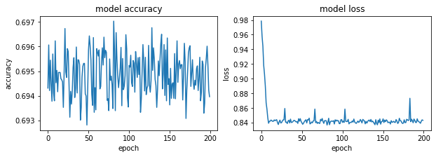

#### AdDelta - 1.5


```python
optimizer= tf.keras.optimizers.Adadelta(learning_rate=1.5)
model.compile(optimizer=optimizer,
              loss='sparse_categorical_crossentropy',
              metrics=['accuracy'])
#history = model.fit(X, Y, validation_split=0.33, epochs=150, batch_size=10, verbose=0)
history = model.fit(x_train, y_train, epochs=200)
model.evaluate(x_test,  y_test, verbose=2)
```

    Epoch 1/200
    1875/1875 [==============================] - 2s 1ms/step - loss: 0.8376 - accuracy: 0.6964
    Epoch 2/200
    1875/1875 [==============================] - 2s 1ms/step - loss: 0.8419 - accuracy: 0.6947
    Epoch 3/200
    1875/1875 [==============================] - 2s 1ms/step - loss: 0.8410 - accuracy: 0.6955
    Epoch 4/200
    1875/1875 [==============================] - 2s 1ms/step - loss: 0.8454 - accuracy: 0.6940
    Epoch 5/200
    1875/1875 [==============================] - 2s 1ms/step - loss: 0.8430 - accuracy: 0.6942
    Epoch 6/200
    1875/1875 [==============================] - 2s 1ms/step - loss: 0.8408 - accuracy: 0.6957
    Epoch 7/200
    1875/1875 [==============================] - 2s 1ms/step - loss: 0.8458 - accuracy: 0.6931
    Epoch 8/200
    1875/1875 [==============================] - 2s 1ms/step - loss: 0.8407 - accuracy: 0.6952
    Epoch 9/200
    1875/1875 [==============================] - 2s 1ms/step - loss: 0.8396 - accuracy: 0.6961
    Epoch 10/200
    1875/1875 [==============================] - 2s 1ms/step - loss: 0.8390 - accuracy: 0.6951
    Epoch 11/200
    1875/1875 [==============================] - 2s 1ms/step - loss: 0.8417 - accuracy: 0.6949
    Epoch 12/200
    1875/1875 [==============================] - 2s 1ms/step - loss: 0.8447 - accuracy: 0.6938
    Epoch 13/200
    1875/1875 [==============================] - 2s 1ms/step - loss: 0.8427 - accuracy: 0.6950
    Epoch 14/200
    1875/1875 [==============================] - 2s 1ms/step - loss: 0.8407 - accuracy: 0.6952
    Epoch 15/200
    1875/1875 [==============================] - 2s 1ms/step - loss: 0.8410 - accuracy: 0.6952
    Epoch 16/200
    1875/1875 [==============================] - 2s 1ms/step - loss: 0.8403 - accuracy: 0.6962
    Epoch 17/200
    1875/1875 [==============================] - 2s 995us/step - loss: 0.8424 - accuracy: 0.6942
    Epoch 18/200
    1875/1875 [==============================] - 2s 1ms/step - loss: 0.8403 - accuracy: 0.6948
    Epoch 19/200
    1875/1875 [==============================] - 2s 1ms/step - loss: 0.8430 - accuracy: 0.6944
    Epoch 20/200
    1875/1875 [==============================] - 2s 1ms/step - loss: 0.8399 - accuracy: 0.6958
    Epoch 21/200
    1875/1875 [==============================] - 2s 1ms/step - loss: 0.8423 - accuracy: 0.6944
    Epoch 22/200
    1875/1875 [==============================] - 2s 1ms/step - loss: 0.8416 - accuracy: 0.6952
    Epoch 23/200
    1875/1875 [==============================] - 2s 1ms/step - loss: 0.8388 - accuracy: 0.6963
    Epoch 24/200
    1875/1875 [==============================] - 2s 1ms/step - loss: 0.8401 - accuracy: 0.6958
    Epoch 25/200
    1875/1875 [==============================] - 2s 1ms/step - loss: 0.8470 - accuracy: 0.6932
    Epoch 26/200
    1875/1875 [==============================] - 2s 1ms/step - loss: 0.8442 - accuracy: 0.6946
    Epoch 27/200
    1875/1875 [==============================] - 2s 1ms/step - loss: 0.8417 - accuracy: 0.6950
    Epoch 28/200
    1875/1875 [==============================] - 2s 1ms/step - loss: 0.8398 - accuracy: 0.6953
    Epoch 29/200
    1875/1875 [==============================] - 2s 1ms/step - loss: 0.8408 - accuracy: 0.6948
    Epoch 30/200
    1875/1875 [==============================] - 2s 1ms/step - loss: 0.8409 - accuracy: 0.6953
    Epoch 31/200
    1875/1875 [==============================] - 2s 1ms/step - loss: 0.8443 - accuracy: 0.6945
    Epoch 32/200
    1875/1875 [==============================] - 2s 988us/step - loss: 0.8414 - accuracy: 0.6961
    Epoch 33/200
    1875/1875 [==============================] - 2s 994us/step - loss: 0.8449 - accuracy: 0.6940
    Epoch 34/200
    1875/1875 [==============================] - 2s 1ms/step - loss: 0.8441 - accuracy: 0.6944
    Epoch 35/200
    1875/1875 [==============================] - 2s 1ms/step - loss: 0.8389 - accuracy: 0.6969
    Epoch 36/200
    1875/1875 [==============================] - 2s 1ms/step - loss: 0.8476 - accuracy: 0.6932
    Epoch 37/200
    1875/1875 [==============================] - 2s 984us/step - loss: 0.8433 - accuracy: 0.6942
    Epoch 38/200
    1875/1875 [==============================] - 2s 1ms/step - loss: 0.8458 - accuracy: 0.6936
    Epoch 39/200
    1875/1875 [==============================] - 2s 991us/step - loss: 0.8403 - accuracy: 0.6952
    Epoch 40/200
    1875/1875 [==============================] - 2s 1ms/step - loss: 0.8450 - accuracy: 0.6943
    Epoch 41/200
    1875/1875 [==============================] - 2s 1ms/step - loss: 0.8417 - accuracy: 0.6945
    Epoch 42/200
    1875/1875 [==============================] - 2s 1ms/step - loss: 0.8396 - accuracy: 0.6959
    Epoch 43/200
    1875/1875 [==============================] - 2s 981us/step - loss: 0.8584 - accuracy: 0.6952
    Epoch 44/200
    1875/1875 [==============================] - 2s 1ms/step - loss: 0.8420 - accuracy: 0.6950
    Epoch 45/200
    1875/1875 [==============================] - 2s 986us/step - loss: 0.8400 - accuracy: 0.6952
    Epoch 46/200
    1875/1875 [==============================] - 2s 1ms/step - loss: 0.8424 - accuracy: 0.6947
    Epoch 47/200
    1875/1875 [==============================] - 2s 985us/step - loss: 0.8446 - accuracy: 0.6931
    Epoch 48/200
    1875/1875 [==============================] - 2s 994us/step - loss: 0.8614 - accuracy: 0.6939
    Epoch 49/200
    1875/1875 [==============================] - 2s 998us/step - loss: 0.8399 - accuracy: 0.6956
    Epoch 50/200
    1875/1875 [==============================] - 2s 998us/step - loss: 0.8454 - accuracy: 0.6941
    Epoch 51/200
    1875/1875 [==============================] - 2s 1ms/step - loss: 0.8417 - accuracy: 0.6948
    Epoch 52/200
    1875/1875 [==============================] - 2s 1ms/step - loss: 0.8429 - accuracy: 0.6953
    Epoch 53/200
    1875/1875 [==============================] - 2s 1ms/step - loss: 0.8581 - accuracy: 0.6959
    Epoch 54/200
    1875/1875 [==============================] - 2s 1ms/step - loss: 0.8392 - accuracy: 0.6955
    Epoch 55/200
    1875/1875 [==============================] - 2s 994us/step - loss: 0.8408 - accuracy: 0.6956
    Epoch 56/200
    1875/1875 [==============================] - 2s 1ms/step - loss: 0.8410 - accuracy: 0.6956
    Epoch 57/200
    1875/1875 [==============================] - 2s 1ms/step - loss: 0.8444 - accuracy: 0.6949
    Epoch 58/200
    1875/1875 [==============================] - 2s 1ms/step - loss: 0.8433 - accuracy: 0.6948
    Epoch 59/200
    1875/1875 [==============================] - 2s 993us/step - loss: 0.8393 - accuracy: 0.6954
    Epoch 60/200
    1875/1875 [==============================] - 2s 999us/step - loss: 0.8399 - accuracy: 0.6952
    Epoch 61/200
    1875/1875 [==============================] - 2s 1ms/step - loss: 0.8424 - accuracy: 0.6946
    Epoch 62/200
    1875/1875 [==============================] - 2s 1ms/step - loss: 0.8447 - accuracy: 0.6936
    Epoch 63/200
    1875/1875 [==============================] - 2s 1ms/step - loss: 0.8411 - accuracy: 0.6953
    Epoch 64/200
    1875/1875 [==============================] - 2s 1ms/step - loss: 0.8423 - accuracy: 0.6944
    Epoch 65/200
    1875/1875 [==============================] - 2s 1ms/step - loss: 0.8417 - accuracy: 0.6952
    Epoch 66/200
    1875/1875 [==============================] - 2s 987us/step - loss: 0.8399 - accuracy: 0.6951
    Epoch 67/200
    1875/1875 [==============================] - 2s 1ms/step - loss: 0.8441 - accuracy: 0.6939
    Epoch 68/200
    1875/1875 [==============================] - 2s 986us/step - loss: 0.8410 - accuracy: 0.6950
    Epoch 69/200
    1875/1875 [==============================] - 2s 1ms/step - loss: 0.8413 - accuracy: 0.6949
    Epoch 70/200
    1875/1875 [==============================] - 2s 979us/step - loss: 0.8396 - accuracy: 0.6963
    Epoch 71/200
    1875/1875 [==============================] - 2s 1ms/step - loss: 0.8458 - accuracy: 0.6934
    Epoch 72/200
    1875/1875 [==============================] - 2s 991us/step - loss: 0.8423 - accuracy: 0.6938
    Epoch 73/200
    1875/1875 [==============================] - 2s 1ms/step - loss: 0.8431 - accuracy: 0.6941
    Epoch 74/200
    1875/1875 [==============================] - 2s 978us/step - loss: 0.8403 - accuracy: 0.6963
    Epoch 75/200
    1875/1875 [==============================] - 2s 989us/step - loss: 0.8417 - accuracy: 0.6940
    Epoch 76/200
    1875/1875 [==============================] - 2s 1ms/step - loss: 0.8397 - accuracy: 0.6954
    Epoch 77/200
    1875/1875 [==============================] - 2s 1ms/step - loss: 0.8403 - accuracy: 0.6960
    Epoch 78/200
    1875/1875 [==============================] - 2s 1ms/step - loss: 0.8391 - accuracy: 0.6962
    Epoch 79/200
    1875/1875 [==============================] - 2s 974us/step - loss: 0.8405 - accuracy: 0.6957
    Epoch 80/200
    1875/1875 [==============================] - 2s 977us/step - loss: 0.8389 - accuracy: 0.6954
    Epoch 81/200
    1875/1875 [==============================] - 2s 985us/step - loss: 0.8430 - accuracy: 0.6947
    Epoch 82/200
    1875/1875 [==============================] - 2s 988us/step - loss: 0.8408 - accuracy: 0.6951
    Epoch 83/200
    1875/1875 [==============================] - 2s 1ms/step - loss: 0.8453 - accuracy: 0.6940
    Epoch 84/200
    1875/1875 [==============================] - 2s 988us/step - loss: 0.8409 - accuracy: 0.6945
    Epoch 85/200
    1875/1875 [==============================] - 2s 977us/step - loss: 0.8437 - accuracy: 0.6942
    Epoch 86/200
    1875/1875 [==============================] - 2s 998us/step - loss: 0.8450 - accuracy: 0.6926
    Epoch 87/200
    1875/1875 [==============================] - 2s 981us/step - loss: 0.8471 - accuracy: 0.6930
    Epoch 88/200
    1875/1875 [==============================] - 2s 986us/step - loss: 0.8433 - accuracy: 0.6944
    Epoch 89/200
    1875/1875 [==============================] - 2s 1ms/step - loss: 0.8369 - accuracy: 0.6959
    Epoch 90/200
    1875/1875 [==============================] - 2s 1ms/step - loss: 0.8421 - accuracy: 0.6942
    Epoch 91/200
    1875/1875 [==============================] - 2s 980us/step - loss: 0.8425 - accuracy: 0.6952
    Epoch 92/200
    1875/1875 [==============================] - 2s 992us/step - loss: 0.8465 - accuracy: 0.6928
    Epoch 93/200
    1875/1875 [==============================] - 2s 976us/step - loss: 0.8414 - accuracy: 0.6947
    Epoch 94/200
    1875/1875 [==============================] - 2s 1ms/step - loss: 0.8433 - accuracy: 0.6943
    Epoch 95/200
    1875/1875 [==============================] - 2s 990us/step - loss: 0.8439 - accuracy: 0.6949
    Epoch 96/200
    1875/1875 [==============================] - 2s 978us/step - loss: 0.8411 - accuracy: 0.6951
    Epoch 97/200
    1875/1875 [==============================] - 2s 990us/step - loss: 0.8382 - accuracy: 0.6959
    Epoch 98/200
    1875/1875 [==============================] - 2s 985us/step - loss: 0.8442 - accuracy: 0.6935
    Epoch 99/200
    1875/1875 [==============================] - 2s 1ms/step - loss: 0.8447 - accuracy: 0.6933
    Epoch 100/200
    1875/1875 [==============================] - 2s 1ms/step - loss: 0.8447 - accuracy: 0.6932
    Epoch 101/200
    1875/1875 [==============================] - 2s 979us/step - loss: 0.8446 - accuracy: 0.6944
    Epoch 102/200
    1875/1875 [==============================] - 2s 989us/step - loss: 0.8423 - accuracy: 0.6947
    Epoch 103/200
    1875/1875 [==============================] - 2s 976us/step - loss: 0.8412 - accuracy: 0.6952
    Epoch 104/200
    1875/1875 [==============================] - 2s 985us/step - loss: 0.8433 - accuracy: 0.6950
    Epoch 105/200
    1875/1875 [==============================] - 2s 1ms/step - loss: 0.8421 - accuracy: 0.6950
    Epoch 106/200
    1875/1875 [==============================] - 2s 1ms/step - loss: 0.8416 - accuracy: 0.6954
    Epoch 107/200
    1875/1875 [==============================] - 2s 997us/step - loss: 0.8399 - accuracy: 0.6954
    Epoch 108/200
    1875/1875 [==============================] - 2s 1ms/step - loss: 0.8416 - accuracy: 0.6952
    Epoch 109/200
    1875/1875 [==============================] - 2s 1ms/step - loss: 0.8441 - accuracy: 0.6936
    Epoch 110/200
    1875/1875 [==============================] - 2s 1ms/step - loss: 0.8428 - accuracy: 0.6946
    Epoch 111/200
    1875/1875 [==============================] - 2s 985us/step - loss: 0.8433 - accuracy: 0.6940
    Epoch 112/200
    1875/1875 [==============================] - 2s 1ms/step - loss: 0.8431 - accuracy: 0.6950
    Epoch 113/200
    1875/1875 [==============================] - 2s 924us/step - loss: 0.8406 - accuracy: 0.6958
    Epoch 114/200
    1875/1875 [==============================] - 2s 887us/step - loss: 0.8451 - accuracy: 0.6943
    Epoch 115/200
    1875/1875 [==============================] - 2s 889us/step - loss: 0.8401 - accuracy: 0.6954
    Epoch 116/200
    1875/1875 [==============================] - 2s 1ms/step - loss: 0.8403 - accuracy: 0.6956
    Epoch 117/200
    1875/1875 [==============================] - 2s 887us/step - loss: 0.8442 - accuracy: 0.6948
    Epoch 118/200
    1875/1875 [==============================] - 2s 887us/step - loss: 0.8440 - accuracy: 0.6948
    Epoch 119/200
    1875/1875 [==============================] - 2s 884us/step - loss: 0.8431 - accuracy: 0.6954
    Epoch 120/200
    1875/1875 [==============================] - 2s 884us/step - loss: 0.8408 - accuracy: 0.6940
    Epoch 121/200
    1875/1875 [==============================] - 2s 892us/step - loss: 0.8414 - accuracy: 0.6956
    Epoch 122/200
    1875/1875 [==============================] - 2s 1ms/step - loss: 0.8410 - accuracy: 0.6962
    Epoch 123/200
    1875/1875 [==============================] - 2s 889us/step - loss: 0.8447 - accuracy: 0.6933
    Epoch 124/200
    1875/1875 [==============================] - 2s 881us/step - loss: 0.8397 - accuracy: 0.6955
    Epoch 125/200
    1875/1875 [==============================] - 2s 879us/step - loss: 0.8428 - accuracy: 0.6943
    Epoch 126/200
    1875/1875 [==============================] - 2s 889us/step - loss: 0.8455 - accuracy: 0.6931
    Epoch 127/200
    1875/1875 [==============================] - 2s 887us/step - loss: 0.8454 - accuracy: 0.6936
    Epoch 128/200
    1875/1875 [==============================] - 2s 1ms/step - loss: 0.8424 - accuracy: 0.6951
    Epoch 129/200
    1875/1875 [==============================] - 2s 888us/step - loss: 0.8378 - accuracy: 0.6960
    Epoch 130/200
    1875/1875 [==============================] - 2s 893us/step - loss: 0.8441 - accuracy: 0.6945
    Epoch 131/200
    1875/1875 [==============================] - 2s 879us/step - loss: 0.8403 - accuracy: 0.6949
    Epoch 132/200
    1875/1875 [==============================] - 2s 885us/step - loss: 0.8436 - accuracy: 0.6920
    Epoch 133/200
    1875/1875 [==============================] - 2s 919us/step - loss: 0.8437 - accuracy: 0.6945
    Epoch 134/200
    1875/1875 [==============================] - 2s 919us/step - loss: 0.8420 - accuracy: 0.6949
    Epoch 135/200
    1875/1875 [==============================] - 2s 888us/step - loss: 0.8442 - accuracy: 0.6932
    Epoch 136/200
    1875/1875 [==============================] - 2s 892us/step - loss: 0.8415 - accuracy: 0.6942
    Epoch 137/200
    1875/1875 [==============================] - 2s 883us/step - loss: 0.8418 - accuracy: 0.6952
    Epoch 138/200
    1875/1875 [==============================] - 2s 897us/step - loss: 0.8368 - accuracy: 0.6961
    Epoch 139/200
    1875/1875 [==============================] - 2s 893us/step - loss: 0.8429 - accuracy: 0.6946
    Epoch 140/200
    1875/1875 [==============================] - 2s 1ms/step - loss: 0.8417 - accuracy: 0.6947
    Epoch 141/200
    1875/1875 [==============================] - 2s 894us/step - loss: 0.8415 - accuracy: 0.6956
    Epoch 142/200
    1875/1875 [==============================] - 2s 908us/step - loss: 0.8422 - accuracy: 0.6942
    Epoch 143/200
    1875/1875 [==============================] - 2s 899us/step - loss: 0.8427 - accuracy: 0.6935
    Epoch 144/200
    1875/1875 [==============================] - 2s 883us/step - loss: 0.8449 - accuracy: 0.6929
    Epoch 145/200
    1875/1875 [==============================] - 2s 938us/step - loss: 0.8431 - accuracy: 0.6939
    Epoch 146/200
    1875/1875 [==============================] - 2s 982us/step - loss: 0.8440 - accuracy: 0.6942
    Epoch 147/200
    1875/1875 [==============================] - 2s 887us/step - loss: 0.8403 - accuracy: 0.6952
    Epoch 148/200
    1875/1875 [==============================] - 2s 898us/step - loss: 0.8418 - accuracy: 0.6949
    Epoch 149/200
    1875/1875 [==============================] - 2s 890us/step - loss: 0.8410 - accuracy: 0.6950
    Epoch 150/200
    1875/1875 [==============================] - 2s 894us/step - loss: 0.8432 - accuracy: 0.6941
    Epoch 151/200
    1875/1875 [==============================] - 2s 942us/step - loss: 0.8411 - accuracy: 0.6950
    Epoch 152/200
    1875/1875 [==============================] - 2s 904us/step - loss: 0.8584 - accuracy: 0.6944
    Epoch 153/200
    1875/1875 [==============================] - 2s 884us/step - loss: 0.8394 - accuracy: 0.6962
    Epoch 154/200
    1875/1875 [==============================] - 2s 885us/step - loss: 0.8433 - accuracy: 0.6947
    Epoch 155/200
    1875/1875 [==============================] - 2s 879us/step - loss: 0.8406 - accuracy: 0.6948
    Epoch 156/200
    1875/1875 [==============================] - 2s 883us/step - loss: 0.8428 - accuracy: 0.6952
    Epoch 157/200
    1875/1875 [==============================] - 2s 920us/step - loss: 0.8428 - accuracy: 0.6951
    Epoch 158/200
    1875/1875 [==============================] - 2s 963us/step - loss: 0.8433 - accuracy: 0.6948
    Epoch 159/200
    1875/1875 [==============================] - 2s 888us/step - loss: 0.8401 - accuracy: 0.6958
    Epoch 160/200
    1875/1875 [==============================] - 2s 887us/step - loss: 0.8423 - accuracy: 0.6948
    Epoch 161/200
    1875/1875 [==============================] - 2s 901us/step - loss: 0.8388 - accuracy: 0.6961
    Epoch 162/200
    1875/1875 [==============================] - 2s 893us/step - loss: 0.8424 - accuracy: 0.6951
    Epoch 163/200
    1875/1875 [==============================] - 2s 964us/step - loss: 0.8420 - accuracy: 0.6941
    Epoch 164/200
    1875/1875 [==============================] - 2s 939us/step - loss: 0.8421 - accuracy: 0.6946
    Epoch 165/200
    1875/1875 [==============================] - 2s 882us/step - loss: 0.8462 - accuracy: 0.6939
    Epoch 166/200
    1875/1875 [==============================] - 2s 901us/step - loss: 0.8424 - accuracy: 0.6952
    Epoch 167/200
    1875/1875 [==============================] - 2s 879us/step - loss: 0.8425 - accuracy: 0.6951
    Epoch 168/200
    1875/1875 [==============================] - 2s 881us/step - loss: 0.8430 - accuracy: 0.6941
    Epoch 169/200
    1875/1875 [==============================] - 2s 947us/step - loss: 0.8416 - accuracy: 0.6951
    Epoch 170/200
    1875/1875 [==============================] - 2s 996us/step - loss: 0.8406 - accuracy: 0.6953
    Epoch 171/200
    1875/1875 [==============================] - 2s 899us/step - loss: 0.8414 - accuracy: 0.6942
    Epoch 172/200
    1875/1875 [==============================] - 2s 888us/step - loss: 0.8437 - accuracy: 0.6944
    Epoch 173/200
    1875/1875 [==============================] - 2s 907us/step - loss: 0.8415 - accuracy: 0.6957
    Epoch 174/200
    1875/1875 [==============================] - 2s 911us/step - loss: 0.8453 - accuracy: 0.6938
    Epoch 175/200
    1875/1875 [==============================] - 2s 992us/step - loss: 0.8414 - accuracy: 0.6956
    Epoch 176/200
    1875/1875 [==============================] - 2s 952us/step - loss: 0.8430 - accuracy: 0.6948
    Epoch 177/200
    1875/1875 [==============================] - 2s 946us/step - loss: 0.8413 - accuracy: 0.6953
    Epoch 178/200
    1875/1875 [==============================] - 2s 996us/step - loss: 0.8417 - accuracy: 0.6962
    Epoch 179/200
    1875/1875 [==============================] - 2s 930us/step - loss: 0.8409 - accuracy: 0.6947
    Epoch 180/200
    1875/1875 [==============================] - 2s 892us/step - loss: 0.8444 - accuracy: 0.6934
    Epoch 181/200
    1875/1875 [==============================] - 2s 998us/step - loss: 0.8418 - accuracy: 0.6951
    Epoch 182/200
    1875/1875 [==============================] - 2s 873us/step - loss: 0.8426 - accuracy: 0.6953
    Epoch 183/200
    1875/1875 [==============================] - 2s 924us/step - loss: 0.8438 - accuracy: 0.6927
    Epoch 184/200
    1875/1875 [==============================] - 2s 896us/step - loss: 0.8363 - accuracy: 0.6968
    Epoch 185/200
    1875/1875 [==============================] - 2s 878us/step - loss: 0.8452 - accuracy: 0.6931
    Epoch 186/200
    1875/1875 [==============================] - 2s 931us/step - loss: 0.8437 - accuracy: 0.6944
    Epoch 187/200
    1875/1875 [==============================] - 2s 1ms/step - loss: 0.8756 - accuracy: 0.6939
    Epoch 188/200
    1875/1875 [==============================] - 681s 363ms/step - loss: 0.8416 - accuracy: 0.6956
    Epoch 189/200
    1875/1875 [==============================] - 2s 995us/step - loss: 0.8418 - accuracy: 0.6941
    Epoch 190/200
    1875/1875 [==============================] - 2s 957us/step - loss: 0.8422 - accuracy: 0.6945
    Epoch 191/200
    1875/1875 [==============================] - 2s 936us/step - loss: 0.8450 - accuracy: 0.6945
    Epoch 192/200
    1875/1875 [==============================] - 2s 932us/step - loss: 0.8448 - accuracy: 0.6955
    Epoch 193/200
    1875/1875 [==============================] - 2s 934us/step - loss: 0.8401 - accuracy: 0.6961
    Epoch 194/200
    1875/1875 [==============================] - 2s 956us/step - loss: 0.8442 - accuracy: 0.6945
    Epoch 195/200
    1875/1875 [==============================] - 2s 1ms/step - loss: 0.8433 - accuracy: 0.6945
    Epoch 196/200
    1875/1875 [==============================] - 2s 1ms/step - loss: 0.8415 - accuracy: 0.6951
    Epoch 197/200
    1875/1875 [==============================] - 2s 991us/step - loss: 0.8402 - accuracy: 0.6957
    Epoch 198/200
    1875/1875 [==============================] - 2s 1ms/step - loss: 0.8426 - accuracy: 0.6952
    Epoch 199/200
    1875/1875 [==============================] - 2s 1ms/step - loss: 0.8429 - accuracy: 0.6944
    Epoch 200/200
    1875/1875 [==============================] - 2s 923us/step - loss: 0.8415 - accuracy: 0.6956
    313/313 - 0s - loss: 19.7132 - accuracy: 0.7300
    


    [19.71317481994629, 0.7300000190734863]


```python
fig, (ax1, ax2) = plt.subplots(1, 2, figsize=(10, 3))

#ax1.subplot(1, 2, 1)
ax1.plot(history.history['accuracy'])
#plt.plot(history.history['val_accuracy'])
ax1.set_title('model accuracy')
ax1.set_ylabel('accuracy')
ax1.set_xlabel('epoch')
#ax1.show()

#ax2.subplot(1, 2, 2)
ax2.plot(history.history['loss'])
#plt.plot(history.history['val_loss'])
ax2.set_title('model loss')
ax2.set_ylabel('loss')
ax2.set_xlabel('epoch')
```

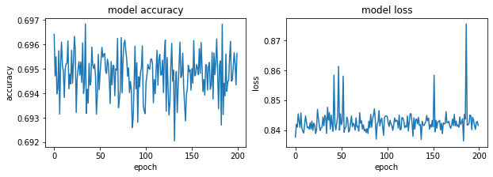

## Sobreentrenamiento
Se  reduce la cantidad de datos de entrenamiento y se reevalua el desempeño de los optimizadores. Se usó 600 datos para entrenamiento y 100 para testeo

#### SGD - 0.001


```python
optimizer= tf.keras.optimizers.SGD(learning_rate=0.001)
model.compile(optimizer=optimizer,
              loss='sparse_categorical_crossentropy',
              metrics=['accuracy'])

history = model.fit(x_train_, y_train_, epochs=100)
model.evaluate(x_test_,  y_test_, verbose=2)
```

    Epoch 1/100
    19/19 [==============================] - 0s 6ms/step - loss: 1.5658 - accuracy: 0.4124
    Epoch 2/100
    19/19 [==============================] - 0s 1ms/step - loss: 1.5904 - accuracy: 0.4023
    Epoch 3/100
    19/19 [==============================] - 0s 1ms/step - loss: 1.5201 - accuracy: 0.4307
    Epoch 4/100
    19/19 [==============================] - 0s 1ms/step - loss: 1.5405 - accuracy: 0.4207
    Epoch 5/100
    19/19 [==============================] - 0s 1ms/step - loss: 1.5333 - accuracy: 0.4240
    Epoch 6/100
    19/19 [==============================] - 0s 1ms/step - loss: 1.5402 - accuracy: 0.4240
    Epoch 7/100
    19/19 [==============================] - 0s 1ms/step - loss: 1.5615 - accuracy: 0.4140
    Epoch 8/100
    19/19 [==============================] - 0s 1000us/step - loss: 1.5368 - accuracy: 0.4224
    Epoch 9/100
    19/19 [==============================] - 0s 1ms/step - loss: 1.5206 - accuracy: 0.4307
    Epoch 10/100
    19/19 [==============================] - 0s 1ms/step - loss: 1.5667 - accuracy: 0.4124
    Epoch 11/100
    19/19 [==============================] - 0s 1ms/step - loss: 1.5100 - accuracy: 0.4341
    Epoch 12/100
    19/19 [==============================] - 0s 1ms/step - loss: 1.5459 - accuracy: 0.4224
    Epoch 13/100
    19/19 [==============================] - 0s 1ms/step - loss: 1.5362 - accuracy: 0.4257
    Epoch 14/100
    19/19 [==============================] - 0s 1ms/step - loss: 1.5454 - accuracy: 0.4224
    Epoch 15/100
    19/19 [==============================] - 0s 1ms/step - loss: 1.5466 - accuracy: 0.4224
    Epoch 16/100
    19/19 [==============================] - 0s 895us/step - loss: 1.5070 - accuracy: 0.4341
    Epoch 17/100
    19/19 [==============================] - 0s 842us/step - loss: 1.5329 - accuracy: 0.4257
    Epoch 18/100
    19/19 [==============================] - 0s 842us/step - loss: 1.5390 - accuracy: 0.4224
    Epoch 19/100
    19/19 [==============================] - 0s 947us/step - loss: 1.5722 - accuracy: 0.4090
    Epoch 20/100
    19/19 [==============================] - 0s 1ms/step - loss: 1.5134 - accuracy: 0.4341
    Epoch 21/100
    19/19 [==============================] - 0s 1ms/step - loss: 1.5105 - accuracy: 0.4324
    Epoch 22/100
    19/19 [==============================] - 0s 1ms/step - loss: 1.5131 - accuracy: 0.4341
    Epoch 23/100
    19/19 [==============================] - 0s 1ms/step - loss: 1.5129 - accuracy: 0.4357
    Epoch 24/100
    19/19 [==============================] - 0s 1ms/step - loss: 1.5592 - accuracy: 0.4157
    Epoch 25/100
    19/19 [==============================] - 0s 1ms/step - loss: 1.5764 - accuracy: 0.4073
    Epoch 26/100
    19/19 [==============================] - 0s 1ms/step - loss: 1.5178 - accuracy: 0.4307
    Epoch 27/100
    19/19 [==============================] - 0s 1ms/step - loss: 1.5499 - accuracy: 0.4207
    Epoch 28/100
    19/19 [==============================] - 0s 1ms/step - loss: 1.5529 - accuracy: 0.4157
    Epoch 29/100
    19/19 [==============================] - 0s 1ms/step - loss: 1.5365 - accuracy: 0.4240
    Epoch 30/100
    19/19 [==============================] - 0s 1000us/step - loss: 1.5676 - accuracy: 0.4124
    Epoch 31/100
    19/19 [==============================] - 0s 842us/step - loss: 1.4977 - accuracy: 0.4391
    Epoch 32/100
    19/19 [==============================] - 0s 895us/step - loss: 1.5707 - accuracy: 0.4107
    Epoch 33/100
    19/19 [==============================] - 0s 842us/step - loss: 1.5280 - accuracy: 0.4274
    Epoch 34/100
    19/19 [==============================] - 0s 947us/step - loss: 1.5453 - accuracy: 0.4207
    Epoch 35/100
    19/19 [==============================] - 0s 1ms/step - loss: 1.5360 - accuracy: 0.4224
    Epoch 36/100
    19/19 [==============================] - 0s 1ms/step - loss: 1.5291 - accuracy: 0.4274
    Epoch 37/100
    19/19 [==============================] - 0s 1000us/step - loss: 1.5538 - accuracy: 0.4174
    Epoch 38/100
    19/19 [==============================] - 0s 1ms/step - loss: 1.5275 - accuracy: 0.4274
    Epoch 39/100
    19/19 [==============================] - 0s 895us/step - loss: 1.5248 - accuracy: 0.4307
    Epoch 40/100
    19/19 [==============================] - 0s 842us/step - loss: 1.4838 - accuracy: 0.4441
    Epoch 41/100
    19/19 [==============================] - 0s 947us/step - loss: 1.5383 - accuracy: 0.4240
    Epoch 42/100
    19/19 [==============================] - 0s 842us/step - loss: 1.5148 - accuracy: 0.4324
    Epoch 43/100
    19/19 [==============================] - 0s 1ms/step - loss: 1.5319 - accuracy: 0.4257
    Epoch 44/100
    19/19 [==============================] - 0s 947us/step - loss: 1.5528 - accuracy: 0.4157
    Epoch 45/100
    19/19 [==============================] - 0s 947us/step - loss: 1.5203 - accuracy: 0.4307
    Epoch 46/100
    19/19 [==============================] - 0s 947us/step - loss: 1.5344 - accuracy: 0.4257
    Epoch 47/100
    19/19 [==============================] - 0s 947us/step - loss: 1.5357 - accuracy: 0.4224
    Epoch 48/100
    19/19 [==============================] - 0s 842us/step - loss: 1.5235 - accuracy: 0.4307
    Epoch 49/100
    19/19 [==============================] - 0s 947us/step - loss: 1.5203 - accuracy: 0.4307
    Epoch 50/100
    19/19 [==============================] - 0s 895us/step - loss: 1.4957 - accuracy: 0.4407
    Epoch 51/100
    19/19 [==============================] - 0s 1000us/step - loss: 1.5365 - accuracy: 0.4240
    Epoch 52/100
    19/19 [==============================] - 0s 1ms/step - loss: 1.5089 - accuracy: 0.4341
    Epoch 53/100
    19/19 [==============================] - 0s 1ms/step - loss: 1.5572 - accuracy: 0.4157
    Epoch 54/100
    19/19 [==============================] - 0s 947us/step - loss: 1.5278 - accuracy: 0.4274
    Epoch 55/100
    19/19 [==============================] - 0s 842us/step - loss: 1.5361 - accuracy: 0.4240
    Epoch 56/100
    19/19 [==============================] - 0s 842us/step - loss: 1.5340 - accuracy: 0.4240
    Epoch 57/100
    19/19 [==============================] - 0s 1ms/step - loss: 1.5354 - accuracy: 0.4240
    Epoch 58/100
    19/19 [==============================] - 0s 842us/step - loss: 1.5253 - accuracy: 0.4290
    Epoch 59/100
    19/19 [==============================] - 0s 1ms/step - loss: 1.5435 - accuracy: 0.4207
    Epoch 60/100
    19/19 [==============================] - 0s 947us/step - loss: 1.5263 - accuracy: 0.4274
    Epoch 61/100
    19/19 [==============================] - 0s 895us/step - loss: 1.5381 - accuracy: 0.4224
    Epoch 62/100
    19/19 [==============================] - 0s 842us/step - loss: 1.5379 - accuracy: 0.4240
    Epoch 63/100
    19/19 [==============================] - 0s 947us/step - loss: 1.5282 - accuracy: 0.4274
    Epoch 64/100
    19/19 [==============================] - 0s 1ms/step - loss: 1.5115 - accuracy: 0.4341
    Epoch 65/100
    19/19 [==============================] - 0s 1ms/step - loss: 1.5055 - accuracy: 0.4341
    Epoch 66/100
    19/19 [==============================] - 0s 947us/step - loss: 1.5552 - accuracy: 0.4174
    Epoch 67/100
    19/19 [==============================] - 0s 895us/step - loss: 1.5372 - accuracy: 0.4224
    Epoch 68/100
    19/19 [==============================] - 0s 895us/step - loss: 1.5882 - accuracy: 0.4023
    Epoch 69/100
    19/19 [==============================] - 0s 947us/step - loss: 1.5469 - accuracy: 0.4174
    Epoch 70/100
    19/19 [==============================] - 0s 842us/step - loss: 1.5684 - accuracy: 0.4107
    Epoch 71/100
    19/19 [==============================] - 0s 1ms/step - loss: 1.5656 - accuracy: 0.4140
    Epoch 72/100
    19/19 [==============================] - 0s 1ms/step - loss: 1.5418 - accuracy: 0.4224
    Epoch 73/100
    19/19 [==============================] - 0s 947us/step - loss: 1.5081 - accuracy: 0.4341
    Epoch 74/100
    19/19 [==============================] - 0s 894us/step - loss: 1.5393 - accuracy: 0.4224
    Epoch 75/100
    19/19 [==============================] - 0s 895us/step - loss: 1.5455 - accuracy: 0.4190
    Epoch 76/100
    19/19 [==============================] - 0s 842us/step - loss: 1.5790 - accuracy: 0.4057
    Epoch 77/100
    19/19 [==============================] - 0s 947us/step - loss: 1.5208 - accuracy: 0.4290
    Epoch 78/100
    19/19 [==============================] - 0s 842us/step - loss: 1.5493 - accuracy: 0.4174
    Epoch 79/100
    19/19 [==============================] - 0s 1ms/step - loss: 1.5432 - accuracy: 0.4224
    Epoch 80/100
    19/19 [==============================] - 0s 1000us/step - loss: 1.5396 - accuracy: 0.4207
    Epoch 81/100
    19/19 [==============================] - 0s 789us/step - loss: 1.5242 - accuracy: 0.4274
    Epoch 82/100
    19/19 [==============================] - 0s 895us/step - loss: 1.5312 - accuracy: 0.4257
    Epoch 83/100
    19/19 [==============================] - 0s 894us/step - loss: 1.5553 - accuracy: 0.4190
    Epoch 84/100
    19/19 [==============================] - 0s 895us/step - loss: 1.5368 - accuracy: 0.4240
    Epoch 85/100
    19/19 [==============================] - 0s 842us/step - loss: 1.5051 - accuracy: 0.4374
    Epoch 86/100
    19/19 [==============================] - 0s 842us/step - loss: 1.5466 - accuracy: 0.4207
    Epoch 87/100
    19/19 [==============================] - 0s 1000us/step - loss: 1.5269 - accuracy: 0.4274
    Epoch 88/100
    19/19 [==============================] - 0s 1ms/step - loss: 1.4977 - accuracy: 0.4391
    Epoch 89/100
    19/19 [==============================] - 0s 1000us/step - loss: 1.5331 - accuracy: 0.4240
    Epoch 90/100
    19/19 [==============================] - 0s 947us/step - loss: 1.5872 - accuracy: 0.4040
    Epoch 91/100
    19/19 [==============================] - 0s 947us/step - loss: 1.5451 - accuracy: 0.4190
    Epoch 92/100
    19/19 [==============================] - 0s 895us/step - loss: 1.4969 - accuracy: 0.4374
    Epoch 93/100
    19/19 [==============================] - 0s 842us/step - loss: 1.5100 - accuracy: 0.4341
    Epoch 94/100
    19/19 [==============================] - 0s 895us/step - loss: 1.5645 - accuracy: 0.4140
    Epoch 95/100
    19/19 [==============================] - 0s 895us/step - loss: 1.5179 - accuracy: 0.4307
    Epoch 96/100
    19/19 [==============================] - 0s 842us/step - loss: 1.5539 - accuracy: 0.4157
    Epoch 97/100
    19/19 [==============================] - 0s 895us/step - loss: 1.4801 - accuracy: 0.4457
    Epoch 98/100
    19/19 [==============================] - 0s 894us/step - loss: 1.5086 - accuracy: 0.4341
    Epoch 99/100
    19/19 [==============================] - 0s 894us/step - loss: 1.5441 - accuracy: 0.4224
    Epoch 100/100
    19/19 [==============================] - 0s 842us/step - loss: 1.5367 - accuracy: 0.4224
    19/19 - 0s - loss: 9.0671 - accuracy: 0.3706
    


    [9.0670747756958, 0.37061768770217896]


```python
fig, (ax1, ax2) = plt.subplots(1, 2, figsize=(10, 3))

#ax1.subplot(1, 2, 1)
ax1.plot(history.history['accuracy'])
#plt.plot(history.history['val_accuracy'])
ax1.set_title('model accuracy')
ax1.set_ylabel('accuracy')
ax1.set_xlabel('epoch')
#ax1.show()

#ax2.subplot(1, 2, 2)
ax2.plot(history.history['loss'])
#plt.plot(history.history['val_loss'])
ax2.set_title('model loss')
ax2.set_ylabel('loss')
ax2.set_xlabel('epoch')
```


#### SGD - 0.1


```python
optimizer= tf.keras.optimizers.SGD(learning_rate=0.1)
model.compile(optimizer=optimizer,
              loss='sparse_categorical_crossentropy',
              metrics=['accuracy'])

history = model.fit(x_train_, y_train_, epochs=100)
model.evaluate(x_test_,  y_test_, verbose=2)
```

    Epoch 1/100
    19/19 [==============================] - 0s 1ms/step - loss: 1.5544 - accuracy: 0.4174
    Epoch 2/100
    19/19 [==============================] - 0s 1ms/step - loss: 1.5095 - accuracy: 0.4341
    Epoch 3/100
    19/19 [==============================] - 0s 1ms/step - loss: 1.5194 - accuracy: 0.4307
    Epoch 4/100
    19/19 [==============================] - 0s 1ms/step - loss: 1.5599 - accuracy: 0.4124
    Epoch 5/100
    19/19 [==============================] - 0s 1ms/step - loss: 1.5435 - accuracy: 0.4190
    Epoch 6/100
    19/19 [==============================] - 0s 1ms/step - loss: 1.5123 - accuracy: 0.4307
    Epoch 7/100
    19/19 [==============================] - 0s 895us/step - loss: 1.5109 - accuracy: 0.4324
    Epoch 8/100
    19/19 [==============================] - 0s 1ms/step - loss: 1.5215 - accuracy: 0.4274
    Epoch 9/100
    19/19 [==============================] - 0s 1ms/step - loss: 1.5405 - accuracy: 0.4190
    Epoch 10/100
    19/19 [==============================] - 0s 894us/step - loss: 1.5284 - accuracy: 0.4257
    Epoch 11/100
    19/19 [==============================] - 0s 1ms/step - loss: 1.5462 - accuracy: 0.4157
    Epoch 12/100
    19/19 [==============================] - 0s 1ms/step - loss: 1.5427 - accuracy: 0.4157
    Epoch 13/100
    19/19 [==============================] - 0s 1ms/step - loss: 1.5204 - accuracy: 0.4257
    Epoch 14/100
    19/19 [==============================] - 0s 1ms/step - loss: 1.5392 - accuracy: 0.4207
    Epoch 15/100
    19/19 [==============================] - 0s 947us/step - loss: 1.5014 - accuracy: 0.4341
    Epoch 16/100
    19/19 [==============================] - 0s 1ms/step - loss: 1.5144 - accuracy: 0.4324
    Epoch 17/100
    19/19 [==============================] - 0s 1ms/step - loss: 1.5263 - accuracy: 0.4240
    Epoch 18/100
    19/19 [==============================] - 0s 895us/step - loss: 1.5427 - accuracy: 0.4157
    Epoch 19/100
    19/19 [==============================] - 0s 1000us/step - loss: 1.5344 - accuracy: 0.4190
    Epoch 20/100
    19/19 [==============================] - 0s 895us/step - loss: 1.5214 - accuracy: 0.4257
    Epoch 21/100
    19/19 [==============================] - 0s 842us/step - loss: 1.5289 - accuracy: 0.4240
    Epoch 22/100
    19/19 [==============================] - 0s 1ms/step - loss: 1.5194 - accuracy: 0.4274
    Epoch 23/100
    19/19 [==============================] - 0s 1ms/step - loss: 1.5494 - accuracy: 0.4157
    Epoch 24/100
    19/19 [==============================] - 0s 1000us/step - loss: 1.5850 - accuracy: 0.4007
    Epoch 25/100
    19/19 [==============================] - 0s 1ms/step - loss: 1.5062 - accuracy: 0.4324
    Epoch 26/100
    19/19 [==============================] - 0s 1ms/step - loss: 1.5062 - accuracy: 0.4324
    Epoch 27/100
    19/19 [==============================] - 0s 1ms/step - loss: 1.5162 - accuracy: 0.4307
    Epoch 28/100
    19/19 [==============================] - 0s 1ms/step - loss: 1.5321 - accuracy: 0.4224
    Epoch 29/100
    19/19 [==============================] - 0s 1000us/step - loss: 1.4902 - accuracy: 0.4374
    Epoch 30/100
    19/19 [==============================] - 0s 1ms/step - loss: 1.5325 - accuracy: 0.4240
    Epoch 31/100
    19/19 [==============================] - 0s 895us/step - loss: 1.5126 - accuracy: 0.4274
    Epoch 32/100
    19/19 [==============================] - 0s 948us/step - loss: 1.4958 - accuracy: 0.4374
    Epoch 33/100
    19/19 [==============================] - 0s 1000us/step - loss: 1.5267 - accuracy: 0.4240
    Epoch 34/100
    19/19 [==============================] - 0s 1000us/step - loss: 1.5087 - accuracy: 0.4307
    Epoch 35/100
    19/19 [==============================] - 0s 1ms/step - loss: 1.5518 - accuracy: 0.4140
    Epoch 36/100
    19/19 [==============================] - 0s 1ms/step - loss: 1.4952 - accuracy: 0.4374
    Epoch 37/100
    19/19 [==============================] - 0s 1ms/step - loss: 1.5308 - accuracy: 0.4240
    Epoch 38/100
    19/19 [==============================] - 0s 1ms/step - loss: 1.5291 - accuracy: 0.4240
    Epoch 39/100
    19/19 [==============================] - 0s 1ms/step - loss: 1.5438 - accuracy: 0.4174
    Epoch 40/100
    19/19 [==============================] - 0s 1ms/step - loss: 1.5794 - accuracy: 0.4073
    Epoch 41/100
    19/19 [==============================] - 0s 1ms/step - loss: 1.5193 - accuracy: 0.4290
    Epoch 42/100
    19/19 [==============================] - 0s 1000us/step - loss: 1.4913 - accuracy: 0.4374
    Epoch 43/100
    19/19 [==============================] - 0s 1ms/step - loss: 1.5150 - accuracy: 0.4274
    Epoch 44/100
    19/19 [==============================] - 0s 1ms/step - loss: 1.5356 - accuracy: 0.4190
    Epoch 45/100
    19/19 [==============================] - 0s 1ms/step - loss: 1.5142 - accuracy: 0.4290
    Epoch 46/100
    19/19 [==============================] - 0s 842us/step - loss: 1.4960 - accuracy: 0.4357
    Epoch 47/100
    19/19 [==============================] - 0s 895us/step - loss: 1.5464 - accuracy: 0.4174
    Epoch 48/100
    19/19 [==============================] - 0s 895us/step - loss: 1.5224 - accuracy: 0.4274
    Epoch 49/100
    19/19 [==============================] - 0s 895us/step - loss: 1.5551 - accuracy: 0.4124
    Epoch 50/100
    19/19 [==============================] - 0s 1ms/step - loss: 1.5410 - accuracy: 0.4190
    Epoch 51/100
    19/19 [==============================] - 0s 1ms/step - loss: 1.5281 - accuracy: 0.4257
    Epoch 52/100
    19/19 [==============================] - 0s 1ms/step - loss: 1.5195 - accuracy: 0.4240
    Epoch 53/100
    19/19 [==============================] - 0s 1ms/step - loss: 1.5081 - accuracy: 0.4341
    Epoch 54/100
    19/19 [==============================] - 0s 1ms/step - loss: 1.5199 - accuracy: 0.4274
    Epoch 55/100
    19/19 [==============================] - 0s 1ms/step - loss: 1.5136 - accuracy: 0.4307
    Epoch 56/100
    19/19 [==============================] - 0s 1ms/step - loss: 1.5113 - accuracy: 0.4307
    Epoch 57/100
    19/19 [==============================] - 0s 1ms/step - loss: 1.5215 - accuracy: 0.4290
    Epoch 58/100
    19/19 [==============================] - 0s 1ms/step - loss: 1.5185 - accuracy: 0.4257
    Epoch 59/100
    19/19 [==============================] - 0s 895us/step - loss: 1.5202 - accuracy: 0.4290
    Epoch 60/100
    19/19 [==============================] - 0s 842us/step - loss: 1.5284 - accuracy: 0.4240
    Epoch 61/100
    19/19 [==============================] - 0s 895us/step - loss: 1.5228 - accuracy: 0.4240
    Epoch 62/100
    19/19 [==============================] - 0s 895us/step - loss: 1.5117 - accuracy: 0.4290
    Epoch 63/100
    19/19 [==============================] - 0s 1ms/step - loss: 1.5259 - accuracy: 0.4257
    Epoch 64/100
    19/19 [==============================] - 0s 895us/step - loss: 1.5175 - accuracy: 0.4274
    Epoch 65/100
    19/19 [==============================] - 0s 842us/step - loss: 1.4959 - accuracy: 0.4357
    Epoch 66/100
    19/19 [==============================] - 0s 842us/step - loss: 1.5599 - accuracy: 0.4124
    Epoch 67/100
    19/19 [==============================] - 0s 895us/step - loss: 1.5117 - accuracy: 0.4290
    Epoch 68/100
    19/19 [==============================] - 0s 842us/step - loss: 1.5229 - accuracy: 0.4240
    Epoch 69/100
    19/19 [==============================] - 0s 895us/step - loss: 1.5293 - accuracy: 0.4224
    Epoch 70/100
    19/19 [==============================] - 0s 842us/step - loss: 1.5080 - accuracy: 0.4307
    Epoch 71/100
    19/19 [==============================] - 0s 1ms/step - loss: 1.5415 - accuracy: 0.4190
    Epoch 72/100
    19/19 [==============================] - 0s 842us/step - loss: 1.5251 - accuracy: 0.4257
    Epoch 73/100
    19/19 [==============================] - 0s 948us/step - loss: 1.5285 - accuracy: 0.4257
    Epoch 74/100
    19/19 [==============================] - 0s 842us/step - loss: 1.5234 - accuracy: 0.4240
    Epoch 75/100
    19/19 [==============================] - 0s 1ms/step - loss: 1.5365 - accuracy: 0.4207
    Epoch 76/100
    19/19 [==============================] - 0s 842us/step - loss: 1.5363 - accuracy: 0.4207
    Epoch 77/100
    19/19 [==============================] - 0s 947us/step - loss: 1.5444 - accuracy: 0.4190
    Epoch 78/100
    19/19 [==============================] - 0s 1ms/step - loss: 1.5405 - accuracy: 0.4174
    Epoch 79/100
    19/19 [==============================] - 0s 1ms/step - loss: 1.5245 - accuracy: 0.4274
    Epoch 80/100
    19/19 [==============================] - 0s 731us/step - loss: 1.5479 - accuracy: 0.4190
    Epoch 81/100
    19/19 [==============================] - 0s 793us/step - loss: 1.5249 - accuracy: 0.4240
    Epoch 82/100
    19/19 [==============================] - 0s 528us/step - loss: 1.5163 - accuracy: 0.4274
    Epoch 83/100
    19/19 [==============================] - 0s 791us/step - loss: 1.5287 - accuracy: 0.4240
    Epoch 84/100
    19/19 [==============================] - 0s 793us/step - loss: 1.5194 - accuracy: 0.4290
    Epoch 85/100
    19/19 [==============================] - 0s 743us/step - loss: 1.5548 - accuracy: 0.4140
    Epoch 86/100
    19/19 [==============================] - 0s 793us/step - loss: 1.5312 - accuracy: 0.4224
    Epoch 87/100
    19/19 [==============================] - 0s 793us/step - loss: 1.5482 - accuracy: 0.4157
    Epoch 88/100
    19/19 [==============================] - 0s 796us/step - loss: 1.5424 - accuracy: 0.4190
    Epoch 89/100
    19/19 [==============================] - 0s 794us/step - loss: 1.5228 - accuracy: 0.4274
    Epoch 90/100
    19/19 [==============================] - 0s 848us/step - loss: 1.5122 - accuracy: 0.4290
    Epoch 91/100
    19/19 [==============================] - 0s 767us/step - loss: 1.5187 - accuracy: 0.4257
    Epoch 92/100
    19/19 [==============================] - 0s 792us/step - loss: 1.5544 - accuracy: 0.4124
    Epoch 93/100
    19/19 [==============================] - 0s 1ms/step - loss: 1.5059 - accuracy: 0.4307
    Epoch 94/100
    19/19 [==============================] - 0s 842us/step - loss: 1.5196 - accuracy: 0.4274
    Epoch 95/100
    19/19 [==============================] - 0s 947us/step - loss: 1.5313 - accuracy: 0.4224
    Epoch 96/100
    19/19 [==============================] - 0s 1ms/step - loss: 1.5301 - accuracy: 0.4224
    Epoch 97/100
    19/19 [==============================] - 0s 842us/step - loss: 1.5299 - accuracy: 0.4224
    Epoch 98/100
    19/19 [==============================] - 0s 818us/step - loss: 1.5016 - accuracy: 0.4357
    Epoch 99/100
    19/19 [==============================] - 0s 793us/step - loss: 1.5119 - accuracy: 0.4290
    Epoch 100/100
    19/19 [==============================] - 0s 793us/step - loss: 1.5271 - accuracy: 0.4224
    19/19 - 0s - loss: 9.0849 - accuracy: 0.3706
    


    [9.08487319946289, 0.37061768770217896]


```python
fig, (ax1, ax2) = plt.subplots(1, 2, figsize=(10, 3))

#ax1.subplot(1, 2, 1)
ax1.plot(history.history['accuracy'])
#plt.plot(history.history['val_accuracy'])
ax1.set_title('model accuracy')
ax1.set_ylabel('accuracy')
ax1.set_xlabel('epoch')
#ax1.show()

#ax2.subplot(1, 2, 2)
ax2.plot(history.history['loss'])
#plt.plot(history.history['val_loss'])
ax2.set_title('model loss')
ax2.set_ylabel('loss')
ax2.set_xlabel('epoch')
```

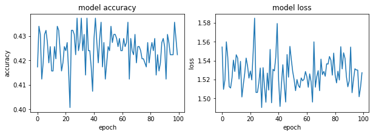

#### SGD - 0.5


```python
optimizer= tf.keras.optimizers.SGD(learning_rate=0.5)
model.compile(optimizer=optimizer,
              loss='sparse_categorical_crossentropy',
              metrics=['accuracy'])

history = model.fit(x_train_, y_train_, epochs=100)
model.evaluate(x_test_,  y_test_, verbose=2)
```

    Epoch 1/100
    19/19 [==============================] - 0s 1000us/step - loss: 1.5294 - accuracy: 0.4257
    Epoch 2/100
    19/19 [==============================] - 0s 1ms/step - loss: 1.5070 - accuracy: 0.4307
    Epoch 3/100
    19/19 [==============================] - 0s 1ms/step - loss: 1.5455 - accuracy: 0.4190
    Epoch 4/100
    19/19 [==============================] - 0s 1ms/step - loss: 1.5125 - accuracy: 0.4324
    Epoch 5/100
    19/19 [==============================] - 0s 1ms/step - loss: 1.5174 - accuracy: 0.4290
    Epoch 6/100
    19/19 [==============================] - 0s 1ms/step - loss: 1.5438 - accuracy: 0.4190
    Epoch 7/100
    19/19 [==============================] - 0s 1ms/step - loss: 1.5524 - accuracy: 0.4174
    Epoch 8/100
    19/19 [==============================] - 0s 1ms/step - loss: 1.5535 - accuracy: 0.4157
    Epoch 9/100
    19/19 [==============================] - 0s 1ms/step - loss: 1.5155 - accuracy: 0.4290
    Epoch 10/100
    19/19 [==============================] - 0s 1ms/step - loss: 1.5432 - accuracy: 0.4190
    Epoch 11/100
    19/19 [==============================] - 0s 1ms/step - loss: 1.5037 - accuracy: 0.4341
    Epoch 12/100
    19/19 [==============================] - 0s 1ms/step - loss: 1.5302 - accuracy: 0.4224
    Epoch 13/100
    19/19 [==============================] - 0s 1ms/step - loss: 1.5408 - accuracy: 0.4224
    Epoch 14/100
    19/19 [==============================] - 0s 1ms/step - loss: 1.5186 - accuracy: 0.4257
    Epoch 15/100
    19/19 [==============================] - 0s 1ms/step - loss: 1.5408 - accuracy: 0.4207
    Epoch 16/100
    19/19 [==============================] - 0s 895us/step - loss: 1.5680 - accuracy: 0.4107
    Epoch 17/100
    19/19 [==============================] - 0s 1ms/step - loss: 1.5221 - accuracy: 0.4257
    Epoch 18/100
    19/19 [==============================] - 0s 947us/step - loss: 1.5504 - accuracy: 0.4190
    Epoch 19/100
    19/19 [==============================] - 0s 1ms/step - loss: 1.5692 - accuracy: 0.4090
    Epoch 20/100
    19/19 [==============================] - 0s 1ms/step - loss: 1.5256 - accuracy: 0.4257
    Epoch 21/100
    19/19 [==============================] - 0s 1ms/step - loss: 1.5100 - accuracy: 0.4341
    Epoch 22/100
    19/19 [==============================] - 0s 1ms/step - loss: 1.5192 - accuracy: 0.4290
    Epoch 23/100
    19/19 [==============================] - 0s 1ms/step - loss: 1.5665 - accuracy: 0.4140
    Epoch 24/100
    19/19 [==============================] - 0s 1ms/step - loss: 1.5053 - accuracy: 0.4341
    Epoch 25/100
    19/19 [==============================] - 0s 1ms/step - loss: 1.4956 - accuracy: 0.4391
    Epoch 26/100
    19/19 [==============================] - 0s 1ms/step - loss: 1.5480 - accuracy: 0.4174
    Epoch 27/100
    19/19 [==============================] - 0s 895us/step - loss: 1.5211 - accuracy: 0.4274
    Epoch 28/100
    19/19 [==============================] - 0s 842us/step - loss: 1.5172 - accuracy: 0.4290
    Epoch 29/100
    19/19 [==============================] - 0s 1ms/step - loss: 1.5022 - accuracy: 0.4357
    Epoch 30/100
    19/19 [==============================] - 0s 1ms/step - loss: 1.5147 - accuracy: 0.4307
    Epoch 31/100
    19/19 [==============================] - 0s 1ms/step - loss: 1.5744 - accuracy: 0.4073
    Epoch 32/100
    19/19 [==============================] - 0s 1ms/step - loss: 1.5091 - accuracy: 0.4324
    Epoch 33/100
    19/19 [==============================] - 0s 1ms/step - loss: 1.4984 - accuracy: 0.4374
    Epoch 34/100
    19/19 [==============================] - 0s 1ms/step - loss: 1.5254 - accuracy: 0.4257
    Epoch 35/100
    19/19 [==============================] - 0s 1ms/step - loss: 1.5151 - accuracy: 0.4307
    Epoch 36/100
    19/19 [==============================] - 0s 1000us/step - loss: 1.5326 - accuracy: 0.4257
    Epoch 37/100
    19/19 [==============================] - 0s 1000us/step - loss: 1.5132 - accuracy: 0.4307
    Epoch 38/100
    19/19 [==============================] - 0s 1ms/step - loss: 1.5482 - accuracy: 0.4157
    Epoch 39/100
    19/19 [==============================] - 0s 947us/step - loss: 1.5275 - accuracy: 0.4257
    Epoch 40/100
    19/19 [==============================] - 0s 842us/step - loss: 1.5380 - accuracy: 0.4224
    Epoch 41/100
    19/19 [==============================] - 0s 1ms/step - loss: 1.5061 - accuracy: 0.4357
    Epoch 42/100
    19/19 [==============================] - 0s 895us/step - loss: 1.5240 - accuracy: 0.4274
    Epoch 43/100
    19/19 [==============================] - 0s 1ms/step - loss: 1.5411 - accuracy: 0.4190
    Epoch 44/100
    19/19 [==============================] - 0s 1000us/step - loss: 1.5301 - accuracy: 0.4257
    Epoch 45/100
    19/19 [==============================] - 0s 1ms/step - loss: 1.5425 - accuracy: 0.4224
    Epoch 46/100
    19/19 [==============================] - 0s 1ms/step - loss: 1.5339 - accuracy: 0.4224
    Epoch 47/100
    19/19 [==============================] - 0s 1ms/step - loss: 1.5168 - accuracy: 0.4274
    Epoch 48/100
    19/19 [==============================] - 0s 948us/step - loss: 1.5332 - accuracy: 0.4240
    Epoch 49/100
    19/19 [==============================] - 0s 1ms/step - loss: 1.5311 - accuracy: 0.4224
    Epoch 50/100
    19/19 [==============================] - 0s 1ms/step - loss: 1.4797 - accuracy: 0.4441
    Epoch 51/100
    19/19 [==============================] - 0s 1ms/step - loss: 1.4998 - accuracy: 0.4374
    Epoch 52/100
    19/19 [==============================] - 0s 1ms/step - loss: 1.5566 - accuracy: 0.4140
    Epoch 53/100
    19/19 [==============================] - 0s 895us/step - loss: 1.5628 - accuracy: 0.4124
    Epoch 54/100
    19/19 [==============================] - 0s 842us/step - loss: 1.5061 - accuracy: 0.4341
    Epoch 55/100
    19/19 [==============================] - 0s 895us/step - loss: 1.5366 - accuracy: 0.4240
    Epoch 56/100
    19/19 [==============================] - 0s 842us/step - loss: 1.5573 - accuracy: 0.4140
    Epoch 57/100
    19/19 [==============================] - 0s 1ms/step - loss: 1.5525 - accuracy: 0.4174
    Epoch 58/100
    19/19 [==============================] - 0s 1ms/step - loss: 1.5310 - accuracy: 0.4274
    Epoch 59/100
    19/19 [==============================] - 0s 895us/step - loss: 1.5340 - accuracy: 0.4240
    Epoch 60/100
    19/19 [==============================] - 0s 1ms/step - loss: 1.5444 - accuracy: 0.4190
    Epoch 61/100
    19/19 [==============================] - 0s 947us/step - loss: 1.5417 - accuracy: 0.4207
    Epoch 62/100
    19/19 [==============================] - 0s 1000us/step - loss: 1.5133 - accuracy: 0.4324
    Epoch 63/100
    19/19 [==============================] - 0s 999us/step - loss: 1.5221 - accuracy: 0.4274
    Epoch 64/100
    19/19 [==============================] - 0s 895us/step - loss: 1.5172 - accuracy: 0.4307
    Epoch 65/100
    19/19 [==============================] - 0s 2ms/step - loss: 1.5031 - accuracy: 0.4374
    Epoch 66/100
    19/19 [==============================] - 0s 2ms/step - loss: 1.5236 - accuracy: 0.4257
    Epoch 67/100
    19/19 [==============================] - 0s 1ms/step - loss: 1.5379 - accuracy: 0.4207
    Epoch 68/100
    19/19 [==============================] - 0s 2ms/step - loss: 1.5322 - accuracy: 0.4224
    Epoch 69/100
    19/19 [==============================] - 0s 2ms/step - loss: 1.5042 - accuracy: 0.4357
    Epoch 70/100
    19/19 [==============================] - 0s 2ms/step - loss: 1.5396 - accuracy: 0.4207
    Epoch 71/100
    19/19 [==============================] - 0s 2ms/step - loss: 1.5196 - accuracy: 0.4307
    Epoch 72/100
    19/19 [==============================] - 0s 2ms/step - loss: 1.5360 - accuracy: 0.4240
    Epoch 73/100
    19/19 [==============================] - 0s 2ms/step - loss: 1.4890 - accuracy: 0.4407
    Epoch 74/100
    19/19 [==============================] - 0s 2ms/step - loss: 1.5211 - accuracy: 0.4274
    Epoch 75/100
    19/19 [==============================] - 0s 1ms/step - loss: 1.5445 - accuracy: 0.4174
    Epoch 76/100
    19/19 [==============================] - 0s 1ms/step - loss: 1.5275 - accuracy: 0.4190
    Epoch 77/100
    19/19 [==============================] - 0s 1ms/step - loss: 1.5362 - accuracy: 0.4224
    Epoch 78/100
    19/19 [==============================] - 0s 1ms/step - loss: 1.5598 - accuracy: 0.4140
    Epoch 79/100
    19/19 [==============================] - 0s 842us/step - loss: 1.5502 - accuracy: 0.4157
    Epoch 80/100
    19/19 [==============================] - 0s 842us/step - loss: 1.5270 - accuracy: 0.4274
    Epoch 81/100
    19/19 [==============================] - 0s 842us/step - loss: 1.5495 - accuracy: 0.4174
    Epoch 82/100
    19/19 [==============================] - 0s 842us/step - loss: 1.5532 - accuracy: 0.4140
    Epoch 83/100
    19/19 [==============================] - 0s 947us/step - loss: 1.5205 - accuracy: 0.4274
    Epoch 84/100
    19/19 [==============================] - 0s 1000us/step - loss: 1.5292 - accuracy: 0.4257
    Epoch 85/100
    19/19 [==============================] - 0s 1ms/step - loss: 1.5307 - accuracy: 0.4257
    Epoch 86/100
    19/19 [==============================] - 0s 895us/step - loss: 1.5651 - accuracy: 0.4124
    Epoch 87/100
    19/19 [==============================] - 0s 842us/step - loss: 1.5145 - accuracy: 0.4307
    Epoch 88/100
    19/19 [==============================] - 0s 895us/step - loss: 1.5193 - accuracy: 0.4290
    Epoch 89/100
    19/19 [==============================] - 0s 1000us/step - loss: 1.5624 - accuracy: 0.4124
    Epoch 90/100
    19/19 [==============================] - 0s 1ms/step - loss: 1.5246 - accuracy: 0.4257
    Epoch 91/100
    19/19 [==============================] - 0s 946us/step - loss: 1.5229 - accuracy: 0.4274
    Epoch 92/100
    19/19 [==============================] - 0s 1ms/step - loss: 1.5350 - accuracy: 0.4224
    Epoch 93/100
    19/19 [==============================] - 0s 947us/step - loss: 1.5381 - accuracy: 0.4224
    Epoch 94/100
    19/19 [==============================] - 0s 895us/step - loss: 1.5297 - accuracy: 0.4224
    Epoch 95/100
    19/19 [==============================] - 0s 895us/step - loss: 1.5068 - accuracy: 0.4324
    Epoch 96/100
    19/19 [==============================] - 0s 895us/step - loss: 1.5452 - accuracy: 0.4207
    Epoch 97/100
    19/19 [==============================] - 0s 842us/step - loss: 1.5388 - accuracy: 0.4190
    Epoch 98/100
    19/19 [==============================] - 0s 1ms/step - loss: 1.5447 - accuracy: 0.4190
    Epoch 99/100
    19/19 [==============================] - 0s 894us/step - loss: 1.5411 - accuracy: 0.4224
    Epoch 100/100
    19/19 [==============================] - 0s 895us/step - loss: 1.5558 - accuracy: 0.4124
    19/19 - 0s - loss: 9.0837 - accuracy: 0.3706
    


    [9.083707809448242, 0.37061768770217896]


```python
fig, (ax1, ax2) = plt.subplots(1, 2, figsize=(10, 3))

#ax1.subplot(1, 2, 1)
ax1.plot(history.history['accuracy'])
#plt.plot(history.history['val_accuracy'])
ax1.set_title('model accuracy')
ax1.set_ylabel('accuracy')
ax1.set_xlabel('epoch')
#ax1.show()

#ax2.subplot(1, 2, 2)
ax2.plot(history.history['loss'])
#plt.plot(history.history['val_loss'])
ax2.set_title('model loss')
ax2.set_ylabel('loss')
ax2.set_xlabel('epoch')
```


#### SGD - 0.9


```python
optimizer= tf.keras.optimizers.SGD(learning_rate=0.9)
model.compile(optimizer=optimizer,
              loss='sparse_categorical_crossentropy',
              metrics=['accuracy'])

history = model.fit(x_train_, y_train_, epochs=100)
model.evaluate(x_test_,  y_test_, verbose=2)
```

    Epoch 1/100
    19/19 [==============================] - 0s 1ms/step - loss: 1.5308 - accuracy: 0.4257
    Epoch 2/100
    19/19 [==============================] - 0s 1ms/step - loss: 1.5381 - accuracy: 0.4207
    Epoch 3/100
    19/19 [==============================] - 0s 1ms/step - loss: 1.5484 - accuracy: 0.4174
    Epoch 4/100
    19/19 [==============================] - 0s 1ms/step - loss: 1.5120 - accuracy: 0.4207
    Epoch 5/100
    19/19 [==============================] - 0s 1000us/step - loss: 1.5333 - accuracy: 0.4240
    Epoch 6/100
    19/19 [==============================] - 0s 1ms/step - loss: 1.5350 - accuracy: 0.4257
    Epoch 7/100
    19/19 [==============================] - 0s 1ms/step - loss: 1.5317 - accuracy: 0.4240
    Epoch 8/100
    19/19 [==============================] - 0s 1ms/step - loss: 1.5682 - accuracy: 0.4124
    Epoch 9/100
    19/19 [==============================] - 0s 1ms/step - loss: 1.5222 - accuracy: 0.4240
    Epoch 10/100
    19/19 [==============================] - 0s 1ms/step - loss: 1.5216 - accuracy: 0.4274
    Epoch 11/100
    19/19 [==============================] - 0s 1ms/step - loss: 1.5125 - accuracy: 0.4324
    Epoch 12/100
    19/19 [==============================] - 0s 1ms/step - loss: 1.5327 - accuracy: 0.4240
    Epoch 13/100
    19/19 [==============================] - 0s 1ms/step - loss: 1.5311 - accuracy: 0.4240
    Epoch 14/100
    19/19 [==============================] - 0s 1ms/step - loss: 1.5594 - accuracy: 0.4157
    Epoch 15/100
    19/19 [==============================] - 0s 1ms/step - loss: 1.5157 - accuracy: 0.4307
    Epoch 16/100
    19/19 [==============================] - 0s 1ms/step - loss: 1.5241 - accuracy: 0.4290
    Epoch 17/100
    19/19 [==============================] - 0s 1ms/step - loss: 1.5335 - accuracy: 0.4224
    Epoch 18/100
    19/19 [==============================] - 0s 895us/step - loss: 1.5324 - accuracy: 0.4257
    Epoch 19/100
    19/19 [==============================] - 0s 1ms/step - loss: 1.5390 - accuracy: 0.4207
    Epoch 20/100
    19/19 [==============================] - 0s 1ms/step - loss: 1.5255 - accuracy: 0.4274
    Epoch 21/100
    19/19 [==============================] - 0s 947us/step - loss: 1.5898 - accuracy: 0.4007
    Epoch 22/100
    19/19 [==============================] - 0s 948us/step - loss: 1.5394 - accuracy: 0.4090
    Epoch 23/100
    19/19 [==============================] - 0s 1ms/step - loss: 1.5325 - accuracy: 0.4240
    Epoch 24/100
    19/19 [==============================] - 0s 1ms/step - loss: 1.5632 - accuracy: 0.4140
    Epoch 25/100
    19/19 [==============================] - 0s 1000us/step - loss: 1.5427 - accuracy: 0.4207
    Epoch 26/100
    19/19 [==============================] - 0s 1ms/step - loss: 1.5306 - accuracy: 0.4257
    Epoch 27/100
    19/19 [==============================] - 0s 1ms/step - loss: 1.5179 - accuracy: 0.4290
    Epoch 28/100
    19/19 [==============================] - 0s 1ms/step - loss: 1.5285 - accuracy: 0.4257
    Epoch 29/100
    19/19 [==============================] - 0s 1ms/step - loss: 1.5458 - accuracy: 0.4090
    Epoch 30/100
    19/19 [==============================] - 0s 1ms/step - loss: 1.5686 - accuracy: 0.4107
    Epoch 31/100
    19/19 [==============================] - 0s 1ms/step - loss: 1.5830 - accuracy: 0.3957
    Epoch 32/100
    19/19 [==============================] - 0s 1ms/step - loss: 1.5379 - accuracy: 0.4240
    Epoch 33/100
    19/19 [==============================] - 0s 1ms/step - loss: 1.5285 - accuracy: 0.4274
    Epoch 34/100
    19/19 [==============================] - 0s 947us/step - loss: 1.5329 - accuracy: 0.4157
    Epoch 35/100
    19/19 [==============================] - 0s 1ms/step - loss: 1.5402 - accuracy: 0.4190
    Epoch 36/100
    19/19 [==============================] - 0s 1000us/step - loss: 1.5434 - accuracy: 0.4224
    Epoch 37/100
    19/19 [==============================] - 0s 1ms/step - loss: 1.5250 - accuracy: 0.4190
    Epoch 38/100
    19/19 [==============================] - 0s 895us/step - loss: 1.5790 - accuracy: 0.4057
    Epoch 39/100
    19/19 [==============================] - 0s 1ms/step - loss: 1.5355 - accuracy: 0.4207
    Epoch 40/100
    19/19 [==============================] - 0s 1ms/step - loss: 1.5572 - accuracy: 0.4157
    Epoch 41/100
    19/19 [==============================] - 0s 1ms/step - loss: 1.5190 - accuracy: 0.4307
    Epoch 42/100
    19/19 [==============================] - 0s 1ms/step - loss: 1.5435 - accuracy: 0.4107
    Epoch 43/100
    19/19 [==============================] - 0s 1ms/step - loss: 1.5196 - accuracy: 0.4307
    Epoch 44/100
    19/19 [==============================] - 0s 1000us/step - loss: 1.5156 - accuracy: 0.4290
    Epoch 45/100
    19/19 [==============================] - 0s 1000us/step - loss: 1.5478 - accuracy: 0.4174
    Epoch 46/100
    19/19 [==============================] - 0s 1ms/step - loss: 1.5047 - accuracy: 0.4341
    Epoch 47/100
    19/19 [==============================] - 0s 1ms/step - loss: 1.5174 - accuracy: 0.4324
    Epoch 48/100
    19/19 [==============================] - 0s 1ms/step - loss: 1.5184 - accuracy: 0.4307
    Epoch 49/100
    19/19 [==============================] - 0s 1ms/step - loss: 1.5349 - accuracy: 0.4240
    Epoch 50/100
    19/19 [==============================] - 0s 947us/step - loss: 1.5336 - accuracy: 0.4240
    Epoch 51/100
    19/19 [==============================] - 0s 1ms/step - loss: 1.5304 - accuracy: 0.4190
    Epoch 52/100
    19/19 [==============================] - 0s 1ms/step - loss: 1.5386 - accuracy: 0.4224
    Epoch 53/100
    19/19 [==============================] - 0s 1ms/step - loss: 1.5257 - accuracy: 0.4274
    Epoch 54/100
    19/19 [==============================] - 0s 1ms/step - loss: 1.5382 - accuracy: 0.4224
    Epoch 55/100
    19/19 [==============================] - 0s 1ms/step - loss: 1.5650 - accuracy: 0.4107
    Epoch 56/100
    19/19 [==============================] - 0s 1ms/step - loss: 1.4893 - accuracy: 0.4424
    Epoch 57/100
    19/19 [==============================] - 0s 1ms/step - loss: 1.5300 - accuracy: 0.4240
    Epoch 58/100
    19/19 [==============================] - 0s 1000us/step - loss: 1.5201 - accuracy: 0.4257
    Epoch 59/100
    19/19 [==============================] - 0s 894us/step - loss: 1.5248 - accuracy: 0.4290
    Epoch 60/100
    19/19 [==============================] - 0s 895us/step - loss: 1.5068 - accuracy: 0.4341
    Epoch 61/100
    19/19 [==============================] - 0s 895us/step - loss: 1.5492 - accuracy: 0.4190
    Epoch 62/100
    19/19 [==============================] - 0s 947us/step - loss: 1.5213 - accuracy: 0.4274
    Epoch 63/100
    19/19 [==============================] - 0s 895us/step - loss: 1.5447 - accuracy: 0.4190
    Epoch 64/100
    19/19 [==============================] - 0s 842us/step - loss: 1.5549 - accuracy: 0.4073
    Epoch 65/100
    19/19 [==============================] - 0s 895us/step - loss: 1.5497 - accuracy: 0.4174
    Epoch 66/100
    19/19 [==============================] - 0s 947us/step - loss: 1.5254 - accuracy: 0.4240
    Epoch 67/100
    19/19 [==============================] - 0s 895us/step - loss: 1.5032 - accuracy: 0.4357
    Epoch 68/100
    19/19 [==============================] - 0s 842us/step - loss: 1.5274 - accuracy: 0.4224
    Epoch 69/100
    19/19 [==============================] - 0s 947us/step - loss: 1.4932 - accuracy: 0.4290
    Epoch 70/100
    19/19 [==============================] - 0s 788us/step - loss: 1.5665 - accuracy: 0.4124
    Epoch 71/100
    19/19 [==============================] - 0s 895us/step - loss: 1.5162 - accuracy: 0.4307
    Epoch 72/100
    19/19 [==============================] - 0s 842us/step - loss: 1.5254 - accuracy: 0.4290
    Epoch 73/100
    19/19 [==============================] - 0s 843us/step - loss: 1.5357 - accuracy: 0.4257
    Epoch 74/100
    19/19 [==============================] - 0s 842us/step - loss: 1.5630 - accuracy: 0.4090
    Epoch 75/100
    19/19 [==============================] - 0s 895us/step - loss: 1.5265 - accuracy: 0.4274
    Epoch 76/100
    19/19 [==============================] - 0s 895us/step - loss: 1.5284 - accuracy: 0.4274
    Epoch 77/100
    19/19 [==============================] - 0s 895us/step - loss: 1.5317 - accuracy: 0.4224
    Epoch 78/100
    19/19 [==============================] - 0s 842us/step - loss: 1.5115 - accuracy: 0.4324
    Epoch 79/100
    19/19 [==============================] - 0s 895us/step - loss: 1.5201 - accuracy: 0.4324
    Epoch 80/100
    19/19 [==============================] - 0s 842us/step - loss: 1.5448 - accuracy: 0.4190
    Epoch 81/100
    19/19 [==============================] - 0s 895us/step - loss: 1.5542 - accuracy: 0.4007
    Epoch 82/100
    19/19 [==============================] - 0s 895us/step - loss: 1.5375 - accuracy: 0.4224
    Epoch 83/100
    19/19 [==============================] - 0s 842us/step - loss: 1.5702 - accuracy: 0.4057
    Epoch 84/100
    19/19 [==============================] - 0s 895us/step - loss: 1.5795 - accuracy: 0.4073
    Epoch 85/100
    19/19 [==============================] - 0s 1ms/step - loss: 1.5627 - accuracy: 0.4157
    Epoch 86/100
    19/19 [==============================] - 0s 1ms/step - loss: 1.5701 - accuracy: 0.4090
    Epoch 87/100
    19/19 [==============================] - 0s 895us/step - loss: 1.5621 - accuracy: 0.4140
    Epoch 88/100
    19/19 [==============================] - 0s 895us/step - loss: 1.5461 - accuracy: 0.4174
    Epoch 89/100
    19/19 [==============================] - 0s 895us/step - loss: 1.5254 - accuracy: 0.4240
    Epoch 90/100
    19/19 [==============================] - 0s 842us/step - loss: 1.5408 - accuracy: 0.4157
    Epoch 91/100
    19/19 [==============================] - 0s 842us/step - loss: 1.5247 - accuracy: 0.4257
    Epoch 92/100
    19/19 [==============================] - 0s 842us/step - loss: 1.5052 - accuracy: 0.4374
    Epoch 93/100
    19/19 [==============================] - 0s 947us/step - loss: 1.5614 - accuracy: 0.4107
    Epoch 94/100
    19/19 [==============================] - 0s 895us/step - loss: 1.5040 - accuracy: 0.4357
    Epoch 95/100
    19/19 [==============================] - 0s 895us/step - loss: 1.5802 - accuracy: 0.4057
    Epoch 96/100
    19/19 [==============================] - 0s 947us/step - loss: 1.5225 - accuracy: 0.4307
    Epoch 97/100
    19/19 [==============================] - 0s 842us/step - loss: 1.5366 - accuracy: 0.4240
    Epoch 98/100
    19/19 [==============================] - 0s 948us/step - loss: 1.5215 - accuracy: 0.4290
    Epoch 99/100
    19/19 [==============================] - 0s 842us/step - loss: 1.4818 - accuracy: 0.4457
    Epoch 100/100
    19/19 [==============================] - 0s 895us/step - loss: 1.5560 - accuracy: 0.4157
    19/19 - 0s - loss: 9.0831 - accuracy: 0.3706
    


    [9.083100318908691, 0.37061768770217896]


```python
fig, (ax1, ax2) = plt.subplots(1, 2, figsize=(10, 3))

#ax1.subplot(1, 2, 1)
ax1.plot(history.history['accuracy'])
#plt.plot(history.history['val_accuracy'])
ax1.set_title('model accuracy')
ax1.set_ylabel('accuracy')
ax1.set_xlabel('epoch')
#ax1.show()

#ax2.subplot(1, 2, 2)
ax2.plot(history.history['loss'])
#plt.plot(history.history['val_loss'])
ax2.set_title('model loss')
ax2.set_ylabel('loss')
ax2.set_xlabel('epoch')
```


#### SGD - 1.5


```python
optimizer= tf.keras.optimizers.SGD(learning_rate=1.5)
model.compile(optimizer=optimizer,
              loss='sparse_categorical_crossentropy',
              metrics=['accuracy'])

history = model.fit(x_train_, y_train_, epochs=100)
model.evaluate(x_test_,  y_test_, verbose=2)
```

    Epoch 1/100
    19/19 [==============================] - 0s 1ms/step - loss: 1.5453 - accuracy: 0.4157
    Epoch 2/100
    19/19 [==============================] - 0s 1ms/step - loss: 1.5403 - accuracy: 0.4224
    Epoch 3/100
    19/19 [==============================] - 0s 1ms/step - loss: 1.5109 - accuracy: 0.4341
    Epoch 4/100
    19/19 [==============================] - 0s 1ms/step - loss: 1.5386 - accuracy: 0.4107
    Epoch 5/100
    19/19 [==============================] - 0s 1ms/step - loss: 1.5167 - accuracy: 0.4307
    Epoch 6/100
    19/19 [==============================] - 0s 1ms/step - loss: 1.5606 - accuracy: 0.4023
    Epoch 7/100
    19/19 [==============================] - 0s 1ms/step - loss: 1.5365 - accuracy: 0.4190
    Epoch 8/100
    19/19 [==============================] - 0s 1ms/step - loss: 1.5454 - accuracy: 0.4207
    Epoch 9/100
    19/19 [==============================] - 0s 1ms/step - loss: 1.5542 - accuracy: 0.4140
    Epoch 10/100
    19/19 [==============================] - 0s 1ms/step - loss: 1.5206 - accuracy: 0.4174
    Epoch 11/100
    19/19 [==============================] - 0s 1ms/step - loss: 1.5266 - accuracy: 0.4274
    Epoch 12/100
    19/19 [==============================] - 0s 1ms/step - loss: 1.5636 - accuracy: 0.4040
    Epoch 13/100
    19/19 [==============================] - 0s 1ms/step - loss: 1.5174 - accuracy: 0.4274
    Epoch 14/100
    19/19 [==============================] - 0s 1ms/step - loss: 1.5232 - accuracy: 0.4307
    Epoch 15/100
    19/19 [==============================] - 0s 1ms/step - loss: 1.5381 - accuracy: 0.4240
    Epoch 16/100
    19/19 [==============================] - 0s 1ms/step - loss: 1.5295 - accuracy: 0.4257
    Epoch 17/100
    19/19 [==============================] - 0s 1ms/step - loss: 1.5529 - accuracy: 0.3940
    Epoch 18/100
    19/19 [==============================] - 0s 1ms/step - loss: 1.5621 - accuracy: 0.4073
    Epoch 19/100
    19/19 [==============================] - 0s 1ms/step - loss: 1.5326 - accuracy: 0.4224
    Epoch 20/100
    19/19 [==============================] - 0s 1ms/step - loss: 1.5513 - accuracy: 0.4007
    Epoch 21/100
    19/19 [==============================] - 0s 1ms/step - loss: 1.5438 - accuracy: 0.4140
    Epoch 22/100
    19/19 [==============================] - 0s 1ms/step - loss: 1.5056 - accuracy: 0.4290
    Epoch 23/100
    19/19 [==============================] - 0s 1ms/step - loss: 1.5080 - accuracy: 0.4290
    Epoch 24/100
    19/19 [==============================] - 0s 1ms/step - loss: 1.5517 - accuracy: 0.4174
    Epoch 25/100
    19/19 [==============================] - 0s 1ms/step - loss: 1.5535 - accuracy: 0.3823
    Epoch 26/100
    19/19 [==============================] - 0s 1ms/step - loss: 1.5322 - accuracy: 0.4107
    Epoch 27/100
    19/19 [==============================] - 0s 1ms/step - loss: 1.5892 - accuracy: 0.3990
    Epoch 28/100
    19/19 [==============================] - 0s 1ms/step - loss: 1.5233 - accuracy: 0.4257
    Epoch 29/100
    19/19 [==============================] - 0s 1ms/step - loss: 1.5148 - accuracy: 0.4224
    Epoch 30/100
    19/19 [==============================] - 0s 1ms/step - loss: 1.5437 - accuracy: 0.4124
    Epoch 31/100
    19/19 [==============================] - 0s 1ms/step - loss: 1.5464 - accuracy: 0.4073
    Epoch 32/100
    19/19 [==============================] - 0s 1ms/step - loss: 1.5248 - accuracy: 0.4240
    Epoch 33/100
    19/19 [==============================] - 0s 1ms/step - loss: 1.5596 - accuracy: 0.4140
    Epoch 34/100
    19/19 [==============================] - 0s 1ms/step - loss: 1.5727 - accuracy: 0.4057
    Epoch 35/100
    19/19 [==============================] - 0s 1ms/step - loss: 1.5280 - accuracy: 0.4240
    Epoch 36/100
    19/19 [==============================] - 0s 1ms/step - loss: 1.5368 - accuracy: 0.4107
    Epoch 37/100
    19/19 [==============================] - 0s 1ms/step - loss: 1.5125 - accuracy: 0.4190
    Epoch 38/100
    19/19 [==============================] - 0s 1ms/step - loss: 1.5378 - accuracy: 0.4140
    Epoch 39/100
    19/19 [==============================] - 0s 1000us/step - loss: 1.5521 - accuracy: 0.4107
    Epoch 40/100
    19/19 [==============================] - 0s 1ms/step - loss: 1.5549 - accuracy: 0.4124
    Epoch 41/100
    19/19 [==============================] - 0s 1ms/step - loss: 1.5553 - accuracy: 0.4040
    Epoch 42/100
    19/19 [==============================] - 0s 1ms/step - loss: 1.5224 - accuracy: 0.4341
    Epoch 43/100
    19/19 [==============================] - 0s 1ms/step - loss: 1.5174 - accuracy: 0.4307
    Epoch 44/100
    19/19 [==============================] - 0s 1000us/step - loss: 1.5286 - accuracy: 0.4190
    Epoch 45/100
    19/19 [==============================] - 0s 1ms/step - loss: 1.5096 - accuracy: 0.4307
    Epoch 46/100
    19/19 [==============================] - 0s 1ms/step - loss: 1.5236 - accuracy: 0.4140
    Epoch 47/100
    19/19 [==============================] - 0s 1000us/step - loss: 1.5380 - accuracy: 0.4107
    Epoch 48/100
    19/19 [==============================] - 0s 1ms/step - loss: 1.5248 - accuracy: 0.4207
    Epoch 49/100
    19/19 [==============================] - 0s 1ms/step - loss: 1.5216 - accuracy: 0.4190
    Epoch 50/100
    19/19 [==============================] - 0s 1ms/step - loss: 1.5547 - accuracy: 0.4140
    Epoch 51/100
    19/19 [==============================] - 0s 1ms/step - loss: 1.5349 - accuracy: 0.4174
    Epoch 52/100
    19/19 [==============================] - 0s 1ms/step - loss: 1.5211 - accuracy: 0.4307
    Epoch 53/100
    19/19 [==============================] - 0s 1ms/step - loss: 1.5402 - accuracy: 0.4124
    Epoch 54/100
    19/19 [==============================] - 0s 999us/step - loss: 1.5701 - accuracy: 0.4124
    Epoch 55/100
    19/19 [==============================] - 0s 1000us/step - loss: 1.5241 - accuracy: 0.4157
    Epoch 56/100
    19/19 [==============================] - 0s 1ms/step - loss: 1.5429 - accuracy: 0.4224
    Epoch 57/100
    19/19 [==============================] - 0s 1ms/step - loss: 1.5540 - accuracy: 0.4073
    Epoch 58/100
    19/19 [==============================] - 0s 947us/step - loss: 1.5476 - accuracy: 0.4190
    Epoch 59/100
    19/19 [==============================] - 0s 947us/step - loss: 1.5457 - accuracy: 0.4174
    Epoch 60/100
    19/19 [==============================] - 0s 947us/step - loss: 1.5641 - accuracy: 0.4073
    Epoch 61/100
    19/19 [==============================] - 0s 1ms/step - loss: 1.5245 - accuracy: 0.4190
    Epoch 62/100
    19/19 [==============================] - 0s 947us/step - loss: 1.5248 - accuracy: 0.4107
    Epoch 63/100
    19/19 [==============================] - 0s 895us/step - loss: 1.5115 - accuracy: 0.4307
    Epoch 64/100
    19/19 [==============================] - 0s 895us/step - loss: 1.5389 - accuracy: 0.4224
    Epoch 65/100
    19/19 [==============================] - 0s 1ms/step - loss: 1.5576 - accuracy: 0.4107
    Epoch 66/100
    19/19 [==============================] - 0s 1000us/step - loss: 1.5691 - accuracy: 0.4107
    Epoch 67/100
    19/19 [==============================] - 0s 1ms/step - loss: 1.5295 - accuracy: 0.4274
    Epoch 68/100
    19/19 [==============================] - 0s 895us/step - loss: 1.5203 - accuracy: 0.4190
    Epoch 69/100
    19/19 [==============================] - 0s 895us/step - loss: 1.5513 - accuracy: 0.4207
    Epoch 70/100
    19/19 [==============================] - 0s 895us/step - loss: 1.5092 - accuracy: 0.4140
    Epoch 71/100
    19/19 [==============================] - 0s 842us/step - loss: 1.5150 - accuracy: 0.4324
    Epoch 72/100
    19/19 [==============================] - 0s 895us/step - loss: 1.5123 - accuracy: 0.4357
    Epoch 73/100
    19/19 [==============================] - 0s 894us/step - loss: 1.5528 - accuracy: 0.4007
    Epoch 74/100
    19/19 [==============================] - 0s 999us/step - loss: 1.5247 - accuracy: 0.4190
    Epoch 75/100
    19/19 [==============================] - 0s 947us/step - loss: 1.5055 - accuracy: 0.4257
    Epoch 76/100
    19/19 [==============================] - 0s 842us/step - loss: 1.5302 - accuracy: 0.4124
    Epoch 77/100
    19/19 [==============================] - 0s 895us/step - loss: 1.5840 - accuracy: 0.3990
    Epoch 78/100
    19/19 [==============================] - 0s 1ms/step - loss: 1.4991 - accuracy: 0.4391
    Epoch 79/100
    19/19 [==============================] - 0s 895us/step - loss: 1.5622 - accuracy: 0.4007
    Epoch 80/100
    19/19 [==============================] - 0s 842us/step - loss: 1.5416 - accuracy: 0.4057
    Epoch 81/100
    19/19 [==============================] - 0s 895us/step - loss: 1.5277 - accuracy: 0.4157
    Epoch 82/100
    19/19 [==============================] - 0s 948us/step - loss: 1.5126 - accuracy: 0.4341
    Epoch 83/100
    19/19 [==============================] - 0s 842us/step - loss: 1.5378 - accuracy: 0.4207
    Epoch 84/100
    19/19 [==============================] - 0s 895us/step - loss: 1.5596 - accuracy: 0.3990
    Epoch 85/100
    19/19 [==============================] - 0s 947us/step - loss: 1.5528 - accuracy: 0.4190
    Epoch 86/100
    19/19 [==============================] - 0s 895us/step - loss: 1.5425 - accuracy: 0.4174
    Epoch 87/100
    19/19 [==============================] - 0s 947us/step - loss: 1.5371 - accuracy: 0.4090
    Epoch 88/100
    19/19 [==============================] - 0s 842us/step - loss: 1.5645 - accuracy: 0.4057
    Epoch 89/100
    19/19 [==============================] - 0s 895us/step - loss: 1.5133 - accuracy: 0.4257
    Epoch 90/100
    19/19 [==============================] - 0s 895us/step - loss: 1.5663 - accuracy: 0.4157
    Epoch 91/100
    19/19 [==============================] - 0s 895us/step - loss: 1.5115 - accuracy: 0.4324
    Epoch 92/100
    19/19 [==============================] - 0s 842us/step - loss: 1.5382 - accuracy: 0.4224
    Epoch 93/100
    19/19 [==============================] - 0s 842us/step - loss: 1.5674 - accuracy: 0.3907
    Epoch 94/100
    19/19 [==============================] - 0s 842us/step - loss: 1.5117 - accuracy: 0.4207
    Epoch 95/100
    19/19 [==============================] - 0s 842us/step - loss: 1.5284 - accuracy: 0.4073
    Epoch 96/100
    19/19 [==============================] - 0s 842us/step - loss: 1.5446 - accuracy: 0.4107
    Epoch 97/100
    19/19 [==============================] - 0s 895us/step - loss: 1.5652 - accuracy: 0.4140
    Epoch 98/100
    19/19 [==============================] - 0s 842us/step - loss: 1.4966 - accuracy: 0.4290
    Epoch 99/100
    19/19 [==============================] - 0s 895us/step - loss: 1.5569 - accuracy: 0.4023
    Epoch 100/100
    19/19 [==============================] - 0s 842us/step - loss: 1.5901 - accuracy: 0.3840
    19/19 - 0s - loss: 9.0978 - accuracy: 0.3689
    


    [9.09782886505127, 0.3689482510089874]


```python
fig, (ax1, ax2) = plt.subplots(1, 2, figsize=(10, 3))

#ax1.subplot(1, 2, 1)
ax1.plot(history.history['accuracy'])
#plt.plot(history.history['val_accuracy'])
ax1.set_title('model accuracy')
ax1.set_ylabel('accuracy')
ax1.set_xlabel('epoch')
#ax1.show()

#ax2.subplot(1, 2, 2)
ax2.plot(history.history['loss'])
#plt.plot(history.history['val_loss'])
ax2.set_title('model loss')
ax2.set_ylabel('loss')
ax2.set_xlabel('epoch')
```


#### RMSprop - 0.001


```python
optimizer= tf.keras.optimizers.RMSprop(learning_rate=0.001)
model.compile(optimizer=optimizer,
              loss='sparse_categorical_crossentropy',
              metrics=['accuracy'])

history = model.fit(x_train, y_train, epochs=100)
model.evaluate(x_test,  y_test, verbose=2)
```

    Epoch 1/100
    1875/1875 [==============================] - 2s 1ms/step - loss: 4.5473 - accuracy: 0.3442
    Epoch 2/100
    1875/1875 [==============================] - 2s 1ms/step - loss: 4.0258 - accuracy: 0.3457
    Epoch 3/100
    1875/1875 [==============================] - 2s 987us/step - loss: 3.6030 - accuracy: 0.3582
    Epoch 4/100
    1875/1875 [==============================] - 2s 979us/step - loss: 3.4174 - accuracy: 0.3754
    Epoch 5/100
    1875/1875 [==============================] - 2s 984us/step - loss: 3.0875 - accuracy: 0.3952
    Epoch 6/100
    1875/1875 [==============================] - 2s 990us/step - loss: 2.8845 - accuracy: 0.4147
    Epoch 7/100
    1875/1875 [==============================] - 2s 1ms/step - loss: 2.7009 - accuracy: 0.4279
    Epoch 8/100
    1875/1875 [==============================] - 2s 987us/step - loss: 2.5125 - accuracy: 0.4539
    Epoch 9/100
    1875/1875 [==============================] - 2s 991us/step - loss: 2.4819 - accuracy: 0.4846
    Epoch 10/100
    1875/1875 [==============================] - 2s 998us/step - loss: 2.2850 - accuracy: 0.5089
    Epoch 11/100
    1875/1875 [==============================] - 2s 979us/step - loss: 2.2425 - accuracy: 0.5271
    Epoch 12/100
    1875/1875 [==============================] - 2s 1ms/step - loss: 2.2074 - accuracy: 0.5349
    Epoch 13/100
    1875/1875 [==============================] - 2s 999us/step - loss: 2.1456 - accuracy: 0.5386
    Epoch 14/100
    1875/1875 [==============================] - 2s 969us/step - loss: 2.0354 - accuracy: 0.5423
    Epoch 15/100
    1875/1875 [==============================] - 2s 1ms/step - loss: 2.0788 - accuracy: 0.5463
    Epoch 16/100
    1875/1875 [==============================] - 2s 973us/step - loss: 2.0446 - accuracy: 0.5479
    Epoch 17/100
    1875/1875 [==============================] - 2s 987us/step - loss: 2.0175 - accuracy: 0.5529
    Epoch 18/100
    1875/1875 [==============================] - 2s 1ms/step - loss: 1.9975 - accuracy: 0.5539
    Epoch 19/100
    1875/1875 [==============================] - 2s 994us/step - loss: 1.9632 - accuracy: 0.5546
    Epoch 20/100
    1875/1875 [==============================] - 2s 974us/step - loss: 1.9753 - accuracy: 0.5566
    Epoch 21/100
    1875/1875 [==============================] - 2s 984us/step - loss: 1.8804 - accuracy: 0.5596
    Epoch 22/100
    1875/1875 [==============================] - 2s 982us/step - loss: 1.9344 - accuracy: 0.5618
    Epoch 23/100
    1875/1875 [==============================] - 2s 1ms/step - loss: 1.9485 - accuracy: 0.5623
    Epoch 24/100
    1875/1875 [==============================] - 2s 984us/step - loss: 1.9101 - accuracy: 0.5672
    Epoch 25/100
    1875/1875 [==============================] - 2s 970us/step - loss: 1.9661 - accuracy: 0.5709
    Epoch 26/100
    1875/1875 [==============================] - 2s 991us/step - loss: 1.8923 - accuracy: 0.5709
    Epoch 27/100
    1875/1875 [==============================] - 2s 1ms/step - loss: 1.8364 - accuracy: 0.5732
    Epoch 28/100
    1875/1875 [==============================] - 2s 978us/step - loss: 1.8460 - accuracy: 0.5756
    Epoch 29/100
    1875/1875 [==============================] - 2s 1ms/step - loss: 1.8217 - accuracy: 0.5757
    Epoch 30/100
    1875/1875 [==============================] - 2s 968us/step - loss: 1.7424 - accuracy: 0.5774
    Epoch 31/100
    1875/1875 [==============================] - 2s 992us/step - loss: 1.7786 - accuracy: 0.5784
    Epoch 32/100
    1875/1875 [==============================] - 2s 989us/step - loss: 1.8435 - accuracy: 0.5792
    Epoch 33/100
    1875/1875 [==============================] - 2s 979us/step - loss: 1.8209 - accuracy: 0.5812
    Epoch 34/100
    1875/1875 [==============================] - 2s 1ms/step - loss: 1.8585 - accuracy: 0.5831
    Epoch 35/100
    1875/1875 [==============================] - 2s 966us/step - loss: 1.7527 - accuracy: 0.5856
    Epoch 36/100
    1875/1875 [==============================] - 2s 989us/step - loss: 1.8055 - accuracy: 0.5872
    Epoch 37/100
    1875/1875 [==============================] - 2s 978us/step - loss: 1.7410 - accuracy: 0.5856
    Epoch 38/100
    1875/1875 [==============================] - 2s 967us/step - loss: 1.7522 - accuracy: 0.5885
    Epoch 39/100
    1875/1875 [==============================] - 2s 1ms/step - loss: 1.7234 - accuracy: 0.5898
    Epoch 40/100
    1875/1875 [==============================] - 2s 983us/step - loss: 1.7753 - accuracy: 0.5889
    Epoch 41/100
    1875/1875 [==============================] - 2s 973us/step - loss: 1.7950 - accuracy: 0.5888
    Epoch 42/100
    1875/1875 [==============================] - 2s 995us/step - loss: 1.7755 - accuracy: 0.5900
    Epoch 43/100
    1875/1875 [==============================] - 2s 1ms/step - loss: 1.7389 - accuracy: 0.5910
    Epoch 44/100
    1875/1875 [==============================] - 2s 987us/step - loss: 1.7729 - accuracy: 0.5926
    Epoch 45/100
    1875/1875 [==============================] - 2s 1ms/step - loss: 1.7787 - accuracy: 0.5947
    Epoch 46/100
    1875/1875 [==============================] - 2s 980us/step - loss: 1.7829 - accuracy: 0.5971
    Epoch 47/100
    1875/1875 [==============================] - 2s 983us/step - loss: 1.7264 - accuracy: 0.5971
    Epoch 48/100
    1875/1875 [==============================] - 2s 970us/step - loss: 1.8092 - accuracy: 0.5964
    Epoch 49/100
    1875/1875 [==============================] - 2s 968us/step - loss: 1.7023 - accuracy: 0.5956
    Epoch 50/100
    1875/1875 [==============================] - 2s 1ms/step - loss: 1.7914 - accuracy: 0.5989
    Epoch 51/100
    1875/1875 [==============================] - 2s 975us/step - loss: 1.7675 - accuracy: 0.6001
    Epoch 52/100
    1875/1875 [==============================] - 2s 1ms/step - loss: 1.7176 - accuracy: 0.6006
    Epoch 53/100
    1875/1875 [==============================] - 2s 1ms/step - loss: 1.7106 - accuracy: 0.5985
    Epoch 54/100
    1875/1875 [==============================] - 2s 967us/step - loss: 1.6984 - accuracy: 0.6008
    Epoch 55/100
    1875/1875 [==============================] - 2s 1ms/step - loss: 1.6516 - accuracy: 0.6022
    Epoch 56/100
    1875/1875 [==============================] - 2s 1ms/step - loss: 1.7060 - accuracy: 0.6051
    Epoch 57/100
    1875/1875 [==============================] - 2s 970us/step - loss: 1.6825 - accuracy: 0.6045
    Epoch 58/100
    1875/1875 [==============================] - 2s 1ms/step - loss: 1.7283 - accuracy: 0.6058
    Epoch 59/100
    1875/1875 [==============================] - 2s 965us/step - loss: 1.6980 - accuracy: 0.6060
    Epoch 60/100
    1875/1875 [==============================] - 2s 976us/step - loss: 1.7175 - accuracy: 0.6063
    Epoch 61/100
    1875/1875 [==============================] - 2s 1ms/step - loss: 1.7708 - accuracy: 0.6057
    Epoch 62/100
    1875/1875 [==============================] - 2s 964us/step - loss: 1.7225 - accuracy: 0.6052
    Epoch 63/100
    1875/1875 [==============================] - 2s 956us/step - loss: 1.6644 - accuracy: 0.6063
    Epoch 64/100
    1875/1875 [==============================] - 2s 960us/step - loss: 1.7071 - accuracy: 0.6098
    Epoch 65/100
    1875/1875 [==============================] - 2s 968us/step - loss: 1.7257 - accuracy: 0.6072
    Epoch 66/100
    1875/1875 [==============================] - 2s 1ms/step - loss: 1.7564 - accuracy: 0.6077
    Epoch 67/100
    1875/1875 [==============================] - 2s 985us/step - loss: 1.7455 - accuracy: 0.6103
    Epoch 68/100
    1875/1875 [==============================] - 2s 966us/step - loss: 1.6967 - accuracy: 0.6088
    Epoch 69/100
    1875/1875 [==============================] - 2s 982us/step - loss: 1.7167 - accuracy: 0.6098
    Epoch 70/100
    1875/1875 [==============================] - 2s 964us/step - loss: 1.6984 - accuracy: 0.6119
    Epoch 71/100
    1875/1875 [==============================] - 2s 957us/step - loss: 1.6858 - accuracy: 0.6110
    Epoch 72/100
    1875/1875 [==============================] - 2s 1ms/step - loss: 1.7505 - accuracy: 0.6117
    Epoch 73/100
    1875/1875 [==============================] - 2s 974us/step - loss: 1.7227 - accuracy: 0.6137
    Epoch 74/100
    1875/1875 [==============================] - 2s 964us/step - loss: 1.6499 - accuracy: 0.6145
    Epoch 75/100
    1875/1875 [==============================] - 2s 952us/step - loss: 1.6955 - accuracy: 0.6157
    Epoch 76/100
    1875/1875 [==============================] - 2s 964us/step - loss: 1.7654 - accuracy: 0.6144
    Epoch 77/100
    1875/1875 [==============================] - 2s 1ms/step - loss: 1.6540 - accuracy: 0.6154
    Epoch 78/100
    1875/1875 [==============================] - 2s 991us/step - loss: 1.7382 - accuracy: 0.6148
    Epoch 79/100
    1875/1875 [==============================] - 2s 957us/step - loss: 1.7516 - accuracy: 0.6162
    Epoch 80/100
    1875/1875 [==============================] - 2s 963us/step - loss: 1.7711 - accuracy: 0.6166
    Epoch 81/100
    1875/1875 [==============================] - 2s 972us/step - loss: 1.7234 - accuracy: 0.6183
    Epoch 82/100
    1875/1875 [==============================] - 2s 975us/step - loss: 1.7345 - accuracy: 0.6193
    Epoch 83/100
    1875/1875 [==============================] - 2s 1ms/step - loss: 1.7907 - accuracy: 0.6212
    Epoch 84/100
    1875/1875 [==============================] - 2s 997us/step - loss: 1.7309 - accuracy: 0.6211
    Epoch 85/100
    1875/1875 [==============================] - 2s 1ms/step - loss: 1.6641 - accuracy: 0.6216
    Epoch 86/100
    1875/1875 [==============================] - 2s 972us/step - loss: 1.7881 - accuracy: 0.6185
    Epoch 87/100
    1875/1875 [==============================] - 2s 986us/step - loss: 1.7828 - accuracy: 0.6200
    Epoch 88/100
    1875/1875 [==============================] - 2s 1ms/step - loss: 1.7689 - accuracy: 0.6204
    Epoch 89/100
    1875/1875 [==============================] - 2s 1ms/step - loss: 1.6864 - accuracy: 0.6213
    Epoch 90/100
    1875/1875 [==============================] - 2s 1ms/step - loss: 1.7011 - accuracy: 0.6225
    Epoch 91/100
    1875/1875 [==============================] - 3s 1ms/step - loss: 1.7726 - accuracy: 0.6200
    Epoch 92/100
    1875/1875 [==============================] - 2s 1ms/step - loss: 1.6911 - accuracy: 0.6222
    Epoch 93/100
    1875/1875 [==============================] - 2s 1ms/step - loss: 1.7055 - accuracy: 0.6226
    Epoch 94/100
    1875/1875 [==============================] - 2s 972us/step - loss: 1.6969 - accuracy: 0.6219
    Epoch 95/100
    1875/1875 [==============================] - 2s 1ms/step - loss: 1.6453 - accuracy: 0.6216
    Epoch 96/100
    1875/1875 [==============================] - 2s 978us/step - loss: 1.6752 - accuracy: 0.6227
    Epoch 97/100
    1875/1875 [==============================] - 2s 976us/step - loss: 1.7493 - accuracy: 0.6246
    Epoch 98/100
    1875/1875 [==============================] - 2s 1ms/step - loss: 1.7257 - accuracy: 0.6220
    Epoch 99/100
    1875/1875 [==============================] - 2s 975us/step - loss: 1.6738 - accuracy: 0.6268
    Epoch 100/100
    1875/1875 [==============================] - 2s 988us/step - loss: 1.7862 - accuracy: 0.6254
    313/313 - 0s - loss: 3.5582 - accuracy: 0.7103
    


    [3.55816912651062, 0.7103000283241272]


```python
fig, (ax1, ax2) = plt.subplots(1, 2, figsize=(10, 3))

#ax1.subplot(1, 2, 1)
ax1.plot(history.history['accuracy'])
#plt.plot(history.history['val_accuracy'])
ax1.set_title('model accuracy')
ax1.set_ylabel('accuracy')
ax1.set_xlabel('epoch')
#ax1.show()

#ax2.subplot(1, 2, 2)
ax2.plot(history.history['loss'])
#plt.plot(history.history['val_loss'])
ax2.set_title('model loss')
ax2.set_ylabel('loss')
ax2.set_xlabel('epoch')
```


#### RMSprop - 0.1


```python
optimizer= tf.keras.optimizers.RMSprop(learning_rate=0.1)
model.compile(optimizer=optimizer,
              loss='sparse_categorical_crossentropy',
              metrics=['accuracy'])

history = model.fit(x_train_, y_train_, epochs=100)
model.evaluate(x_test_,  y_test_, verbose=2)
```

    Epoch 1/100
    19/19 [==============================] - 0s 2ms/step - loss: 3.5829 - accuracy: 0.6144
    Epoch 2/100
    19/19 [==============================] - 0s 1ms/step - loss: 1.2189 - accuracy: 0.5910
    Epoch 3/100
    19/19 [==============================] - 0s 2ms/step - loss: 1.0826 - accuracy: 0.6144
    Epoch 4/100
    19/19 [==============================] - 0s 2ms/step - loss: 1.0570 - accuracy: 0.6093
    Epoch 5/100
    19/19 [==============================] - 0s 1ms/step - loss: 1.0469 - accuracy: 0.6260
    Epoch 6/100
    19/19 [==============================] - 0s 2ms/step - loss: 1.0281 - accuracy: 0.6327
    Epoch 7/100
    19/19 [==============================] - 0s 2ms/step - loss: 1.1470 - accuracy: 0.6177
    Epoch 8/100
    19/19 [==============================] - 0s 1ms/step - loss: 1.0924 - accuracy: 0.6194
    Epoch 9/100
    19/19 [==============================] - 0s 1ms/step - loss: 0.9415 - accuracy: 0.6628
    Epoch 10/100
    19/19 [==============================] - 0s 1ms/step - loss: 0.9856 - accuracy: 0.6260
    Epoch 11/100
    19/19 [==============================] - 0s 1ms/step - loss: 1.0584 - accuracy: 0.6394
    Epoch 12/100
    19/19 [==============================] - 0s 1ms/step - loss: 1.0032 - accuracy: 0.6260
    Epoch 13/100
    19/19 [==============================] - 0s 2ms/step - loss: 0.9560 - accuracy: 0.6611
    Epoch 14/100
    19/19 [==============================] - 0s 1ms/step - loss: 1.1169 - accuracy: 0.6361
    Epoch 15/100
    19/19 [==============================] - 0s 2ms/step - loss: 1.0447 - accuracy: 0.6177
    Epoch 16/100
    19/19 [==============================] - 0s 1ms/step - loss: 1.0003 - accuracy: 0.6427
    Epoch 17/100
    19/19 [==============================] - 0s 1ms/step - loss: 0.9649 - accuracy: 0.6511
    Epoch 18/100
    19/19 [==============================] - 0s 1ms/step - loss: 1.1637 - accuracy: 0.6394
    Epoch 19/100
    19/19 [==============================] - 0s 1ms/step - loss: 1.0383 - accuracy: 0.6210
    Epoch 20/100
    19/19 [==============================] - 0s 1ms/step - loss: 0.9664 - accuracy: 0.6444
    Epoch 21/100
    19/19 [==============================] - 0s 1ms/step - loss: 1.1881 - accuracy: 0.6394
    Epoch 22/100
    19/19 [==============================] - 0s 2ms/step - loss: 1.0035 - accuracy: 0.6411
    Epoch 23/100
    19/19 [==============================] - 0s 2ms/step - loss: 1.0656 - accuracy: 0.6210
    Epoch 24/100
    19/19 [==============================] - 0s 1ms/step - loss: 0.9663 - accuracy: 0.6561
    Epoch 25/100
    19/19 [==============================] - 0s 1ms/step - loss: 0.9948 - accuracy: 0.6461
    Epoch 26/100
    19/19 [==============================] - 0s 1ms/step - loss: 0.9726 - accuracy: 0.6528
    Epoch 27/100
    19/19 [==============================] - 0s 1ms/step - loss: 0.9548 - accuracy: 0.6611
    Epoch 28/100
    19/19 [==============================] - 0s 1ms/step - loss: 1.0712 - accuracy: 0.6377
    Epoch 29/100
    19/19 [==============================] - 0s 2ms/step - loss: 0.9903 - accuracy: 0.6444
    Epoch 30/100
    19/19 [==============================] - 0s 1ms/step - loss: 1.0160 - accuracy: 0.6277
    Epoch 31/100
    19/19 [==============================] - 0s 2ms/step - loss: 0.9627 - accuracy: 0.6494
    Epoch 32/100
    19/19 [==============================] - 0s 2ms/step - loss: 0.9984 - accuracy: 0.6377
    Epoch 33/100
    19/19 [==============================] - 0s 1ms/step - loss: 0.9673 - accuracy: 0.6561
    Epoch 34/100
    19/19 [==============================] - 0s 1ms/step - loss: 1.0315 - accuracy: 0.6194
    Epoch 35/100
    19/19 [==============================] - 0s 1ms/step - loss: 1.0007 - accuracy: 0.6344
    Epoch 36/100
    19/19 [==============================] - 0s 2ms/step - loss: 0.9964 - accuracy: 0.6394
    Epoch 37/100
    19/19 [==============================] - 0s 1ms/step - loss: 0.9830 - accuracy: 0.6427
    Epoch 38/100
    19/19 [==============================] - 0s 1ms/step - loss: 0.9790 - accuracy: 0.6411
    Epoch 39/100
    19/19 [==============================] - 0s 1ms/step - loss: 1.1840 - accuracy: 0.6427
    Epoch 40/100
    19/19 [==============================] - 0s 1ms/step - loss: 0.9717 - accuracy: 0.6544
    Epoch 41/100
    19/19 [==============================] - 0s 2ms/step - loss: 0.9806 - accuracy: 0.6394
    Epoch 42/100
    19/19 [==============================] - 0s 1ms/step - loss: 0.9984 - accuracy: 0.6311
    Epoch 43/100
    19/19 [==============================] - 0s 1ms/step - loss: 0.9835 - accuracy: 0.6411
    Epoch 44/100
    19/19 [==============================] - 0s 1ms/step - loss: 0.9741 - accuracy: 0.6494
    Epoch 45/100
    19/19 [==============================] - 0s 1ms/step - loss: 0.9888 - accuracy: 0.6444
    Epoch 46/100
    19/19 [==============================] - 0s 1ms/step - loss: 0.9254 - accuracy: 0.6661
    Epoch 47/100
    19/19 [==============================] - 0s 1ms/step - loss: 0.9385 - accuracy: 0.6678
    Epoch 48/100
    19/19 [==============================] - 0s 1ms/step - loss: 1.0106 - accuracy: 0.6377
    Epoch 49/100
    19/19 [==============================] - 0s 1ms/step - loss: 0.9410 - accuracy: 0.6628
    Epoch 50/100
    19/19 [==============================] - 0s 1ms/step - loss: 0.9598 - accuracy: 0.6511
    Epoch 51/100
    19/19 [==============================] - 0s 2ms/step - loss: 0.9807 - accuracy: 0.6344
    Epoch 52/100
    19/19 [==============================] - 0s 1ms/step - loss: 1.0076 - accuracy: 0.6411
    Epoch 53/100
    19/19 [==============================] - 0s 1ms/step - loss: 1.0957 - accuracy: 0.6644
    Epoch 54/100
    19/19 [==============================] - 0s 2ms/step - loss: 0.9669 - accuracy: 0.6494
    Epoch 55/100
    19/19 [==============================] - 0s 1ms/step - loss: 1.0242 - accuracy: 0.6327
    Epoch 56/100
    19/19 [==============================] - 0s 1ms/step - loss: 0.9661 - accuracy: 0.6411
    Epoch 57/100
    19/19 [==============================] - 0s 1ms/step - loss: 0.9946 - accuracy: 0.6294
    Epoch 58/100
    19/19 [==============================] - 0s 1ms/step - loss: 1.0012 - accuracy: 0.6344
    Epoch 59/100
    19/19 [==============================] - 0s 1ms/step - loss: 0.9751 - accuracy: 0.6494
    Epoch 60/100
    19/19 [==============================] - 0s 1ms/step - loss: 0.9331 - accuracy: 0.6578
    Epoch 61/100
    19/19 [==============================] - 0s 1ms/step - loss: 0.9871 - accuracy: 0.6394
    Epoch 62/100
    19/19 [==============================] - 0s 1ms/step - loss: 1.0000 - accuracy: 0.6344
    Epoch 63/100
    19/19 [==============================] - 0s 1ms/step - loss: 0.9239 - accuracy: 0.6611
    Epoch 64/100
    19/19 [==============================] - 0s 1ms/step - loss: 0.9944 - accuracy: 0.6327
    Epoch 65/100
    19/19 [==============================] - 0s 1ms/step - loss: 1.0128 - accuracy: 0.6294
    Epoch 66/100
    19/19 [==============================] - 0s 1ms/step - loss: 0.9372 - accuracy: 0.6511
    Epoch 67/100
    19/19 [==============================] - 0s 1ms/step - loss: 0.9831 - accuracy: 0.6394
    Epoch 68/100
    19/19 [==============================] - 0s 1ms/step - loss: 0.9523 - accuracy: 0.6594
    Epoch 69/100
    19/19 [==============================] - 0s 1ms/step - loss: 0.9862 - accuracy: 0.6511
    Epoch 70/100
    19/19 [==============================] - 0s 1ms/step - loss: 1.0065 - accuracy: 0.6411
    Epoch 71/100
    19/19 [==============================] - 0s 1ms/step - loss: 0.9545 - accuracy: 0.6528
    Epoch 72/100
    19/19 [==============================] - 0s 1ms/step - loss: 0.9985 - accuracy: 0.6427
    Epoch 73/100
    19/19 [==============================] - 0s 1ms/step - loss: 0.9986 - accuracy: 0.6294
    Epoch 74/100
    19/19 [==============================] - 0s 1ms/step - loss: 1.0075 - accuracy: 0.6244
    Epoch 75/100
    19/19 [==============================] - 0s 1ms/step - loss: 0.9440 - accuracy: 0.6644
    Epoch 76/100
    19/19 [==============================] - 0s 1ms/step - loss: 0.9691 - accuracy: 0.6594
    Epoch 77/100
    19/19 [==============================] - 0s 1ms/step - loss: 0.9551 - accuracy: 0.6377
    Epoch 78/100
    19/19 [==============================] - 0s 1ms/step - loss: 0.9992 - accuracy: 0.6444
    Epoch 79/100
    19/19 [==============================] - 0s 1ms/step - loss: 0.9193 - accuracy: 0.6628
    Epoch 80/100
    19/19 [==============================] - 0s 1ms/step - loss: 0.9124 - accuracy: 0.6661
    Epoch 81/100
    19/19 [==============================] - 0s 1ms/step - loss: 1.0153 - accuracy: 0.6311
    Epoch 82/100
    19/19 [==============================] - 0s 1ms/step - loss: 1.0511 - accuracy: 0.6194
    Epoch 83/100
    19/19 [==============================] - 0s 1ms/step - loss: 0.9732 - accuracy: 0.6544
    Epoch 84/100
    19/19 [==============================] - 0s 1ms/step - loss: 0.9611 - accuracy: 0.6561
    Epoch 85/100
    19/19 [==============================] - 0s 1ms/step - loss: 0.9537 - accuracy: 0.6561
    Epoch 86/100
    19/19 [==============================] - 0s 1ms/step - loss: 0.9742 - accuracy: 0.6477
    Epoch 87/100
    19/19 [==============================] - 0s 1ms/step - loss: 0.9965 - accuracy: 0.6394
    Epoch 88/100
    19/19 [==============================] - 0s 1ms/step - loss: 0.9790 - accuracy: 0.6544
    Epoch 89/100
    19/19 [==============================] - 0s 1ms/step - loss: 1.0514 - accuracy: 0.6194
    Epoch 90/100
    19/19 [==============================] - 0s 1ms/step - loss: 0.9843 - accuracy: 0.6444
    Epoch 91/100
    19/19 [==============================] - 0s 2ms/step - loss: 0.9748 - accuracy: 0.6528
    Epoch 92/100
    19/19 [==============================] - 0s 1ms/step - loss: 0.9825 - accuracy: 0.6427
    Epoch 93/100
    19/19 [==============================] - 0s 1ms/step - loss: 0.9930 - accuracy: 0.6461
    Epoch 94/100
    19/19 [==============================] - 0s 1ms/step - loss: 0.9788 - accuracy: 0.6494
    Epoch 95/100
    19/19 [==============================] - 0s 1ms/step - loss: 0.9837 - accuracy: 0.6494
    Epoch 96/100
    19/19 [==============================] - 0s 1ms/step - loss: 0.9851 - accuracy: 0.6394
    Epoch 97/100
    19/19 [==============================] - 0s 1ms/step - loss: 0.9776 - accuracy: 0.6511
    Epoch 98/100
    19/19 [==============================] - 0s 1ms/step - loss: 0.9788 - accuracy: 0.6528
    Epoch 99/100
    19/19 [==============================] - 0s 1ms/step - loss: 0.9672 - accuracy: 0.6511
    Epoch 100/100
    19/19 [==============================] - 0s 1ms/step - loss: 0.9880 - accuracy: 0.6477
    19/19 - 0s - loss: 3.2817 - accuracy: 0.6277
    


    [3.2817094326019287, 0.6277128458023071]


```python
fig, (ax1, ax2) = plt.subplots(1, 2, figsize=(10, 3))

#ax1.subplot(1, 2, 1)
ax1.plot(history.history['accuracy'])
#plt.plot(history.history['val_accuracy'])
ax1.set_title('model accuracy')
ax1.set_ylabel('accuracy')
ax1.set_xlabel('epoch')
#ax1.show()

#ax2.subplot(1, 2, 2)
ax2.plot(history.history['loss'])
#plt.plot(history.history['val_loss'])
ax2.set_title('model loss')
ax2.set_ylabel('loss')
ax2.set_xlabel('epoch')
```

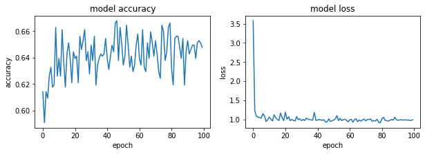

#### RMSprop - 0.5


```python
optimizer= tf.keras.optimizers.RMSprop(learning_rate=0.5)
model.compile(optimizer=optimizer,
              loss='sparse_categorical_crossentropy',
              metrics=['accuracy'])

history = model.fit(x_train_, y_train_, epochs=100)
model.evaluate(x_test_,  y_test_, verbose=2)
```

    Epoch 1/100
    19/19 [==============================] - 0s 1ms/step - loss: 1.0785 - accuracy: 0.6277
    Epoch 2/100
    19/19 [==============================] - 0s 2ms/step - loss: 0.9739 - accuracy: 0.6561
    Epoch 3/100
    19/19 [==============================] - 0s 2ms/step - loss: 0.9607 - accuracy: 0.6444
    Epoch 4/100
    19/19 [==============================] - 0s 2ms/step - loss: 1.0815 - accuracy: 0.6144
    Epoch 5/100
    19/19 [==============================] - 0s 2ms/step - loss: 0.9848 - accuracy: 0.6461
    Epoch 6/100
    19/19 [==============================] - 0s 1ms/step - loss: 1.0655 - accuracy: 0.6027
    Epoch 7/100
    19/19 [==============================] - 0s 1ms/step - loss: 0.9739 - accuracy: 0.6444
    Epoch 8/100
    19/19 [==============================] - 0s 1ms/step - loss: 1.0087 - accuracy: 0.6294
    Epoch 9/100
    19/19 [==============================] - 0s 1ms/step - loss: 1.0367 - accuracy: 0.6294
    Epoch 10/100
    19/19 [==============================] - 0s 2ms/step - loss: 1.0058 - accuracy: 0.6461
    Epoch 11/100
    19/19 [==============================] - 0s 2ms/step - loss: 0.9992 - accuracy: 0.6544
    Epoch 12/100
    19/19 [==============================] - 0s 1ms/step - loss: 1.0050 - accuracy: 0.6260
    Epoch 13/100
    19/19 [==============================] - 0s 1ms/step - loss: 1.0443 - accuracy: 0.6144
    Epoch 14/100
    19/19 [==============================] - 0s 1ms/step - loss: 1.0400 - accuracy: 0.6210
    Epoch 15/100
    19/19 [==============================] - 0s 1ms/step - loss: 1.0347 - accuracy: 0.6277
    Epoch 16/100
    19/19 [==============================] - 0s 1ms/step - loss: 0.9728 - accuracy: 0.6377
    Epoch 17/100
    19/19 [==============================] - 0s 1ms/step - loss: 1.0085 - accuracy: 0.6444
    Epoch 18/100
    19/19 [==============================] - 0s 2ms/step - loss: 7.7663 - accuracy: 0.6227
    Epoch 19/100
    19/19 [==============================] - 0s 2ms/step - loss: 1.1721 - accuracy: 0.5710
    Epoch 20/100
    19/19 [==============================] - 0s 1ms/step - loss: 1.1403 - accuracy: 0.5826
    Epoch 21/100
    19/19 [==============================] - 0s 1ms/step - loss: 1.1913 - accuracy: 0.5509
    Epoch 22/100
    19/19 [==============================] - 0s 1ms/step - loss: 1.1398 - accuracy: 0.5977
    Epoch 23/100
    19/19 [==============================] - 0s 1ms/step - loss: 1.1681 - accuracy: 0.5810
    Epoch 24/100
    19/19 [==============================] - 0s 2ms/step - loss: 1.1543 - accuracy: 0.5793
    Epoch 25/100
    19/19 [==============================] - 0s 1ms/step - loss: 1.1525 - accuracy: 0.5659
    Epoch 26/100
    19/19 [==============================] - 0s 1ms/step - loss: 1.1391 - accuracy: 0.6010
    Epoch 27/100
    19/19 [==============================] - 0s 2ms/step - loss: 1.1868 - accuracy: 0.5860
    Epoch 28/100
    19/19 [==============================] - 0s 2ms/step - loss: 1.1793 - accuracy: 0.5659
    Epoch 29/100
    19/19 [==============================] - 0s 2ms/step - loss: 1.1598 - accuracy: 0.5843
    Epoch 30/100
    19/19 [==============================] - 0s 1ms/step - loss: 1.1699 - accuracy: 0.5826
    Epoch 31/100
    19/19 [==============================] - 0s 2ms/step - loss: 1.1745 - accuracy: 0.5776
    Epoch 32/100
    19/19 [==============================] - 0s 1ms/step - loss: 1.1130 - accuracy: 0.5910
    Epoch 33/100
    19/19 [==============================] - 0s 2ms/step - loss: 1.1692 - accuracy: 0.5743
    Epoch 34/100
    19/19 [==============================] - 0s 3ms/step - loss: 1.2135 - accuracy: 0.5609
    Epoch 35/100
    19/19 [==============================] - 0s 3ms/step - loss: 1.1361 - accuracy: 0.5860
    Epoch 36/100
    19/19 [==============================] - 0s 2ms/step - loss: 1.1952 - accuracy: 0.5693
    Epoch 37/100
    19/19 [==============================] - 0s 3ms/step - loss: 1.1459 - accuracy: 0.5726
    Epoch 38/100
    19/19 [==============================] - 0s 3ms/step - loss: 1.1811 - accuracy: 0.5659
    Epoch 39/100
    19/19 [==============================] - 0s 3ms/step - loss: 1.1640 - accuracy: 0.5659
    Epoch 40/100
    19/19 [==============================] - 0s 2ms/step - loss: 1.1688 - accuracy: 0.5710
    Epoch 41/100
    19/19 [==============================] - 0s 2ms/step - loss: 1.1233 - accuracy: 0.6010
    Epoch 42/100
    19/19 [==============================] - 0s 2ms/step - loss: 1.1354 - accuracy: 0.5793
    Epoch 43/100
    19/19 [==============================] - 0s 1ms/step - loss: 1.1558 - accuracy: 0.5927
    Epoch 44/100
    19/19 [==============================] - 0s 1ms/step - loss: 1.1499 - accuracy: 0.5843
    Epoch 45/100
    19/19 [==============================] - 0s 2ms/step - loss: 1.1283 - accuracy: 0.5793
    Epoch 46/100
    19/19 [==============================] - 0s 1ms/step - loss: 1.0585 - accuracy: 0.6110
    Epoch 47/100
    19/19 [==============================] - 0s 1ms/step - loss: 1.1897 - accuracy: 0.5743
    Epoch 48/100
    19/19 [==============================] - 0s 1ms/step - loss: 1.1588 - accuracy: 0.5743
    Epoch 49/100
    19/19 [==============================] - 0s 1ms/step - loss: 1.1463 - accuracy: 0.5860
    Epoch 50/100
    19/19 [==============================] - 0s 1ms/step - loss: 1.1228 - accuracy: 0.6060
    Epoch 51/100
    19/19 [==============================] - 0s 2ms/step - loss: 1.1351 - accuracy: 0.5910
    Epoch 52/100
    19/19 [==============================] - 0s 1ms/step - loss: 1.1826 - accuracy: 0.5876
    Epoch 53/100
    19/19 [==============================] - 0s 1ms/step - loss: 1.1475 - accuracy: 0.5810
    Epoch 54/100
    19/19 [==============================] - 0s 2ms/step - loss: 1.1699 - accuracy: 0.5826
    Epoch 55/100
    19/19 [==============================] - 0s 1ms/step - loss: 1.1692 - accuracy: 0.5810
    Epoch 56/100
    19/19 [==============================] - 0s 1ms/step - loss: 1.1191 - accuracy: 0.6127
    Epoch 57/100
    19/19 [==============================] - 0s 1ms/step - loss: 1.1444 - accuracy: 0.5776
    Epoch 58/100
    19/19 [==============================] - 0s 1ms/step - loss: 1.1680 - accuracy: 0.5726
    Epoch 59/100
    19/19 [==============================] - 0s 1ms/step - loss: 1.1620 - accuracy: 0.5760
    Epoch 60/100
    19/19 [==============================] - 0s 1ms/step - loss: 1.1601 - accuracy: 0.5843
    Epoch 61/100
    19/19 [==============================] - 0s 2ms/step - loss: 1.1286 - accuracy: 0.5977
    Epoch 62/100
    19/19 [==============================] - 0s 1ms/step - loss: 1.1515 - accuracy: 0.5876
    Epoch 63/100
    19/19 [==============================] - 0s 1ms/step - loss: 1.1675 - accuracy: 0.5776
    Epoch 64/100
    19/19 [==============================] - 0s 1ms/step - loss: 1.1393 - accuracy: 0.5860
    Epoch 65/100
    19/19 [==============================] - 0s 1ms/step - loss: 1.1618 - accuracy: 0.5710
    Epoch 66/100
    19/19 [==============================] - 0s 1ms/step - loss: 1.1373 - accuracy: 0.6010
    Epoch 67/100
    19/19 [==============================] - 0s 1ms/step - loss: 1.1633 - accuracy: 0.5793
    Epoch 68/100
    19/19 [==============================] - 0s 1ms/step - loss: 1.1780 - accuracy: 0.5609
    Epoch 69/100
    19/19 [==============================] - 0s 1ms/step - loss: 1.1395 - accuracy: 0.5710
    Epoch 70/100
    19/19 [==============================] - 0s 1ms/step - loss: 1.1532 - accuracy: 0.5743
    Epoch 71/100
    19/19 [==============================] - 0s 1ms/step - loss: 1.1311 - accuracy: 0.5760
    Epoch 72/100
    19/19 [==============================] - 0s 1ms/step - loss: 1.1115 - accuracy: 0.5927
    Epoch 73/100
    19/19 [==============================] - 0s 1ms/step - loss: 1.1878 - accuracy: 0.5676
    Epoch 74/100
    19/19 [==============================] - 0s 1ms/step - loss: 1.1115 - accuracy: 0.6144
    Epoch 75/100
    19/19 [==============================] - 0s 1ms/step - loss: 1.1523 - accuracy: 0.5743
    Epoch 76/100
    19/19 [==============================] - 0s 1ms/step - loss: 1.1337 - accuracy: 0.5793
    Epoch 77/100
    19/19 [==============================] - 0s 1ms/step - loss: 1.1646 - accuracy: 0.5509
    Epoch 78/100
    19/19 [==============================] - 0s 1ms/step - loss: 1.1656 - accuracy: 0.5776
    Epoch 79/100
    19/19 [==============================] - 0s 1ms/step - loss: 1.1532 - accuracy: 0.5726
    Epoch 80/100
    19/19 [==============================] - 0s 1ms/step - loss: 1.1623 - accuracy: 0.5826
    Epoch 81/100
    19/19 [==============================] - 0s 1ms/step - loss: 1.2072 - accuracy: 0.5593
    Epoch 82/100
    19/19 [==============================] - 0s 1ms/step - loss: 1.0850 - accuracy: 0.6194
    Epoch 83/100
    19/19 [==============================] - 0s 1ms/step - loss: 1.0856 - accuracy: 0.6144
    Epoch 84/100
    19/19 [==============================] - 0s 1ms/step - loss: 1.1992 - accuracy: 0.5776
    Epoch 85/100
    19/19 [==============================] - 0s 1ms/step - loss: 1.1656 - accuracy: 0.5760
    Epoch 86/100
    19/19 [==============================] - 0s 1ms/step - loss: 1.1017 - accuracy: 0.6093
    Epoch 87/100
    19/19 [==============================] - 0s 1ms/step - loss: 1.1530 - accuracy: 0.5893
    Epoch 88/100
    19/19 [==============================] - 0s 1ms/step - loss: 1.1252 - accuracy: 0.5793
    Epoch 89/100
    19/19 [==============================] - 0s 1ms/step - loss: 1.1100 - accuracy: 0.6027
    Epoch 90/100
    19/19 [==============================] - 0s 1ms/step - loss: 1.1714 - accuracy: 0.5676
    Epoch 91/100
    19/19 [==============================] - 0s 1ms/step - loss: 1.1748 - accuracy: 0.5659
    Epoch 92/100
    19/19 [==============================] - 0s 1ms/step - loss: 1.1967 - accuracy: 0.5726
    Epoch 93/100
    19/19 [==============================] - 0s 1ms/step - loss: 1.1365 - accuracy: 0.5643
    Epoch 94/100
    19/19 [==============================] - 0s 1ms/step - loss: 1.1350 - accuracy: 0.5793
    Epoch 95/100
    19/19 [==============================] - 0s 1ms/step - loss: 1.1494 - accuracy: 0.5960
    Epoch 96/100
    19/19 [==============================] - 0s 1ms/step - loss: 1.1758 - accuracy: 0.5793
    Epoch 97/100
    19/19 [==============================] - 0s 1ms/step - loss: 1.1508 - accuracy: 0.5793
    Epoch 98/100
    19/19 [==============================] - 0s 1ms/step - loss: 1.1662 - accuracy: 0.5776
    Epoch 99/100
    19/19 [==============================] - 0s 1ms/step - loss: 1.1399 - accuracy: 0.5726
    Epoch 100/100
    19/19 [==============================] - 0s 1ms/step - loss: 1.1620 - accuracy: 0.5643
    19/19 - 0s - loss: 3.4749 - accuracy: 0.5442
    


    [3.474872350692749, 0.544240415096283]


```python
fig, (ax1, ax2) = plt.subplots(1, 2, figsize=(10, 3))

#ax1.subplot(1, 2, 1)
ax1.plot(history.history['accuracy'])
#plt.plot(history.history['val_accuracy'])
ax1.set_title('model accuracy')
ax1.set_ylabel('accuracy')
ax1.set_xlabel('epoch')
#ax1.show()

#ax2.subplot(1, 2, 2)
ax2.plot(history.history['loss'])
#plt.plot(history.history['val_loss'])
ax2.set_title('model loss')
ax2.set_ylabel('loss')
ax2.set_xlabel('epoch')
```


#### RMSprop - 0.9


```python
optimizer= tf.keras.optimizers.RMSprop(learning_rate=0.9)
model.compile(optimizer=optimizer,
              loss='sparse_categorical_crossentropy',
              metrics=['accuracy'])

history = model.fit(x_train_, y_train_, epochs=100)
model.evaluate(x_test_,  y_test_, verbose=2)
```

    Epoch 1/100
    19/19 [==============================] - 0s 2ms/step - loss: 1.2783 - accuracy: 0.5843
    Epoch 2/100
    19/19 [==============================] - 0s 1ms/step - loss: 1.2260 - accuracy: 0.5626
    Epoch 3/100
    19/19 [==============================] - 0s 1ms/step - loss: 1.2268 - accuracy: 0.5576
    Epoch 4/100
    19/19 [==============================] - 0s 2ms/step - loss: 1.2100 - accuracy: 0.5776
    Epoch 5/100
    19/19 [==============================] - 0s 2ms/step - loss: 1.1949 - accuracy: 0.5576
    Epoch 6/100
    19/19 [==============================] - 0s 2ms/step - loss: 1.2422 - accuracy: 0.5609
    Epoch 7/100
    19/19 [==============================] - 0s 2ms/step - loss: 1.1668 - accuracy: 0.5977
    Epoch 8/100
    19/19 [==============================] - 0s 1ms/step - loss: 1.2185 - accuracy: 0.5609
    Epoch 9/100
    19/19 [==============================] - 0s 2ms/step - loss: 1.2206 - accuracy: 0.5977
    Epoch 10/100
    19/19 [==============================] - 0s 1ms/step - loss: 1.2214 - accuracy: 0.5426
    Epoch 11/100
    19/19 [==============================] - 0s 2ms/step - loss: 1.2344 - accuracy: 0.5543
    Epoch 12/100
    19/19 [==============================] - 0s 2ms/step - loss: 1.2771 - accuracy: 0.5526
    Epoch 13/100
    19/19 [==============================] - 0s 2ms/step - loss: 1.2085 - accuracy: 0.5793
    Epoch 14/100
    19/19 [==============================] - 0s 1ms/step - loss: 1.2119 - accuracy: 0.5743
    Epoch 15/100
    19/19 [==============================] - 0s 1ms/step - loss: 1.2015 - accuracy: 0.5793
    Epoch 16/100
    19/19 [==============================] - 0s 1ms/step - loss: 1.1971 - accuracy: 0.5693
    Epoch 17/100
    19/19 [==============================] - 0s 1ms/step - loss: 1.1965 - accuracy: 0.5710
    Epoch 18/100
    19/19 [==============================] - 0s 1ms/step - loss: 1.1715 - accuracy: 0.5843
    Epoch 19/100
    19/19 [==============================] - 0s 1ms/step - loss: 1.2251 - accuracy: 0.5676
    Epoch 20/100
    19/19 [==============================] - 0s 1ms/step - loss: 1.2426 - accuracy: 0.5743
    Epoch 21/100
    19/19 [==============================] - 0s 1ms/step - loss: 1.2257 - accuracy: 0.5743
    Epoch 22/100
    19/19 [==============================] - 0s 2ms/step - loss: 1.2310 - accuracy: 0.5609
    Epoch 23/100
    19/19 [==============================] - 0s 1ms/step - loss: 1.2133 - accuracy: 0.5793
    Epoch 24/100
    19/19 [==============================] - 0s 1ms/step - loss: 1.2840 - accuracy: 0.5409
    Epoch 25/100
    19/19 [==============================] - 0s 2ms/step - loss: 1.2163 - accuracy: 0.5743
    Epoch 26/100
    19/19 [==============================] - 0s 1ms/step - loss: 1.2106 - accuracy: 0.5893
    Epoch 27/100
    19/19 [==============================] - 0s 1ms/step - loss: 1.1690 - accuracy: 0.5760
    Epoch 28/100
    19/19 [==============================] - 0s 1ms/step - loss: 1.2759 - accuracy: 0.5459
    Epoch 29/100
    19/19 [==============================] - 0s 1ms/step - loss: 1.1493 - accuracy: 0.5910
    Epoch 30/100
    19/19 [==============================] - 0s 2ms/step - loss: 1.2037 - accuracy: 0.5826
    Epoch 31/100
    19/19 [==============================] - 0s 1ms/step - loss: 1.1500 - accuracy: 0.5876
    Epoch 32/100
    19/19 [==============================] - 0s 1ms/step - loss: 1.2449 - accuracy: 0.5593
    Epoch 33/100
    19/19 [==============================] - 0s 2ms/step - loss: 1.2285 - accuracy: 0.5576
    Epoch 34/100
    19/19 [==============================] - 0s 2ms/step - loss: 1.2355 - accuracy: 0.5693
    Epoch 35/100
    19/19 [==============================] - 0s 1ms/step - loss: 1.1939 - accuracy: 0.5860
    Epoch 36/100
    19/19 [==============================] - 0s 2ms/step - loss: 1.2617 - accuracy: 0.5509
    Epoch 37/100
    19/19 [==============================] - 0s 1ms/step - loss: 1.1526 - accuracy: 0.6110
    Epoch 38/100
    19/19 [==============================] - 0s 1ms/step - loss: 1.1972 - accuracy: 0.5710
    Epoch 39/100
    19/19 [==============================] - 0s 1ms/step - loss: 1.2124 - accuracy: 0.5810
    Epoch 40/100
    19/19 [==============================] - 0s 1ms/step - loss: 1.2299 - accuracy: 0.5659
    Epoch 41/100
    19/19 [==============================] - 0s 1ms/step - loss: 1.1575 - accuracy: 0.5893
    Epoch 42/100
    19/19 [==============================] - 0s 1ms/step - loss: 1.1694 - accuracy: 0.5810
    Epoch 43/100
    19/19 [==============================] - 0s 1ms/step - loss: 1.2355 - accuracy: 0.5693
    Epoch 44/100
    19/19 [==============================] - 0s 2ms/step - loss: 1.1941 - accuracy: 0.5943
    Epoch 45/100
    19/19 [==============================] - 0s 1ms/step - loss: 1.2058 - accuracy: 0.5710
    Epoch 46/100
    19/19 [==============================] - 0s 1ms/step - loss: 1.2513 - accuracy: 0.5526
    Epoch 47/100
    19/19 [==============================] - 0s 2ms/step - loss: 1.1616 - accuracy: 0.5927
    Epoch 48/100
    19/19 [==============================] - 0s 1ms/step - loss: 1.1894 - accuracy: 0.5860
    Epoch 49/100
    19/19 [==============================] - 0s 1ms/step - loss: 1.2482 - accuracy: 0.5693
    Epoch 50/100
    19/19 [==============================] - 0s 1ms/step - loss: 1.2447 - accuracy: 0.5559
    Epoch 51/100
    19/19 [==============================] - 0s 1ms/step - loss: 1.1695 - accuracy: 0.5843
    Epoch 52/100
    19/19 [==============================] - 0s 1ms/step - loss: 1.1487 - accuracy: 0.5843
    Epoch 53/100
    19/19 [==============================] - 0s 1ms/step - loss: 1.2610 - accuracy: 0.5576
    Epoch 54/100
    19/19 [==============================] - 0s 1ms/step - loss: 1.1636 - accuracy: 0.5743
    Epoch 55/100
    19/19 [==============================] - 0s 1ms/step - loss: 1.2430 - accuracy: 0.5643
    Epoch 56/100
    19/19 [==============================] - 0s 1ms/step - loss: 1.1997 - accuracy: 0.5760
    Epoch 57/100
    19/19 [==============================] - 0s 1ms/step - loss: 1.2639 - accuracy: 0.5559
    Epoch 58/100
    19/19 [==============================] - 0s 1ms/step - loss: 1.2305 - accuracy: 0.5910
    Epoch 59/100
    19/19 [==============================] - 0s 1ms/step - loss: 1.2518 - accuracy: 0.5576
    Epoch 60/100
    19/19 [==============================] - 0s 1ms/step - loss: 1.2700 - accuracy: 0.5509
    Epoch 61/100
    19/19 [==============================] - 0s 1ms/step - loss: 1.1462 - accuracy: 0.5743
    Epoch 62/100
    19/19 [==============================] - 0s 1ms/step - loss: 1.2366 - accuracy: 0.5693
    Epoch 63/100
    19/19 [==============================] - 0s 1ms/step - loss: 1.2249 - accuracy: 0.5643
    Epoch 64/100
    19/19 [==============================] - 0s 1ms/step - loss: 1.1432 - accuracy: 0.5843
    Epoch 65/100
    19/19 [==============================] - 0s 1ms/step - loss: 1.2630 - accuracy: 0.5509
    Epoch 66/100
    19/19 [==============================] - 0s 1ms/step - loss: 1.2379 - accuracy: 0.5726
    Epoch 67/100
    19/19 [==============================] - 0s 1ms/step - loss: 1.1971 - accuracy: 0.5910
    Epoch 68/100
    19/19 [==============================] - 0s 1ms/step - loss: 1.2570 - accuracy: 0.5626
    Epoch 69/100
    19/19 [==============================] - 0s 1ms/step - loss: 1.2120 - accuracy: 0.5843
    Epoch 70/100
    19/19 [==============================] - 0s 1ms/step - loss: 1.1599 - accuracy: 0.6093
    Epoch 71/100
    19/19 [==============================] - 0s 1ms/step - loss: 1.2501 - accuracy: 0.5543
    Epoch 72/100
    19/19 [==============================] - 0s 1ms/step - loss: 1.1872 - accuracy: 0.5843
    Epoch 73/100
    19/19 [==============================] - 0s 1ms/step - loss: 1.2062 - accuracy: 0.5760
    Epoch 74/100
    19/19 [==============================] - 0s 1ms/step - loss: 1.2241 - accuracy: 0.5760
    Epoch 75/100
    19/19 [==============================] - 0s 1ms/step - loss: 1.1701 - accuracy: 0.5826
    Epoch 76/100
    19/19 [==============================] - 0s 1ms/step - loss: 1.1854 - accuracy: 0.5826
    Epoch 77/100
    19/19 [==============================] - 0s 1ms/step - loss: 1.2149 - accuracy: 0.5693
    Epoch 78/100
    19/19 [==============================] - 0s 1ms/step - loss: 1.2119 - accuracy: 0.5676
    Epoch 79/100
    19/19 [==============================] - 0s 1ms/step - loss: 1.2027 - accuracy: 0.5843
    Epoch 80/100
    19/19 [==============================] - 0s 1ms/step - loss: 1.2206 - accuracy: 0.5559
    Epoch 81/100
    19/19 [==============================] - 0s 1ms/step - loss: 1.1957 - accuracy: 0.5693
    Epoch 82/100
    19/19 [==============================] - 0s 1ms/step - loss: 1.1958 - accuracy: 0.5927
    Epoch 83/100
    19/19 [==============================] - 0s 1ms/step - loss: 1.1850 - accuracy: 0.5726
    Epoch 84/100
    19/19 [==============================] - 0s 1ms/step - loss: 1.2391 - accuracy: 0.5760
    Epoch 85/100
    19/19 [==============================] - 0s 1ms/step - loss: 1.1874 - accuracy: 0.5760
    Epoch 86/100
    19/19 [==============================] - 0s 1ms/step - loss: 1.2469 - accuracy: 0.5609
    Epoch 87/100
    19/19 [==============================] - 0s 1ms/step - loss: 70.3396 - accuracy: 0.5710
    Epoch 88/100
    19/19 [==============================] - 0s 1ms/step - loss: 1.1479 - accuracy: 0.5943
    Epoch 89/100
    19/19 [==============================] - 0s 1ms/step - loss: 1.1617 - accuracy: 0.5743
    Epoch 90/100
    19/19 [==============================] - 0s 1ms/step - loss: 1.1656 - accuracy: 0.5860
    Epoch 91/100
    19/19 [==============================] - 0s 1ms/step - loss: 1.1522 - accuracy: 0.6010
    Epoch 92/100
    19/19 [==============================] - 0s 1ms/step - loss: 1.1962 - accuracy: 0.5743
    Epoch 93/100
    19/19 [==============================] - 0s 1ms/step - loss: 1.3030 - accuracy: 0.5292
    Epoch 94/100
    19/19 [==============================] - 0s 1ms/step - loss: 1.1839 - accuracy: 0.5676
    Epoch 95/100
    19/19 [==============================] - 0s 1ms/step - loss: 1.1671 - accuracy: 0.5860
    Epoch 96/100
    19/19 [==============================] - 0s 1ms/step - loss: 1.1578 - accuracy: 0.5776
    Epoch 97/100
    19/19 [==============================] - 0s 1ms/step - loss: 1.2475 - accuracy: 0.5693
    Epoch 98/100
    19/19 [==============================] - 0s 1ms/step - loss: 1.2393 - accuracy: 0.5676
    Epoch 99/100
    19/19 [==============================] - 0s 1ms/step - loss: 1.1794 - accuracy: 0.5810
    Epoch 100/100
    19/19 [==============================] - 0s 1ms/step - loss: 1.2256 - accuracy: 0.5526
    19/19 - 0s - loss: 10.1027 - accuracy: 0.5058
    


    [10.102655410766602, 0.5058430433273315]


```python
fig, (ax1, ax2) = plt.subplots(1, 2, figsize=(10, 3))

#ax1.subplot(1, 2, 1)
ax1.plot(history.history['accuracy'])
#plt.plot(history.history['val_accuracy'])
ax1.set_title('model accuracy')
ax1.set_ylabel('accuracy')
ax1.set_xlabel('epoch')
#ax1.show()

#ax2.subplot(1, 2, 2)
ax2.plot(history.history['loss'])
#plt.plot(history.history['val_loss'])
ax2.set_title('model loss')
ax2.set_ylabel('loss')
ax2.set_xlabel('epoch')
```


#### RMSprop - 1.5


```python
optimizer= tf.keras.optimizers.RMSprop(learning_rate=1.5)
model.compile(optimizer=optimizer,
              loss='sparse_categorical_crossentropy',
              metrics=['accuracy'])

history = model.fit(x_train_, y_train_, epochs=100)
model.evaluate(x_test_,  y_test_, verbose=2)
```

    Epoch 1/100
    19/19 [==============================] - 0s 1ms/step - loss: 1.6095 - accuracy: 0.5860
    Epoch 2/100
    19/19 [==============================] - 0s 1ms/step - loss: 1.3837 - accuracy: 0.5359
    Epoch 3/100
    19/19 [==============================] - 0s 1ms/step - loss: 1.3405 - accuracy: 0.5693
    Epoch 4/100
    19/19 [==============================] - 0s 2ms/step - loss: 1.2866 - accuracy: 0.5760
    Epoch 5/100
    19/19 [==============================] - 0s 2ms/step - loss: 1.3568 - accuracy: 0.5609
    Epoch 6/100
    19/19 [==============================] - 0s 2ms/step - loss: 1.3687 - accuracy: 0.5459
    Epoch 7/100
    19/19 [==============================] - 0s 2ms/step - loss: 1.3287 - accuracy: 0.5843
    Epoch 8/100
    19/19 [==============================] - 0s 2ms/step - loss: 1.2973 - accuracy: 0.5810
    Epoch 9/100
    19/19 [==============================] - 0s 2ms/step - loss: 1.3738 - accuracy: 0.5492
    Epoch 10/100
    19/19 [==============================] - 0s 2ms/step - loss: 1.3123 - accuracy: 0.5492
    Epoch 11/100
    19/19 [==============================] - 0s 1ms/step - loss: 1.4047 - accuracy: 0.5543
    Epoch 12/100
    19/19 [==============================] - 0s 2ms/step - loss: 1.3325 - accuracy: 0.5576
    Epoch 13/100
    19/19 [==============================] - 0s 1ms/step - loss: 1.3485 - accuracy: 0.5442
    Epoch 14/100
    19/19 [==============================] - 0s 2ms/step - loss: 1.3085 - accuracy: 0.5776
    Epoch 15/100
    19/19 [==============================] - 0s 2ms/step - loss: 1.3989 - accuracy: 0.5509
    Epoch 16/100
    19/19 [==============================] - 0s 2ms/step - loss: 1.3947 - accuracy: 0.5392
    Epoch 17/100
    19/19 [==============================] - 0s 1ms/step - loss: 1.4890 - accuracy: 0.5275
    Epoch 18/100
    19/19 [==============================] - 0s 1ms/step - loss: 1.3458 - accuracy: 0.5492
    Epoch 19/100
    19/19 [==============================] - 0s 2ms/step - loss: 1.3245 - accuracy: 0.5659
    Epoch 20/100
    19/19 [==============================] - 0s 1ms/step - loss: 1.4648 - accuracy: 0.5359
    Epoch 21/100
    19/19 [==============================] - 0s 1ms/step - loss: 1.3780 - accuracy: 0.5476
    Epoch 22/100
    19/19 [==============================] - 0s 1ms/step - loss: 1.3334 - accuracy: 0.5376
    Epoch 23/100
    19/19 [==============================] - 0s 2ms/step - loss: 1.3646 - accuracy: 0.5509
    Epoch 24/100
    19/19 [==============================] - 0s 1ms/step - loss: 1.3612 - accuracy: 0.5543
    Epoch 25/100
    19/19 [==============================] - 0s 1ms/step - loss: 1.3786 - accuracy: 0.5459
    Epoch 26/100
    19/19 [==============================] - 0s 1ms/step - loss: 1.3320 - accuracy: 0.5609
    Epoch 27/100
    19/19 [==============================] - 0s 1ms/step - loss: 1.4309 - accuracy: 0.5326
    Epoch 28/100
    19/19 [==============================] - 0s 2ms/step - loss: 1.2830 - accuracy: 0.5659
    Epoch 29/100
    19/19 [==============================] - 0s 2ms/step - loss: 1.4003 - accuracy: 0.5492
    Epoch 30/100
    19/19 [==============================] - 0s 1ms/step - loss: 1.3873 - accuracy: 0.5526
    Epoch 31/100
    19/19 [==============================] - 0s 1ms/step - loss: 1.3466 - accuracy: 0.5576
    Epoch 32/100
    19/19 [==============================] - 0s 1ms/step - loss: 1.4160 - accuracy: 0.5476
    Epoch 33/100
    19/19 [==============================] - 0s 1ms/step - loss: 1.4147 - accuracy: 0.5576
    Epoch 34/100
    19/19 [==============================] - 0s 1ms/step - loss: 1.3493 - accuracy: 0.5576
    Epoch 35/100
    19/19 [==============================] - 0s 2ms/step - loss: 1.4362 - accuracy: 0.5259
    Epoch 36/100
    19/19 [==============================] - 0s 1ms/step - loss: 1.2680 - accuracy: 0.5659
    Epoch 37/100
    19/19 [==============================] - 0s 2ms/step - loss: 1.3667 - accuracy: 0.5593
    Epoch 38/100
    19/19 [==============================] - 0s 2ms/step - loss: 1.4140 - accuracy: 0.5409
    Epoch 39/100
    19/19 [==============================] - 0s 1ms/step - loss: 1.3007 - accuracy: 0.5676
    Epoch 40/100
    19/19 [==============================] - 0s 2ms/step - loss: 1.4410 - accuracy: 0.5409
    Epoch 41/100
    19/19 [==============================] - 0s 1ms/step - loss: 1.3284 - accuracy: 0.5643
    Epoch 42/100
    19/19 [==============================] - 0s 1ms/step - loss: 1.3565 - accuracy: 0.5492
    Epoch 43/100
    19/19 [==============================] - 0s 2ms/step - loss: 1.3537 - accuracy: 0.5743
    Epoch 44/100
    19/19 [==============================] - 0s 1ms/step - loss: 1.3463 - accuracy: 0.5743
    Epoch 45/100
    19/19 [==============================] - 0s 1ms/step - loss: 1.3596 - accuracy: 0.5609
    Epoch 46/100
    19/19 [==============================] - 0s 1ms/step - loss: 1.3004 - accuracy: 0.5726
    Epoch 47/100
    19/19 [==============================] - 0s 1ms/step - loss: 1.3837 - accuracy: 0.5409
    Epoch 48/100
    19/19 [==============================] - 0s 2ms/step - loss: 1.3715 - accuracy: 0.5476
    Epoch 49/100
    19/19 [==============================] - 0s 1ms/step - loss: 1.3316 - accuracy: 0.5526
    Epoch 50/100
    19/19 [==============================] - 0s 1ms/step - loss: 1.3990 - accuracy: 0.5459
    Epoch 51/100
    19/19 [==============================] - 0s 2ms/step - loss: 1.3427 - accuracy: 0.5459
    Epoch 52/100
    19/19 [==============================] - 0s 1ms/step - loss: 1.3563 - accuracy: 0.5710
    Epoch 53/100
    19/19 [==============================] - 0s 1ms/step - loss: 1.4044 - accuracy: 0.5392
    Epoch 54/100
    19/19 [==============================] - 0s 1ms/step - loss: 1.3041 - accuracy: 0.5626
    Epoch 55/100
    19/19 [==============================] - 0s 1ms/step - loss: 1.3729 - accuracy: 0.5693
    Epoch 56/100
    19/19 [==============================] - 0s 2ms/step - loss: 1.4048 - accuracy: 0.5476
    Epoch 57/100
    19/19 [==============================] - 0s 1ms/step - loss: 1.3822 - accuracy: 0.5309
    Epoch 58/100
    19/19 [==============================] - 0s 1ms/step - loss: 1.4041 - accuracy: 0.5359
    Epoch 59/100
    19/19 [==============================] - 0s 1ms/step - loss: 1.2891 - accuracy: 0.5760
    Epoch 60/100
    19/19 [==============================] - 0s 1ms/step - loss: 1.3649 - accuracy: 0.5593
    Epoch 61/100
    19/19 [==============================] - 0s 1ms/step - loss: 1.3217 - accuracy: 0.5626
    Epoch 62/100
    19/19 [==============================] - 0s 1ms/step - loss: 1.3397 - accuracy: 0.5593
    Epoch 63/100
    19/19 [==============================] - 0s 1ms/step - loss: 1.4171 - accuracy: 0.5409
    Epoch 64/100
    19/19 [==============================] - 0s 1ms/step - loss: 1.3721 - accuracy: 0.5392
    Epoch 65/100
    19/19 [==============================] - 0s 1ms/step - loss: 1.3085 - accuracy: 0.5576
    Epoch 66/100
    19/19 [==============================] - 0s 1ms/step - loss: 1.4389 - accuracy: 0.5359
    Epoch 67/100
    19/19 [==============================] - 0s 1ms/step - loss: 1.4295 - accuracy: 0.5459
    Epoch 68/100
    19/19 [==============================] - 0s 1ms/step - loss: 1.3120 - accuracy: 0.5576
    Epoch 69/100
    19/19 [==============================] - 0s 1ms/step - loss: 1.3446 - accuracy: 0.5659
    Epoch 70/100
    19/19 [==============================] - 0s 1ms/step - loss: 1.3679 - accuracy: 0.5509
    Epoch 71/100
    19/19 [==============================] - 0s 1ms/step - loss: 1.3368 - accuracy: 0.5609
    Epoch 72/100
    19/19 [==============================] - 0s 1ms/step - loss: 1.4040 - accuracy: 0.5292
    Epoch 73/100
    19/19 [==============================] - 0s 1ms/step - loss: 1.3513 - accuracy: 0.5576
    Epoch 74/100
    19/19 [==============================] - 0s 1ms/step - loss: 1.3623 - accuracy: 0.5442
    Epoch 75/100
    19/19 [==============================] - 0s 1ms/step - loss: 1.4030 - accuracy: 0.5559
    Epoch 76/100
    19/19 [==============================] - 0s 1ms/step - loss: 1.4044 - accuracy: 0.5209
    Epoch 77/100
    19/19 [==============================] - 0s 1ms/step - loss: 1.3049 - accuracy: 0.5409
    Epoch 78/100
    19/19 [==============================] - 0s 1ms/step - loss: 1.4507 - accuracy: 0.5259
    Epoch 79/100
    19/19 [==============================] - 0s 2ms/step - loss: 1.3359 - accuracy: 0.5776
    Epoch 80/100
    19/19 [==============================] - 0s 1ms/step - loss: 1.3104 - accuracy: 0.5726
    Epoch 81/100
    19/19 [==============================] - 0s 1ms/step - loss: 1.3559 - accuracy: 0.5442
    Epoch 82/100
    19/19 [==============================] - 0s 1ms/step - loss: 1.3720 - accuracy: 0.5442
    Epoch 83/100
    19/19 [==============================] - 0s 1ms/step - loss: 1.3616 - accuracy: 0.5492
    Epoch 84/100
    19/19 [==============================] - 0s 1ms/step - loss: 1.2856 - accuracy: 0.5826
    Epoch 85/100
    19/19 [==============================] - 0s 1ms/step - loss: 1.4878 - accuracy: 0.5242
    Epoch 86/100
    19/19 [==============================] - 0s 1ms/step - loss: 1.3703 - accuracy: 0.5376
    Epoch 87/100
    19/19 [==============================] - 0s 1ms/step - loss: 1.3858 - accuracy: 0.5342
    Epoch 88/100
    19/19 [==============================] - 0s 1ms/step - loss: 1.3730 - accuracy: 0.5476
    Epoch 89/100
    19/19 [==============================] - 0s 1ms/step - loss: 1.4045 - accuracy: 0.5309
    Epoch 90/100
    19/19 [==============================] - 0s 1ms/step - loss: 1.3495 - accuracy: 0.5576
    Epoch 91/100
    19/19 [==============================] - 0s 1ms/step - loss: 1.4245 - accuracy: 0.5342
    Epoch 92/100
    19/19 [==============================] - 0s 1ms/step - loss: 1.3535 - accuracy: 0.5576
    Epoch 93/100
    19/19 [==============================] - 0s 1ms/step - loss: 1.2690 - accuracy: 0.5776
    Epoch 94/100
    19/19 [==============================] - 0s 1ms/step - loss: 1.4143 - accuracy: 0.5509
    Epoch 95/100
    19/19 [==============================] - 0s 1ms/step - loss: 1.4045 - accuracy: 0.5326
    Epoch 96/100
    19/19 [==============================] - 0s 1ms/step - loss: 1.3307 - accuracy: 0.5576
    Epoch 97/100
    19/19 [==============================] - 0s 1ms/step - loss: 1.3732 - accuracy: 0.5559
    Epoch 98/100
    19/19 [==============================] - 0s 1ms/step - loss: 1.3373 - accuracy: 0.5643
    Epoch 99/100
    19/19 [==============================] - 0s 1ms/step - loss: 1.3586 - accuracy: 0.5492
    Epoch 100/100
    19/19 [==============================] - 0s 1ms/step - loss: 1.3548 - accuracy: 0.5492
    19/19 - 0s - loss: 10.1099 - accuracy: 0.5426
    


    [10.109903335571289, 0.542570948600769]


```python
fig, (ax1, ax2) = plt.subplots(1, 2, figsize=(10, 3))

#ax1.subplot(1, 2, 1)
ax1.plot(history.history['accuracy'])
#plt.plot(history.history['val_accuracy'])
ax1.set_title('model accuracy')
ax1.set_ylabel('accuracy')
ax1.set_xlabel('epoch')
#ax1.show()

#ax2.subplot(1, 2, 2)
ax2.plot(history.history['loss'])
#plt.plot(history.history['val_loss'])
ax2.set_title('model loss')
ax2.set_ylabel('loss')
ax2.set_xlabel('epoch')
```


#### Adagram - 0.001


```python
optimizer= tf.keras.optimizers.Adagrad(learning_rate=0.001)
model.compile(optimizer=optimizer,
              loss='sparse_categorical_crossentropy',
              metrics=['accuracy'])
#history = model.fit(X, Y, validation_split=0.33, epochs=150, batch_size=10, verbose=0)
history = model.fit(x_train_, y_train_, epochs=100)
model.evaluate(x_test_,  y_test_, verbose=2)
```

    Epoch 1/100
    19/19 [==============================] - 0s 1ms/step - loss: 1.1590 - accuracy: 0.6060
    Epoch 2/100
    19/19 [==============================] - 0s 1ms/step - loss: 1.1883 - accuracy: 0.5910
    Epoch 3/100
    19/19 [==============================] - 0s 1ms/step - loss: 1.2095 - accuracy: 0.5876
    Epoch 4/100
    19/19 [==============================] - 0s 2ms/step - loss: 1.2226 - accuracy: 0.5843
    Epoch 5/100
    19/19 [==============================] - 0s 2ms/step - loss: 1.2701 - accuracy: 0.5760
    Epoch 6/100
    19/19 [==============================] - 0s 2ms/step - loss: 1.2676 - accuracy: 0.5810
    Epoch 7/100
    19/19 [==============================] - 0s 2ms/step - loss: 1.2414 - accuracy: 0.5793
    Epoch 8/100
    19/19 [==============================] - 0s 2ms/step - loss: 1.1987 - accuracy: 0.5910
    Epoch 9/100
    19/19 [==============================] - 0s 2ms/step - loss: 1.2127 - accuracy: 0.5876
    Epoch 10/100
    19/19 [==============================] - 0s 2ms/step - loss: 1.2312 - accuracy: 0.5860
    Epoch 11/100
    19/19 [==============================] - 0s 2ms/step - loss: 1.1658 - accuracy: 0.6010
    Epoch 12/100
    19/19 [==============================] - 0s 2ms/step - loss: 1.1412 - accuracy: 0.6060
    Epoch 13/100
    19/19 [==============================] - 0s 2ms/step - loss: 1.2298 - accuracy: 0.5843
    Epoch 14/100
    19/19 [==============================] - 0s 2ms/step - loss: 1.1691 - accuracy: 0.5977
    Epoch 15/100
    19/19 [==============================] - 0s 2ms/step - loss: 1.1620 - accuracy: 0.5993
    Epoch 16/100
    19/19 [==============================] - 0s 1ms/step - loss: 1.1485 - accuracy: 0.6043
    Epoch 17/100
    19/19 [==============================] - 0s 1ms/step - loss: 1.2465 - accuracy: 0.5810
    Epoch 18/100
    19/19 [==============================] - 0s 1ms/step - loss: 1.1684 - accuracy: 0.6010
    Epoch 19/100
    19/19 [==============================] - 0s 1ms/step - loss: 1.1362 - accuracy: 0.6077
    Epoch 20/100
    19/19 [==============================] - 0s 2ms/step - loss: 1.1807 - accuracy: 0.5993
    Epoch 21/100
    19/19 [==============================] - 0s 1ms/step - loss: 1.1435 - accuracy: 0.6110
    Epoch 22/100
    19/19 [==============================] - 0s 1ms/step - loss: 1.2134 - accuracy: 0.5810
    Epoch 23/100
    19/19 [==============================] - 0s 1ms/step - loss: 1.2045 - accuracy: 0.5927
    Epoch 24/100
    19/19 [==============================] - 0s 1ms/step - loss: 1.2186 - accuracy: 0.5776
    Epoch 25/100
    19/19 [==============================] - 0s 1ms/step - loss: 1.2871 - accuracy: 0.5710
    Epoch 26/100
    19/19 [==============================] - 0s 1ms/step - loss: 1.2336 - accuracy: 0.5860
    Epoch 27/100
    19/19 [==============================] - 0s 1ms/step - loss: 1.2227 - accuracy: 0.5860
    Epoch 28/100
    19/19 [==============================] - 0s 1ms/step - loss: 1.2127 - accuracy: 0.5876
    Epoch 29/100
    19/19 [==============================] - 0s 1ms/step - loss: 1.2278 - accuracy: 0.5793
    Epoch 30/100
    19/19 [==============================] - 0s 1ms/step - loss: 1.2256 - accuracy: 0.5860
    Epoch 31/100
    19/19 [==============================] - 0s 1ms/step - loss: 1.1949 - accuracy: 0.5910
    Epoch 32/100
    19/19 [==============================] - 0s 1ms/step - loss: 1.2592 - accuracy: 0.5793
    Epoch 33/100
    19/19 [==============================] - 0s 1ms/step - loss: 1.2101 - accuracy: 0.5893
    Epoch 34/100
    19/19 [==============================] - 0s 1ms/step - loss: 1.1858 - accuracy: 0.5943
    Epoch 35/100
    19/19 [==============================] - 0s 1ms/step - loss: 1.2213 - accuracy: 0.5826
    Epoch 36/100
    19/19 [==============================] - 0s 1ms/step - loss: 1.2473 - accuracy: 0.5776
    Epoch 37/100
    19/19 [==============================] - 0s 1ms/step - loss: 1.2033 - accuracy: 0.5943
    Epoch 38/100
    19/19 [==============================] - 0s 1ms/step - loss: 1.1749 - accuracy: 0.5927
    Epoch 39/100
    19/19 [==============================] - 0s 1ms/step - loss: 1.2390 - accuracy: 0.5793
    Epoch 40/100
    19/19 [==============================] - 0s 1ms/step - loss: 1.2107 - accuracy: 0.5876
    Epoch 41/100
    19/19 [==============================] - 0s 1ms/step - loss: 1.2096 - accuracy: 0.5876
    Epoch 42/100
    19/19 [==============================] - 0s 1ms/step - loss: 1.2082 - accuracy: 0.5876
    Epoch 43/100
    19/19 [==============================] - 0s 1ms/step - loss: 1.1475 - accuracy: 0.6110
    Epoch 44/100
    19/19 [==============================] - 0s 1ms/step - loss: 1.2168 - accuracy: 0.5843
    Epoch 45/100
    19/19 [==============================] - 0s 1ms/step - loss: 1.1963 - accuracy: 0.5960
    Epoch 46/100
    19/19 [==============================] - 0s 1ms/step - loss: 1.2387 - accuracy: 0.5810
    Epoch 47/100
    19/19 [==============================] - 0s 1ms/step - loss: 1.1630 - accuracy: 0.6010
    Epoch 48/100
    19/19 [==============================] - 0s 1ms/step - loss: 1.1241 - accuracy: 0.6110
    Epoch 49/100
    19/19 [==============================] - 0s 1ms/step - loss: 1.1455 - accuracy: 0.6110
    Epoch 50/100
    19/19 [==============================] - 0s 1ms/step - loss: 1.1822 - accuracy: 0.5977
    Epoch 51/100
    19/19 [==============================] - 0s 1ms/step - loss: 1.2120 - accuracy: 0.5843
    Epoch 52/100
    19/19 [==============================] - 0s 947us/step - loss: 1.2049 - accuracy: 0.5893
    Epoch 53/100
    19/19 [==============================] - 0s 1ms/step - loss: 1.1465 - accuracy: 0.6077
    Epoch 54/100
    19/19 [==============================] - 0s 1ms/step - loss: 1.1972 - accuracy: 0.5993
    Epoch 55/100
    19/19 [==============================] - 0s 895us/step - loss: 1.1761 - accuracy: 0.5960
    Epoch 56/100
    19/19 [==============================] - 0s 1ms/step - loss: 1.1792 - accuracy: 0.5993
    Epoch 57/100
    19/19 [==============================] - 0s 1000us/step - loss: 1.2254 - accuracy: 0.5843
    Epoch 58/100
    19/19 [==============================] - 0s 1ms/step - loss: 1.1455 - accuracy: 0.6060
    Epoch 59/100
    19/19 [==============================] - 0s 947us/step - loss: 1.1751 - accuracy: 0.5993
    Epoch 60/100
    19/19 [==============================] - 0s 895us/step - loss: 1.2013 - accuracy: 0.5943
    Epoch 61/100
    19/19 [==============================] - 0s 1ms/step - loss: 1.2100 - accuracy: 0.5876
    Epoch 62/100
    19/19 [==============================] - 0s 947us/step - loss: 1.2413 - accuracy: 0.5793
    Epoch 63/100
    19/19 [==============================] - 0s 1ms/step - loss: 1.2727 - accuracy: 0.5693
    Epoch 64/100
    19/19 [==============================] - 0s 895us/step - loss: 1.2520 - accuracy: 0.5810
    Epoch 65/100
    19/19 [==============================] - 0s 947us/step - loss: 1.2308 - accuracy: 0.5793
    Epoch 66/100
    19/19 [==============================] - 0s 947us/step - loss: 1.1622 - accuracy: 0.5960
    Epoch 67/100
    19/19 [==============================] - 0s 947us/step - loss: 1.1957 - accuracy: 0.5977
    Epoch 68/100
    19/19 [==============================] - 0s 947us/step - loss: 1.2306 - accuracy: 0.5793
    Epoch 69/100
    19/19 [==============================] - 0s 947us/step - loss: 1.1820 - accuracy: 0.6010
    Epoch 70/100
    19/19 [==============================] - 0s 947us/step - loss: 1.2084 - accuracy: 0.5860
    Epoch 71/100
    19/19 [==============================] - 0s 947us/step - loss: 1.1403 - accuracy: 0.6027
    Epoch 72/100
    19/19 [==============================] - 0s 947us/step - loss: 1.2166 - accuracy: 0.5810
    Epoch 73/100
    19/19 [==============================] - 0s 947us/step - loss: 1.2560 - accuracy: 0.5810
    Epoch 74/100
    19/19 [==============================] - 0s 947us/step - loss: 1.1457 - accuracy: 0.6077
    Epoch 75/100
    19/19 [==============================] - 0s 947us/step - loss: 1.2016 - accuracy: 0.5860
    Epoch 76/100
    19/19 [==============================] - 0s 947us/step - loss: 1.1801 - accuracy: 0.5927
    Epoch 77/100
    19/19 [==============================] - 0s 947us/step - loss: 1.2334 - accuracy: 0.5810
    Epoch 78/100
    19/19 [==============================] - 0s 947us/step - loss: 1.2519 - accuracy: 0.5776
    Epoch 79/100
    19/19 [==============================] - 0s 947us/step - loss: 1.2296 - accuracy: 0.5826
    Epoch 80/100
    19/19 [==============================] - 0s 1ms/step - loss: 1.2075 - accuracy: 0.5893
    Epoch 81/100
    19/19 [==============================] - 0s 947us/step - loss: 1.2840 - accuracy: 0.5693
    Epoch 82/100
    19/19 [==============================] - 0s 947us/step - loss: 1.2124 - accuracy: 0.5826
    Epoch 83/100
    19/19 [==============================] - 0s 947us/step - loss: 1.1652 - accuracy: 0.5977
    Epoch 84/100
    19/19 [==============================] - 0s 947us/step - loss: 1.2092 - accuracy: 0.5876
    Epoch 85/100
    19/19 [==============================] - 0s 947us/step - loss: 1.2404 - accuracy: 0.5826
    Epoch 86/100
    19/19 [==============================] - 0s 948us/step - loss: 1.2063 - accuracy: 0.5810
    Epoch 87/100
    19/19 [==============================] - 0s 947us/step - loss: 1.2113 - accuracy: 0.5927
    Epoch 88/100
    19/19 [==============================] - 0s 947us/step - loss: 1.2017 - accuracy: 0.5927
    Epoch 89/100
    19/19 [==============================] - 0s 947us/step - loss: 1.2134 - accuracy: 0.5876
    Epoch 90/100
    19/19 [==============================] - 0s 947us/step - loss: 1.2064 - accuracy: 0.5860
    Epoch 91/100
    19/19 [==============================] - 0s 895us/step - loss: 1.2060 - accuracy: 0.5927
    Epoch 92/100
    19/19 [==============================] - 0s 947us/step - loss: 1.1869 - accuracy: 0.5943
    Epoch 93/100
    19/19 [==============================] - 0s 947us/step - loss: 1.1913 - accuracy: 0.5927
    Epoch 94/100
    19/19 [==============================] - 0s 947us/step - loss: 1.1999 - accuracy: 0.5826
    Epoch 95/100
    19/19 [==============================] - 0s 1ms/step - loss: 1.1568 - accuracy: 0.6027
    Epoch 96/100
    19/19 [==============================] - 0s 947us/step - loss: 1.2042 - accuracy: 0.5910
    Epoch 97/100
    19/19 [==============================] - 0s 949us/step - loss: 1.2005 - accuracy: 0.5910
    Epoch 98/100
    19/19 [==============================] - 0s 895us/step - loss: 1.1973 - accuracy: 0.5893
    Epoch 99/100
    19/19 [==============================] - 0s 947us/step - loss: 1.1853 - accuracy: 0.5860
    Epoch 100/100
    19/19 [==============================] - 0s 895us/step - loss: 1.2152 - accuracy: 0.5910
    19/19 - 0s - loss: 10.0966 - accuracy: 0.5426
    


    [10.096614837646484, 0.542570948600769]


```python
fig, (ax1, ax2) = plt.subplots(1, 2, figsize=(10, 3))

#ax1.subplot(1, 2, 1)
ax1.plot(history.history['accuracy'])
#plt.plot(history.history['val_accuracy'])
ax1.set_title('model accuracy')
ax1.set_ylabel('accuracy')
ax1.set_xlabel('epoch')
#ax1.show()

#ax2.subplot(1, 2, 2)
ax2.plot(history.history['loss'])
#plt.plot(history.history['val_loss'])
ax2.set_title('model loss')
ax2.set_ylabel('loss')
ax2.set_xlabel('epoch')
```


#### Adagram - 0.1


```python
optimizer= tf.keras.optimizers.Adagrad(learning_rate=0.1)
model.compile(optimizer=optimizer,
              loss='sparse_categorical_crossentropy',
              metrics=['accuracy'])
#history = model.fit(X, Y, validation_split=0.33, epochs=150, batch_size=10, verbose=0)
history = model.fit(x_train_, y_train_, epochs=100)
model.evaluate(x_test_,  y_test_, verbose=2)
```

    Epoch 1/100
    19/19 [==============================] - 0s 1ms/step - loss: 1.1804 - accuracy: 0.5893
    Epoch 2/100
    19/19 [==============================] - 0s 1ms/step - loss: 1.1674 - accuracy: 0.5893
    Epoch 3/100
    19/19 [==============================] - 0s 1ms/step - loss: 1.1555 - accuracy: 0.5826
    Epoch 4/100
    19/19 [==============================] - 0s 1ms/step - loss: 1.1734 - accuracy: 0.5810
    Epoch 5/100
    19/19 [==============================] - 0s 1ms/step - loss: 1.1526 - accuracy: 0.5893
    Epoch 6/100
    19/19 [==============================] - 0s 1ms/step - loss: 1.1323 - accuracy: 0.5910
    Epoch 7/100
    19/19 [==============================] - 0s 1ms/step - loss: 1.1559 - accuracy: 0.5843
    Epoch 8/100
    19/19 [==============================] - 0s 1ms/step - loss: 1.1676 - accuracy: 0.5826
    Epoch 9/100
    19/19 [==============================] - 0s 1ms/step - loss: 1.1218 - accuracy: 0.5943
    Epoch 10/100
    19/19 [==============================] - 0s 1ms/step - loss: 1.1404 - accuracy: 0.5793
    Epoch 11/100
    19/19 [==============================] - 0s 1ms/step - loss: 1.1092 - accuracy: 0.5960
    Epoch 12/100
    19/19 [==============================] - 0s 1ms/step - loss: 1.0951 - accuracy: 0.6010
    Epoch 13/100
    19/19 [==============================] - 0s 1ms/step - loss: 1.1260 - accuracy: 0.5910
    Epoch 14/100
    19/19 [==============================] - 0s 1ms/step - loss: 1.0760 - accuracy: 0.6060
    Epoch 15/100
    19/19 [==============================] - 0s 1ms/step - loss: 1.1205 - accuracy: 0.5893
    Epoch 16/100
    19/19 [==============================] - 0s 1ms/step - loss: 1.1308 - accuracy: 0.5826
    Epoch 17/100
    19/19 [==============================] - 0s 1ms/step - loss: 1.1087 - accuracy: 0.5960
    Epoch 18/100
    19/19 [==============================] - 0s 1ms/step - loss: 1.1122 - accuracy: 0.5977
    Epoch 19/100
    19/19 [==============================] - 0s 1ms/step - loss: 1.1773 - accuracy: 0.5710
    Epoch 20/100
    19/19 [==============================] - 0s 1ms/step - loss: 1.1039 - accuracy: 0.5910
    Epoch 21/100
    19/19 [==============================] - 0s 1000us/step - loss: 1.1076 - accuracy: 0.5960
    Epoch 22/100
    19/19 [==============================] - 0s 1ms/step - loss: 1.1583 - accuracy: 0.5743
    Epoch 23/100
    19/19 [==============================] - 0s 1ms/step - loss: 1.1011 - accuracy: 0.5993
    Epoch 24/100
    19/19 [==============================] - 0s 1ms/step - loss: 1.1912 - accuracy: 0.5676
    Epoch 25/100
    19/19 [==============================] - 0s 1ms/step - loss: 1.1543 - accuracy: 0.5793
    Epoch 26/100
    19/19 [==============================] - 0s 1ms/step - loss: 1.1056 - accuracy: 0.5927
    Epoch 27/100
    19/19 [==============================] - 0s 1ms/step - loss: 1.1122 - accuracy: 0.5927
    Epoch 28/100
    19/19 [==============================] - 0s 1ms/step - loss: 1.1107 - accuracy: 0.5910
    Epoch 29/100
    19/19 [==============================] - 0s 1ms/step - loss: 1.1559 - accuracy: 0.5760
    Epoch 30/100
    19/19 [==============================] - 0s 1ms/step - loss: 1.1680 - accuracy: 0.5693
    Epoch 31/100
    19/19 [==============================] - 0s 1ms/step - loss: 1.1187 - accuracy: 0.5927
    Epoch 32/100
    19/19 [==============================] - 0s 1ms/step - loss: 1.1229 - accuracy: 0.5943
    Epoch 33/100
    19/19 [==============================] - 0s 1ms/step - loss: 1.0911 - accuracy: 0.5993
    Epoch 34/100
    19/19 [==============================] - 0s 1ms/step - loss: 1.1366 - accuracy: 0.5826
    Epoch 35/100
    19/19 [==============================] - 0s 1ms/step - loss: 1.1203 - accuracy: 0.5910
    Epoch 36/100
    19/19 [==============================] - 0s 1ms/step - loss: 1.1214 - accuracy: 0.5876
    Epoch 37/100
    19/19 [==============================] - 0s 1ms/step - loss: 1.1531 - accuracy: 0.5776
    Epoch 38/100
    19/19 [==============================] - 0s 1ms/step - loss: 1.0778 - accuracy: 0.6060
    Epoch 39/100
    19/19 [==============================] - 0s 1ms/step - loss: 1.1370 - accuracy: 0.5826
    Epoch 40/100
    19/19 [==============================] - 0s 1ms/step - loss: 1.1458 - accuracy: 0.5793
    Epoch 41/100
    19/19 [==============================] - 0s 1ms/step - loss: 1.1106 - accuracy: 0.5927
    Epoch 42/100
    19/19 [==============================] - 0s 1ms/step - loss: 1.1555 - accuracy: 0.5776
    Epoch 43/100
    19/19 [==============================] - 0s 1ms/step - loss: 1.0890 - accuracy: 0.6027
    Epoch 44/100
    19/19 [==============================] - 0s 1ms/step - loss: 1.1240 - accuracy: 0.5876
    Epoch 45/100
    19/19 [==============================] - 0s 1ms/step - loss: 1.1412 - accuracy: 0.5776
    Epoch 46/100
    19/19 [==============================] - 0s 1000us/step - loss: 1.0856 - accuracy: 0.6010
    Epoch 47/100
    19/19 [==============================] - 0s 1ms/step - loss: 1.1013 - accuracy: 0.5943
    Epoch 48/100
    19/19 [==============================] - 0s 947us/step - loss: 1.1277 - accuracy: 0.5826
    Epoch 49/100
    19/19 [==============================] - 0s 1ms/step - loss: 1.1264 - accuracy: 0.5843
    Epoch 50/100
    19/19 [==============================] - 0s 1ms/step - loss: 1.0806 - accuracy: 0.6043
    Epoch 51/100
    19/19 [==============================] - 0s 1ms/step - loss: 1.0920 - accuracy: 0.5993
    Epoch 52/100
    19/19 [==============================] - 0s 1ms/step - loss: 1.0974 - accuracy: 0.5977
    Epoch 53/100
    19/19 [==============================] - 0s 1ms/step - loss: 1.1414 - accuracy: 0.5826
    Epoch 54/100
    19/19 [==============================] - 0s 1ms/step - loss: 1.1103 - accuracy: 0.5893
    Epoch 55/100
    19/19 [==============================] - 0s 1ms/step - loss: 1.1163 - accuracy: 0.5910
    Epoch 56/100
    19/19 [==============================] - 0s 1ms/step - loss: 1.1209 - accuracy: 0.5860
    Epoch 57/100
    19/19 [==============================] - 0s 1ms/step - loss: 1.1503 - accuracy: 0.5793
    Epoch 58/100
    19/19 [==============================] - 0s 1ms/step - loss: 1.1466 - accuracy: 0.5810
    Epoch 59/100
    19/19 [==============================] - 0s 1000us/step - loss: 1.1061 - accuracy: 0.5927
    Epoch 60/100
    19/19 [==============================] - 0s 1ms/step - loss: 1.1266 - accuracy: 0.5910
    Epoch 61/100
    19/19 [==============================] - 0s 947us/step - loss: 1.0988 - accuracy: 0.5943
    Epoch 62/100
    19/19 [==============================] - 0s 1000us/step - loss: 1.1189 - accuracy: 0.5876
    Epoch 63/100
    19/19 [==============================] - 0s 842us/step - loss: 1.1354 - accuracy: 0.5860
    Epoch 64/100
    19/19 [==============================] - 0s 947us/step - loss: 1.1157 - accuracy: 0.5893
    Epoch 65/100
    19/19 [==============================] - 0s 1ms/step - loss: 1.1005 - accuracy: 0.5943
    Epoch 66/100
    19/19 [==============================] - 0s 947us/step - loss: 1.1163 - accuracy: 0.5876
    Epoch 67/100
    19/19 [==============================] - 0s 1ms/step - loss: 1.1199 - accuracy: 0.5893
    Epoch 68/100
    19/19 [==============================] - 0s 947us/step - loss: 1.1494 - accuracy: 0.5760
    Epoch 69/100
    19/19 [==============================] - 0s 895us/step - loss: 1.0913 - accuracy: 0.6010
    Epoch 70/100
    19/19 [==============================] - 0s 1ms/step - loss: 1.1373 - accuracy: 0.5826
    Epoch 71/100
    19/19 [==============================] - 0s 1ms/step - loss: 1.1253 - accuracy: 0.5843
    Epoch 72/100
    19/19 [==============================] - 0s 1ms/step - loss: 1.1286 - accuracy: 0.5860
    Epoch 73/100
    19/19 [==============================] - 0s 1ms/step - loss: 1.0627 - accuracy: 0.6093
    Epoch 74/100
    19/19 [==============================] - 0s 947us/step - loss: 1.0883 - accuracy: 0.5993
    Epoch 75/100
    19/19 [==============================] - 0s 947us/step - loss: 1.1188 - accuracy: 0.5876
    Epoch 76/100
    19/19 [==============================] - 0s 1ms/step - loss: 1.1152 - accuracy: 0.5893
    Epoch 77/100
    19/19 [==============================] - 0s 1000us/step - loss: 1.1217 - accuracy: 0.5876
    Epoch 78/100
    19/19 [==============================] - 0s 1ms/step - loss: 1.1130 - accuracy: 0.5910
    Epoch 79/100
    19/19 [==============================] - 0s 947us/step - loss: 1.1030 - accuracy: 0.5960
    Epoch 80/100
    19/19 [==============================] - 0s 947us/step - loss: 1.1161 - accuracy: 0.5876
    Epoch 81/100
    19/19 [==============================] - 0s 947us/step - loss: 1.1643 - accuracy: 0.5710
    Epoch 82/100
    19/19 [==============================] - 0s 1000us/step - loss: 1.0546 - accuracy: 0.6144
    Epoch 83/100
    19/19 [==============================] - 0s 1ms/step - loss: 1.1219 - accuracy: 0.5860
    Epoch 84/100
    19/19 [==============================] - 0s 1000us/step - loss: 1.1535 - accuracy: 0.5760
    Epoch 85/100
    19/19 [==============================] - 0s 895us/step - loss: 1.1382 - accuracy: 0.5810
    Epoch 86/100
    19/19 [==============================] - 0s 1ms/step - loss: 1.0988 - accuracy: 0.5943
    Epoch 87/100
    19/19 [==============================] - 0s 895us/step - loss: 1.1125 - accuracy: 0.5927
    Epoch 88/100
    19/19 [==============================] - 0s 947us/step - loss: 1.1024 - accuracy: 0.5960
    Epoch 89/100
    19/19 [==============================] - 0s 947us/step - loss: 1.1536 - accuracy: 0.5743
    Epoch 90/100
    19/19 [==============================] - 0s 947us/step - loss: 1.1218 - accuracy: 0.5876
    Epoch 91/100
    19/19 [==============================] - 0s 947us/step - loss: 1.1105 - accuracy: 0.5910
    Epoch 92/100
    19/19 [==============================] - 0s 1000us/step - loss: 1.0810 - accuracy: 0.6010
    Epoch 93/100
    19/19 [==============================] - 0s 947us/step - loss: 1.1115 - accuracy: 0.5893
    Epoch 94/100
    19/19 [==============================] - 0s 947us/step - loss: 1.1222 - accuracy: 0.5876
    Epoch 95/100
    19/19 [==============================] - 0s 1000us/step - loss: 1.1694 - accuracy: 0.5693
    Epoch 96/100
    19/19 [==============================] - 0s 947us/step - loss: 1.1152 - accuracy: 0.5910
    Epoch 97/100
    19/19 [==============================] - 0s 947us/step - loss: 1.1383 - accuracy: 0.5810
    Epoch 98/100
    19/19 [==============================] - 0s 947us/step - loss: 1.0665 - accuracy: 0.6060
    Epoch 99/100
    19/19 [==============================] - 0s 947us/step - loss: 1.1262 - accuracy: 0.5860
    Epoch 100/100
    19/19 [==============================] - 0s 895us/step - loss: 1.1024 - accuracy: 0.5943
    19/19 - 0s - loss: 9.9285 - accuracy: 0.5426
    


    [9.928474426269531, 0.542570948600769]


```python
fig, (ax1, ax2) = plt.subplots(1, 2, figsize=(10, 3))

#ax1.subplot(1, 2, 1)
ax1.plot(history.history['accuracy'])
#plt.plot(history.history['val_accuracy'])
ax1.set_title('model accuracy')
ax1.set_ylabel('accuracy')
ax1.set_xlabel('epoch')
#ax1.show()

#ax2.subplot(1, 2, 2)
ax2.plot(history.history['loss'])
#plt.plot(history.history['val_loss'])
ax2.set_title('model loss')
ax2.set_ylabel('loss')
ax2.set_xlabel('epoch')
```


#### Adagram - 0.5


```python
optimizer= tf.keras.optimizers.Adagrad(learning_rate=0.5)
model.compile(optimizer=optimizer,
              loss='sparse_categorical_crossentropy',
              metrics=['accuracy'])
#history = model.fit(X, Y, validation_split=0.33, epochs=150, batch_size=10, verbose=0)
history = model.fit(x_train_, y_train_, epochs=100)
model.evaluate(x_test_,  y_test_, verbose=2)
```

    Epoch 1/100
    19/19 [==============================] - 0s 1ms/step - loss: 1.1614 - accuracy: 0.5743
    Epoch 2/100
    19/19 [==============================] - 0s 1ms/step - loss: 1.1261 - accuracy: 0.5927
    Epoch 3/100
    19/19 [==============================] - 0s 1ms/step - loss: 1.1429 - accuracy: 0.5810
    Epoch 4/100
    19/19 [==============================] - 0s 1ms/step - loss: 1.1072 - accuracy: 0.5977
    Epoch 5/100
    19/19 [==============================] - 0s 1ms/step - loss: 1.1463 - accuracy: 0.5793
    Epoch 6/100
    19/19 [==============================] - 0s 1ms/step - loss: 1.1091 - accuracy: 0.5927
    Epoch 7/100
    19/19 [==============================] - 0s 1ms/step - loss: 1.1312 - accuracy: 0.5826
    Epoch 8/100
    19/19 [==============================] - 0s 1ms/step - loss: 1.0947 - accuracy: 0.6010
    Epoch 9/100
    19/19 [==============================] - 0s 1ms/step - loss: 1.0651 - accuracy: 0.6093
    Epoch 10/100
    19/19 [==============================] - 0s 1ms/step - loss: 1.1129 - accuracy: 0.5910
    Epoch 11/100
    19/19 [==============================] - 0s 1ms/step - loss: 1.1151 - accuracy: 0.5943
    Epoch 12/100
    19/19 [==============================] - 0s 1ms/step - loss: 1.1323 - accuracy: 0.5893
    Epoch 13/100
    19/19 [==============================] - 0s 1ms/step - loss: 1.1084 - accuracy: 0.5893
    Epoch 14/100
    19/19 [==============================] - 0s 1ms/step - loss: 1.0886 - accuracy: 0.5993
    Epoch 15/100
    19/19 [==============================] - 0s 1ms/step - loss: 1.1015 - accuracy: 0.5960
    Epoch 16/100
    19/19 [==============================] - 0s 1ms/step - loss: 1.0790 - accuracy: 0.6027
    Epoch 17/100
    19/19 [==============================] - 0s 1ms/step - loss: 1.1583 - accuracy: 0.5726
    Epoch 18/100
    19/19 [==============================] - 0s 1ms/step - loss: 1.0868 - accuracy: 0.6010
    Epoch 19/100
    19/19 [==============================] - 0s 1ms/step - loss: 1.1348 - accuracy: 0.5826
    Epoch 20/100
    19/19 [==============================] - 0s 1ms/step - loss: 1.1376 - accuracy: 0.5826
    Epoch 21/100
    19/19 [==============================] - 0s 1000us/step - loss: 1.1228 - accuracy: 0.5860
    Epoch 22/100
    19/19 [==============================] - 0s 1ms/step - loss: 1.0801 - accuracy: 0.6060
    Epoch 23/100
    19/19 [==============================] - 0s 1ms/step - loss: 1.1092 - accuracy: 0.5960
    Epoch 24/100
    19/19 [==============================] - 0s 1ms/step - loss: 1.1283 - accuracy: 0.5843
    Epoch 25/100
    19/19 [==============================] - 0s 947us/step - loss: 1.1128 - accuracy: 0.5910
    Epoch 26/100
    19/19 [==============================] - 0s 1ms/step - loss: 1.1225 - accuracy: 0.5893
    Epoch 27/100
    19/19 [==============================] - 0s 1ms/step - loss: 1.1027 - accuracy: 0.5943
    Epoch 28/100
    19/19 [==============================] - 0s 1ms/step - loss: 1.1308 - accuracy: 0.5860
    Epoch 29/100
    19/19 [==============================] - 0s 1ms/step - loss: 1.0935 - accuracy: 0.6010
    Epoch 30/100
    19/19 [==============================] - 0s 1ms/step - loss: 1.1214 - accuracy: 0.5860
    Epoch 31/100
    19/19 [==============================] - 0s 1ms/step - loss: 1.0930 - accuracy: 0.5993
    Epoch 32/100
    19/19 [==============================] - 0s 1ms/step - loss: 1.1173 - accuracy: 0.5893
    Epoch 33/100
    19/19 [==============================] - 0s 1ms/step - loss: 1.1379 - accuracy: 0.5793
    Epoch 34/100
    19/19 [==============================] - 0s 1ms/step - loss: 1.1660 - accuracy: 0.5726
    Epoch 35/100
    19/19 [==============================] - 0s 1ms/step - loss: 1.1375 - accuracy: 0.5826
    Epoch 36/100
    19/19 [==============================] - 0s 1ms/step - loss: 1.1292 - accuracy: 0.5826
    Epoch 37/100
    19/19 [==============================] - 0s 1ms/step - loss: 1.1096 - accuracy: 0.5927
    Epoch 38/100
    19/19 [==============================] - 0s 1ms/step - loss: 1.1443 - accuracy: 0.5810
    Epoch 39/100
    19/19 [==============================] - 0s 1ms/step - loss: 1.1174 - accuracy: 0.5876
    Epoch 40/100
    19/19 [==============================] - 0s 1ms/step - loss: 1.0968 - accuracy: 0.5943
    Epoch 41/100
    19/19 [==============================] - 0s 1ms/step - loss: 1.1653 - accuracy: 0.5760
    Epoch 42/100
    19/19 [==============================] - 0s 1ms/step - loss: 1.0775 - accuracy: 0.6027
    Epoch 43/100
    19/19 [==============================] - 0s 1ms/step - loss: 1.1492 - accuracy: 0.5776
    Epoch 44/100
    19/19 [==============================] - 0s 1ms/step - loss: 1.0739 - accuracy: 0.6077
    Epoch 45/100
    19/19 [==============================] - 0s 1ms/step - loss: 1.1421 - accuracy: 0.5826
    Epoch 46/100
    19/19 [==============================] - 0s 1ms/step - loss: 1.1161 - accuracy: 0.5927
    Epoch 47/100
    19/19 [==============================] - 0s 1ms/step - loss: 1.0964 - accuracy: 0.6010
    Epoch 48/100
    19/19 [==============================] - 0s 1ms/step - loss: 1.1739 - accuracy: 0.5693
    Epoch 49/100
    19/19 [==============================] - 0s 1ms/step - loss: 1.0795 - accuracy: 0.6027
    Epoch 50/100
    19/19 [==============================] - 0s 1ms/step - loss: 1.1060 - accuracy: 0.5927
    Epoch 51/100
    19/19 [==============================] - 0s 948us/step - loss: 1.1057 - accuracy: 0.5943
    Epoch 52/100
    19/19 [==============================] - 0s 1ms/step - loss: 1.1283 - accuracy: 0.5876
    Epoch 53/100
    19/19 [==============================] - 0s 1ms/step - loss: 1.1272 - accuracy: 0.5860
    Epoch 54/100
    19/19 [==============================] - 0s 1ms/step - loss: 1.1120 - accuracy: 0.5943
    Epoch 55/100
    19/19 [==============================] - 0s 1ms/step - loss: 1.1203 - accuracy: 0.5910
    Epoch 56/100
    19/19 [==============================] - 0s 1ms/step - loss: 1.1299 - accuracy: 0.5876
    Epoch 57/100
    19/19 [==============================] - 0s 1ms/step - loss: 1.0548 - accuracy: 0.6144
    Epoch 58/100
    19/19 [==============================] - 0s 1ms/step - loss: 1.1466 - accuracy: 0.5793
    Epoch 59/100
    19/19 [==============================] - 0s 947us/step - loss: 1.1568 - accuracy: 0.5743
    Epoch 60/100
    19/19 [==============================] - 0s 948us/step - loss: 1.1018 - accuracy: 0.5960
    Epoch 61/100
    19/19 [==============================] - 0s 1ms/step - loss: 1.0950 - accuracy: 0.5960
    Epoch 62/100
    19/19 [==============================] - 0s 947us/step - loss: 1.0964 - accuracy: 0.5977
    Epoch 63/100
    19/19 [==============================] - 0s 1000us/step - loss: 1.0799 - accuracy: 0.6027
    Epoch 64/100
    19/19 [==============================] - 0s 895us/step - loss: 1.1137 - accuracy: 0.5910
    Epoch 65/100
    19/19 [==============================] - 0s 1000us/step - loss: 1.0669 - accuracy: 0.6060
    Epoch 66/100
    19/19 [==============================] - 0s 947us/step - loss: 1.0978 - accuracy: 0.5960
    Epoch 67/100
    19/19 [==============================] - 0s 947us/step - loss: 1.1622 - accuracy: 0.5693
    Epoch 68/100
    19/19 [==============================] - 0s 1ms/step - loss: 1.1535 - accuracy: 0.5726
    Epoch 69/100
    19/19 [==============================] - 0s 947us/step - loss: 1.1205 - accuracy: 0.5860
    Epoch 70/100
    19/19 [==============================] - 0s 1000us/step - loss: 1.0970 - accuracy: 0.5993
    Epoch 71/100
    19/19 [==============================] - 0s 895us/step - loss: 1.1386 - accuracy: 0.5810
    Epoch 72/100
    19/19 [==============================] - 0s 1000us/step - loss: 1.0874 - accuracy: 0.6010
    Epoch 73/100
    19/19 [==============================] - 0s 947us/step - loss: 1.1335 - accuracy: 0.5843
    Epoch 74/100
    19/19 [==============================] - 0s 947us/step - loss: 1.0894 - accuracy: 0.6010
    Epoch 75/100
    19/19 [==============================] - 0s 999us/step - loss: 1.1743 - accuracy: 0.5676
    Epoch 76/100
    19/19 [==============================] - 0s 947us/step - loss: 1.1306 - accuracy: 0.5860
    Epoch 77/100
    19/19 [==============================] - 0s 1000us/step - loss: 1.0985 - accuracy: 0.5977
    Epoch 78/100
    19/19 [==============================] - 0s 947us/step - loss: 1.1429 - accuracy: 0.5793
    Epoch 79/100
    19/19 [==============================] - 0s 947us/step - loss: 1.1760 - accuracy: 0.5676
    Epoch 80/100
    19/19 [==============================] - 0s 947us/step - loss: 1.1354 - accuracy: 0.5810
    Epoch 81/100
    19/19 [==============================] - 0s 1000us/step - loss: 1.0796 - accuracy: 0.6027
    Epoch 82/100
    19/19 [==============================] - 0s 947us/step - loss: 1.0832 - accuracy: 0.6010
    Epoch 83/100
    19/19 [==============================] - 0s 1ms/step - loss: 1.1244 - accuracy: 0.5893
    Epoch 84/100
    19/19 [==============================] - 0s 1ms/step - loss: 1.1190 - accuracy: 0.5876
    Epoch 85/100
    19/19 [==============================] - 0s 1ms/step - loss: 1.0670 - accuracy: 0.6060
    Epoch 86/100
    19/19 [==============================] - 0s 947us/step - loss: 1.1127 - accuracy: 0.5893
    Epoch 87/100
    19/19 [==============================] - 0s 1000us/step - loss: 1.1232 - accuracy: 0.5876
    Epoch 88/100
    19/19 [==============================] - 0s 947us/step - loss: 1.1156 - accuracy: 0.5893
    Epoch 89/100
    19/19 [==============================] - 0s 895us/step - loss: 1.1063 - accuracy: 0.5943
    Epoch 90/100
    19/19 [==============================] - 0s 947us/step - loss: 1.1274 - accuracy: 0.5860
    Epoch 91/100
    19/19 [==============================] - 0s 1000us/step - loss: 1.0844 - accuracy: 0.6010
    Epoch 92/100
    19/19 [==============================] - 0s 948us/step - loss: 1.1070 - accuracy: 0.5910
    Epoch 93/100
    19/19 [==============================] - 0s 947us/step - loss: 1.1482 - accuracy: 0.5826
    Epoch 94/100
    19/19 [==============================] - 0s 1ms/step - loss: 1.1364 - accuracy: 0.5810
    Epoch 95/100
    19/19 [==============================] - 0s 948us/step - loss: 1.1046 - accuracy: 0.6010
    Epoch 96/100
    19/19 [==============================] - 0s 1000us/step - loss: 1.0665 - accuracy: 0.6093
    Epoch 97/100
    19/19 [==============================] - 0s 948us/step - loss: 1.1352 - accuracy: 0.5826
    Epoch 98/100
    19/19 [==============================] - 0s 1ms/step - loss: 1.1147 - accuracy: 0.5927
    Epoch 99/100
    19/19 [==============================] - 0s 947us/step - loss: 1.1342 - accuracy: 0.5810
    Epoch 100/100
    19/19 [==============================] - 0s 1ms/step - loss: 1.1081 - accuracy: 0.5910
    19/19 - 0s - loss: 9.9303 - accuracy: 0.5426
    


    [9.930253982543945, 0.542570948600769]


```python
fig, (ax1, ax2) = plt.subplots(1, 2, figsize=(10, 3))

#ax1.subplot(1, 2, 1)
ax1.plot(history.history['accuracy'])
#plt.plot(history.history['val_accuracy'])
ax1.set_title('model accuracy')
ax1.set_ylabel('accuracy')
ax1.set_xlabel('epoch')
#ax1.show()

#ax2.subplot(1, 2, 2)
ax2.plot(history.history['loss'])
#plt.plot(history.history['val_loss'])
ax2.set_title('model loss')
ax2.set_ylabel('loss')
ax2.set_xlabel('epoch')
```

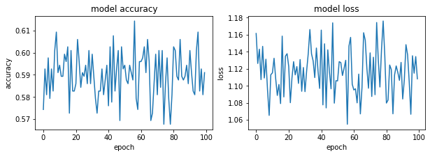

#### Adagram - 0.9


```python
optimizer= tf.keras.optimizers.Adagrad(learning_rate=0.9)
model.compile(optimizer=optimizer,
              loss='sparse_categorical_crossentropy',
              metrics=['accuracy'])
#history = model.fit(X, Y, validation_split=0.33, epochs=150, batch_size=10, verbose=0)
history = model.fit(x_train_, y_train_, epochs=100)
model.evaluate(x_test_,  y_test_, verbose=2)
```

    Epoch 1/100
    19/19 [==============================] - 0s 1ms/step - loss: 1.1299 - accuracy: 0.5893
    Epoch 2/100
    19/19 [==============================] - 0s 1ms/step - loss: 1.1017 - accuracy: 0.5927
    Epoch 3/100
    19/19 [==============================] - 0s 1ms/step - loss: 1.1986 - accuracy: 0.5559
    Epoch 4/100
    19/19 [==============================] - 0s 1ms/step - loss: 1.1692 - accuracy: 0.5676
    Epoch 5/100
    19/19 [==============================] - 0s 1ms/step - loss: 1.1301 - accuracy: 0.5860
    Epoch 6/100
    19/19 [==============================] - 0s 1ms/step - loss: 1.1248 - accuracy: 0.5876
    Epoch 7/100
    19/19 [==============================] - 0s 1ms/step - loss: 1.1317 - accuracy: 0.5843
    Epoch 8/100
    19/19 [==============================] - 0s 1ms/step - loss: 1.1572 - accuracy: 0.5743
    Epoch 9/100
    19/19 [==============================] - 0s 1ms/step - loss: 1.1215 - accuracy: 0.5910
    Epoch 10/100
    19/19 [==============================] - 0s 1ms/step - loss: 1.1015 - accuracy: 0.5943
    Epoch 11/100
    19/19 [==============================] - 0s 1ms/step - loss: 1.1138 - accuracy: 0.5943
    Epoch 12/100
    19/19 [==============================] - 0s 1ms/step - loss: 1.1379 - accuracy: 0.5860
    Epoch 13/100
    19/19 [==============================] - 0s 1ms/step - loss: 1.1320 - accuracy: 0.5860
    Epoch 14/100
    19/19 [==============================] - 0s 947us/step - loss: 1.1688 - accuracy: 0.5743
    Epoch 15/100
    19/19 [==============================] - 0s 1ms/step - loss: 1.0840 - accuracy: 0.6027
    Epoch 16/100
    19/19 [==============================] - 0s 1ms/step - loss: 1.0914 - accuracy: 0.5993
    Epoch 17/100
    19/19 [==============================] - 0s 1ms/step - loss: 1.1330 - accuracy: 0.5876
    Epoch 18/100
    19/19 [==============================] - 0s 1ms/step - loss: 1.1249 - accuracy: 0.5893
    Epoch 19/100
    19/19 [==============================] - 0s 1ms/step - loss: 1.1063 - accuracy: 0.5943
    Epoch 20/100
    19/19 [==============================] - 0s 1ms/step - loss: 1.1768 - accuracy: 0.5726
    Epoch 21/100
    19/19 [==============================] - 0s 1ms/step - loss: 1.1308 - accuracy: 0.5876
    Epoch 22/100
    19/19 [==============================] - 0s 1ms/step - loss: 1.1483 - accuracy: 0.5810
    Epoch 23/100
    19/19 [==============================] - 0s 1ms/step - loss: 1.0856 - accuracy: 0.6027
    Epoch 24/100
    19/19 [==============================] - 0s 1ms/step - loss: 1.1357 - accuracy: 0.5843
    Epoch 25/100
    19/19 [==============================] - 0s 1ms/step - loss: 1.1138 - accuracy: 0.5927
    Epoch 26/100
    19/19 [==============================] - 0s 1ms/step - loss: 1.1166 - accuracy: 0.5910
    Epoch 27/100
    19/19 [==============================] - 0s 1ms/step - loss: 1.1068 - accuracy: 0.5910
    Epoch 28/100
    19/19 [==============================] - 0s 1ms/step - loss: 1.1246 - accuracy: 0.5893
    Epoch 29/100
    19/19 [==============================] - 0s 1ms/step - loss: 1.0772 - accuracy: 0.6027
    Epoch 30/100
    19/19 [==============================] - 0s 1ms/step - loss: 1.1298 - accuracy: 0.5826
    Epoch 31/100
    19/19 [==============================] - 0s 1ms/step - loss: 1.1694 - accuracy: 0.5710
    Epoch 32/100
    19/19 [==============================] - 0s 1ms/step - loss: 1.1805 - accuracy: 0.5693
    Epoch 33/100
    19/19 [==============================] - 0s 1ms/step - loss: 1.1335 - accuracy: 0.5843
    Epoch 34/100
    19/19 [==============================] - 0s 1ms/step - loss: 1.0966 - accuracy: 0.5943
    Epoch 35/100
    19/19 [==============================] - 0s 1ms/step - loss: 1.1595 - accuracy: 0.5793
    Epoch 36/100
    19/19 [==============================] - 0s 1ms/step - loss: 1.0919 - accuracy: 0.5993
    Epoch 37/100
    19/19 [==============================] - 0s 1ms/step - loss: 1.1316 - accuracy: 0.5876
    Epoch 38/100
    19/19 [==============================] - 0s 1ms/step - loss: 1.0869 - accuracy: 0.6043
    Epoch 39/100
    19/19 [==============================] - 0s 1ms/step - loss: 1.1287 - accuracy: 0.5826
    Epoch 40/100
    19/19 [==============================] - 0s 1ms/step - loss: 1.1212 - accuracy: 0.5876
    Epoch 41/100
    19/19 [==============================] - 0s 1ms/step - loss: 1.0837 - accuracy: 0.6027
    Epoch 42/100
    19/19 [==============================] - 0s 1ms/step - loss: 1.0810 - accuracy: 0.6043
    Epoch 43/100
    19/19 [==============================] - 0s 999us/step - loss: 1.1244 - accuracy: 0.5860
    Epoch 44/100
    19/19 [==============================] - 0s 1ms/step - loss: 1.0927 - accuracy: 0.5977
    Epoch 45/100
    19/19 [==============================] - 0s 1ms/step - loss: 1.1182 - accuracy: 0.5910
    Epoch 46/100
    19/19 [==============================] - 0s 1ms/step - loss: 1.1210 - accuracy: 0.5876
    Epoch 47/100
    19/19 [==============================] - 0s 1ms/step - loss: 1.1573 - accuracy: 0.5743
    Epoch 48/100
    19/19 [==============================] - 0s 1ms/step - loss: 1.1363 - accuracy: 0.5826
    Epoch 49/100
    19/19 [==============================] - 0s 1ms/step - loss: 1.1249 - accuracy: 0.5860
    Epoch 50/100
    19/19 [==============================] - 0s 1ms/step - loss: 1.0943 - accuracy: 0.6027
    Epoch 51/100
    19/19 [==============================] - 0s 1ms/step - loss: 1.1982 - accuracy: 0.5626
    Epoch 52/100
    19/19 [==============================] - 0s 1ms/step - loss: 1.1561 - accuracy: 0.5776
    Epoch 53/100
    19/19 [==============================] - 0s 1ms/step - loss: 1.1145 - accuracy: 0.5943
    Epoch 54/100
    19/19 [==============================] - 0s 1ms/step - loss: 1.0893 - accuracy: 0.6043
    Epoch 55/100
    19/19 [==============================] - 0s 1ms/step - loss: 1.1255 - accuracy: 0.5843
    Epoch 56/100
    19/19 [==============================] - 0s 1ms/step - loss: 1.0763 - accuracy: 0.6060
    Epoch 57/100
    19/19 [==============================] - 0s 1ms/step - loss: 1.1167 - accuracy: 0.5910
    Epoch 58/100
    19/19 [==============================] - 0s 1ms/step - loss: 1.1304 - accuracy: 0.5876
    Epoch 59/100
    19/19 [==============================] - 0s 1ms/step - loss: 1.1015 - accuracy: 0.5943
    Epoch 60/100
    19/19 [==============================] - 0s 894us/step - loss: 1.1220 - accuracy: 0.5893
    Epoch 61/100
    19/19 [==============================] - 0s 947us/step - loss: 1.0983 - accuracy: 0.5993
    Epoch 62/100
    19/19 [==============================] - 0s 947us/step - loss: 1.1740 - accuracy: 0.5726
    Epoch 63/100
    19/19 [==============================] - 0s 1ms/step - loss: 1.1417 - accuracy: 0.5843
    Epoch 64/100
    19/19 [==============================] - 0s 947us/step - loss: 1.0820 - accuracy: 0.6027
    Epoch 65/100
    19/19 [==============================] - 0s 895us/step - loss: 1.1341 - accuracy: 0.5810
    Epoch 66/100
    19/19 [==============================] - 0s 947us/step - loss: 1.1105 - accuracy: 0.5910
    Epoch 67/100
    19/19 [==============================] - 0s 1000us/step - loss: 1.1257 - accuracy: 0.5876
    Epoch 68/100
    19/19 [==============================] - 0s 947us/step - loss: 1.1057 - accuracy: 0.5943
    Epoch 69/100
    19/19 [==============================] - 0s 894us/step - loss: 1.1059 - accuracy: 0.5910
    Epoch 70/100
    19/19 [==============================] - 0s 895us/step - loss: 1.0413 - accuracy: 0.6177
    Epoch 71/100
    19/19 [==============================] - 0s 947us/step - loss: 1.1558 - accuracy: 0.5776
    Epoch 72/100
    19/19 [==============================] - 0s 947us/step - loss: 1.1098 - accuracy: 0.5960
    Epoch 73/100
    19/19 [==============================] - 0s 1000us/step - loss: 1.1269 - accuracy: 0.5860
    Epoch 74/100
    19/19 [==============================] - 0s 947us/step - loss: 1.1062 - accuracy: 0.5943
    Epoch 75/100
    19/19 [==============================] - 0s 948us/step - loss: 1.1828 - accuracy: 0.5676
    Epoch 76/100
    19/19 [==============================] - 0s 947us/step - loss: 1.0994 - accuracy: 0.5977
    Epoch 77/100
    19/19 [==============================] - 0s 947us/step - loss: 1.1020 - accuracy: 0.5927
    Epoch 78/100
    19/19 [==============================] - 0s 1000us/step - loss: 1.0644 - accuracy: 0.6093
    Epoch 79/100
    19/19 [==============================] - 0s 947us/step - loss: 1.1179 - accuracy: 0.5893
    Epoch 80/100
    19/19 [==============================] - 0s 947us/step - loss: 1.1468 - accuracy: 0.5810
    Epoch 81/100
    19/19 [==============================] - 0s 947us/step - loss: 1.0911 - accuracy: 0.6010
    Epoch 82/100
    19/19 [==============================] - 0s 1ms/step - loss: 1.1165 - accuracy: 0.5910
    Epoch 83/100
    19/19 [==============================] - 0s 948us/step - loss: 1.1116 - accuracy: 0.5927
    Epoch 84/100
    19/19 [==============================] - 0s 947us/step - loss: 1.1104 - accuracy: 0.5943
    Epoch 85/100
    19/19 [==============================] - 0s 1ms/step - loss: 1.1459 - accuracy: 0.5793
    Epoch 86/100
    19/19 [==============================] - 0s 1000us/step - loss: 1.1357 - accuracy: 0.5776
    Epoch 87/100
    19/19 [==============================] - 0s 947us/step - loss: 1.1443 - accuracy: 0.5776
    Epoch 88/100
    19/19 [==============================] - 0s 947us/step - loss: 1.1100 - accuracy: 0.5910
    Epoch 89/100
    19/19 [==============================] - 0s 947us/step - loss: 1.1077 - accuracy: 0.5943
    Epoch 90/100
    19/19 [==============================] - 0s 1ms/step - loss: 1.1356 - accuracy: 0.5826
    Epoch 91/100
    19/19 [==============================] - 0s 1ms/step - loss: 1.0544 - accuracy: 0.6127
    Epoch 92/100
    19/19 [==============================] - 0s 947us/step - loss: 1.1448 - accuracy: 0.5793
    Epoch 93/100
    19/19 [==============================] - 0s 904us/step - loss: 1.1045 - accuracy: 0.5960
    Epoch 94/100
    19/19 [==============================] - 0s 895us/step - loss: 1.1067 - accuracy: 0.5943
    Epoch 95/100
    19/19 [==============================] - 0s 1ms/step - loss: 1.1111 - accuracy: 0.5910
    Epoch 96/100
    19/19 [==============================] - 0s 895us/step - loss: 1.0888 - accuracy: 0.5993
    Epoch 97/100
    19/19 [==============================] - 0s 1000us/step - loss: 1.1042 - accuracy: 0.5960
    Epoch 98/100
    19/19 [==============================] - 0s 1ms/step - loss: 1.0982 - accuracy: 0.5993
    Epoch 99/100
    19/19 [==============================] - 0s 895us/step - loss: 1.1250 - accuracy: 0.5860
    Epoch 100/100
    19/19 [==============================] - 0s 947us/step - loss: 1.1408 - accuracy: 0.5810
    19/19 - 0s - loss: 9.9256 - accuracy: 0.5426
    


    [9.925590515136719, 0.542570948600769]


```python
fig, (ax1, ax2) = plt.subplots(1, 2, figsize=(10, 3))

#ax1.subplot(1, 2, 1)
ax1.plot(history.history['accuracy'])
#plt.plot(history.history['val_accuracy'])
ax1.set_title('model accuracy')
ax1.set_ylabel('accuracy')
ax1.set_xlabel('epoch')
#ax1.show()

#ax2.subplot(1, 2, 2)
ax2.plot(history.history['loss'])
#plt.plot(history.history['val_loss'])
ax2.set_title('model loss')
ax2.set_ylabel('loss')
ax2.set_xlabel('epoch')
```

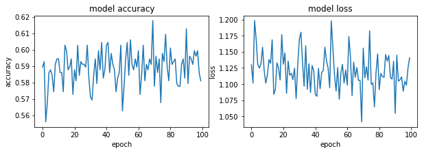

#### Adagram - 1.5


```python
optimizer= tf.keras.optimizers.Adagrad(learning_rate=1.5)
model.compile(optimizer=optimizer,
              loss='sparse_categorical_crossentropy',
              metrics=['accuracy'])
#history = model.fit(X, Y, validation_split=0.33, epochs=150, batch_size=10, verbose=0)
history = model.fit(x_train_, y_train_, epochs=100)
model.evaluate(x_test_,  y_test_, verbose=2)
```

    Epoch 1/100
    19/19 [==============================] - 0s 1ms/step - loss: 1.1886 - accuracy: 0.5576
    Epoch 2/100
    19/19 [==============================] - 0s 1ms/step - loss: 1.1891 - accuracy: 0.5442
    Epoch 3/100
    19/19 [==============================] - 0s 1ms/step - loss: 1.1490 - accuracy: 0.5810
    Epoch 4/100
    19/19 [==============================] - 0s 1ms/step - loss: 1.1083 - accuracy: 0.5960
    Epoch 5/100
    19/19 [==============================] - 0s 1ms/step - loss: 1.1342 - accuracy: 0.5693
    Epoch 6/100
    19/19 [==============================] - 0s 1ms/step - loss: 1.1320 - accuracy: 0.5910
    Epoch 7/100
    19/19 [==============================] - 0s 1ms/step - loss: 1.1599 - accuracy: 0.5526
    Epoch 8/100
    19/19 [==============================] - 0s 1ms/step - loss: 1.1574 - accuracy: 0.5793
    Epoch 9/100
    19/19 [==============================] - 0s 1ms/step - loss: 1.1521 - accuracy: 0.5743
    Epoch 10/100
    19/19 [==============================] - 0s 1ms/step - loss: 1.1472 - accuracy: 0.5676
    Epoch 11/100
    19/19 [==============================] - 0s 1ms/step - loss: 1.1419 - accuracy: 0.5776
    Epoch 12/100
    19/19 [==============================] - 0s 1ms/step - loss: 1.0991 - accuracy: 0.5993
    Epoch 13/100
    19/19 [==============================] - 0s 1ms/step - loss: 1.1080 - accuracy: 0.5927
    Epoch 14/100
    19/19 [==============================] - 0s 1ms/step - loss: 1.1126 - accuracy: 0.5893
    Epoch 15/100
    19/19 [==============================] - 0s 1ms/step - loss: 1.1299 - accuracy: 0.5893
    Epoch 16/100
    19/19 [==============================] - 0s 1ms/step - loss: 1.1270 - accuracy: 0.5910
    Epoch 17/100
    19/19 [==============================] - 0s 1ms/step - loss: 1.0815 - accuracy: 0.6043
    Epoch 18/100
    19/19 [==============================] - 0s 1ms/step - loss: 1.1094 - accuracy: 0.5843
    Epoch 19/100
    19/19 [==============================] - 0s 1ms/step - loss: 1.1034 - accuracy: 0.5960
    Epoch 20/100
    19/19 [==============================] - 0s 1ms/step - loss: 1.1200 - accuracy: 0.5927
    Epoch 21/100
    19/19 [==============================] - 0s 1ms/step - loss: 1.1265 - accuracy: 0.5876
    Epoch 22/100
    19/19 [==============================] - 0s 1ms/step - loss: 1.1244 - accuracy: 0.5860
    Epoch 23/100
    19/19 [==============================] - 0s 1ms/step - loss: 1.1327 - accuracy: 0.5810
    Epoch 24/100
    19/19 [==============================] - 0s 1ms/step - loss: 1.1590 - accuracy: 0.5776
    Epoch 25/100
    19/19 [==============================] - 0s 1ms/step - loss: 1.1434 - accuracy: 0.5860
    Epoch 26/100
    19/19 [==============================] - 0s 1ms/step - loss: 1.0987 - accuracy: 0.6010
    Epoch 27/100
    19/19 [==============================] - 0s 1ms/step - loss: 1.1686 - accuracy: 0.5726
    Epoch 28/100
    19/19 [==============================] - 0s 1ms/step - loss: 1.1030 - accuracy: 0.5860
    Epoch 29/100
    19/19 [==============================] - 0s 1ms/step - loss: 1.1249 - accuracy: 0.5910
    Epoch 30/100
    19/19 [==============================] - 0s 1ms/step - loss: 1.1289 - accuracy: 0.5876
    Epoch 31/100
    19/19 [==============================] - 0s 1ms/step - loss: 1.0802 - accuracy: 0.6043
    Epoch 32/100
    19/19 [==============================] - 0s 1ms/step - loss: 1.1759 - accuracy: 0.5710
    Epoch 33/100
    19/19 [==============================] - 0s 1ms/step - loss: 1.1160 - accuracy: 0.5927
    Epoch 34/100
    19/19 [==============================] - 0s 1ms/step - loss: 1.0919 - accuracy: 0.6027
    Epoch 35/100
    19/19 [==============================] - 0s 1ms/step - loss: 1.1111 - accuracy: 0.5943
    Epoch 36/100
    19/19 [==============================] - 0s 1ms/step - loss: 1.1751 - accuracy: 0.5710
    Epoch 37/100
    19/19 [==============================] - 0s 1ms/step - loss: 1.0566 - accuracy: 0.6110
    Epoch 38/100
    19/19 [==============================] - 0s 1ms/step - loss: 1.1039 - accuracy: 0.5977
    Epoch 39/100
    19/19 [==============================] - 0s 1ms/step - loss: 1.0987 - accuracy: 0.5943
    Epoch 40/100
    19/19 [==============================] - 0s 1ms/step - loss: 1.1059 - accuracy: 0.5960
    Epoch 41/100
    19/19 [==============================] - 0s 1ms/step - loss: 1.1252 - accuracy: 0.5893
    Epoch 42/100
    19/19 [==============================] - 0s 1ms/step - loss: 1.1096 - accuracy: 0.5960
    Epoch 43/100
    19/19 [==============================] - 0s 1ms/step - loss: 1.1482 - accuracy: 0.5793
    Epoch 44/100
    19/19 [==============================] - 0s 1ms/step - loss: 1.1057 - accuracy: 0.5977
    Epoch 45/100
    19/19 [==============================] - 0s 1ms/step - loss: 1.1017 - accuracy: 0.5943
    Epoch 46/100
    19/19 [==============================] - 0s 1ms/step - loss: 1.0764 - accuracy: 0.6027
    Epoch 47/100
    19/19 [==============================] - 0s 1ms/step - loss: 1.2096 - accuracy: 0.5609
    Epoch 48/100
    19/19 [==============================] - 0s 1ms/step - loss: 1.1330 - accuracy: 0.5843
    Epoch 49/100
    19/19 [==============================] - 0s 1ms/step - loss: 1.1273 - accuracy: 0.5843
    Epoch 50/100
    19/19 [==============================] - 0s 1ms/step - loss: 1.1248 - accuracy: 0.5893
    Epoch 51/100
    19/19 [==============================] - 0s 1ms/step - loss: 1.1082 - accuracy: 0.5876
    Epoch 52/100
    19/19 [==============================] - 0s 1ms/step - loss: 1.1190 - accuracy: 0.5910
    Epoch 53/100
    19/19 [==============================] - 0s 1000us/step - loss: 1.1306 - accuracy: 0.5910
    Epoch 54/100
    19/19 [==============================] - 0s 1ms/step - loss: 1.0875 - accuracy: 0.6027
    Epoch 55/100
    19/19 [==============================] - 0s 1ms/step - loss: 1.1414 - accuracy: 0.5826
    Epoch 56/100
    19/19 [==============================] - 0s 1ms/step - loss: 1.1457 - accuracy: 0.5776
    Epoch 57/100
    19/19 [==============================] - 0s 1ms/step - loss: 1.1213 - accuracy: 0.5910
    Epoch 58/100
    19/19 [==============================] - 0s 947us/step - loss: 1.0761 - accuracy: 0.6060
    Epoch 59/100
    19/19 [==============================] - 0s 947us/step - loss: 1.1345 - accuracy: 0.5860
    Epoch 60/100
    19/19 [==============================] - 0s 947us/step - loss: 1.1063 - accuracy: 0.5960
    Epoch 61/100
    19/19 [==============================] - 0s 1000us/step - loss: 1.1362 - accuracy: 0.5843
    Epoch 62/100
    19/19 [==============================] - 0s 947us/step - loss: 1.1426 - accuracy: 0.5810
    Epoch 63/100
    19/19 [==============================] - 0s 1000us/step - loss: 1.1358 - accuracy: 0.5843
    Epoch 64/100
    19/19 [==============================] - 0s 895us/step - loss: 1.1367 - accuracy: 0.5843
    Epoch 65/100
    19/19 [==============================] - 0s 947us/step - loss: 1.1225 - accuracy: 0.5910
    Epoch 66/100
    19/19 [==============================] - 0s 1ms/step - loss: 1.1353 - accuracy: 0.5876
    Epoch 67/100
    19/19 [==============================] - 0s 947us/step - loss: 1.0912 - accuracy: 0.6027
    Epoch 68/100
    19/19 [==============================] - 0s 947us/step - loss: 1.1043 - accuracy: 0.5943
    Epoch 69/100
    19/19 [==============================] - 0s 947us/step - loss: 1.1339 - accuracy: 0.5860
    Epoch 70/100
    19/19 [==============================] - 0s 1ms/step - loss: 1.1162 - accuracy: 0.5893
    Epoch 71/100
    19/19 [==============================] - 0s 1ms/step - loss: 1.1594 - accuracy: 0.5743
    Epoch 72/100
    19/19 [==============================] - 0s 2ms/step - loss: 1.1214 - accuracy: 0.5910
    Epoch 73/100
    19/19 [==============================] - 0s 1ms/step - loss: 1.1613 - accuracy: 0.5760
    Epoch 74/100
    19/19 [==============================] - 0s 895us/step - loss: 1.1497 - accuracy: 0.5810
    Epoch 75/100
    19/19 [==============================] - 0s 947us/step - loss: 1.1652 - accuracy: 0.5726
    Epoch 76/100
    19/19 [==============================] - 0s 947us/step - loss: 1.1273 - accuracy: 0.5893
    Epoch 77/100
    19/19 [==============================] - 0s 895us/step - loss: 1.1478 - accuracy: 0.5760
    Epoch 78/100
    19/19 [==============================] - 0s 1000us/step - loss: 1.1082 - accuracy: 0.5893
    Epoch 79/100
    19/19 [==============================] - 0s 1ms/step - loss: 1.1079 - accuracy: 0.5943
    Epoch 80/100
    19/19 [==============================] - 0s 895us/step - loss: 1.1391 - accuracy: 0.5826
    Epoch 81/100
    19/19 [==============================] - 0s 947us/step - loss: 1.0951 - accuracy: 0.6027
    Epoch 82/100
    19/19 [==============================] - 0s 947us/step - loss: 1.1393 - accuracy: 0.5826
    Epoch 83/100
    19/19 [==============================] - 0s 947us/step - loss: 1.1657 - accuracy: 0.5726
    Epoch 84/100
    19/19 [==============================] - 0s 947us/step - loss: 1.1303 - accuracy: 0.5860
    Epoch 85/100
    19/19 [==============================] - 0s 947us/step - loss: 1.1739 - accuracy: 0.5760
    Epoch 86/100
    19/19 [==============================] - 0s 947us/step - loss: 1.1149 - accuracy: 0.5943
    Epoch 87/100
    19/19 [==============================] - 0s 1ms/step - loss: 1.1105 - accuracy: 0.5943
    Epoch 88/100
    19/19 [==============================] - 0s 947us/step - loss: 1.1113 - accuracy: 0.5943
    Epoch 89/100
    19/19 [==============================] - 0s 947us/step - loss: 1.1342 - accuracy: 0.5843
    Epoch 90/100
    19/19 [==============================] - 0s 1000us/step - loss: 1.1242 - accuracy: 0.5893
    Epoch 91/100
    19/19 [==============================] - 0s 947us/step - loss: 1.1476 - accuracy: 0.5826
    Epoch 92/100
    19/19 [==============================] - 0s 947us/step - loss: 1.1251 - accuracy: 0.5910
    Epoch 93/100
    19/19 [==============================] - 0s 947us/step - loss: 1.1286 - accuracy: 0.5893
    Epoch 94/100
    19/19 [==============================] - 0s 947us/step - loss: 1.1001 - accuracy: 0.5960
    Epoch 95/100
    19/19 [==============================] - 0s 1ms/step - loss: 1.1469 - accuracy: 0.5826
    Epoch 96/100
    19/19 [==============================] - 0s 895us/step - loss: 1.1306 - accuracy: 0.5876
    Epoch 97/100
    19/19 [==============================] - 0s 894us/step - loss: 1.0952 - accuracy: 0.6010
    Epoch 98/100
    19/19 [==============================] - 0s 894us/step - loss: 1.0929 - accuracy: 0.6010
    Epoch 99/100
    19/19 [==============================] - 0s 895us/step - loss: 1.0745 - accuracy: 0.6077
    Epoch 100/100
    19/19 [==============================] - 0s 1ms/step - loss: 1.1316 - accuracy: 0.5860
    19/19 - 0s - loss: 9.9276 - accuracy: 0.5426
    


    [9.927579879760742, 0.542570948600769]


```python
fig, (ax1, ax2) = plt.subplots(1, 2, figsize=(10, 3))

#ax1.subplot(1, 2, 1)
ax1.plot(history.history['accuracy'])
#plt.plot(history.history['val_accuracy'])
ax1.set_title('model accuracy')
ax1.set_ylabel('accuracy')
ax1.set_xlabel('epoch')
#ax1.show()

#ax2.subplot(1, 2, 2)
ax2.plot(history.history['loss'])
#plt.plot(history.history['val_loss'])
ax2.set_title('model loss')
ax2.set_ylabel('loss')
ax2.set_xlabel('epoch')
```

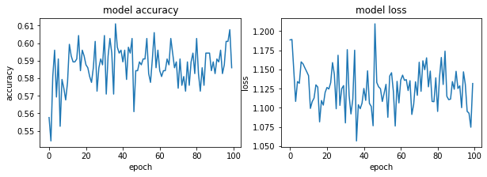

#### AdDelta - 0.001


```python
optimizer= tf.keras.optimizers.Adadelta(learning_rate=0.001)
model.compile(optimizer=optimizer,
              loss='sparse_categorical_crossentropy',
              metrics=['accuracy'])
#history = model.fit(X, Y, validation_split=0.33, epochs=150, batch_size=10, verbose=0)
history = model.fit(x_train_, y_train_, epochs=100)
model.evaluate(x_test_,  y_test_, verbose=2)
```

    Epoch 1/100
    19/19 [==============================] - 0s 1ms/step - loss: 1.1399 - accuracy: 0.5717
    Epoch 2/100
    19/19 [==============================] - 0s 1ms/step - loss: 1.1058 - accuracy: 0.5900
    Epoch 3/100
    19/19 [==============================] - 0s 1ms/step - loss: 1.1405 - accuracy: 0.5733
    Epoch 4/100
    19/19 [==============================] - 0s 1ms/step - loss: 1.1119 - accuracy: 0.5850
    Epoch 5/100
    19/19 [==============================] - 0s 1ms/step - loss: 1.1652 - accuracy: 0.5650
    Epoch 6/100
    19/19 [==============================] - 0s 2ms/step - loss: 1.1108 - accuracy: 0.5883
    Epoch 7/100
    19/19 [==============================] - 0s 1ms/step - loss: 1.1238 - accuracy: 0.5800
    Epoch 8/100
    19/19 [==============================] - 0s 1ms/step - loss: 1.1401 - accuracy: 0.5750
    Epoch 9/100
    19/19 [==============================] - 0s 1ms/step - loss: 1.0878 - accuracy: 0.5983
    Epoch 10/100
    19/19 [==============================] - 0s 1ms/step - loss: 1.1387 - accuracy: 0.5767
    Epoch 11/100
    19/19 [==============================] - 0s 1ms/step - loss: 1.0781 - accuracy: 0.6000
    Epoch 12/100
    19/19 [==============================] - 0s 1ms/step - loss: 1.1497 - accuracy: 0.5700
    Epoch 13/100
    19/19 [==============================] - 0s 1ms/step - loss: 1.1886 - accuracy: 0.5600
    Epoch 14/100
    19/19 [==============================] - 0s 1ms/step - loss: 1.1346 - accuracy: 0.5783
    Epoch 15/100
    19/19 [==============================] - 0s 1ms/step - loss: 1.1454 - accuracy: 0.5733
    Epoch 16/100
    19/19 [==============================] - 0s 1ms/step - loss: 1.1580 - accuracy: 0.5683
    Epoch 17/100
    19/19 [==============================] - 0s 1ms/step - loss: 1.1298 - accuracy: 0.5800
    Epoch 18/100
    19/19 [==============================] - 0s 1ms/step - loss: 1.0625 - accuracy: 0.6033
    Epoch 19/100
    19/19 [==============================] - 0s 1ms/step - loss: 1.0841 - accuracy: 0.5967
    Epoch 20/100
    19/19 [==============================] - 0s 1ms/step - loss: 1.0872 - accuracy: 0.5933
    Epoch 21/100
    19/19 [==============================] - 0s 1ms/step - loss: 1.1285 - accuracy: 0.5800
    Epoch 22/100
    19/19 [==============================] - 0s 1ms/step - loss: 1.1292 - accuracy: 0.5817
    Epoch 23/100
    19/19 [==============================] - 0s 1ms/step - loss: 1.0982 - accuracy: 0.5900
    Epoch 24/100
    19/19 [==============================] - 0s 1ms/step - loss: 1.0831 - accuracy: 0.5950
    Epoch 25/100
    19/19 [==============================] - 0s 1ms/step - loss: 1.1366 - accuracy: 0.5750
    Epoch 26/100
    19/19 [==============================] - 0s 1ms/step - loss: 1.0862 - accuracy: 0.5967
    Epoch 27/100
    19/19 [==============================] - 0s 1ms/step - loss: 1.1485 - accuracy: 0.5717
    Epoch 28/100
    19/19 [==============================] - 0s 1ms/step - loss: 1.1147 - accuracy: 0.5833
    Epoch 29/100
    19/19 [==============================] - 0s 1ms/step - loss: 1.1639 - accuracy: 0.5667
    Epoch 30/100
    19/19 [==============================] - 0s 1ms/step - loss: 1.0877 - accuracy: 0.5933
    Epoch 31/100
    19/19 [==============================] - 0s 1ms/step - loss: 1.1026 - accuracy: 0.5900
    Epoch 32/100
    19/19 [==============================] - 0s 1ms/step - loss: 1.1342 - accuracy: 0.5783
    Epoch 33/100
    19/19 [==============================] - 0s 1ms/step - loss: 1.1047 - accuracy: 0.5867
    Epoch 34/100
    19/19 [==============================] - 0s 1ms/step - loss: 1.1058 - accuracy: 0.5883
    Epoch 35/100
    19/19 [==============================] - 0s 1ms/step - loss: 1.0922 - accuracy: 0.5933
    Epoch 36/100
    19/19 [==============================] - 0s 1ms/step - loss: 1.1363 - accuracy: 0.5800
    Epoch 37/100
    19/19 [==============================] - 0s 1ms/step - loss: 1.1447 - accuracy: 0.5750
    Epoch 38/100
    19/19 [==============================] - 0s 1ms/step - loss: 1.1006 - accuracy: 0.5883
    Epoch 39/100
    19/19 [==============================] - 0s 1ms/step - loss: 1.1039 - accuracy: 0.5883
    Epoch 40/100
    19/19 [==============================] - 0s 1ms/step - loss: 1.1222 - accuracy: 0.5817
    Epoch 41/100
    19/19 [==============================] - 0s 946us/step - loss: 1.0372 - accuracy: 0.6133
    Epoch 42/100
    19/19 [==============================] - 0s 1ms/step - loss: 1.1158 - accuracy: 0.5850
    Epoch 43/100
    19/19 [==============================] - 0s 1ms/step - loss: 1.1012 - accuracy: 0.5900
    Epoch 44/100
    19/19 [==============================] - 0s 1ms/step - loss: 1.0771 - accuracy: 0.5983
    Epoch 45/100
    19/19 [==============================] - 0s 1ms/step - loss: 1.0910 - accuracy: 0.5917
    Epoch 46/100
    19/19 [==============================] - 0s 1ms/step - loss: 1.1197 - accuracy: 0.5850
    Epoch 47/100
    19/19 [==============================] - 0s 1ms/step - loss: 1.1237 - accuracy: 0.5783
    Epoch 48/100
    19/19 [==============================] - 0s 947us/step - loss: 1.1325 - accuracy: 0.5767
    Epoch 49/100
    19/19 [==============================] - 0s 1ms/step - loss: 1.0987 - accuracy: 0.5883
    Epoch 50/100
    19/19 [==============================] - 0s 1ms/step - loss: 1.1180 - accuracy: 0.5833
    Epoch 51/100
    19/19 [==============================] - 0s 1ms/step - loss: 1.1198 - accuracy: 0.5817
    Epoch 52/100
    19/19 [==============================] - 0s 1ms/step - loss: 1.1608 - accuracy: 0.5683
    Epoch 53/100
    19/19 [==============================] - 0s 1ms/step - loss: 1.0791 - accuracy: 0.6017
    Epoch 54/100
    19/19 [==============================] - 0s 1ms/step - loss: 1.0938 - accuracy: 0.5917
    Epoch 55/100
    19/19 [==============================] - 0s 1ms/step - loss: 1.1257 - accuracy: 0.5817
    Epoch 56/100
    19/19 [==============================] - 0s 1ms/step - loss: 1.1037 - accuracy: 0.5900
    Epoch 57/100
    19/19 [==============================] - 0s 1ms/step - loss: 1.1268 - accuracy: 0.5783
    Epoch 58/100
    19/19 [==============================] - 0s 1ms/step - loss: 1.1009 - accuracy: 0.5900
    Epoch 59/100
    19/19 [==============================] - 0s 1ms/step - loss: 1.1348 - accuracy: 0.5767
    Epoch 60/100
    19/19 [==============================] - 0s 1ms/step - loss: 1.1223 - accuracy: 0.5800
    Epoch 61/100
    19/19 [==============================] - 0s 947us/step - loss: 1.1267 - accuracy: 0.5817
    Epoch 62/100
    19/19 [==============================] - 0s 1ms/step - loss: 1.0886 - accuracy: 0.5933
    Epoch 63/100
    19/19 [==============================] - 0s 1000us/step - loss: 1.1014 - accuracy: 0.5900
    Epoch 64/100
    19/19 [==============================] - 0s 1ms/step - loss: 1.1450 - accuracy: 0.5733
    Epoch 65/100
    19/19 [==============================] - 0s 1000us/step - loss: 1.1287 - accuracy: 0.5800
    Epoch 66/100
    19/19 [==============================] - 0s 1ms/step - loss: 1.1261 - accuracy: 0.5833
    Epoch 67/100
    19/19 [==============================] - 0s 1ms/step - loss: 1.1411 - accuracy: 0.5733
    Epoch 68/100
    19/19 [==============================] - 0s 1000us/step - loss: 1.1161 - accuracy: 0.5833
    Epoch 69/100
    19/19 [==============================] - 0s 1ms/step - loss: 1.0962 - accuracy: 0.5950
    Epoch 70/100
    19/19 [==============================] - 0s 1ms/step - loss: 1.1466 - accuracy: 0.5733
    Epoch 71/100
    19/19 [==============================] - 0s 1000us/step - loss: 1.1298 - accuracy: 0.5833
    Epoch 72/100
    19/19 [==============================] - 0s 1ms/step - loss: 1.0750 - accuracy: 0.6000
    Epoch 73/100
    19/19 [==============================] - 0s 1ms/step - loss: 1.0968 - accuracy: 0.5917
    Epoch 74/100
    19/19 [==============================] - 0s 1ms/step - loss: 1.1234 - accuracy: 0.5833
    Epoch 75/100
    19/19 [==============================] - 0s 1000us/step - loss: 1.0819 - accuracy: 0.5967
    Epoch 76/100
    19/19 [==============================] - 0s 1000us/step - loss: 1.1414 - accuracy: 0.5683
    Epoch 77/100
    19/19 [==============================] - 0s 1ms/step - loss: 1.1217 - accuracy: 0.5817
    Epoch 78/100
    19/19 [==============================] - 0s 1ms/step - loss: 1.0889 - accuracy: 0.5950
    Epoch 79/100
    19/19 [==============================] - 0s 1ms/step - loss: 1.1012 - accuracy: 0.5900
    Epoch 80/100
    19/19 [==============================] - 0s 1ms/step - loss: 1.0958 - accuracy: 0.5900
    Epoch 81/100
    19/19 [==============================] - 0s 1000us/step - loss: 1.1357 - accuracy: 0.5733
    Epoch 82/100
    19/19 [==============================] - 0s 1000us/step - loss: 1.0815 - accuracy: 0.5983
    Epoch 83/100
    19/19 [==============================] - 0s 1ms/step - loss: 1.1338 - accuracy: 0.5767
    Epoch 84/100
    19/19 [==============================] - 0s 1ms/step - loss: 1.1322 - accuracy: 0.5800
    Epoch 85/100
    19/19 [==============================] - 0s 1ms/step - loss: 1.1154 - accuracy: 0.5850
    Epoch 86/100
    19/19 [==============================] - 0s 1000us/step - loss: 1.1377 - accuracy: 0.5767
    Epoch 87/100
    19/19 [==============================] - 0s 1ms/step - loss: 1.1561 - accuracy: 0.5700
    Epoch 88/100
    19/19 [==============================] - 0s 1000us/step - loss: 1.0794 - accuracy: 0.5967
    Epoch 89/100
    19/19 [==============================] - 0s 1000us/step - loss: 1.1255 - accuracy: 0.5817
    Epoch 90/100
    19/19 [==============================] - 0s 1000us/step - loss: 1.1382 - accuracy: 0.5783
    Epoch 91/100
    19/19 [==============================] - 0s 1ms/step - loss: 1.1182 - accuracy: 0.5817
    Epoch 92/100
    19/19 [==============================] - 0s 1ms/step - loss: 1.1331 - accuracy: 0.5767
    Epoch 93/100
    19/19 [==============================] - 0s 1ms/step - loss: 1.1176 - accuracy: 0.5850
    Epoch 94/100
    19/19 [==============================] - 0s 1ms/step - loss: 1.1742 - accuracy: 0.5650
    Epoch 95/100
    19/19 [==============================] - 0s 1ms/step - loss: 1.0728 - accuracy: 0.6017
    Epoch 96/100
    19/19 [==============================] - 0s 1000us/step - loss: 1.0945 - accuracy: 0.5917
    Epoch 97/100
    19/19 [==============================] - 0s 1ms/step - loss: 1.1021 - accuracy: 0.5883
    Epoch 98/100
    19/19 [==============================] - 0s 1000us/step - loss: 1.1124 - accuracy: 0.5867
    Epoch 99/100
    19/19 [==============================] - 0s 1ms/step - loss: 1.1292 - accuracy: 0.5817
    Epoch 100/100
    19/19 [==============================] - 0s 1ms/step - loss: 1.1051 - accuracy: 0.5883
    4/4 - 0s - loss: 1047.6017 - accuracy: 0.0700
    


    [1047.6016845703125, 0.07000000029802322]


```python
fig, (ax1, ax2) = plt.subplots(1, 2, figsize=(10, 3))

#ax1.subplot(1, 2, 1)
ax1.plot(history.history['accuracy'])
#plt.plot(history.history['val_accuracy'])
ax1.set_title('model accuracy')
ax1.set_ylabel('accuracy')
ax1.set_xlabel('epoch')
#ax1.show()

#ax2.subplot(1, 2, 2)
ax2.plot(history.history['loss'])
#plt.plot(history.history['val_loss'])
ax2.set_title('model loss')
ax2.set_ylabel('loss')
ax2.set_xlabel('epoch')
```

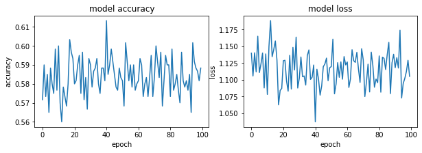

#### AdDelta - 0.1


```python
optimizer= tf.keras.optimizers.Adadelta(learning_rate=0.1)
model.compile(optimizer=optimizer,
              loss='sparse_categorical_crossentropy',
              metrics=['accuracy'])
#history = model.fit(X, Y, validation_split=0.33, epochs=150, batch_size=10, verbose=0)
history = model.fit(x_train_, y_train_, epochs=100)
model.evaluate(x_test_,  y_test_, verbose=2)
```

    Epoch 1/100
    19/19 [==============================] - 0s 1ms/step - loss: 1.1132 - accuracy: 0.5867
    Epoch 2/100
    19/19 [==============================] - 0s 1ms/step - loss: 1.0956 - accuracy: 0.5883
    Epoch 3/100
    19/19 [==============================] - 0s 1ms/step - loss: 1.1019 - accuracy: 0.5883
    Epoch 4/100
    19/19 [==============================] - 0s 1ms/step - loss: 1.1581 - accuracy: 0.5683
    Epoch 5/100
    19/19 [==============================] - 0s 1ms/step - loss: 1.1399 - accuracy: 0.5750
    Epoch 6/100
    19/19 [==============================] - 0s 1ms/step - loss: 1.1057 - accuracy: 0.5883
    Epoch 7/100
    19/19 [==============================] - 0s 1ms/step - loss: 1.0909 - accuracy: 0.5967
    Epoch 8/100
    19/19 [==============================] - 0s 2ms/step - loss: 1.0806 - accuracy: 0.5967
    Epoch 9/100
    19/19 [==============================] - 0s 1ms/step - loss: 1.0788 - accuracy: 0.5950
    Epoch 10/100
    19/19 [==============================] - 0s 2ms/step - loss: 1.0422 - accuracy: 0.6100
    Epoch 11/100
    19/19 [==============================] - 0s 2ms/step - loss: 1.1284 - accuracy: 0.5783
    Epoch 12/100
    19/19 [==============================] - 0s 1ms/step - loss: 1.1019 - accuracy: 0.5900
    Epoch 13/100
    19/19 [==============================] - 0s 1ms/step - loss: 1.1098 - accuracy: 0.5867
    Epoch 14/100
    19/19 [==============================] - 0s 1ms/step - loss: 1.1045 - accuracy: 0.5850
    Epoch 15/100
    19/19 [==============================] - 0s 1ms/step - loss: 1.1386 - accuracy: 0.5767
    Epoch 16/100
    19/19 [==============================] - 0s 2ms/step - loss: 1.1229 - accuracy: 0.5833
    Epoch 17/100
    19/19 [==============================] - 0s 2ms/step - loss: 1.1066 - accuracy: 0.5883
    Epoch 18/100
    19/19 [==============================] - 0s 2ms/step - loss: 1.1589 - accuracy: 0.5683
    Epoch 19/100
    19/19 [==============================] - 0s 2ms/step - loss: 1.0748 - accuracy: 0.5983
    Epoch 20/100
    19/19 [==============================] - 0s 2ms/step - loss: 1.1074 - accuracy: 0.5867
    Epoch 21/100
    19/19 [==============================] - 0s 2ms/step - loss: 1.1257 - accuracy: 0.5817
    Epoch 22/100
    19/19 [==============================] - 0s 2ms/step - loss: 1.1185 - accuracy: 0.5850
    Epoch 23/100
    19/19 [==============================] - 0s 2ms/step - loss: 1.1569 - accuracy: 0.5683
    Epoch 24/100
    19/19 [==============================] - 0s 2ms/step - loss: 1.1322 - accuracy: 0.5800
    Epoch 25/100
    19/19 [==============================] - 0s 2ms/step - loss: 1.1245 - accuracy: 0.5783
    Epoch 26/100
    19/19 [==============================] - 0s 1ms/step - loss: 1.1122 - accuracy: 0.5850
    Epoch 27/100
    19/19 [==============================] - 0s 2ms/step - loss: 1.1227 - accuracy: 0.5817
    Epoch 28/100
    19/19 [==============================] - 0s 1ms/step - loss: 1.1212 - accuracy: 0.5833
    Epoch 29/100
    19/19 [==============================] - 0s 1ms/step - loss: 1.0952 - accuracy: 0.5900
    Epoch 30/100
    19/19 [==============================] - 0s 1ms/step - loss: 1.1270 - accuracy: 0.5783
    Epoch 31/100
    19/19 [==============================] - 0s 1ms/step - loss: 1.0952 - accuracy: 0.5900
    Epoch 32/100
    19/19 [==============================] - 0s 1ms/step - loss: 1.1452 - accuracy: 0.5733
    Epoch 33/100
    19/19 [==============================] - 0s 1ms/step - loss: 1.0994 - accuracy: 0.5883
    Epoch 34/100
    19/19 [==============================] - 0s 1ms/step - loss: 1.1580 - accuracy: 0.5683
    Epoch 35/100
    19/19 [==============================] - 0s 1ms/step - loss: 1.0861 - accuracy: 0.5967
    Epoch 36/100
    19/19 [==============================] - 0s 1ms/step - loss: 1.0868 - accuracy: 0.5917
    Epoch 37/100
    19/19 [==============================] - 0s 1ms/step - loss: 1.1226 - accuracy: 0.5783
    Epoch 38/100
    19/19 [==============================] - 0s 1ms/step - loss: 1.0751 - accuracy: 0.5983
    Epoch 39/100
    19/19 [==============================] - 0s 1ms/step - loss: 1.0797 - accuracy: 0.6000
    Epoch 40/100
    19/19 [==============================] - 0s 1ms/step - loss: 1.1293 - accuracy: 0.5783
    Epoch 41/100
    19/19 [==============================] - 0s 1ms/step - loss: 1.0668 - accuracy: 0.6017
    Epoch 42/100
    19/19 [==============================] - 0s 1ms/step - loss: 1.1129 - accuracy: 0.5883
    Epoch 43/100
    19/19 [==============================] - 0s 2ms/step - loss: 1.0792 - accuracy: 0.5983
    Epoch 44/100
    19/19 [==============================] - 0s 1ms/step - loss: 1.0806 - accuracy: 0.5983
    Epoch 45/100
    19/19 [==============================] - 0s 1ms/step - loss: 1.0969 - accuracy: 0.5933
    Epoch 46/100
    19/19 [==============================] - 0s 1ms/step - loss: 1.1158 - accuracy: 0.5850
    Epoch 47/100
    19/19 [==============================] - 0s 1ms/step - loss: 1.1345 - accuracy: 0.5767
    Epoch 48/100
    19/19 [==============================] - 0s 1ms/step - loss: 1.1119 - accuracy: 0.5867
    Epoch 49/100
    19/19 [==============================] - 0s 1ms/step - loss: 1.1529 - accuracy: 0.5683
    Epoch 50/100
    19/19 [==============================] - 0s 1ms/step - loss: 1.1401 - accuracy: 0.5767
    Epoch 51/100
    19/19 [==============================] - 0s 1ms/step - loss: 1.0883 - accuracy: 0.5967
    Epoch 52/100
    19/19 [==============================] - 0s 1ms/step - loss: 1.1038 - accuracy: 0.5883
    Epoch 53/100
    19/19 [==============================] - 0s 1ms/step - loss: 1.0670 - accuracy: 0.6050
    Epoch 54/100
    19/19 [==============================] - 0s 1ms/step - loss: 1.1383 - accuracy: 0.5767
    Epoch 55/100
    19/19 [==============================] - 0s 1ms/step - loss: 1.1325 - accuracy: 0.5783
    Epoch 56/100
    19/19 [==============================] - 0s 1ms/step - loss: 1.1021 - accuracy: 0.5883
    Epoch 57/100
    19/19 [==============================] - 0s 1ms/step - loss: 1.1517 - accuracy: 0.5717
    Epoch 58/100
    19/19 [==============================] - 0s 1ms/step - loss: 1.1095 - accuracy: 0.5883
    Epoch 59/100
    19/19 [==============================] - 0s 1ms/step - loss: 1.1037 - accuracy: 0.5883
    Epoch 60/100
    19/19 [==============================] - 0s 1ms/step - loss: 1.0999 - accuracy: 0.5883
    Epoch 61/100
    19/19 [==============================] - 0s 1ms/step - loss: 1.1444 - accuracy: 0.5733
    Epoch 62/100
    19/19 [==============================] - 0s 1ms/step - loss: 1.0586 - accuracy: 0.6067
    Epoch 63/100
    19/19 [==============================] - 0s 1ms/step - loss: 1.1121 - accuracy: 0.5850
    Epoch 64/100
    19/19 [==============================] - 0s 1ms/step - loss: 1.1180 - accuracy: 0.5817
    Epoch 65/100
    19/19 [==============================] - 0s 2ms/step - loss: 1.0488 - accuracy: 0.6100
    Epoch 66/100
    19/19 [==============================] - 0s 1ms/step - loss: 1.1069 - accuracy: 0.5850
    Epoch 67/100
    19/19 [==============================] - 0s 1ms/step - loss: 1.1062 - accuracy: 0.5883
    Epoch 68/100
    19/19 [==============================] - 0s 1ms/step - loss: 1.1337 - accuracy: 0.5767
    Epoch 69/100
    19/19 [==============================] - 0s 1ms/step - loss: 1.1061 - accuracy: 0.5867
    Epoch 70/100
    19/19 [==============================] - 0s 1ms/step - loss: 1.1403 - accuracy: 0.5767
    Epoch 71/100
    19/19 [==============================] - 0s 2ms/step - loss: 1.1115 - accuracy: 0.5850
    Epoch 72/100
    19/19 [==============================] - 0s 1ms/step - loss: 1.1726 - accuracy: 0.5617
    Epoch 73/100
    19/19 [==============================] - 0s 1ms/step - loss: 1.1011 - accuracy: 0.5867
    Epoch 74/100
    19/19 [==============================] - 0s 1ms/step - loss: 1.1049 - accuracy: 0.5883
    Epoch 75/100
    19/19 [==============================] - 0s 1ms/step - loss: 1.1568 - accuracy: 0.5700
    Epoch 76/100
    19/19 [==============================] - 0s 1ms/step - loss: 1.1078 - accuracy: 0.5883
    Epoch 77/100
    19/19 [==============================] - 0s 1ms/step - loss: 1.1189 - accuracy: 0.5850
    Epoch 78/100
    19/19 [==============================] - 0s 1ms/step - loss: 1.1032 - accuracy: 0.5883
    Epoch 79/100
    19/19 [==============================] - 0s 1ms/step - loss: 1.1283 - accuracy: 0.5800
    Epoch 80/100
    19/19 [==============================] - 0s 1ms/step - loss: 1.1092 - accuracy: 0.5850
    Epoch 81/100
    19/19 [==============================] - 0s 2ms/step - loss: 1.0821 - accuracy: 0.5983
    Epoch 82/100
    19/19 [==============================] - 0s 1ms/step - loss: 1.1363 - accuracy: 0.5750
    Epoch 83/100
    19/19 [==============================] - 0s 1ms/step - loss: 1.0983 - accuracy: 0.5917
    Epoch 84/100
    19/19 [==============================] - 0s 1ms/step - loss: 1.0892 - accuracy: 0.5933
    Epoch 85/100
    19/19 [==============================] - 0s 1ms/step - loss: 1.1144 - accuracy: 0.5850
    Epoch 86/100
    19/19 [==============================] - 0s 1ms/step - loss: 1.1244 - accuracy: 0.5817
    Epoch 87/100
    19/19 [==============================] - 0s 1000us/step - loss: 1.1041 - accuracy: 0.5883
    Epoch 88/100
    19/19 [==============================] - 0s 1ms/step - loss: 1.1370 - accuracy: 0.5800
    Epoch 89/100
    19/19 [==============================] - 0s 1ms/step - loss: 1.0940 - accuracy: 0.5933
    Epoch 90/100
    19/19 [==============================] - 0s 1000us/step - loss: 1.0877 - accuracy: 0.5950
    Epoch 91/100
    19/19 [==============================] - 0s 1ms/step - loss: 1.1321 - accuracy: 0.5767
    Epoch 92/100
    19/19 [==============================] - 0s 947us/step - loss: 1.0858 - accuracy: 0.5950
    Epoch 93/100
    19/19 [==============================] - 0s 1ms/step - loss: 1.1066 - accuracy: 0.5867
    Epoch 94/100
    19/19 [==============================] - 0s 1ms/step - loss: 1.1273 - accuracy: 0.5800
    Epoch 95/100
    19/19 [==============================] - 0s 981us/step - loss: 1.1520 - accuracy: 0.5733
    Epoch 96/100
    19/19 [==============================] - 0s 1000us/step - loss: 1.1427 - accuracy: 0.5733
    Epoch 97/100
    19/19 [==============================] - 0s 1ms/step - loss: 1.1553 - accuracy: 0.5717
    Epoch 98/100
    19/19 [==============================] - 0s 1ms/step - loss: 1.1948 - accuracy: 0.5550
    Epoch 99/100
    19/19 [==============================] - 0s 1000us/step - loss: 1.1324 - accuracy: 0.5767
    Epoch 100/100
    19/19 [==============================] - 0s 1ms/step - loss: 1.0935 - accuracy: 0.5933
    4/4 - 0s - loss: 1047.6013 - accuracy: 0.0700
    


    [1047.601318359375, 0.07000000029802322]


```python
fig, (ax1, ax2) = plt.subplots(1, 2, figsize=(10, 3))

#ax1.subplot(1, 2, 1)
ax1.plot(history.history['accuracy'])
#plt.plot(history.history['val_accuracy'])
ax1.set_title('model accuracy')
ax1.set_ylabel('accuracy')
ax1.set_xlabel('epoch')
#ax1.show()

#ax2.subplot(1, 2, 2)
ax2.plot(history.history['loss'])
#plt.plot(history.history['val_loss'])
ax2.set_title('model loss')
ax2.set_ylabel('loss')
ax2.set_xlabel('epoch')
```

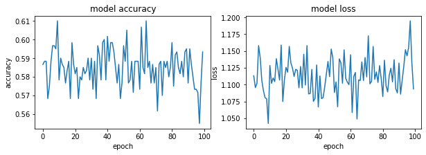

#### AdDelta - 0.5


```python
optimizer= tf.keras.optimizers.Adadelta(learning_rate=0.5)
model.compile(optimizer=optimizer,
              loss='sparse_categorical_crossentropy',
              metrics=['accuracy'])
#history = model.fit(X, Y, validation_split=0.33, epochs=150, batch_size=10, verbose=0)
history = model.fit(x_train_, y_train_, epochs=100)
model.evaluate(x_test_,  y_test_, verbose=2)
```

    Epoch 1/100
    19/19 [==============================] - 0s 1ms/step - loss: 1.0924 - accuracy: 0.5933
    Epoch 2/100
    19/19 [==============================] - 0s 1ms/step - loss: 1.1461 - accuracy: 0.5700
    Epoch 3/100
    19/19 [==============================] - 0s 1ms/step - loss: 1.1537 - accuracy: 0.5733
    Epoch 4/100
    19/19 [==============================] - 0s 1ms/step - loss: 1.1576 - accuracy: 0.5683
    Epoch 5/100
    19/19 [==============================] - 0s 1ms/step - loss: 1.1030 - accuracy: 0.5900
    Epoch 6/100
    19/19 [==============================] - 0s 1ms/step - loss: 1.0949 - accuracy: 0.5950
    Epoch 7/100
    19/19 [==============================] - 0s 2ms/step - loss: 1.0838 - accuracy: 0.5967
    Epoch 8/100
    19/19 [==============================] - 0s 2ms/step - loss: 1.0952 - accuracy: 0.5933
    Epoch 9/100
    19/19 [==============================] - 0s 1ms/step - loss: 1.1241 - accuracy: 0.5833
    Epoch 10/100
    19/19 [==============================] - 0s 1ms/step - loss: 1.1553 - accuracy: 0.5700
    Epoch 11/100
    19/19 [==============================] - 0s 1ms/step - loss: 1.1147 - accuracy: 0.5867
    Epoch 12/100
    19/19 [==============================] - 0s 1ms/step - loss: 1.1152 - accuracy: 0.5833
    Epoch 13/100
    19/19 [==============================] - 0s 1ms/step - loss: 1.1706 - accuracy: 0.5633
    Epoch 14/100
    19/19 [==============================] - 0s 1ms/step - loss: 1.0922 - accuracy: 0.5900
    Epoch 15/100
    19/19 [==============================] - 0s 1ms/step - loss: 1.0606 - accuracy: 0.6033
    Epoch 16/100
    19/19 [==============================] - 0s 1ms/step - loss: 1.1384 - accuracy: 0.5767
    Epoch 17/100
    19/19 [==============================] - 0s 1ms/step - loss: 1.1129 - accuracy: 0.5883
    Epoch 18/100
    19/19 [==============================] - 0s 1ms/step - loss: 1.1366 - accuracy: 0.5767
    Epoch 19/100
    19/19 [==============================] - 0s 1ms/step - loss: 1.0724 - accuracy: 0.6000
    Epoch 20/100
    19/19 [==============================] - 0s 1ms/step - loss: 1.1793 - accuracy: 0.5567
    Epoch 21/100
    19/19 [==============================] - 0s 1ms/step - loss: 1.1617 - accuracy: 0.5700
    Epoch 22/100
    19/19 [==============================] - 0s 1ms/step - loss: 1.0641 - accuracy: 0.6033
    Epoch 23/100
    19/19 [==============================] - 0s 1ms/step - loss: 1.1525 - accuracy: 0.5717
    Epoch 24/100
    19/19 [==============================] - 0s 1ms/step - loss: 1.1180 - accuracy: 0.5817
    Epoch 25/100
    19/19 [==============================] - 0s 1ms/step - loss: 1.1357 - accuracy: 0.5783
    Epoch 26/100
    19/19 [==============================] - 0s 1ms/step - loss: 1.1087 - accuracy: 0.5867
    Epoch 27/100
    19/19 [==============================] - 0s 1ms/step - loss: 1.1188 - accuracy: 0.5817
    Epoch 28/100
    19/19 [==============================] - 0s 1ms/step - loss: 1.1337 - accuracy: 0.5783
    Epoch 29/100
    19/19 [==============================] - 0s 1ms/step - loss: 1.1207 - accuracy: 0.5783
    Epoch 30/100
    19/19 [==============================] - 0s 1ms/step - loss: 1.1242 - accuracy: 0.5833
    Epoch 31/100
    19/19 [==============================] - 0s 1ms/step - loss: 1.0789 - accuracy: 0.5983
    Epoch 32/100
    19/19 [==============================] - 0s 1ms/step - loss: 1.0996 - accuracy: 0.5867
    Epoch 33/100
    19/19 [==============================] - 0s 1ms/step - loss: 1.0772 - accuracy: 0.5983
    Epoch 34/100
    19/19 [==============================] - 0s 1ms/step - loss: 1.0472 - accuracy: 0.6100
    Epoch 35/100
    19/19 [==============================] - 0s 1ms/step - loss: 1.1659 - accuracy: 0.5667
    Epoch 36/100
    19/19 [==============================] - 0s 1ms/step - loss: 1.1127 - accuracy: 0.5867
    Epoch 37/100
    19/19 [==============================] - 0s 1ms/step - loss: 1.1034 - accuracy: 0.5917
    Epoch 38/100
    19/19 [==============================] - 0s 1ms/step - loss: 1.0801 - accuracy: 0.5983
    Epoch 39/100
    19/19 [==============================] - 0s 1ms/step - loss: 1.1269 - accuracy: 0.5783
    Epoch 40/100
    19/19 [==============================] - 0s 1ms/step - loss: 1.1019 - accuracy: 0.5883
    Epoch 41/100
    19/19 [==============================] - 0s 1ms/step - loss: 1.1214 - accuracy: 0.5800
    Epoch 42/100
    19/19 [==============================] - 0s 1ms/step - loss: 1.1126 - accuracy: 0.5867
    Epoch 43/100
    19/19 [==============================] - 0s 1ms/step - loss: 1.1461 - accuracy: 0.5717
    Epoch 44/100
    19/19 [==============================] - 0s 1ms/step - loss: 1.0886 - accuracy: 0.5933
    Epoch 45/100
    19/19 [==============================] - 0s 1ms/step - loss: 1.1405 - accuracy: 0.5733
    Epoch 46/100
    19/19 [==============================] - 0s 1ms/step - loss: 1.1340 - accuracy: 0.5783
    Epoch 47/100
    19/19 [==============================] - 0s 1ms/step - loss: 1.1273 - accuracy: 0.5800
    Epoch 48/100
    19/19 [==============================] - 0s 1ms/step - loss: 1.1351 - accuracy: 0.5817
    Epoch 49/100
    19/19 [==============================] - 0s 1ms/step - loss: 1.0914 - accuracy: 0.5933
    Epoch 50/100
    19/19 [==============================] - 0s 1ms/step - loss: 1.0809 - accuracy: 0.5950
    Epoch 51/100
    19/19 [==============================] - 0s 1ms/step - loss: 1.1161 - accuracy: 0.5850
    Epoch 52/100
    19/19 [==============================] - 0s 1ms/step - loss: 1.0760 - accuracy: 0.5983
    Epoch 53/100
    19/19 [==============================] - 0s 1ms/step - loss: 1.1101 - accuracy: 0.5850
    Epoch 54/100
    19/19 [==============================] - 0s 1ms/step - loss: 1.1737 - accuracy: 0.5633
    Epoch 55/100
    19/19 [==============================] - 0s 1ms/step - loss: 1.1045 - accuracy: 0.5850
    Epoch 56/100
    19/19 [==============================] - 0s 1ms/step - loss: 1.1053 - accuracy: 0.5900
    Epoch 57/100
    19/19 [==============================] - 0s 1ms/step - loss: 1.0998 - accuracy: 0.5933
    Epoch 58/100
    19/19 [==============================] - 0s 1ms/step - loss: 1.1145 - accuracy: 0.5833
    Epoch 59/100
    19/19 [==============================] - 0s 1ms/step - loss: 1.1244 - accuracy: 0.5817
    Epoch 60/100
    19/19 [==============================] - 0s 1ms/step - loss: 1.1497 - accuracy: 0.5700
    Epoch 61/100
    19/19 [==============================] - 0s 894us/step - loss: 1.1156 - accuracy: 0.5833
    Epoch 62/100
    19/19 [==============================] - 0s 1ms/step - loss: 1.1361 - accuracy: 0.5783
    Epoch 63/100
    19/19 [==============================] - 0s 1000us/step - loss: 1.1070 - accuracy: 0.5883
    Epoch 64/100
    19/19 [==============================] - 0s 1000us/step - loss: 1.1304 - accuracy: 0.5767
    Epoch 65/100
    19/19 [==============================] - 0s 1ms/step - loss: 1.1047 - accuracy: 0.5917
    Epoch 66/100
    19/19 [==============================] - 0s 1ms/step - loss: 1.0747 - accuracy: 0.5983
    Epoch 67/100
    19/19 [==============================] - 0s 1ms/step - loss: 1.0909 - accuracy: 0.5933
    Epoch 68/100
    19/19 [==============================] - 0s 1000us/step - loss: 1.1063 - accuracy: 0.5900
    Epoch 69/100
    19/19 [==============================] - 0s 1ms/step - loss: 1.1259 - accuracy: 0.5817
    Epoch 70/100
    19/19 [==============================] - 0s 1ms/step - loss: 1.1139 - accuracy: 0.5850
    Epoch 71/100
    19/19 [==============================] - 0s 1000us/step - loss: 1.1347 - accuracy: 0.5767
    Epoch 72/100
    19/19 [==============================] - 0s 1ms/step - loss: 1.0964 - accuracy: 0.5900
    Epoch 73/100
    19/19 [==============================] - 0s 1ms/step - loss: 1.1400 - accuracy: 0.5767
    Epoch 74/100
    19/19 [==============================] - 0s 1000us/step - loss: 1.1250 - accuracy: 0.5783
    Epoch 75/100
    19/19 [==============================] - 0s 1000us/step - loss: 1.1394 - accuracy: 0.5733
    Epoch 76/100
    19/19 [==============================] - 0s 1ms/step - loss: 1.0638 - accuracy: 0.6033
    Epoch 77/100
    19/19 [==============================] - 0s 1000us/step - loss: 1.1139 - accuracy: 0.5850
    Epoch 78/100
    19/19 [==============================] - 0s 1000us/step - loss: 1.1500 - accuracy: 0.5717
    Epoch 79/100
    19/19 [==============================] - 0s 1ms/step - loss: 1.1247 - accuracy: 0.5800
    Epoch 80/100
    19/19 [==============================] - 0s 1ms/step - loss: 1.1111 - accuracy: 0.5850
    Epoch 81/100
    19/19 [==============================] - 0s 1ms/step - loss: 1.1059 - accuracy: 0.5867
    Epoch 82/100
    19/19 [==============================] - 0s 1000us/step - loss: 1.1054 - accuracy: 0.5867
    Epoch 83/100
    19/19 [==============================] - 0s 1ms/step - loss: 1.0949 - accuracy: 0.5917
    Epoch 84/100
    19/19 [==============================] - 0s 947us/step - loss: 1.1318 - accuracy: 0.5783
    Epoch 85/100
    19/19 [==============================] - 0s 1ms/step - loss: 1.1327 - accuracy: 0.5767
    Epoch 86/100
    19/19 [==============================] - 0s 1ms/step - loss: 1.1401 - accuracy: 0.5717
    Epoch 87/100
    19/19 [==============================] - 0s 1000us/step - loss: 1.1631 - accuracy: 0.5650
    Epoch 88/100
    19/19 [==============================] - 0s 1000us/step - loss: 1.1335 - accuracy: 0.5783
    Epoch 89/100
    19/19 [==============================] - 0s 1ms/step - loss: 1.1279 - accuracy: 0.5833
    Epoch 90/100
    19/19 [==============================] - 0s 1000us/step - loss: 1.0975 - accuracy: 0.5917
    Epoch 91/100
    19/19 [==============================] - 0s 1000us/step - loss: 1.0737 - accuracy: 0.6000
    Epoch 92/100
    19/19 [==============================] - 0s 1ms/step - loss: 1.0930 - accuracy: 0.5900
    Epoch 93/100
    19/19 [==============================] - 0s 1ms/step - loss: 1.1347 - accuracy: 0.5767
    Epoch 94/100
    19/19 [==============================] - 0s 1ms/step - loss: 1.1316 - accuracy: 0.5783
    Epoch 95/100
    19/19 [==============================] - 0s 1ms/step - loss: 1.1173 - accuracy: 0.5867
    Epoch 96/100
    19/19 [==============================] - 0s 1000us/step - loss: 1.1018 - accuracy: 0.5883
    Epoch 97/100
    19/19 [==============================] - 0s 1000us/step - loss: 1.1024 - accuracy: 0.5883
    Epoch 98/100
    19/19 [==============================] - 0s 1ms/step - loss: 1.1013 - accuracy: 0.5900
    Epoch 99/100
    19/19 [==============================] - 0s 1000us/step - loss: 1.1008 - accuracy: 0.5917
    Epoch 100/100
    19/19 [==============================] - 0s 1ms/step - loss: 1.0725 - accuracy: 0.5983
    4/4 - 0s - loss: 1047.5928 - accuracy: 0.0700
    


    [1047.5927734375, 0.07000000029802322]


```python
fig, (ax1, ax2) = plt.subplots(1, 2, figsize=(10, 3))

#ax1.subplot(1, 2, 1)
ax1.plot(history.history['accuracy'])
#plt.plot(history.history['val_accuracy'])
ax1.set_title('model accuracy')
ax1.set_ylabel('accuracy')
ax1.set_xlabel('epoch')
#ax1.show()

#ax2.subplot(1, 2, 2)
ax2.plot(history.history['loss'])
#plt.plot(history.history['val_loss'])
ax2.set_title('model loss')
ax2.set_ylabel('loss')
ax2.set_xlabel('epoch')
```


#### AdDelta - 0.9


```python
optimizer= tf.keras.optimizers.Adadelta(learning_rate=0.9)
model.compile(optimizer=optimizer,
              loss='sparse_categorical_crossentropy',
              metrics=['accuracy'])
#history = model.fit(X, Y, validation_split=0.33, epochs=150, batch_size=10, verbose=0)
history = model.fit(x_train_, y_train_, epochs=100)
model.evaluate(x_test_,  y_test_, verbose=2)
```

    Epoch 1/100
    19/19 [==============================] - 0s 2ms/step - loss: 1.1218 - accuracy: 0.5800
    Epoch 2/100
    19/19 [==============================] - 0s 1ms/step - loss: 1.0951 - accuracy: 0.5917
    Epoch 3/100
    19/19 [==============================] - 0s 1ms/step - loss: 1.1503 - accuracy: 0.5683
    Epoch 4/100
    19/19 [==============================] - 0s 1ms/step - loss: 1.2019 - accuracy: 0.5533
    Epoch 5/100
    19/19 [==============================] - 0s 1ms/step - loss: 1.1276 - accuracy: 0.5800
    Epoch 6/100
    19/19 [==============================] - 0s 1ms/step - loss: 1.1301 - accuracy: 0.5783
    Epoch 7/100
    19/19 [==============================] - 0s 1ms/step - loss: 1.0719 - accuracy: 0.6033
    Epoch 8/100
    19/19 [==============================] - 0s 1ms/step - loss: 1.1208 - accuracy: 0.5800
    Epoch 9/100
    19/19 [==============================] - 0s 1ms/step - loss: 1.1361 - accuracy: 0.5750
    Epoch 10/100
    19/19 [==============================] - 0s 1ms/step - loss: 1.1144 - accuracy: 0.5867
    Epoch 11/100
    19/19 [==============================] - 0s 1ms/step - loss: 1.1121 - accuracy: 0.5867
    Epoch 12/100
    19/19 [==============================] - 0s 1ms/step - loss: 1.0762 - accuracy: 0.5983
    Epoch 13/100
    19/19 [==============================] - 0s 2ms/step - loss: 1.0844 - accuracy: 0.5950
    Epoch 14/100
    19/19 [==============================] - 0s 1ms/step - loss: 1.1306 - accuracy: 0.5800
    Epoch 15/100
    19/19 [==============================] - 0s 1ms/step - loss: 1.0684 - accuracy: 0.6050
    Epoch 16/100
    19/19 [==============================] - 0s 1ms/step - loss: 1.0992 - accuracy: 0.5900
    Epoch 17/100
    19/19 [==============================] - 0s 1ms/step - loss: 1.0674 - accuracy: 0.6000
    Epoch 18/100
    19/19 [==============================] - 0s 1ms/step - loss: 1.1555 - accuracy: 0.5683
    Epoch 19/100
    19/19 [==============================] - 0s 1ms/step - loss: 1.1264 - accuracy: 0.5817
    Epoch 20/100
    19/19 [==============================] - 0s 1ms/step - loss: 1.0806 - accuracy: 0.5967
    Epoch 21/100
    19/19 [==============================] - 0s 1ms/step - loss: 1.1451 - accuracy: 0.5750
    Epoch 22/100
    19/19 [==============================] - 0s 1ms/step - loss: 1.0873 - accuracy: 0.5933
    Epoch 23/100
    19/19 [==============================] - 0s 1ms/step - loss: 1.1228 - accuracy: 0.5800
    Epoch 24/100
    19/19 [==============================] - 0s 1ms/step - loss: 1.1462 - accuracy: 0.5733
    Epoch 25/100
    19/19 [==============================] - 0s 1ms/step - loss: 1.1265 - accuracy: 0.5817
    Epoch 26/100
    19/19 [==============================] - 0s 1ms/step - loss: 1.0912 - accuracy: 0.5950
    Epoch 27/100
    19/19 [==============================] - 0s 1ms/step - loss: 1.0892 - accuracy: 0.5950
    Epoch 28/100
    19/19 [==============================] - 0s 1ms/step - loss: 1.0903 - accuracy: 0.5917
    Epoch 29/100
    19/19 [==============================] - 0s 1ms/step - loss: 1.1510 - accuracy: 0.5733
    Epoch 30/100
    19/19 [==============================] - 0s 1ms/step - loss: 1.1226 - accuracy: 0.5817
    Epoch 31/100
    19/19 [==============================] - 0s 1ms/step - loss: 1.0609 - accuracy: 0.6050
    Epoch 32/100
    19/19 [==============================] - 0s 1ms/step - loss: 1.1427 - accuracy: 0.5717
    Epoch 33/100
    19/19 [==============================] - 0s 1ms/step - loss: 1.1641 - accuracy: 0.5650
    Epoch 34/100
    19/19 [==============================] - 0s 1ms/step - loss: 1.1286 - accuracy: 0.5817
    Epoch 35/100
    19/19 [==============================] - 0s 1ms/step - loss: 1.0899 - accuracy: 0.5917
    Epoch 36/100
    19/19 [==============================] - 0s 1ms/step - loss: 1.1558 - accuracy: 0.5683
    Epoch 37/100
    19/19 [==============================] - 0s 1ms/step - loss: 1.0537 - accuracy: 0.6050
    Epoch 38/100
    19/19 [==============================] - 0s 1ms/step - loss: 1.0971 - accuracy: 0.5883
    Epoch 39/100
    19/19 [==============================] - 0s 1ms/step - loss: 1.0814 - accuracy: 0.5950
    Epoch 40/100
    19/19 [==============================] - 0s 1ms/step - loss: 1.1173 - accuracy: 0.5850
    Epoch 41/100
    19/19 [==============================] - 0s 1ms/step - loss: 1.0787 - accuracy: 0.6000
    Epoch 42/100
    19/19 [==============================] - 0s 1ms/step - loss: 1.1027 - accuracy: 0.5900
    Epoch 43/100
    19/19 [==============================] - 0s 1ms/step - loss: 1.0892 - accuracy: 0.5933
    Epoch 44/100
    19/19 [==============================] - 0s 1ms/step - loss: 1.1748 - accuracy: 0.5633
    Epoch 45/100
    19/19 [==============================] - 0s 1ms/step - loss: 1.1214 - accuracy: 0.5817
    Epoch 46/100
    19/19 [==============================] - 0s 1ms/step - loss: 1.1029 - accuracy: 0.5883
    Epoch 47/100
    19/19 [==============================] - 0s 1ms/step - loss: 1.0861 - accuracy: 0.5950
    Epoch 48/100
    19/19 [==============================] - 0s 1ms/step - loss: 1.1790 - accuracy: 0.5633
    Epoch 49/100
    19/19 [==============================] - 0s 2ms/step - loss: 1.1167 - accuracy: 0.5850
    Epoch 50/100
    19/19 [==============================] - 0s 1ms/step - loss: 1.0930 - accuracy: 0.5933
    Epoch 51/100
    19/19 [==============================] - 0s 1ms/step - loss: 1.0757 - accuracy: 0.6017
    Epoch 52/100
    19/19 [==============================] - 0s 1ms/step - loss: 1.1187 - accuracy: 0.5817
    Epoch 53/100
    19/19 [==============================] - 0s 1ms/step - loss: 1.1157 - accuracy: 0.5833
    Epoch 54/100
    19/19 [==============================] - 0s 2ms/step - loss: 1.1243 - accuracy: 0.5800
    Epoch 55/100
    19/19 [==============================] - 0s 1ms/step - loss: 1.1207 - accuracy: 0.5850
    Epoch 56/100
    19/19 [==============================] - 0s 1ms/step - loss: 1.1238 - accuracy: 0.5800
    Epoch 57/100
    19/19 [==============================] - 0s 1000us/step - loss: 1.0745 - accuracy: 0.6017
    Epoch 58/100
    19/19 [==============================] - 0s 1ms/step - loss: 1.0780 - accuracy: 0.5983
    Epoch 59/100
    19/19 [==============================] - 0s 1ms/step - loss: 1.1193 - accuracy: 0.5833
    Epoch 60/100
    19/19 [==============================] - 0s 1ms/step - loss: 1.1038 - accuracy: 0.5867
    Epoch 61/100
    19/19 [==============================] - 0s 1ms/step - loss: 1.1004 - accuracy: 0.5900
    Epoch 62/100
    19/19 [==============================] - 0s 1ms/step - loss: 1.1346 - accuracy: 0.5767
    Epoch 63/100
    19/19 [==============================] - 0s 1ms/step - loss: 1.1386 - accuracy: 0.5750
    Epoch 64/100
    19/19 [==============================] - 0s 1ms/step - loss: 1.1835 - accuracy: 0.5600
    Epoch 65/100
    19/19 [==============================] - 0s 1ms/step - loss: 1.0863 - accuracy: 0.5967
    Epoch 66/100
    19/19 [==============================] - 0s 1ms/step - loss: 1.0933 - accuracy: 0.5933
    Epoch 67/100
    19/19 [==============================] - 0s 1ms/step - loss: 1.1192 - accuracy: 0.5833
    Epoch 68/100
    19/19 [==============================] - 0s 1ms/step - loss: 1.0993 - accuracy: 0.5900
    Epoch 69/100
    19/19 [==============================] - 0s 1ms/step - loss: 1.1154 - accuracy: 0.5850
    Epoch 70/100
    19/19 [==============================] - 0s 947us/step - loss: 1.0562 - accuracy: 0.6050
    Epoch 71/100
    19/19 [==============================] - 0s 1ms/step - loss: 1.1086 - accuracy: 0.5883
    Epoch 72/100
    19/19 [==============================] - 0s 1ms/step - loss: 1.1012 - accuracy: 0.5917
    Epoch 73/100
    19/19 [==============================] - 0s 1ms/step - loss: 1.1235 - accuracy: 0.5817
    Epoch 74/100
    19/19 [==============================] - 0s 1ms/step - loss: 1.0880 - accuracy: 0.5933
    Epoch 75/100
    19/19 [==============================] - 0s 1ms/step - loss: 1.1104 - accuracy: 0.5867
    Epoch 76/100
    19/19 [==============================] - 0s 1ms/step - loss: 1.1339 - accuracy: 0.5767
    Epoch 77/100
    19/19 [==============================] - 0s 1ms/step - loss: 1.1366 - accuracy: 0.5750
    Epoch 78/100
    19/19 [==============================] - 0s 1ms/step - loss: 1.1294 - accuracy: 0.5817
    Epoch 79/100
    19/19 [==============================] - 0s 1ms/step - loss: 1.1100 - accuracy: 0.5850
    Epoch 80/100
    19/19 [==============================] - 0s 1ms/step - loss: 1.1367 - accuracy: 0.5767
    Epoch 81/100
    19/19 [==============================] - 0s 1ms/step - loss: 1.1077 - accuracy: 0.5883
    Epoch 82/100
    19/19 [==============================] - 0s 1ms/step - loss: 1.0899 - accuracy: 0.5950
    Epoch 83/100
    19/19 [==============================] - 0s 1ms/step - loss: 1.1247 - accuracy: 0.5800
    Epoch 84/100
    19/19 [==============================] - 0s 1ms/step - loss: 1.0770 - accuracy: 0.5983
    Epoch 85/100
    19/19 [==============================] - 0s 1ms/step - loss: 1.1426 - accuracy: 0.5750
    Epoch 86/100
    19/19 [==============================] - 0s 1ms/step - loss: 1.0933 - accuracy: 0.5900
    Epoch 87/100
    19/19 [==============================] - 0s 1ms/step - loss: 1.1142 - accuracy: 0.5850
    Epoch 88/100
    19/19 [==============================] - 0s 1ms/step - loss: 1.1026 - accuracy: 0.5883
    Epoch 89/100
    19/19 [==============================] - 0s 1ms/step - loss: 1.1396 - accuracy: 0.5733
    Epoch 90/100
    19/19 [==============================] - 0s 1ms/step - loss: 1.0730 - accuracy: 0.6017
    Epoch 91/100
    19/19 [==============================] - 0s 1ms/step - loss: 1.0950 - accuracy: 0.5950
    Epoch 92/100
    19/19 [==============================] - 0s 1ms/step - loss: 1.1556 - accuracy: 0.5700
    Epoch 93/100
    19/19 [==============================] - 0s 1ms/step - loss: 1.1013 - accuracy: 0.5900
    Epoch 94/100
    19/19 [==============================] - 0s 1ms/step - loss: 1.1016 - accuracy: 0.5883
    Epoch 95/100
    19/19 [==============================] - 0s 1ms/step - loss: 1.1508 - accuracy: 0.5717
    Epoch 96/100
    19/19 [==============================] - 0s 1ms/step - loss: 1.1156 - accuracy: 0.5850
    Epoch 97/100
    19/19 [==============================] - 0s 1ms/step - loss: 1.1007 - accuracy: 0.5883
    Epoch 98/100
    19/19 [==============================] - 0s 1ms/step - loss: 1.1139 - accuracy: 0.5850
    Epoch 99/100
    19/19 [==============================] - 0s 1ms/step - loss: 1.0893 - accuracy: 0.5950
    Epoch 100/100
    19/19 [==============================] - 0s 1ms/step - loss: 1.1040 - accuracy: 0.5850
    4/4 - 0s - loss: 1047.5885 - accuracy: 0.0700
    


    [1047.5885009765625, 0.07000000029802322]


```python
fig, (ax1, ax2) = plt.subplots(1, 2, figsize=(10, 3))

#ax1.subplot(1, 2, 1)
ax1.plot(history.history['accuracy'])
#plt.plot(history.history['val_accuracy'])
ax1.set_title('model accuracy')
ax1.set_ylabel('accuracy')
ax1.set_xlabel('epoch')
#ax1.show()

#ax2.subplot(1, 2, 2)
ax2.plot(history.history['loss'])
#plt.plot(history.history['val_loss'])
ax2.set_title('model loss')
ax2.set_ylabel('loss')
ax2.set_xlabel('epoch')
```


#### AdDelta - 1.5


```python
optimizer= tf.keras.optimizers.Adadelta(learning_rate=1.5)
model.compile(optimizer=optimizer,
              loss='sparse_categorical_crossentropy',
              metrics=['accuracy'])
#history = model.fit(X, Y, validation_split=0.33, epochs=150, batch_size=10, verbose=0)
history = model.fit(x_train_, y_train_, epochs=100)
model.evaluate(x_test_,  y_test_, verbose=2)
```

    Epoch 1/100
    19/19 [==============================] - 0s 1ms/step - loss: 1.1522 - accuracy: 0.5483
    Epoch 2/100
    19/19 [==============================] - 0s 1ms/step - loss: 1.1270 - accuracy: 0.5817
    Epoch 3/100
    19/19 [==============================] - 0s 1ms/step - loss: 1.0895 - accuracy: 0.5950
    Epoch 4/100
    19/19 [==============================] - 0s 1ms/step - loss: 1.1294 - accuracy: 0.5667
    Epoch 5/100
    19/19 [==============================] - 0s 1ms/step - loss: 1.0976 - accuracy: 0.5800
    Epoch 6/100
    19/19 [==============================] - 0s 1ms/step - loss: 1.0977 - accuracy: 0.5950
    Epoch 7/100
    19/19 [==============================] - 0s 1ms/step - loss: 1.1417 - accuracy: 0.5750
    Epoch 8/100
    19/19 [==============================] - 0s 1ms/step - loss: 1.1115 - accuracy: 0.5800
    Epoch 9/100
    19/19 [==============================] - 0s 1ms/step - loss: 1.1117 - accuracy: 0.5750
    Epoch 10/100
    19/19 [==============================] - 0s 1ms/step - loss: 1.1165 - accuracy: 0.5850
    Epoch 11/100
    19/19 [==============================] - 0s 1ms/step - loss: 1.1181 - accuracy: 0.5850
    Epoch 12/100
    19/19 [==============================] - 0s 1ms/step - loss: 1.1226 - accuracy: 0.5817
    Epoch 13/100
    19/19 [==============================] - 0s 1ms/step - loss: 1.1430 - accuracy: 0.5767
    Epoch 14/100
    19/19 [==============================] - 0s 1ms/step - loss: 1.1486 - accuracy: 0.5617
    Epoch 15/100
    19/19 [==============================] - 0s 2ms/step - loss: 1.1172 - accuracy: 0.5833
    Epoch 16/100
    19/19 [==============================] - 0s 2ms/step - loss: 1.0933 - accuracy: 0.5967
    Epoch 17/100
    19/19 [==============================] - 0s 2ms/step - loss: 1.1326 - accuracy: 0.5783
    Epoch 18/100
    19/19 [==============================] - 0s 2ms/step - loss: 1.1278 - accuracy: 0.5800
    Epoch 19/100
    19/19 [==============================] - 0s 2ms/step - loss: 1.1614 - accuracy: 0.5700
    Epoch 20/100
    19/19 [==============================] - 0s 2ms/step - loss: 1.1203 - accuracy: 0.5800
    Epoch 21/100
    19/19 [==============================] - 0s 2ms/step - loss: 1.1105 - accuracy: 0.5850
    Epoch 22/100
    19/19 [==============================] - 0s 2ms/step - loss: 1.1391 - accuracy: 0.5733
    Epoch 23/100
    19/19 [==============================] - 0s 1ms/step - loss: 1.0781 - accuracy: 0.6000
    Epoch 24/100
    19/19 [==============================] - 0s 1ms/step - loss: 1.0884 - accuracy: 0.5917
    Epoch 25/100
    19/19 [==============================] - 0s 1ms/step - loss: 1.1240 - accuracy: 0.5817
    Epoch 26/100
    19/19 [==============================] - 0s 1ms/step - loss: 1.0759 - accuracy: 0.6017
    Epoch 27/100
    19/19 [==============================] - 0s 1ms/step - loss: 1.1483 - accuracy: 0.5733
    Epoch 28/100
    19/19 [==============================] - 0s 1ms/step - loss: 1.1344 - accuracy: 0.5767
    Epoch 29/100
    19/19 [==============================] - 0s 1ms/step - loss: 1.1742 - accuracy: 0.5633
    Epoch 30/100
    19/19 [==============================] - 0s 1ms/step - loss: 1.0903 - accuracy: 0.5917
    Epoch 31/100
    19/19 [==============================] - 0s 2ms/step - loss: 1.1219 - accuracy: 0.5783
    Epoch 32/100
    19/19 [==============================] - 0s 1ms/step - loss: 1.0878 - accuracy: 0.5950
    Epoch 33/100
    19/19 [==============================] - 0s 1ms/step - loss: 1.1438 - accuracy: 0.5700
    Epoch 34/100
    19/19 [==============================] - 0s 1ms/step - loss: 1.1030 - accuracy: 0.5883
    Epoch 35/100
    19/19 [==============================] - 0s 1ms/step - loss: 1.1065 - accuracy: 0.5867
    Epoch 36/100
    19/19 [==============================] - 0s 1ms/step - loss: 1.1564 - accuracy: 0.5667
    Epoch 37/100
    19/19 [==============================] - 0s 1ms/step - loss: 1.1379 - accuracy: 0.5750
    Epoch 38/100
    19/19 [==============================] - 0s 1ms/step - loss: 1.1265 - accuracy: 0.5700
    Epoch 39/100
    19/19 [==============================] - 0s 1ms/step - loss: 1.0790 - accuracy: 0.6000
    Epoch 40/100
    19/19 [==============================] - 0s 1ms/step - loss: 1.1083 - accuracy: 0.5867
    Epoch 41/100
    19/19 [==============================] - 0s 1ms/step - loss: 1.1042 - accuracy: 0.5900
    Epoch 42/100
    19/19 [==============================] - 0s 1ms/step - loss: 1.0974 - accuracy: 0.5900
    Epoch 43/100
    19/19 [==============================] - 0s 1ms/step - loss: 1.0838 - accuracy: 0.5950
    Epoch 44/100
    19/19 [==============================] - 0s 1ms/step - loss: 1.0792 - accuracy: 0.5967
    Epoch 45/100
    19/19 [==============================] - 0s 1ms/step - loss: 1.1024 - accuracy: 0.5883
    Epoch 46/100
    19/19 [==============================] - 0s 1ms/step - loss: 1.1032 - accuracy: 0.5817
    Epoch 47/100
    19/19 [==============================] - 0s 1ms/step - loss: 1.1356 - accuracy: 0.5767
    Epoch 48/100
    19/19 [==============================] - 0s 1ms/step - loss: 1.0883 - accuracy: 0.5933
    Epoch 49/100
    19/19 [==============================] - 0s 1ms/step - loss: 1.1113 - accuracy: 0.5867
    Epoch 50/100
    19/19 [==============================] - 0s 1ms/step - loss: 1.1111 - accuracy: 0.5850
    Epoch 51/100
    19/19 [==============================] - 0s 1ms/step - loss: 1.1358 - accuracy: 0.5750
    Epoch 52/100
    19/19 [==============================] - 0s 1ms/step - loss: 1.1455 - accuracy: 0.5700
    Epoch 53/100
    19/19 [==============================] - 0s 1ms/step - loss: 1.1080 - accuracy: 0.5883
    Epoch 54/100
    19/19 [==============================] - 0s 1ms/step - loss: 1.1045 - accuracy: 0.5917
    Epoch 55/100
    19/19 [==============================] - 0s 1ms/step - loss: 1.1250 - accuracy: 0.5817
    Epoch 56/100
    19/19 [==============================] - 0s 1ms/step - loss: 1.0986 - accuracy: 0.5900
    Epoch 57/100
    19/19 [==============================] - 0s 1ms/step - loss: 1.1583 - accuracy: 0.5700
    Epoch 58/100
    19/19 [==============================] - 0s 1ms/step - loss: 1.1480 - accuracy: 0.5700
    Epoch 59/100
    19/19 [==============================] - 0s 1ms/step - loss: 1.1405 - accuracy: 0.5733
    Epoch 60/100
    19/19 [==============================] - 0s 1ms/step - loss: 1.1108 - accuracy: 0.5867
    Epoch 61/100
    19/19 [==============================] - 0s 1ms/step - loss: 1.0887 - accuracy: 0.5933
    Epoch 62/100
    19/19 [==============================] - 0s 1ms/step - loss: 1.0945 - accuracy: 0.5917
    Epoch 63/100
    19/19 [==============================] - 0s 1ms/step - loss: 1.1732 - accuracy: 0.5617
    Epoch 64/100
    19/19 [==============================] - 0s 1ms/step - loss: 1.1302 - accuracy: 0.5783
    Epoch 65/100
    19/19 [==============================] - 0s 1ms/step - loss: 1.0704 - accuracy: 0.6000
    Epoch 66/100
    19/19 [==============================] - 0s 1ms/step - loss: 1.1223 - accuracy: 0.5833
    Epoch 67/100
    19/19 [==============================] - 0s 1ms/step - loss: 1.1506 - accuracy: 0.5700
    Epoch 68/100
    19/19 [==============================] - 0s 1ms/step - loss: 1.0827 - accuracy: 0.5950
    Epoch 69/100
    19/19 [==============================] - 0s 1ms/step - loss: 1.1001 - accuracy: 0.5900
    Epoch 70/100
    19/19 [==============================] - 0s 1ms/step - loss: 1.1522 - accuracy: 0.5733
    Epoch 71/100
    19/19 [==============================] - 0s 1ms/step - loss: 1.1464 - accuracy: 0.5717
    Epoch 72/100
    19/19 [==============================] - 0s 1ms/step - loss: 1.1200 - accuracy: 0.5800
    Epoch 73/100
    19/19 [==============================] - 0s 1ms/step - loss: 1.0569 - accuracy: 0.6050
    Epoch 74/100
    19/19 [==============================] - 0s 1ms/step - loss: 1.1015 - accuracy: 0.5900
    Epoch 75/100
    19/19 [==============================] - 0s 1ms/step - loss: 1.1046 - accuracy: 0.5900
    Epoch 76/100
    19/19 [==============================] - 0s 1ms/step - loss: 1.1517 - accuracy: 0.5683
    Epoch 77/100
    19/19 [==============================] - 0s 1ms/step - loss: 1.0985 - accuracy: 0.5883
    Epoch 78/100
    19/19 [==============================] - 0s 1ms/step - loss: 1.1650 - accuracy: 0.5650
    Epoch 79/100
    19/19 [==============================] - 0s 1ms/step - loss: 1.1347 - accuracy: 0.5767
    Epoch 80/100
    19/19 [==============================] - 0s 1ms/step - loss: 1.0709 - accuracy: 0.6000
    Epoch 81/100
    19/19 [==============================] - 0s 1ms/step - loss: 1.0875 - accuracy: 0.5967
    Epoch 82/100
    19/19 [==============================] - 0s 1ms/step - loss: 1.1378 - accuracy: 0.5767
    Epoch 83/100
    19/19 [==============================] - 0s 1ms/step - loss: 1.1097 - accuracy: 0.5850
    Epoch 84/100
    19/19 [==============================] - 0s 1ms/step - loss: 1.1242 - accuracy: 0.5800
    Epoch 85/100
    19/19 [==============================] - 0s 1ms/step - loss: 1.1505 - accuracy: 0.5733
    Epoch 86/100
    19/19 [==============================] - 0s 1ms/step - loss: 1.1457 - accuracy: 0.5700
    Epoch 87/100
    19/19 [==============================] - 0s 1ms/step - loss: 1.1388 - accuracy: 0.5733
    Epoch 88/100
    19/19 [==============================] - 0s 1ms/step - loss: 1.0898 - accuracy: 0.5950
    Epoch 89/100
    19/19 [==============================] - 0s 1ms/step - loss: 1.0649 - accuracy: 0.6050
    Epoch 90/100
    19/19 [==============================] - 0s 1ms/step - loss: 1.1208 - accuracy: 0.5817
    Epoch 91/100
    19/19 [==============================] - 0s 1ms/step - loss: 1.0952 - accuracy: 0.5900
    Epoch 92/100
    19/19 [==============================] - 0s 1ms/step - loss: 1.0904 - accuracy: 0.5933
    Epoch 93/100
    19/19 [==============================] - 0s 1ms/step - loss: 1.1414 - accuracy: 0.5767
    Epoch 94/100
    19/19 [==============================] - 0s 1ms/step - loss: 1.1472 - accuracy: 0.5733
    Epoch 95/100
    19/19 [==============================] - 0s 1ms/step - loss: 1.1068 - accuracy: 0.5883
    Epoch 96/100
    19/19 [==============================] - 0s 1ms/step - loss: 1.1059 - accuracy: 0.5883
    Epoch 97/100
    19/19 [==============================] - 0s 1ms/step - loss: 1.0853 - accuracy: 0.5950
    Epoch 98/100
    19/19 [==============================] - 0s 1ms/step - loss: 1.1142 - accuracy: 0.5833
    Epoch 99/100
    19/19 [==============================] - 0s 1ms/step - loss: 1.1259 - accuracy: 0.5817
    Epoch 100/100
    19/19 [==============================] - 0s 1ms/step - loss: 1.1755 - accuracy: 0.5600
    4/4 - 0s - loss: 1047.6138 - accuracy: 0.0700
    


    [1047.61376953125, 0.07000000029802322]


```python
fig, (ax1, ax2) = plt.subplots(1, 2, figsize=(10, 3))

#ax1.subplot(1, 2, 1)
ax1.plot(history.history['accuracy'])
#plt.plot(history.history['val_accuracy'])
ax1.set_title('model accuracy')
ax1.set_ylabel('accuracy')
ax1.set_xlabel('epoch')
#ax1.show()

#ax2.subplot(1, 2, 2)
ax2.plot(history.history['loss'])
#plt.plot(history.history['val_loss'])
ax2.set_title('model loss')
ax2.set_ylabel('loss')
ax2.set_xlabel('epoch')
```


### Análisis

- ¿Cuál fue el método de optimización menos afectado por la reducción del conjunto de datos?
    
- ¿Cuál fue la tasa de aprendizaje menos afectada por la reducción del conjunto de datos?
    
- ¿Cuál fue el método que más rápido convergió?


```python
df_sgd = pd.read_excel('comparacion.xlsx',sheet_name='Hoja2',index_col='Tasa aprendizaje')
df_rsm = pd.read_excel('comparacion.xlsx',sheet_name='Hoja3',index_col='Tasa aprendizaje')
df_adagram = pd.read_excel('comparacion.xlsx',sheet_name='Hoja4',index_col='Tasa aprendizaje')
df_adelta = pd.read_excel('comparacion.xlsx',sheet_name='Hoja5',index_col='Tasa aprendizaje')

df = pd.read_excel('comparacion.xlsx',sheet_name='Hoja6')
```

#### SGD


```python
df_sgd
```


<div>
<style scoped>
    .dataframe tbody tr th:only-of-type {
        vertical-align: middle;
    }

    .dataframe tbody tr th {
        vertical-align: top;
    }

    .dataframe thead th {
        text-align: right;
    }
</style>
<table border="1" class="dataframe">
  <thead>
    <tr style="text-align: right;">
      <th></th>
      <th>accuraccy 1</th>
      <th>accuraccy 2</th>
    </tr>
    <tr>
      <th>Tasa aprendizaje</th>
      <th></th>
      <th></th>
    </tr>
  </thead>
  <tbody>
    <tr>
      <th>0.001</th>
      <td>0.981</td>
      <td>0.370</td>
    </tr>
    <tr>
      <th>0.100</th>
      <td>0.981</td>
      <td>0.370</td>
    </tr>
    <tr>
      <th>0.500</th>
      <td>0.975</td>
      <td>0.370</td>
    </tr>
    <tr>
      <th>0.900</th>
      <td>0.968</td>
      <td>0.370</td>
    </tr>
    <tr>
      <th>1.500</th>
      <td>0.959</td>
      <td>0.368</td>
    </tr>
  </tbody>
</table>
</div>


#### RSMprop


```python
df_rsm
```


<div>
<style scoped>
    .dataframe tbody tr th:only-of-type {
        vertical-align: middle;
    }

    .dataframe tbody tr th {
        vertical-align: top;
    }

    .dataframe thead th {
        text-align: right;
    }
</style>
<table border="1" class="dataframe">
  <thead>
    <tr style="text-align: right;">
      <th></th>
      <th>accuraccy 1</th>
      <th>accuraccy 2</th>
    </tr>
    <tr>
      <th>Tasa aprendizaje</th>
      <th></th>
      <th></th>
    </tr>
  </thead>
  <tbody>
    <tr>
      <th>0.001</th>
      <td>0.967</td>
      <td>0.710</td>
    </tr>
    <tr>
      <th>0.100</th>
      <td>0.947</td>
      <td>0.627</td>
    </tr>
    <tr>
      <th>0.500</th>
      <td>0.809</td>
      <td>0.544</td>
    </tr>
    <tr>
      <th>0.900</th>
      <td>0.786</td>
      <td>0.505</td>
    </tr>
    <tr>
      <th>1.500</th>
      <td>0.725</td>
      <td>0.542</td>
    </tr>
  </tbody>
</table>
</div>


#### Adagram


```python
df_adagram
```


<div>
<style scoped>
    .dataframe tbody tr th:only-of-type {
        vertical-align: middle;
    }

    .dataframe tbody tr th {
        vertical-align: top;
    }

    .dataframe thead th {
        text-align: right;
    }
</style>
<table border="1" class="dataframe">
  <thead>
    <tr style="text-align: right;">
      <th></th>
      <th>accuraccy 1</th>
      <th>accuraccy 2</th>
    </tr>
    <tr>
      <th>Tasa aprendizaje</th>
      <th></th>
      <th></th>
    </tr>
  </thead>
  <tbody>
    <tr>
      <th>0.001</th>
      <td>0.724</td>
      <td>0.542</td>
    </tr>
    <tr>
      <th>0.100</th>
      <td>0.719</td>
      <td>0.542</td>
    </tr>
    <tr>
      <th>0.500</th>
      <td>0.724</td>
      <td>0.542</td>
    </tr>
    <tr>
      <th>0.900</th>
      <td>0.728</td>
      <td>0.542</td>
    </tr>
    <tr>
      <th>1.500</th>
      <td>0.725</td>
      <td>0.586</td>
    </tr>
  </tbody>
</table>
</div>


#### AdDelta


```python
df_adelta
```


<div>
<style scoped>
    .dataframe tbody tr th:only-of-type {
        vertical-align: middle;
    }

    .dataframe tbody tr th {
        vertical-align: top;
    }

    .dataframe thead th {
        text-align: right;
    }
</style>
<table border="1" class="dataframe">
  <thead>
    <tr style="text-align: right;">
      <th></th>
      <th>accuraccy 1</th>
      <th>accuraccy 2</th>
    </tr>
    <tr>
      <th>Tasa aprendizaje</th>
      <th></th>
      <th></th>
    </tr>
  </thead>
  <tbody>
    <tr>
      <th>0.001</th>
      <td>0.725</td>
      <td>0.588</td>
    </tr>
    <tr>
      <th>0.100</th>
      <td>0.725</td>
      <td>0.593</td>
    </tr>
    <tr>
      <th>0.500</th>
      <td>0.730</td>
      <td>0.598</td>
    </tr>
    <tr>
      <th>0.900</th>
      <td>0.730</td>
      <td>0.585</td>
    </tr>
    <tr>
      <th>1.500</th>
      <td>0.730</td>
      <td>0.560</td>
    </tr>
  </tbody>
</table>
</div>


Se promedió la perdida de precisión de cada método de optimización por las diferentes tasas de parendizaje y el optimizador que más precisión perdió con respecto al primer caso fue SGD pasando de un promedio de 0.97 a 0.36 
Para las tasas de aprendizaje se promedio el cambió de precisión para cada optimizador y se encontró que la que más se vio afectada por la reducción de datos fue la tasa de 0.1
El optimizador que más rápido converge, como se muestra en este análisis, es el RSMprop

## Bibliografía

- https://stats.stackexchange.com/questions/326065/cross-entropy-vs-sparse-cross-entropy-when-to-use-one-over-the-other
- https://github.com/keras-team/keras/issues/6444
- https://keras.io/api/optimizers/rmsprop/
- https://stats.stackexchange.com/questions/326065/cross-entropy-vs-sparse-cross-entropy-when-to-use-one-over-the-other
- https://keras.io/api/losses/
- https://machinelearningmastery.com/display-deep-learning-model-training-history-in-keras/
- https://towardsdatascience.com/neural-network-optimization-algorithms-1a44c282f61d
